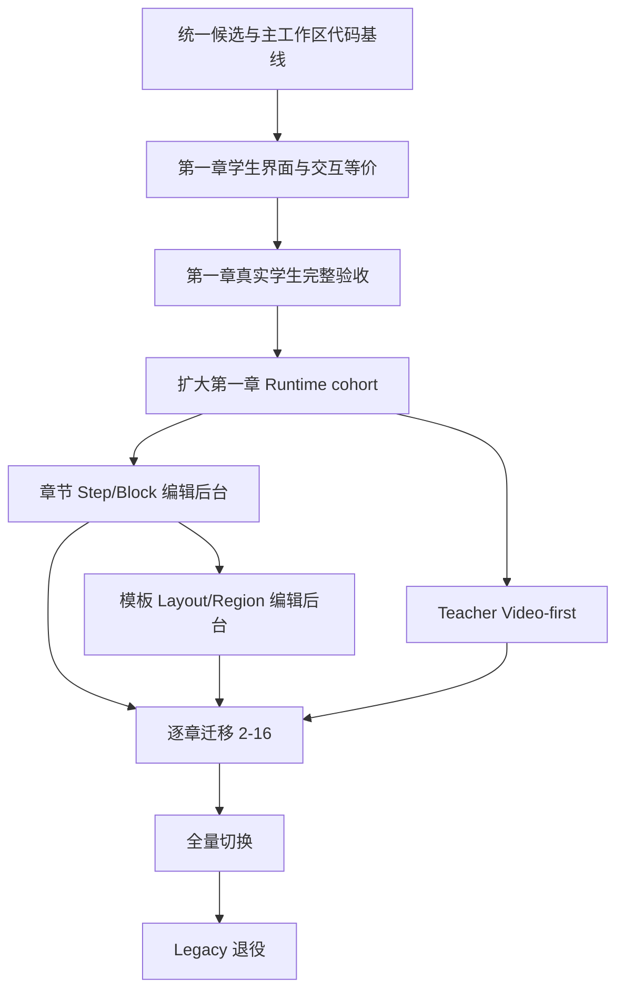

# UPLY 智能教材重构完成状态与收口路线

> 日期：2026-09-11  
> 用途：不再回顾 Phase 过程，只回答三件事：已经完成什么、尚未完成什么、未完成项怎样才算真正完成。

## 1. 当前总判断

| 层次 | 当前状态 | 判断 |
|---|---|---|
| Runtime 与发布底层 | 基本完成 | 可以继续使用，不应再大改架构 |
| 第一章数据转换 | 完成 | 8 Step、19 Activity、orientation 三题、v23 均保留 |
| 第一章领域执行能力 | 技术链基本完成 | 判题、进度、听力、录音、Teacher 已有服务边界 |
| 第一章学生界面 | 部分完成 | 能进入、能加载，但视觉和部分操作体验未与旧版等价 |
| 后台内容制作 | 未完成 | 仍没有目标形态的 Template/Region、Step/Block 编辑器 |
| Teacher Video-first | 未完成 | 第一章仍运行 legacy 金老师兼容模式 |
| 其他 15 章 | 未完成 | 尚未逐章 Adapter、发布和验收 |
| 全量上线 | 未完成 | 当前仅第一章指定测试范围进入新 Runtime |

现在最重要的不是继续扩展底层，而是把**第一章学生端做到产品可用和旧功能等价**。

## 2. 已完成总账

### 2.1 Manifest 与契约

已完成：

- Lesson Manifest v1 类型与严格 Validator。
- Layout、Region、Step、Block、Navigation、Runtime Target 契约。
- 25 种 Block Type 的闭合 props schema。
- 禁止未知字段、任意 HTML/JS/CSS、答案和私密 object key。
- 稳定 target identity，不依赖标题、数组 index、DOM selector 或 page number。
- identity-only、required、conditional target capability 语义。

完成标准：**已达到。** 后续只允许针对真实缺口做小修，不应重开 Schema 设计。

### 2.2 第一章 Legacy Adapter

已完成：

- 8 个旧 module 转换为 8 个 Step。
- 19 个真实 Activity 全部识别。
- orientation 三道单选题全部保留。
- vocabulary、grammar、patterns、dialogue、listen_speak、read_write、review 均有转换去向。
- v23 的 8 个 Teacher node、virtualCharacter、speech、blackboard 进入兼容层。
- 2 track / 14 segment guided repeat 使用稳定身份映射。
- conversion report、private binding、speech proof 和 readiness proof。

完成标准：**第一章已达到。** 其他章节不能直接宣称复用完成，仍需逐章转换验证。

### 2.3 Runtime Core

已完成：

- RuntimeRoot / LessonRuntime。
- TemplateRenderer、RegionRenderer、StepController。
- BlockRegistry、BlockRenderer、TargetRegistry。
- Step 切换、resume、generation、dispose、异步结果隔离。
- reveal、focus、highlight、play、open 的 capability 检查。
- Preview 与正式运行共用同一 Runtime 结构。

完成标准：**内核已达到。** 当前缺口主要在具体表现组件，不在 Runtime Core。

### 2.4 Learning 领域链

已完成：

- 活动提交继续调用服务器判题。
- attempt、feedback、completion 仍由服务器决定。
- activity page、guided repeat、speaking evidence 历史状态投影。
- listening、transcript、media 授权服务边界。
- recording、roleplay、speaking introduction 的 Runtime service contract。
- 浏览器不能提交 studentId、tenantId、score、correct 或 answer key。

完成标准：**第一章服务边界基本达到。** 尚需在真实学生 UI 中逐项明确每个流程的操作等价性。

### 2.5 Recording / Speaking Evidence

已完成：

- 新录音以 R2 为 canonical backend。
- 历史 Supabase Storage 兼容读取。
- evidence proof、原子消费、roleplay 原子完成。
- delete/re-record lifecycle claim。
- gate、drain、fence、epoch 和 cohort 控制。
- Runtime 不直接理解 R2、Storage、RPC 或 object key。

完成标准：**基础设施已达到。** 扩大真实学生范围前仍需完成真实浏览器录音验收和运维确认。

### 2.6 Teacher compatibility

已完成：

- 第一章 v23 legacy Teacher 的 scoped compatibility executor。
- character、pose、speech、buffer、Browser TTS fallback。
- blackboard、studentTask、visualCue、question/feedback、remediation、terminal。
- TTS Observation Grant；播放结束不冒充学习完成。
- Teacher completion 与 Learning completion 分离。
- Teacher 只控制 teaching Region，不拥有全局 StepController。

完成标准：**第一章 legacy 技术执行链已达到。** 视觉表现和 Teacher Video-first 仍未完成。

### 2.7 发布和正式入口

已完成：

- compile、validate、immutable snapshot snapshot/immutable snapshot、published Loader。
- public/private binding、pointer、history 和 durable session。
- dependency fence，避免旧内容读取新答案或新脚本。
- 第一章正式 check/publish 路径。
- 服务器准入：仅第一章、指定 student cohort、依赖满足才进入新 Runtime。
- 非 cohort、其他章节继续旧 Shell。

完成标准：**第一章受限发布与准入链已达到。** 尚未全量开放。

## 3. 未完成总账及完成办法

### 3.1 第一优先级：第一章学生端产品等价

当前问题：

- 新 Runtime 页面能加载，但旧版的大场景图、角色对话卡、页内标签、播放工具、顶部工具栏和细致排版没有完整迁移。
- 当前大量内容以通用卡片或兼容投影显示，视觉层级明显弱于旧版。
- “技术可执行”还没有转化为“学生体验可上线”。

完成办法：

1. 以旧 `KoreanLevelOneSmartTextbook.tsx` 为基准，建立 8 Step 页面级功能清单。
2. 把缺口分成：数据缺失、Renderer 缺失、服务缺失、纯样式缺失。
3. 优先复用或提取旧页面的纯表现组件，不把整个旧 Shell 嵌入新 Runtime。
4. 为场景 Hero、Dialogue Cards、播放工具、学习提示、反馈状态建立 Runtime presentation component。
5. 保持 Manifest、稳定 ID、判题、进度、录音和 Teacher service 不变。
6. 用同一第一章 snapshot 做 Old Shell / New Runtime 对照验收。

完成验收：

- 8 Step 的教学内容、可操作能力和状态恢复逐项 equivalent。
- orientation 三题提交、反馈、刷新恢复正常。
- vocabulary、grammar、patterns、dialogue、listen_speak、read_write、review 不再只是静态投影。
- 场景图、对话角色、逐句播放、整体播放、录音、反馈和导航体验达到产品可用。
- 桌面和窄屏均无布局塌陷、黑屏或大面积空白。
- 无答案、object key、私密 transcript 泄漏。

### 3.2 第二优先级：统一运行代码基线

当前问题：

- 主工作区与 `/home/yangzhen/releases/uply-first-enable-20260910/source` 存在差异。
- 正式入口、admission 服务以及近期 loading/history/layout 修复主要在启用候选中。
- 如果直接在主工作区继续开发，可能丢失或重复应用候选改动。

完成办法：

1. 冻结当前运行候选并记录 SHA/文件清单。
2. 对主工作区自候选基线后的用户修改做逐文件三方比较。
3. 将候选独有业务改动合入一个新的唯一开发基线。
4. 不 reset、不覆盖用户未提交修改、不重复叠加 cumulative patch。
5. 对合并结果运行 Runtime、legacy、TypeScript、build 和 diff-check。

完成验收：

- 只有一个后续开发源目录。
- 当前运行候选的入口、服务和性能修复没有丢失。
- 用户在主工作区的新修改全部可追溯。
- 能从统一基线重新构建出与当前候选语义一致的应用。

### 3.3 第三优先级：第一章真实学生验收和扩大准入

当前问题：

- 目前只是指定测试范围，不代表所有学生可用。
- 已遇到加载失败、转圈和界面退化，说明真实浏览器验收还需收口。
- 录音、麦克风权限、媒体失败 fallback 和刷新恢复需要完整走一遍。

完成办法：

1. 先完成 3.1 的界面等价，不在当前简化 UI 上扩大 cohort。
2. 使用明确测试学生执行 8 Step 全流程。
3. 记录媒体、题目、录音、roleplay、guided repeat、Teacher、刷新恢复结果。
4. 验证非 cohort 和其他章节继续旧路径。
5. 通过后再分批扩大服务器 cohort；客户端不得自行开启。

完成验收：

- 第一章核心流程无 blocking difference。
- Runtime admission、Recording v2 和 snapshot session 对同一测试范围一致。
- 错误状态可诊断，不再只显示“教材会话或服务暂不可用”。
- 扩围有明确停止入口和恢复步骤。

### 3.4 第四优先级：后台章节内容编辑器

当前问题：

- 目标架构要求“章节内容 → Step + Block”，但目前没有完整可视化制作后台。
- platform_owner 可以使用现有教材/教学脚本后台及发布入口，但不能用统一 Block 编辑体验制作新 Runtime 内容。

完成办法：

1. 只允许 platform_owner 进入章节编辑模块。
2. 编辑 Step：title、order、completion、nextStep、region assignment。
3. 编辑 Block：从已真正实现 Renderer 的 Registry 类型中选择。
4. 每种 Block 使用闭合表单，不提供原始 JSON、HTML、JS 或 CSS 编辑。
5. Activity、media、progress、teaching 使用服务器 reference picker，不暴露 secret/object key。
6. Preview 调用与学生端相同 LessonRuntime，tracking disabled。
7. Draft → Validate → Compile → Snapshot → Publish 使用现有 Publisher。

完成验收：

- platform_owner 能编辑第一章的一项非破坏性内容并重新发布。
- 非 platform_owner 无管理权限。
- Preview 与正式 Runtime 使用同一 Renderer。
- 发布失败能准确定位 Step/Block/ref 问题。
- 不允许未实现 Renderer 的 required Block 被发布。

### 3.5 第五优先级：教材模板编辑器

当前问题：

- Manifest 已支持 Layout/Region，但没有目标形态的模板管理 UI。
- 当前实际布局仍主要使用预设和代码样式。

完成办法：

1. 只做受控 preset 编辑：split/stacked、desktopRatio、narrowOrder、teachingCollapsible、supportPresentation、navigationPlacement。
2. Region 限定为 teaching、interaction.main/support/feedback、navigation。
3. 不支持自由坐标、任意 CSS、无限嵌套或 Figma 式拖拽。
4. 模板版本必须被发布 snapshot 固定。
5. 同一 LessonRuntime 提供模板 Preview。

完成验收：

- platform_owner 能创建、预览、版本化并选择模板。
- 模板变更不影响已发布 snapshot，重新发布后才生效。
- 窄屏、桌面布局均通过视觉回归。

### 3.6 第六优先级：Teacher Video-first

当前问题：

- Manifest 和设计允许 video-first，但第一章没有真实 teacherVideo。
- 目前仍依赖 legacy 金老师角色、pose、speech 和 blackboard。

完成办法：

1. 明确视频内容制作规范、字幕、poster、语言、授权和 fallback。
2. 在后台把视频绑定为 Teaching Region 的 video Block/TeachingRef。
3. 验证媒体准入、授权代理、播放完成 observation 和降级显示。
4. 新视频版本和 legacy 版本通过 snapshot 区分。
5. 只有发布内容不再引用 compat.teacher 后，才评估退役角色代码。

完成验收：

- 第一章真实视频资产 ready 且通过发布准入。
- 教学信息和 studentTask/visualCue 与原 v23 等价。
- 无视频或播放失败时使用已定义 fallback，不伪造完成。
- legacy 退役前有引用扫描和回滚方案。

### 3.7 第七优先级：其他 15 章迁移

当前问题：

- 当前 Adapter 和严格 Runtime 证明只覆盖第一章。
- 其他章节不能因为复用同一骨架就视为已迁移。

完成办法：

1. 每章先只读扫描 module/node/activity/media/teaching/profile。
2. 生成 conversion report，任何 unsupported 均阻止 Runtime-ready。
3. 冻结缺少稳定 ID 的 legacy identity mapping。
4. 对每章验证 Step、Activity、media、progress、Teacher 和 completion。
5. 逐章发布、逐章 cohort 验收，不一次性迁移 15 章。

完成验收：

- 每章都有自己的真实 fixture、Adapter proof、private binding 和 snapshot。
- 无悬空 activity/media/progress/target。
- Old/New 教学信息与完成语义对照通过。
- 章节通过后才加入 Runtime admission。

### 3.8 最后阶段：全量切换与 Legacy 退役

当前问题：

- 旧 `SmartTextbookShell`、`ContentRenderer`、skeleton、module panels 和 legacy Teacher 仍被未迁移路径使用。
- 现在删除会破坏非 cohort 和其他章节。

完成办法：

1. 所有目标章节先完成新 Runtime 验收。
2. 确认没有 published snapshot、route、preview 或后台继续引用旧实现。
3. 扩大 cohort 至全部目标学生并观察稳定期。
4. 先停止新引用，再删除死代码；数据库历史资产按保留策略处理。
5. 删除前建立静态引用扫描、运行日志证据和可恢复版本标签。

完成验收：

- 生产入口不再调用旧 Shell。
- 所有活动、进度、录音、Teacher 和测试通过。
- legacy 删除不涉及数据清空或历史证据丢失。

## 4. 推荐执行顺序



不要先做：

- 继续扩展 Manifest v2。
- 批量迁移其他 15 章。
- 删除旧 Shell 或 legacy Teacher。
- 在第一章 UI 未收口前全量开放学生。
- 同时开工后台编辑器、视频制作和多章节迁移。

## 5. 下一轮建议任务包

下一轮只做一个任务：**第一章学生端 Old/New 产品等价审计与修复。**

任务边界：

- 不改 Manifest、Publisher、Loader、Recording transaction 和数据库结构。
- 不做后台编辑器、不做 Teacher Video、不迁移第二章。
- 对照旧截图和旧组件，逐 Step 恢复新 Runtime 缺失的表现与操作。
- 优先解决 orientation：首页场景图、对话分组、角色卡、逐句/整体播放、顶部工具和状态恢复。
- 每完成一个 Step 就做 Chromium 对照测试，不等八个 Step 全部写完再验收。

第一阶段完成标志：

> 用户进入第一章时，看到的不再是“技术验证页面”，而是保留旧版教学信息密度和核心交互、同时由新 Runtime/Manifest/服务链驱动的正式学习页面。

## 6. 状态汇总

```ini
manifestContract = complete
chapterOneAdapter = complete
runtimeCore = complete
chapterOneTechnicalExecution = complete
publishAndSessionFoundation = complete
chapterOneStudentExperienceParity = incomplete
templateEditor = not_started
chapterStepBlockEditor = not_started
teacherVideoFirst = not_started
chapters2To16Migration = not_started
fullStudentCutover = not_started
legacyRetirement = blocked_by_remaining_migration
```

## 7. 执行进度（2026-09-11）

第一章学生端等价收口已开始，当前完成第一批安全改动：

- 将首次启用候选中已经验证的 Runtime 页面壳、active Step 重挂载和按需 repeat/recording 加载同步到开发基线。
- `ContentCard` 增加由 Legacy Adapter 的真实 content slot 投影出的闭合 `section` 语义；没有根据中文标题或 DOM 反推类型。
- lead、coach、targets、dialogueGroups、dialogueScenes、vocabulary、grammarCards、patternCards、reading 等获得明确的信息层级和响应式布局。
- 对话句、目标和词汇从连续的大卡片改为可扫描的网格/分组结构；窄屏自动退化为单列。
- Runtime 保持 44px 控件高度、可见 focus、reduced-motion 和底部 Step 横向滚动。
- 按真实 Step 判断是否读取 guided repeat 和 recording，普通 Step 不再无条件加载无关领域状态。

验证结果：TypeScript 通过；Adapter/Runtime 76 项通过；Chromium Runtime 14 项通过；新增表现层测试 3 项通过；`git diff --check` 通过。

第二批完成：orientation 对话分组使用 frozen part ID 切换，支持键盘方向键/Home/End、当前会话刷新恢复；隐藏组保留真实 target owner，Teacher reveal/focus 会展开对应分组。对话采用角色句子卡布局，窄屏单列。

逐句练习及整组播放复用现有授权 target 和 Browser TTS owner，整组播放等待每句真实 `onend` 后才播放下一句。切换组、Step、卸载和 Teacher playback 接管时取消旧队列；不会生成正式完成或进度。未具备真实播放 owner 的组不启用播放按钮。

本轮验证：TypeScript 通过；Phase 4A、4A-2、4A12 隔离 Chromium 共 24 项通过（含整组顺序播放、分组/Step 中止、刷新恢复、Teacher target reveal、原题目/录音/跟读回归）。这些是隔离浏览器验收，不是已登录负责人或学生线上 E2E。

第三批：场景图读取接线已在开发源码完成。依据旧 `KoreanLevelOneSmartTextbook.tsx` 的 orientation/dialogue 节点首个 ready image 规则，新增 `server/scene-image.server.ts`；从同一已授权快照的 source/node/private binding 解析图片，核对 sourceId、revision、access、object identity 和 readiness。pending 不提升，不跨节点补选，不改 Manifest 或稳定身份。

`scene-image` 操作沿用 opaque LearningSession → 当前 Step target → server port；正式服务重新解析已授权 published bundle，owner audit 沿用原 owner session。服务器读取 R2，浏览器只收到有 MIME/大小限制的 Blob；拒绝 SVG/HTML，不传 object key 或 signed URL。`SceneImage` 独立于正文加载，支持错误提示、重试、取消和 Blob 释放，不将图片失败升级为全页内容失败。沿用 UI 技能要求的响应式布局与可访问状态提示，没有另建视觉系统。

隔离验证明确区分：绑定测试使用第一章冻结真实媒体关联；Chromium 使用显式隔离 PNG 字节替代对象存储传输，不是实际线上场景图视觉验收。测试涵盖 ready/pending、跨节点、错 revision/object、重复绑定、大小/MIME、取消、图片失败保留三道题、重试及 Step 切换释放。当前开发目录与运行候选仍未合并，本轮没有访问远端媒体。

第三批最终结果：TypeScript、`git diff --check` 通过；场景图服务 3 项、会话边界 5 项、表现层 3 项通过；4A/4A-2/4A12 Chromium 合计 25 项通过（分别运行，非全仓完整回归）。新增图片测试最初暴露测试场景保留 active Step、旧隔离服务缺少图片 port 两项问题，修正测试隔离和补齐真实绑定解析后的隔离图片传输，再次运行通过，没有降低断言。

第四批：新增 `RuntimeToolbar`，读取 Manifest 章节名、navigation.items 中当前 Step 位置和 RuntimeContext 当前语言；浏览器 Fullscreen API 支持进入/退出，监听系统退出全屏并清理监听，不重建学习状态。响应式布局保留清晰位置标识和可访问控件。本批使用 UI/UX 技能的键盘、状态提示与小屏布局检查，不新建视觉系统。TypeScript 和隔离 Chromium/表现层测试结果见本轮记录。

语言当前仅展示会话实际语言，不冒充切换器：服务端 durable session 保存 locale，必须先接通原偏好与会话更新语义。返回课程必须由正式宿主已有 `courseDirectoryHref` 提供，不能从 Manifest 或浏览器历史猜目的地。两项仍未接线。

第五批核对：运行候选的 `components/published-runtime-entry.tsx` 存在而主开发目录缺失；候选课程页调用 `<PublishedRuntimeEntry />` 未传 `courseDirectoryHref`。开发 Runtime 已增加可选 `backHref` 宿主属性（Root → Classroom → Toolbar），只接受内部课程地址及既有 `?course=<slug>` 格式，未提供时不猜测目的地。正式合并时必须将课程页的 `courseDirectoryHref` 经 PublishedRuntimeEntry 传入 LessonRuntime，不能把“组件支持返回链接”当成线上接线完成。本轮没有回写运行候选。

语言服务证据：原 `saveSmartTextbookPreferenceAction` 保存 interface_locale/support_mode，durable session 只在 issue 时读取该偏好；直接修改客户端 context 会使服务端题目和教师语言不同步。因此语言切换仍待正式入口的会话重建与旧任务清理接线，未制作假按钮。

仍未完成：将这些源码改动与当前运行候选核对并发布、真实场景图的上线视觉验收、语言切换/返回课程，以及八个 Step 的逐页视觉对照。因此不能标记 `chapterOneStudentExperienceParity=complete`。没有修改数据库、发布快照、服务开关或生产进程。

第六批更新（覆盖上段的接线待办）：已在 `/tmp/uply-student-ui-integration.bUmZfS` 完成与实际运行候选的隔离整合；返回课程接入原课程地址，中韩切换复用原偏好服务并撤销/重建会话，未在活动会话上伪改 locale。全仓回归 1203/1203、独立 TypeScript 和隔离构建通过。累计补丁与证据见 `SMART_TEXTBOOK_STUDENT_UI_INTEGRATION.md`。真实图片/八 Step 逐页视觉验收和部署仍待完成；线上未自动更新，`chapterOneStudentExperienceParity` 仍为 incomplete。
