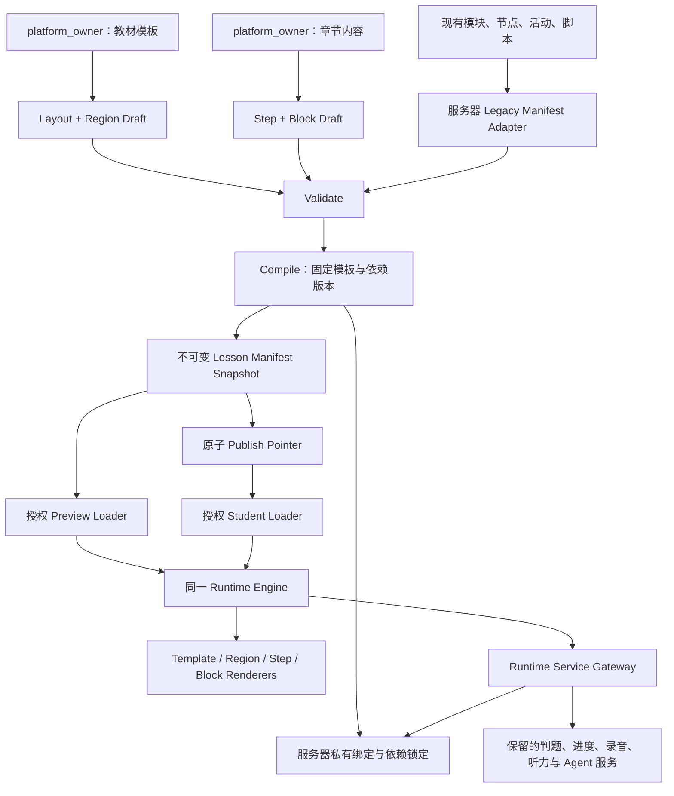

# UPLY Lesson Manifest v1 / Runtime Engine v1 设计

日期：2026-09-08。状态：设计提案，尚未实现；本文中的接口、类型、发布快照和新 Runtime 模块均为目标契约，不表示代码已具备这些能力。

## 1. 基线、原则与决策约束

### 1.1 实际采用的基线

- 现状审计：`docs/SMART_TEXTBOOK_CURRENT_STATE_AUDIT.md`。
- 去留决策：工作区实际文件为 `docs/SMART_TEXTBOOK_TARGET_STATE_AUDIT.md`。上一阶段误用了此文件名，用户约定的 `docs/SMART_TEXTBOOK_TARGET_STATE_DECISIONS.md` 当前不存在。本文采用现有去留报告内容及本次用户明确列出的决策；不另行重命名或改写基线。
- 本次只读复核：第一章 orientation 的 published script 仍为 v23，共 8 个节点，8 个含 `virtualCharacter`，0 个含 `teacherVideo`。orientation 实际有 3 道单选题，并非示例中的一题就是全部任务。

本阶段只增加本设计文档，不创建 schema 文件、数据库表、migration、React 组件或 Runtime 服务。

### 1.2 不变原则

1. Manifest 是后台编译结果与学生渲染之间唯一的**课程结构契约**。学生端不查询、解释后台编辑表；个性化进度、媒体授权、判题和 Agent 会话通过稳定服务接口补充，不能被理解成“所有状态都塞进 Manifest”。
2. 教材内容与模板分离：模板定义 Layout / Region；章节定义 Step / Block。发布时两者展开成自包含快照，Runtime 不再实时查询模板最新版本。
3. 服务器拥有正确性、attempt、录音证据和正式完成状态。客户端拥有当前可见 Step、播放位置、未提交输入等临时状态。
4. 兼容以章节/发布快照为单位推进。可以第一章先接入，其余章节继续旧路径；禁止要求一次性迁移 16 章。
5. 同一 Manifest、同一 Renderer、同一能力 Registry用于 Preview 和 Production。身份授权、数据版本与 tracking policy 的区别不得演变成不同页面实现。
6. V1 默认视频教学，legacy 角色仅作为隔离兼容能力。当前生产数据未经等价承接前，所有 RETIRE 资产保持运行。
7. 运行数据采取类型白名单。禁止向 Manifest 任意展开 `content`、`configuration`、`public_config`、progress 记录或数据库 metadata。
8. 保留现有自然语言标题规则：不生成装饰性 `eyebrow/typeLabel/interactionLabel`；标题补充说明使用 `CardTitleWithHint`，新 Schema 用 `title/hint` 表达学习信息。

### 1.3 与 KEEP / MIGRATE / RETIRE 的对应

| 既定资产 | 决策保持 | 本设计如何承接 |
| --- | --- | --- |
| textbooks / versions / chapters | KEEP | 保留现有主实体、UUID 和课程关系，Manifest 只引用并冻结显示字段 |
| modules / nodes | MIGRATE | 服务器 Adapter 输出 Step / Block；旧表继续提供兼容源和进度关联 |
| activities | MIGRATE | 引用式 Activity Block + 类型化公开投影；不另建判题体系 |
| activity secrets、服务端判题 | KEEP | 保持原私密数据边界及 `gradeSmartTextbookActivity` 规则；服务层校验快照绑定 |
| recordings / speaking evidence / listening tracks | KEEP | 复用现有领域表与服务能力，只适配调用上下文和稳定引用 |
| attempts、node/page/repeat progress | MIGRATE | 稳定 progressRef 对应服务器私有旧 ID 映射；不清零历史记录 |
| Shell / ContentRenderer / skeleton / layout 常量 | RETIRE，当前不可删 | 迁移期间留作旧入口与回归基准；Adapter 可读取骨架约定，Runtime Core 不 import |
| Teacher Video | MIGRATE | 成为 Teaching Region 的主要媒体，迁移播放器与媒体安全能力 |
| legacy 角色/图片/pose/镜头 | RETIRE，当前不可删 | `compat.teacher.v1` 受限兼容执行器保留；只有所有发布引用解除才退役 |
| 黑板 | MIGRATE | 新内容为受控辅助视觉；旧坐标画布仅在 compatibility capsule 中解释 |
| Agent 版本、秘密、session/events/tasks | 原决策保持 | 版本/私密判题继续保留，session/target/流转通过 Bridge 接入，不新增 AI 教学决策 |

## 2. 目标架构与后台归属



最终后台只有两个主要制作模块：

| 模块 | 拥有的数据 | 内部能力，不新增第三个主模块 |
| --- | --- | --- |
| 教材模板 | 模板身份/修订、Layout preset、Region 定义、允许的 Block 类别 | 模板验证、版本、使用情况；不持有章节台词或题目 |
| 章节内容 | 章节信息、Step、Block、视频、活动引用、教学编排 | 现有教材编辑和脚本后台能力迁入此处；预览、来源审查、发布检查、回滚 |

所有制作、读取 draft、预览、编辑、上传/绑定媒体、版本管理、发布、回滚均服务端验证 `platform_owner`，并排除 tenant-provisioned account。现有 `manageContent`/题库权限不能作为新写入授权。学生只具有已授权课程的 published 消费和学习提交权限。

模板修改只生成新模板修订。已发布章节使用冻结的旧模板，只有 owner 对该章节重新编译发布才采用新修订。

## 3. Lesson Manifest v1 Schema

### 3.1 版本与标识规则

- `schemaVersion` 固定字符串 `"1.0.0"`。破坏字段语义需要新 major；V1 不容忍未知 schema 或必须能力。
- `runtimeContract` 固定 `"uply-runtime/1"`；`requiredCapabilities` 列出实际用到的 renderer/service capabilities。
- `snapshot.id` 标识一次不可变编译结果；不是教材 `version.id`。同一教材版本可产生多个模板/媒体修订快照，但其依赖必须被固定。
- `id` 是不透明、持久的稳定标识；不能从 title、order、数组索引或 DOM selector 推导。示例可使用 `s-orientation` 这样的可读 ID。
- `key` 是章节内唯一的作者可读标识。发布后重排、改标题不改变 id；复制新对象生成新 id。跨版本是否继承 identity 由作者身份映射和兼容校验决定。
- Step id 在章节内唯一；Block id 在章节内唯一，绑定一个 Step；将 Block 移到不同 Step 产生显式 target 别名/映射，不能假装旧 target 未变。
- `order` 是大于 0 的整数，同一集合内不重复。排序按 order；引用用 id，不使用 order。
- locale V1 支持 `zh-CN/ko-KR`；所有学习标题必须有 defaultLocale 的非空值，可回退到 defaultLocale。媒体语种与界面 locale 独立。

### 3.2 顶层结构（设计类型，不是业务代码）

```ts
type Id = string;
type Ref = string; // 只能引用对应 catalog 中存在的 key
type Locale = "zh-CN" | "ko-KR";
type LText = Partial<Record<Locale, string>>;
type RegionId = "teaching" | "interaction" | "navigation"
  | "interaction.main" | "interaction.support" | "interaction.feedback";

interface LessonManifestV1 {
  schemaVersion: "1.0.0";
  runtimeContract: "uply-runtime/1";
  requiredCapabilities: string[];
  snapshot: {
    id: Id;
    contentDigest: string;
    compiledAt: string;
    compilerVersion: string;
    scope: "chapter" | "step-preview";
  };
  textbook: { id: Id; slug: string; title: LText; appId: Id };
  version: { id: Id; number: number };
  chapter: {
    id: Id; key: string; number: number; title: LText;
    scenario: LText; goal: LText;
  };
  localization: { defaultLocale: Locale; locales: Locale[] };
  template: { id: Id; key: string; revision: string };
  layout: LayoutV1;
  regions: RegionV1[];
  steps: StepV1[];
  blocks: BlockV1[];
  navigation: NavigationV1;
  completion: { authority: "server"; chapterPolicyRef: Ref };
  runtimeTargets: RuntimeTargetV1[];
  mediaRefs: MediaRefV1[];
  activityRefs: ActivityRefV1[];
  progressRefs: ProgressRefV1[];
  teachingRefs: TeachingRefV1[];
  compatibility: {
    profile: "native" | "legacy-adapted" | "mixed";
    adapterRevision: string | null;
  };
}
```

`contentDigest` 为规范化语义内容的 SHA-256（`sha256:` + 64 位十六进制）：计算时排除 snapshot 整段，其他数组先按约定稳定排序、对象 key 稳定排序。对象文件本身另有字节校验值，由发布服务保存。id/compiledAt 变化不得伪装为内容改变；两者也不成为客户端授权依据。

Published Manifest 没有“当前用户”“tenant”“session”“signed URL”“isCompleted”“当前题答案”等值，也不包括 service endpoint URL 或数据库表名。它可以通过授权后缓存，所有个性化响应必须隔离用户与空间。

`scope=step-preview` 只供 owner 检查片段，不能发布为整章。Production 必须 `scope=chapter` 且完整覆盖章节任务；Preview 也可以加载完整 chapter snapshot。

发布状态位于服务器 release record/pointer，而非可编辑 Manifest `status`。编译候选在 Publish 前可具有最终 immutable bytes，Publish 只改变服务器指针。学生不能仅因知道 snapshot id 就访问未发布候选。

### 3.3 引用目录

| Catalog | 必需字段 | 用途与边界 |
| --- | --- | --- |
| `mediaRefs` | `id, kind, revision, readiness, access, language, alt` | kind 为 image/audio/video/captions；revision 是不透明媒体修订；不含 object key、签名 URL、私密 transcript |
| `activityRefs` | `id, activityId, revision, type, publicPresentation` | activityId 为现有领域身份；publicPresentation 是冻结的类型化题干/选项/说明；不直接展开 public_config |
| `progressRefs` | `id, kind` | kind 为 activity/node/activity-page/guided-repeat/chapter/teaching；服务器私有绑定表解释实际 old ids、版本及聚合规则 |
| `teachingRefs` | `id, revision, mode, entryCueId` | mode 为 legacy/video-first；指向固定脚本 revision，不使用 latest published；内部控制数据受会话权限保护 |

`MediaRef.readiness` 为 ready/pending/rejected；pending/rejected 允许进入 draft Preview 的同一 renderer 占位状态，禁止成为正式发布中的必需媒体。`access` 为 lesson/teaching-turn/after-attempt。反馈视频、答案相关字幕采用后两类授权；不能通过遍历 Manifest 引用提前取得。

`ActivityRef.type` 用现有领域枚举：single_choice、multiple_choice、fill_blank、ordering、listening、speaking、writing、self_check。和 Block type 的命名转换见 Registry 表。

`publicPresentation` 至少包含 `prompt:LText, instruction:LText, options:Array<{id,text}>, settings`；settings 按活动类型使用白名单，例如 shuffle/showScore、公开的评分量规、播放限制。option id 在首个 Adapter 版本中映射旧数组位置并固定到 activity revision；不得把正确性嵌入 option id 或 label。

数据重复规则：活动题干/选项只在 activityRefs 保存一次；Activity Block props 只持有 ref 和 presentation preset。章节公共信息只在顶层保存；不要复制在每个 Block。媒体 bytes 不入 Manifest。

引用类型补充：

```ts
interface MediaRefV1 {
  id: Ref;
  kind: "image" | "audio" | "video" | "captions";
  revision: string;
  readiness: "ready" | "pending" | "rejected";
  access: "lesson" | "teaching-turn" | "after-attempt";
  language: Locale | null;
  alt: LText;
}
interface ActivityRefV1 {
  id: Ref;
  activityId: Id;
  revision: string;
  type: "single_choice" | "multiple_choice" | "fill_blank" | "ordering"
    | "listening" | "speaking" | "writing" | "self_check";
  publicPresentation: {
    prompt: LText;
    instruction: LText;
    options: Array<{ id: Id; text: LText }>;
    settings: object; // 必须按 activity type 闭合校验，不能透传旧 JSON
  };
}
interface ProgressRefV1 {
  id: Ref;
  kind: "activity" | "node" | "activity-page" | "guided-repeat" | "chapter" | "teaching";
}
interface TeachingRefV1 {
  id: Ref;
  revision: string;
  mode: "legacy" | "video-first";
  entryCueId: Id;
}
```

所有 `completion.policyRef`、`completion.chapterPolicyRef`、`practiceRef` 均引用 `progressRefs.id`，chapterPolicyRef 必须为 chapter kind；其实际规则及旧 ID 绑定只在服务器解析。`playbackPolicyRef` 由其媒体/活动引用的服务器绑定提供，编译时必须解析成功，不接受任意策略名称。教学 cue 与 capsuleRef 在对应 teachingRef 的固定版本服务契约中解析，不按客户端字符串选择数据库表。

答题选项的外语文本可只提供教学语种，无须把韩语答案翻译成界面语言；必需 defaultLocale 的规则针对界面标题/题干而非强制改写外语教学内容。Locale 切换不得改变 option id 或判题映射。

### 3.4 结构不变量

1. 顶层必需字段齐全；未知字段拒绝，不能透传为 HTML 属性。
2. 所有 id/reference/type/region/progress target 必须可解析，不能出现悬空引用。
3. 每个 Block 恰好属于一个 Step 和一个允许的叶 Region；任何重复 placement 均拒绝。
4. Step.regions 的 placement 与 Block.region 必须一致，二者不是两份可独立编辑的事实。
5. 每个 Block 的 runtimeTarget 恰好对应一条 root target；重复 target、未知 partId 均拒绝。
6. 正式快照的目标 renderer 不支持必需 Block 或能力时整体拒绝激活，不能悄悄跳过题目或宣告完成。
7. 编译后的所有必需 activity、progress、media 和 teaching 引用必须有服务器依赖绑定。opaque ref 不是匿名可访问的凭证。

## 4. Template / Layout / Region

### 4.1 Layout 契约

```ts
interface LayoutV1 {
  preset: "split-classroom" | "stacked-classroom";
  desktopRatio: "30-70" | "40-60" | "50-50";
  splitBreakpoint: "xl"; // V1 Registry 定义为 1280px
  narrowOrder: ["teaching", "interaction"];
  teachingCollapsible: boolean;
  focusPolicy: "manual" | "teaching-phase";
  supportPresentation: "inline" | "drawer";
  navigationPlacement: "bottom";
  density: "comfortable";
}
interface RegionV1 {
  id: RegionId;
  role: "teaching" | "interaction" | "navigation" | "main" | "support" | "feedback";
  parent: "interaction" | null;
  content: "blocks" | "regions" | "runtime-navigation";
  allowedBlockTypes: string[];
}
```

V1 是枚举 preset + 有界参数：不存在任意 CSS、style 字符串、HTML、坐标、z-index、脚本或用户自定义断点。30/70 可作为兼容模板的初值，但不再是所有章节共享的强制常量。

### 4.2 Region 有限树

```text
Lesson
├── teaching                       叶 Region：教学媒体/兼容教师
├── interaction                    容器，不直接放 Block
│   ├── interaction.main           必需：主要学习内容和任务
│   ├── interaction.support        可选：提示/辅助内容
│   └── interaction.feedback       可选：反馈的显示位置
└── navigation                     Runtime 导航，不接受作者 Block
```

只允许上述 root + 一层 interaction children；`parent=teaching`、自定义子子 Region、同名多份 main 都非法。复合 Block 自己的 tab/panel 不是 Region，更不能再嵌入 Block 数组。

每个模板必须有 teaching、interaction、interaction.main、navigation。support/feedback 可选。未定义 feedback Region 时，反馈显示在所属 Activity Block 内；定义后该 Region 作为同一 Block 的反馈投放位置，不复制 Block 或另外创建完成记录。

隐藏规则：focus 只改变可见性，不改变完成要求。Agent 要求操作时先恢复 interaction、展开必要 support/内部 panel，再聚焦 target。narrow 模式不允许把唯一可操作任务长期隐藏；navigation 始终可定位、键盘可达。

Legacy 黑板/角色自带坐标不进入 LayoutV1；只在隔离兼容视窗内部保留。新后台模板没有这些坐标字段。

## 5. Step 定义与导航

```ts
type CompletionConditionV1 =
  | { kind: "none" }
  | { kind: "server"; policyRef: Ref };

interface StepV1 {
  id: Id;
  key: string;
  title: LText;
  hint?: LText;
  order: number;
  regions: Array<{ region: RegionId; blockIds: Id[] }>;
  completion: CompletionConditionV1;
  nextStep: Id | null;
  teachingRef: Ref | null;
}
interface NavigationV1 {
  region: "navigation";
  entryStep: Id;
  items: Id[]; // 唯一、完整，按 Step.order 排列
  mode: "linear";
  access: "free" | "completed-prefix";
  previous: "allowed";
  autoAdvance: false;
  resume: "stable-id";
}
```

V1 的 nextStep 只能是 order 的直接下一步，末步为 null；不支持跨步条件分支、循环、DAG。返回上一 Step 由导航处理；remediation 作为当前教学任务中的短暂补充讲解，结束回原任务，不修改全局 nextStep。

Adapter 保留现有自由 module 导航：使用 `access=free`。完成度和允许切换是两回事，不得偷偷改为解锁后才能看下一步。native 可选 completed-prefix，由服务器根据正式完成返回可访问 Step；UI 禁用不是唯一校验。

Step.regions 只存叶 Region 的 Block id 列表，并按 Block.order 排序。navigation 不放入 Step.regions，始终由 Template Renderer 挂载一次。无内容的可选 Region 可省略；不得对同一 Block 同时写入 main/support。

Step.order 在章节内唯一；Block.order 在同一 Step 的同一叶 Region 内唯一，因此 teaching 的 order=1 与 main 的 order=1 不冲突。

普通迁移 Step 使用 `kind=server` 指向现有 node 完成聚合策略；展示 Block 用 none。kind=none 的原生说明 Step 允许浏览、不产生正式分数；服务器将其排除在章节完成分母外，不靠“客户端访问过”判定章节完成。

## 6. Block 定义与 Registry v1

### 6.1 Block 公共字段

```ts
interface BlockV1 {
  id: Id;
  stepId: Id;
  type: string; // 必须在下表 Registry 中，不能是任意字符串执行器
  region: RegionId;
  order: number;
  title?: LText;
  hint?: LText;
  props: object; // 必须通过对应 type 的闭合 props schema，下表是规范
  completion: CompletionConditionV1;
  runtimeTarget: string;
}
```

此处 props/object 是设计类型的汇总占位，不是允许 `Record<string,unknown>` 透传；实施时必须生成闭合的 discriminated union 与逐类型校验。Registry revision 由 Runtime capability 固定，不从远程 URL 动态执行注册代码。

每个 registry entry 同时声明 props validator、允许 Region、renderer、内部 part/capability、progress kind、migration reader 与 dispose 行为；缺一不可。Block 不自行读取 Supabase，不 import 后台 actions 的数据行类型。通过 Runtime services 提交 activity、获取媒体、记录 progress。

### 6.2 第一版类型表

表中 `ref` 必须指向顶层 catalog；`parts` 均有持久 id；所有文字使用 LText 或带语种的内容段。

| Block type | 闭合 props 核心字段 | Region | 现有复用来源 / Adapter | 完成与复合边界 |
| --- | --- | --- | --- | --- |
| `video` | mediaRef、posterRef?、captionsRef?、safeTranscript?、role=teacher/content、fallback=text/retry、startPaused | teaching/main | TeacherVideoPlayer、teaching-video helpers | 默认 none；ended 不是题目完成；不能用丢失视频自动计分 |
| `image` | mediaRef、alt、fit=contain/cover | teaching/main/support | node.media 与 Next Image | none；alt 必需 |
| `text` | paragraphs:LText[] | teaching/main/support | lead/coach/目标等白名单投影 | none |
| `rich_text` | document:安全文档 AST | teaching/main/support | 现有文本转 paragraph；新富文本 renderer 尚需实现 | AST 仅 paragraph/list/text/strong/em/link/lang，固定最大深度 4，无 HTML/JS/CSS |
| `audio` | mediaRef、safeTranscript?、playbackPolicyRef? | teaching/main/support | 词汇/例句 audio | none 或 server task policy；播放上限由领域服务确认 |
| `dialogue` | groups[{id,title,lines[{id,speaker,text,translation?,mediaRef?}]}] | main/support | dialogueGroups/dialogueScenes | 内部 tab/line 是 part，不是任意子 Block |
| `multiple_choice` | activityRef、presentation=single/cards | main | 旧 `single_choice` → Activity | 服务端正确性/attempt；注意名称转换 |
| `multiple_select` | activityRef、presentation=single | main | 旧 `multiple_choice` → Activity | 服务端多选判题；不能误用单选 renderer |
| `fill_blank` | activityRef、presentation=inline/form | main | 旧 fill_blank | 服务端 text/array 规范化保持 |
| `ordering` | activityRef、presentation=list/expression | main | 旧 ordering / pattern-order | 复用服务器顺序判定 |
| `listening` | activityRef、tracks[{id,mediaRef,exercisePartIds}]、playbackPolicyRef | main | Listening Activity + listening_tracks | Composite：分页、限次、稿件、答题不可随意拆散 |
| `shadowing` | practiceRef、tracks[{id,segments[{id,text,mediaRef}]}] | main | repeatTracks / guidedRepeat | Composite；不生成虚假的发音评分 |
| `pronunciation` | activityRef、modelMediaRef?、rubric:LText[] | main | speaking / RecordingControl | V1 为录音+自查，不引入新发音评分服务 |
| `role_play` | activityRef、scenes[{id,roles,turns}]、recognition=optional | main | DialogueRoleplayPractice | Composite，录音证据与整轮完成保持；识别缺失可降级 |
| `writing` | activityRef、scaffold?、rubric:LText[] | main | writing / ReadWriteLearningPanel | 服务端字数/句数/确认项，不新增 AI 评分 |
| `self_check` | activityRef、returnTargets[{itemId,target}] | main | self_check / review | 所有返回目标显式解析；自查不替代其他证据 |
| `supplemental_visual` | slides[{id,title,items:{kind=text/list/image,texts?,mediaRef?}[]}] | teaching/support/main | 黑板 slides 转顺序语义或固定图片 | 新内容无任意坐标；unsupported 旧画布进兼容 capsule |
| `vocabulary_practice` | entries[{id,word,meaning,phonetic?,mediaRef?}]、activityRefs、panels[{id,title}] | main | 词汇卡、翻卡、练习 | Composite 保留词汇场景和题组 |
| `grammar_practice` | sections[{id,title,explanation,examples}]、activityRefs、panels | main | grammar / grammarCards / rules | 不强制原子化；完整语法数据与音频语义投影 |
| `pattern_practice` | patterns、groups、activityRefs、panels | main | PatternConversation/CompositionPractice | 保留 guided choice、ordering、composition 连续流程 |
| `listen_speak` | listeningRef、speakingRef、practiceRef、tracks、panels | main | ListenSpeakLearningPanel | Composite 中服务调用统一复用 Registry primitives；不再包含 child Block |
| `read_write` | readingRef、writingRef、source、scaffold、panels | main | ReadWriteLearningPanel | 复合完成策略维持旧规则 |
| `review` | activityRefs、progressRefs、returnTargets、panels | main | ReviewResultPanel | 服务器结果聚合；分数/完成度分开 |
| `compat.teacher.v1` | teachingRef、capsuleRef | teaching | legacy teacher runtime 包装 | 只允许 Adapter 生成；新后台不可新增；未来 RETIRE |
| `compat.learning.v1` | capsuleRef、activityRefs、progressRefs、parts | main | 暂时无法规范投影的模块专用渲染片段 | 只允许 Adapter；其私有实现可用旧函数，Core 不读旧 JSON |

`panels` 为有序、非递归的 `{id,title}` 列表；Composite props 必须补齐对应类型的结构校验和迁移覆盖测试后才可宣布该 capability ready。V1 不把“实现尚未完成”当成允许跳过的可选功能。

`compat.learning.v1` 不是把旧 Shell 嵌进新 Shell：兼容 capsule 只能包含该 Step 内容和固定的 part 导航，不拥有顶层 Step 导航、Layout、用户会话或另一套 progress store。旧函数若无法隔离这些依赖，该章节继续 old-shell，不得谎称已完成 Adapter 接入。

### 6.3 复合 Block 的稳定边界

复合 Block 可维护 tab、分页、line、track、role turn 等私有 UI 状态，但要公开持久 partId。不得暴露 page=0 作为长期 target，也不得递归包含另一 Composite Block。内部可复用 React primitives 和服务函数。

同一个 activity 在多个场景出现时必须共用服务器 attempt/evidence；界面 placement 有各自 Block id。编译器按领域 activity revision 去重完成要求，不能重复计入章节进度。默认拒绝无意重复 placement，显式练习重访也不能重置 attempt。

## 7. Runtime Engine v1 模块划分

| 模块 | 输入 → 输出 | 拥有的责任 | 禁止承担 |
| --- | --- | --- | --- |
| Manifest Loader | 经服务器授权的 snapshot selection → validated Manifest + RuntimeContext | 校验版本/capabilities/digest，固定 snapshot，取消旧请求 | 解释编辑表、读取 latest draft、判题 |
| Template Renderer | template/layout/regions → 布局容器 | 受控 preset、响应式、导航位置、focus 可见性 | 查询章节或自行生成八步 |
| Region Renderer | 当前 Step.regions + catalog → 有序叶区域 | allowedBlockTypes 校验、feedback 投放、空区/折叠处理 | 无限嵌套、修改完成要求 |
| Step Controller | navigation + server access/state → activeStepId | next/previous、恢复、切换生命周期、请求取消 | 通过进入某页直接标记完成 |
| Block Registry | type/capability → 闭合 schema + renderer | 编译/运行能力一致、props 校验、兼容类型隔离 | 运行后台提供的 JS 或任意 CSS |
| Block Renderer | Block + runtime context/services → UI + 规范事件 | props 分发、Error Boundary、register/dispose、无障碍 | Supabase 查询、向服务器发送自行计算的分数 |
| Learning State | server projection + client UI state → 状态视图 | pending/confirmed 区分、事件幂等、恢复、version scope | 把本地缓存当正式 progress |
| Runtime Target Registry | manifest declarations + mounted handles → target resolution | reveal/focus/highlight/activate、part mount 状态、命令白名单 | 解析 CSS selector 或 DOM path |
| Media Resolver | snapshot/mediaRef/context → 短期授权播放描述 | 版本固定、Range、过期刷新、feedback/transcript 授权、媒体状态 | 从 props 接受任意 object key/URL |

另有两个服务边界，不是独立 Renderer：

- **Runtime Service Gateway（服务器）**：把稳定 activityRef/progressRef/mediaRef/teachingRef 映射到现有领域表和服务，验证 tenant/student/access/revision，再调用现有判题/录音/听力/进度能力。是旧 ID、私密字段和表 schema 的唯一解释边界之一。
- **Teaching Bridge**：接入当前 Agent 会话和视频/legacy 执行器，把 studentTask/visualCue 转成稳定 target 命令，把有效证据交回 Agent。旧 script 节点、phase、performance 坐标对 Core 不可见。

### 7.1 生命周期

`load → authorize/validate → mount template → restore server state → select Step → mount Blocks → register targets → interact → server confirm → state update`。

切换 Step 前停止旧音视频、取消未完成的 target 命令并提示保存未提交文本/录音；录音上传使用稳定 activity/evidence 归属，不因卸载把证据挂到新 Step。给每次挂载增加 generation token，迟到的 onEnded/submit response 只能更新所属 snapshot/target，不能推动新 Step。

未知 schema/必需 Block：不激活快照，返回可诊断错误。媒体错误：局部错误、重试及明示文本替代。题目服务失败：保留输入、标 pending/error，不伪造成功。跨 snapshot 的 response 拒绝混入当前 Learning State。

## 8. Runtime Target 契约

### 8.1 规范地址

```text
step:{stepId}/block:{blockId}
step:{stepId}/block:{blockId}/part:{partId}
```

服务调用使用 `(snapshotId, target)` 作为完整定位；同一 target 在 Preview/Production 结构相同，授权上下文不同。ID 字符集限制为 `[A-Za-z0-9._-]`，因此不需要自由 URL 解码或路径遍历规则。跨章节定位不拼接任意 URL，先通过受控 chapter 导航。

```ts
interface RuntimeTargetV1 {
  id: string;
  stepId: Id;
  blockId: Id;
  partId: Id | null;
  capabilities: Array<"reveal" | "focus" | "highlight" | "play" | "open">;
  acceptedEvents: Array<"opened" | "media-ended" | "response-submitted" | "practice-confirmed">;
  verification: "ui-only" | "server-attempt" | "server-practice" | "playback-observation";
}
```

Capabilities 是有限列表，不构成任意 Trigger/Action 系统。`play` 只适用于具备媒体的 part；不能用于代替学生答题或代录音。`highlight` 使用固定样式，尊重 reduced-motion；不输出后台传来的 CSS。

### 8.2 声明与挂载分离

Manifest 声明 target 存在，Block mount 时注册运行 handle：`reveal/focus/highlight/play/open/dispose`。handle 可以内部持有 React ref；调用方永远不接收 selector。

target 在其他 Step 或关闭的 Composite panel 中：先由 Step Controller 检查可访问性、切换 Step，再由 Block.reveal(partId) 展开所属 panel，等待挂载后执行命令。不存在/卸载/不支持的 part 返回 TARGET_UNAVAILABLE，Agent 留在当前任务并给可恢复提示；绝不自动标完成。

重排 line 不改 line id；旧 line 没有 id 时，在首次采集的不可变 Adapter source revision 中分配并冻结 ID 映射。后续插入/重排不能重新按 index 分配，需显式沿用 mapping 或 owner 对齐。改变显示区域不改变 target；改变 Step 归属需显式迁移映射。

### 8.3 Event 请求与验证

请求字段：`runtimeSessionId, snapshotId, target, eventId, eventType, generation, evidenceRef?`；不接受 client 提供的 tenant/student、correct、score 或 completionPercent。

服务器逐项检查：调用身份与会话归属、snapshot 授权/固定版本、target 声明与能力、当前 Agent 任务、evidence 对应 activity/版本/归属、eventId 幂等和在途状态。标准 response 返回 `accepted, stateRevision, progressDelta, teachingInstruction?`；重放不能多记 attempt 或重复推进。

证据分级必须诚实：

- `server-attempt`：读取已被判题服务确认的 attempt，而非接受 `activity_completed=true`。
- `server-practice`：复用 guided repeat/roleplay/recording 领域证据；自查是自查，不冒充准确发音检测。
- `playback-observation`：校验服务端签发的播放关联、媒体修订、活动任务、顺序/合理时长及去重。浏览器 ended 不能证明人真的听完，只能作为已授权的播放观察；不能单独提升正式章节分数或判题完成。
- `ui-only`：opened/revealed/highlight 等 UI 事件不计分。

Target.verification 指定其完成相关事件的证据级别；同一 target 的 opened 仍按 ui-only 处理。例如 multiple_choice 的 opened 不要求 attempt，但 response-submitted 必须核验 server-attempt。不能因为同一 target 支持 opened 就降低其提交验证要求。

当前 `/api/learning-agent/events` 会核对 session/node/task target，但事件本身仍由浏览器报告。本设计不把旧接口的存在表述为强播放证明；后续 Gateway 必须补充版本、证据和 replay 校验。

### 8.4 Agent 引用

studentTask 保存目标地址和允许事件；visualCue 指向同一地址；response 路径由服务器从活动 ref 得到，而不由 Agent 选 DOM。

已有 `dialogue:greeting:0`、`orientation:page:diagnosis`、`activity:{id}` 等旧 key 仅在服务器 Adapter/Teaching Bridge 的 alias map 中存在。page 级 alias 映射到 Composite root/reveal-part；虚构一个不可点击的目标以通过验证属于编译错误。

## 9. Legacy Manifest Adapter

### 9.1 位置与产物

Adapter 在服务器运行，不在浏览器通过旧 loader JSON 动态猜测类型。

```text
Legacy Data + 固定版本骨架解释 + 必要的章节覆盖配置
  → 类型化投影 / 兼容 capsule
  → Validate / Compile
  → Lesson Manifest v1 + 服务器私有 bindings
  → Runtime Engine v1
```

同一 Adapter revision 对同一 source revision 必须产生相同语义 digest。Production 不在每次打开章节时从可变旧行重新生成不同 Manifest；首次接入先编译、验证和发布快照。

### 9.2 映射规则

| Legacy 输入 | Adapter 读取/处理 | Manifest 输出 | 长期地位 |
| --- | --- | --- | --- |
| textbook/version/chapter 主实体 | 保留 IDs、白名单字段、发布关系 | 顶层 textbook/version/chapter | KEEP 实体；显示值冻结 |
| module.id/code/title/sort_order | 稳定 ID 对应、code 仅作识别、排序 | Step.id/key/title/order/nextStep | 未来 Step 是新作者 schema；不继续限制八类 |
| node.id/content | 用已知 profile 解释每个字段与顺序 | 标准 Block 或受限 Composite/capsule | node/content 只作兼容源，未来新 Block.props 闭合 |
| activity.id/type/options/config | 枚举转换、公开字段白名单、固定顺序 | activityRefs + Activity Block | 领域 activity 保留；页面定位迁移 |
| media object_key/status | 私有对象身份绑定，过滤待产出资源 | mediaRefs + Resolver binding | object_key 不入作者运行 props |
| module 内 pages 和 pageLabels | 读固定骨架，编译成 Composite.panels/显式 Block | 稳定 panel/part id | 旧页号只留私有 mapping，不入 target |
| chapterOneKnowledgeMap | 按迁移 profile 保留真实学生 footer 标题覆盖 | Step.title；原 module 标题可留内容标题 | 新内容只有作者明确指定的标题，不在 Runtime 覆盖 |
| chapterZeroOutline / CourseOverview | 显式提取既有内容或 scoped compat.learning | chapter 0 Step/Block | 不能因为来自 React 而遗漏 |
| script versions/nodes | 固定发布 revision，白名单教学投影 | teachingRefs / video / compat.teacher | script secret 不进公开 Manifest |
| virtualCharacter/performance 坐标 | 仅服务器兼容 capsule reader 读取 | opaque capsuleRef | 纯兼容资产，不进入新作者 schema |
| display.slides 旧坐标 | 可确认等价则转语义视觉；否则冻结 legacy capsule | supplemental_visual 或兼容 stage 内画布 | 新作者只允许语义视觉/媒体，无自由坐标 |
| old progress IDs/page/track indices | 建立版本化私有映射 | progressRefs | 继续原表，逐项映射，不清零 |
| Agent old target key | 全量 alias 校验 | 稳定 runtimeTargets/Bridge 映射 | 只供 Adapter 读取 |

### 9.3 Adapter 字段与真正新 schema 的分界

**只在兼容层存在**：module_code 的固定枚举语义、node_code 的 renderer dispatch、`pattern-*` activity key 特判、content 的旧松散 key、数字 pageIndex/trackIndex/segmentIndex、旧 DOM/page target、角色坐标/pose、旧 layout 常量。Core 不得新增这些依赖。

**成为 v1 公开运行 schema**：schemaVersion、snapshot identity、模板修订、受控 Layout、Region、Step 身份/顺序/placement、闭合 Block types/props、navigation、completion policyRef、runtime target/capability、media/activity/progress/teaching 引用。

**成为未来后台作者 schema 概念**：Template revision + Layout/Region，Chapter content revision + Step/Block。它们经编译投影到公开 Manifest；不意味着后台必须采用同名表。本文不设计 SQL 或持久化表布局。

**只在服务器运行绑定里存在**：旧模块/节点 FK、媒体 object key、正确答案、私密反馈、受控 transcript、进度聚合依赖、legacy target alias、活动/脚本精确 revision 解析。它们不是另一套可供学生读取的课程结构。

### 9.4 无损覆盖与失败行为

Adapter 输出 conversion report：每个 node key、activity、media、target 的 converted/preserved-in-capsule/unsupported 状态。不能静默丢弃未知字段、空翻译、必需活动或未覆盖的视频 turn。

unsupported 的发布章节继续旧 Shell，记录阻止接入的具体 node/path；不得先发布一个空 Block。新 Runtime 兼容 capsule 仍无法运行的内容，也必须保持旧入口。章节路由切换由服务器 release pointer 决定，不依据前端“解析失败试试看”选路。

## 10. Teacher Video 与 legacy teacher 共存

### 10.1 三种迁移状态

| 状态 | 章节播放器 | Teaching Region | 选择依据 |
| --- | --- | --- | --- |
| 未接入 | 现有 SmartTextbookShell | 现行 legacy/video 行为 | 尚无可用 v1 chapter release |
| 已适配、未视频化 | 新 Runtime v1 | compat.teacher.v1 + 固定 legacy capsule | Manifest teachingRef.mode=legacy |
| 已视频化 | 同一 Runtime v1 | video + supplemental_visual + Teaching Bridge | Manifest teachingRef.mode=video-first |

不同 Step 可以分别选择 legacy/video-first；一个 Step 同时只有一个教师控制器，避免双声音和两套 Agent 推进。V1 不要求在同一教学节点混合自动回退到不同控制器。

compat.teacher 隔离 legacy `virtualCharacter + scriptPerformances + speech + blackboard`，沿用角色 route/语音和画布表现；不能访问数据库，也不能接管根 Layout/全局 Step 导航。它通过 Gateway 获取固定 revision 的安全 capsule，私密答案仍在服务器。

Capsule 也是明确版本的运行 DTO，而非原始 `configuration` 或 node 行：`compat.teacher/1` 仅提供当前 cue 的安全台词、受限姿势/舞台数值、画布呈现、已授权媒体引用及有限命令；`compat.learning/1` 仅提供指定 legacy profile 的安全内容投影、parts、activity/progress refs。输入必须逐 profile 校验，禁止秘密字段、可执行代码和任意网络地址。兼容插件只能解释自己固定版本的 DTO，Core 和新作者 schema 不接触这些字段；服务也不能把将来错误反馈提前装入 capsule。

如旧 stage 无法从巨型 Shell 安全隔离，则该章节停留在第一行状态，先完成隔离和回归验收。不能以 iframe 内再运行完整 Shell 冒充只有一个 Runtime。

### 10.2 视频 turn 与脚本版本

复用 `TeachingVideoConfiguration` 现有 explanation segments、task、question、operationFeedback、correctFeedback、incorrectFeedback 与 included-in-explanation 语义；不发明新脚本图。

Teaching Bridge 服务器固定脚本 revision 和当前 cue/phase。需要展示反馈时才授权对应 mediaRef/字幕；Manifest 不内联正确答案视频的全文、可猜测对象键或提前预签名 URL。普通讲解文本可冻结公开，听力测试稿和答案解释继续按服务规则放行。

新 Runtime 的 video Block 接收 mediaRef，通过 Media Resolver 获取播放描述，再复用播放器能力；禁止直接把旧 `{objectKey}` 传进公开 Block.props。

### 10.3 缺视频、错误与完成

- 当前第一章没有教师视频，Adapter 无权生成一个“ready”的 video reference。必须选择 legacy 或创建待补齐的 owner draft。
- 关键讲解视频 missing/stale、台词与视频绑定不一致：禁止发布该 video-first Step。
- 明确允许的文本反馈 turn 不要求强行制作视频，但必须在固定脚本策略中声明，不能误判为资源漏配。
- 网络播放失败可重试；已发布、公开可读的安全台词可提供文本替代并记录 `text-alternative-used`。该记录不是 `media-ended`，不能伪造观看证明。
- 教师视频结束仅推动教学显示节奏；正式 Activity/章节完成仍由服务器领域规则决定。
- 切换 Step/暂停时取消旧播放与 cue；不自动启用 legacy stage，除非该发布快照已明确采用兼容模式。

### 10.4 退役门槛

旧 Shell/角色/pose/speech/character route/legacy blackboard 均继续存在。只有发布依赖、在途 session、历史预览、回滚窗口全部不再引用，且新视频、互动、进度和响应式验证完成后才能提出删除。停用新入口不等于删掉原表或历史资源。

## 11. Learning State 与稳定领域数据

### 11.1 双层状态

**客户端 UI 状态**：activeStepId、Composite partId、草稿输入、播放位置、临时 feedback 面板、pending request。按授权身份 + tenant + chapter + snapshot 保存；不再用只有 textbook id 的 sessionStorage key。

**服务器正式状态**：attempt number、correct/score、meetsCompletionRequirements、node progress、activity page progress、guided repeat、speaking evidence、Agent session/task event。通过 `stateRevision` 和稳定 refs 投影到 UI，不进入共享 Manifest。

恢复先读服务器，再恢复相同 snapshot 的 UI 位置；旧 sessionStorage 的 activeIndex 仅由 Adapter 映射到原 module 对应 Step。跨 chapter 的旧位置无法确认时回入口，不继承错误索引；不清除用户正式完成记录。

### 11.2 映射与服务契约

| 领域来源 | Manifest 中引用 | Gateway 私有绑定/行为 |
| --- | --- | --- |
| digital_textbook_attempts | activityRef/progressRef | activity id + version + tenant/student；复用现有服务端 grader 与 attempt 规则 |
| node progress | node-kind progressRef / Step policyRef | node ids 及原聚合规则，服务器返回确认的百分比/完成 |
| activity page progress | activity-page progressRef / Composite partId | old page_index/item_indices ↔ 持久 partId；不向结构 Manifest复制 answers |
| guided repeat progress | practiceRef / line partId | old track/segment ↔ 稳定 line id；复用现有 Action |
| speaking evidence | activityRef + 服务返回 evidenceRef | 校验归属/大小/格式/消费，复用录音存储及 speaking RPC |
| listening tracks | listening activityRef + track id/mediaRef | old page_index + audio_status + transcript，继续原表原安全逻辑 |
| preferences | RuntimeContext preference projection | 原 tenant/student/textbook 唯一范围；UI语言与媒体语种分离 |
| teaching sessions/events | teachingRef + runtime target | 绑定 script version/current node，映射并去重旧事件 |

V1 语义接口（不是本阶段新增 API）：

- `loadState(runtimeSessionId)` → versioned projection。
- `submitActivity(runtimeSessionId, snapshotId, activityRef, response, idempotencyKey)` → server result。
- `checkActivityPart(..., partId, response)`、`savePractice(..., partId, evidenceRef?)`。
- `recording.begin/read/delete(...)` 委派现有领域服务；客户端不指定其他学生归属。
- `resolveMedia(..., mediaRef)`、`teaching.respond(...)`。

不得简单给旧 Action 增加前端 snapshotId 然后仍按 activityId 读取“最新”答案：服务器先核对 snapshot 依赖，之后才按固定活动数据调用原 grader/RPC。

### 11.3 完成规则

completion.policyRef 在服务器解析为有限、版本化策略，V1 只支持：现有 activity 通过/开放任务满足要求、现有 node 聚合、已知 Composite/page/repeat 规则、章节聚合。无任意表达式、脚本或递归规则语言。

Adapter 必须保留当前服务的完成语义，包括 objective/open activity 的差别、是否计分、现有读写/复盘权重；不能按“所有 Block 各一分”重算。来自同一个 node 的多个 Block 共享 evidence，不重复累计。隐藏 support/feedback、视频播放、文本阅读都不能悄悄改变分母。

一个 Step 从 none 改为 server、增加必需活动或替换题目，必须生成新快照和显式进度兼容判断。仅 Layout/文案修订且领域任务未变可复用旧确认记录；题目/答案发生变化不能自动继承“已答对”，旧 attempt 永久可追溯。

### 11.4 数据泄漏边界

现有 `checkSmartTextbookActivityPageAction` 提交后会返回并存储 `answers/results`，loader 的 pageProgress 也有相应字段。这不等于可把整条 progress 记录塞进公共 Manifest。

新结构编译完全排除 progress、answer_key、正确选项、私密反馈/听力稿；提交后的授权 feedback 由用户态服务按现有教学策略返回。答题后允许揭示某题答案与发布时提前暴露整套 secret 是不同边界。Preview 也不能绕过边界把答案藏在 props 中。

## 12. Preview / Production 共用 Runtime

```ts
interface RuntimeContextV1 {
  runtimeSessionId: string;
  snapshotId: string;
  sourceState: "draft" | "published";
  trackingDisabled: boolean;
  locale: Locale;
  supportMode: "chinese" | "bilingual" | "immersion";
}
```

Context 由服务器鉴权后签发，前端不能通过传 trackingDisabled=false 把 preview 写成生产。相同 snapshot + 相同 locale/support + 相同 state 输入，Renderer 输出应相同。mode 只影响 Gateway 的数据与存储策略，不允许 `if preview then render another component`。

Preview 使用本次 draft 的临时不可变编译快照；刷新编译改变 snapshot id。它不能借用学生的真实 attempt/evidence 来模拟成功。判题仍调用同一服务端规则，以临时会话隔离结果；录音仍复用相同录制/校验能力，预览 blob/evidence 放隔离的临时上下文并可过期，不消费生产 evidence、不写课程进度/首页/正式 Agent messages。

当前部分 preview/recording Action 不具备该隔离上下文，这是未来服务适配的明确工作项。适配完成前相关 preview capability 必须标 unsupported，不能用 fake success 冒充正式录音流程。

Preview 可以加载 legacy teaching 和 video-first teaching，使用 Production 相同 Registry 和兼容 capsule。预览外层可以显示版本、验证错误和 owner 工具栏，但不能修改内部内容布局。

## 13. Publish / Snapshot / Rollback

### 13.1 发布流程

`后台 Draft → Validate → Compile → Lesson Manifest Snapshot → Publish → Student Runtime`。

1. **选择输入**：owner 指定教材/版本/章节、模板 revision、章节内容 revision、脚本 revision，全部明确，不依赖客户端的 latest。
2. **Validate**：结构/引用/类型/权限、所有必需活动、secret 完整、媒体 ready/语种/台词一致、target/进度映射、章节覆盖、requiredCapabilities、无 secret、无未知旧字段丢弃。
3. **Compile**：在一致读版本上展开模板、Adapter 内容、活动公开投影，生成公共 Manifest、服务器 bindings、依赖清单、conversion report。并发修改会造成输入修订不符，拒绝候选而不是拼接新旧数据。
4. **Freeze**：保存不可变候选；固定活动/secret/脚本/媒体依赖。验证后再次核对修订，确保提交时仍一致。
5. **Preview**：owner 用同一 Runtime 检验候选，审查/预览结果绑定精确 digest；draft 后续变化让旧审查不再适用于新候选。
6. **Publish**：仅在所有依赖 ready 后，用 compare-and-swap 原子切换当前章节 release pointer；写发布者、时间、前值/后值和报告身份。候选保存失败不动旧指针。
7. **Student Load**：服务端经过课程授权选定 pointer 对应 snapshot，整个 session 固定该快照。新的 draft 编辑不改变该 session。

只设计逻辑存储职责：Manifest artifact、服务器私有 bindings、publication record/pointer。没有规定数据库新表名或执行任何建表。实现阶段可选择现有存储与事务设施，但必须达到上述原子性和不可变性。

### 13.2 不可变性必须覆盖依赖

公共 JSON immutable 只是第一层。现有 activity 提交代码按 id 重新读 options/public_config/answer_key，媒体 route 也用 object key。仅在 Manifest 附一个 hash 不会阻止服务读到已改变数据。

V1 采用**固定领域行与媒体修订，写入时复制新修订**的原则：

- 一个活动 revision 对应固定的 activity + secret + options/settings + max_attempts + node/version 关系。公共 Manifest 冻结公开投影；私有 bindings 锁定实际行和 revision。保留现有 secret 表和 grader，不创建第二判题系统。
- 被发布快照或可回滚快照使用的源行不能就地编辑。后续 draft 使用独立的新修订/副本，必要时沿用现有 textbook version/chapter 模型建立新的行；原 UUID、历史关系及进度仍保留。只改模板而活动不变时可以复用已固定活动。
- 脚本使用精确 script version，version 下的节点、interaction secret 和 speech 资源同样固定。不能只固定版本号却继续编辑其 node。
- 媒体 revision 对应不可覆盖的对象内容和元信息；重新上传新对象身份。签名 URL 由 Resolver 临时生成，不冻结进 Manifest。
- 每个学生活动请求先校验该 snapshot 授权绑定，然后复用现有服务读取固定行。revision 不符返回 REVISION_MISMATCH，不回退用 latest 判题。

公共 digest 只覆盖公开 Manifest；私密 answer/反馈等依赖校验值只保存在服务器。不能把低熵答案的 hash 放到公共 `revision` 里供离线枚举。目录里的 revision 是不透明标识，服务器将公共快照、私有 binding revision 和发布记录原子绑定。

这是后续实现新发布通路的前置约束，**当前代码尚未保证**这些行的写保护、复制修订和所有管理脚本的一致性。仅“每次请求比较 hash”可以拒绝错误，不能维持可用性；未实现完整固定依赖前不得上线宣称可回滚的 v1 发布。

依赖锁必须覆盖旧后台、批量制作脚本和受控维护路径；绕过应用写入导致漂移，应阻止激活/服务该快照并告警，不能默默修改学生题目。不会在此阶段收紧现有生产 API。

### 13.3 回滚与旧服务可见性

回滚是 pointer 切回已验证的旧快照，不把旧内容复制覆盖到新 draft，也不删除新快照与学生进度。

旧 audio/activity Route 的 published/RLS 校验目前沿着原实体关系执行。不能把仍可回滚快照依赖的版本一律 archived 后，期待这些旧端点继续工作。Gateway 必须保留其授权可见性或在可信服务器上下文中按 release grant 读取固定依赖，再复用领域校验；不得把旧 draft 开放给所有学生以“修复”回滚。

新进入的 session 使用回滚目标；在途 session 默认继续固定旧 snapshot 至结束，除非有显式撤销。撤销时告知重新加载，禁止中途悄悄换题。进度 keyed by 领域 version/activity，不能把两个不等价版本的 attempt 合并。历史资源的保留期包含回滚窗口及未结束 session；没有可用依赖时该快照不可回滚。

## 14. 第一章 orientation 的真实迁移示例

### 14.1 核对过的源记录

| 对象 | 当前值 |
| --- | --- |
| 教材 | korean-level-one-smart；`7100ab2b-72b0-478e-8847-4df9b4485109` |
| 教材版本 | v1；`939ad4f7-3238-425e-91e9-d456c130ca68` |
| Chapter 1 | hello / 你好？ / 안녕하세요?；`cda24fb8-c93b-4a19-9577-4418350ff708` |
| orientation module | `42665398-c41e-4db8-9f0e-9626e126cba8`；数据库标题“课前导航” |
| 当前 footer 标题 | chapterOneKnowledgeMap 覆盖为“初次见面交流目标” |
| 内容 node | mission-map；`9fe730cd-a102-496e-adc5-9973b697af68` |
| 教学 lesson | `0a1ebf2d-d987-4476-8f23-2269799e45df` |
| published script | v23；`feb30ba7-0a5e-4e9f-83e6-8970f715ddd5`；8 个 legacy 节点 |
| 首节点 | step-8-bbfc46；`ca2957d6-b148-4416-a946-1a8e75b130e4` |
| 问候题 | orientation-check；`aafa6ccc-4d4a-4dba-9315-2f30381e8a13` |
| 智敏身份题 | orientation-jimin-occupation；`6c8f70d4-a9be-4d58-b431-fa966b60f463` |
| 王明身份题 | orientation-wangming-occupation；`cb3f6d75-4a6a-4610-84dc-7d19db6ef3a5` |

真实 lead：王明在校园国际交流中心第一次见到智敏，需要先问候，再交换双方姓名与学生身份。

真实 `dialogueGroups.greeting`：王明“안녕하세요?”、智敏“네, 안녕하세요?”。其余 groups 为 introductions、student-status、complete-first-meeting；完整转换必须保留全部对话与媒体，不能只取 greeting。

首节点真实黑板文字：“本章学习路线”，以及“课前导航 → 核心词汇 → 语法讲解 / 句型操练 → 实战对话 / 听说任务 → 读写拓展 → 自测与复盘”。下面示例把文字转语义视觉，不声称已经无损替代原坐标画面。

### 14.2 真实 Adapter 的输出方向

| 旧输入 | 设计输出 | 状态 |
| --- | --- | --- |
| orientation module UUID | `s-orientation` Step，服务器记录双向映射 | 可确定性转换，ID 为示例名 |
| mission-map.lead | text Block `b-scene` | 来自真实内容 |
| mission-map.dialogueGroups | dialogue/适配复合 Block + 稳定 line part ids | 需保留所有 groups/audio/学习事件 |
| 3 道 single_choice | 3 个 multiple_choice Block 或等价题组 Composite | 三题都保留，复用 activity IDs |
| v23 teacher script + virtualCharacter | `compat.teacher.v1` 与 `t-orientation-v23` | 当前真实教学模式 |
| v23 首张黑板 | 兼容画布，或经审核的 supplemental_visual | 不擅自删除坐标与台词同步 |
| 未配置 teacherVideo | 不输出 ready video | Adapter 不生成素材 |
| node progress | `p-orientation-node` | 私有绑定原 node UUID/version，完成规则不变 |
| dialogue:greeting:0 | `step:s-orientation/block:b-dialogue/part:greeting-wangming` | 旧 key 只留 Bridge alias；有媒体时才允许 play |

完整章编译还必须输出 vocabulary、grammar、patterns、dialogue、listen_speak、read_write、review 七个 Step；orientation.nextStep 指向实际生成的 vocabulary Step。原 chapter 0 单独处理。

### 14.3 当前 legacy 片段

以下 JSON 为完整章输出中的**局部投影**，不是可单独发布的完整 Manifest；未显示的 catalogs/blocks/targets 仍必须由编译器补全并通过引用检查。

```json
{
  "compatibility": { "profile": "legacy-adapted", "adapterRevision": "korean-level-one/1" },
  "teachingRefs": [
    { "id": "t-orientation-v23", "revision": "script-v23-fixed", "mode": "legacy", "entryCueId": "cue-opening" }
  ],
  "blocks": [
    {
      "id": "b-teacher", "stepId": "s-orientation", "type": "compat.teacher.v1",
      "region": "teaching", "order": 1,
      "props": { "teachingRef": "t-orientation-v23", "capsuleRef": "capsule-orientation-v23" },
      "completion": { "kind": "none" },
      "runtimeTarget": "step:s-orientation/block:b-teacher"
    }
  ]
}
```

revision/capsule/id 字符串是未来编译结果的示例名，不是当前系统已存在的资源或 API。其服务器绑定指向上述真实 v23，不按字符串猜数据库查询。

### 14.4 视频优先的 owner draft 示例

这一片段是“Adapter 结果 + owner 补齐视频绑定”的目标 draft，**不是对当前数据库有视频的声明**。video mediaRef 明确 pending；完成真实视频制作、审核、资源固定及全章依赖校验前不可发布。示例同时展示教师视频、黑板辅助视觉、正文和一道真实题；另外两题列在总 placement 中，详细题干无需在文档重复。

```json
{
  "schemaVersion": "1.0.0",
  "runtimeContract": "uply-runtime/1",
  "requiredCapabilities": ["video/1", "supplemental_visual/1", "text/1", "multiple_choice/1"],
  "template": { "id": "tpl-classroom", "key": "classroom", "revision": "1" },
  "layout": {
    "preset": "split-classroom", "desktopRatio": "30-70", "splitBreakpoint": "xl",
    "narrowOrder": ["teaching", "interaction"], "teachingCollapsible": true,
    "focusPolicy": "teaching-phase", "supportPresentation": "drawer",
    "navigationPlacement": "bottom", "density": "comfortable"
  },
  "regions": [
    { "id": "teaching", "role": "teaching", "parent": null, "content": "blocks", "allowedBlockTypes": ["video", "supplemental_visual"] },
    { "id": "interaction", "role": "interaction", "parent": null, "content": "regions", "allowedBlockTypes": [] },
    { "id": "interaction.main", "role": "main", "parent": "interaction", "content": "blocks", "allowedBlockTypes": ["text", "dialogue", "multiple_choice"] },
    { "id": "interaction.support", "role": "support", "parent": "interaction", "content": "blocks", "allowedBlockTypes": ["supplemental_visual"] },
    { "id": "interaction.feedback", "role": "feedback", "parent": "interaction", "content": "blocks", "allowedBlockTypes": [] },
    { "id": "navigation", "role": "navigation", "parent": null, "content": "runtime-navigation", "allowedBlockTypes": [] }
  ],
  "steps": [
    {
      "id": "s-orientation", "key": "orientation", "title": { "zh-CN": "初次见面交流目标" }, "order": 1,
      "regions": [
        { "region": "teaching", "blockIds": ["b-teacher-video", "b-route-visual"] },
        { "region": "interaction.main", "blockIds": ["b-scene", "b-dialogue", "b-q-greeting", "b-q-jimin", "b-q-wangming"] }
      ],
      "completion": { "kind": "server", "policyRef": "p-orientation-node" },
      "nextStep": "s-vocabulary", "teachingRef": "t-orientation-video-draft"
    }
  ],
  "blocks": [
    {
      "id": "b-teacher-video", "stepId": "s-orientation", "type": "video", "region": "teaching", "order": 1,
      "title": { "zh-CN": "本章学习路线" },
      "props": { "mediaRef": "m-orientation-video-draft", "role": "teacher", "fallback": "text", "startPaused": true,
        "safeTranscript": { "zh-CN": "欢迎来到韩国语 1 级的学习旅程！这一章我们会一起走过课前导航、核心词汇、语法讲解、句型操练、实战对话、听说任务、读写拓展和自测复盘，一共八个部分。" } },
      "completion": { "kind": "none" }, "runtimeTarget": "step:s-orientation/block:b-teacher-video"
    },
    {
      "id": "b-route-visual", "stepId": "s-orientation", "type": "supplemental_visual", "region": "teaching", "order": 2,
      "props": { "slides": [{ "id": "route", "title": { "zh-CN": "本章学习路线" }, "items": [
        { "kind": "list", "texts": [
          { "zh-CN": "课前导航 → 核心词汇 → 语法讲解" },
          { "zh-CN": "句型操练 → 实战对话" },
          { "zh-CN": "听说任务 → 读写拓展 → 自测与复盘" }
        ] }
      ] }] },
      "completion": { "kind": "none" }, "runtimeTarget": "step:s-orientation/block:b-route-visual"
    },
    {
      "id": "b-scene", "stepId": "s-orientation", "type": "text", "region": "interaction.main", "order": 1,
      "props": { "paragraphs": [{ "zh-CN": "王明在校园国际交流中心第一次见到智敏，需要先问候，再交换双方姓名与学生身份。" }] },
      "completion": { "kind": "none" }, "runtimeTarget": "step:s-orientation/block:b-scene"
    },
    {
      "id": "b-q-greeting", "stepId": "s-orientation", "type": "multiple_choice", "region": "interaction.main", "order": 3,
      "props": { "activityRef": "a-greeting", "presentation": "single" },
      "completion": { "kind": "server", "policyRef": "p-greeting" },
      "runtimeTarget": "step:s-orientation/block:b-q-greeting"
    }
  ],
  "mediaRefs": [
    { "id": "m-orientation-video-draft", "kind": "video", "revision": "unresolved", "readiness": "pending", "access": "lesson", "language": "zh-CN", "alt": { "zh-CN": "本章学习路线讲解视频，待制作" } }
  ],
  "activityRefs": [
    {
      "id": "a-greeting", "activityId": "aafa6ccc-4d4a-4dba-9315-2f30381e8a13", "revision": "legacy-captured-r1", "type": "single_choice",
      "publicPresentation": {
        "prompt": { "zh-CN": "王明和智敏初次见面时先说了什么？", "ko-KR": "왕밍과 지민이 처음 만났을 때 먼저 무슨 말을 했어요?" },
        "instruction": { "zh-CN": "" },
        "options": [
          { "id": "opt-0", "text": { "ko-KR": "안녕하세요?" } },
          { "id": "opt-1", "text": { "ko-KR": "얼마예요?" } },
          { "id": "opt-2", "text": { "ko-KR": "어디에 있어요?" } },
          { "id": "opt-3", "text": { "ko-KR": "감기에 걸렸어요." } }
        ],
        "settings": { "shuffle": false, "showScore": false }
      }
    }
  ],
  "progressRefs": [
    { "id": "p-orientation-node", "kind": "node" }, { "id": "p-greeting", "kind": "activity" }
  ],
  "runtimeTargets": [
    {
      "id": "step:s-orientation/block:b-q-greeting", "stepId": "s-orientation", "blockId": "b-q-greeting", "partId": null,
      "capabilities": ["reveal", "focus", "highlight", "open"],
      "acceptedEvents": ["opened", "response-submitted"], "verification": "server-attempt"
    }
  ]
}
```

省略清单（必须补齐后才是 Schema 实例）：snapshot/textbook/version/chapter/localization、navigation/chapter completion、teachingRefs、七个后续 Step、b-dialogue/b-q-jimin/b-q-wangming 及其目录、所有其他 Block root targets。此 JSON 仅用于评审字段映射，不能直接传给 Production Loader；文档检查只验证 JSON 语法，不误称其通过完整 Manifest 校验。

示例 safeTranscript 仅展示真实首段，完整发布必须覆盖首节点全部台词和后续七个脚本节点所需视频/反馈。instruction 未在本次示例查询中核验，以空串占位；真实 Adapter 必须读取原 instruction，不覆盖已有字段。

`p-orientation-node` 依赖原 node 的全部 3 道活动及既有服务器聚合，不因示例只展开一道题而改成“一题答对即 Step 完成”。数据本身没有明确稳定 line id 的部分按 §8 规则首次捕获并冻结。

### 14.5 实际一次作答链

`b-q-greeting → a-greeting → runtimeSession/snapshot 授权 → 固定 activityId/revision → 现有 grader + activity_secrets → 现有 attempt/progress RPC → p-greeting/p-orientation-node projection → 同一 Block 显示反馈`。

学生发送选中的 option id，Gateway 按固定公开顺序映射原 index，绝不让客户端提交正确 index 或分数。Agent `check-understanding` / `ready-for-practice` 对该活动的引用都解析到相同 activityRef，复用完成证据。

## 15. V1 明确不做的事情

- AI 自动修改 Layout、AI 自动适应式路径或新的 AI 教学决策。
- 无限 Region 嵌套、自由画布坐标编辑、任意 CSS/HTML/JS。
- 任意 Trigger/Action 引擎、复杂 DAG/循环教学图。
- 新判题算法、发音评分、录音系统或另一套学习证据源。
- 强行把听说、角色扮演等 Composite 拆成大量原子 Block。
- 一次性迁移 16 章，或以 Renderer 已存在为由清除 legacy 资产。
- 浏览器直接消费后台编辑表、数据库 JSON 或服务端 secret。
- 为 Preview 单独编写播放器或依靠客户端开关保护权限。

## 16. 后续实现阶段建议（本次不执行）

| 阶段 | 实现边界 | 完成验证后才能进入下一步 |
| --- | --- | --- |
| A：契约与样本 | 落实闭合 schemas/registry、固定 id、正反样本、完整第一章采集 | 拒绝秘密字段/悬空 refs/循环/不支持类型；没有线上行为改变 |
| B：服务及发布基础 | owner-only 授权、固定依赖/COW、Gateway、证据幂等、Preview 隔离 | draft 不影响旧发布、旧题旧答案可用、回滚授权通过 |
| C：第一章 Adapter | 转换全部八 Step、3 道 orientation 题及媒体/target；保留 legacy capsule | 旧数据覆盖报告无丢失，旧新进度等价；不足时仍保留 old-shell |
| D：共用 Runtime | 九模块、Composite、legacy 执行器、Preview/Production 同 Registry | 同输入同渲染、事件/录音/听力/恢复/错误全链通过 |
| E：第一章视频 | owner 制作/绑定/审核所有必要视频，发布 video-first revision | 播放、台词、task、反馈、缺网和文本替代通过 |
| F：逐章接入 | 每章独立 conversion/preview/publish，可混合新旧 | 回滚、历史进度、活动/媒体覆盖均已验证 |
| G：提出退役 | 依赖与请求为零、历史可追溯和回滚窗口满足 | 单独获得后续删除任务授权；本设计不等于删除指令 |

## 17. 架构自查与验证记录

| 用户要求的自查 | 设计结论 | 证据/门槛 |
| --- | --- | --- |
| 是否破坏 KEEP 资产 | 否；主实体/私密答案/判题/录音/听力保留 | §1、§11、§13；复制新 revision 不删除旧 UUID 或旧证据 |
| 是否提前删除 RETIRE | 否；旧入口与受限 legacy 执行器并存 | §9–10；第一章仍 v23 legacy，退役有引用与回滚门槛 |
| 是否要求一次迁移16章 | 否；章节 release 独立切换 | §9.4、§10.1、§16 |
| 是否泄露 activity secret | Manifest 无 secret/私密反馈/受限 transcript；提交后反馈单独授权 | §3.3、§8、§10.2、§11.4；绝不直接传原 public_config/progress JSON |
| 是否两套 Preview/Production Renderer | 否；同 Engine/Registry/兼容插件，仅上下文不同 | §12；隔离写入服务尚需实施，不声称已完成 |
| Runtime 是否重新耦合后台 schema | Core 只读 Manifest 和稳定服务 ref | §7/§9；旧表和坐标被 Adapter/Gateway/compat capsule 隔离 |
| JSON snapshot 是否真的隔离后续 draft | 需要固定全部引用依赖和 COW，而非只冻结表面 JSON | §13 是发布上线前置条件；现状不具备的能力已明确标注 |
| 视频示例是否冒充当前真实视频 | 否；当前无视频，示例 pending、片段不可发布 | §14；另保留真实 legacy 输出片段 |
| 是否增加新判题/录音系统 | 否；新增的是版本/权限/ref 适配职责 | §11； grader/evidence/tracks 的领域规则保持 |
| 是否把播放器 ended 当正式学习证明 | 否；只作观察和节奏，正式完成只认服务器领域证据 | §8.3、§10.3、§11.3 |

本次完成的只读反查：两份实际基线、当前 Shell/loader/骨架、Teacher Video 类型和播放器、Agent events/teacher-video Route、页判题和 activity submission、脚本 owner guard；另对第一章 node/三题/发布 v23 做只读数据复核，未读取答案作为示例内容。

文档校验结果：两个 JSON 片段语法通过（明确不是完整 Manifest 校验）；Markdown 表格列数和代码围栏通过；16 个实际证据路径存在，唯一缺失路径为已说明的上一阶段 DECISIONS 文件名；顶层必需字段和九个 Runtime 模块均覆盖；`git diff --check` 通过。两份原基线的 SHA-256 与本阶段开始时一致。

实施前仍需验证：所有 16 章 Adapter 覆盖、录音 preview 隔离、固定源行写保护/COW、跨快照 attempt 去重、完整 schema validator/renderer parity。这些是未来实现验收项，不是本设计文档已通过的运行测试。

## 附录：关键现行证据索引

| 当前文件 | 本设计引用的事实 |
| --- | --- |
| `src/lib/smart-digital-textbook.ts` | SmartTextbookData 含内容、媒体、pageProgress/answers、Agent 开场；需要拆分公共结构与用户状态 |
| `src/lib/smart-textbook-skeleton.ts` | 八模块页/插槽、30% 左宽与 1280 分屏断点 |
| `src/lib/smart-textbook-learning-targets.ts` | 当前 page/region/group/line 索引 target 生成 |
| `src/lib/teaching-video.ts` | video/legacy 模式、视频 turn、台词一致性与 missing/stale 状态 |
| `src/components/learning-agent/TeacherVideoPlayer.tsx` | 现有播放、恢复、重试、文字替代；新 Runtime 须分离 ended 与文字替代事件 |
| `src/app/api/learning-agent/events/route.ts` | 当前 session/node/task 匹配与 upsert 去重，不是可信观看证明 |
| `src/app/api/learning-agent/teacher-video/route.ts` | 当前 object key 入口、Range 代理与课程资格校验；新 Resolver 需增加快照绑定 |
| `src/app/api/learning-agent/respond/route.ts` | 当前 Agent session/脚本/活动关系和运行状态 |
| `src/lib/learning-agent-script-runtime.ts` | legacy character/performance 解释与脚本语音、问题运行逻辑 |
| `src/app/dashboard/courses/[categorySlug]/[subcategorySlug]/[courseSlug]/[lessonSlug]/smart-textbook-submission.ts` | 当前按 activity id 重读公开配置/secret、grade 和 RPC 写入 |
| `src/app/dashboard/courses/[categorySlug]/[subcategorySlug]/[courseSlug]/[lessonSlug]/smart-textbook-actions.ts` | page check 返回 answers、偏好/跟读/角色扮演/提交 Actions |
| `src/app/dashboard/courses/[categorySlug]/[subcategorySlug]/[courseSlug]/[lessonSlug]/KoreanLevelOneSmartTextbook.tsx` | Shell/ContentRenderer/Activity/module panels 与 chapter 0/1 特例 |
| `src/features/learning-agent-script-studio/service.ts` | owner-only 脚本读取与版本数据 |
| `src/app/dashboard/admin/teaching-scripts/actions.ts` | 现有原子保存、发布检查、owner guard |

本文到此结束；所有接口/schema 均为文档设计，不自动进入实现阶段。
