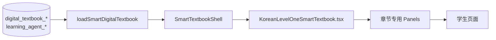
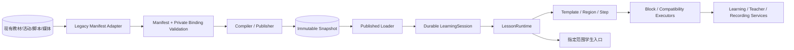

# UPLY 智能教材重构全程报告与新旧对比

> 审计日期：2026-09-11
> 事实范围：当前主工作区、首次启用发布候选、现有迁移、运行入口与阶段证据文档。
> 结论口径：代码存在不等于已上线；测试通过不等于产品体验等价；`runtimeReady=true` 仅代表第一章契约和执行能力通过技术门槛。

## 1. 先说结论

这次重构没有失败，也不是只做了几份文档。它已经建立了一套新的智能教材运行基础设施：

`旧教材数据 → Legacy Adapter → Lesson Manifest v1 → 发布快照 → Published Loader → Durable Session → LessonRuntime → Learning / Teacher / Recording 服务`

但是，这次工作的重心是**运行内核、发布链、数据契约和安全边界**，不是学生界面视觉重做，也不是后台可视化编辑器。因此当前真实结果是：

| 范围 | 当前判断 |
|---|---|
| Manifest、校验、稳定身份、Block 契约 | 已实现 |
| 第一章 Legacy Adapter（8 Step / 19 Activity / orientation 3 题 / v23） | 已实现 |
| 新 Runtime 的 Layout、Region、Step、Target、Learning/Teacher 兼容执行 | 已实现第一章所需技术链 |
| 不可变发布、Loader、会话固定、准入控制 | 已实现，并已用于第一章受限测试入口 |
| 判题、进度、听力、录音、Teacher Agent 的领域复用与安全边界 | 已接入或建立兼容执行链 |
| 学生端旧页面的完整视觉、信息层级和所有专用交互等价 | **未完成** |
| 教材模板 Layout/Region 可视化后台 | **未实现** |
| 章节 Step/Block 可视化后台 | **未实现** |
| Teacher Video-first | **未实现；第一章仍是 v23 legacy 金老师** |
| 其他 15 章迁移 | **未实施** |
| 全体学生切换新 Runtime | **未实施；当前只是第一章指定测试范围** |

所以，用户现在看到的新页面“内容还在，但旧界面里的大图、对话卡片、工具栏和精细排版不见了”，不是数据被删除，而是**新 Runtime 的表现层尚未把旧页面专用 UI 完整迁入**。

## 2. 重构前是什么结构

重构前第一章直接由课程页加载旧教材数据并进入 `SmartTextbookShell`：

真实特点：

- 主入口在 `src/app/dashboard/courses/[categorySlug]/[subcategorySlug]/[courseSlug]/[lessonSlug]/page-content.tsx`。
- 旧壳由 `SmartTextbookShell.tsx` 转出到 `KoreanLevelOneSmartTextbook.tsx`；后者是大型、第一章高度定制的 React 实现。
- 八个 Step 来自八个 `digital_textbook_modules`，但允许的 module code、页面、插槽、标题覆盖、左右布局和底部导航大量依赖前端固定常量。
- 右侧活动与旧页面的 panel/page/index 强绑定；部分 Agent target 依赖旧 page 或别名语义。
- Teacher 使用 published v23：8 个脚本节点均有 `virtualCharacter`，没有 `teacherVideo`。
- 数据库活动和服务端判题是真实领域来源，但显示、组织、导航和大量视觉表达都写在旧 React 页面里。
- 发布内容、后台编辑数据与学生运行时之间没有独立、稳定的 Manifest 合同。

旧结构的优点是第一章视觉完成度高、专用交互丰富；缺点是骨架、章节逻辑、领域调用和 UI 纠缠，难以让后台配置 Layout/Region/Step/Block，也难以安全发布不可变版本。

## 3. 重构后是什么结构

新结构把原先纠缠在一个页面里的职责拆开：

1. Manifest 只描述学生运行需要的公开内容和稳定引用。
2. 私密答案、object key、数据库 UUID 绑定和服务端证明留在 private binding。
3. Adapter 逐字段把旧 module/node/activity/script 转为 Step/Block/ref/capsule。
4. Publisher 编译并保存不可变快照；Loader 不再让学生 Runtime 直接理解后台表。
5. Durable Session 固定 snapshot，避免旧页面拿新答案或新脚本执行。
6. LessonRuntime 根据 Layout/Region/Step/Block 渲染，并通过稳定 target 调度交互。
7. Learning、Teacher、Recording 通过服务器服务边界复用旧领域能力，不在浏览器重写判题或证据逻辑。

## 4. 从 Phase 1 到当前实际做了什么

### 4.1 现状审计与资产决策

完成了代码级现状审计和 KEEP/MIGRATE/RETIRE 决策，证据见：

- `docs/SMART_TEXTBOOK_CURRENT_STATE_AUDIT.md`
- `docs/SMART_TEXTBOOK_TARGET_STATE_AUDIT.md`

保留了 `digital_textbooks`、versions、chapters、activity secrets、服务端判题、录音证据和 listening；modules/nodes/activities 进入迁移适配；旧 Shell、固定 skeleton 和 legacy 角色被定义为“新 Runtime 接管后才可退役”。这些旧资产当前仍在代码库中，没有被删除。

### 4.2 Lesson Manifest v1 契约

`src/lib/smart-textbook-runtime-v1/` 已实现：

- `LessonManifestV1`、Layout、Region、Step、Navigation、RuntimeTarget、MediaRef、ActivityRef、ProgressRef、TeachingRef、RuntimeContext。
- 25 种闭合 Block props；不是一个任意 `Record<string, unknown>`。
- 严格 Zod 校验：未知字段、重复 ID、悬空引用、非法 Region、错误 target、私密字段和任意 HTML/JS/CSS 均拒绝。
- target 使用 `step:{stepId}/block:{blockId}` 和 `/part:{partId}`，不依赖 DOM selector、标题或数组位置。
- target capability 允许 identity-only 的空能力，同时命令 dispatch 对空能力明确拒绝，不把空数组当通配符。

关键文件：

- `src/lib/smart-textbook-runtime-v1/contracts.ts`
- `src/lib/smart-textbook-runtime-v1/validator.ts`
- `src/lib/smart-textbook-runtime-v1/registry.ts`
- `src/lib/smart-textbook-runtime-v1/targets.ts`
- `src/lib/smart-textbook-runtime-v1/media-admission.ts`

### 4.3 第一章 Legacy Adapter

`src/lib/smart-textbook-legacy-adapter/` 现有 22 个文件，负责：

- 八个 module → 八个 Step。
- node/content → scoped compat/native Block。
- 19 个 Activity → ActivityRef/private binding。
- orientation 三道真实单选题完整保留。
- 2 个 guided repeat track、14 个 segment 使用冻结身份映射。
- v23 Teacher 的 character、pose、speech、buffer、blackboard、studentTask、visualCue 转入闭合兼容 capsule。
- 生成 conversion report、readiness proof、speech proof、target semantics 和稳定 digest。
- 不把原始 `node.content`、整行 configuration、answer key、object key 或 service role 塞进公开 Manifest。

关键文件包括 `adapter.server.ts`、`identity.server.ts`、`bindings.server.ts`、`capsules.server.ts`、`readiness.server.ts`、`final-readiness.server.ts`。

### 4.4 Runtime Engine 与 Renderer

`src/features/smart-textbook-runtime/` 在主工作区已有约 98 个文件，拆分了：

- RuntimeRoot / LessonRuntime
- TemplateRenderer
- RegionRenderer
- Step navigation/controller
- BlockRegistry / BlockRenderer
- RuntimeTargetRegistry
- Learning services/state
- Teacher executor/timeline/session
- Recording controller/executor/transport

第一章当前可执行 capability 是：layout、线性 navigation、server progress、text、multiple choice、`compat.learning.v1`、`compat.teacher.v1`。Registry 中其余 Block 仍明确是 unsupported，不存在为了“全绿”而做的假 Renderer。

这也是视觉差距的直接原因：**契约里定义了 25 种 Block，但当前真正晋升为通用 React Renderer 的类型很少；第一章大量复杂内容仍由 compat executor 以安全投影方式运行。**

### 4.5 Learning 执行链

已经为第一章接通或兼容：

- orientation 三题提交、attempt、服务端 feedback。
- vocabulary、grammar、patterns、dialogue、listen/speak、read/write、review 的 scoped 内容与服务调用。
- activity page progress、guided repeat、speaking evidence 的历史投影。
- listening media/transcript 的授权边界。
- stable target 的 reveal/focus/highlight/play/open/dispose。
- Step 切换取消旧媒体、旧 generation 和异步回写。

正式完成状态仍以服务器为准；浏览器不能提交 score、correct、studentId、tenantId 或答案。

### 4.6 Recording / Speaking Evidence

录音领域进行了实质性后端重构：

- 新录音 canonical backend 定为 R2；历史 Supabase Storage 保留兼容读取。
- 引入 speaking evidence 的原子消费、roleplay 原子完成、delete/re-record lifecycle claim。
- proof 把 evidence、owner、activity、对象摘要、size/MIME、revision/snapshot 和 TTL 绑定；浏览器拿不到 proof secret。
- Recording v2 有统一 gateway、server gate、drain/fence/epoch 和并发保护。
- Runtime React 通过闭合 `RecordingRuntimeServices`，不知道 R2、Storage、RPC、object key 或用户数据库身份。

对应迁移包括 `202609090001_recording_evidence_atomic_v2.sql` 和 `202609090002_recording_domain_coordination.sql`。

### 4.7 Teacher compatibility

新 Runtime 没有制作 Teacher Video，而是让第一章的 v23 legacy Teacher 在 teaching Region 内受控运行：

- 复用 `resolveScriptStep` / `resolveScriptCharacter`，没有新建第二套 Agent 状态机。
- normal speech 与 buffer speech 使用 hash-safe selector；错误的 segment 199 不再仅因 `ready` 就被选择。
- Browser TTS 使用 server-issued observation grant；`onend` 只代表 playback observed，不代表正式完成、分数或进度。
- character/pose/legacy 坐标只在 compat.teacher 内部，不控制新 Layout。
- blackboard、studentTask、visualCue、question/feedback、remediation、terminal 已纳入 scoped executor。
- Teacher completion 与 Learning completion 分离。

第一章仍然是“legacy Teacher compatibility”，不是“新视频教师”。

### 4.8 发布、快照、Loader 与会话

`src/lib/smart-textbook-publishing/` 实现了：

- source capture
- media admission policy
- dependency fence
- immutable artifact/snapshot
- publisher/repository
- published Loader

发布基础迁移建立 snapshot、private/public binding、pointer、history、durable session、admission 和单版本编辑控制。发布后的 Runtime 读取固定 snapshot，不直接读取正在编辑的后台表。

第一章编译和发布保持 8 Step、19 Activity、orientation 三题与 v23；已出现的 digest/快照变化来自发布契约、媒体准入和重新发布，不代表教材内容被删除。

### 4.9 正式入口与受限启用

首次启用候选位于：

`/home/yangzhen/releases/uply-first-enable-20260910/source`

候选中的课程页在完成原有课程权限检查后调用 `runtimePageDecision()`：

- 仅 Chapter 1。
- 仅服务器和数据库共同准入的 student cohort。
- Recording v2、proof key、epoch、实例、R2 配置、已发布 snapshot 和 capability 任一缺失即 fail closed。
- 非 cohort、其他章节、owner audit 继续旧 Shell。
- 浏览器 query/header/body/cookie 不能自己打开 Runtime。

当前你看到的新页面说明第一章指定测试范围已经进入 `PublishedRuntimeEntry → strict complete LessonRuntime`；它不是全体用户、全部章节的切换。

## 5. 新旧逐项对比

| 维度 | 重构前 | 重构后 | 当前完成度 |
|---|---|---|---|
| 运行契约 | 学生端理解旧表和章节专用对象 | Lesson Manifest v1 是稳定公开契约 | 已完成 |
| 页面骨架 | 固定左右区、固定比例、固定底部 Step | Manifest Layout/Region/Navigation 驱动 | 技术完成，视觉表达较基础 |
| Step | module code + 前端覆盖 | 稳定 Step ID、order、nextStep、completion | 第一章完成 |
| 内容单元 | panel/page/slot 与旧组件耦合 | Block + compat composite | 第一章可运行，通用 Block 化未完全完成 |
| Target | page/index/DOM/legacy alias | stable target + capability + owner | 第一章 target audit 完成 |
| 发布 | 后台数据直接成为运行来源 | 编译、校验、不可变 snapshot、pointer | 已完成 |
| 会话 | 容易随当前数据变化 | Durable session 固定 snapshot | 已完成 |
| 判题 | 旧服务端判题 | 原判题保留，经 Runtime service adapter 调用 | 保留并加固边界 |
| 进度 | 旧表和 index 语义 | 旧表保留，稳定 part 私有映射 | 第一章兼容完成 |
| 录音 | Route/Storage/R2/evidence 语义曾不一致 | R2 canonical、legacy reader、atomic v2、proof/lifecycle | 基础设施完成；受 gate/cohort 控制 |
| Teacher | 旧 Shell 全局控制舞台 | scoped compat.teacher，只占 teaching Region | 第一章技术完成，仍是 legacy |
| 教师视频 | 配置存在但第一章无成品 | Manifest 支持 video-first 方向 | 未制作、未迁移 |
| 安全 | 多处直接传旧标识和配置 | private binding、opaque session、无答案/object key | 明显增强 |
| 学生视觉 | 第一章高度定制、完成度高 | 通用布局 + 安全内容投影 | **明显未等价** |
| 后台制作 | 旧教材/脚本表单 | 仍主要是旧后台 + 发布操作 | **新 Template/Block 编辑器未做** |
| 章节范围 | 16 章旧资产 | 新 Runtime 只落地第一章 | 其余未迁移 |

## 6. 为什么现在看起来“不如以前”

旧截图中的这些能力主要属于旧 `KoreanLevelOneSmartTextbook.tsx` 的专用呈现层：

- 顶部语言/教师/全屏工具栏。
- 大幅场景主视觉和渐变标题覆盖。
- 情景表达、情景诊断等页内标签。
- 双角色对话卡片、人物名、独立播放与整体播放。
- 旧侧栏“继续学习/重新开始”。
- 更细的音频、逐句朗读和状态样式。

新 Runtime 当前主要证明的是：正确 snapshot 能加载、8 Step 能切换、活动和 Teacher 服务能执行、状态和安全边界成立。它没有完整复刻上述专用 UI。最近候选中的 CSS 只修复了黑底、尺寸塌陷、底部导航和基本可用性，没有把旧设计系统迁入。

因此：

- **数据大多没丢。** 第二张新 Runtime 截图已经能显示学习内容和例句，说明 Manifest/capsule 内容存在。
- **视觉组件没有完整迁移。** 新 Runtime 选择了通用卡片投影，旧的大图和专用对话呈现没有同等 Renderer。
- **“runtimeReady=true”被容易误解。** 它表达技术执行链完整，不表达产品视觉等价或后台制作体系完成。

## 7. 后台到底重构了多少

后台不是本次的主要完成面。

已经有的后台/运维能力：

- 原教材管理页和教学脚本管理页仍存在。
- platform_owner 权限边界得到保留和发布入口加固。
- 教学脚本 preview/runtime-v1-preview 存在。
- 第一章有正式 compile/check/publish 操作链、CAS 和发布历史。
- 单版本编辑/排空/重新发布的基础设施已设计并实现到发布链。

没有完成的后台产品能力：

- 没有教材模板 Layout/Region 可视化编辑器。
- 没有章节 Step/Block 可视化编辑器。
- 没有完整 Block Registry 制作面板。
- 没有把 25 种 Block 都做成可配置、可预览、可发布的制作工具。
- 没有 video-first 教师内容制作工作流。
- 没有其他 15 章的批量迁移与发布操作体验。

所以准确说法是：**发布管理和权限/一致性基础设施重构较深，内容制作后台尚未进入目标形态。**

## 8. 哪些旧能力被保留，没有被重做

以下不是失败或遗漏，而是有意 KEEP/MIGRATE：

- `digital_textbooks`、`digital_textbook_versions`、`digital_textbook_chapters`。
- 现有 activities 与服务端答案/判题。
- attempts、node progress、activity page progress、guided repeat progress。
- listening tracks、recordings、speaking evidence。
- v23 teaching script、Agent resolver、remediation、task events。
- legacy character、pose、speech、blackboard（第一章过渡期）。
- 旧 `SmartTextbookShell` 与 `ContentRenderer`，因为非 cohort 和未迁移章节仍需运行。

重构的目标不是把所有旧表和服务复制一套，而是在它们上方建立稳定发布和运行边界。

## 9. 数据库与迁移改变了什么

核心教材表没有被整体替换。新增重点是：

| 迁移 | 作用 |
|---|---|
| `202609090001_recording_evidence_atomic_v2.sql` | 录音 proof、原子 evidence 消费、roleplay 完成、delete lifecycle |
| `202609090002_recording_domain_coordination.sql` | gate、drain、fence、epoch、实例和请求协调 |
| `202609100001_runtime_publish_foundation.sql` | immutable snapshot、binding、pointer、history、session |
| `202609100002_runtime_publication_dependency_fence.sql` | 发布依赖 capture/fence，避免旧内容用新答案 |
| `202609100003_runtime_admission_control.sql` | 第一章/cohort Runtime 准入 |
| `202609100004_runtime_single_version_authoring.sql` | 首次上线前单版本编辑、排空、失效旧测试会话、重新发布 |
| `202609100005_chapter_publish_semantic_compatibility.sql` | 旧章节发布与共享非语义更新的锁序兼容 |

首次启用过程中又使用了单版本 publish wrapper 修复迁移，以恢复正式 publish wrapper 的正确调用。它解决发布/Loader 前置，不改变教材内容本身。

这里要区分两套状态：早期阶段报告记录的是“当时 production migration executed=false”；之后的首次启用操作已经进入远端受控迁移、发布和指定 cohort 验收。历史报告不能当作当前部署状态。

## 10. 当前源码和实际运行候选不是完全同一份

这是必须特别注意的工程风险。

当前主工作区 `src/features/smart-textbook-runtime/` 与首次启用候选存在差异。候选独有或已更新：

- `components/published-runtime-entry.tsx`
- `server/application-access.server.ts`
- `server/application-admission.server.ts`
- `server/application-http.server.ts`
- `server/application-runtime.server.ts`
- 课程正式入口接线
- 最近的 history bootstrap、请求合并、layout/CSS 修复

候选目录：`/home/yangzhen/releases/uply-first-enable-20260910/source`。

因此现在实际看到的页面不能只用主工作区文件解释。后续开发前必须先把“正在运行的候选差异”安全地纳入唯一代码基线，不能在主工作区直接覆盖，也不能重复套用累计 patch。

## 11. 已完成、部分完成、未完成总账

### 已完成

- 当前架构审计和资产去留决策。
- Manifest v1 类型、严格校验、25 Block 契约。
- 第一章真实 Adapter、稳定 ID、private binding、conversion/readiness proof。
- 8 Step、19 Activity、orientation 三题、v23 legacy 的契约保真。
- Runtime Root、Layout/Region/Step、target/lifecycle。
- 第一章 learning 与 teacher compatibility 的技术执行链。
- 服务端判题、进度、听力、录音证据复用边界。
- Recording atomic v2 和协调 gate。
- Immutable publisher、Loader、durable session、dependency fence。
- 正式课程入口的服务器准入与第一章指定测试范围。

### 部分完成

- Native Block Renderer：契约完整，实际通用 Renderer 只覆盖第一章所需少数类型。
- 学生端：功能链可运行，但视觉和信息层级没有达到旧页面等价。
- Teacher：legacy compatibility 可运行，长期 video-first 未完成。
- 发布操作：基础设施与第一章发布可用，尚非完整内容制作产品。
- 录音：领域基础设施较完整，但全量生产范围仍受 gate、key、cohort 和运维协议控制。

### 未完成

- 模板 Layout/Region 编辑后台。
- 章节 Step/Block 编辑后台。
- 旧学生界面完整视觉/交互迁移。
- Teacher Video 内容与 video-first Runtime 实际落地。
- 其余 15 章 Adapter/Manifest/发布/Runtime 验收。
- 全量学生切换与 legacy 退役。

## 12. 这次重构真正带来的价值

即使当前 UI 不理想，底层工作仍解决了旧结构难以解决的问题：

1. 后台表和学生 Runtime 解耦，不再要求学生端理解编辑表。
2. 教材发布成为可验证、可追溯的 snapshot，而不是“数据库当前长什么样就运行什么”。
3. 题目与答案 revision 被固定，降低内容/判题串版风险。
4. 稳定 target 不再依赖 DOM、页码或数组位置。
5. 录音 evidence 的存储、验证、消费和删除拥有一致事务边界。
6. Teacher Agent 被限制在 teaching Region，不能重新接管整页和学习完成状态。
7. 第一章可以受 cohort 控制地新旧并存，失败时 fail closed。
8. 未来模板、Region、Step、Block 后台有了稳定输出合同。

这些是必要的“地基”；问题在于地基完成后，学生表现层没有同步做到原页面质量。

## 13. 下一步应该怎么做

不建议继续扩大架构。应先做一次明确的“第一章产品等价收口”：

1. 冻结当前 Manifest、Publisher、Loader、Session、判题和录音协议，不再重构底层。
2. 以旧 Shell 为基准，逐 Step 建立视觉与交互清单：场景图、页内 tabs、角色卡、逐句/整体播放、反馈、录音、恢复状态。
3. 把旧页面中纯表现组件提取为新 Runtime Renderer/compat presentation；不得把整个旧 Shell 嵌回来。
4. 为每项标注“数据已存在 / Renderer 缺失 / 服务缺失”，优先修 Renderer 缺失。
5. 用 chen001 对照验收第一章，达到学生体验等价后再扩大 cohort。
6. 第一章稳定后，再决定先做后台 Template/Chapter Editor，还是迁移第二章；不要并行铺开。
7. video-first 应作为单独内容制作项目，不应与修复第一章 UI 混在一起。

## 14. 最终判断

这次重构的准确名称应是：

> **UPLY 智能教材 Runtime、发布契约与领域安全基础设施重构，第一章兼容运行落地。**

它不能被描述成：

> “下一代智能教材产品已经全部完成”或“后台和学生端都重做完了”。

当前成果是真实且规模较大的，但最后一公里——学生端表现等价、后台可视化制作、video-first 和多章节迁移——尚未完成。用户看到的简化页面正是这个边界的直接体现，不代表旧教材数据被清空，也不代表前面的底层工作无效。

## 15. 主要证据索引

- 旧结构审计：`docs/SMART_TEXTBOOK_CURRENT_STATE_AUDIT.md`
- 资产决策：`docs/SMART_TEXTBOOK_TARGET_STATE_AUDIT.md`
- 目标设计：`docs/SMART_TEXTBOOK_MANIFEST_RUNTIME_V1_DESIGN.md`
- Runtime 技术收口：`docs/SMART_TEXTBOOK_RUNTIME_V1_PHASE_4A15_REPORT.md`
- 发布基础：`docs/SMART_TEXTBOOK_RUNTIME_V1_PHASE_4B1A_PUBLISH_FOUNDATION.md`
- 应用入口：`docs/SMART_TEXTBOOK_RUNTIME_V1_PHASE_4B1B_APPLICATION_WIRING.md`
- 单版本工作流：`docs/SMART_TEXTBOOK_RUNTIME_V1_PHASE_4B1C_SINGLE_VERSION_WORKFLOW.md`
- Manifest：`src/lib/smart-textbook-runtime-v1/`
- Adapter：`src/lib/smart-textbook-legacy-adapter/`
- Publisher：`src/lib/smart-textbook-publishing/`
- Runtime：`src/features/smart-textbook-runtime/`
- 旧学生端：`src/app/dashboard/courses/[categorySlug]/[subcategorySlug]/[courseSlug]/[lessonSlug]/KoreanLevelOneSmartTextbook.tsx`
- 实际首次启用候选：`/home/yangzhen/releases/uply-first-enable-20260910/source`
