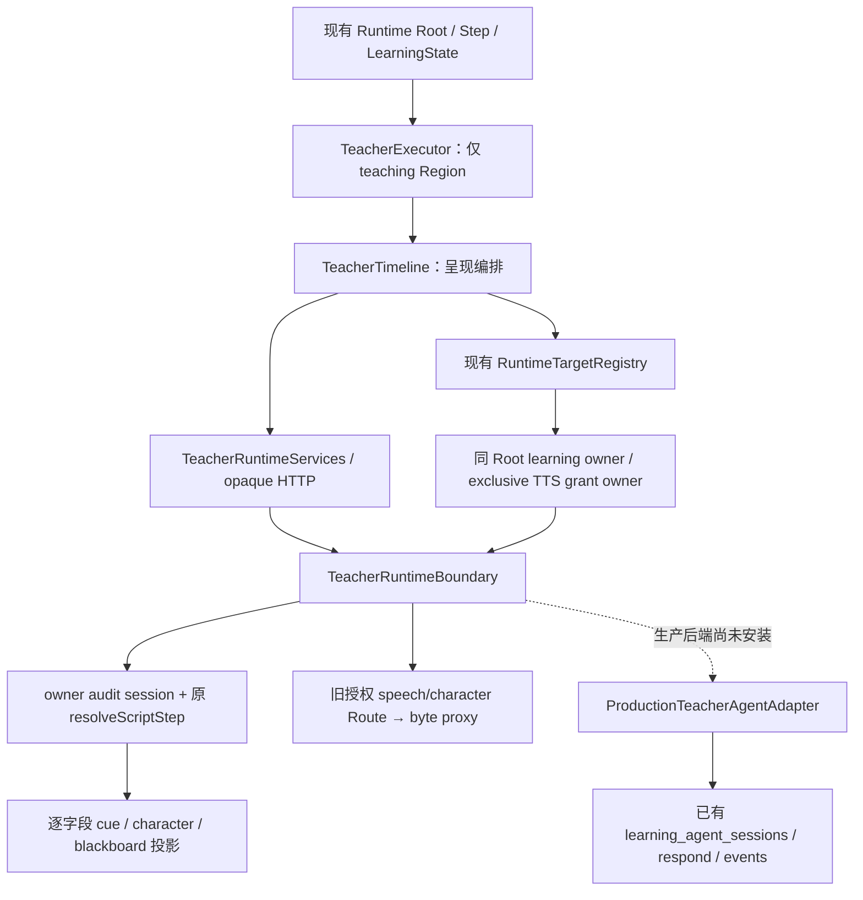

# Phase 4A-14：Teacher 挂载执行链与剩余阻断

日期：2026-09-10。基于当前 Phase 4A-12/13、已冻结第一章、Phase 3D/3E 契约继续；未进入 Phase 4B。

## 1. 结论：本轮有实质实现，但没有完成 Teacher 总验收

```ini
remainingNonUiUnsupported = 0
nonUiRuntimeReady = true
learningReady = true
compat.learning.v1 = implemented
compat.teacher.v1 = unsupported
runtimeReady = false

required teacher target unsupported = 0
dangling teacher commands = 0
duplicate owner conflicts = 0

production migration executed = false
production caller cutover executed = false
student production Runtime switched = false
```

新增的 scoped Teacher 已在 Chromium 开发挂载场景中，通过真实 frozen v23 resolver、真实 Audio 元素、受控浏览器 TTS shim、私有 boundary 和 Learning Runtime 同 Root 执行。**这不是 strict complete 正向验收，不等于 Registry 可以提升。**

仍有两个实质验收缺口：

1. 生产 Agent adapter 已实现私有 restore/respond/event 端口和协议测试，但尚未安装到统一 opaque Teacher boundary 的生产后端。尚未完成「已有 Agent session → 同一 mounted Teacher → existing persisted events → reload」联合证明。不能把本轮隔离 owner-audit 内存状态当作生产持久会话。
2. 因上一项未闭合，`compat.teacher.v1` 仍 unsupported。`LessonRuntime validationMode="complete"` 本轮实际运行并正确拒绝激活；**没有正向通过**。开发挂载测试没有被冒充 complete Runtime 测试。

`teacherCapabilityReadiness()` 实际重新计算的 blocker 是：`teacher.renderer`、`teacher.reload`、`teacher.strict-complete-runtime`、`teacher.renderer-registry`。后者是未提升 Registry 的结果，不是第四套独立领域问题。

## 2. 文件与架构

以下路径均相对于项目根 `/home/yangzhen/projects/my-lms-system`。

| 新增文件 | 责任 |
| --- | --- |
| `src/features/smart-textbook-runtime/core/teacher-runtime.ts` | 闭合 Teacher presentation DTO / Zod、TeacherRuntimeServices；不修改 Manifest |
| `src/features/smart-textbook-runtime/core/teacher-http.ts` | 单一 opaque HTTP transport、epoch、late-open 回收 |
| `src/features/smart-textbook-runtime/core/teacher-media.ts` | Audio / TTS / text-only，暂停、取消、Blob URL 生命周期 |
| `src/features/smart-textbook-runtime/core/teacher-timeline.ts` | 单一呈现 timeline，不做 Agent 决策 |
| `src/features/smart-textbook-runtime/components/teacher-executor.tsx` | teaching Region scoped renderer、角色/黑板、任务及问答控制 |
| `src/features/smart-textbook-runtime/server/teacher-cue.server.ts` | 从旧 resolver / character / blackboard / selector 逐字段生成呈现 DTO |
| `src/features/smart-textbook-runtime/server/teacher-boundary.server.ts` | opaque learning scope → Teacher session；每次核对身份/revision/Step/generation |
| `src/features/smart-textbook-runtime/server/audit-teacher-boundary.server.ts` | 正常 `requirePlatformOwner`、真实 audit source、原媒体授权 Route 的组合 |
| `src/features/smart-textbook-runtime/server/production-teacher-agent.server.ts` | 未安装的生产私有 adapter；复用原 sessions/respond/events，不创建表或 Agent 状态机 |
| `src/app/api/smart-textbook-runtime-audit/teacher/route.ts` | 新 owner-only 旁路 POST；同源、8 KiB body 上限、无缓存 |
| `tests/fixtures/teacher-boundary-4a14.mjs` | 冻结源数据、只读合成 DB transport、隔离音频/图像字节 |
| `tests/smart-textbook-runtime-4a14.test.mjs` | boundary、安全、pause、revision、grant、late-open、fail-closed |
| `tests/smart-textbook-runtime-4a14-browser.test.mjs` | 挂载 timeline/target/grant/生命周期及 strict 拒绝测试 |
| `tests/smart-textbook-runtime-4a14-production-port.test.mjs` | 私有生产端口 restore/delegate/重试协议；不是生产 Agent E2E |

修改现有旁路文件：`server/teacher-session.server.ts`、`core/services.ts`、`core/target-registry.ts`、`components/teacher-block.tsx`、`components/audit-client.tsx`、`components/runtime.css`。测试 fixture `tests/fixtures/runtime-4a-browser.tsx` 增加新 transport；4A13 测试调整 incoming buffer 预期及只阻塞第一次 SELECT 的取消屏障。

没有修改 `SmartTextbookShell`、`ContentRenderer`、`resolveScriptStep`、Phase 3E selector、原 Agent Route、原学生路由或 Recording domain。



## 3. Teacher browser boundary

入口 `POST /api/smart-textbook-runtime-audit/teacher`，只允许正常 `platform_owner`。每次请求重新鉴权；拒绝跨源、超限 body、未知字段和非法 operation。

`open` 只接收已有 opaque `learning-session-*`；后续只使用 opaque `teacher-session-*`、`teacher-cue-*`、闭合 operation/answer/grantId。Step/generation、source/snapshot/script revision 由服务器已有 learning session 解析，不由浏览器声明。媒体操作不接受 asset ID、pose、对象路径或 URL。

支持 `open/current/advance/answer/cancel/pause/resume/speech/buffer/character/issueTts/observeTts/close`。scope 在异步执行前后均验证；取消先按 owner 撤销旧 row，不能因 revision 已变化而遗留可用 grant。`teacher-http.ts` 关闭后 epoch 改变，late response 不得回写；late open 获得的 opaque session 会被关闭。

`audit-client.tsx` 不再直接调用 `auditTurn/auditIssueTts/auditObserveTts`。只保留一个 `LessonRuntime`，声明 complete 模式；因为 Registry 尚不满足，该 owner 页面目前会显示不能激活，**不是一个已通过的完整预览**。开发 Chromium fixture 明确使用现有 providers/RuntimeClassroom 验证局部实现，测试名和结果均标为 development mount。

## 4. Executor / timeline / 状态所有权

`TeacherExecutor → TeacherTimeline` 的状态为：

`idle → preparing → character → blackboard → buffer-playing / speech-playing / tts-playing → awaiting-task / awaiting-answer / feedback / remediation / completed`，另有 `paused/error`。

执行顺序来自 server cue：应用角色、黑板，播放当前节点入场 buffer，播放 normal speech 或既有 fallback，执行目标命令，等待任务/答案/继续。`autoContinue` 只复用 `scriptSegmentAutoContinues` 的**旧 owner preview**配置；不宣称这是学生生产自动推进规则。

Teacher 不拥有 StepController、Navigation、LearningState 或教材判题器。任何下一教学状态均通过原 `resolveScriptStep`；UI 没有 node-key 分支表。停止/卸载/换 Step 会 abort 媒体与请求、清除角色/黑板、撤销 task owner、释放 Blob URL。pause/resume 捕获原 signal，旧异步结果不得写入后来的 generation。

## 5. v23 八节点与黑板

| 实际 node key | 本轮 mounted 覆盖 | 真实行为 |
| --- | --- | --- |
| `step-8-bbfc46` | 是 | 原配置讲解/分段、角色、入场 buffer |
| `welcome` | 是 | 原配置开场及分段 |
| `observe-scene` | 是 | 黑板、scene reveal/highlight |
| `explain-order` | 是 | 顺序讲解 |
| `model-dialogue` | 是 | 示范、原 required Browser TTS task |
| `check-understanding` | 是 | 问题、错误 → remediation → 重试正确 |
| `lesson-mission` | 是 | 原学习任务讲解 |
| `ready-for-practice` | 是 | terminal、orientation-check reveal/focus |

coverage 通过服务返回的真实讲解文本与 frozen node script 对照，不从 UI 标题推导分支；八个 node 都有匹配。题目使用隔离 synthetic secret transport，**没有读取或声称该测试答案是生产正确答案**。

黑板调用 `teachingBlackboardDisplayForSegment`，保留 `text/bullets/expression`、translation、对齐、tone、字体和局部位置。只用 React 文本节点/列表，不执行 HTML。第一章未使用 image/video，仍受控拒绝，不制作假媒体能力。

角色继续调用 `resolveScriptCharacter`，应用 pose、可见性、左右位置、split/narrow 坐标及 scale。CSS 变量和 legacy 坐标只在 `runtime-teacher-stage` 内；不影响根 layout。测试中的图像字节是明确的隔离 PNG transport，验证真实 pose/config 投影和资源生命周期，**不是生产角色美术/真实 R2 图像 E2E 验收**。

## 6. Normal speech / buffer / fallback

路径：私有 cue → 已验证 selection → 现有 `proxyAuthorizedSpeech()` / speech Route → Blob → mounted Audio。没有把 asset ID、object key、signed URL 交给浏览器。

本轮特别纠正呈现组合中的 buffer 归属：旧 `auditTeacherTurn.buffer` 描述 upcoming node；timeline 入场使用**当前进入的 node**配置，不能将 upcoming buffer 与当前 caption 混用。`projectTeacherCue` 调用未修改的 `resolveBufferLineSpeechAssetId` / `selectBufferSpeech`，不自行按 segment=199 补选。

继续保持 preset 优先、verified asset、既有 browser TTS、silent；空 buffer 不播放。Audio 异常进入既有 TTS，TTS 不可用保留 text-only。fallback 不创建 attempt、score、progress 或正式 completion。原 16 条拒绝资源不删除、不改 hash，测试检查没有一条成为所选 segment199。

当前 mounted scenario 验证所访问 cue 的安全选择和真实 Audio；非 199 共 28 条的全量选择保证来自继续通过的 Phase 3E 回归，不能把它写成“28 条在本次浏览器都真实播放了”。

## 7. Mounted TTS Grant 与 owner 独占

真实链：Teacher 的 task cue → `setPlaybackOwner` → 当前 greeting part 的 `TtsPlaybackOwner` → Teacher 经 RuntimeTargetRegistry 发 `play` → server issue → `SpeechSynthesisUtterance` → browser `onend` → observe → consume once → Teacher 调用 advance → 原 resolver task_feedback。

普通 learning owner 在 task 期间退出；Teacher task owner 是唯一 play owner。任务结束后，测试重新对同一 target 调用普通 learning play，正常恢复且没有第二次 Teacher observation。七条 Teacher 命令 witness 的 ownerCount 均为 1。

```ini
formalCompletion = false
progressDelta = null
score = null
agentAdvance = false
```

这是“授权的浏览器 utterance 报告结束”，不是服务器证实学习者听完。测试没有直接调用 observe 冒充 mounted TTS：主浏览器链由真实绑定的 onend 发请求。服务反例测试额外直接检查 unissued/replay，不用于冒充浏览器证据。

## 8. 三处 target / 七命令

| 原引用 | 实际 Teacher 命令 | mounted 结果 |
| --- | --- | --- |
| `observe-scene:visualCue` → `orientation:page:scene` | reveal、highlight | executed |
| `model-dialogue:studentTask` → `dialogue:greeting:0` | reveal、focus、play | executed |
| `ready-for-practice:focus_activity` → `orientation-check` | reveal、focus | executed |

实际 `source` 名称以 `teacherSourceInventory` 的冻结结果为准；完整 stable 地址、source 和 witness 存在测试生成的 `/tmp/uply-runtime-4a14-mounted.json`。`auditTeacherTargets` 逐项核对 snapshot/Step/声明/owner/command，不复用 learning-only witness，不把 controlled refusal 当成功。

`RuntimeTargetRegistry` 只增加只读 `commandOwnerCount` 观测；没有放宽 capability、owner 排他规则、target identity 或 dispatch 校验。

## 9. Question / feedback / remediation / terminal

显示 server cue 的真实 question options；浏览器只发送选项文本，server 校验它属于当前闭合 options，随后调用原 resolver。错误反馈和 retry 不复制 grader。未创建正式教材 Activity attempt。

Terminal 播完当前 cue、执行稳定 orientation-check reveal/focus 后停在 completed 呈现状态。再次读取不会制造 next cue。显示“本次讲解结束，不代表学习活动已完成”；ServerLearningState 完成列表保持不变。

## 10. 生命周期 / reload

本轮 Chromium 已覆盖：

- 真实 Audio playing → pause → resume → Step switch；旧 ended callback 被解绑，URL 释放。
- 授权字节仍在 HTTP 中 → Step switch → late bytes；服务拒绝旧 session，不能挂新 Step。
- Browser fallback TTS → Step switch → 手动触发保存的旧 onend；不推进新 session。
- 已签发 active grant → Step switch → 旧 onend；不 observe，旧 grant 请求被拒绝。
- question waiting → Step switch；问题 UI/handler 消失，不提交答案。
- stop/unmount 清角色、黑板及媒体；一个 Root、一个导航。
- 完整 reload 恢复现有 learning activeStep；返回 orientation 后 Teacher 从合法新开场建立新 session/cue/grant，不续用旧 grant。

审计 reload 的新建语义已验证。生产持久会话的 mounted reload 仍未验证，因此总 readiness 的 `teacher.reload` **仍不通过**。

## 11. Production Agent adapter 与未闭合部分

新增 `createProductionTeacherAgentAdapter()` 是 server-only 私有领域端口：

- 正常 `getAuthContext` 提供 user/tenant，trusted opaque scope resolver 提供 snapshot/source/script/lesson/profile/module；不接受浏览器 DB UUID。
- `restore()` 使用已有 `learning_agent_sessions`，按 tenant/student/lesson/profile、`status=active`、`updated_at desc limit 1` 读取；读取原 `teaching_state` 与 `learning_agent_task_events`；不创建新持久状态模型。
- 验证 published script revision/current node，拒绝 stale frozen snapshot 的隐式复用；completed session 不重新激活。
- `turn()` 委托原 `POST /api/learning-agent/respond`，原 Route 内部继续调用 `resolveScriptStep` 和已有 persistence；随后重读已保存 state。不再运行第二次 resolver。
- `observe()` 必须调用可信服务的 Phase 3D consume callback，随后委托原 events Route。消费成功但事件投递失败仍抛错；允许相同合法 grant 重试**幂等事件投递**，不授予第二次 presentation advance。原事件唯一 upsert 继续负责去重。
- 该端口返回的是 **private** 原生状态，必须在统一 boundary 内投影为新的 opaque cue；不能直接序列化给浏览器。

证据：旧 `src/app/api/learning-agent/respond/route.ts` 的 active session 查询、`resolveScriptStep` 与 sessions insert/update；旧 `events/route.ts` 的 owned active/node 验证和 `onConflict=session_id,node_id,event_type,target_key, ignoreDuplicates=true`。

**尚缺**：将这个端口安装为统一 Teacher boundary 的 production backend，并联合验证 restored state → cue 投影、generation/取消、grant → persisted event → reload。当前 owner boundary 明确只运行 audit backend。production-port 测试使用合成 DB / 下游 HTTP delegate transport，验证端口协议与 Reader，不宣称已经执行旧 responder 的完整生产事务，更不是普通学生 E2E。

因此不能将本端口文件的存在计为生产 Renderer/恢复能力通过。

## 12. Readiness 20 类证据

| check | 本轮结果/依据 |
| --- | --- |
| renderer | partial：开发 mounted 可执行，production boundary 未闭合；Registry 未提升 |
| character | mounted config/pose/局部布局及清理；隔离图像 transport |
| normal-speech | mounted Audio + 受控 bytes + 生命周期 |
| buffer-speech | 当前入场 buffer → normal speech，原 selector |
| browser-fallback | Audio failure → TTS；不可用 → text-only |
| tts-observation | mounted utterance/onend/grant，正式 completion=false |
| blackboard | text/bullets/expression，切 cue / 清理 |
| student-task | 模型台词 task → feedback |
| visual-cue | 实际 Teacher scene reveal/highlight |
| question | 真实 options + 原 resolver |
| feedback | 正误反馈，不是正式 attempt |
| remediation | wrong → retry → correct |
| terminal | 停止 + orientation target，未完成学习活动 |
| target-commands | 三处七命令，audit 全通过 |
| timeline | 实际顺序、等待、任务和终止 |
| lifecycle | Audio/TTS/HTTP/grant/question 换 Step / stale 拒绝 |
| session-isolation | 每次 owner/revision 检查、grant/bytes scope |
| reload | partial：audit/learning reload 通过；production mounted restore 未完成 |
| owner-exclusion | task 期间单 play owner；结束恢复普通 owner |
| strict-complete-runtime | **未正向通过**；实际负向拒绝符合未完成状态 |

17 类有对应执行证据，3 类未确认。没有把 resolver unit test 批量转换成 20 个通过 Boolean。

## 13. Old / New Teacher 对照

| 能力 | Old Shell | 本轮 scoped Runtime | 判定 |
| --- | --- | --- | --- |
| character/pose/position | 原 character config | 原解析器 + 局部 stage | equivalent（隔离执行证据；非真实美术 E2E） |
| normal speech | 原授权 speech | 私有 byte proxy + Audio | equivalent（测试覆盖路径） |
| buffer | 原安全 selector | 同 selector，明确 incoming 归属 | equivalent |
| TTS fallback | 浏览器语音/无语音文本 | 同降级语义 | equivalent |
| blackboard | 标准化 legacy display | text/bullets/expression | equivalent（本章类型） |
| student task | event → 原 resolver | mounted grant → audit event → 原 resolver | partial（production persistence 未联合） |
| visual cue | 原目标引用 | 稳定 RuntimeTarget，不使用 DOM selector | equivalent |
| question/feedback/remediation | 原 resolver | 同 resolver | equivalent |
| terminal | 结束 + focus activity | 同语义，稳定 target | equivalent（审计执行） |
| Agent session/reload | existing persisted Agent | audit 新建；production private port 未统一安装 | blocking difference |
| lifecycle | 旧 cleanup | scoped abort/dispose/epoch | equivalent（本轮测试范围） |
| strict complete | 不适用 | 尚拒绝激活 | blocking difference |

## 14. 测试与执行范围

合并命令（项目根）：

```bash
node --no-warnings --experimental-strip-types --test --test-reporter=spec \
  tests/smart-textbook-runtime-v1.test.mjs \
  tests/smart-textbook-legacy-adapter.test.mjs \
  tests/smart-textbook-readiness.test.mjs \
  tests/smart-textbook-final-readiness.test.mjs \
  tests/smart-textbook-speech-selection.test.mjs \
  tests/smart-textbook-sidebar.test.mjs \
  tests/learning-agent-*.test.mjs tests/teaching-video.test.mjs \
  tests/teacher-kim-*.test.mjs tests/teaching-blackboard.test.mjs \
  tests/smart-textbook-runtime-4a*.test.mjs
npm run typecheck -- --incremental false --pretty false
git diff --check
```

最终完整合并：**820/820 passed，0 failed/skip/cancelled**；包括 Phase 3A–3E、4A–4A13、本轮 23 项、legacy Teacher、严格 learning Chromium、Recording 联合链、真实隔离 PostgreSQL row-lock/rollback/concurrency 和 coordinated rehearsal。最后一轮约 106.8 秒。

本轮 Chromium：**7/7 passed**（含 TTS 不可用 text-only；最后仅收紧预期 stale 错误匹配后也再次独立通过）。boundary 单测 **11/11**、production-port 协议测试 **5/5**。日志：`/tmp/uply4a14-final.log`、`/tmp/uply4a14-browser.log`、`/tmp/uply4a14-unit.log`、`/tmp/uply4a14-production.log`、`/tmp/uply4a14-ts.log`。挂载证据摘要：`/tmp/uply-runtime-4a14-mounted.json`，均为可重建本地测试产物。

PostgreSQL 测试仍使用已有隔离 harness：唯一随机 container、`--network none`、tmpfs、无主机生产 URL/volume/port、临时测试 key；未执行 production migration。音频使用隔离 WAV，TTS 为有真实 onend/pause/cancel 时序的浏览器 shim，不伪造 domain Renderer。

`owner authenticated browser E2E = 未完成`。没有复用远端电脑 Cookie、magic link、service-role 冒用账号或读取普通学生数据。

## 15. 安全和最终自查

- 第一章仍 8 Step、19 Activity、orientation 三题、published v23 legacy。
- Manifest、stable target ID、capability contract 未修改；snapshot 仍 `snapshot-774d8fd07f5e3f6c1c1fe5f0bd6a15f2`，digest 仍 `sha256:19bb72f491ae7f460d83867b09562e079e8bf1dfb3ee62b3de04775f88471f2e`。
- 无 Teacher Video；无 speech asset/hash/configuration 修改；Phase 3E selector 不回退。
- 新 Teacher request / cue 扫描无 DB node UUID、speech asset ID、object key、signed URL、tenant/student、answer_key 或私有 resolver state。
- 不部署 SQL、不装 key、不开 Recording v2 gate、不切 caller、不切正式学生 Runtime、不删 legacy。
- TypeScript 通过；`git diff --check` 通过；原有用户/前阶段 dirty worktree 保留，报告不将那些历史 diff 算成本轮修改。
- 使用 ui-styling / ui-ux-pro-max 的生命周期和可访问性规则，限定局部 Teacher stage、原生按钮及焦点行为；没有重设计根 UI。

本阶段按仍有 blocker 的停止条件结束。下一步仅剩上述 Teacher 生产 boundary/恢复联合证明及 strict complete 正向验收；未自动进入下一阶段。
