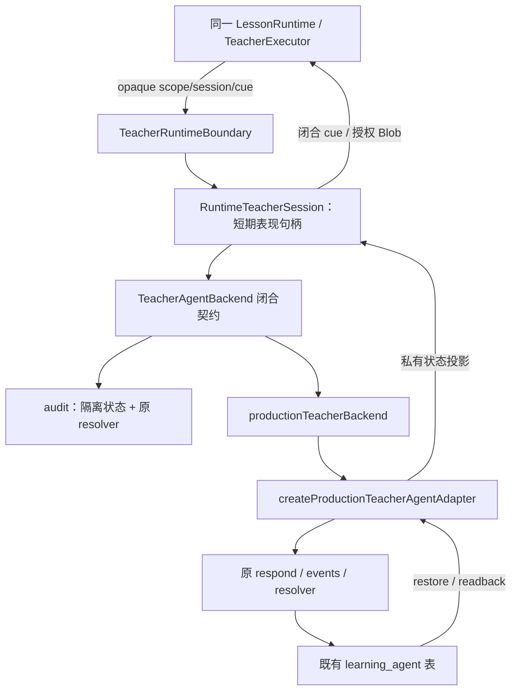

# Phase 4A-15：Production Teacher Boundary、持久恢复与 Strict Complete 验收

日期：2026-09-10。范围限于 Phase 4A-14 剩余三项；不重做 timeline，不进入 Phase 4B。

## 1. 结论与部署边界

第一章的统一 Teacher 服务已安装现有 production Agent adapter，并通过隔离 PostgreSQL + mounted Chromium 联合验证。完整 Runtime 的技术验收结果为：

```ini
remainingNonUiUnsupported = 0
nonUiRuntimeReady = true
learningReady = true
teacherReady = true
compat.learning.v1 = implemented
compat.teacher.v1 = implemented
runtimeReady = true
remaining teacher blockers = 0

required teacher target unsupported = 0
dangling teacher commands = 0
duplicate owner conflicts = 0

production migration executed = false
production caller cutover executed = false
student production Runtime switched = false
```

`runtimeReady=true` 只表示此冻结第一章已满足技术验收条件，**不是生产上线许可**。生产 Recording gate、key、migration、caller、学生课程路由、release pointer 均未操作。现有 owner 审计入口继续使用 audit backend；production composition 仅由本轮隔离测试安装，没有挂到生产学生 Route。

普通学生数据、生产 Supabase、真实 R2 音频均未读取或修改。合成 learner 的认证 transport、隔离媒体字节与真实用户登录 E2E 不同；本轮不声称完成真实 owner/学生账号浏览器验收。

## 2. 新增与修改文件

新增：

- `src/features/smart-textbook-runtime/server/teacher-backend.server.ts`：audit/production 共用的私有 `TeacherAgentBackend` 契约。
- `src/features/smart-textbook-runtime/server/production-teacher-backend.server.ts`：`productionTeacherBackend()`，将原 adapter 安装进统一 boundary。
- `tests/fixtures/teacher-agent-4a15.sql`：仅隔离测试库的缺失依赖表/列。
- `tests/fixtures/teacher-sql-transport-4a15.mjs`：真实 PostgreSQL transport，表和写入对象白名单。
- `tests/fixtures/teacher-persisted-4a15.mjs`：合成 learner、published v23 和 Agent session；安装实际 production backend。
- `tests/smart-textbook-runtime-4a15.test.mjs`：实际 SQL 的授权、版本、节点、并发 mount、持久 turn drain 测试。
- `tests/smart-textbook-runtime-4a15-browser.test.mjs`：mounted onend → 原 events → PostgreSQL → 原 respond → UI/reload。
- `tests/fixtures/teacher-readiness-4a15.mjs`：读取已完成浏览器见证，计算注册前与最终 readiness；缺少实现检查的负向反查。
- 本报告。

最小更新：`teacher-session.server.ts`、`teacher-boundary.server.ts`、`production-teacher-agent.server.ts`、`audit-session.server.ts`、`audit-tts.server.ts`、`core/teacher-readiness.ts`、`core/block-registry.ts`，以及注册状态发生变化所涉及的历史测试。

本轮未修改 React Teacher executor、timeline、旧 Agent respond/events Route、`resolveScriptStep()`、Phase 3E selector 或学生 Shell。工作树原有其他阶段/用户变更保留，不能将整个 dirty diff 视为本轮变更。

## 3. Production Teacher Boundary



统一 backend 只提供 `restore / turn / observe / dispose` 和服务端决定的 `authoredAutoContinue`。浏览器既不选择 backend，也不接收 native Agent session、node、script version、asset ID。

`TeacherRuntimeBoundary` 从 opaque learning scope 获取可信 actor/tenant、Step、generation、snapshot/source/script revision。每次操作与异步结果均重查 scope。同一 scope 的并发 open 明确拒绝；reload 先撤销旧 opaque session/grant，等待已受理的原 Agent turn 完成，再恢复数据库状态，避免新 owner 读到旧事务尚未完成的状态。

`RuntimeTeacherSession` 是短期 presentation owner，不是第三个 Agent 持久模型。其 `PreviewState` 类型在服务端仅承载原 resolver 状态；没有新增 Agent 表或重新实现状态机。

## 4. Agent session restore 与授权

`production-teacher-agent.server.ts → authorize()/read()/restore()`：

1. 原 `getAuthContext()` 提供 active user/tenant。
2. 校验 lesson 是目标 module/profile 的 published lesson，textbook 是目标 profile 的 published textbook。
3. 查询实际 published script version，必须等于被冻结的 Runtime binding；不允许旧 responder 自动兼容一个过期 Runtime revision。
4. `learning_agent_sessions` 按 tenant/student/lesson/profile 查询，默认 `status=active`、`updated_at DESC LIMIT 1`。
5. 校验 `current_node_id` 确实属于该 script version。
6. 读取同 session/tenant/student 的 `learning_agent_task_events`。
7. 把数据库状态投影为新的 opaque cue；原 native ID 始终私有。

隔离 SQL 测试实际拒绝了 wrong learner、wrong tenant、lesson/profile 不符、published revision 过期、node/version 不符、source/snapshot 不兼容与客户端 identity 注入。`completed` session 不会在 open/restore 时被重新激活。用户后续明确开始新一轮讲解，仍由原 responder 决定是否创建新 native session。

## 5. Persisted task event 与幂等

真实链路：

`model-dialogue → dialogue:greeting:0 → stable target play owner → server-issued Phase 3D grant → SpeechSynthesisUtterance.onend → observeTts → consume once → 原 /api/learning-agent/events → learning_agent_task_events → 原 /api/learning-agent/respond → task_feedback`。

测试没有预先插入“任务完成”记录。首次事件只能由 mounted browser onend 触发。真实 SQL 使用原迁移中的唯一约束以及原 Route 的：

```text
onConflict=session_id,node_id,event_type,target_key
ignoreDuplicates=true
```

同一浏览器 callback 被重复调用、同一观察 HTTP 被实际重试后，SQL event 仍只有一条。第二个观察返回 `duplicate=true`、`teachingPlaybackWaitSatisfied=false`；不会二次教学推进。退出 task 后 replay 明确拒绝。原事件投递失败仍报错，不能把 consume 成功冒充 DB 投递成功；旧 adapter 的 delivery retry 测试继续保留。

所有观察结果保持：

```ini
formalCompletion = false
progressDelta = null
score = null
agentAdvance = false
```

`teachingPlaybackWaitSatisfied` 只是允许客户端发起原有 ready turn，实际下一教学状态由原 `resolveScriptStep()` 决定。

## 6. Persisted question / remediation / terminal

生产 backend 调用原 respond **一次**，读取其返回文本和固定私有 headers，再从数据库 readback；不再调用第二遍 `resolveScriptStep()`。闭合作答必须来自当前 server cue 的 question options。

实际 `check-understanding`：wrong → 原 remediation → retry → correct，`teaching_state.answerCorrect` 分别为 false/true，写入 2 条 `learning_agent_node_attempts`，没有写教材 `digital_textbook_attempts`。测试答案 key 是隔离合成 fixture，不声称它是线上答案。

`ready-for-practice`：执行原 terminal 规则，native session `status=completed`，通过 stable target focus 原 `orientation-check`。再请求 advance 返回同一 terminal cue，无下一讲解。Teacher terminal 时教材 attempt、node progress、Learning completedStep 均未改变。

## 7. v23 节点覆盖

|真实 node key|本轮 mounted/persisted 覆盖|
|---|---|
|`step-8-bbfc46`|从已有 active session 恢复；opening caption、character、normal speech|
|`welcome`|原分段讲解与继续|
|`observe-scene`|黑板及 stable scene reveal/highlight|
|`explain-order`|原讲解文本、黑板、speech|
|`model-dialogue`|explanation、task、TTS grant/event、task_feedback|
|`check-understanding`|question、wrong/remediation、retry/correct、持久状态|
|`lesson-mission`|原讲解继续|
|`ready-for-practice`|terminal focus_activity、native completed、停止推进|

character/pose/position、黑板 text/bullets/expression、normal speech、buffer preset、安全 TTS/text-only fallback 继续使用 4A14 executor 与 3E selector，没有制造新状态或媒体。4A14 mounted timeline 回归与本轮 production mounted 场景都检查了 rejected segment199 未进入播放选择。

## 8. Reload：恢复持久状态，不复用浏览器对象

|状态|audit backend|production Agent backend|
|---|---|---|
|page reload 后 Teacher state|新隔离 audit 状态|读取同一已有 native Agent session|
|opaque session/cue|新建|新建|
|未结束 grant|撤销旧 grant，按合法 task 重新签发|同左；不会因旧 callback 写新 event|
|已持久 task event|隔离状态不冒充数据库|恢复事件后不再要求同一 observation|
|Blob/media generation|不复用|不复用|
|completed native session|不适用|不在 restore/open 时重新激活|

Chromium 真正执行了整页 reload：

- task grant 已签发但尚未 onend：旧 JS realm 被销毁，旧 opaque session/媒体/观察请求拒绝；恢复相同 native task phase 后重新建立合法 owner。
- event 已写入且进入 task_feedback：reload 不再签发同一任务 grant；正常进入原 question。
- terminal 后与 native 三题交互，再 reload：Learning 通过原 RuntimeLearningSession Reader 恢复三题选项；native completed session 未被重新激活。
- 一直只有一个 Runtime Root、一个 navigation。Teacher 结束不设置 Learning completion。

独立 SQL drain 测试还暂停了原 responder 的真实 session UPDATE：新 open 必须等该受理 turn 完成；旧请求不能把 late cue 写入新表现 session。此处没有假装取消浏览器可以回滚一个已受理的原数据库操作。

## 9. 严格 complete Runtime 与 Teacher target audit

注册前先运行明确标注为 pre-promotion 的 development mount，只用于证明实现，不冒充 strict complete。随后注册并实际运行 `LessonRuntime validationMode="complete"`，没有 Teacher bypass、learning-only 或 Inspection。

同一个严格 Root 内完成：opening → speech/blackboard → scene cue → model task/onend → persisted task_feedback → question/wrong/remediation/correct → mission → terminal focus → 三题 Learning 交互 → full reload。

本轮联合场景中的 Teacher 使用真实隔离 SQL persistence；Learning 使用既有隔离 RuntimeLearningSession persistence，三题按 preview 语义恢复，不制造正式 attempt。Recording 的 mounted → 原子 SQL → Reader → UI 链由同轮 4A7/4A12 SQL rehearsal 回归另行验证，不能把两个测试的 persistence backend 混为一谈。

|Teacher 引用|Stable owner 命令|结果|
|---|---|---|
|`observe-scene:visualCue`|reveal、highlight|owner=1，成功|
|`model-dialogue:studentTask`|reveal、focus、play|Teacher grant owner 独占；成功|
|`ready-for-practice:focus_activity`|reveal、focus|native orientation activity owner；成功|

3 个引用、7 个命令，requiredUnsupported=0、danglingCommands=0、duplicateOwners=0。沿用 4A12 的 359 learning targets，没有变更 address、capabilities 或 frozen identity。

## 10. Readiness 计算顺序

完整 `teacherCapabilityReadiness()` 保留全部 20 项检查，以及 Registry、8-node inventory、source/ref/target 校验。原实现存在先后依赖：Registry 未提升时 strict complete 必须拒绝，因此不能声称在 Registry 提升前已经通过 strict complete。

本轮新增 `teacherImplementationReadiness()` **仅用于注册前决策**：检查全部 19 项实现证据，明确返回两个尚待激活的检查 `teacher.renderer-registry`、`teacher.strict-complete-runtime`；不把它们伪造为 passed，也不令最终 `teacherReady=true`。

实际顺序：

1. 4A14 mounted lifecycle + 本轮 persisted mounted/SQL 证据完成。
2. 注册前 readiness：19 项实现通过；`readyForRegistryPromotion=true`，`teacherReady=false`。
3. 仅将真实 `compat.teacher.v1` Registry 提升为 implemented。
4. 严格 complete Chromium 与 full reload 实际通过。
5. 重新读取浏览器见证，20 项最终通过，Registry 通过，`teacherReady=true`；`runtimeReadiness()` 得到 true。

`tests/fixtures/teacher-readiness-4a15.mjs` 还逐项移除 19 项实现证据，确认任意一项缺失都阻止注册；不存在批量手写全绿开关。最终证据文件位于 `/tmp/uply-runtime-4a15-readiness-final.json`，是本次测试产物，不是发布配置。

最终 executable capabilities：`layout.v1`、`navigation.linear.v1`、`progress.server.v1`、`block.text`、`block.multiple_choice`、`block.compat.teacher.v1`、`block.compat.learning.v1`。其他未实现类型仍 unsupported；video 的 strict 拒绝测试保留。

## 11. 隔离与安全核验

- PostgreSQL：既有 `isolatedRecordingPostgres()`，每次随机容器、`--network none`、tmpfs、无宿主 DB URL/生产 env、无端口或媒体挂载，结束销毁。
- Agent 表来自仓库真实旧 DDL，包括 task-event 唯一约束；只补测试库所需 textbook/metadata 依赖。不是 mock RPC 代替持久化。
- 原 respond、events、resolver、grant verifier 和 speech selector 没有被替换。仅 auth/DB transport/NextResponse 运行环境及媒体字节隔离。
- SQL transport 只允许原 Agent sessions/messages/node_attempts/task_events 写入；不允许教材 attempts/progress 写入。测试初始化/负向 mutation 只作用于合成容器。
- 音频为隔离 WAV、角色为隔离 PNG；真实 content/hash/selection 使用冻结 metadata。不访问真实录音或 R2。
- Browser request/response 扫描禁止 tenant/student/native session/node/script/asset IDs、objectKey、signed URL、answer_key 等。只传 opaque refs 和当前闭合 answer/grantId。
- `formalCompletion=false`、`score=null`、`progressDelta=null`、`agentAdvance=false` 持续由服务端决定。
- 生产 backend 只在测试 composition 中安装；生产 audit Route 没有切换后端。

## 12. 测试与反查

最终结果：

|验证|结果|
|---|---|
|Phase 3A–3E、Phase 4A–4A15、legacy 合并回归|**835/835 passed**，0 failed / skipped / cancelled|
|本轮 persisted strict complete Chromium|6/6（父测试 + 5 个联合子场景），含完整 reload|
|本轮 production composition / SQL 安全与 drain|9/9（父测试 + 8 个子场景）|
|4A14 mounted timeline / 8-node / target 回归|7/7，包含 pause/dispose/late callback/TTS/text-only|
|Recording SQL rehearsal / 并发 / rollback|通过；含 mounted Recording → v2 SQL → Reader → UI/reload|
|注册前证据决策|19 项实现通过；严格激活/Registry 尚待执行，未提前宣称 teacherReady|
|最终 Teacher readiness|20/20 检查、8/8 nodes、3 refs/7 commands 通过；blockers=[]|
|Learning readiness 重算|learningReady=true；既有 359 targets/19 Activity 证据回归通过|
|TypeScript|通过，`tsc --noEmit --incremental false --pretty false`|
|`git diff --check`|通过|

最终合并日志：`/tmp/uply4a15-final.log`，耗时约 112 秒。本轮子集均已包含在 835 总数内，不重复相加。另行执行的 readiness 证据检查器包括逐项移除实现证据的 19 个负向断言。

开发过程曾发现并修正：隔离库缺少真实 activity question options 列、private TypeScript 边界缺少收窄，以及旧测试仍预期 Teacher unsupported。最终全量重新执行后全部通过；未更改真实脚本、答案或 selector 来制造通过。原有“未实现能力应拒绝”测试改为使用确实未实现的 video，而非删除拒绝校验。

执行命令：

```bash
npm run typecheck -- --incremental false --pretty false
node --no-warnings --experimental-strip-types --test --test-reporter=spec \
  tests/smart-textbook-runtime-v1.test.mjs tests/smart-textbook-legacy-adapter.test.mjs \
  tests/smart-textbook-readiness.test.mjs tests/smart-textbook-final-readiness.test.mjs \
  tests/smart-textbook-speech-selection.test.mjs tests/smart-textbook-sidebar.test.mjs \
  tests/learning-agent-*.test.mjs tests/teaching-video.test.mjs tests/teacher-kim-*.test.mjs \
  tests/teaching-blackboard.test.mjs tests/smart-textbook-runtime-4a*.test.mjs
node --no-warnings --experimental-strip-types tests/fixtures/teacher-readiness-4a15.mjs
git diff --check
```

## 13. 不变量与停止

- 8 Step、19 Activity、orientation 三题、published v23 legacy 不变；没有 Teacher Video。
- Manifest content digest：`sha256:19bb72f491ae7f460d83867b09562e079e8bf1dfb3ee62b3de04775f88471f2e`。
- source revision：`0feb9264ff035a1139cde70e9b1a4611608883d4832f06be87c4a5327f279fc0`。
- teaching revision：`feb30ba7-0a5e-4e9f-83e6-8970f715ddd5`（v23）。
- 本轮没有新增生产 migration、没有修改脚本内容/语音 hash、没有打开 Recording v2 gate、没有删除 legacy。
- Teacher 技术 blockers 已清零；生产部署前置仍是独立授权与验收事项，不能从本报告推导生产 cutover ready。

完成本报告与最终验证后停止；不进入 Phase 4B。
