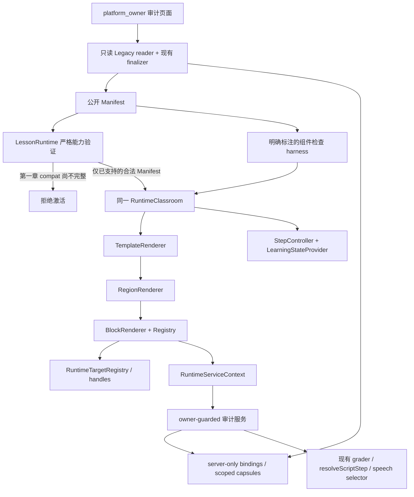

# Phase 4A：Runtime Renderer 基础与旁路组件检查

日期：2026-09-09。状态：**部分实现，未通过 Phase 4A 完整验收，不可切换学生生产路由。**

## 1. 结论与证据边界

已新增可运行的 Runtime 基础、text / multiple_choice Renderer、第一章八步教学内容投影、legacy 教师局部执行器，以及仅 platform_owner 可访问的检查入口。第一章必需的两个 Compatibility Executor 尚不完整，Registry 仍将其标为 unsupported。严格 `LessonRuntime` **拒绝激活第一章**，不会静默跳过缺失能力。

```ini
remainingNonUiUnsupported = 0
nonUiRuntimeReady = true
runtimeReady = false
```

`nonUiRuntimeReady` 来自再次执行 Phase 3E 的 `finalizeChapterOneNonUiReadiness`，不是对新增 UI 的认证。缺失能力仍属于 `runtime.capabilities`，没有降低先前 validator 或证据标准。

本轮不是“完整第一章已可执行”的交付：复杂活动、历史领域进度恢复、授权 TTS 任务的挂载执行和完整 teacher playback 生命周期仍需在 **Phase 4A 范围内继续完成**。不将这些缺项推定为已实现，也不自动进入 4B。

本轮测试使用现有 SELECT-only 冻结的第一章 source、identity ledger、service evidence；没有访问生产数据库。新增审计入口设计为访问时读取真实数据并再次 finalizer 校验，但本轮**未以真实 platform_owner 登录端到端访问该入口**，未认证线上媒体实播、真实用户恢复或生产部署。

## 2. 架构基线

遵循当前实际文件，未复制历史名称不同的资产决策文档：

- `docs/SMART_TEXTBOOK_CURRENT_STATE_AUDIT.md`
- `docs/SMART_TEXTBOOK_TARGET_STATE_AUDIT.md`
- `docs/SMART_TEXTBOOK_MANIFEST_RUNTIME_V1_DESIGN.md`
- `docs/SMART_TEXTBOOK_RUNTIME_V1_PHASE_3A_REPORT.md`
- `docs/SMART_TEXTBOOK_RUNTIME_V1_PHASE_3B_REPORT.md`
- `docs/SMART_TEXTBOOK_RUNTIME_V1_PHASE_3C_REPORT.md`
- `docs/SMART_TEXTBOOK_RUNTIME_V1_PHASE_3D_REPORT.md`
- `docs/SMART_TEXTBOOK_RUNTIME_V1_PHASE_3E_REPORT.md`

未改 Manifest v1 Schema、3A Registry metadata、公开 Manifest Fixture、Adapter 身份算法、Phase 3D Grant 语义或 Phase 3E speech selector。

固定样本仍是 8 Step / 19 Activity / orientation 三题 / published v23 legacy，没有 teacherVideo。

Manifest semantic digest 保持：

`sha256:423bc16d7056e2060198cd4873aa34fabdea45d2d7b48581168da8f6084f476f`

## 3. 新增文件

以下路径均为本轮新增，不含工作区原有未提交变更。

| 路径 | 职责 |
| --- | --- |
| `src/features/smart-textbook-runtime/core/step-controller.ts` | Step 权限、稳定 ID、generation、AbortSignal、dispose |
| `src/features/smart-textbook-runtime/core/target-registry.ts` | mount-time handles、声明能力检查、命令、dispose |
| `src/features/smart-textbook-runtime/core/block-registry.ts` | Renderer 实现状态与严格激活门禁 |
| `src/features/smart-textbook-runtime/core/services.ts` | RuntimeServices、闭合服务端状态投影与校验 |
| `src/features/smart-textbook-runtime/core/teacher.ts` | 闭合教学响应与服务接口 |
| `src/features/smart-textbook-runtime/components/runtime-root.tsx` | RuntimeRoot / LessonRuntime、同一课堂 Renderer、明确的组件检查 harness |
| `src/features/smart-textbook-runtime/components/runtime-context.tsx` | RuntimeServiceContext、LearningStateProvider |
| `src/features/smart-textbook-runtime/components/template-renderer.tsx` | 受控 Layout |
| `src/features/smart-textbook-runtime/components/region-renderer.tsx` | 容器/叶 Region、support drawer |
| `src/features/smart-textbook-runtime/components/step-navigation.tsx` | 唯一全局 Step 导航 |
| `src/features/smart-textbook-runtime/components/block-renderer.tsx` | 再校验 props、Region 和 target；分派组件 |
| `src/features/smart-textbook-runtime/components/target.tsx` | React ref 注册与卸载 |
| `src/features/smart-textbook-runtime/components/reveal-boundary.tsx` | React 受控区域展开，不查找 DOM 路径 |
| `src/features/smart-textbook-runtime/components/text-block.tsx` | text Renderer |
| `src/features/smart-textbook-runtime/components/choice-block.tsx` | 单选提交、服务端反馈、临时输入 |
| `src/features/smart-textbook-runtime/components/learning-content.tsx` | 当前 Step 安全内容投影显示，非完整活动执行 |
| `src/features/smart-textbook-runtime/components/teacher-block.tsx` | 局部 legacy teacher 显示、讲解操作与安全停止 |
| `src/features/smart-textbook-runtime/components/runtime.css` | 有限响应式布局、focus、高亮与媒体样式 |
| `src/features/smart-textbook-runtime/components/audit-client.tsx` | 审计 Server Actions 的客户端传输适配 |
| `src/features/smart-textbook-runtime/server/audit-source.server.ts` | 现有 reader + frozen ledger + finalizer，只读来源 |
| `src/features/smart-textbook-runtime/server/audit-session.server.ts` | 有界、过期、owner 绑定的私有审计会话 |
| `src/features/smart-textbook-runtime/server/audit-teacher.server.ts` | 复用旧 resolveScriptStep，逐字段安全投影 |
| `src/features/smart-textbook-runtime/server/audit-actions.ts` | 每次请求 owner guard、严格输入、预览判题、scope 校验 |
| `src/features/smart-textbook-runtime/server/audit-requests.server.ts` | 复用 Manifest stable ID 的闭合请求校验，拒绝客户端身份/完成注入 |
| `src/lib/smart-textbook-legacy-adapter/runtime-content.server.ts` | 闭合学习 Capsule → 安全显示 DTO |
| `src/app/[space]/dashboard/admin/apps/[appSlug]/teaching-scripts/runtime-v1-preview/page.tsx` | platform_owner 检查入口，只支持 korean |
| `tests/fixtures/runtime-4a.mjs` | 现有真实冻结源编译、私有测试 DB 传输与原判题器 |
| `tests/fixtures/runtime-4a-browser.tsx` | 浏览器测试挂载 harness，不进入应用路由 |
| `tests/smart-textbook-runtime-4a.test.mjs` | Core、投影、权限边界、三题判题测试 |
| `tests/smart-textbook-runtime-4a-browser.test.mjs` | Chromium 中实际 React 组件测试 |
| `tests/smart-textbook-runtime-4a-teacher.test.mjs` | 真实 legacy resolver 与安全教学投影测试 |

另修改 `tests/smart-textbook-legacy-adapter.test.mjs` 的边界断言：仅允许新增的 `src/features/smart-textbook-runtime/server/` 审计服务读取 Adapter，其余非 Adapter 源码仍禁止导入。没有放开学生入口。

## 4. Runtime Core 架构



不是两套 Preview / Student Renderer。`LessonRuntime` 接受相同 RuntimeContext 和服务接口；检查 harness 复用完全相同 Template / Region / Block 组件。检查 harness 的存在不代表它已通过严格章节能力门禁。

没有把整个 SmartTextbookShell、SmartTextbookData 或旧 Shell 状态嵌入新 Runtime。没有从旧巨型组件中提取或改写生产逻辑。

## 5. Template、Region 与 Step

Layout 使用既有契约：split-classroom / stacked-classroom、xl breakpoint、三种 desktopRatio、固定合法 narrowOrder、teachingCollapsible、inline/drawer supportPresentation、bottom navigation。没有自由拖拽、任意 CSS、无限 Region 或 HTML 编辑。

Interaction 只作为容器；main/support/feedback 是叶 Region。BlockRenderer 在客户端重新运行闭合 props 校验，并同时检查 Manifest Region allowedBlockTypes 和 3A Registry allowedRegions。Step placement 必须匹配 block.stepId / region。

StepController 使用 navigation.entryStep、items、nextStep、free / completed-prefix。完成前缀只来自服务器状态，进入 Step 不触发完成。临时 activeStep 写入以 snapshotId 为范围的 sessionStorage，恢复按 stable ID 校验。React StrictMode 的恢复重放已用浏览器测试修正。

切换时同步 abort 旧 generation，清理 target handles 和注册的媒体 disposers；异步提交与目标命令在返回后再次检查 lease。根卸载停止资源，StrictMode effect replay 不误撤销活跃 generation。

## 6. Renderer 状态

本轮独立 Renderer Registry 不篡改 3A 的历史 metadata。

| 类型 | 当前状态 | 限制 |
| --- | --- | --- |
| text | implemented | 纯文本段落，React 转义 |
| multiple_choice | implemented | 通过服务适配提交稳定 option ID；不含答案/评分规则 |
| compat.learning.v1 | **unsupported / 可检查局部显示** | 已显示八步教学材料；复杂活动、听说/录音和旧 progress 服务执行未齐备 |
| compat.teacher.v1 | **unsupported / 可检查局部执行** | 真实 legacy turn / speech 引用 / 黑板；授权任务播放与完整时间轴执行未齐备 |
| 其他 21 类 | unsupported | 没有假 Renderer |

其他类型包括 video、image、rich_text、audio、dialogue、multiple_select、fill_blank、ordering、listening、shadowing、pronunciation、role_play、writing、self_check、supplemental_visual、vocabulary_practice、grammar_practice、pattern_practice、listen_speak、read_write、review。

当前 executableCapabilities：

```text
layout.v1
navigation.linear.v1
progress.server.v1
block.text
block.multiple_choice
```

`progress.server.v1` 表示受控服务端状态投影/刷新与服务器完成权限，不表示尚未实现的 compat page/guided-repeat 服务调用已经齐备。对正式生产服务的鉴权、恢复及完整交互验收仍未完成。

## 7. compat.learning 的逐字段投影

`projectLearningContent` 首先通过现有 capsuleSchema，限定单个 learning capsule，然后对每一个 slot 显式 switch：

- lead / coach / completion、targets / checklist。
- dialogueGroups、vocabulary、grammarCards、patternCards、dialogueScenes、dialogueFlow。
- repeatTracks / repeatLines、listenSpeakPages、listeningContext / listeningFocus。
- substitutionGroups、pattern、speakingFrame、reading、writingFrame、originalExample。
- quickResponse、personalOutput、substitutions、listenFor、outputChecklist、speakingCriteria、questions、rubric、returnMap。
- nextNode 和 formalAudioStatus 不作为正文拼接；导航/服务执行未完成，不能据此认定完整等价。

输出只有闭合 ContentCard 字段（partId、title、paragraphs、children）与 Step/capsule/revision 身份。活动私有策略、对象位置、原配置和整个旧 JSON 不进入浏览器。嵌套卡片身份通过冻结 ledger 查找，缺失即拒绝，不回退成数组索引或父 ID。

当前显示投影不是完整 Capsule executor：音频、图片、录音、角色扮演、读写提交、review return binding 等交互仍有缺项。

## 8. 第一章八 Step 对照

对照依据为当前 Adapter 的真实冻结章节结构、旧内容字段与新实际 React 显示；不是已完成真人操作的生产旧 Shell / 新 Runtime 全流程验收。

| Step | 当前标题 | 已验证显示 | 仍缺的交互等价 |
| --- | --- | --- | --- |
| orientation | 初次见面交流目标 | 学习目标、四组对话及文本、三道单选、局部 legacy teacher | TTS task grant 挂载执行、完整 teacher playback |
| vocabulary | 问候与人物身份 | 12 个核心词汇及释义、读音标记、词性、搭配 | 词汇活动/页进度 |
| grammar | 主题助词与判断句 | 3 个语法卡、规则、例句、注意事项、来源 | grammar audio 和练习提交 |
| patterns | 姓名与身份介绍 | 句型、替换、快速回应、个人表达 | 特殊 activity key 对应完整练习流程 |
| dialogue | 初次见面对话结构 | 情景、对话行、交流顺序、词汇 | role play / 录音 / speaking evidence |
| listen_speak | 听辨与口头表达 | 听辨任务、跟读文本、口语支架与要求 | tracks 播放、guided-repeat、录音、历史恢复 |
| read_write | 个人介绍读写 | 阅读、问题、写作支架、评价要求 | 原读写活动提交与进度 |
| review | 独立交流能力 | 自查和复习建议 | 服务器完成聚合、章节测试目标与返回执行 |

19 个 ActivityRef 仍全部存在；其中 orientation 三题有真实新组件执行，其余不能因引用仍存在而称为已经可操作。

## 9. orientation 三题与 grader

链路：MultipleChoiceBlock → RuntimeServices.submit → auditSubmit → private activity binding → 原 `submitSmartTextbookActivityForContext` → 原 `gradeSmartTextbookActivity` → 原反馈返回值。

公开 radio value 为稳定 option ID；审计服务校验 activityRef、Block、版本关系及选项身份后，在服务器转为旧服务所需的 index。客户端不发送 score / completion / tenant / userId，严格请求 schema 拒绝额外字段。

审计调用强制 `preview:true`、`tenantId:null`。原服务在 preview 分支返回 attemptNumber=1、nodeCompleted=false、completionPercent=0，早于正式 attempt/progress 写分支。本轮不增加第二套 grader。

三题均有 Node 测试与 Chromium 中的真实 radio → HTTP 测试服务 → 原 grader → React feedback 往返。测试替代 DB 传输、使用**服务器端合成测试答案**，不冒充真实数据库答案；没有把正确索引写入浏览器 Fixture。尚未完成真实 owner 登录审计入口下的数据库判题验收。

## 10. compat.teacher、speech、黑板与 Agent

`auditTeacherTurn` 使用当前 `resolveScriptStep`，不另写 Agent node 顺序或推进状态机；会话状态保持在 server-only owner 审计 store。复用 `resolveScriptCharacter`、`upcomingScriptNodeBufferLine`、`resolveBufferLineSpeechAssetId` 和 `teachingBlackboardDisplayForSegment`。

当前局部执行器显示角色白名单 pose 图片、台词、可授权语音 ID、黑板当前文字 slide、理解检查选项和稳定 task/visual target。音频访问仍经现有 speech Route 授权，没有公开 object key。黑板只投影规范化的有限字段；遇到 image/video 元素记录未实现，不直接送出内部媒体字段。

真实 resolver 测试验证 v23 初始讲解、非 199 speech 引用、黑板以及后续 studentTask 的出现；ready 不伪造 completedTaskEvents。

**未完成：**

- Phase 3D 的 TTS Observation Grant 尚未挂接到 mounted playback owner。当前 `playbackGrantAvailable=false`，不发 audio_completed，不把 onend 当作正式完成或任务通过。
- 当前 compat.learning part 的公开 capability 未声明 play；`dialogue:greeting:0` 的稳定映射存在，但不能绕过声明调用 play。需完成受授权的执行边界及相应契约核对，不能造假 mediaRef。
- speech cue timeline、逐帧角色表现、buffer 自动播放与完整 fallback 生命周期没有达到旧 Shell 等价；当前有局部手动播放和停止。
- 教师运行只占 teaching Region，不拥有全局 Step Controller。当前 Manifest 只在 orientation 有 teacher Block，不擅自复制出其余七步教师。

Phase 3E 选择策略和生产 Route 没有改动。新 helper 读取既有选择结果，不更新 speech 内容、hash、preset 或数据库状态。

## 11. Runtime Target

沿用 `step:{stepId}/block:{blockId}` 及 `/part:{partId}`。注册要求 target 已声明、位于当前 Step、无重复 handle；命令必须在声明 capabilities 中，且当前 handle 已挂载。

已实现 reveal / open、focus、highlight、dispose。reveal 通过 React 受控 boundary 展开 teaching 或 support drawer；不接受 CSS selector、DOM path 或后台样式。highlight 最长 1800ms，可 abort/dispose，无闪烁动画，尊重 reduced-motion。

play 只能由真实媒体 owner 提供；通用 element handle 不伪装实现 play。当前 compat 播放 part 未挂载，因此相关能力拒绝执行。跨 Step 未挂载目标也返回 unavailable，而非猜测旧 page。

## 12. Learning State

RuntimeServices 中分别定义 attempts、completion、activityProgress、pageProgress、guidedRepeat、speakingEvidence；服务端状态经闭合 Zod 校验，并绑定 snapshot。UI 单独保存 activeStep、activePart、未提交输入、反馈与媒体实例，不将其回写为正式完成。

提供可信服务 refresh 后替换投影的接口；异步刷新有 generation 防护。MC 提交的 preview 结果不触发正式 refresh / completion 聚合。

当前 owner 检查不加载学生私有历史，初始领域状态为空。**仅 stable Step UI resume 与 supplied server state 已验证，不等于真实历史 node/page/guided-repeat/speaking 恢复已经完成。** 没有新建进度表或第二套领域服务。

## 13. Preview / Production 边界

入口：`/[space]/dashboard/admin/apps/korean/teaching-scripts/runtime-v1-preview`。

- 页面在数据读取前调用 `requirePlatformOwner`；所有 Server Actions 每次重新调用相同 guard。
- guard 检查真实平台负责人角色并排除租户提供的账号（`src/lib/admin.ts`）。
- trackingDisabled=true；不接学生路由，不设置新发布 pointer。
- 私有会话绑定 owner、30 分钟 expiry，最多 32 个；多进程 miss 时失败关闭。它是审计临时 store，不是新的正式 Agent persistence。
- 原旧教材仅以链接打开对照，没有嵌入旧 Shell。
- Preview 和未来 production 接受同一个 LessonRuntime；本轮没有生产 RuntimeService 实现或路由切换。

## 14. 测试结果

| 检查 | 结果 |
| --- | --- |
| TypeScript 全项目 `--noEmit --incremental false` | 通过 |
| Phase 3A | 85/85 |
| Phase 3B | 50/50 |
| Phase 3C | 55/55 |
| Phase 3D | 53/53 |
| Phase 3E | 44/44 |
| legacy 相关回归 | 83/83 |
| 以上合并 | 370/370 |
| Phase 4A Node + Chromium + teacher resolver | 36/36（含浏览器父测试和八个子测试） |
| Phase 3A–3E + Phase 4A + legacy 最终合并 | 406/406 |
| git diff --check | 通过 |

```bash
npm run typecheck -- --incremental false --pretty false
node --no-warnings --experimental-strip-types --test \
  tests/smart-textbook-runtime-v1.test.mjs \
  tests/smart-textbook-legacy-adapter.test.mjs \
  tests/smart-textbook-readiness.test.mjs \
  tests/smart-textbook-final-readiness.test.mjs \
  tests/smart-textbook-speech-selection.test.mjs \
  tests/smart-textbook-sidebar.test.mjs \
  tests/learning-agent-*.test.mjs tests/teaching-video.test.mjs \
  tests/teacher-kim-*.test.mjs tests/teaching-blackboard.test.mjs
node --no-warnings --experimental-strip-types --test tests/smart-textbook-runtime-4a*.test.mjs
git diff --check
```

浏览器验证包括 split/stacked、三种比例、窄屏、teaching 展开、support drawer、唯一导航、八步内容、stable-id reload、三道题反馈、过期提交不污染新 Step、focus/reveal/highlight/dispose、无声明 play 拒绝。组件在 React StrictMode 下运行。

测试未覆盖的真实验收仍是缺项：owner 登录页面、线上语音实播、完整 TTS grant task bridge、复杂活动与录音、真实历史恢复和完整旧 Shell 行为对照。36 项通过不代表这些要求已经满足。

## 15. 自查与生产影响

- 本轮未编辑正式学生路由、SmartTextbookShell、ContentRenderer、旧 skeleton、生产 Agent event Route、判题、录音和 speech selector。
- 本轮没有 migration、SQL mutation、发布、教师视频制作或 legacy 删除。
- 工作区任务开始前已有大量业务/数据库未提交变更，不能把整体 git diff 当成本轮改动；本轮文件范围以上述清单为准。
- 新 browser payload 仅含公开 Manifest、逐字段文本投影和服务反馈；测试扫描无 answer_key、object_key、service role、私密 transcript、原始 script secret。
- Private bindings 只被新增审计服务读取，未有学生生产入口导入新 Runtime。
- 8 Step、19 Activity、orientation 三题、v23 legacy 和 Manifest digest 不变；Phase 3D/3E 回归继续通过。
- 没有把 compat 的局部显示登记为真实已完成 Renderer；第一章严格激活门禁仍失败。
- UI 技能仅影响键盘 focus、可取消高亮、reduced-motion 和响应式检查；没有重新设计教材视觉。标题说明复用现有 CardTitleWithHint。

## 16. 尚需完成的 Phase 4A 工作

1. 完整 scoped compat.learning executor：复用原 activity/listening/recording/page/guided-repeat/speaking 服务，并验证全部复杂流程。
2. 受控 TTS grant 的真实 mounted playback owner、target capability 与 observation 服务串联；保持“观察事件不等于正式完成”。
3. 完整 legacy teacher timeline、buffer/fallback、blackboard 媒体和任务交互等价。
4. 通过 private binding 接入真实历史进度恢复，验证原服务 round-trip。
5. platform_owner 真实旁路验收及旧 Shell 全八步功能对照，补完整交互测试。
6. 所有 required capability 真正完成后才提升兼容 Renderer 状态并重新计算 runtimeReady；本轮不提前提升。

本报告不是生产切换批准，也不是 Phase 4A 完整完成声明。未进入 Phase 4B。
