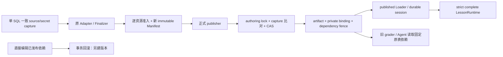

# Phase 4B-1A：Publish Foundation 与第一章发布闭环

日期：2026-09-10。本文更新本阶段原报告，不另开 Phase。范围仅为第一章、旁路发布基础设施和完全隔离的数据库/浏览器验收。

## 1. 三层结论（不是生产上线结论）

|层次|当前结果|实际验收边界|
|---|---|---|
|基础设施实现|已实现|一致 source capture、不可变 artifact/private binding、数据库依赖 fence、原子 publisher、CAS/history/rollback、durable session|
|第一章发布准入 PF-1|通过|75 个引用逐项核验；真实状态仍是 12 ready / 63 pending；没有伪造或删除资源|
|领域版本一致性 PF-2|通过|固定发布依赖；直接改已发布依赖会事务回滚；学习继续使用原版内容和判题依赖|
|published 完整运行链 PF-3|隔离正向通过|正式 publisher / published Loader / durable resolver / domain ports / strict complete LessonRuntime；见 §7、§10|
|生产部署及切换|未执行、未批准|没有生产 DB/对象存储操作，没有 gate、密钥、PM2 或学生 Route 切换|

前置失败并未被降为 warning：

- **原 PF-1**：“所有 mediaRef 一律 ready”，把当前已有 TTS 路径和未使用的预生成录音预留也当作必需二进制资源。
- **原 PF-2**：多个 SELECT 捕获源数据，且仅在执行前比对 live 数据；秘密判题依赖没有固定，存在 TOCTOU。
- **原 PF-3**：只有存储层 SQL 正向、应用层负向；真实第一章不能走完整 published 链。

本轮使用明确授权的最小契约及独立 migration 修正，没有重做 Renderer、编辑器或判题系统。

## 2. PF-1：75 项媒体发布准入

### 2.1 最终分类

|实际使用点|数量|规则|证据及运行结果|
|---|---:|---|---|
|图片|8|required-ready|保留原 ready 引用与 private binding；没有 pending 图片豁免|
|听力 asset + listening track 领域引用|4|required-ready|原 ready 校验、授权 byte proxy 和播放限制不变|
|词汇原形|12|existing-browser-tts|contentUtterances → learning-tools mounted TTS；当前原形朗读不依赖预生成文件|
|语法例句|9|existing-browser-tts|grammarCards 的 audioId/script 与冻结例句一致；现有 TTS owner|
|repeatLines 的六句示范|6|existing-browser-tts|content.repeatLines[].audioAssetKey 对应冻结韩文；content-playback / learning-tools；**不是**两轨十四句的 guided-repeat 身份集合|
|pattern conversation|8|existing-browser-tts|resolvePatternMedia 按精确 audioAssetKey；pending 返回 null，原 Pattern Executor 走已有 TTS；ready/error/abort 仍由原测试覆盖|
|词汇搭配预生成录音|12|unused-reservation|当前没有对这些对象的 byte lookup；搭配文本保留，不取消任何既有 owner|
|对话逐句预生成录音|14|unused-reservation|dialogueScenes 不引用这些 asset key；角色练习使用文本和 recording evidence，对方 TTS 是条件行为，不能虚构每条资源都有独立播放 owner|
|对话整段预生成录音|2|unused-reservation|当前按 scene / turn 执行；没有读取该整段对象的依赖|

合计：**12 required-ready + 35 existing-browser-tts + 28 unused-reservation = 75**。

本轮中间审查曾将 14 个对话逐句预留归为 TTS 路径；最终按真实资源读取点收紧了描述，归入非必需预留。不是把必需功能降级：这些资源没有被移除、改状态或冒充可播放资源。角色/turn 文本、证据、条件 TTS 都不变。

逐引用清单见 §12；机器可核验的完整证据位于：
`src/lib/smart-textbook-publishing/assets/v1/chapter-one-media-audit.server.ts`。

每项固定 ref、assetKey/purpose、原 readiness、资源 digest、所属 node/content digest、准入规则和使用点证据。不是通过标题/名称相似度、DOM 或模糊前缀决定准入。

### 2.2 最小公开契约修正

`contracts.ts → mediaRefSchema.admission` 是可选、闭合的附加字段：

```ts
{
  revision: 'chapter-one-media/1',
  rule: 'existing-browser-tts' | 'unused-reservation',
  evidenceDigest: '<sha256>'
}
```

没有 raw JSON / URL / object key / secret。没有修改 schemaVersion、runtimeContract、Block props、target address 或 capabilities。

- `media-policy.server.ts → mediaPublicationAudit()`：精确核验 75 项完整性、真实状态、资源和 owner content digest；新资源/修改内容必须重新审查，否则阻断。
- `withMediaPublicationPolicy()`：只给已证实的 pending 音频附加 admission。所有引用及 readiness 原样保留。
- `verifyMediaPublicationPolicy()`：Loader 私有完整性校验重新验证逐项证据，不能用伪造的公开摘要豁免。
- `media-admission.ts → admittedMedia()`：发布、Loader 和 Runtime 共用语义。仅 legacy-adapted、lesson-access 的 pending audio 可按此规则例外；rejected、错 region/consumer 类型、未知规则不能放行。
- `validator.ts`：published 时全量验；含 admission 的 Manifest 即使运行端未传 published 参数也全量验，不能只注释一部分而跳过剩余 pending。
- Native audio/listening/video 等不能继承 scoped legacy exception。
- **admission 不是 playback permission**。原 byte owner 仍要求 ready；不会把 pending 对象交给播放器。TTS 不可用时保持现有错误/文本行为，绝不自动完成 practice 或 Activity。

未注释的旧冻结 candidate 仍无法通过 published admission。没有静默“升级”旧不可变快照。

## 3. 新旧 digest 与不变资产

|项目|结果|
|---|---|
|原 Manifest digest|`sha256:19bb72f491ae7f460d83867b09562e079e8bf1dfb3ee62b3de04775f88471f2e`|
|新公开 Manifest digest|`sha256:5c941f3aa4bc57fd93e7ad9b8fb3ab548ef50a8bb9d50029054c0a0379efff58`|
|source revision|`0feb9264ff035a1139cde70e9b1a4611608883d4832f06be87c4a5327f279fc0`，保持不变|
|Step / Activity / orientation|8 / 19 / 3，保持不变|
|Teacher|published v23，8 script node；原 teacher_script / configuration 逐字段一致|
|source lesson records|8 条全部捕获，不只装载当前有 published v23 的一条|
|targets|363 个总 target / 359 个 learning target；地址、Step/Block/part identity 和命令不变|
|媒体|75 引用、12 ready / 63 pending 不变|

新公开 digest 的变化来自 63 项媒体准入注释；测试把注释和 snapshot provenance 去掉后，整个 semantic Manifest 与原版严格相等。对捕获后 source 另外做 canonical digest 相等断言，不以“数量相同”替代内容相同。

新 snapshot ID 确定性包含公开内容 digest、完整私有依赖 capture digest、compilerVersion；编译 provenance 追加 `.media1`。判题/教学私有依赖不同或服务器编译版本不同，不能碰撞成旧 snapshot ID。compiledAt 不作为语义随机盐。相同 capture / compiler 重编译得到同一个 artifact；旧 snapshot 不覆盖。

## 4. PF-2：选定固定依赖方案

**选用数据库强制的“已发布依赖不可变”，不是前置 SELECT 防竞态，也不是重写原 grader。**



### 4.1 一致 source capture

新增 `202609100002_runtime_publication_dependency_fence.sql`，没有修改旧 migration。

`runtime_publish_private.capture(scope)` 使用**单条 SQL、一个 MVCC snapshot** 的 CTE 捕获 17 类依赖：

- digital_textbooks / versions / chapters / modules / nodes；
- digital_textbook_activities / activity_secrets；
- digital_textbook_media_assets / listening_tracks；
- learning_agent_lessons / profiles / profile_secrets；
- learning_agent_script_versions（published）/ script_nodes / node_interaction_secrets / script_audio_assets；
- chapter_tests（当前导航依赖）。

保留完整行与空子集合，避免新增 Activity、切换 published script、修改答案或音频配置绕过原快照。未捕获 learner attempts/progress、用户权限或录音内容。

`capture.server.ts → captureChapterOnePublication() → projectPublicationCapture()` 将可信私有 capture 交给原 Reader 的字段投影，内存投影期间不再访问 live DB。原 Reader、Adapter、Finalizer 复用；不是另一套 Lesson schema。

编译检查全部 Activity 有判题 secret，且 Teacher reference_activity 必须落在捕获的章节范围；未知外部依赖拒绝。secret 只在私有 artifact，不能进入 Manifest/客户端 DTO。

### 4.2 发布和编辑竞争

新增 `publish_runtime_snapshot_v2`：

1. 当前 platform_owner SQL guard。
2. 取得统一 authoring transaction advisory lock。
3. 锁内重新取得一致 capture，必须与编译时 capture 完全相等；否则 `PUBLICATION_SOURCE_CAPTURE_CONFLICT`，不写 snapshot。
4. 调用原 immutable store/CAS 事务逻辑。
5. 同事务写入不可变 dependency fence；任何异常整体回滚。

17 张依赖表的 statement triggers 与发布使用同一把 advisory lock。写入后重新检查所有已发布 capture，修改/删除/新增子对象导致差异即回滚。**旧快照、回滚后的快照也永久保留 fence**，不会因为 pointer 移走就解锁旧数据。

锁序：authoring fence → publication scope → pointer；正常 authoring 在执行行修改前取得 fence。TRUNCATE 明确拒绝，避免持有 AccessExclusiveLock 再等待 advisory lock。非 READ COMMITTED authoring 明确拒绝，避免等待锁后仍使用旧 RR snapshot 看不见刚发布的 fence。READ COMMITTED 的 VOLATILE trigger 在等待后取得新查询快照，并看见本语句自己的变更。

这是有意的保守边界：已发布行（含 metadata/updated_at）不能就地修改；需另建内容版本。别的章节修改只要不改变已固定依赖集合可以继续，但这些 authoring 表共享串行锁。本轮没有实现新版本编辑器或批量 COW 工具，也没有冻结学生学习状态。

### 4.3 运行端不再用 TOCTOU 检查

`domain-guard.server.ts → assertPublishedDomainDependencies()` 不再重复 SELECT live source。

它检查 `assert_runtime_dependency_fence_v1(snapshot, capture)` 的持久成员关系。防竞态来自数据库持续禁止依赖变更，不是这个查询与下一次学习写入间的时间间隔。

- 旧 grader 仍读取原 activities / secrets 并调用原 attempt RPC。
- Teacher 仍复用 resolveScriptStep / 原 Agent persistence；其版本、配置、question secret、profile、speech metadata 均固定。
- 新教材界面不会结合后续编辑的答案/配置执行。
- 当前用户、tenant、会员/课程权限和正常 RLS 可见性仍在每次调用重新核验；**内容固定不等于授权固定**。
- 没有 fence 的历史 artifact 不允许新 published domain execution 或 v2 rollback，不能自动补一个“已验证”标记。

此威胁边界针对正常应用 DML 与并发发布；不声称可以抵抗数据库超级用户禁用 trigger/修改 DDL，或外部管理员覆盖对象字节。未来生产安装、存储可达性和管理员运维仍需单独授权核验。

## 5. 文件与 RPC

|文件/对象|本轮改动|
|---|---|
|runtime-v1/contracts.ts / validator.ts / media-admission.ts|闭合媒体准入契约及共享验证|
|publishing/assets/v1/chapter-one-media-audit.server.ts|75 项明确审计证据，无对象路径|
|publishing/media-policy.server.ts|核验、注释、确定性 snapshot/compiler identity|
|publishing/capture.server.ts|可信单快照 capture 的原 Reader 投影|
|publishing/artifact.server.ts|capture 私有 digest/pins 与媒体证据关联校验|
|publishing/publisher.server.ts|正常 owner guard → SQL capture → 原 compiler → package → 正式 publisher|
|publishing/repository.server.ts|发布/回滚进入 v2 原子固定依赖事务|
|publishing/domain-guard.server.ts|移除 live SELECT precheck，使用持久 fence|
|publishing/loader.server.ts|正式 published Loader 检查 fence，拒绝未固定 artifact|
|202609100002_runtime_publication_dependency_fence.sql|独立 forward migration；新 capture/fence/publish RPC 与 DML triggers|
|tests/fixtures/published-chapter-one.mjs|完整第一章隔离 SQL/auth/byte transport；没有测试专用 Loader|
|tests/smart-textbook-publication-closure.test.mjs|PF-1/2/3 正反、并发与严格 Chromium 验收|
|tests/smart-textbook-publish-foundation.test.mjs|把过时 precheck 测试改为 fence-required；原 store/CAS/ACL/rollback 测试保留|
|tests/fixtures/recording-v2-postgres.mjs|UTF-8 流式解码，避免大韩文 JSON 跨 chunk 损坏|
|tests/fixtures/recording-4a7-transport.mjs|数字 response 按真实 PostgREST JSONB 参数传递|
|tests/fixtures/runtime-4a10.mjs|过期测试精确推进到已签发 expiry + 1，不再受并行测试耗时影响|

新增 public RPC 都是 service-role-only、SECURITY DEFINER、空 search_path：

- capture_runtime_publication_v1
- publish_runtime_snapshot_v2
- assert_runtime_dependency_fence_v1

新 migration 撤回 service_role 直接调用旧 publish_runtime_snapshot_v1 的权限；v2 在受控锁内复用它。旧函数不删除。原 read / history / durable session RPC 保留，私有表不可直接写。原判题、Recording、Agent RPC 没有在本轮改写。

## 6. Migration 自审

|检查|结论|
|---|---|
|生产执行|未执行；仅新建的 network-none disposable PostgreSQL|
|RLS/grants|新 fence 表启用 RLS，无匿名/用户 policy；schema/table/function 私有权限收紧；只有规定 RPC 授予 service_role|
|身份|发布与 capture 双层 owner guard；当前学习身份/课程权限不固定|
|SQL injection|生产 SQL 无客户端拼接标识符/任意 SQL；scope 为固定服务器解析 UUID|
|原子性|capture 相等、artifact、binding、pointer/history、fence 在同一事务|
|锁序/死锁|统一 authoring advisory lock；RR 拒绝；TRUNCATE 明确拒绝；真实并发验证等待后读到新 fence|
|重试|stale expected pointer / stale capture 显式冲突；不覆盖旧 artifact|
|历史兼容|旧 migration、旧 grader、旧 Agent、旧录音表保留；不迁移对象，不修改 attempt|
|回滚|回滚 pointer，不删除 snapshot/binding/fence；旧会话仍固定原 snapshot|
|范围/代价|只实现第一章发布；依赖表 authoring 被串行化、已发布依赖不可就地编辑；没有声称是任意章节/海量并行发布方案|

## 7. PF-3 真正的正向链

隔离用例不是直接调用 storage RPC 伪造发布成功。正向入口是：

```text
publisher.publishChapterOne(expected)
 → compileChapterOnePublication()
 → capture_runtime_publication_v1
 → existing Reader projection / Adapter / finalizeChapterOneNonUiReadiness
 → reviewed media policy / packageSnapshot
 → publicationRepository.publish
 → publish_runtime_snapshot_v2
 → immutable SQL snapshot + binding + dependency fence + pointer/history
 → loadPublishedRuntimeSnapshot
 → RuntimeLearningSession issue / SQL durable locator
 → reauthenticated resolver / original production Learning ports
 → LessonRuntime validationMode="complete"
```

Chromium 仍复用同一个 Runtime Root、Renderer、Learning Boundary、Teacher Boundary；没有 Inspection、learning-only 模式或替代 Loader。HTTP harness 只负责隔离传输。

具体结果：

- 8 个 Step 可切换，同一 Root/Navigation，没有创建第二个 Shell。
- 19 个 Activity reference、3 个 orientation native renderer 保留。
- 三题经实际 stable service ref → 原 grader → **真实七参数 attempt RPC** 写入隔离 DB。
- 同时修改答案的事务被拒绝；已保存结果保持原答案语义。
- SQL Reader 将三题历史恢复到真实表单选项、feedback；page reload 再次使用正式 published Loader。
- Teacher opening/normal speech/blackboard 使用真实 v23 服务依赖和原 Agent backend；语音/图片 bytes 为隔离 transport，不访问生产对象。
- Byte proxy/Renderer 未改写，Phase 3E selector 与 Phase 3D TTS observation 语义不变。
- 浏览器 JSON payload 不含 answer_key/objectKey/object_key/signed URL/service role/system prompt/privatePayload。
- 没有把“进入 Step”或 Teacher 播放当作正式 Activity 完成。

完整 source 的 canonical digest 与冻结真实第一章严格相同（含 8 条 lesson record）。隔离 learner、profile/授权 transport、以及用于判题竞态的 secret 是明确合成测试数据；**没有声称读取/核对了生产答案或真实普通学生记录**。19 引用覆盖不等于本轮把 19 个活动全部做完；本轮正式写入正向重点是三道真实 orientation 题，其他领域由既有完整 regression 保持。

隔离 Recording persistence 使用已有协调事务 rehearsal，在临时数据库和测试进程环境内配置；没有 host gate、生产 key 安装或真实录音对象调用。

## 8. 发布编辑 / 并发 / 回滚 / 会话与权限验收

|场景|验证方式/结果|
|---|---|
|编辑发生于 capture 后、发布前|编辑事务持有真实 fence lock 时 publisher 到达；等待后比较新 capture，拒绝旧编译结果，不留下 snapshot|
|编辑在发布事务期间已经等待|publisher 持有 fence，编辑等待；发布 commit 后编辑看见新 fence 并回滚，不能利用旧 MVCC 视图绕过|
|发布后改题/答案/node/script/新增 Activity|全部拒绝并回滚；不是静默忽略|
|detached draft|副本可修改，immutable publication 保持原文；没有就地改发布行|
|三题提交并发改答案|原 grader / actual SQL attempt 成功用原版；改答案事务失败|
|正式 publisher CAS|相同 expected pointer 的并发发布只成功一个|
|不同编译 release A → B → rollback A|模拟第二个服务器 compiler provenance，完整原 finalizer 和正式 publisher 都执行；教学内容不改，不直接注入 store；验证不同 immutable snapshot、旧会话仍 A、回滚后 A/B 都保留|
|ABA/stale expected|A→B→A 后旧 generation 拒绝；原 foundation SQL 测试也覆盖不同内容 artifacts 与 history 写入失败的整体 rollback|
|跨进程恢复|另一个 Node OS 进程使用真实 resolver、同一隔离 PostgreSQL 和 opaque sessionRef，恢复同一个 snapshot；没有共享 Map/编译器状态|
|权限拒绝|非 owner 管理、无 tenant、错 user、匿名/普通用户 RPC、直接 private table 写入均拒绝；原 session expiry/revoke/tenant 测试保留|
|隔离级别/破坏路径|RR authoring、TRUNCATE、无 fence execution、旧 publish RPC 直接调用都拒绝|

第二个 compiler release 仅在测试中模拟 build provenance，不新增后台配置项、不改教学脚本、不添加新 Renderer；snapshot identity 纳入 compilerVersion 是避免未来真实编译升级发生 ID collision 的必要修正。

## 9. Readiness 与生产边界

最终合并验收已通过。以下字段只描述第一章技术与发布基础设施的隔离验收，不表示生产部署、生产配置已就绪或学生入口已开放。

```ini
immutableSnapshotReady = true
atomicPublishReady = true
privateBindingAssociationReady = true
chapterOneMediaAdmissionReady = true
publishedDependencyIsolationReady = true
publishedCompleteChainReady = true
publishFoundationReady = true
productionSnapshotLoaderReady = true # 实现通过隔离验收，未部署
productionSessionSnapshotReady = true # 实现通过隔离验收，未部署

runtimeTechnicalReady = true
learningReady = true
teacherReady = true
runtimeReady = true # 第一章技术验收，不是上线状态
productionCutoverReady = false
```

```ini
production migration executed = false
production caller cutover executed = false
student production Runtime switched = false
Recording production gate enabled = false
production key installed = false
PM2 restarted = false
production object storage operations = false
```

源码反查：`src/app` 没有 import/use 新 publisher、published Loader 或 createProductionLearningBoundary 形成正式学生路由。没有编辑 Renderer、SmartTextbookShell、ContentRenderer、原录音 UI、Phase 3E selector 或教学内容。脏工作区已有其他阶段变更不代表本轮修改。

仍在范围外：生产 schema drift/preflight、部署授权、key/gate 安装、正式 Route/发布入口开放、后台模板/章节编辑器、多版本 COW 编辑体验、其他 15 章。它们不是通过清空媒体状态或伪造 runtimeReady 来隐去的事项。

## 10. 测试与复验

最终统计：**858 / 858 通过，0 failed / skipped / cancelled**（174.6 秒）。其中本轮 closure 文件 12 项、原 publication foundation 11 项；不是仅凭总数判定闭环通过，具体功能结果见 §7–8。真实 PostgreSQL 并发/rollback/CAS、跨进程恢复和 strict complete Chromium 均在这次合并运行中执行，无测试跳过。TypeScript 全量非增量检查和 `git diff --check` 均通过。

本机诊断日志（临时文件，不代替仓库可重复测试）：`/tmp/pf-final-acceptance.log`、`/tmp/pf-final-typecheck.log`。逐媒体公开审计输出：`/tmp/uply-publication-closure.json`；永久逐项证据为 §12 与 server audit ledger。

完整命令（不使用 env-file / production URL）：

```sh
node --no-warnings --experimental-strip-types --test --test-concurrency=4 --test-reporter=spec \
 tests/smart-textbook-runtime-v1.test.mjs tests/smart-textbook-legacy-adapter.test.mjs \
 tests/smart-textbook-readiness.test.mjs tests/smart-textbook-final-readiness.test.mjs \
 tests/smart-textbook-speech-selection.test.mjs tests/smart-textbook-sidebar.test.mjs \
 tests/learning-agent-*.test.mjs tests/teaching-video.test.mjs tests/teacher-kim-*.test.mjs \
 tests/teaching-blackboard.test.mjs tests/smart-textbook-runtime-4a*.test.mjs \
 tests/smart-textbook-publish-foundation.test.mjs tests/smart-textbook-publication-closure.test.mjs
npm run typecheck -- --incremental false --pretty false
git diff --check
```

覆盖 Phase 3A–3E、4A 系列完整既有测试、Teacher/target/legacy、Recording SQL 原子事务 rehearsal、mounted Recording integration、Pattern ready bytes/TTS、strict Runtime Chromium、本轮 publisher/Loader/session/SQL 并发。

中间失败均保留在诊断轨迹中并修正原因，而非放宽业务断言：

- UTF-8 pipe chunk 必须流式解码，不能损坏韩文 JSON；
- SQL transport 对数字 response 必须像 PostgREST 一样传 JSONB；
- 隔离 bootstrap 必须安装当前真实七参数 objective attempt RPC、完整 guided-repeat 读取列与全部 8 lesson records；
- native form 要等待真实异步 panel 加载，不用“nav 已出现”推断表单已就绪；
- 旧 expiry 单测必须超过已签发 expiry，不能用并行调度前的时钟近似。

## 11. 本阶段完成条件 / 后续决定

本阶段未扩展到新的教学业务功能或生产动作。最终合并验收通过，PF-1、PF-2、PF-3 已关闭；保留上述固定依赖、媒体例外和生产未切换边界。没有本阶段剩余阻断，也没有需要用户逐项批准的普通实现问题。

未来如果要允许在同一已发布 version 内原地编辑、修改学习业务语义，或执行生产部署/切换，需要新的明确决策/授权；本轮不自行推进。

## 12. 全部 75 个媒体引用（逐项保留）

规则缩写：R = required-ready；T = 已有 Browser TTS 路径；U = 无当前资源读取依赖的非必需预留。每行的资源/owner digest 与完整证据均在同名 server audit ledger，不公开对象路径。

|mediaRef|asset key / 领域资源|原状态|规则|
|---|---|---|---|
|`media-bbf3cc277edc2f0bf01f787e13f38e63`|`chapter-01-dialogue-main-line-05`|pending|U|
|`media-dc291bd6b1fe0d47d74ac5ffec6bf541`|`chapter-01-listening-repeat-01`|pending|T|
|`media-3ca92235f818b71ee4c1c7493aa9aac8`|`chapter-01-vocabulary-collocation-02`|pending|U|
|`media-ed5572820c306d0b6e953112c3ffbca7`|`chapter-01-image-03`|ready|R|
|`media-bf4d03fa67ca703b6278d285e5659d6c`|`chapter-01-dialogue-alt-line-03`|pending|U|
|`media-12ced3cf09978ee36d5b0146d60c23cb`|`chapter-01-grammar-01-example-02`|pending|T|
|`media-df5b599a4e03f1a379ee6185b78b5e0c`|`chapter-01-dialogue-alt-line-06`|pending|U|
|`media-cc41fd8e77eff5411ecef9829eeb13aa`|`chapter-01-vocabulary-collocation-04`|pending|U|
|`media-9025b90118a308238f8747b6a803cda8`|`chapter-01-vocabulary-collocation-10`|pending|U|
|`media-761cff175387290eefedc095dea5c5f7`|`chapter-01-grammar-03-example-03`|pending|T|
|`media-d380a59ec7ec2d9cb4993d99023fdd25`|`chapter-01-vocabulary-09`|pending|T|
|`media-4fe278574fb0d0767ce07a3062473462`|`chapter-01-dialogue-main-line-01`|pending|U|
|`media-3b13dfb811b4678a2d834d19fb03cdb5`|`chapter-01-vocabulary-05`|pending|T|
|`media-8f1719e1134245d3af8fbfd83389991e`|`chapter-01-dialogue-main-line-06`|pending|U|
|`media-aee3cdeef6bcf51a2a6344a62b4e99ef`|`chapter-01-vocabulary-collocation-08`|pending|U|
|`media-a932eb453472b34c09cde669b1e76fc3`|`chapter-01-listening-repeat-04`|pending|T|
|`media-5ed0da7ed6d40d6c4cbf7e0fb21b3d4b`|`chapter-01-grammar-02-example-02`|pending|T|
|`media-e95c24e1b7eb30b7869aa4fe3d36660e`|`chapter-01-dialogue-alt-line-04`|pending|U|
|`media-1c563a53652ffd16b3d903561e95d5c5`|`guided-dialogue-jimin-asks-identity`|pending|T|
|`media-e29382a334101e396e49bbe5d6c13581`|`chapter-01-image-06`|ready|R|
|`media-f6f4c531d5a49a3fe41d44e94b0e9383`|`chapter-01-image-02`|ready|R|
|`media-722645ae425be658b0c5afd311c99156`|`chapter-01-listening-repeat-05`|pending|T|
|`media-53e9f319c14a37c98d54cd275570bd4a`|`guided-dialogue-wangming-identity`|pending|T|
|`media-0ff8680f88140a279759eb62fb0257bc`|`chapter-01-vocabulary-collocation-01`|pending|U|
|`media-7b79ee98c76a078ea5d730741ef85fb2`|`chapter-01-listening-repeat-06`|pending|T|
|`media-b1c094d8e457cc7195b69cae9dcfdd40`|`chapter-01-vocabulary-collocation-11`|pending|U|
|`media-eba33620a7ae4c94ad5e54cf0ef5c89e`|`guided-dialogue-wangming-intro`|pending|T|
|`media-f09aabcada858b9e90a43dad366c2d2a`|`chapter-01-grammar-02-example-01`|pending|T|
|`media-4728e8059afcca064d2374f7e5c13d63`|`chapter-01-vocabulary-collocation-09`|pending|U|
|`media-a15efbb3699e104b17eb63d88e041c79`|`chapter-01-dialogue-main-line-02`|pending|U|
|`media-72645e0401c8e76ffe62d9f9eed11fcb`|`chapter-01-grammar-01-example-03`|pending|T|
|`media-8d043909612cd45326316e9728cf17a2`|`chapter-01-vocabulary-03`|pending|T|
|`media-4d29a9aa67c3c7aa0be67e7affbb6c19`|`guided-dialogue-wangming-asks-identity`|pending|T|
|`media-c46ab0d218e38de3dc4628ae3f79d96e`|`chapter-01-dialogue-main-line-03`|pending|U|
|`media-a1a223e91a2f1a8d7cd23c1eeff77f58`|`chapter-01-grammar-02-example-03`|pending|T|
|`media-a175e57bf4d11be4de5f50df2b2c552d`|`chapter-01-image-08`|ready|R|
|`media-9c20825cad42d6829f09caafc82f538d`|`chapter-01-listening-repeat-03`|pending|T|
|`media-d5409b8a2aa6c4a079f3567bbab250be`|`chapter-01-listening-repeat-02`|pending|T|
|`media-f18cfec2a973ab5b90dcb19f5ae31bc6`|`chapter-01-grammar-03-example-01`|pending|T|
|`media-5131ccaa584ac1fceabdea03b6e533f2`|`chapter-01-vocabulary-12`|pending|T|
|`media-7fde70e0af544db8502b92147c182988`|`guided-dialogue-jimin-closing`|pending|T|
|`media-27cfffbbddf78951453a8218388da268`|`chapter-01-vocabulary-11`|pending|T|
|`media-806c5b90fb27675d340c8125bf27b3bf`|`chapter-01-dialogue-main-line-07`|pending|U|
|`media-a455a68683a2f51f0b9eda80411f1c8f`|`chapter-01-vocabulary-06`|pending|T|
|`media-a02f5c9d803ff7a4433618dce3c7a8cd`|`chapter-01-grammar-03-example-02`|pending|T|
|`media-de546ca597394bc39af51e4c8470bff0`|`chapter-01-vocabulary-10`|pending|T|
|`media-e28f906decd0b47ea994adb08b9e5d95`|`chapter-01-image-07`|ready|R|
|`media-f56babd613345b9ce2ffe3fbc4e6d640`|`chapter-01-image-01`|ready|R|
|`media-de34e8a075249ade481043e2a523fa03`|`guided-dialogue-wangming-closing`|pending|T|
|`media-30dc74a5340f90e86026ed069a75e842`|`guided-dialogue-jimin-identity`|pending|T|
|`media-d8a1a8222eb3c67f8f244dd9993832ad`|`chapter-01-vocabulary-collocation-06`|pending|U|
|`media-7c43aaba3e51faf29f64441ff7a258f4`|`chapter-01-vocabulary-collocation-12`|pending|U|
|`media-33ecdf6f45ee4c2a469ec027a7dfc4ab`|`chapter-01-vocabulary-01`|pending|T|
|`media-9ee48d6ace571f2a88df240e84afd756`|`chapter-01-vocabulary-02`|pending|T|
|`media-867c3df38ff88f5a3b501abcc856f32f`|`chapter-01-vocabulary-collocation-05`|pending|U|
|`media-5f6a89c1d9c8936033dba4f9a41347e8`|`guided-dialogue-jimin-intro`|pending|T|
|`media-347ef529a9c2090b3528a68b2a795c52`|`chapter-01-grammar-01-example-01`|pending|T|
|`media-2ddae9939d41fd9e7a0d0edb3b0418f2`|`chapter-01-vocabulary-07`|pending|T|
|`media-6679475146b95280ea48bd1fe8e47afa`|`chapter-01-dialogue-main-line-04`|pending|U|
|`media-247cbbc7323e5d1f7b7f6f8834a5def5`|`chapter-01-dialogue-alt`|pending|U|
|`media-7c5a8087c28da646ae1b57881b8fd972`|`chapter-01-dialogue-main`|pending|U|
|`media-4fd4ca8e9db906cfaa3c320ba787900b`|`chapter-01-listening-identity-normal`|ready|R|
|`media-757934b0894f0addb9f60c08685ec793`|`chapter-01-dialogue-main-line-08`|pending|U|
|`media-a9d202e7560cd5b9977c8c656ea867c4`|`chapter-01-dialogue-alt-line-05`|pending|U|
|`media-10ed9bec24eb742179bcee63c6cff934`|`chapter-01-dialogue-alt-line-01`|pending|U|
|`media-272396cf316c6ff72072c4005b06b24c`|`chapter-01-vocabulary-04`|pending|T|
|`media-e516e531d06ab5781322b3e67629677c`|`chapter-01-vocabulary-08`|pending|T|
|`media-701ede48f9a95e7333f4561b4910f5a3`|`chapter-01-vocabulary-collocation-07`|pending|U|
|`media-2847be558eb56cfb34eed487ecc6bbe6`|`chapter-01-listening-identity-slow`|ready|R|
|`media-cd1ad3bfc07284eef49399ba111b3756`|`chapter-01-dialogue-alt-line-02`|pending|U|
|`media-f0742e1a69f9e49af073f73b367f38c8`|`chapter-01-image-04`|ready|R|
|`media-1199dc9fb781a2299162240fe702fbeb`|`chapter-01-vocabulary-collocation-03`|pending|U|
|`media-b1ce0e2a7a404a75ae8da953c36164a5`|`chapter-01-image-05`|ready|R|
|`d61a3508-8d47-4057-b906-423c4095df81`|`listening-track-domain-reference`|ready|R|
|`6f6219b3-54ba-4176-9e87-cb5cd99682de`|`listening-track-domain-reference`|ready|R|
