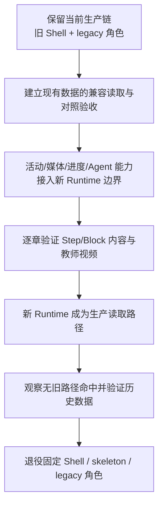

# UPLY 智能教材现有资产去留决策

> 决策日期：2026-09-08
> 基线：`docs/SMART_TEXTBOOK_CURRENT_STATE_AUDIT.md` 与本次只读代码反查
> 范围：只判断现有资产如何进入下一阶段；不设计 Lesson Manifest，不实现新 Runtime，不修改业务代码、API 或数据库。

## 0. 决策口径

本报告使用三个互斥的主分类：

- **KEEP**：当前数据或能力本身仍适合作为长期基础，可以继续沿用。未来可能增加关联或适配，但不以替换其核心语义为目标。
- **MIGRATE**：业务能力必须保留，但当前结构、耦合点或运行方式不能直接承担未来职责；需要迁移到未来的 Template / Region / Step / Block / Runtime 边界。
- **RETIRE**：当前实现不属于目标方向，最终应退出。只要仍被当前发布教材使用，就必须继续保留兼容运行，直到新 Runtime 完整接管并验证历史数据。

本报告区分“能力”和“实现”。例如，学生需要页面容器和内容渲染能力，但当前 `SmartTextbookShell` 与 `ContentRenderer` 的具体实现仍应退役；活动判题能力需要保留，但要从固定 module 页面迁入 Block/Runtime 契约。

所有标记为 **RETIRE — 仅在新 Runtime 接管后可删除** 的内容，在接管前都不得删除字段、组件、Route Handler、对象存储资源或生产数据。

## 1. 总体决策

| 现有层 | 决策 | 目标关系 |
| --- | --- | --- |
| 教材、版本、章节主实体 | KEEP | 继续承担教材身份、版本和章节发布边界 |
| module / node 内容组织 | MIGRATE | 从固定八 module 和约定 JSON 迁入 Step / Block 语义 |
| 活动、判题、录音、进度 | 按资产分为 KEEP / MIGRATE | 保留安全判题和学习证据，迁移其与页面结构的关联 |
| 当前固定 Shell / renderer | RETIRE | 由未来 Runtime 按 Template / Region / Step / Block 解释 |
| 固定 skeleton / layout 常量 | RETIRE | 由后台可发布的 Template / Region 配置替代 |
| 教材后台 / 脚本后台 | MIGRATE | 合并或重组为 `platform_owner` 使用的资产制作和发布能力 |
| 教师视频基础设施 | MIGRATE | 成为教学区主要媒体能力，但不继续依赖 legacy 舞台状态机 |
| legacy 金老师角色系统 | RETIRE | 第一章仍在用，必须等新 Runtime 和视频内容接管 |
| 教学 Agent 会话、事件、流转 | MIGRATE | 保留教学编排能力，改为面向稳定 Runtime target，而非固定 DOM/page key |

## 2. 总表

| 现有资产 | 当前用途 | 当前是否运行 | 主分类 | 未来位置 | 删除/迁移前置条件 |
| --- | --- | --- | --- | --- | --- |
| `digital_textbooks` | 教材根身份、归属和状态 | 是 | KEEP | 教材根实体 | 维持 slug/lesson/app/status 兼容；无需删除 |
| `digital_textbook_versions` | 教材 draft/published 版本 | 是 | KEEP | 教材版本与发布边界 | 新发布链验证可同时定位内容版本和脚本/运行产物 |
| `digital_textbook_chapters` | 章节标题、目标、状态和测试绑定 | 是 | KEEP | 章节实体 | chapter 0、1–16 和现有测试绑定均可继续解析 |
| `digital_textbook_modules` | 当前八个 Step | 是 | MIGRATE | Step 来源/兼容输入 | 所有已发布 module 有确定的 Step 映射；进度和脚本 module 外键已迁移 |
| `digital_textbook_nodes` | Step 内结构化内容 JSON | 是 | MIGRATE | Block 内容来源/兼容输入 | 所有 node content JSON 有无损 Block 映射；媒体、活动和进度外键已处理 |
| `digital_textbook_activities` | 八类活动公开配置 | 是 | MIGRATE | Activity Block 的领域数据 | 八种活动在新 Runtime 等价渲染、提交和恢复完成态 |
| `digital_textbook_activity_secrets` | 答案、反馈和私密听力字段 | 是 | KEEP | 服务端私密判题/听力配置 | 新提交链保持 secret 不下发；旧单轨字段完成兼容或迁移后才可收缩 |
| `digital_textbook_media_assets` | 图片/音频对象登记 | 是 | MIGRATE | Block 媒体引用 | 现有 object key、状态、alt/metadata 均映射；R2 权限不倒退 |
| attempts / node progress | 作答和节点完成度 | 是 | MIGRATE | Runtime 学习进度/证据 | 新旧结构能关联同一活动/Step/Block；历史完成态可恢复 |
| activity page progress | 复合活动分页进度 | 是 | MIGRATE | Block 内部进度 | 多页听力/练习状态可在新 Block 中恢复 |
| guided repeat progress | 跟读 track/line 进度 | 是 | MIGRATE | 跟读 Block 进度 | repeat line/track 标识稳定且历史记录可映射 |
| `digital_textbook_preferences` | 学习语言/辅助模式偏好 | 是 | MIGRATE | Runtime 学习偏好 | 新 Runtime 可恢复现有偏好，且不与具体固定页面状态混淆 |
| speaking evidence / recordings | 私有录音及提交证据 | 是 | KEEP | 口语证据服务 | 新 Runtime 完成录制、上传、消费、防重复提交全链验证 |
| listening tracks | 多轨音频、稿件和状态 | 是 | KEEP | 听力媒体领域数据 | 新 Audio/Listening Block 支持多轨、次数限制和稿件权限 |
| `SmartTextbookShell` 当前实现 | 固定页面、双区、导航和状态协调 | 是 | RETIRE — 仅在新 Runtime 接管后可删除 | 被 Runtime 根容器替代 | 16 章、chapter 0、预览、Agent、响应式和进度验收完成 |
| `ContentRenderer` 当前实现 | 解释 node JSON 并输出页面 | 是 | RETIRE — 仅在新 Runtime 接管后可删除 | 被 Block renderer 替代 | 所有已发布 JSON key 均有兼容 Block/adapter 和回归证据 |
| `Activity` | 八类活动统一 React 入口 | 是 | MIGRATE | Activity Block renderer | 八种类型、公开/私密边界、错误反馈和完成规则保持一致 |
| module-specific panels | 听说、读写、对话、句型和复盘 | 是 | MIGRATE | 复合 Block 或 Step 内组合 | 全流程和浏览器媒体能力通过验收 |
| `SMART_TEXTBOOK_SHARED_SKELETON` | 固定八步、内部 page 和 slot | 是 | RETIRE — 仅在新 Runtime 接管后可删除 | Template/Step 配置替代 | 现有八步和内部 page/slot 已被发布配置完整表达 |
| `SMART_TEXTBOOK_SHARED_LEARNING_LAYOUT` | 固定比例、断点和 focus 规则 | 是 | RETIRE — 仅在新 Runtime 接管后可删除 | Template/Region 配置替代 | 桌面/窄屏/focus/video/blackboard 行为已有等价配置与测试 |
| 当前教材管理后台 | 词汇语法编辑、状态和发布 | 是 | MIGRATE | owner-only 教材/Step/Block 制作入口 | 权限收敛、现有编辑和发布能力均迁入新入口 |
| 当前教学脚本后台 | Agent 节点、媒体、流转和发布 | 是 | MIGRATE | owner-only 视频优先教学编排入口 | draft/发布/预览/原子保存/来源审查与教学流转均被承接 |
| `learning_agent_lessons` | Agent 与 module 的绑定 | 是 | MIGRATE | Agent 与章节/Step 的绑定 | 不再依赖旧 module id 或已有兼容映射 |
| `learning_agent_script_versions` | 脚本 draft/published 版本 | 是 | KEEP | 教学脚本版本边界 | 与新发布产物的版本一致性可校验 |
| `learning_agent_script_nodes` | 台词、媒体、任务和节点流转 | 是 | MIGRATE | 视频优先教学编排节点 | legacy configuration 可兼容读取；稳定 target/媒体关联已建立 |
| `learning_agent_sessions/messages` | 学生 Agent 会话和消息 | 是 | MIGRATE | Runtime 教学会话 | 新 Runtime 可续接、结束、恢复并隔离预览 |
| node attempts / task events | Agent 作答和操作事件 | 是 | MIGRATE | Runtime 交互事件与证据 | event target 不再依赖固定 page/region/DOM，历史事件仍可解释 |
| script audio assets | legacy 台词分段音频 | 是 | MIGRATE | 视频/语音媒体兼容层 | 仍需语音的旧发布脚本完成迁移或保留兼容播放 |
| node interaction secrets | Agent 自建题私密答案 | 是 | KEEP | Agent 服务端私密判题 | 正确项和反馈仍只在服务端使用 |
| Teacher Video 配置/API/player | 教师视频选择、传输和播放 | 部分；第一章发布未使用视频 | MIGRATE | 教学 Region 的主要媒体能力 | 视频 turn 语义与新 Runtime 生命周期、完成/失败处理对齐 |
| `virtualCharacter` | legacy 教师角色选择/位置 | 是，第一章 v23 全部 8 节点使用 | RETIRE — 仅在新 Runtime 接管后可删除 | 无长期目标位置 | 第一章及其他 legacy 发布脚本均已视频化或由兼容快照承接 |
| pose/坐标/缩放/镜头/角色图片 | legacy 角色舞台表现 | 是 | RETIRE — 仅在新 Runtime 接管后可删除 | 无长期目标位置 | 不再有发布脚本选择 legacy；预览、音频和响应式不再引用 |
| 当前黑板 slides/舞台 | 教师旁结构化视觉画面 | 是 | MIGRATE | 教学 Region 中的辅助视觉内容 | 明确哪些画面并入视频、哪些转为独立可渲染内容并逐章验收 |
| Agent remediation | 答错补充讲解 | 是 | MIGRATE | Runtime 教学流转 | 可指向稳定 Step/Block/activity，保持错误反馈和补充讲解 |
| Agent studentTask | 要求学生操作右侧目标 | 是 | MIGRATE | Runtime action/target | 旧 target key 有确定映射；操作完成事件可验证 |
| Agent visualCue | 高亮学生操作目标 | 是 | MIGRATE | Runtime target 高亮能力 | 不再直接依赖固定 page/region/DOM；可访问性行为已验证 |
| 旧 `KoreanLevelOneLesson*Book` / Reader | 未引用的旧章节页面 | 否（现行路由未引用） | RETIRE | 无 | import、测试、静态资源和外部引用反查为零后可单独清理 |
| 旧 `DigitalTextbookManager` | 未引用的旧教材后台组件 | 否（当前 app-scoped 路由未引用） | RETIRE | 无 | 确认无动态引用/文档依赖并由当前 listing 覆盖全部必要能力 |

注：表中 `learning_agent_script_nodes` 的目标是“教学编排节点”，不是对新 schema 的设计。本报告不规定未来节点或发布产物的字段结构。

## 3. 教材主实体

### 3.1 `digital_textbooks` — KEEP

**当前用途与运行状态**

- 教材根记录，连接 lesson、student app、slug、level、标题、状态和 Agent profile。
- `page-content.tsx` 固定以 slug `korean-level-one-smart` 调用 `loadSmartDigitalTextbook()`；loader 首先查询该表并要求学生侧为 published。
- 当前生产链路正在使用。

**决策理由与未来位置**

- 教材身份、所属应用/课程和发布可见性是稳定领域概念，不因页面从固定骨架改为 Template/Runtime 而消失。
- 保持为教材根实体；未来关联新的发布产物属于扩展，不要求替换该表核心语义。

**依赖**

- `lessons`、student app、`digital_textbook_versions`、Agent profile。
- `src/lib/smart-digital-textbook.ts`、教材后台 service/actions、课程页面。

**前置条件与影响**

- 本资产无计划删除。任何字段收缩前必须核对 loader、管理后台、发布 RPC、课程入口和历史版本。
- 破坏 slug/status/lesson 关系会直接导致教材无法加载或错误公开 draft。

### 3.2 `digital_textbook_versions` — KEEP

**当前用途与运行状态**

- 保存教材版本号、draft/published 状态、release note、发布时间；学生 loader 选择 published，后台可查看多版本。
- 当前运行。

**决策**

- KEEP。版本化和不可把 draft 直接送给学生的边界必须长期保留。
- 未来发布产物必须能追溯到教材版本，但本报告不设计其关联字段。

**依赖/前置条件/影响**

- chapters、attempt/version_id、发布 RPC 和后台状态依赖它。
- 任何迁移必须证明学生、预览、历史进度都解析同一预期版本；否则会产生内容与进度错配。

### 3.3 `digital_textbook_chapters` — KEEP

**当前用途与运行状态**

- 保存 chapter number、slug、标题、scenario、goal、状态和 chapter test 绑定。
- chapter 0 课程概览和 1–16 正文章均依赖它；当前运行。

**决策理由与未来位置**

- Chapter 是稳定课程领域边界，未来仍是 Step 集合和发布单元的宿主。
- KEEP；当前写死在 React 的 chapter 0 内容和第一章覆盖标题不应成为删除章节表的理由，反而应在后续迁移中消除双重来源。

**依赖/前置条件/影响**

- version、modules、chapter test、课程查询参数、发布/练习同步。
- 字段调整前必须保护 chapter 0、数值章节路由、现有测试绑定和发布状态。破坏会影响章节导航、解锁、测试和派生练习。

## 4. 内容组织数据

### 4.1 `digital_textbook_modules` — MIGRATE

**当前用途与运行状态**

- 当前每条 module 就是一个 Step；八个 code 和 `sort_order 1..8` 受数据库约束。
- module title/description/accent 进入 Shell；第一章部分标题被 `chapterOneKnowledgeMap` 覆盖。
- `learning_agent_lessons.module_id`、nodes、进度与 UI 导航都依赖它。当前运行。

**决策理由与未来位置**

- “步骤”能力必须保留，但 module 这一固定八分类既承担业务分类又承担页面导航，不能表达后台可配置 Step。
- MIGRATE 为未来 Step 的兼容来源。迁移期可以继续读取表或通过 adapter 转换；不能先删除。

**迁移前置条件**

1. 0–16 章所有 module 都有稳定、可回溯的 Step 对应。
2. `learning_agent_lessons` 的 module 外键或兼容映射已处理。
3. node、progress、footer active state、第一章标题覆盖和发布检查均完成迁移。
4. 新 Runtime 能保持现有排序、完成态和深链行为。

**影响**

- Step 导航、Agent lesson、内容节点、章节完成度、后台课程树和脚本预览。

### 4.2 `digital_textbook_nodes` — MIGRATE

**当前用途与运行状态**

- 保存一个 module 下的内容容器；`content` JSON 承载词汇、语法、对话、听说读写等大量约定字段。
- media、activities、node progress 以 node id 关联。当前运行。

**决策理由与未来位置**

- 内容本身必须保留，但“一整个 node JSON + React 识别 key”不是通用 Block 模型。
- MIGRATE：现有 node 是未来 Block 或 Block 组合的源数据/兼容输入，不能直接视为最终 Block schema。

**迁移前置条件**

- 对所有已发布 `content` key 建立无损映射；空值、locale、顺序和章节特例均覆盖。
- activities/media/progress 的关系能落到稳定内容目标。
- 新旧 renderer 对 16 章做视觉、互动和完成度回归。

**影响**

- `ContentRenderer`、教材后台词汇/语法编辑、所有媒体、题目、node progress、Agent learning target。

### 4.3 `digital_textbook_media_assets` — MIGRATE

**当前用途与运行状态**

- 记录 node/activity 的 image/audio object key、用途、生产状态、alt text 和 metadata；loader 为 ready 资源生成签名 URL。
- 当前运行。

**决策理由**

- 私有媒体登记、ready 状态、alt text 和对象存储安全必须保留。
- 当前关联以 node/activity 为中心，未来需要被 Block 引用，因此主分类为 MIGRATE，而不是删除。

**前置条件与影响**

- 每个现有 object key 有唯一新引用；未 ready、rejected 和缺失资源行为一致。
- R2 签名和 service-role 隔离不倒退。
- 迁移错误会造成图片/音频缺失、无障碍文本丢失或私有对象暴露。

## 5. 教材活动、答案与提交

### 5.1 `digital_textbook_activities` — MIGRATE

**当前用途与运行状态**

- 保存八种活动的 key/type、题干、说明、选项、公开配置、最大尝试次数和是否计入完成。
- loader 下发公开字段；`Activity` 和专用 panel 渲染；Server Action 按 id 提交。当前运行。

**决策理由与未来位置**

- 活动领域数据和稳定 activity id 有长期价值；但当前活动靠 node、module code、activity key 和前端特判决定出现位置。
- MIGRATE 到 Activity Block 的内容来源；保留原子判题语义，解除对固定 module 页面的定位依赖。

**迁移前置条件**

- 八种活动都能等价渲染、提交、重试、反馈和恢复。
- `reference_activity_id`、attempt、page progress、recording evidence 全部仍能定位同一活动。
- `pattern-*`、`dialogue-roleplay` 等 key 特例已由显式兼容映射承接。

**影响**

- 题目显示、Agent 引题、判题、分数、章节完成、录音、听力和复盘。

### 5.2 `digital_textbook_activity_secrets` — KEEP

**当前用途与运行状态**

- 保存 answer key、分层反馈、听力稿件/对象 key/status；浏览器初始数据不含答案。
- `smart-textbook-submission.ts` 和 audio/transcript Route Handler 在服务器读取。当前运行。

**决策理由**

- 私密判题与公开题目分离是必须保留的安全边界，与 UI 架构无关。
- KEEP。未来可逐步理清旧单轨听力字段与 `listening_tracks` 的重复，但不能把 secret 合并到浏览器可见 Block payload。

**前置条件与影响**

- 无整体删除计划。删除旧听力列前必须确认所有活动已经使用多轨表，audio/transcript API 无 fallback 命中。
- 错误迁移可能直接泄露答案或使线上题目无法提交。

### 5.3 `Activity` — MIGRATE

**当前用途与运行状态**

- `KoreanLevelOneSmartTextbook.tsx → Activity` 是八种活动的通用 React 入口；负责输入状态、提交、反馈和部分专用 presentation。
- 当前运行。

**决策理由与未来位置**

- 原子活动 renderer 可复用价值最高，但它仍嵌在巨型教材文件并读取当前 activity/config 约定。
- MIGRATE 为 Activity Block renderer；不是原样复制，也不是先删后做。

**前置条件与影响**

- 保持 props 所承载的 locale、trackingDisabled、completion callback、attempt/feedback 语义。
- 服务端提交契约和无答案下发原则不变。
- 影响全部客观题、开放任务、进度和 Agent activity 引用。

## 6. 学习进度、听力和录音

### 6.1 attempts 与 node progress — MIGRATE

**当前用途与运行状态**

- `digital_textbook_attempts` 保存每次作答；`digital_textbook_node_progress` 保存 node completion/mastery/attempt count。
- `record_smart_textbook_attempt`、speaking RPC 和 direct-table fallback 写入；loader 恢复。当前运行。

**决策理由**

- 历史学习证据必须保留，但 node 是待迁移的内容边界，因此关联和聚合方式需要迁移。

**前置条件与影响**

- 新 Runtime 能读取旧记录并避免重复计分/重复完成。
- activity/version/student/tenant 维度保持；课程首页和章节完成聚合结果一致。
- 破坏会导致已学内容变未完成、重复尝试或错误解锁。

### 6.2 activity page progress — MIGRATE

- **当前用途**：保存多页听力/复合活动的页完成；当前运行。
- **理由**：细粒度进度要保留，但 page 是当前固定骨架概念，需要映射到 Block 内部稳定步骤。
- **前置条件**：新 Block 可恢复同一页/子任务，并处理旧页数、旧 key 与内容版本变化。
- **影响**：听说、读写和复合练习的刷新恢复与完成百分比。

### 6.3 guided repeat progress — MIGRATE

- **当前用途**：保存跟读 track/line 完成；当前运行。
- **理由**：跟读能力保留，关联要进入 Pronunciation/Shadowing Block。
- **前置条件**：repeat line/track 有稳定标识，录音、播放次数和旧记录能映射。
- **影响**：跟读恢复、听说 Step 完成和学习证据。

### 6.4 speaking evidence 与 recordings — KEEP

- **当前用途**：浏览器录音上传到私有对象存储，evidence 记录归属、大小、类型和消费 attempt；当前运行。
- **理由**：这是与页面布局无关的安全证据服务，目标 Runtime 仍需要。
- **依赖**：recordings Route Handler、R2/storage、speaking/roleplay Action、speaking RPC。
- **前置条件**：更换调用方前验证录制、上传、查询、删除、消费和防重复使用；在此之前不得删除 Route、bucket、表或旧对象。
- **影响**：口语提交、角色扮演完成、隐私和存储清理。

### 6.5 listening tracks — KEEP

- **当前用途**：按 activity/page 提供多轨音频、稿件和 ready 状态；当前运行。
- **理由**：多轨听力是稳定领域能力，可被未来 Listening Block 直接调用。
- **依赖**：audio/transcript API、activity secrets、R2、播放次数 UI。
- **前置条件**：新 Runtime 支持权限、ready 状态、正常/慢速次数和 transcript 时机；旧单轨 fallback 不再命中前不得清理 secrets 中旧字段。
- **影响**：听力播放、题目提交和听力稿件保密。

### 6.6 `digital_textbook_preferences` — MIGRATE

- **当前用途**：保存 locale/support mode 等教材学习偏好，loader 恢复；当前运行。
- **理由**：偏好能力要保留，但读取和应用应由新 Runtime 负责；它不同于当前 `sessionStorage` 中的 module/page 临时位置。
- **依赖**：`saveSmartTextbookPreferenceAction()`、loader、Shell locale/support state。
- **前置条件**：新 Runtime 能读取旧记录、保存相同用户/tenant/textbook 范围，并明确与未来模板默认值的优先级。
- **影响**：界面语言、沉浸/辅助显示和刷新后的学习体验。

## 7. 当前学生 Runtime 代码

### 7.1 `SmartTextbookShell` — RETIRE — 仅在新 Runtime 接管后可删除

**当前用途与运行状态**

- 负责全屏页、学习头、左侧 Agent 舞台、右侧内容区、底部 Step、响应式/focus、sessionStorage 和大量状态协调。
- 16 个正文、chapter 0、教学脚本预览均依赖它；当前核心运行代码。

**决策理由与未来位置**

- 其“承载教材”的职责将由新 Runtime 接管，但当前 7,500 行实现把 Layout、Region、Step、内容、Agent 和章节特例耦合在一起，不适合原样长期保留。
- exact component 归类 RETIRE；其中可复用的 Activity/media/Agent 能力分别 MIGRATE。

**退役前置条件**

1. 所有发布章节在新 Runtime 中完整可用，chapter 0 和第一章硬编码覆盖已被承接。
2. 桌面/窄屏、30/70 等现有体验有明确验收结果，而非静默丢失。
3. preview、platform audit、trackingDisabled、课程解锁和错误状态等价。
4. sessionStorage 当前位置与数据库长期进度均有兼容策略。
5. Agent legacy 和 video 两条链在过渡期都能运行。

**影响**

- 几乎整个学生教材：布局、导航、进度、Agent、媒体、所有活动和预览。

### 7.2 `ContentRenderer` — RETIRE — 仅在新 Runtime 接管后可删除

**当前用途与运行状态**

- 将 node `content` 中约定 key 转成词汇、语法、句型、对话、听说读写页面；当前运行。

**决策理由**

- exact renderer 是隐式 Block Registry：字段名、module code 和 JSX 分支写死。目标方向要求由 Block renderer 明确解释内容，因此旧分发器最终退役。

**退役前置条件**

- 每个已发布 content key 和展示分支都有兼容 Block/adapter。
- 逐章视觉、文本、媒体、交互和无障碍反查完成。
- 没有生产数据仍只能由旧 renderer 解释。

**影响**

- 所有右侧正文；提前删除会使数据库仍有数据但学生看不到。

### 7.3 module-specific panels — MIGRATE

覆盖 `PatternConversationPractice`、`PatternCompositionPractice`、`ListenSpeakLearningPanel`、`DialogueRoleplayPractice`、`ReadWriteLearningPanel`、`ReviewResultPanel`、`RecordingControl`。

**当前用途与运行状态**

- 承担句型组合、听力、跟读、口语、角色扮演、读写和复盘的复合流程；当前运行。

**决策理由与未来位置**

- 学习能力要保留，但当前按 module code/activity key 查找并混合浏览器 API、Server Action 与布局。
- MIGRATE 为复合 Block 或由多个原子 Block 组合的兼容实现；本报告不决定拆分粒度。

**迁移前置条件/影响**

- 保持 MediaRecorder、SpeechRecognition 降级、录音证据、播放限制、页进度和 completion weight。
- 对 `pattern-choice/order/compose`、`dialogue-roleplay` 等历史 key 做兼容。
- 影响听说读写、复盘与章节完成，是高风险迁移。

## 8. 固定骨架与布局

### 8.1 `SMART_TEXTBOOK_SHARED_SKELETON` — RETIRE — 仅在新 Runtime 接管后可删除

**当前用途与运行状态**

- 固定八个 module code 的 pages、page labels、content/activity slots 和部分 completion weights；当前 Shell 直接读取。
- 当前运行且与数据库 constraint 相互锁定。

**决策理由**

- exact constant 与后台可配置 Step/Block 相冲突；长期由发布的配置表达。
- 过渡期它是现有 16 章的兼容规范，不能先删。

**前置条件/影响**

- 所有八步、内部页、页名、slot、完成权重已被新发布配置或兼容转换完整表达。
- 脚本 learning target registry 不再依赖这些 page/region key。
- 影响 Step 页签、内容分发、进度和 Agent target。

### 8.2 `SMART_TEXTBOOK_SHARED_LEARNING_LAYOUT` — RETIRE — 仅在新 Runtime 接管后可删除

**当前用途与运行状态**

- 固定左侧 30%、收起 64px、1280 分屏阈值、920px 内容宽、16:9 黑板、56px header 和 focus 规则；当前运行。

**决策理由**

- exact constant 应被 Template/Region 配置取代；现行响应式和 Agent focus 行为仍须兼容。

**前置条件/影响**

- 新 Runtime 能解释不同 Layout，同时通过现有桌面、窄屏、视频和教学 focus 回归。
- Agent 不再直接假设固定左/右 DOM。
- 提前移除会破坏舞台尺寸、黑板、视频、内容可见性和底部导航。

## 9. 管理后台

### 9.1 当前教材后台 — MIGRATE

**当前用途与运行状态**

- app-scoped `/textbooks` 页面读取教材树，只允许编辑词汇/语法 JSON、教材状态、语法音频和章节发布；当前运行。
- 外层使用 `manageContent`，编辑依赖 `current_user_can_manage_standard_question_bank`，只有章节发布显式 owner-only。

**决策理由与未来位置**

- 已有词汇/语法编辑、版本状态和发布入口必须保留；但功能范围不足且权限不符合目标。
- MIGRATE 为 `platform_owner` 专用的教材内容制作入口，并承接 Step/Block 编辑能力；本报告不设计页面或 schema。

**迁移前置条件**

1. 路由、读取 service、所有 Action 均统一验证 `platform_owner`，不能只隐藏菜单。
2. 词汇、语法、音频、状态和发布能力无损迁移。
3. 新后台编辑结果可由新 Runtime 预览并发布。
4. current listing 获取但不使用的 toolbox payload 被明确去留，不隐式混入教材 source of truth。

**影响**

- 平台权限、内容维护、章节发布、工具箱/练习同步、已有运营流程。

### 9.2 当前教学脚本后台 — MIGRATE

**当前用途与运行状态**

- owner-only 编辑 script version/node、台词、黑板、legacy 角色、教师视频、学生任务、问题、反馈和流转；支持 draft、预览、来源审查、发布检查、原子保存。当前运行。

**决策理由与未来位置**

- 版本化、视频选择、教学流转和预览必须保留；legacy 角色表单应退出，固定 Shell target 和第一章限定预览也需迁移。
- MIGRATE 为视频优先、面向新 Runtime 稳定 target 的教学编排入口。

**迁移前置条件**

- draft/published/archived、原子并发保护、source review、release check 和 tracking-disabled preview 全部有替代入口。
- 所有仍为 legacy 的发布脚本完成内容接管前，后台仍要能读取和必要时维护旧字段。
- 新视频配置能在实际学生 Runtime 而不只是后台预览中验证。

**影响**

- 教师视频、Agent 对话、发布质量门、第一章当前教学流程和平台 owner 工作流。

## 10. `learning_agent_*` 数据与 Runtime

### 10.1 `learning_agent_lessons` — MIGRATE

- **当前用途**：把 Agent lesson 绑定到教材 module 和 profile；第一章 orientation 当前使用。
- **理由**：Agent 与教学范围的绑定继续存在，但固定 module 外键需适配未来 Step/教学 Region。
- **前置条件**：每个现有 lesson 能定位新目标；published script、session 和后台查询不丢失。
- **影响**：loader 开场、respond、脚本后台、所有 module 教学流程。

### 10.2 `learning_agent_script_versions` — KEEP

- **当前用途**：draft/published/archived 版本；学生只读 published，owner 预览 draft。当前运行。
- **理由**：脚本版本和发布隔离是稳定概念，也适用于视频优先教学。
- **依赖**：lessons、script nodes、audio assets、source review、publish logs。
- **前置条件**：不删除；若调整发布关联，必须验证教材版本与脚本版本组合不会漂移。
- **影响**：学生内容一致性、后台预览和回滚/审查。

### 10.3 `learning_agent_script_nodes` — MIGRATE

**当前用途与运行状态**

- 保存台词、node type/order/title、configuration、activity 引用、action/next/remediation/terminal；当前核心运行。

**决策理由**

- 教学编排节点继续需要，但 configuration 同时混合 video、legacy 角色、黑板、固定 target 和流转。
- MIGRATE：保留版本化节点和教学语义，逐步解除 legacy 表现层字段与固定 Shell 坐标；本报告不定义新节点格式。

**前置条件/影响**

- 发布 v23 等现有 JSON 可继续解释，或已转换并核对。
- respond、preview、audio、interaction secret、task events 和发布 RPC 同步迁移。
- 提前改变会中断左侧教学、引题、反馈和流转。

### 10.4 sessions/messages — MIGRATE

- **当前用途**：保存学生 Agent 会话、当前位置和消息；当前运行。
- **理由**：会话连续性保留，但当前状态机和节点/固定 Shell 耦合。
- **前置条件**：新 Runtime 可新建、恢复、推进、完成和隔离 preview；在途 session 有明确兼容行为。
- **影响**：刷新续接、Agent 当前节点、学生消息历史和学习记录。

### 10.5 node attempts / task events — MIGRATE

- **当前用途**：记录脚本提问尝试和学生完成右侧操作/媒体事件；当前运行。
- **理由**：教学证据要保留，event target 需从固定 page/region/target key 迁到 Runtime 稳定目标。
- **前置条件**：旧 event 可解释；新 target 能防伪造、去重并驱动正确节点推进。
- **影响**：Agent 等待学生操作、答题反馈、完成判断和运营审计。

### 10.6 script audio assets — MIGRATE

- **当前用途**：legacy 台词分段语音和开场 buffer speech；第一章仍依赖角色+语音模式。
- **理由**：视频优先后需求降低，但旧脚本、无视频 fallback 或无障碍场景仍可能需要；先迁移媒体职责，不能直接退役。
- **前置条件**：所有 legacy 发布脚本视频化；确认新 Runtime 是否仍支持独立语音；speech Route 无调用后才能重新分类为 RETIRE。
- **影响**：第一章教师说话、开场、无视频 fallback 和预览。

### 10.7 node interaction secrets — KEEP

- **当前用途**：保存脚本自建单选的正确项和正误反馈；respond 服务端使用。当前运行。
- **理由**：服务端私密答案边界稳定。
- **前置条件**：不删除；如未来只允许引用教材 Activity，也要先证明所有脚本自建题已迁移且历史版本无需预览。
- **影响**：Agent 自建问题的判定与反馈。

## 11. 教师视频和 legacy 角色

### 11.1 Teacher Video 配置、API 与 `TeacherVideoPlayer` — MIGRATE

**当前用途与运行状态**

- `configuration.teacherVideo` 可按 explanation/task/question/operationFeedback/correctFeedback/incorrectFeedback 等 turn 引用视频。
- `teacherVideoForTurn()` 选择视频，`TeacherVideoPlayer` 播放，`/api/learning-agent/teacher-video` 安全提供 R2 对象。
- 功能代码已存在并可由后台配置；2026-09-08 第一章发布 v23 的 8 个节点中 teacherVideo 为 0，因此第一章普通学生链当前未使用视频模式。

**决策理由与未来位置**

- 视频符合明确目标方向，应保留其媒体安全、选择和播放能力。
- 仍需脱离当前 legacy/video 双模舞台、Agent turn 和固定左区生命周期，故归类 MIGRATE，而非原样 KEEP。

**迁移前置条件**

- 新 Runtime 定义的教学 Region 能处理加载、播放、暂停、完成、失败、重试、切换 Step 和窄屏。
- R2 私有访问、后台验证、发布检查和 transcript/无障碍要求不倒退。
- 对“没有视频的现有发布节点”提供明确兼容路径。

**影响**

- 教学主画面、Agent 节点推进、学生操作时机、网络失败和后台预览。

### 11.2 `virtualCharacter` — RETIRE — 仅在新 Runtime 接管后可删除

**当前用途与运行状态**

- 决定 `uply-teacher` 等 legacy 角色及位置；loader 读取首节点，respond 返回后续状态。
- 第一章发布 v23 的 8 个节点全部包含该字段，因此当前仍运行。

**决策理由**

- 明确目标为视频教学，不再以旧角色作为核心；`virtualCharacter` 没有长期目标职责。

**退役前置条件**

1. 第一章及所有其他 published script 不再需要 legacy 模式，或有冻结兼容 runtime 可继续服务旧版本。
2. 教师视频覆盖开场、讲解、问题、反馈和无视频失败路径。
3. loader、respond、preview、后台表单和发布检查不再读取该字段。
4. 历史脚本预览/审计的保留策略已经明确。

**影响**

- 当前第一章左侧教师、台词同步、舞台布局和后台旧脚本维护。

### 11.3 pose、角色坐标/缩放、镜头、对话位置、图片资源 — RETIRE — 仅在新 Runtime 接管后可删除

覆盖：

- `scriptPerformances[].pose`
- `characterX/Y/scale`、split/narrow 坐标/scale
- `dialogueX/Y`
- `classroomShot`、legacy `learningLayout`
- `teacher-kim-character.ts`
- `/api/learning-agent/characters/[pose]`
- 角色图片帧和对应生成/预览脚本

**当前用途与运行状态**

- 第一章首节点实际包含 `greeting`、`explaining` 及多套响应式坐标；Shell 当前以图片帧而非 Web 3D renderer 显示。当前运行。

**决策理由**

- 这些字段只服务 legacy 角色舞台；视频优先目标下没有长期价值。

**退役前置条件与影响**

- `virtualCharacter` 的所有退役条件均满足。
- 全仓 import、Route 请求、R2/static asset、后台 form、published configuration 和历史预览反查为零或有隔离归档方案。
- 提前删除会使第一章教师消失、对白错位或 Agent 卡住。

### 11.4 旧 FBX/Blender/3D 制作脚本 — RETIRE

- **当前用途**：制作/预览角色帧，不在学生运行请求链；当前学生端没有 Three.js/FBX/WebGL 角色渲染。
- **理由**：视频方向不再需要旧角色制作流水线。
- **前置条件**：确认不再用于重新生成线上图片帧，归档原始资产和版权/来源信息，仓库引用为零。
- **影响**：不直接影响 Runtime；可能影响旧角色素材再生产和历史可追溯性。

## 12. 黑板能力 — MIGRATE

**当前用途与运行状态**

- `configuration.display.slides[].elements` 保存文本、列表、媒体等黑板内容，`TeachingBlackboardSlide` 渲染，placement 控制舞台位置；后台 `TeachingBlackboardEditor` 可编辑。
- 第一章发布脚本当前有 slides，例如首节点“本章学习路线”。当前运行。

**决策理由与未来位置**

- “旧角色旁的固定黑板舞台”不应原样保留，但结构化辅助视觉、课件画面或视频旁补充内容仍可能具有教学价值。
- MIGRATE。后续需按内容逐项决定并入教师视频还是作为独立教学内容；本报告不做产品/格式设计。

**迁移前置条件**

- 对每个 published slide 建立去向清单并逐章验收。
- 媒体 object key、locale、排版和无障碍语义不丢失。
- 脚本预览和学生 Runtime 使用同一解释结果。

**影响**

- 第一章路线说明、知识讲解画面、教师视频构图、后台模板和发布检查。

## 13. Agent 教学协调能力

### 13.1 sessions/messages — MIGRATE

详见 10.4。会话和消息作为能力保留；当前节点/舞台状态机需要适配新 Runtime。

### 13.2 events — MIGRATE

**当前用途与运行状态**

- `/api/learning-agent/events` 接收 `audio_completed` 等右侧学习事件，写 task event 并推动 Agent；preview 有独立 Route。当前运行。

**决策理由**

- Runtime 仍需向教学编排报告学生已完成的可验证动作，但 event target 不能继续依赖固定 DOM/page。

**前置条件/影响**

- 新 target 稳定、可授权、可去重；preview 与真实记录隔离；旧事件能兼容解释。
- 影响 Agent 是否等待、继续、给反馈或错误提前推进。

### 13.3 remediation — MIGRATE

**当前用途与运行状态**

- `remediation_node_key` 在答错时引用补充讲解或活动提示；当前 respond/runtime 使用。

**决策理由**

- 错误补救是稳定教学能力；引用目标需适配新 Step/Block/activity，而不是固定旧节点/页面。

**前置条件/影响**

- 保留最大尝试、分层提示、补充讲解和返回主线语义；所有旧 key 有映射。
- 影响错误反馈质量、Agent 流程和学生是否被卡住。

### 13.4 studentTask — MIGRATE

**当前用途与运行状态**

- 脚本节点要求学生点击、播放或完成右侧对象；通过 learning target registry 和 events 验证。当前运行。

**决策理由**

- 教师视频播放后引导学生操作仍是核心能力，但 target 当前由固定 page/region/object key 定义。

**前置条件/影响**

- 每个 published target 能定位新 Runtime 中唯一、可操作且可访问的对象。
- 完成事件必须来自真实操作，不能只靠客户端宣称。
- 影响 Agent 节奏、互动完成和教学证据。

### 13.5 visualCue — MIGRATE

**当前用途与运行状态**

- 对右侧目标做 pulse 等视觉提示，包含次数和时长；当前运行。

**决策理由**

- 引导注意力的能力可保留，target 和表现应由 Runtime/Block 管理，不能由 Agent 直接假设固定 DOM。

**前置条件/影响**

- target 映射完成；键盘、屏幕阅读器、减少动态效果偏好和窄屏可见性经过验证。
- 影响学生能否找到操作目标，也影响 task event 的完成。

### 13.6 教材活动引用 — MIGRATE

- `reference_activity_id` 避免在脚本中重复保存教材题，能力应保留；该连接本身的主分类为 MIGRATE。
- activity id 和服务端 secret 继续保留；脚本如何把题展示在某个 Step/Block 需迁移。
- 在所有引用可解析、新 Runtime 能聚焦正确 Activity Block 前，不得删除旧引用和 Shell focus 兼容逻辑。

## 14. 旧页面和兼容代码

### 14.1 `KoreanLevelOneReader`、`KoreanLevelOneBookTemplate`、16 个 `KoreanLevelOneLesson*Book` — RETIRE

- 现行 `[space]/apps/korean/.../page.tsx → page-content.tsx` 不 import 它们；当前学生 Runtime 不运行。
- 最终可清理，但仍需确认动态 import、Storybook/测试、外部文档、静态资源和未提交分支没有依赖。
- 清理不会替代当前 Shell 迁移，也不能作为新架构工作的前置“顺手优化”。

### 14.2 旧 `DigitalTextbookManager` — RETIRE

- 当前 app-scoped `/textbooks` 使用 features 目录的 listing/dialog；旧 Manager 未进入该入口。
- 在确认无动态引用和能力差异后可单独退役；本阶段不删除。

### 14.3 `loadKoreanLevelOneChapterOne()` deprecated wrapper — RETIRE

- 现行页面使用 `loadSmartDigitalTextbook()`；wrapper 已标 deprecated。
- 全仓调用为零且测试不依赖后可删除；不影响通用 loader。

### 14.4 `learning_agent_steps` fallback 与 direct-table submission fallback — RETIRE（兼容条件满足后）

- respond 仍有旧 steps fallback；submission 在 RPC schema 不匹配时有直接表写入 fallback。
- 二者不是目标长期路径，但移除前必须用生产观测/数据库版本确认不再命中，并覆盖错误和回滚场景。
- 过早删除可能使旧脚本无法运行或题目无法记录。

### 14.5 当前 loader、API、Server Action 与 RPC

| 资产 | 当前状态 | 决策 | 前置条件与影响 |
| --- | --- | --- | --- |
| `loadSmartDigitalTextbook()` / `SmartTextbookData` | 学生初始服务端聚合入口；运行中 | MIGRATE | 新 Runtime 数据入口能同时取得教材内容、媒体、进度和 Agent 开场；旧 Shell 退出前保持当前返回契约 |
| `smart-textbook-actions.ts` | 活动、分页、跟读、角色扮演和偏好写入；运行中 | MIGRATE | 调用方改为 Block/Runtime 后仍保持鉴权、preview 不落库和刷新首页数据行为 |
| `smart-textbook-submission.ts` 服务端判题核心 | 八类活动校验；运行中 | KEEP | 保持答案只在服务器、开放活动完成要求和 attempt 上限；仅适配新调用边界 |
| `smart-textbook-completion.ts` | 服务端确认完成辅助；运行中 | KEEP | 新 Runtime 不得用纯客户端状态替代服务端完成证据 |
| audio/transcript Route Handlers | 私有听力媒体与稿件；运行中 | KEEP | Listening Block 保持授权、ready、多轨和稿件时机 |
| recordings Route Handler | 录音上传/读取/删除；运行中 | KEEP | 新调用方通过相同归属、格式、大小和 evidence 规则验收 |
| `/api/learning-agent/respond` / `events` | Agent 状态推进和任务事件；运行中 | MIGRATE | 新 Runtime target、Step/Block 关联和在途 session 兼容完成 |
| preview respond/event | owner 脚本预览；运行中 | MIGRATE | 新 Runtime 预览不写学生数据，且不再限于旧固定 Shell |
| speech/character Routes | legacy 台词语音和角色图片；第一章运行中 | RETIRE — 仅在新 Runtime 接管后可删除 | 所有发布脚本视频化或有冻结兼容服务，且请求观测为零 |
| teacher-video/blackboard-media Routes | 私有教学媒体；代码可用 | MIGRATE | 教师视频和辅助视觉接入新教学 Region，保持对象存储安全 |
| `record_smart_textbook_attempt` / speaking RPC | 原子记录 attempt/progress；运行中 | MIGRATE | 新 Step/Block 关联和历史进度兼容后再调整；学生结果必须等价 |
| teaching script 原子保存/发布 RPC | 后台节点保存、快照和发布；运行中 | MIGRATE | 新后台继续提供并发保护、发布校验、来源审查和可追溯版本 |

## 15. 迁移顺序约束

本节只描述依赖顺序，不设计或启动下一阶段：

强制约束：

1. 先保证新路径能读旧数据，再考虑删除旧解释器。
2. 先让教师视频覆盖实际发布节点，再退役 `virtualCharacter` 和 speech/pose 资源。
3. 先迁移活动/进度关联，再迁移或收缩 module/node。
4. 先让后台和所有写操作 owner-only，再扩大其 Step/Block 编辑范围。
5. 只有学生生产链、owner 预览和历史进度三者都通过，旧 Runtime 才能退出。

## 16. 必须保护的验收基线

- published 教材/脚本隔离，draft 不泄露给学生。
- chapter 0 与 1–16 章都能进入、导航和恢复。
- 八种活动服务端判题，answer secret 不下发。
- attempt 上限、正确性、开放活动完成要求和章节完成百分比不变。
- 多轨听力、播放限制、transcript 权限、音频 ready 状态不变。
- 录音归属、格式/大小校验、evidence 消费和删除行为不变。
- guided repeat、activity page 和 node 历史进度可恢复。
- Agent session、问题、反馈、remediation、studentTask、event 和 visualCue 可用。
- 教师视频失败时有明确状态；迁移期旧角色发布内容仍可运行。
- R2 私有对象和 service role 不暴露。
- platform audit / script preview 不写学生进度。
- 管理后台读写和发布全部符合 `platform_owner` 目标权限。

## 17. 只读自我验证

本报告完成后按以下口径反查：

1. 对照 `SMART_TEXTBOOK_CURRENT_STATE_AUDIT.md` 的学生入口、真实第一章 v23、数据库表、API、后台和权限结论。
2. 核对 `smart-textbook-skeleton.ts` 中八 module/page/layout 常量仍被当前 Shell 引用，因此均未误标为“可立即删除”。
3. 核对第一章发布 v23 的 8 个节点有 `virtualCharacter`、0 个节点有 `teacherVideo`，因此 legacy 角色全部标记为“仅在新 Runtime 接管后可删除”。
4. 核对 `Activity`、submission Actions、attempt RPC、recording/audio/transcript Route 仍在现行路径，因此没有把活动或学习证据归为直接 RETIRE。
5. 核对 app-scoped `/textbooks` 与 `/teaching-scripts` 的当前路由、service 和权限，区分“后台能力迁移”与“旧未引用页面退役”。
6. 核对 `learning_agent_*` 的 version/node/session/event/secret 不同职责，没有把整组表粗暴归为同一删除结论。
7. 核对所有 RETIRE 项均附带前置条件；只有已确认不在现行路由的旧 Reader/Lesson Book/Manager 可进入独立清理候选，本阶段仍未删除。

## 18. 最终判断

UPLY 不能通过“删除旧 Shell 和金老师字段”直接进入新架构。长期可保留的核心是教材/版本/章节身份、服务器端私密判题、学习证据、多轨听力、录音安全和脚本版本边界；需要迁移的是 module/node、活动呈现、媒体关联、进度聚合、管理后台、教师视频和 Agent target；最终退役的是固定 Shell/renderer/skeleton/layout 与 legacy 角色舞台。

当前最严格的退出门槛是第一章真实发布链：它仍以 legacy `virtualCharacter + scriptPerformances + speech + blackboard` 运行。新 Runtime 未接管、教师视频未覆盖、历史进度未验证之前，这条路径及其数据和资源必须完整保留。
