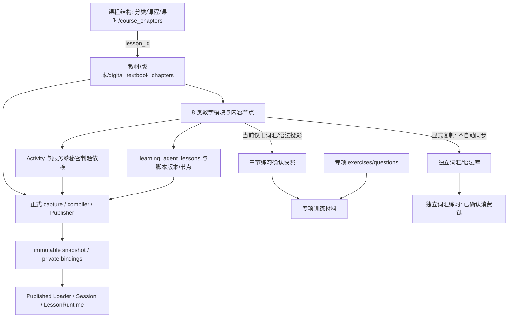

# 教材数据与四个制作板块只读对账审计

日期：2026-09-13。任务性质：只读调查与后续改造建议；**未实施修复、未部署**。

## 1. 结论先行

1. **数据库没有丢失语法。**实际韩语教材第 1–16 章有 **63 张 `content.grammarCards`**；后台 `grammarOf()` 只读取 `content.grammar` 且要求 `item.title`。实际 16 个语法节点都没有该旧字段，因此页面显示 0。第一章真实有 3 张卡。
2. 这是**制作端、运行端及数据库引用函数的 JSON 内容契约不一致**，不是已经证明需要重建关系表的数据库故障。教材→版本→章节→模块→节点的实际归属链可查询成立。SQL `content` 只约束 object，不能阻止应用各自使用不同的内部字段。
3. 不能只把统计的字段名换掉。现有语法编辑 Action 仍写 `content.grammar`；章节引用 RPC 也只提取旧格式。只修计数会出现“看得到，改不到”或“页面能选，数据库拒绝确认”。
4. **线上与主开发目录不完全相同。**已部署教材 Studio、第一章工作台及单版本制作 DAL 有些仍未进入主目录。后续必须以可审查的线上基线整合开发候选，不能直接拿主目录覆盖线上。
5. 四块职责都存在，但当前制作能力不等于完整教材编辑器：第一章工作台可读 8 Step / 19 Activity，只允许符合约束的单选题题干与答案索引编辑；词汇、语法跳转旧编辑器；教学脚本独立发布，Runtime Adapter 仍要求 published v23。
6. **权限存在与既定产品要求不符的实现。**教材旧编辑 Action 使用 `current_user_can_manage_standard_question_bank()`；数据库实际实现允许平台负责人、active platform_admin 或显式 `standard_question_bank.manage` 授权者，并非 owner-only。未读取人员列表或冒用身份，不能推断当前谁已经利用该路径。
7. 独立语法库有 3 条历史 `source=textbook` 数据，但本次追踪的学生语法专项页面读取的是专项题库和章节引用材料，**没有发现它直接使用独立语法库的链路**。不能再笼统宣称“编辑独立语法库就更新学生语法练习”；也不能据此立即删除这 3 条数据。

## 2. 范围、基线与证据等级

本报告中的路径约定：

- **M**：`/home/yangzhen/projects/my-lms-system`，主开发目录；HEAD `b1672390ae96357a2143358235cc10edeff8d488`，不是干净工作区。
- **R**：`/home/yangzhen/releases/uply-first-enable-20260910/source`，现有部署源码。页面事实以 R 为准；`R/路径`不是主目录同名文件的替代指称。
- **DB**：与受限运行配置核对为同一个 my-lms-system Supabase 项目的实际 PostgreSQL catalog / 聚合查询。
- **建议**：没有实施；不可当成现有能力。

已阅读相关现状/去留文档及工作台、Studio、单版本工作流、最近教学脚本/工具整理报告，并反查实际源码。历史报告只用于定位，不以测试报告替代本轮数据库事实。

关键差异：

| 文件 | M 与 R |
|---|---|
| `src/features/digital-textbook/api/service.ts` | 不同；R 增加章节标题，但两者 grammarOf 都仍读旧格式 |
| `src/features/digital-textbook/components/digital-textbook-listing.tsx` | 不同；M 旧表格，R 使用 TextbookStudio |
| `src/app/dashboard/admin/digital-textbook/page-content.tsx` | 不同；R 接受工作台入口参数 |
| `src/features/digital-textbook/components/textbook-studio.tsx` | R 中存在，M 没有 |
| `src/features/digital-textbook/workbench/service.server.ts` | R 中存在，M 没有 |
| `src/lib/smart-textbook-publishing/authoring.server.ts` | R 中存在，M 没有 |
| `src/app/dashboard/admin/digital-textbook/actions.ts` | 本轮比较一致 |
| `src/features/learning-agent-script-studio/service.ts` | 本轮比较一致 |
| `src/features/growth-toolbox/api/service.ts` | 本轮比较一致 |
| `src/features/growth-toolbox/components/growth-toolbox-listing.tsx` | 本轮比较一致，含最近三个工作区整理 |

开始时已有 6 个修改的业务文件及多份未跟踪报告/测试/产物。本轮不覆盖、提交或清理它们。详细 hash 和状态见配套 baseline 证据。

### 只读数据库方法

- 使用现有 PostgreSQL 17.6.1.143 工具镜像及受限 service 配置；核对 user 的项目后缀与运行 Supabase 项目匹配，`sslmode=verify-full`，未降低验证。
- Docker 无法直接挂载当前环境文件路径，初次 psql 在连接前失败。之后只经进程标准输入将连接文件送入临时内存文件系统；容器只读根、无额外 capabilities，退出释放，不输出凭据。
- `PGOPTIONS=default_transaction_read_only=on`；每次 `BEGIN ... REPEATABLE READ READ ONLY`，20 秒语句超时；只执行 SELECT、会话设置及结束只读事务。
- psql 确认客户端连接 TLSv1.3。`pg_stat_ssl` 显示 false 是本次经 pooler 查询所得的数据库后端连接观测，不能拿它冒充客户端 TLS 结果；客户端 TLS 单独核验。
- 查询时间窗口约 UTC 01:39–01:51；最终证据事务时间为 01:51:40 UTC。各次是独立只读事务，不声称跨所有查询全局冻结。重复章节聚合一致。
- 不读 `profiles` 人员行、学生作答/进度/录音、activity secret 数据行；只读权限函数定义以判断权限语义。不操作媒体对象。
- 脱敏证据：`docs/evidence/textbook-data-audit-20260913/readonly-summary.json`。仅数量、字段形态、约束/函数摘要；无答案或教学正文。

## 3. 实际教材库存与语法差异

核对范围为韩语应用教材 `korean-level-one-smart`：1 本教材、1 个版本（第 1 版）、17 个章节记录（课程导览 0 + 教学章 1–16）。这些教材/版本/章节在本轮 DB 中均为 published。**这只表示源表状态，不表示每章均已通过 Runtime Manifest 发布验收。**

| 章 | 章节 slug | 模块/节点 | 词汇 | 旧 grammar | 实际 grammarCards | 活动 |
|---|---|---|---:|---:|---:|---:|
| 0 | course-overview | 4 / 4 | 0 | 0 | 0 | 4 |
| 1 | hello | 8 / 8 | 12 | 0 | 3 | 19 |
| 2 | what-is-this | 8 / 8 | 22 | 0 | 4 | 12 |
| 3 | daily-actions | 8 / 8 | 21 | 0 | 4 | 12 |
| 4 | location | 8 / 8 | 22 | 0 | 3 | 12 |
| 5 | weekend | 8 / 8 | 20 | 0 | 4 | 12 |
| 6 | shopping | 8 / 8 | 22 | 0 | 4 | 12 |
| 7 | weather | 8 / 8 | 22 | 0 | 4 | 12 |
| 8 | movie-plan | 8 / 8 | 21 | 0 | 4 | 12 |
| 9 | family | 8 / 8 | 20 | 0 | 4 | 12 |
| 10 | time-schedule | 8 / 8 | 22 | 0 | 4 | 12 |
| 11 | health | 8 / 8 | 20 | 0 | 4 | 12 |
| 12 | phone-call | 8 / 8 | 20 | 0 | 5 | 12 |
| 13 | transportation | 8 / 8 | 22 | 0 | 4 | 12 |
| 14 | clothing | 8 / 8 | 28 | 0 | 4 | 12 |
| 15 | travel-wishes | 8 / 8 | 24 | 0 | 4 | 12 |
| 16 | invitation | 8 / 8 | 24 | 0 | 4 | 12 |
| 合计 | 17 个记录 | 132 / 132 | **342** | **0** | **63** | **203** |

这是内容数组长度与 activity 行数，不是课程完成数，也不推断所有卡片媒体均可用。

独立练习：`growth_toolbox_grammar` 3 条（source=textbook）；`growth_toolbox_vocabulary` 9 条（8 textbook + 1 custom）。该应用 `chapter_practice_bindings` 为 **0 行**；不能把“没有确认关联”解释成“教材没有词汇/语法”。本次没有替用户建立关联。

## 4. 语法 0 的完整证据链

### 4.1 真实数据与后台分叉

第一章 `hello` → grammar 模块 → `topic-and-copula` 节点：

```text
DB digital_textbook_nodes.content
  grammarCards: [3 张卡]
  grammar: 不存在
       │
       ├─ 后台 grammarOf(content)
       │    Array.isArray(content.grammar) ? ... : []
       │    还要求 item.title
       │      → chapter.grammarNodes[].items = []
       │      → DigitalTextbookListing grammarCount = 0
       │      → TextbookStudio「语法条目 0」/旧 GrammarEditor 0 条
       │
       └─ 学生旧 ContentRenderer / 新 Adapter
            读取 grammarCards
              → 语法讲解、规则、例句、注意事项等
```

证据：R `src/features/digital-textbook/api/service.ts` → `grammarOf`、`loadDigitalTextbookManagementData`；R 同功能目录 `digital-textbook-listing.tsx` → `grammarCount`；`textbook-studio.tsx` → 语法数量和编辑入口。

R Studio 的提示已写明“零条不代表学生端没有语法教学内容”，说明此前 UI 整理只是解释口径，**没有完成内容契约修复**。

### 4.2 不只是字段重命名

| 当前学生实际 grammarCards | 旧 grammar 编辑模型 | 不能盲目转换的原因 |
|---|---|---|
| form | title | 可作显示标题候选，但不是天然可互换存储字段 |
| function：双语对象 | meaning：字符串 | 直接 String 或取一种语言会丢内容 |
| rules：数组 | cases / rows | 不是一一对应的结构 |
| examples：ko/zh/audioId/audioStatus | examples：ko/zh/audio | 媒体身份、状态与原始路径含义不同 |
| caution：双语对象 | caution：字符串 | 有双语丢失风险 |
| source：双语对象 | 无同语义字段 | 不能与独立库 source=textbook/custom 混同 |
| comparison：部分后续章具备 | 无对应字段 | 第 5–16 章卡片键集合包含它，不能静默丢弃 |

第一章 Schema：R `src/lib/smart-textbook-legacy-adapter/chapter-one-shapes.server.ts` → `nodeContentSchemas.grammar`。后续章节的 comparison 是本轮 DB 键集合查询结果，不假设第一章严格 Schema 能通用覆盖它。

### 4.3 当前编辑会写到哪里

R/M `src/app/dashboard/admin/digital-textbook/actions.ts`：

- `addGrammarItemAction` / `updateGrammarItemAction` / `removeGrammarItemAction` 调用旧 `grammarOf`。
- 保存为 `{ ...loaded.content, grammar: ... }`，**不会修改 grammarCards**。
- `ensureGrammarNode` 选择 grammar 模块第一个节点；无节点时可创建 `content:{grammar:[]}` 的节点。
- 前端 `GrammarEditor` 合并 `row.grammarNodes` 后按索引提交；服务选择第一个节点。当前每章一个语法节点未触发多节点问题，但未来多节点会存在定位不一致风险。

因此即便在许可编辑窗口成功新增旧语法条目，也不能承诺学生当前 grammarCards 页面会显示它；在第一章严格 Adapter 下，新旧字段并存还可能被未知字段校验阻断。**本轮未尝试生产保存，以上是代码路径及 Schema 推论，不是写入测试结果。**

### 4.4 不止一个消费者要修

`getDigitalTextbookManagementData` 也被以下路径消费：

- `CourseWorkflowNavigation`：章节定位；
- `growth-toolbox-listing`：教材复制与章节引用；
- `learning-agent-script-studio/service.ts`：章节练习状态比较；
- 课程结构的章节上下文解析。

`textbookPracticeResources`、`chapterPracticeSnapshot` 都继续用被过滤后的 grammarNodes.items。学生 `ReferencedGrammarMaterials` 又要求 `value.title`。

DB `review_chapter_practice_binding`（本轮读取实际函数体）的关键逻辑是 `n.content -> m.module_code`，只接受 vocabulary/grammar 模块，语法要求 `elem.value->>'title'` 非空；锁内构造 snapshot 与客户端 expected_snapshot 比较。这是另一处旧契约。

**下一轮若把 grammarCards 纳入章节引用，需要同步计划应用投影、数据库 RPC 的版本化比较语义和学生材料 DTO；不得只改客户端，或跳过 RPC 的锁与内容比较。**

## 5. 四个板块实际关系与字段映射



图中独立语法库不连到已确认学生消费者，因为本轮未找到那条调用链。

| 管理对象 | 存储/维护入口 | 保存或发布 | 学生实际使用/边界 |
|---|---|---|---|
| 分类、课程、课时 | course_categories/courses/lessons；课程结构 | `courses/catalog-actions.ts` 原表写入 | 目录、资源、课时入口及开放规则；不等同于教材正文编辑 |
| 课程目录章节 | course_chapters，含 lesson_id/chapter_test_id | 同上 | 专项训练定位与课程章节规则 |
| 教材章节 | digital_textbooks → versions → chapters | setTextbookStatusAction / publishTextbookChapterAction | 另一种章节实体；不能按数字或标题代替稳定关联 |
| 教材词汇 | vocabulary 模块节点 content.vocabulary | add/update/removeVocabularyWordAction | 旧 Shell 与新兼容投影；修改后仍需满足发布窗口/快照规则 |
| 实际教材语法 | grammar 节点 content.grammarCards | 当前专用编辑器未正确接通 | 旧 ContentRenderer / 新 grammarCards capsule |
| 旧编辑器语法 | content.grammar | add/update/removeGrammarItemAction | 后台列表、复制和引用识别；本次实际教材该字段为 0 |
| 教材互动 | digital_textbook_activities；secrets 单独存储 | 工作台 `editChapterOneActivity` 原子编辑有限单选字段 | 服务端 grader、attempt/progress；不等于教师理解检查 |
| 教学编排 | learning_agent_lessons → script_versions → script_nodes；交互秘密另存 | save_teaching_script_node_atomic / publishTeachingScriptAction | 原 Agent resolver / compat.teacher；脚本发布不等于 Runtime 快照更新 |
| 章节练习关联 | chapter_practice_bindings.snapshot/version_id/revision | reviewChapterPracticeAction → review_chapter_practice_binding | read_chapter_practice_snapshots → 词汇或复习材料；无自动出语法题 |
| 独立词汇 | growth_toolbox_vocabulary | growth-toolbox/actions.ts | VocabularyPage 直接读取，并合并授权引用词汇 |
| 独立语法 | growth_toolbox_grammar | 同上，独立 CRUD | 当前找到管理读写；未找到当前学生页面直接读取它的链路 |
| 专项练习题 | growth_toolbox_exercises / growth_toolbox_questions | 四标签之外还有巩固中心/相关管理路径 | ToolboxSkillPage → ToolboxExerciseRunner 等；不是独立 grammar 条目自动生成 |
| 工具设置 | growth_toolbox_items | updateToolboxItemAction | 学生入口启停、排序、课程关联，不制作题目 |

课程结构实际还有 lesson 的 learning_objectives、teacher_note、content_text、video_* 等字段（`courses/api/service.ts`），不只是目录。**与教材/脚本同名不代表同源或当前都可删除**，需按实际 lesson 类型决定编辑入口；本轮不把普通课时正文改造成教材正文。

## 6. 第一章前后端真实链

### 6.1 学生旧路径

`digital_textbook_nodes.content` → `src/lib/smart-digital-textbook.ts` 装载 → 旧 `KoreanLevelOneSmartTextbook.tsx` → `ContentRenderer` 中 grammarCards 分页/例句。对应文件位于 `src/app/dashboard/courses/[categorySlug]/[subcategorySlug]/[courseSlug]/[lessonSlug]/`。

### 6.2 新已发布路径

R `src/lib/smart-textbook-publishing/capture.server.ts` → 一致 source capture → `publisher.server.ts` / `compileChapterOnePublication` → Adapter strict Schema 与 private capsule → immutable bundle → `loader.server.ts::loadPublishedRuntimeSnapshot` → 当前权限校验及 `assertPublishedDomainDependencies` → `application-runtime.server.ts` 服务组合 → `runtime-content.server.ts` 的 grammarCards 投影 → `LearningContentRenderer` 与 learning tools 的例句播放。

公开 Manifest 引用 capsule，不塞入旧 content 或答案；实际内容服务依赖固定 privatePayload。本轮**没有读取已发布快照正文或用真实账号进入学生页**，因此不声称检查时某个浏览器的具体 session/snapshot 与当前制作行逐字相同。确认的是源码链和当前制作源数据；快照内容级对照仍属后续隔离/授权验收。

### 6.3 8 Step / 活动核对

| 顺序 | module | 节点 | 活动 key |
|---|---|---|---|
| 1 | orientation | mission-map | orientation-check、orientation-jimin-occupation、orientation-wangming-occupation |
| 2 | vocabulary | people-and-greetings | vocabulary-check |
| 3 | grammar | topic-and-copula | grammar-choice、grammar-judgment、grammar-fill |
| 4 | patterns | introduce-yourself | pattern-choice、pattern-order、pattern-compose |
| 5 | dialogue | club-first-meeting | dialogue-fact-check、dialogue-response、dialogue-roleplay |
| 6 | listen_speak | listen-and-respond | listening-identity、speaking-introduction |
| 7 | read_write | profile-note | reading-profile、write-profile |
| 8 | review | can-do-check | review-multiple、self-check |

19 个活动无遗漏；orientation 3 个 single_choice。语法的 3 张卡和 3 个活动是两类对象，不能相加成“6 条语法”。

教学实查：published v23 **挂在 orientation 的 learning_agent_lesson 上**，该版本有 8 个 script node、8 个 virtualCharacter、0 个 teacherVideo 配置键。其他七个 module 没查到各自的 published script version。不能把“8 个 script node”误写成“8 个 Step 都有独立已发布脚本”。R Adapter 的 teacher block 随 lesson.module_id 归属，严格检查 v23 和 8 nodes。

## 7. 发布能力与现实断点

| 操作 | 实际范围 | 不代表什么 |
|---|---|---|
| publish_digital_textbook_chapter | chapter/version/textbook 状态，以及关联 chapter_test/正式单选题状态 | 不编译 Runtime Manifest，不发布 Agent 脚本 |
| publishTeachingScriptAction | 既有脚本草稿校验并发布 | 不自动更新教材快照，也不保证新版本被第一章 Adapter 接受 |
| 第一章工作台 check/publish | capture → compile → validate → digest/CAS → Publisher | 不支持所有章节，不是任意 JSON/Block 编辑器 |
| review_chapter_practice_binding | 确认引用内容与 revision | 不是教材发布，也不是生成专项题目 |
| 独立库保存 | 修改独立表 | 不改教材原文，不自动建立章节引用 |

实际 DB 的 `publish_digital_textbook_chapter` 已有 `runtime_publish_private.authoring_lock()`，先 advisory 后行锁，并避免对已 published 的共享 parent/test 做无意义写入。**前轮已修正的锁序不能在后台合并时退回。**本轮只读取函数定义，没有执行发布或并发写测试。

单版本工作流仍是 R `authoring.server.ts`：begin → draining/editing → 受控修改 → 重新校验发布；不强制清遗留请求、不复用退休会话。是否本轮所有共享字段都可编辑没有通过写操作验证，不能把历史隔离回归算成本轮线上通过。

R `adapter.server.ts` 仍 `version_number !== 23` 报 unsupported。故“去脚本后台发布一个新版本，再在工作台发布就一定成功”当前没有依据。后续需要针对真实新脚本版本的 Adapter、target、speech proof 做独立验证，而不是直接移除版本校验。

## 8. 权限事实

| 边界 | 实际规则 | 与要求的关系 |
|---|---|---|
| 四块共享导航 | manageContent；脚本导航另限制平台 owner | 导航不是完整授权证明 |
| 教材旧词汇/语法/状态 Action | 认证后调用标准题库管理 RPC，随后 admin client 写入 | **比教材 owner-only 要求宽** |
| DB public.current_user_can_manage_standard_question_bank | 委托 private.can_manage_standard_question_bank | 本轮 pg_get_functiondef 实证 |
| DB private.can_manage_standard_question_bank | owner OR active platform_admin OR 显式 standard_question_bank.manage | 应建立教材专属权限，不宜盲改共享题库权限导致其他业务失权 |
| 教学脚本读写 | requirePlatformOwner，现有原子保存服务 | 按 owner 管理 |
| 章节发布 | requirePlatformOwner + DB private.is_platform_owner | owner-only；DB 还检查 role=platform_super_admin 与 active 状态 |
| 第一章工作台 | 每次校验当前 owner，发布/编辑 RPC 再校验 | 不能仅保留页面按钮检查 |
| 独立库与章节关联 | 共用标准题库管理 RPC | 产品归属需明确；不自动给机构增权 |
| 课程结构 | requirePlatformCourseManager / 平台 owner/admin；机构应用能力可用于查看 | 属于更广课程运营，不能为教材收权直接删除所有课程管理员权限 |

DB 节点/教材 RLS 本轮看到的是 authenticated SELECT 策略；旧管理 Action 经 service-role admin client 写入，所以“没有客户端写策略”不能修补 Action 授权过宽。未模拟其他用户 JWT，也未查询显式授权人员；**当前实际机构账号是否获此授权未确认**。

## 9. 重复、遗漏、潜在无效能力

| 问题 | 分类 | 决策 |
|---|---|---|
| grammarCards 有数据，grammar 编辑器为 0 | 已确认错误/契约断层 | 优先修读取与闭合编辑模型，不导入 63 份旧格式副本 |
| 后台只查 vocabulary/grammar 两类 module | 已确认范围收窄 | 可用于专用编辑，但不能把它统计成整章模块/节点总数；完整工作台需独立完整读取 |
| 独立语法 3 条 vs 教材卡 63 张 | 不同资产，不是已证明重复 | 保留；明确学生消费用途与历史来源，无 node/version FK 不能猜原章 |
| 无章节 binding | 真实未关联，不是损坏 | 不自动建立；修好契约后由负责人确认 |
| grammar SQL snapshot / client snapshot 同为旧格式 | 多层一致但漏掉真实语法 | 需协同版本化，不削弱锁内对比 |
| 独立语法未找到学生消费链 | 管理功能与学生收益断点 | 后续决定作为材料库接入还是退出日常制作；本轮不删数据 |
| grammar 表单合并所有节点而服务写首节点 | 潜在多节点错写 | 改造前应明确 node/稳定条目定位；当前每章 1 语法节点，未复现数据破坏 |
| 失败数据归为空数组，页面告警但仍可能显示零计数 | 代码可确认的显示风险 | 统计结果区分 unknown/error/empty；R Studio 已禁用错误状态下写入，这是保护而非数据修复 |
| 教材/脚本/Runtime/练习多个“发布或保存” | 多对象生效语义，不纯重复 | 统一检查与影响展示，保留底层事务分工 |
| 课程目录章节 vs 教材章节 | 两套实体、不同责任 | 通过真实 lesson/test/version 关系定位，不按章节数字合并 |
| 当前源码/部署分叉 | 已确认工程交付问题 | 先整理基线，避免新改造覆盖已部署工作台 |

没有证据支持删除教材/媒体/旧角色/判题/录音/进度表。可删除候选仅为后续已替代并完成引用检查的 UI/重复入口；本轮没有宣布任何数据库表“无用”。

## 10. 建议的下一轮最小实施计划（尚未执行）

### A. 基线归档与合并准备

在隔离工作副本以 R 的已部署功能为基线，记录与 M/前轮 patch 的关系。保留未提交修改，避免重复叠加 patch。输出可审查差异后再实施。

### B. 先让读与统计正确

建立闭合语法读取模型，区别 current grammarCards、legacy grammar、独立库条目；保留 source path/node/版本，识别失败显式报告。不改变已有 63 张卡的存储或稳定 identity。

验收：第一章 3、总计 63；0 章显示无语法教学卡；模块数真实为第一章 8；旧格式合成样本仍能识别；混合格式不隐式相加/覆盖；查询失败不显示“确定的 0”。

### C. 再接通真正编辑，不能只修统计

编辑 current grammarCards 的原字段；双语 function/caution/source、rules、comparison、媒体引用都必须保留。采用原编辑窗口、并发检查及发布依赖；词汇和其他节点内容不能被整段覆盖。新旧数据模型分别保存，不能把 grammarCards 简单映射后用旧 Action 写回 grammar。

最初保留卡片/例句稳定身份和顺序；匿名数组增删/重排需已有 frozen identity 支持，不擅自生成新 identity 或改 Manifest。音频相关文本变化必须评估旧音频有效性，不能让陈旧音频默默继续绑定。

验收：隔离真实数据修改一张卡 → 原子/受控保存 → compiler → Publisher → Loader → 真实 Runtime 显示；旧会话失效；其他卡片、活动答案、媒体关系保持；并发保存/发布失败准确返回。

### D. 修章节引用与权限

- 章节语法引用如要纳入 grammarCards，版本化 DB RPC/客户端 snapshot/学生材料 DTO 一起验证；SQL 锁内比较不能跳过。当前 0 binding 不代表有权自动创建。
- 为平台教材编辑建立明确 owner-only 边界，覆盖 Action 与需要直接调用的 RPC；不要全局修改共享标准题库权限而意外影响独立题库/课程运营。
- 该部分若需 migration，只提出独立最小 migration 并在隔离库验收；远端执行另行授权。

### E. 最后整合工作入口

课程结构保留目录/开放规则；教材工作台承载内容、教学编排、章节练习、统一检查与发布；独立练习保留独立资源与设置。

教学脚本只是移入章节上下文，不重写 Agent；现有 orientation v23 和 8 个 script node 的归属必须如实展示，不给其他七个 Step 填虚假的“已发布”。第一章之外不假装有通用 Runtime 发布支持。

### 推荐执行强度

数据模型、权限、保存/发布与 SQL 部分：Astra 高；契约明确后的常规 UI 整理：Astra 中。每轮开工前重述建议和边界。

## 11. 需要确认的事项与暂不执行的数据操作

本次无需删除/重置数据。下一轮建议先授权“隔离修复语法读写链”，而不是“重建全部表”。

需要产品决定：独立语法库究竟作为可直接浏览的学生材料库，还是仅作为管理改编资源；不能擅自将它当专项题库。教材 owner-only 已是用户明确要求，无需重新询问是否允许机构编辑，但收权不能误伤标准题库等其他业务。

需要单独授权的实际操作：远端 migration/权限变更、为已有教材新增引用记录、更新真实 grammarCards、重新发布/停止测试运行。**本轮均未执行。**未来若需处理旧 content.grammar 或独立副本，先列精确范围再确认，不批量迁移或删除。

## 12. 自我验证与限制

- 已核对重要路径在 R/M 的真实存在情况，区分生产与主目录；不把旧大表格当当前已部署 Studio。
- DB 查询重复得到 17 个章节记录、63 张语法卡、342 个词汇、第一章 19 个活动及 orientation 3 题；没有读取秘密答案。
- 实查 published v23 归属 orientation、8 个 script node、8 个 character、0 个 teacherVideo；未伪造视频模式。
- 已从 pg_get_functiondef 反查实际章节引用和标准题库权限逻辑；不是仅看历史 migration 猜测。
- 语法根因由数据库字段、后台 reader、统计、编辑 Action、学生 reader 五端交叉支持。
- 本轮只读，不运行真实写入、发布、角色切换、媒体播放或学生 E2E；不以既往测试数冒充新验收。
- 权限人员分布、当前浏览器会话的快照内容、全部媒体可用性、未知外部消费者：未确认，不作为本轮已证实结论。
- 最终核对：本轮仅新增本报告及配套脱敏证据，原有 6 个修改文件和前轮未跟踪文件保持原状态。核对 14 项关键源码基线（6 项不同或仅 R 存在）、统计聚合断言与 `git diff --check` 均通过。不自动实施改造。
