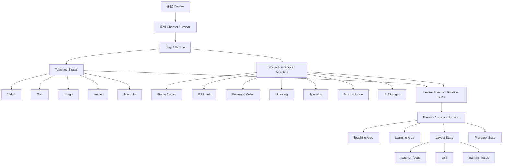
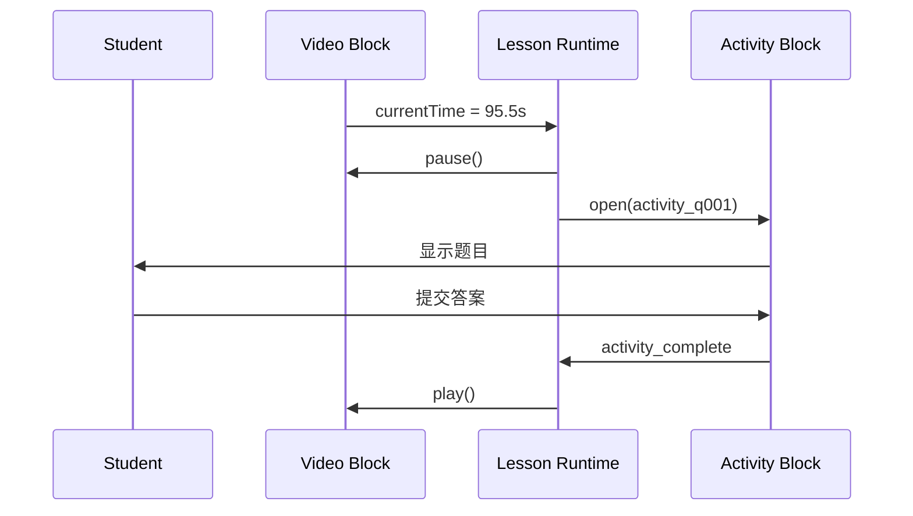
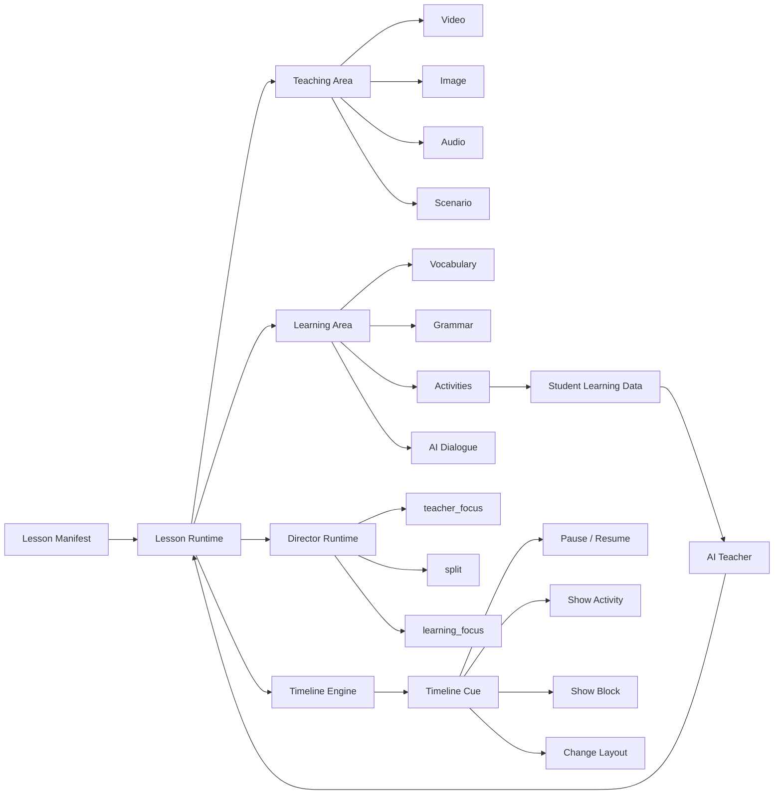

# UPLY 智能电子书 × 互动视频融合架构 V2

> 版本：V2  
> 日期：2026-09-16  
> 目标：把 UPLY 现有“智能电子书 / 教学 Runtime”与“互动视频”融合为一套统一架构，而不是另外开发一套独立互动视频系统。

---

## 1. 核心结论

UPLY 的互动视频**不应该单独做成一套系统**。

正确方向是：

> **一套 Lesson Runtime + 一套内容模型 + 一套练习系统 + 一套学习进度系统。**

互动视频只是智能电子书中的一种教学形态。

- 播放器只开发一套；
- 每一章保存自己的视频、时间点和互动配置；
- 已有的题目 / Activity 系统继续复用；
- 已有的 Teaching Area / Learning Area 继续复用；
- 已有的 Director Runtime 继续负责页面布局；
- 新增一层 **Timeline Cue / Lesson Event**；
- Timeline Cue 负责把“视频时间”连接到“电子书里的 Activity / Block”。

---

## 2. 不要采用的架构

```text
UPLY 智能电子书
        +
独立互动视频系统
        +
独立视频题库
        +
独立视频学习进度
```

这种做法会产生两套题库、两套题目编辑器、两套学习进度、两套 Runtime、两套统计逻辑和两套 AI 决策数据，维护成本会越来越高。

---

## 3. 推荐总体架构



---

## 4. 核心思想：视频只是一个 Teaching Block

在 UPLY 中，视频应该只是一个 `TeachingBlock`。

```json
{
  "id": "video_001",
  "type": "video",
  "src": "/courses/korean-1/lesson-01/video-01.mp4"
}
```

同一个 Step 里还可以同时存在：

```text
Teaching Blocks
├── video
├── text
├── image
├── audio
└── scenario

Interaction Blocks
├── single_choice
├── fill_blank
├── sentence_order
├── listening
├── speaking
└── ai_dialogue
```

因此一节课不是：

```text
视频 → 视频 → 视频
```

而是：

```text
教学内容
→ 互动
→ 教学内容
→ 练习
→ AI反馈
→ 教学内容
```

---

## 5. 现有智能电子书结构如何融合

继续使用：

```text
Course
  ↓
Chapter / Lesson
  ↓
Step / Module
  ↓
Block / Activity
```

互动视频只增加一层：

```text
Timeline Cue / Lesson Event
```

完整关系：

```text
Course
└── Lesson
    └── Step
        ├── Teaching Blocks
        │   ├── video_001
        │   ├── text_001
        │   └── image_001
        │
        ├── Activities
        │   ├── activity_q001
        │   ├── activity_q002
        │   └── activity_speaking_001
        │
        └── Timeline Cues
            ├── 35.2s → show activity_q001
            ├── 95.5s → show activity_q002
            └── 143.8s → show activity_speaking_001
```

---

## 6. 最重要的数据设计原则

### 6.1 不要把题目直接写进视频事件里

不推荐：

```json
{
  "time": 95.5,
  "question": "저는 학생___",
  "options": ["이에요", "예요", "합니다"]
}
```

这样会产生新的“视频题库”。

### 6.2 推荐做法

Timeline Event 只负责引用已经存在的 Activity：

```json
{
  "id": "cue_001",
  "sourceBlockId": "video_001",
  "triggerType": "time",
  "triggerTime": 95.5,
  "action": "show_activity",
  "targetBlockId": "activity_q001",
  "pauseSource": true
}
```

含义：

```text
video_001 播放到 95.5 秒
        ↓
暂停 video_001
        ↓
打开 activity_q001
```

这样 Activity 仍然属于 UPLY 原来的练习系统，视频只负责触发。

---

## 7. Runtime 工作流程



核心状态流：

```text
PLAYING
   ↓
触发 Timeline Cue
   ↓
PAUSED_FOR_INTERACTION
   ↓
SHOW_ACTIVITY
   ↓
WAIT_STUDENT
   ↓
ACTIVITY_COMPLETE
   ↓
RESUME_VIDEO
   ↓
PLAYING
```

---

## 8. 学生端推荐交互

UPLY 已经有：

```text
Teaching Area
+
Learning Area
```

因此普通互动题不需要每次都使用全屏 Modal。

### 8.1 普通讲解状态

```text
┌────────────────────────┬──────────────────┐
│                        │                  │
│      金老师教学视频      │   当前知识内容    │
│                        │                  │
│                        │ 이름             │
│                        │ 학생             │
│                        │ 친구             │
│                        │                  │
└────────────────────────┴──────────────────┘
```

状态：

```text
layout = split
```

### 8.2 到达互动时间点

视频到达：

```text
01:35.500
```

Runtime：

```text
pause(video_001)
show(activity_q001)
layout = learning_focus 或 split
```

### 8.3 右侧直接切换为题目

```text
┌────────────────────────┬──────────────────────┐
│                        │  한번 해 볼까요?       │
│      视频暂停           │                      │
│                        │  저는 학생___         │
│      金老师画面保留      │                      │
│                        │  ○ 이에요             │
│                        │  ○ 예요               │
│                        │  ○ 합니다             │
│                        │                      │
│                        │      [확인]           │
└────────────────────────┴──────────────────────┘
```

---

## 9. Layout State 可以直接复用

继续使用：

```text
teacher_focus
split
learning_focus
scenario_focus
```

例如：

```text
老师开始讲
↓
teacher_focus

老师讲词汇
↓
split

视频到题目点
↓
pause
↓
learning_focus

学生答完
↓
interaction_complete
↓
split
↓
video.play()
```

互动视频不是外挂，而是由 Director Runtime 统一编排。

---

## 10. 推荐的数据关系

根据 UPLY 现有命名，可以保持类似：

```text
digital_textbook_chapters
        ↓
modules / steps
        ↓
nodes / blocks
        ↓
activities
```

只新增：

```text
lesson_events
```

或：

```text
block_cues
```

二选一即可。

---

## 11. lesson_events / block_cues 建议字段

```text
id
lesson_id
step_id

source_block_id
trigger_type
trigger_time

action
target_block_id

pause_source
resume_policy

sort_order
config

created_at
updated_at
```

示例：

```json
{
  "id": "cue_001",
  "lesson_id": "lesson_01",
  "step_id": "step_03",
  "source_block_id": "video_001",
  "trigger_type": "time",
  "trigger_time": 95.5,
  "action": "show_activity",
  "target_block_id": "activity_q001",
  "pause_source": true,
  "resume_policy": "after_complete",
  "sort_order": 10
}
```

---

## 12. Timeline Cue 后面可以支持的不只是题目

```text
video → vocabulary
video → grammar_card
video → image
video → animation
video → speaking
video → pronunciation
video → listening
video → ai_dialogue
video → layout_change
video → scenario_change
video → teacher_tip
```

例如：

```json
{
  "sourceBlockId": "video_001",
  "triggerTime": 82.3,
  "action": "change_layout",
  "config": {
    "layout": "learning_focus"
  }
}
```

---

## 13. 一章课的完整示例

### Lesson 01 — 안녕하세요

```text
Lesson 01
│
├── Step 01 导入
│   ├── video_intro_01
│   └── vocabulary_intro
│
├── Step 02 人物与问候
│   ├── video_02
│   ├── vocabulary_name
│   ├── vocabulary_student
│   └── activity_q001
│
├── Step 03 语法
│   ├── video_03
│   ├── grammar_card_01
│   ├── activity_q002
│   └── activity_q003
│
└── Step 04 练习
    ├── activity_listening_01
    ├── activity_speaking_01
    └── activity_ai_dialogue_01
```

视频 03 的 Timeline：

```text
00:12 → show grammar_card_01
00:35 → hide grammar_card_01
00:48 → show activity_q002 + pause
01:25 → show vocabulary_name
01:55 → show activity_q003 + pause
02:30 → learning_focus
```

---

## 14. 统一学习记录

互动视频触发出来的题目，仍然写入原来的学习记录。

不要新建：

```text
video_question_attempts
```

推荐继续使用统一：

```text
student_attempts
lesson_progress
activity_progress
```

例如：

```text
student_id
lesson_id
step_id
activity_id
attempt_no
answer
is_correct
score
started_at
completed_at
```

这样未来 AI 教师可以一次读取：

```text
学生看到了哪里
+
哪些题答错
+
哪些词不会
+
口语表现
+
做题速度
+
重复错误类型
```

---

## 15. Lesson Runtime 推荐职责

Lesson Runtime 应该负责：

```text
1. 当前 Lesson
2. 当前 Step
3. 当前教学 Block
4. 视频播放状态
5. 当前 Timeline Cue
6. 当前 Activity
7. 当前 Layout
8. Interaction 是否完成
9. 学习进度
10. Resume / Next 决策
```

Runtime 不应该负责：

```text
具体题目内容编辑
视频生成
AI数字人生成
数据库管理界面
```

---

## 16. 前端组件建议

```text
components/
└── lesson-runtime/
    ├── LessonRuntime.tsx
    ├── DirectorRuntime.ts
    │
    ├── teaching/
    │   ├── TeachingArea.tsx
    │   ├── VideoBlock.tsx
    │   ├── TextBlock.tsx
    │   ├── ImageBlock.tsx
    │   └── AudioBlock.tsx
    │
    ├── learning/
    │   ├── LearningArea.tsx
    │   ├── ActivityRenderer.tsx
    │   ├── VocabularyCard.tsx
    │   └── GrammarCard.tsx
    │
    ├── activities/
    │   ├── SingleChoice.tsx
    │   ├── FillBlank.tsx
    │   ├── SentenceOrder.tsx
    │   ├── SpeakingActivity.tsx
    │   └── ListeningActivity.tsx
    │
    └── timeline/
        ├── TimelineEngine.ts
        ├── CueResolver.ts
        └── types.ts
```

---

## 17. Timeline Engine 的职责

```text
Video currentTime
       ↓
TimelineEngine
       ↓
查找当前应该触发的 Cue
       ↓
CueResolver
       ↓
执行 action
```

伪代码：

```ts
function onVideoTimeUpdate(currentTime: number) {
  const cue = findNextCue(currentTime);

  if (!cue) return;

  executeCue(cue);
}
```

执行 Cue：

```ts
function executeCue(cue: LessonCue) {
  if (cue.pauseSource) {
    pauseBlock(cue.sourceBlockId);
  }

  switch (cue.action) {
    case "show_activity":
      openActivity(cue.targetBlockId);
      break;

    case "show_block":
      showLearningBlock(cue.targetBlockId);
      break;

    case "change_layout":
      setLayout(cue.config.layout);
      break;
  }
}
```

---

## 18. 必须解决的 Runtime 问题

### 18.1 防止同一 Cue 重复触发

必须维护：

```text
triggeredCueIds
```

例如：

```ts
Set<string>
```

### 18.2 拖动视频进度条

第一版建议：

- 同一学习 Session 内已经完成的互动不重复强制触发；
- 教师预览模式允许重置；
- 学生点击“重新练习”时才重新触发。

### 18.3 页面刷新

需要恢复：

```text
lesson progress
video current time
completed activity
current step
```

第一版可以先只恢复：

```text
lesson
step
video time
```

---

## 19. 教师端 Lesson Studio

等学生端 Runtime 稳定以后，再开发教师端时间轴。

推荐界面：

```text
00:00 ───────────────────────────────── 05:00

Video     █████████████████████████████

Words         ◆        ◆

Grammar            ◆

Question                 Q1       Q2

Speaking                               🎤

AI                                         AI
```

老师拖动播放头到：

```text
01:35.500
```

然后点击：

```text
+ 添加互动
```

选择：

```text
选择题
判断题
填空题
排序题
单词卡
语法卡
跟读
口语
AI 对话
布局切换
```

---

## 20. Lesson Studio 保存的不是“新题目系统”

教师选择“选择题”时，应该：

```text
创建 / 选择已有 Activity
        +
建立 Timeline Cue
```

例如：

```text
activity_q001
+
cue_001
```

而不是另外创建：

```text
video_question_001
```

---

## 21. 分阶段开发计划

### P0 — 架构确认

确认现有智能电子书：

```text
Lesson
Step
Block
Activity
Progress
Runtime
```

本阶段不做 AI、不做新数据库、不做新播放器系统。

### P1 — Video Block 接入 Runtime

完成：

- play
- pause
- currentTime
- ended
- seek

### P2 — Timeline Cue Mock

先不接数据库。

```ts
[
  {
    time: 30,
    action: "show_activity",
    target: "q1"
  }
]
```

验证：

```text
播放
↓
30 秒
↓
暂停
↓
打开 Activity
```

### P3 — Activity 完成后恢复视频

```text
video
↓
cue
↓
pause
↓
activity
↓
activity_complete
↓
resume
```

这是最重要的 MVP。

### P4 — 接入 Supabase Timeline 数据

新增：

```text
lesson_events / block_cues
```

学生进入 Lesson 时加载：

```text
Lesson
+
Blocks
+
Activities
+
Timeline Cues
```

### P5 — 接入学习进度

记录：

```text
video position
activity completion
cue completion
step progress
lesson progress
```

### P6 — Director Runtime 联动

Timeline 可以控制：

```text
teacher_focus
split
learning_focus
scenario_focus
```

### P7 — Lesson Studio

开发：

```text
视频时间轴
Cue 编辑
Activity 绑定
布局事件
预览
```

### P8 — 更多互动类型

增加：

```text
判断题
填空
排序
听力
跟读
口语
```

### P9 — AI Teacher

最后再接：

```text
AI feedback
AI explanation
AI dialogue
adaptive path
```

---

## 22. 第一阶段 Codex 任务建议

```text
任务：UPLY 智能电子书 Lesson Runtime 增加互动视频最小闭环。

重要原则：
不要新建独立互动视频系统。
不要新建第二套题库。
不要新建第二套学习进度系统。
尽量复用现有 Lesson / Step / Block / Activity / Runtime。

本阶段只实现：

1. 确认现有 Video Block 或新增最小 VideoBlock。
2. VideoBlock 暴露 currentTime / play / pause。
3. 新增 TimelineEngine。
4. 先使用本地 mock cues，不接 Supabase。
5. cue 到达指定时间后暂停 video。
6. cue 的 target 指向现有 Activity。
7. 在 Learning Area 显示 Activity。
8. Activity 完成后发出 activity_complete。
9. Lesson Runtime 收到完成事件后恢复视频。
10. 同一 cue 在一次 session 中不得重复触发。
11. 保持现有 Teaching Area / Learning Area 架构。
12. 不做 AI。
13. 不做完整教师后台。
14. 不做新的 question 数据模型。

验收流程：

视频播放
→ 到 30 秒
→ 自动暂停
→ Learning Area 显示现有单选题 Activity
→ 学生答题
→ Activity 完成
→ 视频继续播放
→ 同一 cue 不重复触发

完成后输出：

- 现有架构审计结果
- 修改文件列表
- 新增组件列表
- Runtime 状态流
- Timeline Cue 类型定义
- 手工测试步骤
- 尚未实现事项
```

---

## 23. 最终目标架构



---

## 24. 最终产品形态

UPLY 不应该被定义成：

> “电子书里放了一些视频和题。”

而应该是：

> **一个由 Lesson Runtime 驱动的 AI Native 数字教学系统。**

视频只是 Teaching Block。

题目只是 Activity。

Timeline Cue 负责连接两者。

Director Runtime 负责决定页面怎么呈现。

学习数据负责告诉 AI 学生学得怎么样。

最终：

```text
Lesson Manifest
      ↓
Lesson Runtime
      ↓
教学内容 + 互动 + 布局 + 学习状态
      ↓
学生行为数据
      ↓
AI Teacher
      ↓
下一步教学决策
```

---

## 25. 当前最重要的开发原则

现在不要同时开发：

```text
AI口语
AI数字人
复杂Timeline编辑器
自适应学习
完整题库后台
完整教师后台
```

先只打通：

```text
VideoBlock
↓
Timeline Cue
↓
Activity
↓
Complete
↓
Resume Video
```

只要这个闭环稳定，后面的功能都可以在上面逐层扩展。

---

## 最终一句话

> **UPLY 只需要一套智能电子书 Runtime。互动视频不是另一个系统，而是让现有 Lesson Runtime 获得“按时间驱动教学互动”的能力。**
