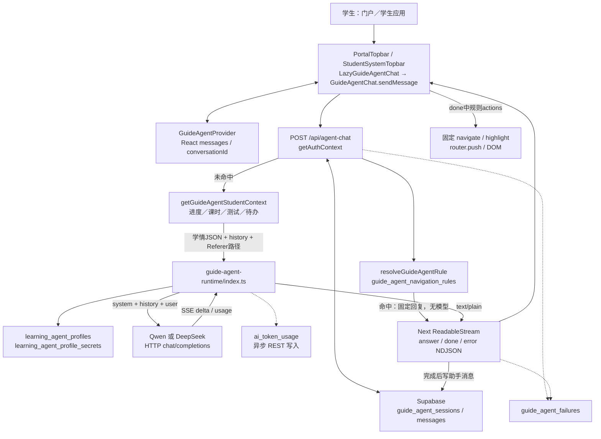
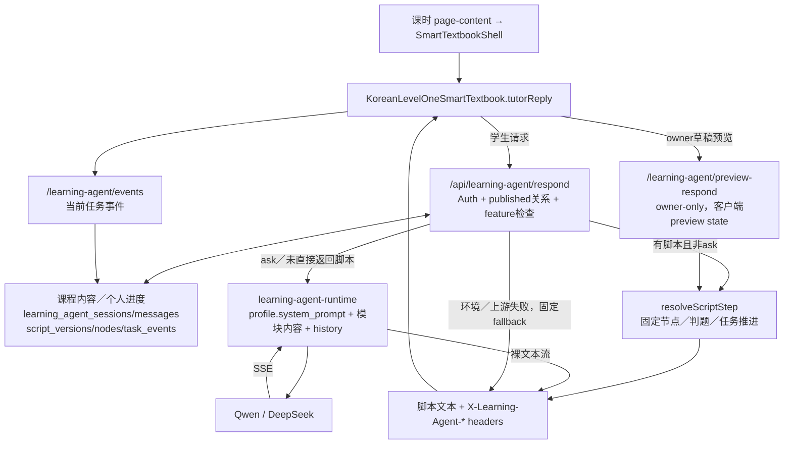

# UPLY Assistant Current State Audit

## 1. Executive Summary

审计日期：2026-09-13（Asia/Seoul）。源码基线：`b1672390ae96357a2143358235cc10edeff8d488` 加当前工作区已有修改。本报告调查当前可追踪源码，不代表已验证线上部署、数据库现值或实际调用成功。

**当前 UPLY 没有一个统一的通用 Agent Runtime。** 按产品及状态边界，有 **3 套主要系统**：

1. **站内导览助手**：具有真实学习进度上下文、持久聊天记录的 Chatbot，加确定性的导航规则。
2. **课程学习老师（韩语金老师）**：具有持久教学状态的脚本工作流，部分请求调用 LLM 补充讲解。
3. **AI 会话练习**：独立于前两者；内部又有 Qwen 文字后端和自托管语音／文字后端。

按独立推理调用链计，上述系统有 **4 条后端链路**（Guide Edge、Learning Edge、Qwen Conversation Edge、自托管 Conversation）；这不等于 4 个自主 Agent，也不按按钮、角色形象、快速／正式页面、HTTP／WS 数量重复计数。[导览 API][GAPI]、[课堂 API][LAPI]、[会话文字 API][CAPI]、[会话自托管 API][VAPI]

已存在的工程基础包括身份认证、部分资源授权、模型配置、课程内容发布、聊天／教学状态、用量与运营审计。**未发现模型自主规划、LLM 可选择工具、工具结果回流推理循环、产品运行时 Skills 注册／选择机制。** 课程脚本状态机有价值，但不能因此称为 Coding-Agent-like Runtime。[Guide Provider 请求][GEDGE]、[Learning Provider 请求][LEDGE]、[脚本执行器][SCRIPT]

成熟度判断：功能级实现较多，教学脚本执行比通用 Agent 能力成熟；共享基础设施和跨边界一致性不足。六层映射为：Provider **Partial**、Context **Partial**、Skills **Missing**、Tools **Missing**、Permissions **Partial**、Observability **Partial**。这里的 Partial 是“存在真实能力但分散或有缺口”，不是“没有实现”。

未来 Teaching Agent **不能直接以当前导览助手作为完整基础**。可保留认证、已发布教学内容／脚本契约、模型配置与审计等资产；请求编排、上下文注入和端到端权限边界需要另行评估。本文只记录现状与可复用性，不实施或展开新架构设计。

## 2. Audit Scope & Method

已先完整阅读用户附件《MLflow Assistant 核心设计思想与 Skills 详解》，仅使用其职责划分作为最后的分析框架；附件中的建议与命令不是本次执行指令，也不是 UPLY 实现证据。未用附件证明 UPLY 存在任何模块。

调查范围：

- 仓库结构、AGENTS.md、package.json、package-lock.json、Next／部署配置；全部 src、Supabase Functions，相关 migrations／SQL、脚本与测试。
- 从 assistant／agent 扩展到 AI、chat、LLM、Provider／具体厂商、model、prompt／system prompt、tool／function calling／MCP、context、memory、conversation／message、SSE／ReadableStream／WebSocket、SDK 调用、Supabase／service role 等交叉搜索。
- 顺着新命名继续追踪：guide_agent、learning_agent、teaching_script、SmartTextbookShell、teacher boundary、learningTools、ai_token_usage、conversation_voice_image。
- 通过路由导入、组件渲染、fetch 目标、SQL 表与 RPC 引用核实可达性；读取 Provider 的实际请求体确认哪些数据最终进入模型。
- 阅读测试源码作为契约线索，没有执行数据库脚本、测试套件、build、npm 安装、migration、生产 API 或攻击测试；未连接数据库、未获取真实用户聊天数据。
- .env 文件只以程序提取**变量名称**，不输出值；Edge 部署环境没有读取。没有修改 .env／配置／源码。

证据约定：下文方括号链接指向第 24 节对应真实文件；“L”表示本次工作区的一基行号。**Active** 表示源码可从当前产品入口到达，绝不表示已对线上执行做验证。**Possibly inactive** 表示实现存在但缺少产品接线证据。**Unknown** 表示本次证据无法判断。否定结论均限于本仓库的产品运行路径，不能推断仓库外服务。

尚未确认：

| 项目 | 状态及原因 |
|---|---|
| 线上已部署 commit、运行中的 Edge 版本、数据库实际 schema／RLS | Unknown；未连接线上 |
| 当前 learning_agent_profile_secrets 中 provider/model/system_prompt 值 | Unknown；只读取定义、查询及迁移，未读取数据库行 |
| Edge Gateway 对 guide／learning 的实际 JWT 配置 | Unknown；仓库只显式写 qwen-conversation-chat 的 verify_jwt=true |
| 自托管服务实际 LLM／ASR／TTS、鉴权、WS 配额、存储 | Unknown；本仓库只有客户端／代理协议 |
| 实际 published profile 数、调用量、失败率、用户受影响数量 | Unknown；源码与迁移种子不是实时 inventory |
| 被构建产物、外部运维脚本或动态配置接入的其他实现 | Not confirmed from current code；不把历史文档、测试命名当部署证据 |

**变更控制**：开始时已有 6 个 tracked 文件修改，以及其他未跟踪文件／目录。它们属于先前工作，不是本次修改。记录文件集合的内容摘要用于终检；本次唯一允许新增文件是本报告。未请求用户授权下一阶段。

## 3. Assistant Inventory

| 系统／边界 | UI / Backend | Prompt、Provider、Conversation | 判断 |
|---|---|---|---|
| G：UPLY 导航／智能学习助手 | PortalTopbar、StudentSystemTopbar → /api/agent-chat → guide-agent-runtime | profile code 固定 uply-guide-agent；配置表共享，profile 行独立；guide_agent_sessions/messages | 1 套 Context-aware Chatbot + 导航规则 |
| L：课程老师／韩语金老师 | SmartTextbookShell → /api/learning-agent/respond → 条件调用 learning-agent-runtime | 教材绑定 agent_profile_id；已知种子 code uply-korean-teacher；learning_agent_sessions/messages、script_* | 1 套脚本教学工作流 + 条件 LLM |
| C：会话练习文字分支 | ConversationAiExperience → qwen-chat → qwen-conversation-chat | TS 固定 prompt；QWEN_MODEL；浏览器 history；不读取 profile 配置表 | C 产品内独立推理后端 |
| C：会话练习语音／图片分支 | 同组件 → chat／ws-ticket → 外部 HTTP／WebSocket | 外部 Prompt／模型 Unknown；本地 history；HTTP 无真实后端 conversation ID 契约 | C 产品内另一独立推理后端 |
| Script Studio／Agent 运营／模型设置 | 管理页面、Server Actions、RPC | 人工编辑、审计、模型切换 | 控制面，**不是额外 Assistant** |
| Runtime v1 Teacher audit 与 production adapter | owner audit route；未接入学生产品路由的 production port | 脚本／媒体／会话边界；不提供新 LLM Provider | 审计／接线准备，不另算已上线 Agent |

依据：[G UI][GUI]、[L UI][LUI]、[C UI][CUI]、[Profile schema][PROFILESQL]、[Runtime audit][AUDITPAGE]、[production adapter][PRODTEACHER]。

“韩语金老师”和 uply-korean-teacher 是展示名与稳定 code 的关系；重命名迁移更新展示名／system_prompt，不创建另一个运行时。[重命名迁移][RENAMESQL]

共用关系：

| 能力 | G 与 L | 会话练习与 G/L |
|---|---|---|
| 用户认证／Supabase／部分会员判定 | 共用应用基础函数；G 未调用会员判定 | 共用身份／会员辅助函数 |
| Provider 封装 | 两个 Edge 中重复实现 providerConfig，不是同一个 adapter | Qwen 另写固定 fetch，自托管另有代理 |
| Prompt | 同表不同 profile 行，拼接器独立 | 不共享 |
| 会话／messages／上下文 | 不共享会话表；上下文分别查 | 不共享；客户端传 history |
| 用量 | ai_token_usage | 同表，但字段完整性／计数口径不同 |
| Runtime | 独立入口；L 含脚本执行器 | 独立协议 |

因此，“3 套产品系统／4 条推理后端”比“一个万能 Assistant”或“所有叫 Agent 的文件各算一个”更符合源码。

## 4. Entry Points

| 入口 | 组件／职责 | 上游／下游与角色 |
|---|---|---|
| /[space] 学生门户 | PortalAskBar 发 guide-agent-ask 事件；PortalTopbar 挂 LazyGuideAgentChat | 门户页 → 事件／面板 → G API；学生入口 |
| /[space]/apps/{appSlug}/… | StudentAppRouteLayout → DashboardRouteLayout → StudentDashboardLayout → StudentTopbar → StudentSystemTopbar | 学生应用 layout 中挂 G；韩语／其他应用复用 UI，不产生新 Agent |
| /[space]/dashboard/… | SpaceDashboardLayout | student 被重定向到 apps 路径；管理用户使用 ManagementDashboardLayout |
| 课程课时页（含 /apps/korean/courses/… 包装路由） | page-content → SmartTextbookShell → KoreanLevelOneSmartTextbook 内 tutorReply | 教材绑定且已发布时显示课程老师；→ L API |
| /…/conversation-practice/ai-experience/quick | QuickAiExperiencePage → ConversationAiExperience | 文字／语音／图片 UI；→ C 两个后端 |
| /…/conversation-practice/ai-experience/practice | FormalAiPracticePage → FormalConversationPractice → 同聊天组件 | 设置、倒计时、会话、规则摘要；不另建 Agent |
| /[space]/dashboard/admin/agents | AgentOperationsPage、NavigationRulesManager、AgentBehaviorSettings | 平台负责人运营 G，非管理者聊天 Assistant |
| /[space]/dashboard/admin/apps/[appSlug]/teaching-scripts | TeachingScriptStudioPage、TeachingScriptStudio | 平台负责人编排／发布课程老师内容 |
| 同路径 /preview | TeachingScriptPreviewPage → SmartTextbookShell | 平台负责人走查草稿；→ preview-respond，无 LLM |
| 同路径 /runtime-v1-preview | RuntimeAuditPage → AuditRuntimeClient | owner-only 对照入口；→ smart-textbook-runtime-audit/* |
| 模型用量页面／设置组件 | getModelUsageData、LearningAgentModelSettings | 用量查看与 PATCH 模型配置；不是聊天入口 |

对应源码：[Portal][PORTAL]、[应用 layout][APPLAYOUT]、[Dashboard layout][DASHLAYOUT]、[Student layout][STULAYOUT]、[课时页][LESSONPAGE]、[Studio route][STUDIOROUTE]、[预览][PREVIEWPAGE]、[会话页面][CPAGE]、[运营页][OPSPAGE]。

## 5. Frontend Architecture

**G UI**：GuideAgentProvider 是 React UI 状态容器，保存 isOpen、messages、conversationId，初始为欢迎消息／空 ID；它的“Provider”不是 LLM Provider。LazyGuideAgentChat 每次挂载包装自己的 Provider，按外观动态加载同一个 GuideAgentChat。PortalAskBar 通过 window CustomEvent 提交问题。[状态容器][GSTATE] L29–67、[Lazy UI][GLAZY] L155–174、[门户提问框][ASKBAR]

GuideAgentChat 自身维护 input、loading、receivingResponse、面板／高亮交互状态；sendMessage 直接 fetch，没有独立 useChat／store 请求层。读取 application/x-ndjson 行，更新同一 assistant 消息，done 时写 conversationId 并执行导航／高亮。面板支持桌面浮层／布局适配；学生顶部入口和门户入口是同一 UI 的不同挂载位置。[G UI][GUI] L133、L309–495、L651

关闭面板不等于销毁状态；在相同 layout 实例内客户端换页可以保留。跨门户／应用重新挂载或刷新会丢 UI history／ID，没有自动回填 G 数据库历史。不能据此声称“全站永久会话”。

**L UI**：SmartTextbookShell 目前只是 re-export 大型 KoreanLevelOneSmartTextbook。后者同时处理课程导航、活动、老师文本、脚本回合、视频／音频、黑板、角色、会话 IDs、暂停、loading、streaming。tutorReply 将 explain→start、roleplay→example，然后提交资源 IDs、意图、语言、消息／答案。请求带 AbortController；解析大量 X-Learning-Agent-* 响应头并读纯文本 stream。自由追问位于可展开／移动端 tutor panel。[Shell][SHELL]、[L UI][LUI] L4320、L4916–5045、L6032、L6130、L7379、L7466

**C UI**：ConversationAiExperience 以 useState／useRef 管理消息、模式、麦克风、音频缓冲、WebSocket、pending 与客户端 UUID。文字流使用 fetch reader；语音／图片文字走 JSON；真正录音走 WS。FormalConversationPractice 是人工设置与计时包装；summary 的建议由轮次数条件判断生成，不是 AI evaluation。[C UI][CUI] L269、L457、L619、L758、[Formal UI][FORMAL] L150–192

| 角色 | 是否共用同一聊天 UI |
|---|---|
| Student | 学生门户／应用中共享 G；课程 L、会话 C 是不同 UI |
| Teacher | 管理 layout 未挂 G；无独立 Teacher Assistant UI；部分后端会员辅助函数允许 teacher |
| Organization Admin | 管理 layout，非学生聊天统一入口；无 org-agent 对话实现证据 |
| Platform Admin／Owner | 运营／脚本／模型控制面；owner 可预览学生 L UI，但不创建实际学习记录 |
| Platform Course Inspector | 可使用学生式只读外壳；是否显示按钮与能否执行请求是两回事，L/C 明确拒绝，G 因无 tenant 拒绝 |

[路由角色分流][DASHLAYOUT]、[Auth 平台身份][AUTH]、[会员 helper][PERM]。UI 共用不能推导四类角色具有相同 AI 能力。

## 6. Backend Architecture

| 链路 | 请求与返回 | 传输、异常、取消 |
|---|---|---|
| G Next API | message≤2000、student_id、conversation_id；返回 answer/done/error 帧与 actions、ID | NDJSON；本地规则可绕过模型；记录部分失败。外层 fetch 不转发 request.signal、无显式 timeout |
| G Edge | agentCode、message、currentPath、studentContext、history | 普通 fetch 请求 Provider SSE；手工提取 delta.content → text/plain ReadableStream；Provider 请求 45s timeout |
| L Next API | Zod 校验 textbookId/moduleId/agentCode/sessionId、restart、intent、locale/supportMode、message≤500、answer≤300 | 查询课程／脚本／进度；确定性推进及判题；text/plain + 多个响应头；外层无 timeout／取消传播 |
| L Edge | 已验证路径传入的章节／模块／目标／脚本／教材／完成度／history | 普通 fetch Provider SSE → text/plain；45s timeout；无 tool 协议 |
| C Qwen Next/Edge | message≤1000、history≤12、replyLanguageMode | Next 转发 Edge text/plain；Edge 45s timeout；Next 外层 fetch 无 catch，无显式 timeout |
| C self-host HTTP | message≤800、history≤12、replyLanguageMode；输入 sessionId 仅回显 | 45s timeout；读取完整 JSON/text，extractReply 兼容多个字段；返回 JSON，不 streaming |
| C WebSocket | GET ws-ticket 后浏览器直连 | audio/tts 输入；stt_result/text_reply/audio_start/chunk/end 输出；断线 2s 重连 |
| preview-respond | scriptVersionId、base64url sessionToken、意图／答案 | 无 LLM、无正式会话写入；同脚本执行器，纯文本逐字符输出 |
| events／preview-event | 学習事件／预览 token | 确定性事件确认，不是 Tool Runtime |
| speech／teacher-video／blackboard-media／characters／companions | 音频manifest、视频代理、黑板媒体、固定角色资源 | 媒体读取／签名链接，无模型推理；访问策略因endpoint而异 |

证据：[G API][GAPI]、[G Edge][GEDGE]、[L API][LAPI]、[L Edge][LEDGE]、[C API][CAPI]、[C Edge][CEDGE]、[HTTP 代理][VAPI]、[WS ticket][WSAPI]、[预览 API][PREVIEWAPI]、[事件 API][EVENTAPI]。

**Streaming 的实际含义**：Provider→Edge 是 SSE；Edge→Next 是裸文本；G Next→浏览器再编码为 NDJSON；L/C text 为裸文本。没有 EventSource、Vercel AI SDK stream、统一消息事件 SDK。函数名 streamText 属于仓库自定义函数。脚本分支虽返回 ReadableStream，但一次性同步 enqueue 字符，不能当作模型生成证据。

**Retry/Fallback**：三个 Edge 没有模型重试或自动切换厂商；45s 超时不覆盖此前全部 DB／profile 加载过程。G 规则表读取失败会转模型，模型失败报错；L 缺环境或上游非成功会退回固定 step/script；上游流开始后的失败没有自动重试／替换模型；C HTTP 无模型 fallback。WS 重连只恢复连接，不能证明服务端推理重试／历史恢复。

**控制面**：Server Actions 调 SQL RPC 编辑导航规则、配置、教学脚本；模型 PATCH 调 set_learning_agent_model。调用方是用户操作与服务端代码，不是模型。[运营 actions][OPSACTIONS]、[脚本 actions][STUDIOACTIONS]、[模型 API][MODELAPI]

**媒体边界补充**：blackboard-media 校验 korean_course、资源key前缀并拒绝 document 导航；characters／companions 使用固定资源映射、active身份及 document 导航检查。这些是内容访问端点，不是模型可选工具；它们没有把视频帧、播放时间或角色素材发给 LLM。[黑板媒体][BLACKBOARDAPI]、[人物资源][CHARACTERAPI]、[陪伴角色][COMPANIONAPI]

仓库中 Deno Edge 是已确认的 LLM 服务代码；未发现产品链路启动 Python／Node Agent 子进程。completion worker 是课程结业刷新任务，不能因名称 worker 就算 AI worker。Python speech 脚本用于离线音频制作，见第 16 节。

## 7. Provider & Model Layer

| 功能 | Provider／SDK | 模型及配置来源 | switch／fallback |
|---|---|---|---|
| 导览 | DashScope Qwen 或 DeepSeek；原生 Deno fetch，无厂商 SDK | DB learning_agent_profile_secrets.provider/model；迁移种子 qwen / qwen3.7-plus | owner 可按 agentCode 切换；无自动 Provider fallback |
| 课程老师模型分支 | 同上，但 providerConfig 为另一份实现 | 同表课程绑定 profile；种子 qwen3.7-plus | 同模型设置机制；失败 fallback 为脚本文本 |
| 会话文字 | DashScope，原生 fetch | Deno.env QWEN_MODEL，缺省 qwen3.7-plus | 不读取模型设置表；无用户／角色 switch |
| 会话语音／图片文字 | 自托管 HTTP／WS；原生 fetch/WebSocket | 真实模型 Unknown；conversation_voice_image 只是本地 usage 标签 | endpoint 由 env 配置；无统一 adapter |
| 教师预录音 | Python edge_tts；浏览器 speechSynthesis 为部分播放 fallback | 脚本中指定语言 voice；不是 LLM | 不属于 Assistant 推理模型 |

[Provider 代码][GEDGE] L40、[课堂 Provider][LEDGE] L48、[会话 Provider][CEDGE] L154、[模型允许列表][MODELOPT]、[模型 API][MODELAPI]。

模型设置允许列表：Qwen `qwen3.7-plus`、`qwen-plus`、`qwen-max`；DeepSeek `deepseek-v4-flash`、`deepseek-v4-pro`。**这是仓库允许的字符串，不是供应商可用性验证，也不是当前线上选中模型。** 数据库 RPC 接受的模型格式比 UI 白名单宽；公开 PATCH 额外验证白名单。[模型列表][MODELOPT]、[模型切换 SQL][MODELSQL]

被真实源码读取的环境变量名称：

| 边界 | 名称（不含值） |
|---|---|
| Next→Supabase | NEXT_PUBLIC_SUPABASE_URL、NEXT_PUBLIC_SUPABASE_PUBLISHABLE_KEY |
| 服务端管理 DB | SUPABASE_SERVICE_ROLE_KEY |
| Edge DB 配置／用量 | SUPABASE_URL、SUPABASE_SERVICE_ROLE_KEY |
| Qwen／DeepSeek | DASHSCOPE_API_KEY、QWEN_AGENT_URL、DEEPSEEK_API_KEY、DEEPSEEK_BASE_URL；会话文字另有 QWEN_MODEL |
| 自托管会话 | CONVERSATION_AI_BASE_URL、CONVERSATION_AI_SERVER_URL、CONVERSATION_AI_CHAT_PATH、CONVERSATION_AI_WS_URL、CONVERSATION_AI_SERVICE_TOKEN、CONVERSATION_AI_DAILY_MESSAGE_LIMIT |
| Supabase Studio | OPENAI_API_KEY；仅 config.toml 的 Studio env 引用，不是 UPLY Assistant Provider |

端点缺省值在源码中：Qwen compatible-mode chat/completions、DeepSeek /chat/completions；自托管 HTTP 有内网地址缺省。报告不复述内网地址。qwen-conversation-chat 不使用 QWEN_AGENT_URL，而用固定 DashScope URL。

未找到 UPLY 产品运行时的 OpenAI SDK、Anthropic、Gemini、OpenRouter、Azure、LangChain／LangGraph 调用；不能从“OpenAI-compatible HTTP”推断实际由 OpenAI 推理。package.json 无 AI SDK；lockfile 中 MCP 是 shadcn 的传递依赖，OpenTelemetry 是 Next 相关依赖声明，均不构成业务集成证据。[依赖][PACKAGE]、[锁文件][LOCK]

本地 .env 的变量名可见 DEEPSEEK_API_KEY，并不能证明 Edge 配好该 key 或正在使用 DeepSeek。当前部署 Provider／model 仍为 **Unknown**。

## 8. Prompt System

| Prompt 来源 | 状态 | 实际消费者／限制 |
|---|---|---|
| learning_agent_profile_secrets.system_prompt：guide profile | Active 路径；当前文本 Unknown | guide-agent-runtime.loadAgentProfile → 实际 messages[0] |
| 同表 korean teacher profile | Active 条件路径；当前文本 Unknown | learning-agent-runtime；脚本直出时不发送模型 |
| reply_policy.maxOutputCharacters / languageModes | Active | 拼接长度、语言限制；不是通用 Prompt Registry |
| qwen-conversation-chat.SYSTEM_PROMPT | Active | TS 韩语口语陪练身份／语言／长度规则 |
| learning_agent_steps.content | Active | 旧步骤讲稿／L fallback／ask 时 hint step 作为 script |
| learning_agent_script_nodes.teacher_script、configuration | Active | 主要由确定性执行器直接展示；不是全部作为 prompt 发给 LLM |
| 导览 profile 种子、Teacher Kim 重命名迁移 | 初始化／历史证据 | 说明初始文本；不是“数据库当前 prompt” |
| skill Markdown／开发 Agent 指令 | 非产品 Prompt | 未发现产品代码读取 .agents/.ai/.codex 作为运行时 instructions |
| Global／独立 Role／Tenant／Course／Lesson Prompt 层级 | Missing 或 Partial | 只有 profile + feature 字符串拼接；无通用层级解析器 |

真正的 LLM messages 拼接：

**G（规则未命中）**：[G Edge][GEDGE] L208–234

1. system = DB profile.system_prompt + 输出字数约束 + 禁止特定格式 + “跳转由模型外安全执行”。
2. history = DB 最近 10 条消息，经 Edge 每条截到 1000 字符。
3. user = 当前页面字符串 + JSON 学习情况（≤8000 字符）+ 学生本次问题。
4. temperature=0.25，stream=true，include_usage=true。未发送 tools、response_format、developer message。

**L（确实进入模型的分支）**：[L API][LAPI] L559–610、[L Edge][LEDGE] L215–249

1. system = DB profile.system_prompt + supportMode 对应 languageModes + 输出字数限制 + 仅用已发布内容／不可改学习状态。
2. history = Next 最近 8 条（含当前新插入 student 消息）反转后去掉末项，通常最多 7 条旧消息；Edge 上限 8 条／条 500 字符。
3. user = 章节标题 + 模块标题／目标 + 完成度 + intent + script（≤1200）+ module nodes 的已发布内容 JSON（≤6000）+ studentMessage。
4. temperature=0.35。**ask 路径跳过 resolveScriptStep，因此这里的 script 通常是 learning_agent_steps 的 hint 内容，不是当前可视脚本 node／segment 的完整讲稿。**

**C 文字**：[C Edge][CEDGE] L12–27、L140–165

1. system = TS SYSTEM_PROMPT + 本次 replyLanguageMode。
2. 客户端 history 规范化并去掉和当前 message 重复的最后一项。
3. user = 原始当前文字／拼接的用户输入。
4. temperature=0.7；普通输出截到 150 字符；明确长文本／字数请求最高 1000。

**C 自托管／WS**：Next 只发 message/history/replyLanguageMode；外部服务如何转 Prompt 为 Unknown。不要把前端“正式练习情境／难度”当成 Prompt。

没有跨功能 Prompt version ID／最终 Prompt 快照；导览配置更新仅覆盖原文并记录操作摘要／长度，不保存原 prompt 版本。[行为更新 SQL][OPSHARD] L506–548。脚本版本、导航规则版本是各自业务版本，不能代替 LLM Prompt 版本。

## 9. Context System

**Context Layer: Partial。** 有两套真实的服务端上下文读取／注入，没有统一 Context Resolver。表中 G=导览，L=课堂模型分支，C=会话练习；“持久化”区分源数据持久与该次注入快照持久。

| Context | Source | Injection Point | Sent to LLM? | Persisted? | Status／可信性 |
|---|---|---|---|---|---|
| user id | getAuthContext→getUser | G/L API 查个人记录、usage 归因 | 不作为独立模型字段发送 | session／usage | Existing（授权）；模型认知为 Missing |
| user profile／姓名 | profiles、UI props | 身份／界面 | G/L/C 未显式注入姓名／个人档案 | 源数据有，调用快照无 | Missing（模型侧） |
| role | 后端 profile／membership | API permission checks | 未传角色 prompt；G 一律称学生 | 账户表；会话未复制 role | Partial；后端可信 |
| tenant／organization | 后端 active membership | G/L 查询过滤；C HTTP 配额 | 不发送 tenant ID／机构资料 | G/L sessions、usage | Existing（隔离上下文）；模型侧 Missing |
| school／任课 teacher | 其他业务数据 | 无注入路径 | 否 | 与 Assistant 注入无关 | Missing |
| current route | G API Referer pathname+query+hash，≤500 | G Edge userPrompt | 是（仅模型分支） | 无请求路径快照 | Partial；客户端可影响，不是授权事实 |
| course／lesson | G lesson_progress 后查课程／课时 title | G studentContext.recentLessons | 是：最多 8 条名称、进度、完成时间；不是完整课程 | 源 DB 有；本次 snapshot 无 | Partial；来源个人进度 |
| courseId／lessonId | G/L 数据关联 | 查询条件、session.lesson_id | 不单独发送 IDs；L lesson_id 是 agent lesson，不等于课程课时 ID | DB 关联有 | Partial |
| textbookId／moduleId／chapter | L 客户端 IDs→后端 published 关联查询 | L API→chapterTitle/moduleTitle/moduleGoal | 标题／目标进入，IDs 不作为模型参数 | session lesson + 内容表 | Partial；关系校验存在，应用授权缺口见 §14 |
| current module 教材 | digital_textbook_nodes.title/content | L publishedContext JSON | 是≤6000；整模块截取，不是选择性检索 | 源 DB 有；快照无 | Existing 注入，Partial 完整性 |
| 当前教学脚本 node／segment | learning_agent_sessions + script_nodes | resolveScriptStep／响应 headers | 正常脚本分支不调 LLM；ask 未注入当前 segment | sessions/teaching_state 持久 | Partial；UI 知道不等于 LLM 知道 |
| 步骤讲稿／hint | learning_agent_steps.content | L fallback→Edge script | 是，条件路径≤1200 | 源 DB有 | Existing（局部） |
| 教材总体完成度 | L 按 tenant/student/version/node 查进度并平均 | L completionPercent | 是 | 源 DB；无模型输入快照 | Existing |
| 学习总览 | G node_progress 最新≤100 | G smartTextbook 聚合 | 是：节点数、平均完成度、最后活动时间 | 源 DB | Partial；有行数范围，非全量学情 |
| 测试表现 | G chapter_test_attempts≤200 | G assessment 聚合 | 是：正确数、题数、正确率 | 源 DB | Partial；没有错题题干／解释 |
| 作业 | G 本 tenant 已发布≤50，再按 target/submission 过滤 | G pendingAssignments≤10 | 是：title/dueAt/status | 源 DB | Partial；先截断后过滤可能漏掉个人任务 |
| 练习题／选项／答案 | L script interaction／activity secrets | 确定性判题／反馈 | 不直接注入秘密答案；已产生反馈可能随 history 入模 | node_attempts、messages | Partial；并非模型评估 |
| current exercise／selected content | L UI 活动状态／目标 key | UI 或事件 API | 不作为当前活动专属 prompt 注入；node content 中可能含相关教学文字 | 某些业务状态有 | Partial |
| video／timestamp／播放事实 | 视频组件、事件 API | 教学状态推进／媒体 | 不直接发送给 LLM | task_events 部分有 | Missing（模型感知） |
| locale／language preference | L UI 偏好与请求；C replyLanguageMode | Edge system 文案 | L/C HTTP 是；G 无 locale 参数；WS 录音包未带语言 mode | L session；C formal config 在 sessionStorage | Partial；用户可选 |
| Korean level | L profile 固定初级教学规则；C 正式难度选择 | L system；C 仅 UI | L 有“适合初级”的固定规则；无个人测级注入；C difficulty 未发送 | 配置／客户端 | Partial／Missing |
| formal scenario、difficulty、duration | FormalConversationPractice 本地配置 | 页面、计时、摘要 | 否；HTTP body／WS audio 包未携带 | sessionStorage | Missing（模型侧） |
| conversation history | G/L 服务端 DB；C 浏览器 messages | 三个 Edge messages[]；C HTTP body | 是（限长度）；C WS 无 history 包 | G/L DB；C quick 内存／formal sessionStorage | Existing history，非长期 memory |
| uploaded image/file | C 本地 TextDetector 或 filename fallback | 拼入 message→自托管 HTTP | 文本发给外部服务；外部 LLM 是否使用 Unknown；无图片二进制模型请求 | C 本地消息；无通用文件库 | Partial |
| 录音 | C MediaRecorder | WS audio/base64/mimeType | 外部 ASR/LLM 链 Unknown | 本仓库无聊天录音持久证据 | Unknown |
| knowledge base／embeddings | 未发现运行路径 | 无 | 否 | 无 Assistant KB 表证据 | Missing |
| user long-term memory／retrieval memory | 未发现 | 无 | 否 | 无 | Missing |

主要证据：[G Context][GCONTEXT] L23–212、[G Edge][GEDGE] L212–229、[L API][LAPI] L167–210、L595–610、[L Edge][LEDGE] L226–243、[C UI][CUI] L584–638、L758、[Formal UI][FORMAL]。

信任范围：经 Next 正常路径，G 的学情来自当前用户／tenant，L 的素材来自关联查询，客户端不能直接提交 system_prompt；但 Edge 本身接受调用者传入 studentContext／script／publishedContext／history，未重新读取这些业务事实。**“真实／已发布”这些提示词不等于 Edge 已核验真实性。** 没有 Context provenance、结构化信任等级或 Prompt 注入隔离机制证据。截断按字符而非 token，JSON 也可能被截成不完整文本。

## 10. Conversation & Memory

| 维度 | G 导览 | L 课程老师 | C 会话练习 |
|---|---|---|---|
| ID | DB guide_agent_sessions UUID | DB learning_agent_sessions UUID | 浏览器 UUID；HTTP 仅回显、Qwen API 忽略 |
| history 存储 | guide_agent_messages | learning_agent_messages | quick 内存；formal sessionStorage |
| 刷新恢复 | DB记录仍在，但 UI 无自动找回 ID／回放入口 | loadSmartDigitalTextbook 读取 active sessions，按 module 恢复教学状态 | formal 可在同标签页恢复设置／消息；quick 丢失 |
| 跨页面／课程 | 同 Provider 实例可保留；重挂载丢失；无 course scope | 按 lesson/profile 分隔；UI 每 module 缓存 session ID | 同组件局部；无统一站内 conversation |
| 跨登录 | DB归属仍在；无自动用户恢复产品链 | 同用户／tenant 可重新读取 active state | 未发现按账号隔离／退出清理 formal sessionStorage |
| history 窗口 | 10 条，Edge每条1000字符 | API通常7条旧消息，Edge每条500字符 | 12条含当前输入后去重；每条1000/800 |
| summary／retrieval | 无 | 无；teaching_state 是执行状态 | formal summary 是时间／轮次，不是上下文压缩 |
| 任务状态 | 会话active/closed；无规划任务 | current_node、script_version、teaching_state、attempts、task_events | pending／计时；外部 WS 状态 Unknown |
| 长期 memory | Missing | Missing | Missing／外部Unknown |

[G state][GSTATE]、[G API][GAPI] L127–174、[L API][LAPI] L225–457、[教材 loader][TEXTBOOK] L474–529、[C UI][CUI] L144–178、L872–915、[Formal UI][FORMAL] L23–44。

G 无 conversation_id 或 ID 不匹配时创建新会话，不泄露“这个 ID 属于谁”；首次会话 ID 主要在成功 done 帧保存到 UI，第一次请求失败可能在 DB 留下 UI 无法继续使用的会话／用户消息。

L 更新脚本后优先使用当前 published script，并按 node_key 尝试迁移既有位置；这是课程执行续接，不是智能记忆。显式 sessionId 查询未附 status=active，而无 ID 的恢复查询才限制 active，应与 restart／completed 语义一起考虑。[L API][LAPI] L232–295

Formal sessionStorage 的 setup key 固定、聊天 key 基于客户端 sessionKey，没有 user／tenant namespace；同一标签页切换账号可能恢复上个账号 UI 文本。静态风险，不是已证实实际泄露事件。HTTP 恢复后的 history 会再次由浏览器提交；WS 只恢复 UI 不代表外部语音会话恢复。

## 11. Tools / Function Calling

**Current Assistant does not have a true Tool Layer.**

三个可见模型请求仅发送 model/messages/temperature/stream/stream_options；没有 tools schema、tool_choice、tool_calls／function_call 消费、tool role 回传、基于结果继续推理的 loop。外部自托管服务内部 Unknown，不能由本地代理推断其具备／不具备内部 tools。[G Edge][GEDGE] L224、[L Edge][LEDGE] L238、[C Edge][CEDGE] L153

下面是经调查的“疑似 Tool”，均不应登记为 LLM Tool：

| 能力／位置 | 输入→输出 | Authorization | Read/Write | Caller／LLM selectable? | Status |
|---|---|---|---|---|---|
| getGuideAgentStudentContext | 后端 user/tenant → 学情 JSON | 前置 Auth + 查询过滤 | Read | G API 固定调用；否 | Context Retrieval |
| resolveGuideAgentRule／matchGuideAgentRule | 用户文字＋规则 → 固定回复／target | owner 管规则；API读 enabled | Read | 关键词算法；否 | 导航规则 |
| executeAgentAction | action/path/target → router.push/DOM高亮 | 本地 target 校验／路径映射；目标页面另鉴权 | UI change | NDJSON done；模型分支 actions=[]；否 | UI action |
| resolveScriptStep | intent＋脚本＋状态／答案 → next state／feedback | L API 前置授权；DB secrets判题 | Read；调用方写结果 | L/preview API；否 | 确定性教学执行器 |
| learning-agent/events | session/event/target → task event | 当前 user/tenant/session/node校验 | Write | 学生客户端；否 | 业务 API |
| create/publish/saveTeachingScript… | FormData → RPC／DB | requirePlatformOwner、SQL guard | Write | 用户表单；否 | Authoring |
| Runtime learningTools／teacher boundary | opaque context＋operation → 学习／播放服务 | 独立 session/scope/authority checks | 随操作 | Runtime UI/transport；否 | UI domain services，不是 MCP |
| 模型切换 PATCH | agentCode/provider/model → 配置 | owner＋白名单 | Write | 设置 UI；否 | 控制面 |

[Rules][GRULE]、[Matcher][GMATCH]、[Guide action][GUI] L309、[Script][SCRIPT]、[Runtime tools][LEARNTOOLS]、[Runtime boundary][TEACHBOUND]。

package-lock 的 @modelcontextprotocol/sdk 来自 shadcn，未在 src 或 Edge 中导入。仓库开发工具／skills 文件存在，不能充当 UPLY 的 MCP Server／Skill Registry。

## 12. Skills

**Skills Layer: Missing（产品 Agent 运行时口径）。**

没有发现会被 Assistant 加载的专业 procedure 文件、Skill registry/router/selection、按意图选择方法→调用工具→核查证据→输出的执行链。

以下不属于本任务定义的 Skills：

- DB system_prompt 与 reply_policy：身份／回复规则。
- 导航 trigger_phrases：关键词匹配。
- teaching_script nodes：给学生呈现的课程编排，不是指导 LLM 如何调查／操作的作业方法。
- 学习数据 skill 字段：听说读写等能力维度。
- .agents/skills、.ai/team、.codex/agents：开发工作区工具；未被产品代码加载。
- CurriculumPlan 的按天生成安排、教师薄弱项排序：确定性业务逻辑。

[Profile][PROFILESQL]、[脚本执行器][SCRIPT]、[教师建议算法][INSIGHTMODEL] L163–216、[课程计划 actions][CURRICULUM] L642。不把已存在的课程 workflow 否认掉，也不将它改称 Agent Skills。

## 13. Database & Persistence

本节列的是**migration 定义与当前调用关系**；没有执行 SQL，表在远端是否存在、政策是否已部署均 Unknown。没有一份被应用使用的统一生成式 Database 类型文件作为事实源；关键代码大量使用局部 TS 类型／Record／select 字段。

| 表／表族 | 作用与关键字段 | 读取方 | 写入方／与 Assistant 的关系 |
|---|---|---|---|
| learning_agent_profiles | agent_code、subject、display_name、access_feature、capabilities、status | G/L API、Edge、loader、运营／用量 | 迁移／控制面；capabilities 是元数据，不是 Tool registry |
| learning_agent_profile_secrets | system_prompt、provider、model、reply_policy | 两个 Edge、owner控制面 | 行为／模型 RPC；不存 API key |
| guide_agent_sessions | tenant_id/student_id/profile/status | G API、owner运营RPC | G API；消息 trigger 更新 updated_at |
| guide_agent_messages | role/content/actions/provider/model、response_mode、first_token_ms、total_duration_ms | G history／owner运营 | G API；没有本次 context／prompt version |
| guide_agent_navigation_rules | triggers/target/action/response/priority/status | G matcher、运营 | owner RPC；启用规则先于模型 |
| guide_agent_navigation_rule_versions | per-rule version、snapshot、change_type／actor | owner版本列表 | owner规则RPC；可回滚规则，不是LLM prompt版本 |
| guide_agent_operation_logs | actor/action/target/summary/details | owner运营 | owner操作／会话审计RPC；追加审计 |
| guide_agent_failures | session/user_message/profile、stage/error/provider/model/duration | owner运营 | G API recordGuideAgentFailure；部分早期失败未覆盖 |
| learning_agent_lessons | module_id/profile/status/objectives/guardrails | L API／loader／Studio | 内容制作／迁移；objectives/guardrails 并非全部进入模型 |
| learning_agent_steps | lesson/step_key/content/action_type | L API | 迁移／内容；当前条件路径仍用，非全死代码 |
| learning_agent_sessions | tenant/student/lesson/profile、locale/support_mode/status、current_step、last_action、script_version/current_node/teaching_state | L API／loader | L respond/events；持久教学状态 |
| learning_agent_messages | session/profile/role/intent/content/action/provider/model；定义含 input/output_tokens | L history | L API；当前插入未填 message tokens，tokens另记usage |
| learning_agent_script_versions | lesson/version/status/title/change_note/creator/publisher/time | L、Studio、preview | 人工draft/publish RPC |
| learning_agent_script_nodes | teacher_script/configuration、node_type、next/remediation、reference_activity | L执行器、Studio、preview | 人工编排／atomic save；非AI生成 |
| learning_agent_node_interaction_secrets | correct index、correct/incorrect feedback | Script执行器／owner编辑 | owner atomic save；答案不直接发LLM |
| learning_agent_node_attempts | tenant/student/session/script/node/response/is_correct | RLS个人读取／管理相关路径 | L respond；教学互动记录，不是模型评分 |
| learning_agent_task_events | tenant/student/session/script/node/event/target/metadata | L恢复／推进 | events API upsert；不等于模型tool_calls |
| learning_agent_publish_logs | lesson/script/action/actor/details | Studio相关 | actions／SQL；内容发布审计 |
| learning_agent_model_change_logs | profile/changed_by、previous/next provider/model | owner模型／运营 | set_learning_agent_model RPC；后续追加不可改审计 |
| learning_agent_script_audio_assets | node/segment/locale/object_key/duration/cues/voice/status | speech API、loader、preview | 离线 provision脚本；媒体元数据 |
| learning_agent_character_style_templates、learning_agent_blackboard_layout_templates | 角色／布局参数 | Studio | owner手工；非Agent模型配置 |
| teaching_script_source_reviews | source_snapshot/script_token/revision/reviewer/time | source-review RPC／Studio | owner确认；用于教材与脚本一致性，不是LLM trace |
| ai_token_usage | tenant/user/provider/model/feature/agent/input/output/total/time | 用量页、C配额 | Edge REST／C HTTP；没有run/conversation FK、cost、latency |
| digital_textbook_*、lesson_progress、chapter_test_attempts、learning_assignments/targets/submissions、courses/lessons | 课程内容、个人进度、任务 | G/L上下文；脚本执行器 | 各自业务系统；不是统一知识库／memory |
| conversation_practice_scenarios/progress/admin_assignments | 常规会话课程内容与进度 | 常规课程／管理 | 常规业务动作；未发现AI quick/formal将messages写入这些表 |
| runtime_publish_private.snapshots/bindings/pointers/history/sessions | Runtime发布与绑定／私有会话契约 | 发布repository／Runtime准备路径 | 发布控制面；不是替代当前guide/learning聊天表 |

Schema 证据：[初始 teaching 表][TEACHSQL]、[重命名／profiles][PROFILESQL]、[Guide 表][GUIDESQL]、[Script 表][SCRIPTSQL]、[互动 secrets][INTERSQL]、[task events][EVENTSQL]、[音频][AUDIOSQL]、[运营][OPSSQL]、[运营加固][OPSHARD]、[usage 初始][USAGESQL]、[usage扩展][USAGEPROVIDER]、[source review][REVIEWSQL]、[发布表][PUBLISHSQL]。

补充结论：

- digital_textbook_teaching_lessons/steps/sessions/messages 被 202608260002 **rename** 为 learning_agent_*，不是当前并行的四张旧表系统。
- ai_token_usage.tenant_id 来自多租户 migration；Edge 插入未带 tenant_id，依赖 enforce_tenant_scope 按 user 默认成员关系推导。它与 HTTP 代理显式 tenant_id 的语义不同。[租户 schema][TENANTSQL]、[后续 trigger][TENANTTRIGGER]
- 未找到产品 AI 路径的 agent_runs、tool_calls、prompt_versions、向量 embeddings／检索 memory 表。Supabase vector 配置存在不等于 Assistant 实际使用。
- migration 中 grant/RLS 是声明证据，不证明远端权限现值；某些后续 SQL 取代旧定义，不能只看第一份 migration。

## 14. Authentication & Permissions

**Permissions: Partial。正常 Next 入口确有后端授权，但整个 AI 调用边界不统一。**

getAuthContext 用 Supabase getUser 验证身份，再读 profile/status 与 active tenant membership；业务 role/tier 用 membership 值。平台身份不伪装 tenant 用户，返回 tenant=null。当前租户由默认 active membership 解析，而非由 AI body 的 organizationId 指定。[Auth][AUTH] L109–230

| 边界 | 已实施检查 | 限制／静态风险 |
|---|---|---|
| G /api/agent-chat | 登录／active、user.id==student_id、tenant；conversation 同 tenant/user/profile/active | 不限制 role=student，也不调用 access_feature/会员判定；老师可用自己的身份调用并被当学生回答 |
| G Context | tenant/student 筛进度、作业与提交 | 无参数允许指定他人的真实学情；查 course/lesson 名称用已过滤进度行派生 IDs |
| L /respond | active/tenant、排除inspector、绑定教材/profile/module/chapter/version且published、access_feature会员 | 未复用 StudentAppRouteLayout 的 tenant_app/enrollment有效期；未检查章节解锁条件 |
| L session | tenant/student/lesson/profile | 显式ID未限制active；API更新依赖前序校验；没有统一资源授权service |
| L events | own active session、node/script、eventType/targetKey吻合 | 客户端陈述“已播放／已打开／已完成”；未核实真实播放或正式activity attempt证据 |
| L preview | owner角色；草稿可读；preview token不落学生表 | token只是base64url，不是签名授权；当前owner-only且不写正式进度，不应当作学生权限令牌 |
| C Next text | active、会员功能、拒绝inspector | 未重新检查app enrollment；平台staff helper允许通过，可能没有tenant用量归属 |
| C HTTP／ticket | 上述＋tenant、按用户/tenant统计24h usage | 查询错误时继续；无原子预留，记录失败仍成功；ticket不计WS消息 |
| 三个 Edge | POST／输入格式；G/L查published profile；Qwen config声明JWT | 函数内没有 getUser/auth服务验证、membership/tenant/resource/feature复核；getUserId仅base64解码sub |
| 模型设置 | active、platform owner、无tenant、Zod、白名单 | service-role RPC本身仅供服务端；不把它暴露给学生 |
| 导览运营／脚本管理 | requirePlatformOwner；规则／发布RPC另有SQL owner guard | 具备实际控制面边界，不只是前端隐藏 |
| speech/video | active；draft speech owner；video feature＋key格式 | published speech无app enrollment；video未查对象是否绑定published脚本 |

[G API][GAPI] L105–149、[L API][LAPI] L68–149、[events][EVENTAPI]、[会员 helper][PERM]、[应用页面授权][APPLAYOUT]、[speech][SPEECHAPI]、[video][VIDEOAPI]。

**Edge 直达边界是高优先级待确认项**：Next 将用户 access token 转交 /functions/v1/*。Edge 源码可接受任意合法 agentCode、用户给出的 context/script/history，并以 service role 获取 published profile 的私有 system_prompt。即使 gateway 确保 JWT 有效，也不等于已检查该用户的会员功能／课程授权。仓库只有 Qwen 函数显式 verify_jwt=true；另外两函数的部署策略 Unknown。这里不能声称“匿名已能调用”或“JWT可伪造成功”；能够确认的是业务授权未在可见 Edge 函数复核。[Edge配置][SUPACONFIG]、[G Edge][GEDGE] L62–94、L182–215、[L Edge][LEDGE] L69–106、L186–230

**service role 的用途与风险不能混为一谈**：G/L Next 用 admin client 查询受保护内容并写自身会话；G session 确实有 user/tenant 过滤，这不是任意跨租户读取漏洞。Edge 用 service role 读 profile/config、写usage；它没有读取任意 student/course 的通用Tool。然而绕过Next后可违反feature授权、伪造“已发布内容”上下文，模型可能复述其私有Prompt；后者不是已验证泄露。[Admin client][ADMINCLIENT]

多租户问题逐项判断：

- “传任意 student_id 读别人”：G 明确 user.id 比较，阻断。
- “传别人 conversation/session ID”：G/L 查询加身份／tenant，未发现沿正常Next路径读回他人history。
- “传任意 organizationId／role”：这些字段没有被正常AI API当授权依据；role来自后端。
- “teacher 读其他 organization 学生资料”：没有该调用能力证据，不能因service-role就断言可以。
- “任意已发布教材／module ID”：L校验关联与功能档位，但缺少应用授权／章节解锁校验；可能越过产品学习开放范围。digital_textbook内容是平台共享内容，不能直接描述为“其他机构私有教材泄露”。
- “用户提交实际执行事件”：events 绑定当前任务，却未证明事件确已发生；可能影响教学会话推进／终态。未证明能借此改变正式成绩。
- “语音服务直达”：HTTP共享token和WS HMAC都取决于可选 env；缺token仍转发／返回URL。上游是否验证签名、每条消息是否计费／限额 Unknown。[HTTP][VAPI] L176–192、[Ticket][WSAPI] L87–101
- “机构之间共享聊天”：服务端G/L会话有隔离；浏览器formal存储没有账号namespace，应另列本地隐私风险。

## 15. Observability

**Observability Layer: Partial；完整 AI tracing 未发现。** 不能简化为“只有 console.log”：G 已有消息耗时、失败表、运营指标、配置／模型变更审计和会话审计入口。[G failure][GAPI] L47–94、[运营数据][OPSSERVICE] L63–159、[运营 SQL][OPSHARD]

| 记录项 | 当前证据 |
|---|---|
| request／response | G/L保存用户及助手消息；不是原始最终LLM请求快照；C未存服务端聊天 |
| provider／model | G/L assistant消息、usage；本地规则标local/navigation-rule；脚本标scripted |
| input／output／total tokens | 三个Edge消费Provider usage；C HTTP用字符数估算，且不含全部history成本 |
| user／tenant | 会话明确保存；Edge usage user来自JWT sub、tenant由DB推导 |
| feature／agent | G/L显式usage字段；C Qwen漏填，后续默认unknown |
| first token／duration | G message持久化；L/C没有同等记录 |
| error | G failure分environment/upstream/stream/persistence；其他多为console及HTTP错误 |
| retry | 无推理重试机制或统一retry日志；WS有重连 |
| conversation／course／lesson关联 | G/L message关联session；usage无session/course/lesson关联 |
| Prompt version／Context snapshot | Missing；不能复现当时实际输入 |
| Tool call／Skill selection／agent trace spans | Missing（产品无对应执行层） |
| monetary cost／预算 | Missing；token和次数不是金额 |
| MLflow／Langfuse／Helicone／Sentry／业务OpenTelemetry | 未发现产品初始化与调用接线 |

明确问题：

1. Edge recordUsage 使用 **void fetch**，没有 await、waitUntil、错误检查／补偿；写入完成不受当前请求生命周期保证。[G Edge][GEDGE] L97–124、[L Edge][LEDGE] L105–133
2. C Qwen 输出达到字符上限会 reader.cancel 并提前 return，末尾 usage 可能尚未到达，因此不能将记录数视为完整调用数。[C Edge][CEDGE] L82–90
3. C Qwen 新写入缺 provider/feature_code，而 migration 只是给旧行回填并设 unknown 缺省，未见自动推导新行的 trigger；后台按实际字段分组会显示 unknown。[C Edge][CEDGE] L45、[Usage schema][USAGEPROVIDER]
4. G Context 读取异常在失败表包装之外；部分失败不会进入 guide_agent_failures。G 的 session / user message 建立失败也只能HTTP报错。[G API][GAPI] L239
5. getModelUsageData 只读最近最多5000行；统计视图不能直接解释为全历史真实账单。[用量service][MODELSERVICE] L14、L99–117

## 16. Teaching / Teacher AI Integration

**结论：C — 多套相互独立的 AI 功能；其中课程教学老师是独立于导览助手的脚本／LLM混合系统。** 若特指“教师工作人员使用的备课／分析 Agent”，当前未发现该系统。

| 业务 | 现状 | 与Assistant关系 |
|---|---|---|
| 教师端AI备课／Teaching Assistant | 未发现独立chat入口或teacher role prompt | Missing |
| 课程内AI老师 | SmartTextbookShell绑定profile，tutorReply→respond | L系统；与G共享配置／usage表，不共享运行时 |
| 教学脚本页面 | 手工编辑teacher_script、互动、镜头／黑板／视频、草稿发布／预览 | 为L提供内容，未连接LLM生成脚本 |
| Lesson／Course／Curriculum生成 | 普通课程管理、计划模板和按intervalDays生成日程 | 业务CRUD／确定性生成，不是AI Lesson Generator |
| Quiz／Exercise／Assignment生成 | save_standard_question、duplicate_assessment_paper等RPC、人工表单 | 未发现LLM生成题目／作业链 |
| 互动判题与反馈 | correct_option_index／answer_key比较；预配置反馈／remediation | L确定性反馈，不是AI grading |
| 学情分析／推荐 | buildNextStepSuggestion、buildInsightReport基于真实记录排序聚合 | 无Provider请求；不应称为模型分析Agent |
| 会话口语陪练 | C文字／外部语音推理 | 独立产品，未接入L课程script/context |
| 视频教学／Director | teacherVideoForTurn、classroomShotForScriptSegment、TeacherVideoPlayer | 按脚本选择媒体与镜头；不代表AI导演生成视频 |
| 教学语音 | 既有audio assets、R2；离线edge_tts制作，部分浏览器TTS fallback | 媒体基础设施，不是新增LLM Agent |
| Runtime v1 Teacher | owner-only审计页面，production adapter已有代码与测试 | 不得因production命名认定已接入当前学生请求 |

[Studio service][STUDIOSERVICE]、[Studio actions][STUDIOACTIONS] L252、L336、L899、[Question actions][QUESTIONACTIONS] L132、[Paper actions][PAPERACTIONS] L274、[Curriculum][CURRICULUM] L642、[Insights][INSIGHTMODEL]、[Director][DIRECTOR]。

重要接线事实：

- 当前学生课时页使用 SmartTextbookShell→旧大组件→/api/learning-agent/respond，运行时新目录尚未替代这一入口。[课时页][LESSONPAGE] L790、[Shell][SHELL]
- productionTeacherBackend→createProductionTeacherAgentAdapter 能调用现有 respond/events，包含scope／revision／session校验；但 productionTeacherBackend 的可见调用方为测试／fixture，没有学生route装配。[Production backend][PRODBACKEND]、[Production adapter][PRODTEACHER]
- /api/smart-textbook-runtime-audit/teacher 只允许owner，用 auditTeacherBoundary。该边界没有传 production createBackend；是独立审计接线，不是已经全面接管学生课堂。[Audit route][AUDITAPI]、[Audit boundary][AUDITBOUND]
- scripts/generate-teacher-kim-speech.py 使用 edge_tts；provision-teacher-kim-speech.mjs生成／写入素材的离线脚本，本次只读，没有运行。[音频脚本][TTS]、[Provision][TTSPROV]

## 17. Current Request Lifecycle

下图是当前可达请求链，没有加入不存在的 Skills／Tools／planning loop。

第二图的模型分支由API固定选择；SCRIPT没有调用模型Tool。preview返回自身文本／headers、不写学生DB。所有模块对应 [GAPI][GAPI]、[GEDGE][GEDGE]、[LAPI][LAPI]、[LEDGE][LEDGE]、[SCRIPT][SCRIPT]。

## 18. Detailed Call Chain

**实例一：学生问“我接下来该学什么”，且未命中导航规则。**

1. 门户 PortalAskBar 发 guide-agent-ask，或学生在 GuideAgentChat 输入；Lazy组件打开面板。[AskBar][ASKBAR]、[Lazy][GLAZY]
2. GuideAgentChat.sendMessage 增加用户消息，设置loading，POST /api/agent-chat，body只有 message/student_id/conversation_id。[G UI][GUI] L330–388
3. POST解析输入，通过getAuthContext确认身份、tenant与student_id一致。[G API][GAPI] L96–117
4. admin读取published uply-guide-agent，查或建当前user/tenant/profile session；并发取最近10条history与匹配规则。[G API][GAPI] L120–175
5. 写user message。若规则命中，写local/navigation-rule助手消息并直接发NDJSON；本例继续模型分支。[G API][GAPI] L176–236
6. getGuideAgentStudentContext读取个人进度／测验／待办，聚合为JSON；不是LLM选取数据工具。[Context][GCONTEXT] L23–212
7. 取得用户session token，fetch Supabase guide-agent-runtime，传固定agentCode、message、Referer解析路径、学情JSON、DB history。[G API][GAPI] L239–278
8. Edge通过service role读published profile与secrets；providerConfig选择Qwen或DeepSeek；组system/history/user。[G Edge][GEDGE] L62–85、L199–234
9. Edge fetch Provider chat/completions，45s timeout；仅解析SSE content与usage，usage异步写表。[G Edge][GEDGE] L126–179、L218–244
10. Next读取Edge裸文本，sanitizeAnswer清理think/格式，发累计answer NDJSON；完成后保存assistant content/provider/model/耗时，再发done。[G API][GAPI] L302–373
11. UI按帧替换助手气泡、保存conversationId、退出loading；模型分支actions为空，没有后续工具执行／再推理。[G UI][GUI] L403–495

**实例二：课程老师“继续下一步”。**

1. 课时页渲染SmartTextbookShell，loader带入published内容与当前用户activeTeachingSessions。[课时页][LESSONPAGE]、[Loader][TEXTBOOK] L474
2. tutorReply('ready')提交textbook/module/profile/session与language；request带AbortController。[L UI][LUI] L4916–5033
3. respond验证课程链、功能资格并读实际进度、当前脚本、会话、task events。[L API][LAPI] L68–310
4. resolveScriptStep按segment／phase／requiredTask／答案决定下一段；需要判题时读秘密答案，执行比较。[Script][SCRIPT] L336–592
5. API更新teaching_state与session，写message/attempt，将脚本文字及UI指令写响应头；此分支不触发learning-agent-runtime。[L API][LAPI] L375–570
6. UI读headers更新节点／黑板／视频／动作，再显示文本；学习动作产生events API请求。[L UI][LUI] L5040、L5557、[Events][EVENTAPI]
7. 若用户改用ask，才走另一分支：hint step＋模块context＋history→Edge→Provider；正常课堂脚本推进不能当作Agent推理循环。[L API][LAPI] L152、L329、L588

**实例三：会话文字。** Quick／Formal组件的sendMessage→qwen-chat会员校验→qwen-conversation-chat拼TS prompt→DashScope SSE→Edge裸文本→Next直转→UI累加。FormalConfig情境／难度不在请求体中。语音录音则改为ticket→浏览器WS audio，绕过这个文字链；自托管内部推理Unknown。[C UI][CUI] L619–659、L758、[C API][CAPI]、[C Edge][CEDGE]

## 19. Six-Layer Architecture Mapping

以下是在独立源码调查之后才做的映射；范围为上述产品系统，不将开发工具或实验接线补算为已上线能力。

| Layer | Status | Current Implementation | Evidence | Main Limitation |
|---|---|---|---|---|
| Provider | Partial | Qwen/DeepSeek两份providerConfig，DB模型配置，独立Qwen会话与自托管代理 | [G Edge][GEDGE]、[L Edge][LEDGE]、[Model API][MODELAPI] | 无共用adapter/interface，配置路径不一致，外部模型Unknown |
| Context | Partial | G学情retrieval，L教材／目标／进度注入，有限history | [G Context][GCONTEXT]、[L API][LAPI] L595 | 缺统一resolver/provenance；现场节点、任务、角色不完整；Edge信任调用方 |
| Skills | Missing | prompt／脚本／规则存在，未发现Agent方法加载 | [Prompt构建][GEDGE]、[Script][SCRIPT] | 没有registry/router/skill执行 |
| Tools | Missing | 导航action、教学业务API、Runtime UI services | [Matcher][GMATCH]、[Provider请求][LEDGE] | 无LLM-selectable schema／结果回流／loop |
| Permissions | Partial | getUser、tenant/member、部分resource、owner RPC、secrets隔离 | [Auth][AUTH]、[G API][GAPI]、[L API][LAPI]、[SQL][OPSHARD] | Next/Edge/app授权不一致，外部WS边界Unknown |
| Observability | Partial | usage、G耗时与失败、message／配置审计 | [Usage][MODELSERVICE]、[Ops][OPSSERVICE] | 无统一trace/cost/prompt-context快照，usage可能丢失 |

不要把“Provider Partial”理解为不能调用模型；也不要把“Skills/Tools Missing”误解为没有课程操作API。它们缺的是 Agent 运行时意义上的层。

## 20. Active vs Legacy Implementations

| 实现 | 当前判定 | 证据与边界 |
|---|---|---|
| GuideAgentChat／/agent-chat／guide Edge | Active source path | 现有topbar直接导入；Edge真实部署Unknown |
| learning-agent/respond／script-runtime | Active source path | 当前SmartTextbookShell→大组件fetch |
| learning_agent_steps旧四步骤 | Active conditional compatibility | respond每次先查step；ask／fallback仍依赖，不可标Dead |
| learning-agent-runtime模型分支 | Active conditional source path | ask UI→respond→Edge；不是每次课堂都调用 |
| qwen会话／自托管HTTP／WS | Active source path | 同组件按mode分流；外部服务实现Unknown |
| preview-respond／script preview | Active owner preview | 草稿walkthrough，与正式学生会话分离 |
| smart-textbook-runtime-audit/* | Active owner audit | /runtime-v1-preview接入；不是学生生产替代 |
| production-teacher-backend／adapter | Possibly inactive in product；test-connected | src无生产factory调用方；tests有装配；不可按文件名认定已启用 |
| runtime_publish_private与publisher | 有实现／控制面引用，非统一Assistant runtime | 发布资产不是LLM运行记录；学生接管程度未由当前路由证明 |
| digital_textbook_teaching_*旧表名 | Legacy schema names | migration rename→learning_agent_* |
| src/app/dashboard/legacy-v1/*.snapshot | Inactive snapshots | 非tsx route/module，现有入口另在layouts |
| 旧“UPLY韩语老师”名称／种子Prompt | Historical seed | 后续Teacher Kim迁移覆盖展示名／system prompt |
| qwen Edge limitReply函数 | Unreferenced helper | 当前输出使用streamReply；文件Active不代表每个函数Active |
| .ai/.codex/.agents里的Agent／Skills／CLI | Development tooling，非产品runtime | src／Edge没有加载它们 |
| lockfile MCP／Supabase Studio OpenAI config | Dependency/config-only | 非UPLY Assistant调用证据 |

[Legacy参考路径][LEGACY]、[Production调用实现][PRODBACKEND]、[Audit入口][AUDITPAGE]、[重命名][PROFILESQL]、[Qwen函数][CEDGE]。未删除或迁移任何上述代码。

## 21. Problems & Risks

风险级别是静态审计优先级，不是已发生攻击／事故结论。影响数量与线上配置未确认。以下每项仅记录事实。

| 分类／优先级 | 问题与证据 | 为什么是问题／影响范围 |
|---|---|---|
| Architecture／高 | 3产品系统、4推理链；G/L重复Provider与stream实现 [GEDGE][GEDGE] [LEDGE][LEDGE] | 无可直接承载新Teaching Agent的统一执行契约；行为演进易分叉 |
| Frontend／中 | 大型L组件包含课程、媒体、协议、教学state [LUI][LUI] | UI与运行时耦合；迁移／复用需区分显示与执行职责 |
| Backend／高 | L会话更新、attempt、messages分次写入，多处await不检查error [LAPI][LAPI] L405–456、L645 | 成功响应与持久化可能不一致；没有该次请求事务／幂等保证 |
| Backend／中 | G Context异常不在失败记录catch内；C qwen代理fetch无catch [GAPI][GAPI] L239 [CAPI][CAPI] L83 | 错误格式、可观察失败覆盖不完整 |
| Provider／中 | 无共享adapter、无自动retry；模型名来自DB／env不同路径 [MODELOPT][MODELOPT] | 配置页不能控制全部功能；无法据源码确定线上模型 |
| Prompt／中 | 可变profile prompt无旧值版本／最终快照 [OPSHARD][OPSHARD] L506 | 不能复现历史回答或定位哪版prompt产生行为 |
| Context／高 | ask不注入当前script segment；模块JSON粗截断 [LAPI][LAPI] L329、L603 | 老师可能不知道学生正在看的那句话／活动；材料可能不完整 |
| Context／中 | G学情100/20/200/50行上限、待办先限后筛 [GCONTEXT][GCONTEXT] | “真实数据”只是局部摘要，不能当全量学情 |
| Conversation/Memory／中 | G刷新丢ID／UI；C仅本地，L执行state非用户memory [GSTATE][GSTATE] [FORMAL][FORMAL] | 跨页面连续体验、跨课个性化没有统一基础 |
| Tools／高（能力缺口） | 无tools/tool-result循环，模型分支actions=[] [GAPI][GAPI] L303 [LEDGE][LEDGE] L238 | 现有助手不能自主查询或执行教学管理动作 |
| Skills／高（能力缺口） | 无方法registry/selection [SCRIPT][SCRIPT] [GEDGE][GEDGE] | 无可审计的专业诊断／备课procedure |
| Database／中 | messages与usage无run/session关联；message token字段未填 [LAPI][LAPI] [USAGEPROVIDER][USAGEPROVIDER] | 无法把成本／输入版本／上下文与回答精确连接 |
| Permissions／高 | Edge函数不复核角色／feature／resource，客户端context被当事实 [GEDGE][GEDGE] L182 [LEDGE][LEDGE] L186 | 直达Edge可能绕过Next资格控制；Gateway部署需确认 |
| Multi-tenant Isolation／高 | L/C API未检查页面的tenant_app/enrollment，L未查章节解锁 [APPLAYOUT][APPLAYOUT] vs [LAPI][LAPI] | 可见代码允许资格档位用户直接请求未开放应用／章节；不是已证实跨机构数据泄露 |
| Security Boundary／高 | events只校验声明与任务匹配，无真实操作证据 [EVENTAPI][EVENTAPI] L47–88 | 当前用户可能伪报任务完成影响教学状态；未证明影响正式成绩 |
| Security Boundary／高 | video仅feature＋合法key，无published node关联 [VIDEOAPI][VIDEOAPI] | 知道合法范围内key的用户可能取到未发布视频；实际资产暴露未知 |
| Privacy／中 | formal sessionStorage不含账号／tenant namespace [FORMAL][FORMAL] L23 [CUI][CUI] L144 | 同标签页更换登录可能恢复旧聊天；未做真实账号测试 |
| Permissions／中 | G允许所有active tenant用户，不验证student role／profile feature [GAPI][GAPI] L105 | 角色能力边界与UI定位不一致；但无可指定他人的学情读取 |
| Observability／高 | void usage写；C提前cancel；C缺provider/feature [CEDGE][CEDGE] L45、L85 | 调用与用量统计可能漏报／错分组，不可据此可靠计费 |
| Observability／中 | 无最终prompt/context、trace、cost，G失败覆盖不完整 [OPSSERVICE][OPSSERVICE] | 无法端到端重建AI调用；普通日志不能替代tracing |
| Teaching Integration／高 | Studio未接LLM；C scenario/difficulty未发后端 [STUDIOACTIONS][STUDIOACTIONS] [CUI][CUI] L625 | 不能将当前编辑器视作教师备课Agent；会话设置不改变已确认模型输入 |
| Maintainability／中 | “production”adapter仅测试接线；legacy steps仍active [PRODBACKEND][PRODBACKEND] [LAPI][LAPI] L157 | 文件名／迁移名易误导架构盘点；删除旧路径会误伤当前功能 |
| Quota／高 | C配额count-then-call，query失败放行，insert失败仍reply；WS只有发ticket前count [VAPI][VAPI] L116、L221 [WSAPI][WSAPI] | 非严格并发配额；WS真实使用未形成完整计数证据 |
| Streaming／中 | L UI abort未传到Next→Edge→Provider；G无显式用户abort [LUI][LUI] L4954 [LAPI][LAPI] L588 | 页面停止等待不保证远端停止生成；资源／费用可能继续消耗 |

未来架构需要处理这些能力与边界缺口；本阶段没有修复或新增实现。

## 22. Reusable Components

A/B/C/D 是后续评估分类，不是本次删除／改动指令。“C”针对继续作为通用基础的实现方式，不否认其现有业务用途。

| 模块 | 文件 | 类别 | 理由 |
|---|---|---|---|
| 服务端身份／tenant context | [auth.ts][AUTH]、[admin.ts][ADMIN] | A — Directly Reusable | 已有getUser、active member、平台身份分离及owner guard |
| 已发布教学内容／脚本契约 | [Script schema][SCRIPTSQL]、[source review][REVIEWSQL]、[Studio service][STUDIOSERVICE] | A | 可作为真实教学内容来源与版本资产，不需让LLM重新编造 |
| 模型配置允许列表与审计控制面 | [model-options][MODELOPT]、[Model API][MODELAPI]、[Model SQL][MODELSQL] | A | owner修改、校验、审计有实际实现；适用已支持providers |
| 导览学情聚合 | [guide-agent-progress][GCONTEXT] | B — Reusable After Refactor | 查询有价值，但G专用、范围截断、缺snapshot/provenance |
| 脚本教学执行器 | [learning-agent-script-runtime][SCRIPT] | B | 有明确状态／判题／反馈；与DB/课程呈现紧耦合，不是通用Agent |
| G会话DB／history服务 | [GAPI][GAPI]、[Guide schema][GUIDESQL] | B | 有持久化／scope，但无通用service与前端恢复 |
| L持久教学session／events | [LAPI][LAPI]、[Events][EVENTAPI] | B | 是课程续接资产，需要澄清授权、事件证据及并发语义 |
| G运营失败／耗时／audit | [Ops][OPSSERVICE]、[Ops SQL][OPSHARD] | B | 有可用审计能力；未覆盖其它AI链路与run关联 |
| 用量表与可视页面 | [Usage][MODELSERVICE]、[Usage SQL][USAGEPROVIDER] | B | 共享数据结构存在，写入完整性／计数口径需处理 |
| 新Teacher boundary／production port | [Boundary][TEACHBOUND]、[Adapter][PRODTEACHER] | B | scope/revision/opaque cue有价值；未确认产品启用，不能直接依赖其“production”标签 |
| 两份Edge provider／SSE与profile加载 | [Guide Edge][GEDGE]、[Learning Edge][LEDGE] | C — Should Be Replaced / Deprecated（作为共享基础时） | 重复封装、鉴权边界不闭合，不宜继续复制 |
| L大组件＋大量自定义响应头契约 | [LUI][LUI]、[LAPI][LAPI] | C（作为通用Assistant底座） | 教学UI／媒体协议高度专用；现有页面可继续使用，本阶段不迁移 |
| C本地conversation/sessionId回显机制 | [CUI][CUI]、[VAPI][VAPI] | C（作为持久Agent会话基础） | 不提供后端隔离会话／恢复保证 |
| 真正Tool Runtime／Skills系统 | [模型请求事实][LEDGE] | D — Missing | 没有LLM选择、执行、结果推理、方法路由 |
| 统一Context／Run／Tracing／Prompt version | [G/L现状][GAPI] | D | 局部实现不能满足统一契约 |

**最值得保留的三个资产**：身份／租户认证、发布教学内容与脚本资产、模型配置与变更审计。**最需未来重构的三个实现区**：重复Edge调用边界、L UI与respond编排耦合、分散的Context／conversation／usage关联。仅为评估，不提供实施方案。

共享基础设施的现状清单：

| 候选基础设施 | 现在有没有 |
|---|---|
| Auth、admin client、会员helper | 有且复用；授权不是一个完整统一策略 |
| Provider Adapter／AI Client | 局部重复函数；没有共享adapter |
| Streaming transport | 有3种feature协议，没有统一stream事件 |
| Conversation Storage | G/L分别有，没有跨系统抽象 |
| Prompt Infrastructure | profile表／TS字符串，有局部配置，无统一版本／builder |
| Context Resolver | G学情函数与L内联查询，未统一 |
| Tool Runtime／Skill Runtime | Missing |
| Usage Tracking | 同表，不同写入／统计语义 |
| Logging／Trace | G运营较完整，其它局部；统一AI trace Missing |
| Model Config | G/L共享控制面；C文字env，自托管Unknown |

## 23. Missing Capabilities

以下只列未来 Teaching Agent 可能需要、但当前未发现的能力，不规定如何实现：

- 面向教师工作人员的Assistant入口、教师任务／意图与角色上下文。
- 可被LLM选择的教学数据读取／受控写入Tools。
- Tool result→模型继续推理的多步运行／任务状态。
- 专业教学Skills与registry／选择／版本机制。
- 统一且可追踪的Context契约，当前script segment／exercise／选中内容的准确绑定。
- 覆盖Next、Edge、外部服务的一致feature／resource／tenant授权。
- 教师与学生／班级／机构关系在Agent请求中的显式授权约束。
- 用户可恢复、跨功能一致的conversation；summary／检索式长期memory。
- 最终Prompt、Context、model、usage与run/session的可复现关联。
- AI trace、可靠token／金额成本、预算、全路径失败监测。
- Agent写动作的授权范围／确认／审计语义（当前没有该类模型写能力）。
- 可见代码中的AI备课、课程／脚本／题目生成、模型作业评价工作流。
- 自托管模型／ASR／TTS与WS身份／配额／历史生命周期的仓库内证据。

## 24. Relevant File Map

所有链接均为本次工作区绝对路径。可据函数名与上述L行号定位；以后代码变化时行号可能移动。

| 类别 | 文件 | 一句话用途 |
|---|---|---|
| UI入口 | [PortalAskBar.tsx][ASKBAR] | 门户问题通过CustomEvent交给G |
| UI入口 | [PortalTopbar.tsx][PORTAL] | 门户挂载LazyGuideAgentChat |
| UI状态 | [GuideAgentProvider.tsx][GSTATE] | React消息／开关／conversationId |
| UI加载 | [LazyGuideAgentChat.tsx][GLAZY] | 动态加载及包裹局部Provider |
| UI聊天 | [GuideAgentChat.tsx][GUI] | fetch NDJSON／消息渲染／导航高亮 |
| UI布局 | [StudentAppRouteLayout.tsx][APPLAYOUT] | 学生app授权／有效期检查 |
| UI布局 | [DashboardRouteLayout.tsx][DASHLAYOUT] | student／platform／tenant管理外壳分流 |
| UI布局 | [StudentDashboardLayout.tsx][STULAYOUT] | 学生页面外壳 |
| UI布局 | [StudentTopbar.tsx][STUTOP] | 服务端获取当前用户并渲染StudentSystemTopbar |
| UI布局 | [StudentSystemTopbar.tsx][SYSTEMTOP] | 学生工具栏挂G |
| Guide API | [agent-chat/route.ts][GAPI] | 鉴权、会话、规则、context、Edge与NDJSON |
| Guide Context | [guide-agent-progress.ts][GCONTEXT] | 当前学生的数据库学情聚合 |
| Guide rules | [guide-agent-rules.ts][GRULE] | 读取启用规则 |
| Guide rules | [guide-agent-rule-matcher.ts][GMATCH] | 优先级／关键词／否定词匹配 |
| Guide Provider | [guide-agent-runtime/index.ts][GEDGE] | profile、Prompt、Qwen/DeepSeek SSE |
| Course入口 | [lesson/page-content.tsx][LESSONPAGE] | 当前课时页加载SmartTextbookShell |
| Course入口 | [SmartTextbookShell.tsx][SHELL] | 旧教材大组件re-export |
| Course UI | [KoreanLevelOneSmartTextbook.tsx][LUI] | 老师、活动、视频、流式文本等交互 |
| Course loader | [smart-digital-textbook.ts][TEXTBOOK] | 发布内容与个人active teaching state |
| Course API | [learning-agent/respond/route.ts][LAPI] | 脚本状态编排与条件模型调用 |
| Course Provider | [learning-agent-runtime/index.ts][LEDGE] | 独立Provider封装／教学Prompt |
| Course workflow | [learning-agent-script-runtime.ts][SCRIPT] | 确定性script step／判题／反馈 |
| Course events | [learning-agent/events/route.ts][EVENTAPI] | 自身教学任务事件写入 |
| Course preview | [preview-respond/route.ts][PREVIEWAPI] | owner草稿脚本模拟 |
| Course preview | [learning-agent-preview-state.ts][PREVIEWSTATE] | base64url预览state往返 |
| Course media | [speech/[assetId]/route.ts][SPEECHAPI] | ready音频manifest／签名链接 |
| Course media | [teacher-video/route.ts][VIDEOAPI] | feature与key检查后代理R2视频 |
| Course media | [blackboard-media/route.ts][BLACKBOARDAPI] | 黑板图片签名跳转／视频代理 |
| Course media | [characters/[pose]/route.ts][CHARACTERAPI] | 固定老师姿态资源映射 |
| Course media | [companions/[companion]/route.ts][COMPANIONAPI] | 固定课堂陪伴角色资源映射 |
| Course media | [learning-agent-classroom-director.ts][DIRECTOR] | 确定性课堂镜头选择 |
| C UI | [ConversationAiExperience.tsx][CUI] | 文字、HTTP、WS、OCR、本地history |
| C UI | [FormalConversationPractice.tsx][FORMAL] | 正式练习设置／恢复／规则摘要 |
| C页面 | [ai-experience/page-content.tsx][CPAGE] | 快速／正式入口 |
| C API | [qwen-chat/route.ts][CAPI] | 文字会员校验与Edge转发 |
| C Provider | [qwen-conversation-chat/index.ts][CEDGE] | 固定Prompt、Qwen、字符截断／usage |
| C外部服务 | [chat/route.ts][VAPI] | 自托管HTTP代理／配额／估算usage |
| C外部服务 | [ws-ticket/route.ts][WSAPI] | 资格检查与可选短时HMAC地址 |
| Auth | [auth.ts][AUTH] | verified user／profile／tenant membership |
| Auth | [admin.ts][ADMIN] | owner／executive控制面guard |
| Auth | [supabase/admin.ts][ADMINCLIENT] | service-role客户端 |
| Permissions | [student-permissions.ts][PERM] | role/tier/feature helper |
| Model | [model-options.ts][MODELOPT] | provider与模型允许列表 |
| Model | [learning-agent-model/route.ts][MODELAPI] | owner PATCH配置 |
| Usage | [model-usage/api/service.ts][MODELSERVICE] | 按模型／tenant聚合最近usage |
| Operations | [admin/agents/page-content.tsx][OPSPAGE] | 导览运营、会话、规则、配置页面 |
| Operations | [agent-operations/service.ts][OPSSERVICE] | owner会话／耗时／failure／audit读取 |
| Operations | [agent-operations/actions.ts][OPSACTIONS] | 人工规则／行为更新调用RPC |
| Authoring | [teaching-scripts/page.tsx][STUDIOROUTE] | 应用内脚本管理入口 |
| Authoring | [learning-agent-script-studio/service.ts][STUDIOSERVICE] | 内容／版本／模板加载 |
| Authoring | [admin/teaching-scripts/actions.ts][STUDIOACTIONS] | 人工draft/save/publish |
| Authoring | [teaching-scripts/preview/page.tsx][PREVIEWPAGE] | owner草稿学生外观预览 |
| Runtime audit | [runtime-v1-preview/page.tsx][AUDITPAGE] | owner-only Runtime对照 |
| Runtime audit | [runtime-audit/teacher/route.ts][AUDITAPI] | owner和same-origin审计入口 |
| Runtime audit | [audit-teacher-boundary.server.ts][AUDITBOUND] | audit scope／媒体boundary装配 |
| Runtime boundary | [teacher-boundary.server.ts][TEACHBOUND] | opaque session与generation校验 |
| Runtime boundary | [production-teacher-backend.server.ts][PRODBACKEND] | production factory，未见学生接线 |
| Runtime boundary | [production-teacher-agent.server.ts][PRODTEACHER] | 复用旧respond/events的适配器 |
| Runtime UI service | [learning-tools.ts][LEARNTOOLS] | 教材操作契约，非LLM tools |
| Teaching管理 | [question-bank/actions.ts][QUESTIONACTIONS] | 人工题库保存RPC |
| Teaching管理 | [assignments/paper-actions.ts][PAPERACTIONS] | 试卷复制／发布业务 |
| Teaching管理 | [curriculum-plans/actions.ts][CURRICULUM] | 确定性课程计划生成 |
| Teaching分析 | [teacher-practice-insights/model.ts][INSIGHTMODEL] | 薄弱项聚合／建议 |
| Audio制作 | [generate-teacher-kim-speech.py][TTS] | edge_tts离线制作 |
| Audio制作 | [provision-teacher-kim-speech.mjs][TTSPROV] | 音频／cue制作与入库脚本 |
| DB | [teaching_agent_phase_one.sql][TEACHSQL] | 旧名teaching表原始结构／RLS |
| DB | [multi_subject_learning_agent_runtime.sql][PROFILESQL] | profiles/secrets与表重命名 |
| DB | [uply_guide_agent.sql][GUIDESQL] | Guide种子／sessions/messages |
| DB | [learning_agent_script_studio.sql][SCRIPTSQL] | 脚本／节点／attempt／publish日志 |
| DB | [learning_agent_node_interactions.sql][INTERSQL] | 互动答案隔离表 |
| DB | [learning_agent_student_task_events.sql][EVENTSQL] | 任务事件表 |
| DB | [learning_agent_model_switch_audit.sql][MODELSQL] | 模型切换与变更日志 |
| DB | [agent_operations_center.sql][OPSSQL] | 规则／耗时／操作日志 |
| DB | [harden_agent_operations.sql][OPSHARD] | owner RPC、failure、版本／追加审计 |
| DB | [ai_token_usage.sql][USAGESQL] | 原始token表 |
| DB | [split_ai_usage_by_provider.sql][USAGEPROVIDER] | provider/feature字段与默认值 |
| DB | [tenant_id_on_business_tables.sql][TENANTSQL] | usage等tenant列／scope触发器基础 |
| DB | [course_content_audit_log_tenant_scope.sql][TENANTTRIGGER] | 后续scope触发器定义 |
| DB | [add_learning_agent_script_audio_assets.sql][AUDIOSQL] | 教师音频asset元数据 |
| DB | [teaching_script_source_reviews.sql][REVIEWSQL] | 内容来源复核 |
| DB | [runtime_publish_foundation.sql][PUBLISHSQL] | Runtime私有发布／会话表 |
| DB历史 | [rename_korean_agent_to_teacher_kim.sql][RENAMESQL] | 老师展示名／Prompt更新 |
| Config | [package.json][PACKAGE]、[package-lock.json][LOCK] | 直接／传递依赖核对 |
| Config | [supabase/config.toml][SUPACONFIG] | Edge JWT声明／Studio配置 |
| Legacy | [legacy-v1/StudentDashboardLayout.tsx.snapshot][LEGACY] | 非当前route的布局快照 |

## 25. Final Assessment

当前导览 Assistant 适合作为**被调查和选取复用组件的参考实现**，不适合作为未来 Teaching Agent 可以直接继承的完整运行时。

它本质是学情感知聊天机器人加导航规则；课程老师是另一套持久脚本工作流加条件模型讲解；会话练习又有独立后端。真实存在的教学状态、课程资产、模型配置与认证值得保留；缺少的Tools、Skills、统一Context与端到端治理不能通过改名补齐。教师工作人员的专业Agent尚未被当前源码证明存在。

本报告没有把附件架构当作UPLY事实，没有把UI数据自动算作模型Context，没有把普通API算作Tool，没有把课程脚本算作Skills，没有把日志算作完整Tracing。线上配置、外部语音服务与数据库现值均保留Unknown。

本阶段仅完成审计报告，未开发、修复、迁移或部署。

**文件变更核验**：本次唯一新增文件为 docs/assistant-current-state-audit.md。开始与结束时，除报告外的 tracked 及非忽略 untracked 文件集合内容摘要一致（SHA-256：55d87dddbd714cae6cdb3121097934012f6662452523a4ec5081a41b2daaefe3）。原有6个源码修改和其他未跟踪内容保持原样；git diff --stat 仍为原来的6文件、80行新增／89行删除。没有把这些既有改动归为本次结果。git diff --check 与报告自身的 no-index whitespace 检查通过；25节结构、所有证据链接目标及行号范围完成静态检查。未运行有副作用的业务测试。

[GAPI]: </home/yangzhen/projects/my-lms-system/src/app/api/agent-chat/route.ts:96>
[GEDGE]: </home/yangzhen/projects/my-lms-system/supabase/functions/guide-agent-runtime/index.ts:182>
[GUI]: </home/yangzhen/projects/my-lms-system/src/components/guide-agent/GuideAgentChat.tsx:330>
[GSTATE]: </home/yangzhen/projects/my-lms-system/src/components/guide-agent/GuideAgentProvider.tsx:29>
[GLAZY]: </home/yangzhen/projects/my-lms-system/src/components/guide-agent/LazyGuideAgentChat.tsx:155>
[GCONTEXT]: </home/yangzhen/projects/my-lms-system/src/lib/guide-agent-progress.ts:24>
[GRULE]: </home/yangzhen/projects/my-lms-system/src/lib/guide-agent-rules.ts:11>
[GMATCH]: </home/yangzhen/projects/my-lms-system/src/lib/guide-agent-rule-matcher.ts:55>
[ASKBAR]: </home/yangzhen/projects/my-lms-system/src/app/[space]/PortalAskBar.tsx:1>
[PORTAL]: </home/yangzhen/projects/my-lms-system/src/app/[space]/PortalTopbar.tsx:96>
[APPLAYOUT]: </home/yangzhen/projects/my-lms-system/src/app/dashboard/StudentAppRouteLayout.tsx:11>
[DASHLAYOUT]: </home/yangzhen/projects/my-lms-system/src/app/dashboard/DashboardRouteLayout.tsx:1>
[STULAYOUT]: </home/yangzhen/projects/my-lms-system/src/app/dashboard/layouts/StudentDashboardLayout.tsx:1>
[STUTOP]: </home/yangzhen/projects/my-lms-system/src/app/dashboard/StudentTopbar.tsx:1>
[SYSTEMTOP]: </home/yangzhen/projects/my-lms-system/src/app/dashboard/StudentSystemTopbar.tsx:262>
[LESSONPAGE]: </home/yangzhen/projects/my-lms-system/src/app/dashboard/courses/[categorySlug]/[subcategorySlug]/[courseSlug]/[lessonSlug]/page-content.tsx:790>
[SHELL]: </home/yangzhen/projects/my-lms-system/src/app/dashboard/courses/[categorySlug]/[subcategorySlug]/[courseSlug]/[lessonSlug]/SmartTextbookShell.tsx:1>
[LUI]: </home/yangzhen/projects/my-lms-system/src/app/dashboard/courses/[categorySlug]/[subcategorySlug]/[courseSlug]/[lessonSlug]/KoreanLevelOneSmartTextbook.tsx:4916>
[LAPI]: </home/yangzhen/projects/my-lms-system/src/app/api/learning-agent/respond/route.ts:68>
[LEDGE]: </home/yangzhen/projects/my-lms-system/supabase/functions/learning-agent-runtime/index.ts:188>
[SCRIPT]: </home/yangzhen/projects/my-lms-system/src/lib/learning-agent-script-runtime.ts:336>
[TEXTBOOK]: </home/yangzhen/projects/my-lms-system/src/lib/smart-digital-textbook.ts:247>
[CUI]: </home/yangzhen/projects/my-lms-system/src/app/dashboard/conversation-practice/ai-experience/ConversationAiExperience.tsx:595>
[FORMAL]: </home/yangzhen/projects/my-lms-system/src/app/dashboard/conversation-practice/ai-experience/FormalConversationPractice.tsx:23>
[CPAGE]: </home/yangzhen/projects/my-lms-system/src/app/dashboard/conversation-practice/ai-experience/page-content.tsx:1>
[CAPI]: </home/yangzhen/projects/my-lms-system/src/app/api/conversation-practice/ai-experience/qwen-chat/route.ts:38>
[CEDGE]: </home/yangzhen/projects/my-lms-system/supabase/functions/qwen-conversation-chat/index.ts:117>
[VAPI]: </home/yangzhen/projects/my-lms-system/src/app/api/conversation-practice/ai-experience/chat/route.ts:84>
[WSAPI]: </home/yangzhen/projects/my-lms-system/src/app/api/conversation-practice/ai-experience/ws-ticket/route.ts:21>
[AUTH]: </home/yangzhen/projects/my-lms-system/src/lib/auth.ts:109>
[ADMIN]: </home/yangzhen/projects/my-lms-system/src/lib/admin.ts:195>
[ADMINCLIENT]: </home/yangzhen/projects/my-lms-system/src/lib/supabase/admin.ts:5>
[PERM]: </home/yangzhen/projects/my-lms-system/src/lib/student-permissions.ts:43>
[EVENTAPI]: </home/yangzhen/projects/my-lms-system/src/app/api/learning-agent/events/route.ts:21>
[PREVIEWAPI]: </home/yangzhen/projects/my-lms-system/src/app/api/learning-agent/preview-respond/route.ts:63>
[PREVIEWSTATE]: </home/yangzhen/projects/my-lms-system/src/lib/learning-agent-preview-state.ts:1>
[PREVIEWPAGE]: </home/yangzhen/projects/my-lms-system/src/app/[space]/dashboard/admin/apps/[appSlug]/teaching-scripts/preview/page.tsx:1>
[SPEECHAPI]: </home/yangzhen/projects/my-lms-system/src/app/api/learning-agent/speech/[assetId]/route.ts:10>
[VIDEOAPI]: </home/yangzhen/projects/my-lms-system/src/app/api/learning-agent/teacher-video/route.ts:6>
[DIRECTOR]: </home/yangzhen/projects/my-lms-system/src/lib/learning-agent-classroom-director.ts:1>
[MODELOPT]: </home/yangzhen/projects/my-lms-system/src/features/model-usage/model-options.ts:1>
[MODELAPI]: </home/yangzhen/projects/my-lms-system/src/app/api/admin/model-usage/learning-agent-model/route.ts:19>
[MODELSERVICE]: </home/yangzhen/projects/my-lms-system/src/features/model-usage/api/service.ts:99>
[OPSPAGE]: </home/yangzhen/projects/my-lms-system/src/app/dashboard/admin/agents/page-content.tsx:1>
[OPSSERVICE]: </home/yangzhen/projects/my-lms-system/src/features/agent-operations/service.ts:63>
[OPSACTIONS]: </home/yangzhen/projects/my-lms-system/src/features/agent-operations/actions.ts:1>
[STUDIOROUTE]: </home/yangzhen/projects/my-lms-system/src/app/[space]/dashboard/admin/apps/[appSlug]/teaching-scripts/page.tsx:1>
[STUDIOSERVICE]: </home/yangzhen/projects/my-lms-system/src/features/learning-agent-script-studio/service.ts:135>
[STUDIOACTIONS]: </home/yangzhen/projects/my-lms-system/src/app/dashboard/admin/teaching-scripts/actions.ts:252>
[AUDITPAGE]: </home/yangzhen/projects/my-lms-system/src/app/[space]/dashboard/admin/apps/[appSlug]/teaching-scripts/runtime-v1-preview/page.tsx:1>
[AUDITAPI]: </home/yangzhen/projects/my-lms-system/src/app/api/smart-textbook-runtime-audit/teacher/route.ts:1>
[AUDITBOUND]: </home/yangzhen/projects/my-lms-system/src/features/smart-textbook-runtime/server/audit-teacher-boundary.server.ts:1>
[TEACHBOUND]: </home/yangzhen/projects/my-lms-system/src/features/smart-textbook-runtime/server/teacher-boundary.server.ts:19>
[PRODBACKEND]: </home/yangzhen/projects/my-lms-system/src/features/smart-textbook-runtime/server/production-teacher-backend.server.ts:14>
[PRODTEACHER]: </home/yangzhen/projects/my-lms-system/src/features/smart-textbook-runtime/server/production-teacher-agent.server.ts:24>
[LEARNTOOLS]: </home/yangzhen/projects/my-lms-system/src/features/smart-textbook-runtime/core/learning-tools.ts:1>
[QUESTIONACTIONS]: </home/yangzhen/projects/my-lms-system/src/app/dashboard/admin/question-bank/actions.ts:132>
[PAPERACTIONS]: </home/yangzhen/projects/my-lms-system/src/app/dashboard/admin/assignments/paper-actions.ts:274>
[CURRICULUM]: </home/yangzhen/projects/my-lms-system/src/features/curriculum-plans/actions.ts:642>
[INSIGHTMODEL]: </home/yangzhen/projects/my-lms-system/src/features/teacher-practice-insights/model.ts:163>
[TTS]: </home/yangzhen/projects/my-lms-system/scripts/generate-teacher-kim-speech.py:1>
[TTSPROV]: </home/yangzhen/projects/my-lms-system/scripts/provision-teacher-kim-speech.mjs:1>
[TEACHSQL]: </home/yangzhen/projects/my-lms-system/supabase/migrations/202608260001_teaching_agent_phase_one.sql:3>
[PROFILESQL]: </home/yangzhen/projects/my-lms-system/supabase/migrations/202608260002_multi_subject_learning_agent_runtime.sql:3>
[GUIDESQL]: </home/yangzhen/projects/my-lms-system/supabase/migrations/202608260005_uply_guide_agent.sql:1>
[SCRIPTSQL]: </home/yangzhen/projects/my-lms-system/supabase/migrations/202608260006_learning_agent_script_studio.sql:3>
[INTERSQL]: </home/yangzhen/projects/my-lms-system/supabase/migrations/202608270003_learning_agent_node_interactions.sql:3>
[EVENTSQL]: </home/yangzhen/projects/my-lms-system/supabase/migrations/202608260008_learning_agent_student_task_events.sql:3>
[MODELSQL]: </home/yangzhen/projects/my-lms-system/supabase/migrations/202608260004_learning_agent_model_switch_audit.sql:21>
[OPSSQL]: </home/yangzhen/projects/my-lms-system/supabase/migrations/202609040002_agent_operations_center.sql:3>
[OPSHARD]: </home/yangzhen/projects/my-lms-system/supabase/migrations/202609040004_harden_agent_operations.sql:42>
[USAGESQL]: </home/yangzhen/projects/my-lms-system/supabase/migrations/202607200001_ai_token_usage.sql:1>
[USAGEPROVIDER]: </home/yangzhen/projects/my-lms-system/supabase/migrations/202608260003_split_ai_usage_by_provider.sql:3>
[TENANTSQL]: </home/yangzhen/projects/my-lms-system/supabase/migrations/202607210001_tenant_id_on_business_tables.sql:1>
[TENANTTRIGGER]: </home/yangzhen/projects/my-lms-system/supabase/migrations/202608060004_course_content_audit_log_tenant_scope.sql:10>
[AUDIOSQL]: </home/yangzhen/projects/my-lms-system/supabase/migrations/202608280006_add_learning_agent_script_audio_assets.sql:3>
[REVIEWSQL]: </home/yangzhen/projects/my-lms-system/supabase/migrations/202609080003_teaching_script_source_reviews.sql:3>
[PUBLISHSQL]: </home/yangzhen/projects/my-lms-system/supabase/migrations/202609100001_runtime_publish_foundation.sql:6>
[RENAMESQL]: </home/yangzhen/projects/my-lms-system/supabase/migrations/202608280002_rename_korean_agent_to_teacher_kim.sql:1>
[PACKAGE]: </home/yangzhen/projects/my-lms-system/package.json:1>
[LOCK]: </home/yangzhen/projects/my-lms-system/package-lock.json:13006>
[SUPACONFIG]: </home/yangzhen/projects/my-lms-system/supabase/config.toml:1>
[LEGACY]: </home/yangzhen/projects/my-lms-system/src/app/dashboard/legacy-v1/StudentDashboardLayout.tsx.snapshot:1>
[BLACKBOARDAPI]: </home/yangzhen/projects/my-lms-system/src/app/api/learning-agent/blackboard-media/route.ts:16>
[CHARACTERAPI]: </home/yangzhen/projects/my-lms-system/src/app/api/learning-agent/characters/[pose]/route.ts:35>
[COMPANIONAPI]: </home/yangzhen/projects/my-lms-system/src/app/api/learning-agent/companions/[companion]/route.ts:10>
