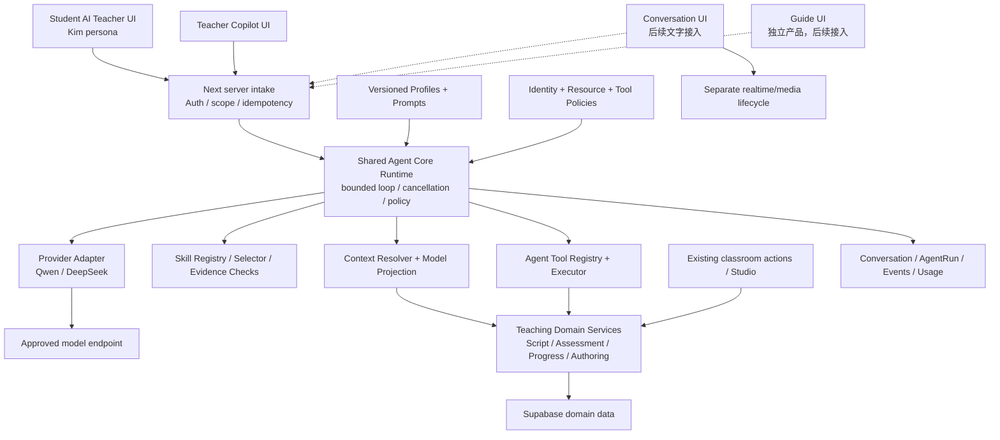
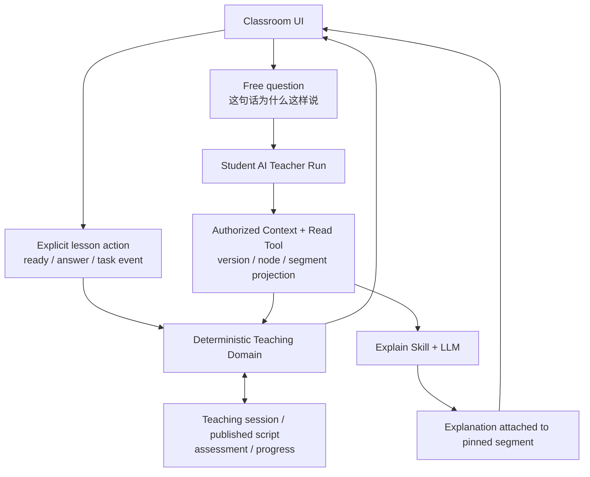
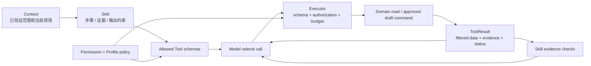
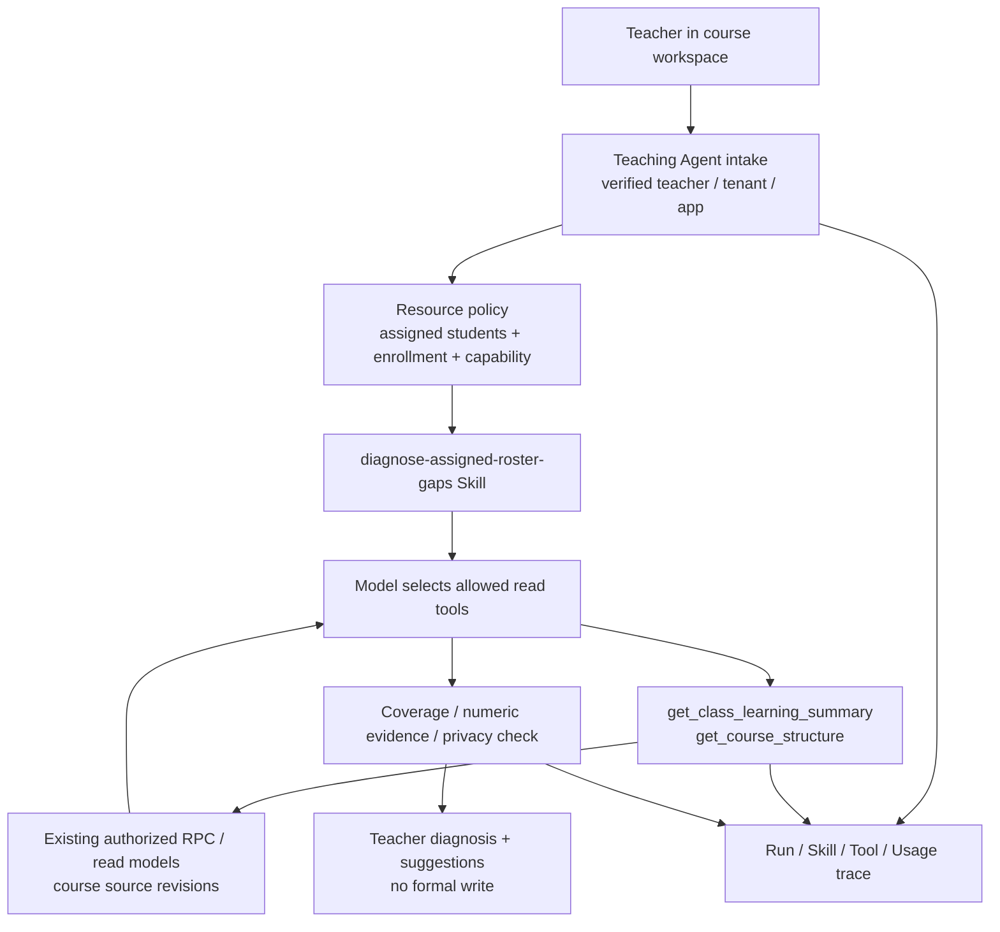
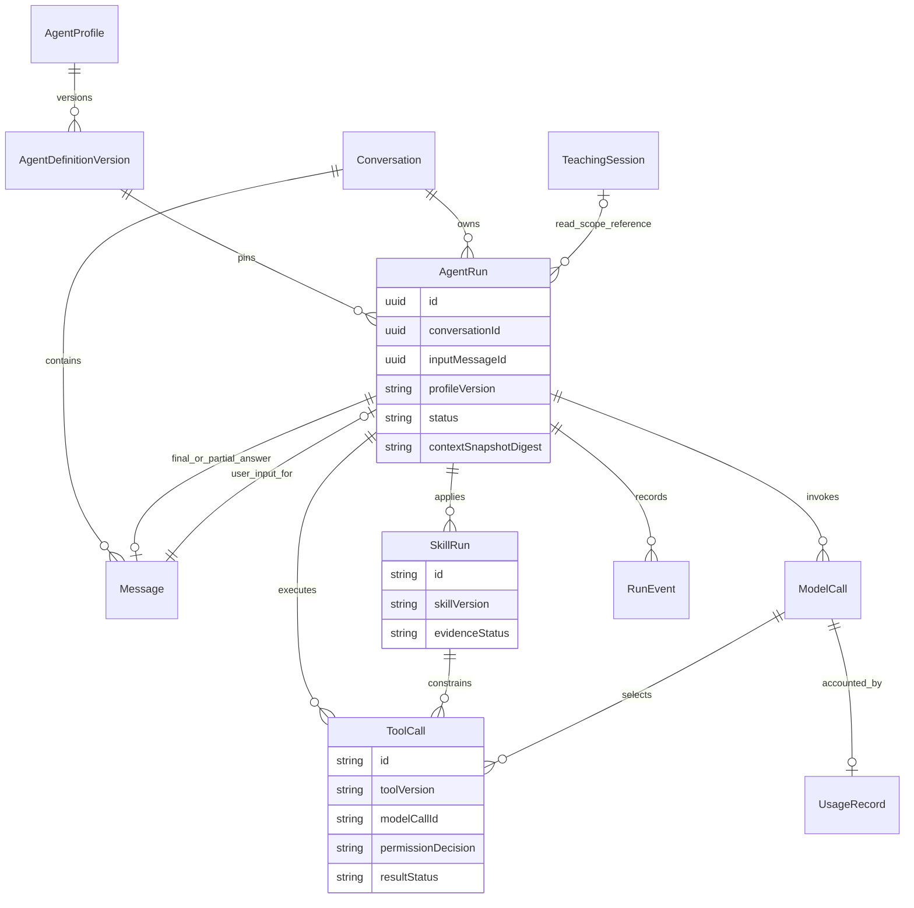
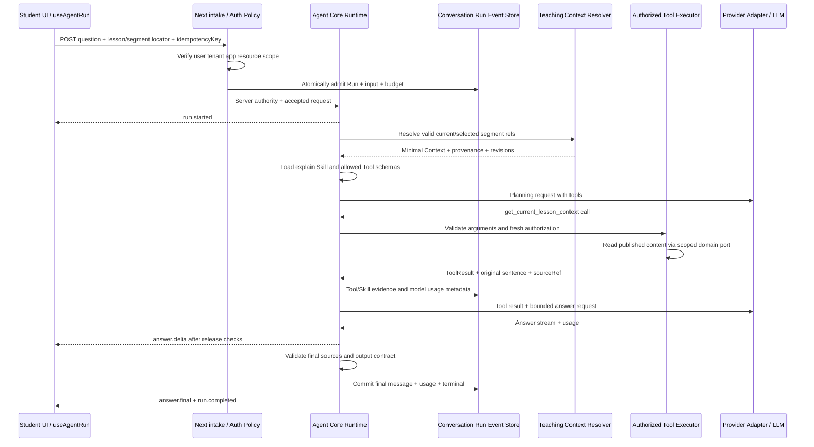

# UPLY Teaching Agent Architecture v1

> 文档性质：Architecture Design；版本 v1；日期 2026-09-13。本文是设计决策与后续实施依据，不是已经实现的系统说明。此次仅新增本文档，没有实现 Runtime、API、Tool、Skill 或数据库变更。
>
> **Current State** 以用户提供的 [Phase 0 审计][AUDIT] 为基础，并对关键权限、Runtime 适配器与部署配置作只读核对。**Target State** 是本文建议。**Migration** 是未来分阶段实施方案。除明确标为现状的内容外，类型、目录、表、事件、预算与验收阈值均为提案。

## 1. Executive Summary

**推荐 B：Shared Agent Core Runtime + Specialized Agent Profiles，配合独立的 Deterministic Teaching Domain。** 共用身份解析、Context、Skill/Tool 执行框架、Provider、Conversation、Run、事件和用量治理；学生老师、教师 Copilot、会话陪练、导览保持不同能力集合、数据范围、会话范围与产品入口。

Teaching Agent 在本文中指：**在已授权教学上下文内，按照可版本化的教学方法，选择受控工具获取证据，通过有限模型循环给出解释、诊断或教学建议的应用运行时。** 它不拥有正式成绩、课程进度、脚本发布及课堂状态的最终决定权。

**Current State：** 现有三套逻辑产品系统是导览、课程老师、会话练习；对应四条主要推理路径。课程老师是“确定性脚本工作流 + 条件 LLM 讲解”，尚无真正的产品 Tool Layer、Skills Layer 或统一 Agent Core。Teacher Copilot 未被现状审计证明存在。[AUDIT]

**Target State：** Teacher Kim 是 Student AI Teacher 的 persona/profile；不是另一个需要独立服务、记忆和权限模型的 Agent。现有脚本继续控制讲课顺序、互动与任务条件；Agent 读取脚本的安全投影，回答学生自由追问。教师 Copilot 使用教师被分配范围内的学情与内容，先只读分析。

**Migration：** 首个开发交付是一个学生纵向切片：“这句话为什么这样说？”→服务端绑定真实课时与 segment→加载解释 Skill→模型选择内容 Tool→工具结果回流→流式讲解→持久 Run/usage/trace。此切片必须做到零教学领域写入，不能以固定后端检索冒充 Tool Calling。之后扩展教师只读切片，再评估确认草稿、会话与导览迁移。

## 2. Current-State Constraints

### 2.1 事实、约束与目标响应

| Current State／证据 | 对设计的约束 | Target State／Migration 响应 |
|---|---|---|
| G/L 的 Edge 各自构建 Provider、Prompt、SSE；C 又有独立实现 [GEDGE] [LEDGE] [CEDGE] | 不能把现有某个 Edge 直接命名为统一 Runtime | 新 Core 和 Provider port；旧入口分批保留 |
| `respond` 非 ask 路径执行脚本，ask 不准确携带当前 segment [LAPI] [SCRIPT] | 新解释能力必须有准确现场绑定；不能让 LLM 接管教学状态 | 基础 Context Resolver + 当前内容 Tool；脚本仍为领域服务 |
| G/L 各有会话表；L session 同时承载 teaching_state [GUIDESQL] [SCRIPTSQL] | 不能用 AgentRun 替代 teaching session | 新 Agent conversation/run 与旧教学 session 关联但独立 |
| 正常 Next 入口有 verified user/tenant，Edge 未闭合业务授权 [AUTH] [GAPI] [LAPI] | 新能力不能继续依赖“携带 JWT 即可”的下游信任 | 身份、资源和工具授权在新 Runtime 服务端闭合 |
| 教师分析已有确定性聚合；无教师 LLM 链 [INSIGHTMODEL] [CLASSDATA] | 复用数据和授权，不杜撰教师 Agent | 新 Teacher Copilot Profile、Skill、只读 Tools |
| 现有脚本 authoring/preview 是 owner 控制面 [STUDIOACTIONS] [PREVIEWAPI] | teacher 身份不等于拥有脚本库写权 | MVP 无写入；教师提案与正式 owner 草稿分开 |
| `production-teacher-*` 注释与调用关系都表明未装入生产 Route [PRODBACKEND] [PRODTEACHER] | 不可依文件名作为上线事实或新 Core 基础 | 保留实验、选择性复用 scope/revision 思路 |
| usage 不完整、缺 Run 关联；G 有局部失败与耗时 [MODELSERVICE] [OPSSERVICE] | 有资产可扩展，但不能当账单或完整 tracing | 从第一阶段建立 Run、model-call usage、终态写入 |

### 2.2 来源与未确认范围

已完整阅读用户提供的审计与 [MLflow 参考材料][MLFLOWREF]；后者只用于职责拆分，不证明 UPLY 已有六层。关键源码核对集中于 teacher boundary/production adapter、教师分配与应用授权、班级聚合、Next 与 OpenNext 配置。未查真实用户数据、线上环境值、远端 schema 或现网部署状态；未运行业务测试或数据脚本。

工作树基线 HEAD：`b1672390ae96357a2143358235cc10edeff8d488`。基线已有 6 个源码文件改动，以及未跟踪文档和素材；这些不属于本次设计结果。当前实际选中的模型、供应商地域、托管方式、Edge 已部署策略、外部语音内部实现仍为 **Unknown**。附件中的模型名是源码配置证据，不是线上可用性承诺。

## 3. Architecture Goals

**Target State：**

1. 一次回答能说明使用了哪个课程版本、现场片段、Skill、Tool 和模型，并区分事实、推断及缺失数据。
2. 学生与教师共用执行机制，但权限、工具列表、上下文、会话和内容可见性隔离。
3. 保留教材、教学脚本、判题、进度与发布领域的权威性；模型建议不会直接产生正式状态。
4. Provider 可替换而不要求 UI、Skill 或领域服务知道供应商协议；能力不足时明确拒绝，不伪装支持。
5. Run 有边界：可取消、可追踪、预算有限、失败可解释；不无限循环、不隐式跨课读历史。
6. 采用小规模、可回退的增量接入；每个 MVP 从第一天具备资源授权、用量与基本 trace。

**验收原则：** “能聊天”不是 Agent MVP 成功；必须证明真实模型 Tool selection、服务端授权执行、结果回流和现场 grounding。新 Agent 的成熟度通过第 29 节评估，不通过命名判断。

## 4. Non-Goals

本次只设计。v1 首批开发不包含：完整教材重构、Script Runtime 替换、统一所有旧会话表、自动发布、自动改分、正式自动评分、自动结业、跨机构管理、开放 SQL/HTTP/Shell/File 工具、Coding Agent、MCP 市场、自定义用户上传可执行 Skill、向量知识库、长期画像记忆、模型训练或微调。

实时 avatar、ASR/TTS 服务重建、视频生成、3D 角色、媒体播放器迁移、UI 视觉改版也不属于 Agent Core MVP。它们只保留媒体状态／会话关联接口。Provider Adapter 不承诺首版接入所有供应商；Guide/Conversation 不与学生 MVP 同时切换。

## 5. Architecture Options

以下是 **Target State 的备选方案**；均未实施。

| 维度 | A — Single Universal Agent | B — Shared Runtime + Specialized Agents | C — Independent Agent Services + Shared Infrastructure |
|---|---|---|---|
| 形态 | 一个 Agent 汇集导航、教学、备课、陪练工具 | 一套 Core，按产品选择 Profile/Skill/Policy | 每种 Agent 单独服务，底层协议及组件共享 |
| 初始复杂度 | 入口低，角色和上下文分支快速膨胀 | 中；先定义边界，再接两个小切片 | 高；部署、网络、版本兼容和鉴权委托同时出现 |
| 维护成本 | 改 Prompt/工具易影响所有用户 | 共享机制修一次，领域策略独立测试 | 执行机制容易重复；跨服务升级需协调 |
| Context 隔离 | 依赖大 Prompt／条件分支，错误混入影响广 | 请求绑定单一 Profile 与 scope，服务端投影 | 物理服务隔离较强，但共享 DB 仍需行级授权 |
| Tool 权限 | 工具合集大，误暴露风险高 | Profile∩Role∩Resource∩Skill allowlist | 服务级清晰；仍必须执行时校验资源 |
| 教学稳定性 | 易把“解释”与“推进课堂”混合 | 确定性教学域独立，LLM 只解释／建议 | 可独立保障课堂服务，但跨服务状态协同复杂 |
| 学生／教师体验 | 同入口需要大量模式切换 | 各自入口、话术、输出结构与历史 | 各自体验独立，统一交互协议成本较高 |
| 多租户 | 不是单 Agent 就天然隔离 | authority + repository + result projection | 服务拆分不是租户隔离替代品 |
| 扩展与规模 | 工具／Prompt膨胀，瓶颈难分离 | 可按需求把同一 Core 装入独立 worker | 独立扩缩容好，前期闲置与维护成本较高 |
| 推理费用 | 容易发送全工具／大上下文 | 每个 Skill 仅加载所需上下文和工具 | 可各自优化，但调用链及重复摘要增费用 |
| 演进风险 | 越晚拆越难界定产品状态 | 需约束共享 Core 不吸收领域规则 | 过早分布式化、鉴权委托与重复状态 |
| 适配当前 UPLY | 不推荐 | **推荐** | 达到明确扩容／长任务条件后采用部署形态 |

**Decision：选择 B。** UPLY 已有共享认证、数据库、内容和模型控制面，同时有不同业务生命周期；共享代码并不意味着所有 Agent 共用一份 Prompt、一组 Tools、一条 Conversation 或一个全局 mutable runtime 实例。C 是未来可能的部署演进，不是 v1 必须付出的成本。A 不选，因为角色隔离与教学稳定性不适合交给一个通用 Agent 的提示规则维持。

## 6. Recommended Architecture

### 6.1 总体目标架构



图中均为 Target State；虚线表示后续迁移。Student/Teacher Profile 共享 Core，Guide 产品规则和会话媒体服务保持独立。Context/Tool 通过领域端口访问数据；Provider 不访问教学 DB。

### 6.2 部署位置决策

| 维度 | Next.js 服务端 | Supabase Edge Function | 独立 Agent service |
|---|---|---|---|
| 身份／资源校验 | 可复用当前 verified user、tenant、server repository | 必须重新建立鉴权与业务范围，不能只解 JWT | 需独立认证或受众限定的委托凭证 |
| 延迟／流 | 少一层 Next→Edge 转发；仍需实测代理缓冲 | 靠近某些请求/DB的效果取决于部署地域 | 多一跳但可专门配置长连接 |
| Provider 与工具 | 同一服务端作用域内调用，易共享 TS | Deno 适配及生命周期限制需处理 | 独立依赖与并发配置灵活 |
| service role | 集中在授权后 repository；读优先 user-scoped client | 当前 Edge 高权限读配置不等于完整授权 | 仍需最小范围 repository，拆服务不解决越权 |
| 长任务／确认 | 请求不能跨用户思考期悬挂；依赖持久 checkpoint | 也有 worker、CPU、idle 等限制 | 更适合队列、长任务和独立资源配额 |
| 部署维护 | 首版最少新增部署单元 | 当前已有函数，但不值得继续复制薄代理 | 首版成本较高 |
| 结论 | **v1 推荐：Next Node 服务端装配 Core** | 不作为新 Teaching Runtime 默认位置 | 触发条件满足后抽出同一 Core |

**Current State：** 仓库同时包含 `next start` 与 OpenNext Cloudflare 构建路径，不能据此断言线上一定是持久 Node。[PACKAGE] [OPENNEXT] 本地 Next 指南支持选择 nodejs runtime，并提醒自托管流必须检查整个代理链的缓冲配置。[NEXTRUNTIME] [NEXTHOST]

**Target State：** 新 `/api/teaching-agent/*` 请求由 Next 的服务端组合根承接；Core 使用 ports、标准 AbortSignal/AsyncIterable，不依赖 React 或 Edge 全局变量。首个部署选择可验证的 Node 宿主，不能认为一行 runtime 配置会把 Cloudflare Worker 变为 Node 进程。若现网只有 Worker 且无法满足预算、取消和持久 checkpoint 的验收，则以私有 Node 服务承载同一 Core，Next 保留 BFF；不得悄悄降级为不受控 Edge 直达。

Supabase 官方文档列出托管 Edge 的 worker 时长、CPU 和请求 idle 限制；这些是选型因素，不是“Edge 无法做 Agent”的结论。[Supabase Edge limits](https://supabase.com/docs/guides/functions/limits)

**Migration gate：** P0 必须确认实际宿主、Provider 地域、代理无缓冲、请求取消、45 秒执行预算与终态持久化。长任务超过预算、持续积压影响课堂、需要异步批量备课或独立扩容时，再提取 worker。本文不新建网络服务、修改配置或开启现有 Edge。

## 7. Agent Taxonomy

| 名称 | 定义／用户 | 独立 Agent Profile？ | 状态与权限范围 | Current → Target |
|---|---|---|---|---|
| Teaching Agent Runtime | 教学产品使用 Core 的组合根与领域适配 | 否，是执行系统 | 每个 Run 独立 authority，无全局用户状态 | NEW |
| Student AI Teacher | 学生现场解释、提示、复习建议 | 是：`student-ai-teacher` | 当前用户、获授权课程／lesson、学习会话 | 现有课程老师增量接入 |
| Teacher Kim | 韩语老师的呈现身份、语气、语言与素材引用 | persona / subject-specific profile variant | 继承 Student AI Teacher，不能增加权限 | 保留现有角色资产并 ADAPT |
| Teacher Copilot | 教师备课、学情分析、内容审阅与草稿建议 | 是：`teacher-copilot` | 当前 tenant、app、负责学生及允许内容 | NEW；先只读 |
| Conversation Agent | 韩语会话陪练 | 是：`conversation-practice` | 当前 practice session／scenario | 现有独立功能后续接 Core 文字路径 |
| Guide Assistant | 产品导航与个人学习入口帮助 | 是：`uply-guide-agent` 产品 Profile | 自身导览 scope；无隐式课堂控制权 | 保持独立产品，后续同 Core 运行 |
| Assessment／Planning／Authoring／Diagnosis | 任务方法 | v1 不建独立 Agent/service | 由 Skills、Tool policy 和输出类型限制 | 作为 Teacher/Student 的受限能力 |

**Target State：** 一个请求只能运行一个顶层 Profile；Core 不默认让教师 Agent 调学生 Agent，不进行多 Agent 协商或自动转交私有历史。用户换角色／产品入口时切 scope 与 conversation。Kim、不同语言与科目通常是 profile 配置差异；只有业务权限／生命周期实质不同才升级为新 Agent 类别。

## 8. Teaching Agent Runtime

### 8.1 一次请求的职责

**Target State：**

1. **Intake**：校验请求大小、message、入口允许的 agentCode、scope locator、idempotencyKey；不接受客户端 Prompt、role、tenant facts、Tool 定义或 DB history。
2. **Authentication / Authorization**：验证账户与当前 tenant，检查 app、资源、conversation ownership；生成仅服务端可用的 RunAuthority。
3. **Run admission**：按用户／tenant并发与预算原子预留，创建 Run 与输入 Message，锁定 profile/prompt/skill/tool policy 版本。
4. **Context resolution**：验证课时／当前节点关联、教学 session、教师教学范围；建立最小基础 Context 和可检索资源引用。
5. **Skill selection**：只在 Profile 允许的已发布 Skill 中路由，校验必须 Context 与证据要求。
6. **Tool exposure**：取 Profile、角色、资源、Skill、能力开关的交集；只有该集合的 JSON schema 进入模型请求。
7. **Bounded model/tool loop**：Provider 返回 tool call→完整参数解析→再次授权→执行领域读或获批草稿写→校验输出／投影→把 tool result 与 call ID 回送模型。
8. **Answer generation**：证据满足后进入回答阶段；首版回答阶段关闭 Tool selection，流式生成解释。无法满足证据时输出缺失说明，不产生虚假学习判断。
9. **Release / persistence**：身份与 scope 检查、格式与证据检查、事件投影；保存消息状态、tool/skill 结果元数据、用量与 Run 终态。
10. **Failure / cancellation**：统一错误码，停止新的模型和工具操作，取消上游，保留已发生事实和不完整标记。

工具调用是模型决策；Skill 约束可接受流程。后端可以确定性解析当前教学状态作为基础 Context，但这次读取单独记为 context.resolve，不谎报成 model-selected ToolCall。

### 8.2 执行约束与并发

首版默认预算是**待压测的产品策略**：每个 Run 最多 3 次模型请求（含重试），最多 4 次 Tool execution；总墙钟 45 秒，单模型调用不超过 20 秒且受剩余总预算约束，读 Tool 最多 3 秒，最多一个模型请求同时进行。最多两个检索回合，预留最后一次请求生成回答；不会把预算耗尽后再额外调用“总结模型”。

同一 conversation 同时最多一个非终态 Run。以 DB 原子 admission + version/lease/fencing token 保证；第二次输入返回 `CONVERSATION_BUSY` 或由用户明确取消前次后重发，MVP 不排隐式队列。同一 idempotencyKey + 相同规范化输入返回同一 Run；相同 key 不同输入返回冲突，不重复付费调用。单用户默认 1 个运行中 Run；tenant 配额须在 P0 配置并原子预留，未知配置禁止启用新路径。

Run 的生命周期独立于某个 Node 内存对象。短请求执行采用数据库 lease，进程终止留下的过期 Run 由下一次 admission/status 查询以及部署侧轻量定期 reconciliation 标记 failed；不自动重跑。`waiting_confirmation` 释放计算资源，以持久 checkpoint 恢复，见第 12、17 节。它仍占用该 conversation 的未完成请求位置，避免审批对象被后续回合改变。

45秒是P1/P2无人工等待Run的总墙钟上限。P3增加确认后，累计实际执行时间仍最多45秒，人工等待暂停执行计时但最长10分钟；Run另存activeElapsedMs、remainingExecutionMs与confirmationExpiresAt，恢复不能重新获得完整预算。等待时释放user/tenant执行并发名额，保留未结算预算与conversation待办位置；确认恢复必须重新原子申请执行名额，不能借等待绕过配额。

### 8.3 当前实现的关系

[LAPI] 把查询、脚本推进、消息和条件 Provider 调用混在 Route；新 Core 不复制该 Route。**Migration：** 最初仅把明确的自由解释入口送入新路径；`start/ready/answer` 等确定性课堂动作继续使用旧路径。不得失败后偷偷把同一 Run 转交可能改变教学状态的旧 respond。

## 9. Deterministic Teaching Runtime Boundary

### 9.1 权威划分

| 行为／状态 | Target authoritative owner | Agent 能做什么 | Agent 不能做什么 |
|---|---|---|---|
| 当前 script version/node/segment、阶段、required task | Teaching Domain / Script Runtime | 读取授权安全投影；解释当前教学内容 | 直接写 teaching_state、跳节点、伪造事件 |
| 下一节点选择 | 脚本规则与领域校验 | 提议“可继续练习”，展示已验证导航建议 | 把自然语言 next 指令当状态变更 |
| 互动答案正确性 | 现有确定性判题或正式 assessment 服务 | 读取允许公开的已提交反馈；给提示 | 读未开放答案、替换 correct index、写分数 |
| 正式学习进度／结业 | Progress/Completion domain | 读取事实解释计算口径 | 根据“我学会了”或回答文本标记完成 |
| 教学脚本／题目发布 | Authoring/Publishing domain + 有权人员 | 后期生成独立提案／受控 draft | 默认 publish、覆盖已发布内容 |
| 播放／黑板／视频 | Media/UI domain，服务端验证资源绑定 | 用媒体引用说明语境 | 把 timestamp／ended 客户端声明当完成证明 |

**保留 [learning-agent-script-runtime][SCRIPT] 为独立领域服务。** 它可以通过 `get_current_teaching_state` 这类只读 Agent Tool 暴露安全视图，但 Script Runtime 本身不因此变成 Skill 或 Agent Runtime。未来如开放“申请继续”能力，只能返回建议或调用与普通 UI 同等条件的领域命令；v1 不将 advance、submit-grade、complete 注册为模型工具。

### 9.2 学生追问与课堂协作



**Target State：** 一次解释绑定一个 server-resolved content revision + teaching state revision。用户在生成期间推进课堂，回答仍标“针对刚才所选片段”；不得把旧结果应用成新节点指令。若当前内容撤销访问或发布版本失效，则停止继续释放结果。追问不创建／重启 `learning_agent_sessions`，不暂停服务器正式教学状态；是否暂缓本地自动播放由 UI 已有行为决定，不伪造学习事件。

**Migration：** 引入只读 projection port 时验证现有 session 能否提供可信 segment；若不能，服务端根据有效 node＋script 数据验证客户端 segment locator，并标记 `client_state` 选择语义。必须区别“合法的已选片段”与“已证实正在播放的片段”。没有足够信息时要求用户选择片段；不能以最近一条 hint 替代现场内容。

## 10. Context Architecture

### 10.1 合同与信任模型

**Current State：** G 后端聚合学情；L 提供模块 JSON 与 history，但缺现场 segment 和统一 provenance。[GCONTEXT] [LAPI] **Target State：** TeachingContext 是 server-only 数据容器，不整体序列化发送模型。独立 `ModelContextProjection` 决定哪些字段进入 Provider；RunAuthority 与凭证永不在模型投影中。

完整类型见第 24 节。必填：schemaVersion、snapshotId、resolvedAt、identity、conversation、environment、sources。学生现场 Skill 另要求 course 与 runtime；教师诊断要求 teacher scope 与指定 course。Learning 数据可以缺失，缺失不等于零分或没有学习。

| Provenance | 意义 | 可否用于授权／正式状态 |
|---|---|---|
| trusted_server | 经认证、后端规则解析的身份或 scope | 可用于服务端策略；不是把身份提示给模型就完成授权 |
| trusted_database | 在权限范围内读出的领域记录／已发布版本 | 可作为业务证据；文本内容仍可能含错误或 Prompt injection |
| verified_runtime | 通过服务端 session/version/node 关联验证的运行状态 | 仅认可已验证字段；不代表证明真实观看／理解 |
| client_state | 页面路径、选区、视频时间等浏览器状态 | 只提供语境，不能授予权限或证明完成 |
| user_claim | 用户陈述“我是老师”“已经掌握”等 | 作为请求内容，不能覆盖身份、成绩或进度 |
| model_generated | 回答、推断、summary、临时诊断 | 必须标推断；不能写回为学习事实 |

每项来源有 sourceRef、revision、observedAt、retrievedAt、scope、privacyClass、completeness 和可见性。可信来源只说明由谁获取，**不等于其文字可以成为高优先级指令**。同一字段混合来源时保留分项 provenance，禁止把整包客户端数据统一升级成 trusted_database。

### 10.2 Context Matrix（目标）

| Context | Source / 读取方 | 必填范围 | 注入点：直接 Prompt / 按需 Tool / 不发 | 持久化与刷新 | 信任／限制 |
|---|---|---|---|---|---|
| userId、role、tenant、organization | Auth Resolver + membership | 所有 Run | 模型仅获角色语义、locale；真实 ID 默认不发 | Run 存作用域 ID；每次请求复核 | trusted_server；organization 通过 tenant 关系解析，不接受 body 覆盖 |
| app、enrollment、资源资格 | Permission Resolver／现有应用授权域 | 学生／教师教学请求 | 不发完整权限资料；只生成资源引用和允许工具 | 每次 admission、Tool 和 release 校验 | trusted_database |
| 学生姓名／profile／level | profile 与已记录学习等级；Context Resolver | 可选 | 用别名与教学所需等级；详细 profile 只读 Tool | snapshot 元数据；默认不复制联系方式 | DB level 与自报 level 分项标来源；不存在时 Unknown |
| progress、weakness、assessment | 学习数据 repository／聚合 RPC | 诊断 Skill | 少量总览可直接；详情通过 Tool | 每 Run 读取；报告标 asOf、窗口、样本量 | trusted_database；不得把局部查询说成全量 |
| course/lesson/chapter/module/objectives | 已发布课程和教材链 | 学生解释／课程诊断 | ID 别名、标题、目标短摘要直接；正文 Tool | 不可变版本引用 | 全链验证，名称相同不代表同一资源 |
| current node/segment/phase/task | Teaching session + script projection | 当前片段解释 | 安全 locator、状态摘要直接；原句和邻接讲解 Tool | Run 固定 revision；每 Tool 检查仍可访问 | verified_runtime；不包含答案 key／私有 guardrail |
| exercise／question／answer | 已开放题面、提交与反馈领域 | 提示／答后复盘 | 题面／允许反馈按需 Tool；用户答案标 user_claim | 默认仅摘要/引用；不保存整份答卷到 trace | 未提交答案 key 不发；正式测评按教学政策禁用提示 |
| media、timestamp、blackboard | DB 素材绑定＋UI playback／selection | 可选 | 已授权素材／文字引用；时间标 client_state | 元数据；不复制音视频二进制 | 视频时间不是观看证明，不推测帧内容 |
| teacher／负责学生／班级／教学分配 | `tenant_student_assignments` + app权限／聚合 RPC | Teacher Copilot | scope 摘要与人数；详细 roster 不默认发 | 每次读取／输出前复核；不全局缓存 | MVP“班级”是当前应用负责学生集合，不杜撰已有 classId 实体 |
| assignment／提交状态 | assignment/targets/submission/read model | 作业相关 Skill | 允许的统计或当前学生任务，通过 Tool | asOf、状态版本、完整性 | 教师只负责范围；学生仅本人可见作业 |
| conversation/recent messages | 新 conversation repository | 所有 Run | 同 scope 最近安全历史 | DB 持久、按 token 裁剪 | 用户内容仍 user_claim；不能信任客户端 history |
| summary | 后续 conversation summary | 可选 | 明确 model_generated，引用覆盖 message range | 可失效、可重建；不是真实进度 | 版本与 source message IDs |
| route／selected object／locale／UI state | 浏览器 locator + 后端校验 | locale 必填有默认；其余可选 | 当前问题必要信息，单独数据区 | 最小 context snapshot；不存任意 DOM | client_state；忽略 role/tenant 等伪造字段 |
| uploaded file／knowledge base | 当前没有统一产品链 | v1 不启用 | 不注入 | 不新增存储 | Missing；后续需独立文件授权与引用协议 |

### 10.3 Resolver：基础 Context + 按需 Tools

**Decision：采用混合式。** 后端先解析身份、获授权 scope、conversation、当前内容 locator 和短目标摘要；Skill 决定需要什么证据，模型选择窄域 Tool 获取正文／统计。不要把整本教材、全班 profile、全部对话或答卷塞进 Prompt。

运行顺序：验证 locator→解析 course/content version→验证教学 session 或教师范围→生成 snapshot/sourceRefs→选择 Skill→按授权投影基础 Context→Tool 补齐 evidence。工具只能在既定 scope 中细化查询；不能把模型给出的 tenantId 当新 scope。教师切学生／课程是显式新 scope 请求，而不是 Tool 自动越界扩张。

**预算（提案）：** 每次模型调用 input cap 8,000 tokens，回答 output cap 1,200；其中 base/policy/persona 1,200、Skill 900、工具 schema 900、基础 Context 800、历史 1,400、检索证据 2,000、用户输入及余量 800。总和 8,000；这不是供应商最大窗口。任一 Prompt 版本超配不得静默挤掉安全指令；发布验证失败。最多 3 个模型请求的 Run token admission 预留上限为 27,600（含各次 output 上限），再按实际调用结算。

截断优先级：保留身份范围与当前问题／必要内容→保留必要证据→删除旧历史→缩短可选背景→分页细化 Tool；必要证据仍放不下则返回 `CONTEXT_TOO_LARGE`，不截断 JSON 字节拼接或丢 provenance。一个 tool call 与它的结果作为原子单元保留；历史消息不可留下孤立 tool result。没有准确 tokenizer 时使用经目标语言校准的保守估算并留余量；Provider usage 才是实际 usage，二者字段分开。

**Freshness/cache：** 发布内容以 immutable version 作为 cache key；学生学情默认请求内 memoize，教师聚合允许最多 30 秒 scope-keyed cache，但明确 asOf/coverage。身份、enrollment、分配、资源可见性不靠该缓存授权；执行／结果释放时重新检查。个人缓存键包含 tenant/user/app/scope/policy version；禁止只按 lessonId 缓存学生数据。发布撤回与关系撤销优先于固定内容 snapshot。

**Snapshot：** Run 保存 sourceRef/revision、查询时间、字段白名单、截断清单、token 估算、coverage 与 HMAC digest；不默认保存整份个人上下文。不可变教材可按版本重建，动态学情仅靠摘要不能精确重演，trace 必须标 `replayability=metadata_only`。需要精确复盘时，经批准开启短期、加密、去标识内容采样，见第 17 节。

## 11. Skills Architecture

### 11.1 定义与执行边界

**Current State：Skills Layer Missing。** 现有 Prompt、学习能力维度、课程脚本及开发工作区 skill 文件均不能当产品 Skills。[AUDIT] **Target State：** Skill 是经过版本化与评估的教学专业作业规范，包含触发条件、必要 Context、允许 Tools、步骤、证据标准、输出合同及失败条件。

| 概念 | 职责 | UPLY 例子 |
|---|---|---|
| Context | 当前是谁、在哪、有哪些已知事实 | 当前课时版本、segment、负责学生集合 |
| Prompt | 实际发送给模型的指令与数据载体 | 基础规则、persona、当前 Skill 的 procedure |
| Tool | 一次受控能力调用 | 读取当前 segment 的已发布内容 |
| Skill | 如何使用证据完成专业任务 | 先识别原句结构，再依据课程目标解释，最后核查例句 |
| Teaching Script | 给学生呈现的确定性课程编排 | 讲解→任务→反馈→下一段 |
| Workflow | 软件执行的状态与规则流程 | 工具审批、Run 状态机、内容发布流程 |
| Agent | 选择受控动作并结合结果继续推理的执行主体 | 带学生 Profile 的一次有限 Run |

Skill 的 procedure 会进入 Prompt，但 Skill 的版本、可用 Tool、证据是否齐备、输出是否符合合同由 Runtime 执行检查。Prompt 遵循不能保证专业步骤全部完成；必须把关键证据与输出条件转化为可验证要求。Skill 不直接访问数据库、不直接执行函数、不安装依赖、不替用户提升权限。

### 11.2 Registry / selection / lifecycle

首版采用**仓库内受审查的结构化 manifest + 专业 procedure 文本**，不引入动态文件系统加载或任意 Markdown 执行。每个 Skill 有 `id@version`、内容 digest、allowedAgents、context requirements、allowedTools、risk ceiling、procedure、evidenceRequirements、outputContract、failureConditions、evaluationCriteria。完整接口见第 24 节。

选择规则由服务端 Profile＋明确 UI intent＋Context 前置条件决定；含糊自然语言只在小候选集合中选择，必要时返回澄清。MVP 解释入口固定选择 `explain-pinned-korean-segment@1.0.0`，其中工具仍由模型选择。后期模型可建议另一个 Skill ID，但 Runtime 必须重新校验版本、scope、预算和权限；不允许模型构造 Skill 定义。每个 Run 首版至多一个顶层 Skill，不做递归 Skill/Agent 调用。

发布流程提案：领域人员评审方法→工程校验 manifest/schema/引用的 Tool→授权反例及教学 golden cases→生成不可变版本→Profile 显式指向该版本→小范围启用。禁用 Skill 应阻断新的 Run，运行中在下一步检查终止；禁用不是偷偷使用上一版。旧版本用于审计，只有显式回滚 Profile 才重新启用。eval regression 通过后才更新活动版本。

### 11.3 第一批候选 Skills

全部为 **Target State**；P1/P2 是首批，P3+ 是后续候选，不表示同时实现。

| Skill / 阶段 | User intent | Required Context | Allowed Tools | Expected output | Risk / Agent |
|---|---|---|---|---|---|
| `explain-pinned-korean-segment` / P1 | “这句话为什么这样说？” | 学生、已授权 lesson、有效 segment、locale | get_current_lesson_context、get_current_teaching_state | 原句引用、结构说明、一个标为补充的例句、理解检查 | L0；Student/Kim |
| `hint-without-revealing-answer` / P3+ | “给我一点提示” | 当前题面、正式测评状态、可提示政策 | get_current_exercise_context | 分级提示，不含未公开答案；不具资格则解释不可用 | L0；Student |
| `reflect-on-submitted-answer` / P3+ | “我为什么错？” | 本人已提交结果、已发布反馈、课程目标 | get_released_assessment_feedback、get_current_lesson_context | 引用已公开反馈、错误原因假设、复习点 | L0；Student；非重新评分 |
| `choose-grounded-practice` / P3+ | “下一步练什么？” | 本人真实进度与开放资源 | get_student_progress、list_available_practice | 至多 3 个允许练习、理由、证据与未知项 | L0；Student；导航为建议 |
| `diagnose-assigned-roster-gaps` / P2 | “这课我负责的学生最容易错哪里？” | teacher/app/course、获授权学生集合、时间窗口 | get_class_learning_summary、get_course_structure | 样本与覆盖、薄弱点证据、教学建议、不能推出的结论 | L0；Teacher |
| `plan-lesson-from-objectives` / P3+ | “按现有目标做一份课前安排” | 允许课程内容、教学对象汇总 | get_course_structure、get_class_learning_summary | 时间分配与活动建议；明确是方案草稿 | L0；Teacher |
| `review-script-against-source` / P3+ | “脚本是否覆盖本课目标？” | 已授权脚本版本、教材 source revision | get_teaching_script、get_course_structure | 目标覆盖、遗漏／冲突、逐项来源 | L0；Teacher或有内容审阅权限人员；草稿无权则拒绝 |
| `propose-practice-draft` / P3 | “给薄弱点补三道练习” | 已授权目标、内容与题型约束 | get_course_structure、list_question_bank_metadata；确认后 create_question_draft | 题目提案、教学目的、候选答案／解析，始终草稿 | 提案 L0；存草稿 L2；Teacher |
| `prepare-student-feedback` / P3 | “给该生写一段反馈” | 负责关系、已释放学情、时间范围 | get_student_learning_summary；确认后 create_teacher_note_draft | 可审阅反馈，事实与建议分开；不自动发给学生 | 提案 L0；存草稿 L2；Teacher |

### 11.4 两个首批 Skill 的专业 procedure

**学生解释 Skill：**

1. 核对 sourceRef 绑定当前选定 lesson/segment；如果没有有效原句，先询问选择对象。
2. 模型调用内容 Tool 取得原句、允许的邻接解释与本课目标；不得只靠旧聊天记忆猜句子。
3. 分辨词汇、助词、词尾或语用问题；优先解释用户实际疑惑，不展开整课。
4. 将教材已有解释与模型补充例句区分；补充例句不冒称课本原文。
5. 输出简短中文／韩语解释及一个理解检查；不打分、不推进脚本。
6. Runtime 检查内容 Tool 成功证据、引用 sourceRef/版本有效、输出长度和不允许动作；检查失败输出缺失说明或终止。

**教师诊断 Skill：**

1. 固定 teacher 当前 app、course、时间窗口和负责集合；“全班”只指该授权集合。
2. 模型选择 aggregate Tool，获取分母、样本数、缺失量、来源、asOf；再读课程目标。
3. 比较错误频次、覆盖人数和最近练习情况，不把零记录当掌握、不把相关性说成学习原因。
4. 只列最多 3 个证据支持的教学关注点，并提出可实施的课堂讲解／练习建议。
5. 不推断能力标签、动机、健康或家庭背景；不足样本返回“证据不足”。
6. Runtime 校验统计数值与源聚合相符、引用可见、输出无未授权学生信息；正式发布与任务下发不在此 Skill 内。

## 12. Tools Architecture

### 12.1 定义与完整调用环

**Current State：Current Assistant does not have a true Tool Layer。** 当前普通 API、导航 rules、Script 函数以及 [learning-tools.ts][LEARNTOOLS] 均非 LLM 可选工具。

**Target State：** Agent Tool 必须经过 registry 提供 schema→模型选择 tool name/arguments→executor 验证→领域服务执行→结果按权限投影→与原 call ID 一起返回模型→继续推理。MVP 用进程内 server-only registry；MCP 不是成立条件，也不在首版引入。禁止任意 SQL、URL、shell、路径、动态代码等通用入口。



### 12.2 Registry 与执行合同

每个 ToolDefinition：name/version/description/category/inputSchema/outputSchema/requiredPermissions/allowedAgents/allowedRoles/riskLevel/timeoutMs/auditPolicy/maxResultTokens/status/idempotencyPolicy。完整接口见第 24 节。Tool 名稳定、版本不可变；Profile/Skill 固定允许版本。新增 Tool 需 schema、领域权限与输入／输出反例评审；停用后立即从模型可见列表删除，执行器也独立拒绝已排队调用。

参数应是 run-bound 的 opaque resource refs、受限 filter/window、明确 draft revision；actorId/tenantId 不由模型填写。即使 ref 难猜也必须再授权。executor 不信任模型生成的 `confirmed=true`、role、SQL、policy、output。模型不存在的 Tool 名返回 `TOOL_NOT_ALLOWED`，不按名称反射调用业务函数。

**首个Tool的具体合同：** `get_current_lesson_context@1.0.0`输入严格为`{ lessonRef: string, segmentRef: string, section: "current" | "with_adjacent_explanation" }`，三个字段必填，禁止额外字段；refs只能解析到本Run已批准的课程版本和选定片段。输出为`{ lessonTitle, originalSentence, authoredExplanation?, objectives[], contentVersion, segmentRef, sources[] }`，外包ToolResult；不返回整个node.configuration或interaction_secrets。最多1,500个结果tokens，3秒timeout，L0，metadata audit；所需逻辑权限`teaching.content.read`是新策略名称，必须映射到现有资源资格，不能仅给role增加同名字符串。相邻片段只在同一获授权版本内扩展，不能借section读取整章。原句缺失或引用失配分别返回unavailable/stale，不能返回猜测文本。

ToolResult 区分 `ok / partial / denied / invalid_input / unavailable / stale / cancelled / failed`，包含 evidenceRefs、asOf、coverage、truncated 和可安全给模型的说明。拒绝时不泄露目标是否存在；无权结果不返回原始 DB 错误。partial 必须标缺失，不能当空集合成功。私有执行记录与给模型／UI的投影分开，日志不保存完整返回的学生资料。

`PermissionDecision.effect=confirm`表示尚不可执行，Executor只能进入待确认状态；确认恢复重新授权得到`allow`才调用写端口。schema通过、用户点确认、风险等级低均不能单独代替这个执行判定。

### 12.3 工具目录（目标候选）

所有读工具皆需资格与资源授权。下表输出默认还包含 sourceRef、revision/asOf、coverage；函数实现文件尚未创建，建议归属为 `src/features/teaching-agent/server/tools/`。

| Tool / 分类 | Input（scope 自动注入） | Output | 授权与适用 Agent | Risk / 阶段 |
|---|---|---|---|---|
| get_current_lesson_context / read | 当前 lessonRef、segmentRef、允许 section | 已发布原句、邻接讲解、目标、来源版本 | Student：本人可学资源；Teacher：可读课程 | L0；P1 |
| get_current_teaching_state / runtime-read | 当前 teachingSessionRef | 当前 node/segment/phase、任务摘要、revision | Student own session；不返回 answer key | L0；P1 |
| get_student_progress / read | current studentRef、courseRef、受限 window | 本人进度聚合、覆盖与缺失 | Student本人；Teacher须负责关系 | L0；P3+ |
| get_released_assessment_feedback / assessment-read | attemptRef | 已发布的本人/负责学生反馈 | 学生本人且反馈已释放；Teacher还需 assessment read | L0；P3+ |
| get_current_exercise_context / assessment-read | 当前 exerciseRef | 公开题面、提示政策、已允许反馈 | Student当前资格；正式考试可禁用 | L0；P3+ |
| list_available_practice / read | courseRef、已支持能力 filter | 已开放练习标题、路由引用、目标 | Student本人 app/enrollment/unlock | L0；P3+ |
| get_assignment_context / read | assignmentRef | 允许题面、要求、时间、提交状态 | Student目标范围／Teacher负责范围 | L0；P3+ |
| get_class_learning_summary / teacher-read | courseRef、preset window | 授权 roster 聚合、错误分布、样本、缺失、asOf | Teacher + view_analytics + app + assignment | L0；P2 |
| get_student_learning_summary / teacher-read | 已授权 studentRef、window | 去标识学情摘要 | Teacher负责该生及应用；非任意 profile dump | L0；P3+ |
| get_course_structure / read | courseRef、chapterRef可选 | 目标、课时结构、允许内容摘要 | Student仅开放内容；Teacher可读内容 | L0；P2 |
| get_teaching_script / authoring-read | scriptRef、revision、section | 可读脚本与source关联 | 发布版按课程权；草稿必须单独authoring read | L0；P3+ |
| list_question_bank_metadata / authoring-read | courseRef、题型、数量≤20 | 允许题目元数据／公开内容 | Teacher具备题库读取权；不发学生未公开题库答案 | L0；P3+ |
| create_script_draft / authoring-write | proposalRef、baseRevision、结构化草稿 | actor-owned提案版本或有权领域draft receipt | Teacher只可自有提案；owner formal draft另校验 | L2；P3后评估 |
| create_question_draft / authoring-write | proposalRef、目标、题目结构 | 草稿artifact与revision | Teacher自有提案；正式题库写需原有permission | L2；P3 |
| create_teacher_note_draft / authoring-write | studentRef、提案文本、visibility=private | 私有草稿artifact | Teacher负责关系；不调用现有student_visible写RPC | L2；P3 |
| bookmark_learning_reference / personal-write | 合法contentRef | 个人收藏receipt | Student本人；须先存在有权且幂等的domain command | L1；延期 |
| get_authorized_media_reference / media-read | 当前contentRef、media kind | 安全素材引用／文本说明；不返回凭证 | 按内容绑定和可见性；不获取任意URL | L0；延期 |

MVP 学生只暴露前两个；教师只暴露聚合和课程结构两个。工具名与领域 API 不必一对一；`get_class_learning_summary` 可复用 [班级 RPC][CLASSDATA] 和 [薄弱项聚合][INSIGHTMODEL] 的已授权只读投影，但不能直接输出含姓名、login_id 的原始响应。

### 12.4 风险等级与角色矩阵

风险等级描述**副作用**，不代表低等级数据可以公开；L0 读取学生信息仍是敏感操作。

| Level | 行为 | 自动执行 | 权限 | 用户确认／teacher approval | Audit | Student Agent |
|---|---|---|---|---|---|---|
| 0 | Read only | 在当前 scope 内可自动 | 每次必须，含结果字段过滤 | 通常无需逐次确认 | 每次metadata | 仅本人、公开／已开放内容 |
| 1 | 可逆个人动作 | v1 不启用；未来仅用户明确请求且allowlist | 本人资源与具体写权 | 模糊请求要确认；批量不自动 | 完整操作receipt | 可候选，如个人收藏；不含学习状态 |
| 2 | Draft write | 否，先展示具体差异 | actor有该draft目标的创建／编辑权 | 明确确认；Teacher创建自己的草稿仍需其确认 | 参数摘要、revision、approval、receipt | v1禁止；Teacher/Org Admin/Owner也只按实际资源权 |
| 3 | 业务状态变更：发任务、发布反馈、推进正式流程 | 不对模型开放 | 既有领域command完整授权 | 由有权教师／管理者在正式UI执行 | 领域审计＋来源runRef | 禁止 |
| 4 | 改成绩、结业、跨租户、删除、批量发布等高影响 | 不对模型开放 | 现有高权限流程 | 原有审核机制，不能以聊天确认代替 | 既有高影响审计 | 禁止 |

Organization Admin 不自动得到全部班级与草稿权限；Platform Owner 不自动获得所有机构学生对话。首批只启用 student 与 teacher profile；其他角色通过既有管理界面操作，未来单独做明确 scope policy 后才接 Agent。用户确认只证明“同意某次操作”，不能弥补缺失授权。

### 12.5 写入治理与确认恢复

**Suggestion** 是消息中的建议；**Draft** 是有版本的非正式提案；**Confirmed Write** 是有权用户确认具体参数后成功持久化的草稿操作；**Published Write** 属于既有发布域。Teacher Copilot 不因能写提案而获得 [owner 脚本 RPC][STUDIOACTIONS] 权限。

后续 L2 流程：模型生成结构化提案→schema/domain validation→UI 展示资源、差异、影响、引用与版本→创建服务端 confirmation record（存 Run event）→Run waiting_confirmation、关闭 HTTP→用户另发确认→再次认证／授权／校验draft baseRevision→幂等提交→保存receipt→恢复同一Run。确认绑定 actor/tenant/run/toolCallId/normalizedArgsDigest/resourceRevision/policyVersion/expiry，不能改参数后复用；默认有效期 10 分钟，超期终止待办并要求新提案。

P3的确认恢复只执行已经冻结的草稿命令、保存ToolResult并用确定性receipt完成同一Run，不重新让模型决定已经批准的参数，也不恢复已销毁的Provider内部continuation。普通只读Tool仍按模型→ToolResult→模型的闭环运行。用户要继续修改草稿时另起Run，把授权的草稿结果作为有来源Context；若未来要求确认后继续同一次模型推理，必须先设计可恢复的供应商协议状态和隐私合同，不能伪造assistant tool call或把内部推理永久落库。

不在等待期间保持数据库事务或 Node 内存锁。写入操作及成功receipt应在同一领域事务中提交；若外部工具未来无法支持，应提供幂等键＋可查询操作状态，在结果不确定时返回 `WRITE_OUTCOME_UNKNOWN` 并禁止自动重试。取消只阻止尚未提交的写，不能声称撤回已提交动作。审批人拒绝或权限撤销结束 Run，不继续尝试换个工具实现同一写入。

首个 draft 阶段仅保存 Agent conversation 的私有 proposal artifact，不同步写正式 `learning_record_notes`、script_nodes 或题库。未来采用现有正式 draft 服务时，必须独立验证其用户权限、事务和版本能力；不以 service role 代替教师权限。

## 13. Provider Architecture

### 13.1 边界与配置

**Current State：** Guide/Learning 使用 DB provider/model，Qwen conversation 读环境模型，自托管语音模型 Unknown；源码包含 Qwen、DeepSeek，但没有共享 adapter。[GEDGE] [LEDGE] [CEDGE] [MODELOPT]

**Target State：** ProviderAdapter 仅负责供应商请求转换、模型元信息、生成／流、工具调用片段重组、usage、finish reason、错误归一化、取消和超时。它不认证业务用户、不选 Skill、不读课程、不执行 Tool、不存消息。`generate` 与 `stream` 使用同一规范化模型协议；不把 Provider SDK 对象暴露给 UI 或领域服务。

先设计 QwenAdapter 与 DeepSeekAdapter，共用经过验证的 HTTP/SSE 基础解析组件，保留厂商特有参数映射。可以继续用 fetch，不强制安装 SDK／Agent framework。模型路由由 server-side ModelPolicy 决定：Profile默认模型→已批准feature/tenant配置→能力与预算检查；客户端不得提供任意 baseURL、key 或 model。persona 不决定权限；学生与教师可使用不同已评估模型配置，不需要复制 Runtime。

秘密只留在服务器 SecretStore：现有名称包括 `DASHSCOPE_API_KEY`、`DEEPSEEK_API_KEY`；模型元数据与 credentials 分开。Profile 中的 `learning_agent_profile_secrets` 当前存 prompt/config，并非供应商 key。[PROFILESQL] endpoint 必须服务端 allowlist，不能让模型或用户通过“切换 provider”访问任意内网地址。

### 13.2 能力矩阵与兼容策略

Qwen 和 DeepSeek 官方工具文档均说明模型返回调用信息、应用执行再回传结果；Qwen 有具体支持模型列表，DeepSeek strict schema 模式有独立条件。因此“兼容某 HTTP 格式”不等于所有模型和参数行为相同。[Qwen Function Calling](https://www.alibabacloud.com/help/en/model-studio/qwen-function-calling)、[DeepSeek Tool Calls](https://api-docs.deepseek.com/guides/tool_calls/)

| 配置／能力 | supportsStreaming | supportsTools | supportsStructuredOutput | supportsVision | supportsAudio |
|---|---|---|---|---|---|
| 当前 G/L 代码路径 | 已实现 content SSE | 当前未接入 | 未确认／未接入 | 未接入 | 未接入 |
| 目标 Qwen text adapter | 必须通过 | 必须按选定endpoint/model通过 | 可选；区分JSON mode与schema保证 | MVP禁用 | MVP禁用 |
| 目标 DeepSeek text adapter | 必须通过 | 必须按选定endpoint/model通过 | 可选；不默认启用beta strict | MVP禁用 | MVP禁用 |
| 当前外部语音服务 | 自有WS事件，非此契约 | Unknown | Unknown | Unknown | 存在媒体路径，内部能力Unknown |
| 未来其他／local／gateway | 逐配置声明与测试 | 逐配置声明与测试 | 逐配置声明与测试 | 独立准入 | 独立准入 |

Capability 状态为 `supported / unsupported / unverified`，按 provider＋endpoint region＋model ID＋参数模式＋测试版本记录，而非一个厂商一个 boolean。表中的“必须通过”是目标准入条件。首个解释 Skill 要求 tools+streaming；不满足则 `MODEL_CAPABILITY_UNAVAILABLE`，不可改成普通聊天再声称已完成 Agent 闭环。

保留当前 model allowlist 与变更审计思路；不在本文指定替换线上模型。选型时优先验证现有允许的 Qwen 配置，再验证一个 DeepSeek 配置；实际部署模型需基于账号可用性、课程 eval 和预算批准。每 Run pin resolved provider/model/configRevision，管理员切配置只影响新 Run；安全禁用可终止运行中请求。

### 13.3 Tool stream、Usage、错误与 fallback

Adapter 按 provider call ID/index 重组 tool-call argument delta，仅在完整结束并通过 schema 后交执行器；部分 JSON、重复 call ID、混合 text/tools、无 finish reason 均有明确处理。规划回合文本不直接作为最终教学回答；只释放规范化状态，证据齐备后用 tools disabled 的回答回合生成实际流。

内部规范化消息保留 assistant tool-call 与匹配 tool-result 顺序；供应商需要的临时协议字段只存在 adapter 的短期 opaque continuation，不显示或持久化内部推理文本，不让其他厂商读取。中途不能把某 Provider 的私有 continuation 直接交另一个 Provider。

usage 按每次实际模型请求记录，包含重试、失败和取消：reported / estimated / unknown、input/output/total、缓存计价字段（若有）、provider request ID。未返回 usage 不记为零。金额只根据带生效日期与币种的已确认价目估算，标 `estimated`；不在文档硬编码价格，也不与供应商账单混淆。

只对首 token/tool decision 前的明确可重试网络/429/5xx 做至多一次重试，尊重 Retry-After 与剩余总预算；鉴权、schema、权限或配额错误不重试。已交付部分内容或已执行写工具时不自动重放。首版无自动跨 Provider fallback；可返回不可用并让用户显式重试，新 Run 关联原 Run。以后 fallback 也必须固定允许模型、重新检查数据地域／能力／成本并记录切换，不能静默换模型。

## 14. Agent Profile & Prompt Architecture

### 14.1 Profile 与控制面

**Current State：** profiles 存公开身份／subject／capabilities/status；profile_secrets 存 prompt/provider/model/reply_policy，配置可变且历史 Prompt 不完整。[PROFILESQL] [OPSHARD]

**Target State：** 保留两表职责，新增 immutable definition version 关联。AgentProfile 包括 agentCode、agentType、personaRef、privateInstructionsRef、defaultModelRef、allowedSkillRefs、allowedToolRefs、contextPolicyRef、permissionPolicyRef、outputPolicyRef、status、definitionVersion。公开 Profile DTO 只包含展示所需名称／头像／支持语言，不能包含私有 prompt、工具全目录、credential 或策略内部条件。

在 v1，Skill/Tool/Policy 的可执行定义随代码版本审查；DB 版本表保存发布 manifest、hash、私有 Prompt 正文和引用，不能从 DB 执行任意 JS。profile_secrets 是既有控制面兼容存储，Agent 新路径从已发布 definition version 读取；不能把两个位置都当新 Runtime 的实时权威。新配置发布先生成完整版本，再原子切 active reference；运行中 Run 固定旧引用。

复用 [模型配置 API][MODELAPI] 的 owner guard／白名单／审计；未来修改其写入路径时同时版本化模型/Prompt，旧消费者继续读兼容列。私有 Prompt 不是可靠 secret vault，不可含 API key 或不能泄露的学生信息。

### 14.2 最终 Prompt 的组装顺序

**Target State 逻辑顺序（Provider 具体 role 映射由 Adapter 负责）：**

1. Base Instructions：证据、未知处理、数据与指令隔离、禁止领域越权、输出基本规则。
2. Agent Profile + Persona：Student/Teacher 职责、Kim 语气／语言，不改变权限。
3. Role/Output Policy：学生提示／考试限制、教师统计范围和输出约束；它只是服务端策略的说明。
4. Selected Skill Procedure：专业步骤、证据要求、failure 与 output contract。
5. Runtime Constraints：当前预算、禁止动作、已固定scope、需要遵循的调用阶段。
6. Structured Context Projection：基础身份语义、课程目标、当前有效引用、provenance、asOf，作为数据块。
7. Same-scope conversation：最近完整对话；后续 summary 单独标生成摘要。
8. Current User Message：用户真实请求；不赋予更高指令级别。
9. Tool loop messages：模型产生的 tool_calls 与 executor 返回结果，保留协议配对。

Tool schemas 通过 Provider 的结构化工具参数传递，**不把 JSON schema 粘进 Prompt 冒充函数调用**。Context/Tool outputs 也是有来源的数据，不得拼成系统指令。若 Provider 只支持一种高优先级角色，adapter 保留以上逻辑标签与分区；不能声称使用了供应商并不支持的 developer role。

**不放入 Prompt：** service-role/key/cookie、真实授权令牌、全权限表、未开放答案、全部学生名册、数据库连接信息。模型不需要真实 tenant/user UUID 来完成大多数解释，可用 run-local别名。

### 14.3 版本、摘要与可复盘性

记录 base/profile/skill/tool/output-policy/model-policy 版本、拼接器版本、canonical request HMAC、source revisions、截断 manifest 和生成参数。不可变的非个人 Prompt 模板可以保留正文；包含个人 Context 的最终 Prompt 默认只存脱敏摘要与 digest。digest 用于关联和完整性，不保证能恢复原文，也不允许对短敏感内容使用公开可枚举 hash 作为“匿名化”。

**Migration：** 不回填虚构旧 Prompt 版本。旧消息标 `promptVersion=unknown`、`origin=legacy`。只有新版本化写入之后的 Run 才具备新 provenance。

## 15. Conversation & Memory

### 15.1 Scope 与恢复

**Current State：** G/L 服务端有历史；G刷新不恢复 UI 会话ID；C主要本地state/sessionStorage；L teaching_state 是课程流程状态，不是长期 Agent Memory。[GSTATE] [LAPI] [FORMAL]

**Target State：** conversation key 包含 tenant、actor、agentCode、scopeKind、scopeRef。不能仅使用 userId 把所有课程、角色、机构和产品合成一条 history。

| Scope | 使用场景 | 隔离／结束规则 |
|---|---|---|
| user_global | 导览／一般学习入口 | 仍绑定 tenant+user+guide profile；不自动带入教师／课堂私聊 |
| course | 同课程学习问答 | 固定 course、用户、Profile；跨lesson只按明确选择的安全摘要 |
| lesson | Student MVP | 固定lesson+教学session引用；Run另外pin script revision/segment |
| teacher_workspace | 教师应用＋当前course/负责集合 | actor+tenant+app+scope；每次恢复重查分配，不能恢复已撤权学生资料 |
| practice | 会话练习 | 一次显式practice session；scenario/level/language是受验证配置 |

服务端列出并恢复当前 scope 可见 conversations；浏览器 ID 只作 locator，刷新／跨页可恢复授权消息。账号、tenant、角色变更清空客户端查询缓存；持久缓存需 namespace 与过期，首版不在 localStorage 保存敏感对话。服务端恢复也要按当前资源权重新投影历史，旧时有权限不保证现在还能读。

一次用户输入创建一条 user message 与一个 Run；Run 内可有多次模型/工具调用，最终形成一条 assistant message（或失败／取消的partial记录）。Tool result 不伪装成用户消息；首版内部调用 transcript 存请求内受限内存，日志存去标识元数据，只有短期debug策略允许保存内容。

### 15.2 Memory 分级

| 能力 | v1 决策 | 权威性 |
|---|---|---|
| Recent message history | P1必要；token预算内同scope历史 | 只是双方说过什么，不是学习事实 |
| Conversation summary | P3+可选；覆盖范围、版本、可失效 | model_generated；引用原消息，不能提高信任级别 |
| Short-term working state | 每Run的工具结果、证据清单、预算 | 仅此次执行上下文；结束即释放内容 |
| Learning state | 复用正式领域DB，按需实时读 | 不复制为Agent“记忆”权威 |
| User preference memory | 先读已有locale/support mode；新持久偏好延期 | 需用户明确更新、可查看删除；不从聊天静默推断身份 |
| Long-term learning / teacher memory | v1不建 | 不能凭summary生成长期能力标签 |
| Retrieval / vector memory | v1不建 | 无当前业务必要性证明；后续独立评估 |

历史默认保留期限提案见第 17 节，不是无限保存。删除conversation后去除内容与summary关联；必要操作审计保留最小不可逆内容摘要／receipt，不用“审计”作为永久保留原始聊天的理由。

## 16. Permissions & Multi-Tenant Security

### 16.1 授权组合

**Current State：** 可直接复用 [auth.ts][AUTH] 的 verified user/active tenant 与 [admin.ts][ADMIN] 控制面 guard。`student-permissions.ts` 只有部分role/tier/feature逻辑，不覆盖全部应用、enrollment、章节与teacher资源边界。[PERM]

**Target State：** `allow = authenticated actor ∩ active tenant membership ∩ app capability ∩ resource relationship ∩ profile policy ∩ selected skill policy ∩ tool policy ∩ current resource state`。默认拒绝；任何一步不可确认返回错误而非空数据后继续模型推断。授权必须在 server 和领域 repository 实施，Prompt 只说明行为，不执行授权。

学生：user来自认证、student只能本人；检查tenant/app可用、enrollment有效期、课程关联、发布状态、解锁／考试政策、session owner。Teacher：检查teacher role、active member、app `view_analytics` 等所需能力、当前负责关系、学生有效enrollment、课程可见性；courseId有效不意味着有权读该课所有学生。

当前真实资产包括 `tenant_student_assignments` 的 teacher/student/app 范围、`getTeacherAssignedStudentIds` 与 `get_teacher_class_today_snapshot`；后者用 auth.uid()、tenant、app能力、负责关系、学生enrollment构建授权集合。[ASSIGNMENTS] [CLASSSQL] `getTeacherAssignedStudentIds` 查询错误返回空数组，新的数据读取端口应保留失败/空结果区别，不能拿“没有学生数据”掩盖查询失败。

不虚构已有统一 class 实体。Teacher MVP 的 roster 是当前app负责学生集合；若将来绑定正式班级，需要明确 class membership 与负责关系交集，不能仅传 classId 就信任前端范围。

### 16.2 生命周期检查点

| 检查点 | 必须验证 | 失败行为 |
|---|---|---|
| Request entry | getUser、active status、tenant、profile可用、scope/conversation owner | Provider前拒绝；保留脱敏拒绝记录 |
| Context resolve | 所有资源层级、published/enrollment/unlock/assignment | 不取无权行，不生成伪context |
| Skill select | allowedAgents、必要context、考试及角色约束 | 不加载受限procedure |
| Tool exposure | Profile∩Skill∩role/capability/scope | 不可用Tool连schema也不发模型 |
| Tool execute | 当前membership/资源权、参数、revision、确认、预算 | 安全错误；无高权限fallback |
| Tool result release | 返回行／字段仍在scope；剔除隐私、秘密答案 | 不把原始admin查询结果原样送LLM |
| Response release / history read | 当前身份、资源可见性、conversation权限 | 停止新的输出／隐藏撤权历史 |
| Confirmation resume | actor/run/digest/revision/expiry/权限再次校验 | 拒绝执行旧批准或被篡改参数 |

流式已交付的文字无法撤回。目标是每个可释放批次前校验当前permission epoch与资源有效性，批次最长 1 秒；没有可用epoch机制时执行实际scope复核，成本在P0压测。撤权后不再释放后续内容；不能承诺物理上撤回已被浏览器/Provider看到的数据。敏感教师诊断先缓冲成稿、重新授权与数值检查后交付，减少运行中范围变化的泄露窗口。

P1默认采用后端重新读取授权关系的方式，不假设现有DB已有统一permission epoch列。合同中的permissionEpoch先表示本次policy/授权事实的服务器digest，用于比较和审计，不能脱离fresh scope查询独立授权；以后引入可靠的撤权版本机制才能优化检查成本。

### 16.3 DB 与服务边界

只读数据优先 user-scoped Supabase client/RPC 与 RLS；必须用 admin client 的内容解析与日志操作放进 server-only repository，函数签名必须接收已解析 authority，查询加 tenant/user/resource约束，不暴露通用客户端给Tools/Skills。profile私有配置读与Run日志写是特定高权限用途；service role的存在本身不是漏洞。

新表应有 tenant/actor ownership RLS、复合scope约束与不可由客户端伪造的写入口，service-role路径仍主动验证。身份凭证不发模型、Skill、浏览器事件或外部Trace。跨服务时使用短期、受众限定、绑定run/scope的服务委托，服务端再次资源授权；不能复用目前“拿用户token直达Edge且信客户端context”的边界。

同源cookie请求需要Origin/CSRF约束；CORS不是授权。Platform Owner保留原控制面权限，不默认加入任何tenant或Teacher roster；查看教学私人对话需另有明确审计权限与范围，不做全平台默认搜索。

## 17. Agent Run & Observability

### 17.1 Run 状态机

**Target State：** `created → running ↔ waiting_tool → completed / failed / cancelled`；后续 L2允许 `waiting_tool → waiting_confirmation → running`。`waiting_confirmation`持久化后关闭连接；拒绝／超期→cancelled，原因区分 declined/confirmation_expired。终态不可重新变running；显式重试创建newRun并链接retryOfRunId，确认恢复是同一未终态Run的另一次execution attempt。

一个 AgentRun 对应一个用户任务；有一个traceId、多个span/modelCall/toolCall/SkillRun。UI消息完成不等于整个Run已成功持久化；只有终态事件确认所有必要存储已提交。读取失败、写结果未知、cancelled都有自己的终态，不伪装completed。

### 17.2 必须记录的数据

| 记录 | 关键字段／目的 |
|---|---|
| Run root | runId/traceId/requestId/idempotencyKeyHash、tenant/actor/app、agentCode/profileVersion、conversationId、scope引用、parentRunId/retryOfRunId、status/reason、开始/结束/截止、执行attempt/lease/fencing |
| Context resolve span | sourceRef/revision/asOf、provenance、coverage、privacyClass、截断、input估算、snapshot digest；默认无原始学生资料 |
| SkillRun | skill id/version、选取原因摘要、前置条件、证据检查结果、输出检查结果；不记录内部思维链 |
| ModelCall span | provider/model/endpoint-config版本、prompt版本/digest、tool schema版本、参数、provider request ID、ttft/duration、finish/error/retry |
| ToolCall span | 原model call id、tool id/version、scope ref、参数摘要/digest、授权decision reason、风险、timeout、result status、evidence refs、write receipt |
| Usage | 每个modelCall的input/output/total、reported/estimated/unknown、amount/currency/priceVersion、是否完整、预算reserve/settle |
| Stream / persistence | first-event、first-answer、总耗时、cancel阶段、terminal commit结果、事件seq、客户端断连 |

Root span→context/skill→model call→tool call→model call→answer/persistence；每个span有parentSpanId。Tool与Skill的活动摘要可展示为“正在读取本课内容”“已核对学习记录”，不把trace字段、原始JSON或模型推理过程堆进学生界面。

### 17.3 可靠性、账目与治理

复用 `ai_token_usage` 作为用量事实表，新增runId/modelCallId/attemptIndex/usageStatus/priceVersion与金额估算字段；唯一键防重复结算，不能仅按assistant message插一行掩盖多次模型调用。Run admission原子预留预算，失败与取消也计已发生用量；未知usage按保守预留保留待核实，不归零或立即全部退款。

创建Run/Message、确认记录、终态与关键tool receipt均等待DB成功。用量写入失败时，在Run持久记录pending accounting metadata并由受控reconciliation重试，不能 `void fetch` 后声明完整。运行中存储丢失则停止新调用，abort现有请求，UI不获成功终态；恢复后按lease和已存metadata标失败／unknown usage。不能保证在进程被强杀且Provider未返回usage时精确恢复token，应明确计量缺口。

首版使用结构化DB日志与可导出的trace模型，不要求立刻安装MLflow/Langfuse/OTel平台。`TraceSink`是输出端口，后续可映射OTel或外部平台；换sink不能改变权限和隐私策略。console只记录脱敏错误码与runId。指标包括成功率、权限拒绝、context缺失、tool失败、p50/p95耗时、usage unknown比例、预算拒绝与每Agent/tenant成本估算。

### 17.4 Privacy / retention（目标默认，需P0确认）

| 数据类别 | 默认保存策略 | Provider / Trace 边界 |
|---|---|---|
| Run/span ID、状态、耗时、版本、计量与最小授权审计 | metadata 90天；用量汇总365天，运营删除/访问规则单独确定 | 外部trace用租户内伪标识；不发身份凭证 |
| 学生/教师对话内容、proposal artifact | 应用内授权加密保存30天，可主动删除；正式保存提案另遵循领域保留规则 | 对话历史只同scope；教师不可默认查看学生私人自由聊天 |
| 教材公开原句／目标 | 用不可变版本引用重建 | 只发该次解释所需片段，遵循内容使用范围 |
| 动态学情/学生姓名/提交答案/私有笔记 | 原始数据仍留领域库；trace默认只摘要、计数、ref | Provider用去标识最小投影；完整名单/答卷不发 |
| 调试用最终Prompt/Tool payload | 默认关闭；批准后脱敏加密采样≤7天，单独访问审计 | 不进入普通日志；到期删除内容，保留最小事件metadata |
| 供应商必须的临时continuation | 请求内短期；不落trace/长历史 | provider-specific opaque数据，不跨provider、不展示 |
| key/token/password/cookie/Authorization/private key | **禁止记录与输出** | 不进入Prompt、事件、错误或model输入 |

这些期限是建议，不是现有制度事实，也不是法律结论；未确认的数据地域／Provider保留政策不得通过默认跨境发送真实学生数据“试一下”。开发验收使用去标识fixtures。日志删除须覆盖message、summary、采样内容和外部sink；保留的用量／审计仅包含必要metadata。

## 18. Streaming / Runtime Event Protocol

### 18.1 传输与事件最小集

**Current State：** G用NDJSON，L/C文字裸流，HTTP语音代理JSON，录音WS；Provider→Edge用SSE。[AUDIT] **Target State：** 新Agent文字与工具状态统一采用 **POST fetch + NDJSON RuntimeEvent v1**。不强迫改为EventSource，也不把现有音频WS塞进文本协议。Provider SSE由adapter解析，浏览器只认应用事件。

建议目标接口（尚未创建）：`POST /api/teaching-agent/runs`创建并流式执行；`GET /api/teaching-agent/runs/:id`读取授权状态与最终消息；`POST .../:id/cancel`取消。P3再增加`POST .../:id/confirm`。同origin、安全cookie、no-store；不通过URL携带secret。

| type | 用途／公共payload | MVP |
|---|---|---|
| run.started | runId、conversationId、assistantMessageId、profile展示标识、pinned source | 必需 |
| run.status | resolving_context / selecting_skill / retrieving / answering | 必需；只给简短自然语言状态 |
| tool.status | callId、公开tool标签、started/succeeded/failed；无raw参数／学生记录 | 必需 |
| answer.delta | messageId、按序增量text | 必需；不发内部推理 |
| answer.final | validated text、允许source references、完整性标记 | 必需；是UI最终权威版本 |
| run.completed | messageId、status=completed、usage completeness；可选安全用量摘要 | 必需；只在持久化成功后 |
| run.failed | safe errorCode、可重试提示、partial flag | 必需 |
| run.cancelled | 用户取消／断连／到期原因、安全部分状态 | 必需 |
| confirmation.required | approval ref、工具效果摘要、参数digest、expiry | 后续L2 |

公共envelope统一`protocolVersion/runId/seq/at/type`；内部trace/spans另有private schema，不能直接透传整个内部事件。seq在run内单调，客户端去重；未知type可忽略，未知major version必须停止。NDJSON按换行解析并保留跨chunk残片，UTF-8增量解码，拒绝超长帧／未知字段中的可执行内容。

文本delta临时显示为生成中；`answer.final`可替换partial，校验失败时标未完成，不把半句存成成功答案。首版学生的回答阶段是真实Provider流；教师敏感聚合答复先完整缓冲核验，再发送final，过程中仍有真实状态事件。不能把成稿逐字符播放标成模型first-token性能。

### 18.2 持久化与重连语义

MVP不实现无限event replay：关键状态／tool/terminal事件落`agent_run_events`，高频answer.delta仅发送、不逐token落库，定期checkpoint partial message（最多每秒一次）。DB事件seq可以存在缺口；seq是排序去重标识，不承诺所有编号都有可恢复事件。

网络中断默认取消仍在当前请求执行的Run；重连GET获取权威状态与已持久partial/final，不新建模型调用。取消与完成竞争以数据库CAS终态为准；网络已断无法发送run.cancelled并不代表未取消。用户明确重试才新建Run，旧partial不作为成功history自动注入。未来需要跨断连继续执行／逐事件回放时，再引入持久worker与保留窗口，不在MVP假装已支持。

### 18.3 Cancellation / timeout / retry

Abort链：UI AbortController→Next request.signal/stream.cancel→Core AbortController→Provider fetch/reader→ToolExecutionContext.signal→支持取消的repository。独立cancel端点先验证owner/tenant，再持久cancel_requested；Core通过本地controller加跨实例cancel状态检查停止执行。DB或供应商不支持真实取消时，禁止新动作和释放迟到结果并记录 `abort_acknowledged=false/unknown`；不能保证远端立即停止计费。

45秒总deadline从Run admission开始，包含Context/DB/工具/Provider/保存时间；预留末尾持久化时间，剩余不足不开新调用。一次Tool返回错误可在预算内让模型根据安全失败结果解释缺失；不得绕过授权重试。只读Tool transient failure最多一次重试且计入4次执行预算；L2写不自动重试，按幂等receipt恢复。

上述45秒总deadline适用于首批无确认Run；P3等待人工确认的暂停/累计预算规则以第8.2节为准。`confirmation.required`是持久checkpoint后正常结束当前HTTP流的事件，不触发“断连取消”；只有意外断连或用户显式cancel才走取消逻辑。

工具阶段有成功也有失败时，回答必须标partial与证据边界；关键Skill证据缺失时拒绝形成诊断。Provider中途断流、流格式错误、持久化失败都发不同safe code；不把上游返回体／stack／cookie透出。旧协议由产品adapter分阶段过渡，新Core不理解`X-Learning-Agent-*`媒体响应头。

## 19. Student AI Teacher

**Current State：** [SmartTextbookShell][SHELL] 当前re-export [大型教材组件][LUI]；正常课堂脚本推进与ask分支共享respond。Kim的名字、语音与呈现资产已存在，不能据此推导独立智能体。

**Target State：** Student AI Teacher承接“围绕我当前获授权学习材料的自由问答”；Kim是韩语persona。可以解释当前概念、按政策给提示、复盘已释放反馈、推荐可学练习。回答要有本课引用、适合当前语言偏好的深度和“不知道”的出口。原句缺失、选区过期、反馈未公开、测评不允许帮助时明确返回状态，不以通用知识替代课程证据。

课堂UI负责呈现与用户输入，server Context负责事实。UI传lesson/session/segment locator、问题和locale；它不决定真实role、studentId、published script或完整Prompt。Core不读取任意DOM。学习面板只展示解释、引用和少量状态，不向学生暴露tenant UUID、Tool schema或trace JSON。

**MVP：** 只支持已验证的韩语lesson segment解释；不开放答题、写note、生成正式练习、导航执行、脚本推进或结束课程。用户可以继续正常上课，解释面板不会修改教学state。首个UI接入可用薄hook管理新conversation/run/stream；不要求先拆掉整个大型教材组件，但新hook不能承接其媒体或脚本业务。

**Migration：** 明确的解释按钮／问题入口在已批准scope开启新路径；原始ask保留兼容开关，新旧同一用户动作只择一执行。灰度按teacher-test fixture／内部授权账号→允许的tenant/course范围展开；不能双跑生成并双写正式会话，更不能shadow执行写工具。回退关掉新入口，旧课堂继续运行，新conversation只读保留。

## 20. Teacher Copilot

### 20.1 产品边界

**Current State：** 教师已有 [学情展示与推荐业务][INSIGHTUI]、[班级聚合][CLASSDATA]、[负责学生授权][ASSIGNMENTS]。这些是确定性业务功能，不是Teacher Agent；[脚本Studio][STUDIOACTIONS]是owner控制面。

**Target State：** Teacher Copilot服务教师工作人员。首批任务是解释真实学情、指出课程目标覆盖和提出教学安排；后期可做脚本／题目／反馈提案。不能自动改正式课程、分数、学生任务、发布状态或绕过既有教师应用能力。

入口放在教师当前应用／课程的教学工作区；不复用owner Studio页面作为普通教师权限入口。作用域由登录teacher＋当前tenant＋app＋已验证course＋负责学生集合确定。没有负责学生时说明数据不足；`view_analytics`不足返回无权，不用admin client捞数据填补。

### 20.2 目标请求链



**输出合同：** scope与asOf、样本/覆盖/缺失、最多3项“观察事实→可能解释→教学建议→sourceRef”。例如“负责集合中有记录的N人，M人在该练习出现错误”是证据；“这课所有学生都不会”不是允许推断。小样本也可能包含敏感信息，去姓名不能替代授权。首版不做个人排行榜或以模型诊断给学生贴标签。

**Teacher MVP** 先使用聚合事实，输出先核验再交付。个人诊断、提案持久化和发给学生是不同阶段。现有推荐action会调用`save_learning_record_note`且可student_visible；新只读Tool不直接复用该写action。[INSIGHTACTIONS]

## 21. Conversation Agent Integration

**Current State：** 文字Qwen、HTTP代理、音频WS是不同传输；实际外部ASR/LLM/TTS未知；scenario/difficulty未完整进入已确认模型请求。[CUI] [CAPI] [VAPI] [WSAPI]

**Target State：** Conversation Agent共享Provider接口、profile/prompt版本、conversation与run、用量、通用Context基础和权限；它的scenario、difficulty、replyLanguageMode、练习目标属于practice-specific Context。对话策略、轮次与反馈方法是Conversation Skills；课堂脚本不是陪练的执行引擎。

**共享范围：** 先迁移文字回合，每个用户turn为一个Run，多个Run关联同一practice conversation。创建scope必须经服务端确认scenario合法、用户资格与app授权；客户端不能用任意历史冒充此前对话。反馈仅为练习建议，正式评分仍由assessment domain决定。

**保留独立：** ASR识别过程、音频队列、TTS播放、VAD、打断、WS ticket/连接生命周期属于RealtimeConversationService／media层。可向Core提交已接受的转写作为user_claim，与practiceSessionRef/turnId关联；Core输出文本／发音文本引用供TTS消费。一个WS连接不是一个无限AgentRun，WS重连不重复发已有turn；realtime用自己的事件协议与媒体计量。

**Migration：** P4只接文字；语音保持旧链并明确legacy标记。外部服务的身份、幂等turn、usage、取消和数据保留合同未确认前，不迁移实时语音或承诺端到端trace。预留Provider supportsAudio/vision并不意味着Core已经实现音频／视频理解。

## 22. Guide Assistant Integration

**Decision：Guide保持独立产品，目标共用同一Agent Core作为其模型分支执行引擎；不进入课堂Script Runtime，不继承Teacher工具。** 产品独立与共享Core并不矛盾。

**Current State：** G规则命中直接返回固定导航动作；未命中才取个人学情并调用Edge。[GMATCH] [GAPI] **Target State：** 保留确定性规则作为Guide产品入口的可解释快速路径；规则本身不包装成LLM Tool，也不必创建假model-call span。规则请求用普通request trace，`executionMode=rule`且model usage为空，不冒称LLM Agent成功率。

模型路径使用`uply-guide-agent` Profile，只允许个人导览／已开放资源读工具与Guide自己的Skills。复用经范围和完整性改造的guide-agent-progress；学习详情通过明确的本人scope读取。Guide不会自动读取教师工作区历史，也不会因当前URL属于课时就持有课堂推进权限。

**Migration：** P5在学生与教师切片稳定之后接入。先替换Guide的模型分支transport/provider/context/trace，保留rules和原UI体验；历史作为legacy origin只读恢复，不伪造旧Run。待验证恢复、规则命中率与错误路径后停用G重复Edge；不能首批同时改Guide、课堂和Conversation。

## 23. Data Architecture

### 23.1 现有表处置（Logical Proposal）

以下标签描述未来策略，**没有执行任何SQL**。实际远端schema需未来P0确认。

| 现有表／表族 | 决策 | 理由与边界 |
|---|---|---|
| learning_agent_profiles | EXTEND | 保留身份与code；目标增加agentType、active definition ref；UI只读public projection |
| learning_agent_profile_secrets | EXTEND | 保留private配置与旧路径兼容；新Run使用immutable definition；不是API key表 |
| learning_agent_sessions | KEEP | 继续作为确定性教学session/state，不改造成AgentRun或通用Conversation |
| learning_agent_messages | KEEP | 保留旧课堂记录；新AI自由问答写agent_messages，不双写冒充统一历史 |
| guide_agent_sessions/messages | KEEP，迁移后停止新模型分支写入 | 旧记录保留只读及来源标记；新Guide conversation按scope新建或显式映射 |
| learning_agent_lessons/steps | KEEP | 现有ask/fallback仍条件使用；只有替代路径验收后再评估旧steps |
| learning_agent_script_versions/nodes | KEEP | 正式发布内容、节点与版本的领域权威 |
| learning_agent_node_interaction_secrets | KEEP | 答案隔离；不纳入ModelContext和trace |
| learning_agent_node_attempts/task_events | KEEP | 教学证据与会话事件；不是ToolCall/SkillRun日志 |
| learning_agent_publish_logs、teaching_script_source_reviews | KEEP | 内容发布和源一致性审计仍由authoring domain负责 |
| learning_agent_model_change_logs | KEEP | 现有控制面审计；可关联新definition ref但不替换Run trace |
| ai_token_usage | EXTEND | 新增Run/modelCall关联、计量完整性、金额估算/价格版本与唯一键；旧行标unknown |
| guide_agent_failures/operation_logs/rules/versions | KEEP | Guide现有运营与规则域；Core新trace不覆盖丢弃历史 |
| runtime_publish_private.* | KEEP，接管范围UNCERTAIN | Runtime发布／快照／绑定体系；不能当AgentRun数据库 |
| profiles、tenant_memberships、tenant_student_assignments、student_app_enrollments | KEEP | 身份与教学分配来源；Agent不维护平行权限表 |
| courses/lessons、learning_assignments/*、progress/attempt/review | KEEP | 正式学习事实；Agent只通过领域端口读 |

不因为新架构引入同名“memory”复制课程、成绩、用户与teacher表，也不把已有物理表rename当必要条件。

### 23.2 最小新增逻辑表：5张

| 新逻辑表 | 关键字段／约束 | 解决的问题 | 为什么不能直接用现有表 |
|---|---|---|---|
| agent_definition_versions | profileId/version、私有prompt sections、manifest、code/schema digests、createdBy、publishedAt、status；发布版本不可变 | 固定Profile/Prompt/Skill/Tool/Policy版本组合 | 现有secrets可变；operation log不能重建历史Prompt |
| agent_conversations | id、tenantId、actorId、agentCode、scopeKind/scopeRef/app、status、summary可选、retentionUntil | 用户可恢复、按产品／课程／教师workspace隔离的对话 | L session有课堂state，G表有导览专用语义；扩用其一会把教学或导航耦合进Core |
| agent_messages | id、conversationId、runId、role、content/typed artifact、state、sources、origin、createdAt、retentionUntil | 新AI输入／回答／提案及partial/final状态 | 旧messages紧绑不同session；不应把tool轨迹伪装为旧课堂消息 |
| agent_runs | id、conversationId、inputMessageId、profileVersion、authority scope refs、status、budget、usage completeness、deadline/lease/version、idempotency digest、retryOf、context manifest | bounded loop、幂等、取消、恢复、预算、trace根 | 现有message/session无法表示多model/tool调用和执行终态 |
| agent_run_events | runId/seq、kind、spanId/parentSpanId、attempt、toolCallId/skillRunId、版本、脱敏metadata、确认/checkpoint、payload privacy/expiry | 统一model/skill/tool/permission/confirmation/terminal事件 | usage/failure只覆盖局部指标；task_events有教学完成语义，不能混用 |

ToolCall与SkillRun是明确逻辑实体，但首版以`agent_run_events`中带稳定ID的start/result记录存储，不额外建`agent_tool_calls`、`agent_skill_runs`、`agent_run_steps`三张近义表；查询可投影成视图。后续只有查询规模、审批事务或内容存储需求证明必要时才物理拆表。

P0定义版本/Run/event/usage合同；P1启用conversation/messages，其余逻辑表同时支撑首个切片。L2 confirmation作为特定run event持久化，参数与批准状态通过版本化checkpoint和唯一call key约束。私有proposal artifact存在agent_messages的受限结构字段，不作为已发布脚本／题库内容。

### 23.3 Entity Relationship（目标逻辑模型）



图是逻辑关系，不是SQL。ModelCall/SkillRun/ToolCall从RunEvent投影；UsageRecord使用扩展ai_token_usage。每个Run恰有一条已接受user input message，可能没有assistant（早期失败），或有一条partial/final assistant。一个user输入显式重试时新建linked input message/newRun，避免同一input被多个Run解释为成功。多条message可展示同一scope，但教学session本身不依赖AgentRun。

### 23.4 事务、约束与历史迁移

admission事务创建／验证conversation、保存输入、Run与预算reservation，使用user/tenant/conversation的原子并发控制；不先调用Provider再补Run。message/run/event的tenant与owner由服务器写入并以DB关联约束一致；service role不能通过遗漏tenant触发“默认租户”猜归属。

event追加需要run version/fencing token，tool receipt按run/toolCallId唯一；终态与最终message一起提交。预算reservation在runs上记录，在tenant/user级事务序列化下核对聚合，避免count-then-call竞争；是否需要专用quota ledger由负载数据决定，不首版增加多套账本。

旧history不批量生成假trace。可按用户显式请求，读取同scope旧表并标origin=legacy；只导入可访问且合规保留的对话内容，不生成虚构token、ToolCall、PromptVersion。新旧教学state绝不双向同步。旧表删除／物理合并不属于这些迁移阶段默认动作。

## 24. TypeScript Core Contracts

以下是 **Target State 的类型级接口提案**，全部只在本文；没有实现函数或创建源码。省略平台既有domain实体细节，以可审查的authority、scope、provenance和执行边界为重点。标记`server-only`的对象不得序列化给浏览器或Provider。

```ts
type Id = string;
type VersionRef = `${string}@${string}`;
type AgentType = "student_teacher" | "teacher_copilot" | "conversation" | "guide";
type RunStatus = "created" | "running" | "waiting_tool" |
  "waiting_confirmation" | "completed" | "failed" | "cancelled";
type Provenance = "trusted_server" | "trusted_database" | "verified_runtime" |
  "client_state" | "user_claim" | "model_generated";
type PrivacyClass = "public_content" | "internal" | "personal" | "restricted";
type RiskLevel = 0 | 1 | 2 | 3 | 4;
type CapabilityStatus = "supported" | "unsupported" | "unverified";

// Browser DTO: locators and intent only, never an authorization statement.
interface AgentRequest {
  protocolVersion: 1;
  agentCode: string; // validated against this entry point's allowed profiles
  conversationId?: Id;
  idempotencyKey: string;
  message: string;
  intent?: "explain_segment" | "diagnose_course" | "free_question";
  scope: ScopeLocator;
  clientContext?: {
    route?: string;
    selectedText?: string; // bounded; source must be verified separately
    selectedContentRef?: string;
    segmentRef?: string;
    mediaPositionMs?: number;
    locale?: "zh-CN" | "ko-KR";
  };
}
type ScopeLocator =
  | { kind: "lesson"; lessonId: Id; moduleId: Id; teachingSessionId?: Id }
  | { kind: "course"; courseId: Id }
  | { kind: "teacher_workspace"; appId: Id; courseId: Id; studentRef?: string }
  | { kind: "practice"; practiceSessionRef: string }
  | { kind: "user_global" };

// server-only; created after verified auth/resource checks, never accepted JSON.
interface RunAuthority {
  actorId: Id;
  tenantId: Id;
  membershipRole: string;
  appId?: Id;
  scopeRef: string;
  policyVersion: VersionRef;
  permissionEpoch: string;
  issuedAt: string;
  expiresAt: string;
}
interface AgentRun {
  id: Id;
  traceId: Id;
  conversationId: Id;
  inputMessageId: Id;
  agentCode: string;
  profileVersion: VersionRef;
  actorId: Id;
  tenantId: Id;
  scopeRef: string;
  status: RunStatus;
  stateVersion: number;
  attempt: number;
  fencingToken: string;
  leaseExpiresAt: string;
  cancelRequestedAt?: string;
  contextSnapshotId?: Id;
  skillRef?: VersionRef;
  resolvedModel?: ModelRef;
  budget: RunBudget;
  createdAt: string;
  deadlineAt: string;
  activeElapsedMs: number;
  remainingExecutionMs: number;
  confirmationExpiresAt?: string;
  endedAt?: string;
  failureCode?: string;
  retryOfRunId?: Id;
}
interface RunBudget {
  maxModelCalls: number;
  maxToolExecutions: number;
  maxInputTokensPerCall: number;
  maxOutputTokensPerCall: number;
  reservedTokens: number;
  usedModelCalls: number;
  usedToolExecutions: number;
  monetaryLimit?: { amount: string; currency: string; priceVersion: string };
}

interface ContextSource {
  ref: string;
  provenance: Provenance;
  privacyClass: PrivacyClass;
  revision?: string;
  observedAt?: string;
  retrievedAt: string;
  scopeRef: string;
  completeness: "complete" | "partial" | "unknown";
  modelVisible: boolean;
}
interface ContextValue<T> {
  value: T;
  sourceRefs: string[];
  provenance: Provenance;
}
interface IdentityContext { // server-only IDs
  userId: Id;
  tenantId: Id;
  role: string;
  organizationRef?: string; // derived, never an arbitrary client orgId
  appId?: Id;
}
interface CourseContext {
  courseRef: string;
  lessonRef: string;
  chapterRef?: string;
  moduleRef?: string;
  contentVersion: string;
  title: ContextValue<string>;
  objectives: ContextValue<string[]>;
}
interface RuntimeContext {
  teachingSessionRef?: string;
  scriptVersion: string;
  stateRevision: string;
  nodeRef: string;
  segmentRef: string;
  segmentBinding: "verified_current" | "verified_selection";
  phase: string;
  currentExerciseRef?: string;
  currentTask?: ContextValue<{ type: string; description: string }>;
  media?: ContextValue<{ mediaRef: string; positionMs?: number }>;
  blackboard?: ContextValue<{ contentRefs: string[] }>;
}
interface LearningContext {
  studentRef: string; // run-local alias, not necessarily DB UUID
  level?: ContextValue<string>;
  progress?: ContextValue<{ summary: string; asOf: string }>;
  weaknesses?: ContextValue<string[]>;
  releasedAssessmentRefs?: ContextValue<string[]>;
}
interface TeacherContext {
  teacherRef: string;
  rosterScopeRef: string;
  appRef: string;
  assignedStudentCount: ContextValue<number>;
  teachingAssignmentRefs?: ContextValue<string[]>;
  classRef?: string; // only once a real class relationship is resolved
}
interface ConversationContext {
  conversationId: Id;
  scopeKind: ScopeLocator["kind"];
  recentMessageRefs: Id[];
  summary?: ContextValue<{ text: string; coversMessageIds: Id[] }>;
}
interface EnvironmentContext {
  locale: ContextValue<"zh-CN" | "ko-KR">;
  route?: ContextValue<string>;
  selectedText?: ContextValue<string>;
  selectedObjectRef?: ContextValue<string>;
}
interface TeachingContext { // server-only canonical context
  schemaVersion: 1;
  snapshotId: Id;
  resolvedAt: string;
  identity: IdentityContext;
  conversation: ConversationContext;
  environment: EnvironmentContext;
  course?: CourseContext; // required by lesson-scoped skills
  runtime?: RuntimeContext; // required by current-segment skill
  learning?: LearningContext;
  teacher?: TeacherContext; // required by teacher diagnosis
  sources: ContextSource[];
  omitted: { field: string; reason: string }[];
}
interface ModelContextProjection {
  schemaVersion: 1;
  actorKind: "student" | "teacher" | "guide_user";
  locale: string;
  data: Record<string, unknown>; // runtime-validated allowlisted shape
  sources: Array<Pick<ContextSource, "ref" | "provenance" | "revision" |
    "observedAt" | "completeness">>;
  truncatedFields: string[];
}

interface AgentProfile {
  agentCode: string;
  agentType: AgentType;
  definitionVersion: VersionRef;
  personaRef: VersionRef;
  privateInstructionsRef: VersionRef;
  defaultModelRef: string;
  allowedSkillRefs: VersionRef[];
  allowedToolRefs: VersionRef[];
  contextPolicyRef: VersionRef;
  permissionPolicyRef: VersionRef;
  outputPolicyRef: VersionRef;
  status: "draft" | "published" | "disabled";
}
interface SchemaContract<T> {
  id: VersionRef;
  jsonSchema: Readonly<Record<string, unknown>>;
  readonly typeWitness?: T; // design-time type only; never model payload
}
interface SkillDefinition {
  id: string;
  version: string;
  description: string;
  trigger: { intents: string[]; prerequisites: string[] };
  allowedAgents: string[];
  requiredContext: { path: string; acceptedProvenance: Provenance[] }[];
  allowedTools: VersionRef[];
  maxRiskLevel: RiskLevel;
  procedure: { stepId: string; instruction: string; evidenceCheckRefs: string[] }[];
  evidenceRequirements: { id: string; sourceTypes: string[]; mandatory: boolean }[];
  outputContract: VersionRef;
  failureConditions: string[];
  evaluationCriteria: { criterionId: string; fixtureSetRef: string }[];
  contentDigest: string;
  status: "draft" | "published" | "disabled";
}
interface ToolDefinition<I, O> {
  name: string;
  version: string;
  description: string;
  category: "read" | "runtime_read" | "assessment" | "authoring" | "media";
  inputSchema: SchemaContract<I>;
  outputSchema: SchemaContract<O>;
  requiredPermissions: string[];
  allowedAgents: string[];
  allowedRoles: string[];
  riskLevel: RiskLevel;
  timeoutMs: number;
  maxResultTokens: number;
  auditPolicy: "metadata" | "write_receipt";
  idempotencyPolicy: "read_only" | "required_receipt";
  status: "enabled" | "disabled";
  executorRef: string; // compiled server registry binding, never dynamic eval
}
interface ToolExecutionContext { // server-only
  runId: Id;
  callId: string;
  modelCallId: string;
  skillRunId: string;
  authority: RunAuthority;
  contextSnapshotId: Id;
  signal: AbortSignal;
  deadlineAt: string;
  idempotencyKey: string;
  permissionDecision: PermissionDecision;
  confirmationRef?: string;
  domainPortScope: string; // controlled port handle; not raw Supabase client
}
type ToolResult<T> =
  | { status: "ok" | "partial"; data: T; evidenceRefs: string[];
      asOf: string; truncated: boolean; completeness: string;
      writeReceipt?: { operationId: string; resourceRef: string; revision: string } }
  | { status: "denied" | "invalid_input" | "unavailable" | "stale" |
      "cancelled" | "failed"; code: string; safeMessage: string; retryable: boolean };
type PermissionDecision =
  | { effect: "allow"; policyVersion: VersionRef; scopeRef: string;
      allowedFields: string[]; checkedAt: string; expiresAt: string }
  | { effect: "confirm"; policyVersion: VersionRef; scopeRef: string;
      argsDigest: string; resourceRevision: string; expiresAt: string }
  | { effect: "deny"; policyVersion: VersionRef; reasonCode: string };

interface ModelRef {
  provider: "qwen" | "deepseek" | string;
  model: string;
  endpointConfigRef: string;
  configVersion: string;
}
interface ProviderCapabilities {
  supportsStreaming: CapabilityStatus;
  supportsTools: CapabilityStatus;
  supportsStructuredOutput: CapabilityStatus;
  supportsVision: CapabilityStatus;
  supportsAudio: CapabilityStatus;
  testedConfigRef?: VersionRef;
  structuredOutputMode?: "json_object" | "json_schema";
}
type ModelMessage =
  | { role: "system" | "user"; text: string }
  | { role: "assistant"; text?: string; toolCalls?: ModelToolCall[] }
  | { role: "tool"; callId: string; name: string; result: ToolResult<unknown> };
interface ModelToolCall { id: string; name: string; arguments: unknown }
interface ProviderRequest {
  model: ModelRef;
  messages: ModelMessage[];
  tools: Array<{ name: string; description: string; inputSchema: object }>;
  toolChoice: "auto" | "none";
  maxOutputTokens: number;
  temperature?: number;
  outputSchema?: SchemaContract<unknown>;
  continuation?: unknown; // opaque, provider-local, transient, never logged
}
interface ProviderUsage {
  status: "reported" | "estimated" | "unknown";
  inputTokens?: number;
  outputTokens?: number;
  totalTokens?: number;
  cachedInputTokens?: number;
}
interface ProviderResponse {
  text: string;
  toolCalls: ModelToolCall[];
  usage: ProviderUsage;
  finishReason: "stop" | "tool_calls" | "length" | "blocked" | "unknown";
  providerRequestId?: string;
  continuation?: unknown;
}
type ProviderEvent =
  | { type: "text_delta"; text: string }
  | { type: "tool_call_complete"; call: ModelToolCall }
  | { type: "usage"; usage: ProviderUsage }
  | { type: "done"; response: ProviderResponse }
  | { type: "error"; code: string; retryable: boolean };
interface ProviderAdapter {
  providerId: string;
  getCapabilities(model: ModelRef): Promise<ProviderCapabilities>;
  generate(request: ProviderRequest, options: {
    signal: AbortSignal; deadlineAt: string; modelCallId: string;
  }): Promise<ProviderResponse>;
  stream(request: ProviderRequest, options: {
    signal: AbortSignal; deadlineAt: string; modelCallId: string;
  }): AsyncIterable<ProviderEvent>;
}

interface RuntimeEventEnvelope {
  protocolVersion: 1;
  runId: Id;
  seq: number;
  at: string;
}
type RuntimeEvent = RuntimeEventEnvelope & (
  | { type: "run.started"; conversationId: Id; assistantMessageId: Id;
      profileLabel: string; sourceRefs: string[] }
  | { type: "run.status"; phase: "resolving_context" | "selecting_skill" |
      "retrieving" | "answering"; label: string }
  | { type: "tool.status"; callId: string; label: string;
      state: "started" | "succeeded" | "failed" }
  | { type: "answer.delta"; messageId: Id; text: string }
  | { type: "answer.final"; messageId: Id; text: string;
      sourceRefs: string[]; completeness: "complete" | "partial" }
  | { type: "run.completed"; messageId: Id; usageStatus: ProviderUsage["status"] }
  | { type: "run.failed"; code: string; safeMessage: string;
      retryable: boolean; partial: boolean }
  | { type: "run.cancelled"; reason: string; partial: boolean }
  | { type: "confirmation.required"; confirmationRef: string;
      effectSummary: string; argsDigest: string; expiresAt: string }
);
```

**实现约束：** `unknown`和`Record`只用于明确标明的扩展边界，必须通过具体schema转为已校验类型；不能直接拼Prompt或进入DB。`RunAuthority`的接口形状不构成安全能力，本地TypeScript断言不能代替服务端生成、作用域校验和不可伪造的authority handle。`domainPortScope`与resourceRef只在已认证上下文中解析。

**模型能力不足不改变业务合同。** 例如无structured output保证时，普通文本仍可用于学生解释，但必须保留真正tools协议和应用输出校验；Teacher数值检查／L2 draft结构校验失败不得写入。

## 25. Module & Directory Structure

以下是**建议目录**，没有创建。根目录为 `/home/yangzhen/projects/my-lms-system`。`agent-core`是无教学业务的机制；`teaching-agent`是教学组合／策略；现有领域目录保留。

```text
/home/yangzhen/projects/my-lms-system/
  src/features/agent-core/
    contracts/                公共请求、事件和服务端port类型；严格分导出
    runtime/                  bounded loop、预算、状态机、cancel、checkpoint
    context/                  provenance、预算、模型投影通用机制
    skills/                   registry、selector接口、证据check机制
    tools/                    registry、executor、审批与结果投影机制
    providers/                Qwen/DeepSeek adapters、HTTP/SSE normalization
    prompts/                  版本加载、assembly、digest
    conversation/             scope、history、恢复、摘要接口
    permissions/              policy组合与Decision；无教学表名
    observability/            Run/Span/Usage接口及privacy projection
    persistence/              repository ports；不直接导入页面/Route
  src/features/teaching-agent/
    profiles/                 Student/Kim、Teacher Profile manifest
    skills/                   解释、诊断等受审查procedure/manifest
    server/context/           TeachingContext Resolver与字段投影
    server/policies/          学生课程、教师app/负责关系策略
    server/tools/             模型可选的窄域教学Tool定义及执行绑定
    server/domain-ports/      包装现有课程/脚本/学情authorities
    server/repositories/      Supabase具体实现；authority必需
    server/composition/       装配Core/ports，禁止UI直接导入
    client/                   useAgentRun、NDJSON parser、消息状态
    components/               最小学生追问/教师Copilot呈现
  src/app/api/teaching-agent/runs/...  请求/状态/cancel/后期confirm适配
```

**不放入Core：** Korean课程字段、答题正确性、脚本node推进、R2素材key规则、tenant teacher roster SQL、发布RPC、teacher video播放状态。Core只知道通用scope、policy、evidence和ports。Provider adapters在server-only构建路径；公共contracts不重导出private Profile/RunAuthority。

### 25.1 Proposed Module Matrix

Owner表示职责归属，不指认不存在的团队或负责人。标签仅使用用户要求的EXISTING/ADAPT/NEW/DEPRECATE/EXPERIMENTAL；Phase编号见第30节。

| Module | Purpose | Current / New | Source | Reuse Strategy | Owner | Dependencies | Phase |
|---|---|---|---|---|---|---|---|
| VerifiedAuth | 验证身份、active tenant | EXISTING | [AUTH] [ADMIN] | 原guard复用，Agent策略不扩权 | Identity domain | Supabase auth/membership | P0 |
| TeachingPolicyResolver | app/课程/负责关系/输出授权 | NEW | [PERM] [ASSIGNMENTS] [CLASSSQL]为来源 | 组合既有边界，补新请求检查 | Teaching security boundary | VerifiedAuth + domain ports | P0–P2 |
| AgentContracts | 请求、事件、port合同 | NEW | 第24节 | 新建小型版本化合同 | Agent Core | 无业务模块 | P0 |
| AgentRunCoordinator | 状态、幂等、预算、取消 | NEW | 第8/17节 | 不从teaching_state复制状态机 | Agent Core | RunRepository/Policy/Provider ports | P0–P1 |
| ProviderAdapters | 模型协议、SSE、usage | NEW | [GEDGE] [LEDGE]可参考 | 复用验证过的解析经验，统一契约 | Provider integration | HTTP/SecretStore/ModelPolicy | P0–P1 |
| LegacyEdgeInference | 旧产品模型转发 | DEPRECATE | [GEDGE] [LEDGE] [CEDGE] | 仅在对应产品迁移验收后停用 | Legacy product adapter | 现有Next APIs | P4–P5及后续 |
| ModelControlPlane | 模型配置与变更审计 | ADAPT | [MODELOPT] [MODELAPI] [MODELSQL] | 保留guard/审计，加版本/能力准入 | Model operations | Auth + definition store | P0–P1 |
| PromptDefinitionStore | immutable profile/prompt manifest | NEW | [PROFILESQL]已有配置 | 不变更旧历史；新版本指针 | Agent configuration | Supabase repository | P0–P1 |
| TeachingContextResolver | server事实＋现场provenance | NEW | [LAPI] [TEXTBOOK] [GCONTEXT] | 提取安全读取，不调用有写respond | Teaching integration | Auth/Policy/domain ports | P1 |
| GuideProgressReader | 个人学情聚合 | ADAPT | [GCONTEXT] | 保留查询价值，明示coverage/错误 | Learning read model | Scoped repositories | P3+/P5 |
| SkillRegistry/Checks | 专业方法加载与证据验收 | NEW | 第11节 | 产品专用manifest，不加载开发Skills | Agent Core + Teaching methods | Profile/Tool contracts | P1 |
| ToolRegistry/Executor | 真正模型工具调用环 | NEW | 第12节 | server-only窄域工具，无反射函数调用 | Agent Core | Permission/Domain ports/Trace | P1 |
| TeachingScriptDomain | 课堂确定性状态与内容 | EXISTING | [SCRIPT] [LAPI] [EVENTAPI] | 保留authority；只新增read projection边界 | Teaching domain | Script/Session/Task tables | P1兼容 |
| TeacherReadModels | 负责范围数据、聚合 | ADAPT | [CLASSDATA] [INSIGHTMODEL] | 复用授权RPC和纯聚合；删去模型不需字段 | Teacher data domain | Assigned roster/app权限 | P2 |
| ConversationRepository | scoped history恢复 | NEW | 旧G/L表作迁移参考 | 新表合同；旧表read-onlybridge | Conversation domain | Auth/Scoped persistence | P1 |
| Trace/UsageAccounting | 生命周期与多次模型计量 | ADAPT | [OPSSERVICE] [MODELSERVICE] | 保留运营资产，新增统一RunEvent | Agent operations | RunRepository/Usage/Privacy | P0–P1 |
| AgentClientTransport | UI状态与NDJSON | NEW | [GUI]现有经验 | 小hook；不吸收课堂业务 | Product frontend | Public contracts only | P1–P2 |
| SmartTextbookIntegration | 学生解释挂点 | ADAPT | [SHELL] [LUI] | 薄接入；保留现有媒体/脚本 | Student experience | AgentClient + domain UI | P1 |
| TeacherCopilotProduct | 教师诊断入口 | NEW | [INSIGHTUI]工作区为接点 | 新只读Profile/Skill/UI | Teacher experience | Core + TeacherReadModels | P2 |
| DraftApproval | 私有提案确认／幂等写 | NEW | 第12节 | 不调用owner发布API | Authoring integration | ToolExecutor/RunEvent/Domain auth | P3 |
| ConversationTextBridge | 陪练文字接入 | ADAPT | [CUI] [CAPI] | scene配置、history和trace迁入Core | Conversation product | Core/practice context | P4 |
| RealtimeMedia | ASR/TTS/WS | EXISTING | [VAPI] [WSAPI] | 保留独立；外部实现Unknown | Media integration | 外部语音服务 | P4仅关联 |
| GuideCoreBridge | 导览模型分支接入 | ADAPT | [GAPI] [GMATCH] | 保留rules，接sharedCore | Guide product | Core + Guide policy | P5 |
| TeacherBoundaryExperiment | opaque scope/revision隔离 | EXPERIMENTAL | [TEACHBOUND] [PRODBACKEND] [PRODTEACHER] | 思路择取；不直接启用production factory | Textbook Runtime domain | Runtime发布/旧respond | P6条件评估 |

## 26. Dependency Rules

**Target State：** 以下规则是实施与review约束，不是当前代码已遵守的事实。

1. UI只能调用Agent公共transport/contracts与既有课堂UI域；禁止导入server Profile、Skill正文、Tool executor、Provider或admin client。
2. Route是认证与协议adapter，组合根装配Core。Core不导入任何Next Route/Server Action；Provider也不导入UI/Auth/教学DB。
3. Core依赖ports；Teaching Context/Tool implement ports并调用领域读服务。Domain不依赖AgentCore来决定正式状态，关闭Agent后课堂仍能运行。
4. Skill是声明式专业方法；它不能import数据库、fetch任意endpoint或直接写数据。允许工具取交集，Skill不能扩张Profile权限。
5. Tool只能经Executor使用授权的domain port；不能调用原respond去“读状态”，因为该Route可能写教学session。只读Tool必须有可证明无领域副作用的读取接口。
6. Auth/Policy检查放在entry、resolver、executor、release，repository也强制scope；不能把一次前端role判断视为全部权限。
7. 写权限、判题、进度、发布的最终判断在domain；Agent回答／memory／tool返回的自然语言不能直接触发正式命令。
8. persistence ports提供明确Run/Conversation/Usage职责；禁止把Supabase service-role client当通用依赖注入给所有模块。
9. 通用Core不包含`teacher_script`、`correct_option_index`、`R2 object_key`等业务字段；这些只在domain adapter处理并投影。
10. 私有trace与公共RuntimeEvent分别定义；新增字段必须先确定隐私等级和保留策略，再决定是否出现在UI或Provider。

**Migration特别约束：** 现有 [production-teacher-agent][PRODTEACHER]直接import Route的依赖方向不能成为新Core标准。保持其旧实验接线，不通过“套一层Core”把这种依赖永久固化。

## 27. Architecture Decision Records

以下ADR均为 **Proposed for implementation**；本文接受设计取舍，不表示已实现／部署。

| ADR | Decision | Alternatives | Reason | Trade-off |
|---|---|---|---|---|
| 01 — Agent组织 | sharedCore＋专业Profile，选B | 单一万能Agent；各Agent独立服务 | 当前产品生命周期不同、底层机制重复 | 必须防止Core吸收所有领域分支 |
| 02 — 教学权威 | 保留独立Script/Assessment/Progress/Publish domain | LLM直接决定节点与成绩 | 当前已有可验证状态与内容，学习结果不能靠语言决定 | Agent只能建议；部分“自动化”体验有明确限制 |
| 03 — Context | server基础Context＋模型按需Tool检索 | 全量Prompt；全lazy没有基础scope | 身份/现场必须先验证，正文与学情应按需 | 多一次模型选择与Tool读取，延迟增加 |
| 04 — Tool层 | 进程内受审查registry＋schema＋executor | 把业务函数命名为tools；首版MCP市场 | 能获得真实调用环又控制暴露面 | 不能动态接任意工具，新增需review/deploy |
| 05 — Skill层 | 结构化manifest＋procedure＋证据checks | 巨大systemPrompt；脚本改名Skill | 专业方法可版本化测试，脚本保持教学顺序 | 方法遵循仍需评估，schema不能保障所有教学正确性 |
| 06 — 部署 | 新Core首批装配在可验证Next Node服务端 | 延续Edge薄代理；立即独立Agent服务 | 复用认证/领域、减少信任跳转 | 宿主/代理必须验证；长任务以后需worker |
| 07 — Provider | Qwen/DeepSeek能力驱动adapter | 固定厂商；只用“compatible”通用参数 | 当前供应商已有代码，差异必须显式处理 | 需要adapter契约测试与按配置准入 |
| 08 — Memory | scoped history先行，长期memory延期 | 全用户无限conversation；向量化所有历史 | 避免跨角色/课程泄露与错误画像 | 跨课个性化暂时有限 |
| 09 — Run与表 | 新Run/Conversation，保留教学session | 重用learning_agent_sessions表示一切 | 执行状态与课程进度是不同生命周期 | 暂有旧新并行表，需要origin与恢复边界 |
| 10 — Streaming | fetch NDJSON公共事件，Provider协议内聚 | 所有链统一WebSocket；扩展自定义headers | 现有Guide已有经验，支持POST与取消 | 音频仍有独立协议；MVP不全量重放delta |
| 11 — 写入 | readonly→确认私有draft→正式UI领域动作 | 模型自动publish；聊天确认直接升权 | 适配当前owner authoring与teacher范围 | 部分任务需人工转入正式编辑器 |
| 12 — Observability | 从第一个Run开始强制metadata/usage，内容最小化 | 先功能后trace；永久全Prompt记录 | trace与计量是核心验收，学生数据不能无限复制 | 默认metadata trace无法逐字重演旧动态context |
| 13 — Kim | Student AI Teacher persona/profile variant | 独立Kim service/Agent/memory | 当前角色资产不构成独立权限或生命周期 | persona配置升级需与输出eval绑定 |
| 14 — Guide/Conversation | 独立产品profile，共享Core；媒体和rules保留产品域 | 全并入Teaching script；永远独立推理实现 | 共享机制有价值，业务状态不可混合 | 迁移分期，短期仍保留旧协议 |
| 15 — Runtime v1资产 | boundary思路ADAPT，production factories保持实验 | 直接以其production名字作为Core；全部丢弃 | scope/revision检查有价值，但无真实Agent loop且未接产品 | 需要独立集成验收；不能借本项目顺带迁移课堂 |

## 28. Security Invariants

以下是 **Target State release blockers**，不是对当前所有路径已安全的声明。必须以静态审查与隔离fixtures测试证明；本阶段没有进行攻击性测试。

1. 模型、客户端message/history/context/tool arguments都不能创建或修改actor、tenant、role、app资格与资源授权。
2. 每个Run只有一个经过验证的scope；跨tenant、跨学生、跨教师workspace的locator不能通过Tool读取或history恢复扩权。
3. 任何学生ModelContext不含他人资料、未开放答案或教师私有内容；teacher只收到负责范围和应用能力允许的字段。
4. 未授权Tool既不出现在模型schema列表，也不能通过伪造name/callId绕过Executor执行；Skill只会缩小工具集。
5. Prompt injection出现在教材、聊天、选区、Tool结果时仍是数据，不能添加工具、扩大查询、取消授权或获得secret。
6. Student解释Run不写teaching session/node/task_events/attempt/grade/progress/completion；生成“已完成”文本也没有领域效力。
7. 正式成绩、解锁、发布、结业、删除与L3/L4动作不注册到v1模型工具；Platform Owner确认也不能绕过既有领域流程。
8. L2确认绑定实际内容与版本；拒绝、超时、换用户、改参数、撤销负责关系均不能执行；确认不提升权限。
9. 所有数据库写入使用显式tenant/actor，Run/Message/Event的owner和scope一致；高权限repository不得提供任意query接口。
10. 内容版本撤销或权限撤回必须使新的Tool/输出检查失败；教学节点正常推进后，旧片段解释只能继续作为明确标注的已选片段回答，不得自称新现场或驱动新节点。要求当前state的Tool遇到revision失配须返回stale；旧snapshot不是永不过期的通行证。
11. 重复请求／重复确认／跨实例并发不能产生重复领域写；终态不可覆盖，未知写结果不自动再做一次。
12. Cancel/deadline以后不新开模型或工具动作；迟到结果不能回写课堂或显示成功。已提交动作不声称被取消回滚。
13. Token/cost未知不记零；配额查询／预留失败不fail-open；Provider权限或schema错误不得自动切供应商绕过限制。
14. Secret/Authorization/cookie、未脱敏学生payload、模型内部推理不得进入公共events、普通日志或外部trace。
15. 所有历史恢复和debug trace访问按**当前**权限检查，不能因为过去有访问权就永久保留可见性。
16. 新Core不可从浏览器直达绕过Next认证的推理入口；跨服务委托必须限定audience/scope/expiry，并在接收端复核。
17. 真实Tool证据缺失时，禁止把无证据回答标成基于本课／本班数据的成功结果；UI完成态只能来自成功持久化的terminal。

## 29. Evaluation Strategy

**Current State：** 现有测试与业务聚合不是教学Agent eval suite。**Target State：** 以可复现fixture和教学审阅衡量，不以模型自评分单独验收。以下阈值为首批建议门槛，未测量；P0可在不削弱安全不变量前提下按真实宿主修订性能预算。

| 维度 | 方法／数据 | 建议release gate |
|---|---|---|
| Context correctness | 多lesson同名、旧segment、不同script版本、无session、客户端伪造、覆盖不完整fixtures | 授权scope和版本绑定100%正确；失配全部拒绝／明确选区语义 |
| Tool correctness | 确认真实Provider tool_calls、executor记录、schema、重复／部分参数、tool-result回流 | 首批必需Tool证据覆盖100%；不接受后端预查伪Tool |
| Permissions | 两tenant、同tenant两teacher、负责/未负责/撤销/过期enrollment、student/owner/inspector矩阵 | 所有禁止用例0数据泄露、0领域写；任一失败阻断 |
| 教学准确性 | 至少50个经教学人员审阅的segment问题，含助词／词尾／语境／缺信息 | ≥95%无实质教学错误；严重错误必须为0；分别看语言与难度 |
| Grounding | 原句、目标、引用ID/版本、stat numerator/denominator自动核对 | 源引用有效100%；教师统计数字100%与输入证据一致 |
| Hallucination | 无数据／错误context／注入／未公开答案／跨课诱导反例 | 不捏造学习记录或来源；关键无证据题100%明确不足 |
| Skill/task完成 | 学生解释与教师诊断端到端评分rubric | ≥90%完成任务且证据／输出合同通过；不能靠“总是拒绝”达安全率 |
| Streaming/cancel | UTF-8切块、断流、重复seq、慢Provider、取消／完成竞争 | 不丢终态语义；cancel请求后≤2秒停止本地新动作，远端ack单独观测 |
| Persistence | 注入消息/usage/event存储失败、强杀、lease过期 | 不伪报成功；不重复Run/领域操作；可查询明确终态／计量缺口 |
| Latency | 相同fixture按provider/region独立测，包含全部检索和校验 | 本地run.started p95≤1秒；学生first-answer p95≤10秒；完成p95≤30秒，45秒硬截止 |
| Cost | 每modelCall token与provider reported对照；重试取消也计入 | 预算拒绝严格；正常完整调用usage关联100%，缺失逐项标unknown；金额不冒充账单 |
| Teacher/Student体验 | 授权测试用户完成解释／诊断、辨认事实/建议/partial | 能定位引用、理解缺失范围、恢复会话；首批人工评估≥4/5均分 |

测试分层：contracts与policy确定性测试→domain read projection测试→provider录制/去标识协议fixture→小规模真实模型eval→隔离环境UI闭环。真实模型调用属于后续开发验收，使用批准账号和预算；本文没有调用任何业务Provider。

每次Prompt/Skill/Tool/model/Context拼装变化均跑关联eval并记录definition version；安全用例不可只抽样。训练／提示示例与holdout问题分开；抽查拒绝率避免过度拒绝掩盖无能力。Provider自报Token是对账依据之一，不使用字符串长度当精确消耗。

上线后按Agent/tenant/course版本观察success、denial、unknown usage、context missing、latency/cost漂移；教学错误反馈关联runId/sourceRef，不默认记录学生整份答卷。模型judge可辅助筛选，但教学人员与确定性数据校验保留最终验收职责。

## 30. Migration Roadmap

本文的 **P0–P6 是未来实施路线编号**，不等于已经完成的Phase0审计／本次Phase1设计。所有“修改／数据库变更”均是将来工作；此次未执行。每阶段均独立验收、按Profile/tenant/app/course开关接入；旧课堂能继续运行。

### P0 — Foundation、权限与观测合同

| 项 | 方案 |
|---|---|
| Goal | 冻结Core/authority/context/event/usage合同，确认宿主、模型与最小数据策略 |
| New components | AgentContracts、Run admission/state/lease设计实现、Policy组合、Trace/Usage ports、Qwen/DeepSeek adapter骨架与fixture合同 |
| Reused components | auth/admin、应用授权与teacher assignment、模型allowlist/审计、现有Supabase访问方式 |
| Modified components | 后续仅控制面版本发布／配置读取适配；现有学生请求尚不切换 |
| Database changes | 审核并准备definition/run/events与usage扩展逻辑；迁移在后续开发单独评审，本阶段设计不执行；新表权限/索引/幂等约束同批验证 |
| Risk | 宿主能力、模型支持、权限组合与保留政策未确认；错误抽象会锁死后续 |
| Backward compatibility | 新Core不接现有用户入口；不改旧数据语义和模型配置值 |
| Acceptance criteria | 明确Node宿主与stream/cancel可行；契约/授权反例/配额并发/usage失败测试通过；选定配置具备tools+streaming；数据政策和预算明确 |
| Rollback boundary | 关闭新Core装配，保留现有路径；无新领域数据可回滚；已创建审计结构不破坏性删除 |

### P1 — Student AI Teacher真实只读切片

| 项 | 方案 |
|---|---|
| Goal | 一门韩语课的当前segment解释完成真实Tool loop、Skill、stream、trace |
| New components | TeachingContext Resolver、两只读Tools、解释Skill、Scoped Conversation、NDJSON client、最小UI挂点 |
| Reused components | 现有published教材/script、身份/应用域、Kim persona/素材；课堂脚本继续工作 |
| Modified components | SmartTextbookShell/大组件仅增加明确解释入口；新API装配；不得把所有tutorReply动作整体切换 |
| Database changes | 启用新conversation/messages，与P0定义/run/events/usage关联；L sessions/messages不改语义、不双写 |
| Risk | segment绑定不准、与课堂推进竞争、模型不调必需Tool、性能或权限回归 |
| Backward compatibility | 新开关只影响选定解释入口；原start/ready/answer/media/preview继续原链 |
| Acceptance criteria | 第31节学生闭环与第28节全部相关不变量通过；Run零教学领域写；可恢复、可取消、计量完整；小范围真实模型eval达标 |
| Rollback boundary | 禁用新入口/Profile，取消其Run；旧课堂继续。新消息可只读恢复，不复制进旧teaching_state |

### P2 — Teacher Copilot只读诊断

| 项 | 方案 |
|---|---|
| Goal | 教师针对当前应用负责学生和课程获取有证据的教学建议 |
| New components | Teacher profile、diagnosis Skill、课程结构／学情聚合Tools、教师Context policy与工作区UI |
| Reused components | 负责关系、app能力、班级snapshot RPC、insights聚合函数、课程版本 |
| Modified components | 教师工作区添加Copilot入口；现有read model增加受限Agent projection／course过滤，旧页面输出不变 |
| Database changes | 使用同一5表，不为Teacher建立平行聊天/trace库；无正式成绩/课程/任务写入 |
| Risk | 把app全体统计当本课数据、teacher分配撤销、聚合分母错误、泄露私人聊天 |
| Backward compatibility | 现有教师报表／推荐／管理动作继续原路径；Copilot无写权限 |
| Acceptance criteria | teacher×tenant×app×assigned/student矩阵通过；统计与授权源一致；scope/asOf/coverage可见；zero formal writes |
| Rollback boundary | 关闭teacher Profile/入口，不改变报表、负责关系、学生数据 |

### P3 — 受控私有Draft与扩展Skills

| 项 | 方案 |
|---|---|
| Goal | 在只读质量稳定之后允许明确确认的个人教学提案草稿；扩展提示/复盘需独立测评政策 |
| New components | confirmation checkpoint/resume、proposal schema、write receipt/idempotency、草稿/反馈Skill、必要summary接口 |
| Reused components | P1/P2 Core、source versions、既有authoring校验规则（不绕owner授权） |
| Modified components | Copilot增加草稿预览／确认；run state扩展waiting_confirmation；只读工具保持不变 |
| Database changes | 复用agent_messages typed proposal与run_events确认，不先新增多张draft表；若接正式domain draft，另审版本/事务/权限 |
| Risk | 确认重放、结果未知、以教师确认越过owner；把建议自动发学生 |
| Backward compatibility | 默认L2禁用；读功能仍可用；现有正式编辑器/发布RPC完全独立 |
| Acceptance criteria | 参数digest/版本/过期/撤权/并发/取消竞争测试通过；私有draft不会出现在正式内容或学生端；人工明确确认可追踪 |
| Rollback boundary | 禁用L2 registry与待确认操作，保留已有私有提案；已经完成正式领域操作若未来开放，只能按领域补偿，不自动删除 |

### P4 — Conversation文字整合

| 项 | 方案 |
|---|---|
| Goal | 文字陪练复用Provider/Conversation/Run/usage，并真实传递scenario/language/difficulty |
| New components | practice Context/Profile/Skills、文字客户端bridge、legacy history隔离规则 |
| Reused components | Conversation现有UI与素材、Core、安全预算与用量 |
| Modified components | qwen文字路由分期指向Core；新会话服务端恢复；外部语音只关联turn IDs，暂不重写 |
| Database changes | 同一conversation/messages/run；scenario配置按practice scope；旧sessionStorage不无条件导入 |
| Risk | 文字迁移影响realtime体验、账号切换历史泄露、外部usage无法对齐 |
| Backward compatibility | text与WS分开开关；WS继续legacy且明确未知项；不一并停自托管服务 |
| Acceptance criteria | scenario参数真实进入模型、同scope恢复、重复turn不重复执行、文字计量可追踪；语音路径无回归 |
| Rollback boundary | 文字切回旧adapter，隔离新history；语音生命周期不受影响 |

### P5 — Guide模型分支整合

| 项 | 方案 |
|---|---|
| Goal | Guide共享Core但保留确定性rules与产品边界 |
| New components | Guide Profile/Skill/policy、规则/模型指标区分、legacy history bridge |
| Reused components | GuideUI、rules/version/operation audit、progress聚合资产 |
| Modified components | agent-chat模型分支装配Core，GuideProgressReader增加coverage/provenance；统一错误/恢复接口 |
| Database changes | 新conversation用于新模型路径；旧Guide数据保留只读；不伪造历史Run |
| Risk | rules行为回归、原运营统计口径变化、跨scope错误合并 |
| Backward compatibility | 规则始终可独立运行；模型分支开关可回退；新旧运行指标标origin |
| Acceptance criteria | 导览规则回归通过、本人学情授权、刷新恢复、用量/trace关联正确；不能获得Teacher Tools |
| Rollback boundary | 只回退Guide模型adapter；不删除rules/旧history；禁止两条模型路径同时回答同一请求 |

### P6 — 条件性部署与旧实现收敛

| 项 | 方案 |
|---|---|
| Goal | 根据真实负载决定worker抽离、旧Edge停用；单独评估Runtime v1领域适配 |
| New components | 仅在需要时新增worker/队列/受众限定委托、持久event replay；不默认全部实现 |
| Reused components | 同一Core/ports/数据库合同；teacher boundary的scope/revision经验 |
| Modified components | 组合根部署适配、已迁移产品代理；实验factory只有通过独立领域验收才接入 |
| Database changes | 只补已证明必要的索引/队列/replay；不以“完整Agent”名义复制领域表 |
| Risk | 分布式租约、消息重复、委托scope漂移、误停仍被调用的旧steps/Edge |
| Backward compatibility | 每个旧端点先证明无调用且有回滚窗口；script领域仍独立 |
| Acceptance criteria | 负载/长任务确需独立宿主；跨实例幂等取消一致；旧入口调用清零和数据恢复验证；Runtime实验独立验收 |
| Rollback boundary | 恢复原组合根/入口路由；保留事件与数据版本，不反向破坏schema；不自动删除旧源码/表 |

## 31. MVP Vertical Slice

### 31.1 学生 MVP：解释真实片段

**范围：** 一门已发布韩语课、一个已验证script segment类型、一种Student/Kim Profile、一种解释Skill、两只读Tools、一条新Run API、一种NDJSON协议。首个启用模型配置需通过tools/streaming准入；另一个adapter只需合同验证，不要求同时切全产品。

**真实请求生命周期（Target State）：**



文字调用链对应建议模块：`Student UI`提交locator→`teaching-agent/runs Route`验证身份／作用域→`RunCoordinator`原子创建Run→`TeachingContextResolver`读真实scope→`SkillRegistry`加载解释procedure→`ToolRegistry`输出允许schemas→`ProviderAdapter`取得模型tool call→`ToolExecutor`调用内容read port→`ToolResult`回到同一Run的模型上下文→回答阶段流式输出→`Conversation/Run/Usage repositories`提交终态。目录均见第25节，不是当前已有接线。

**必须证明：**

- 模型请求真的含Tool schemas；真实响应确有call；执行日志有callId与授权decision；第二次模型请求含匹配的tool result。固定后端fetch正文再问模型不能通过此项。
- 回答引用所选片段的真实sourceRef/version，解释与一个补充例句分开；缺少片段时澄清，过期资源拒绝。
- 用带权限反例的fixtures证明学生不能读他人session/未开放内容/秘密答案，且Teacher Tool未出现在模型可见集合。
- 新Run前后所有教学/进度/成绩/任务事件表内容不变；只有新对话、Run、事件和usage允许写入。
- 用户取消、超时、Provider半流、DB失败、刷新恢复和重复输入有明确结果；可按runId看模型、Skill、Tool、用量和版本。

**不接受的替代交付：** 只有聊天框；只改systemPrompt；把旧Script Runtime返回的固定文本当生成；创建一个叫Tool的普通API；没有真实Tool结果回流；可聊天但trace和权限留到下一阶段。

### 31.2 Teacher Copilot MVP：有范围的课程诊断

问题：“这课我负责的学生，最近最常见的学习困难是什么？”服务端固定teacher/tenant/app/course、默认最近7天窗口和明确asOf。模型仅能选`get_class_learning_summary`、`get_course_structure`；按第11节诊断方法给出最多3条证据和课堂建议。

**数据适配注意：** 当前`get_teacher_class_today_snapshot`参数是tenant/app/可选student/now，没有course参数。[CLASSDATA] [CLASSSQL] 因此它的总体app统计不能原样宣称“这一课”数据。Tool必须通过已有授权read model的course关联过滤／聚合，或者明确返回仅app级证据且本课证据不足；P2验收必须覆盖这项。必要的read projection是后续实现任务，不在本文假装已有。

验收：授权集合与负责关系一致、course/time过滤可验证、分母和缺失记录明确、撤权后新调用拒绝、无学生私人聊天输入、无正式课程/成绩/note/任务写入；输出先核对数值及sourceRef再交付。无记录时给出有限建议并说明无法判断，不生成虚构“高频错误”。

首个教师切片不含AI题库、脚本生成、自动发作业或反馈下发。两个MVP共同验证同一个Core能承载不同Context/Skill/Tool/permission，而不是复制第二套Runtime。

## 32. Existing Asset Mapping

### 32.1 Current Asset → Target 处置

下面使用用户要求的KEEP/ADAPT/REPLACE/DEPRECATE/NOT PART OF CORE。REPLACE/DEPRECATE指未来承担新Core职责的方式，不是本次删除指令，也不表示立刻停用旧产品。

| 现有模块／文件 | 决策 | Target位置与复用理由 | Migration边界 |
|---|---|---|---|
| [auth.ts][AUTH] | KEEP | verified用户、active身份、tenant membership作为权威入口 | 新policy组合其结果，不绕getUser |
| [admin.ts][ADMIN] | KEEP | owner/管理控制面guard | 不将owner能力继承给Teacher Copilot |
| [student-permissions.ts][PERM] | ADAPT | 作为资格判断子项，组合app/enrollment/resource | 不能单独作为完整Agent权限 |
| [guide-agent-progress.ts][GCONTEXT] | ADAPT | 个人学情read model/Tool数据来源 | 增加coverage/asOf/错误语义；不默认读取全部 |
| [agent-chat/route.ts][GAPI] | ADAPT | Guide产品规则入口＋sharedCore模型adapter | 保留导航快速路径；P5才迁模型 |
| [guide-agent-runtime][GEDGE] | DEPRECATE | 被共享Provider/Context/Run边界替代 | Guide迁移并验证无旧调用后停用 |
| [learning-agent/respond][LAPI] | ADAPT | 保留确定性教学入口；自由解释拆到新Core | 不把有写Route当Tool read接口 |
| [learning-agent-runtime][LEDGE] | DEPRECATE | 新自由解释模型路径用共享adapter | 旧ask/fallback仍有调用前继续保留 |
| [learning-agent-script-runtime][SCRIPT] | KEEP | 正式教学领域执行器与状态规则 | 只增安全read projection，不改判题推进 |
| [SmartTextbookShell][SHELL] | ADAPT | 稳定学生入口，薄挂新解释能力 | 不先全面替换课堂UI |
| [KoreanLevelOneSmartTextbook][LUI] | NOT PART OF CORE | 课程/媒体/脚本UI留产品域；新解释client独立 | 作为通用Agent底座应替代耦合方式；不本次拆组件 |
| [teacher-boundary][TEACHBOUND] | ADAPT | scope/generation/revision/expiry思路用于领域隔离 | 不能直接把内存会话机制当Core持久Run |
| [production-teacher-backend][PRODBACKEND] | NOT PART OF CORE | 旧领域适配实验，非模型执行引擎 | 独立验收之前不启用 |
| [production-teacher-agent][PRODTEACHER] | NOT PART OF CORE | 现有respond/events的私有适配器，非Tool-using Agent | 只择取授权/readback经验；避免Route导入依赖 |
| [learning-tools.ts][LEARNTOOLS] | NOT PART OF CORE | UI播放/导航domain service | 与Agent Tool命名分离，见32.3 |
| learning_agent_profiles [PROFILESQL] | ADAPT | 复用身份code/展示与新definition引用 | 不重新制造平行Agent身份表 |
| learning_agent_profile_secrets [PROFILESQL] | ADAPT | 私有Prompt/config及legacy兼容 | 新Run pin immutable definition，不读不定版本 |
| learning_agent_sessions [SCRIPTSQL] | KEEP | 教学流程持久状态 | 不复用为Core Run/Memory |
| learning_agent_messages [PROFILESQL] | KEEP | 旧课堂历史 | 新自由问答用新conversation；旧行origin legacy |
| ai_token_usage [USAGEPROVIDER] | ADAPT | 共享计量账目 | 按modelCall完整关联；未知值明确标记 |
| 模型配置／变更审计 [MODELOPT] [MODELSQL] | ADAPT | allowlist/owner guard/变更日志直接保留 | 添加能力验证与配置版本引用 |
| 教师授权／聚合 [ASSIGNMENTS] [CLASSDATA] [INSIGHTMODEL] | ADAPT | 真实负责范围、统计数据与纯函数 | Agent安全投影，不输出整个原始roster |
| 脚本版本、source review、发布审计 [SCRIPTSQL] [REVIEWSQL] | KEEP | 不可变内容和来源证据 | Agent生成提案不能覆盖正式发布 |

### 32.2 Runtime v1三模块专项结论

| 模块 | 专项标签 | 可复用内容 | 不能直接当新核心的原因 |
|---|---|---|---|
| teacher-boundary.server.ts | **ADAPT** | opaque scope、revision/generation、操作前后校验、取消/失效概念 | 原职责为教材Runtime/媒体边界；含进程内binding/session，非持久AgentRun和Tool loop |
| production-teacher-backend.server.ts | **KEEP EXPERIMENTAL** | 领域backend factory、teacher turn安全投影与scope绑定 | 源码明确无production Route装配；依赖旧respond语义，非Provider Adapter |
| production-teacher-agent.server.ts | **KEEP EXPERIMENTAL** | verified own session、版本校验、readback、observation不影响正式成绩的约束 | 实际import并调用respond/events；turn不含ask，无Skill/模型工具选择；名称中的Agent不代表新智能核心 |

**DO NOT USE范围：** 不将现有adapter的Route-to-Route调用、完整response.text读取、进程内Map、客户端预览state token作为新Core的流式协议、持久化和授权根。不是否定其当前实验价值；新架构需要的domain ports应有独立可测合同。

### 32.3 `learning-tools.ts`命名冲突

**Current State：** `LearningToolServices.load/open`管理播放与导航等UI/domain能力，没有模型schema selection。[LEARNTOOLS] **Target建议名称：** 这类接口用`LearningInteractionServices`或`LearningNavigationPlaybackServices`；模型可选能力统一叫`AgentToolDefinition`／`AgentToolExecutor`，位于Agent模块。本文只建议命名，未rename文件或type。

未来Agent若需导航，只能调用一个独立注册、授权、输出经过验证的`list_available_practice`等Tool，再由UI接受用户动作；不能因为既有接口叫Tool就将所有load/open能力自动暴露给LLM。

### 32.4 优先保留与避免继承

最值得直接保留的三组资产：verified身份/tenant与owner guard；已发布教材/脚本版本/source review；模型allowlist与变更审计。教师负责关系和聚合也是P2的重要来源，但给模型的字段与course范围需适配。

最需要未来改变其承担通用职责方式的三处：重复Edge Provider/授权边界；大组件与respond的混合编排；分散且缺Run关联的Context/history/usage。不要把这些整体复制成新Teaching Agent。

## 33. Risks & Trade-offs

| 风险／取舍 | 影响 | Target约束／Migration控制 |
|---|---|---|
| 共享Core演变为万能业务中心 | 后期再次巨大Route/Prompt | 第26节依赖规则，业务字段留teaching adapter |
| 模型Tool selection不稳定 | 首个闭环可能不完成或多次调用 | 必需证据检查、预算、holdout eval；无法取证不标成功 |
| Tool loop增加延迟和费用 | 比固定单次chat慢 | 最少基础Context、小Tool集合、2–3模型调用上限、按真实usage评估 |
| 当前segment信任不足 | 回答错位或误称当前播放 | verified_current与verified_selection区分；无证据澄清 |
| 旧新系统并行 | 短期多协议和多表 | 每产品入口仅一条执行路径；origin标记；不双写领域state |
| Node宿主尚未确认 | 默认部署方案可能不能直接用 | P0部署gate；Core可装入私有Node，不偷偷借Worker实现无限Run |
| 现有权限边界不一致 | 新Agent上线也不会自动修好旧API | 新路径闭合权限；旧风险独立记录，不能宣称整个项目已修复 |
| 教师角色与owner authoring不等价 | 直接复用Studio写RPC会越权 | 先私有proposal；正式draft/publish使用原授权流程 |
| 学情聚合不完整或course过滤不足 | 产生错误的全班/本课诊断 | coverage/window/source明确，course filter证明，数字自动核对 |
| 流式输出与最终校验冲突 | partial可能先显示后被判不合格 | 学生partial明确；教师敏感成稿缓冲；授权在释放前检查 |
| 严格预算与可用性 | 无配置或DB不可用时拒绝服务 | 新能力fail closed，课堂确定性流程独立可用 |
| 未知usage、强杀、网络丢失 | 无法每次精确账单 | reported/estimated/unknown分开，lease收敛、保守reserve、对账 |
| metadata trace不能逐字重演 | 动态Context不可还原 | 明示replayability；短期经批准脱敏采样，非永久全量存储 |
| 版本化资产增加管理成本 | Prompt、Skill、Tool组合过多 | Profile固定manifest，小规模首批版本，不造动态插件市场 |
| 沿用实验“production”命名误导 | 未验证接线被当成熟runtime | 专项标签与独立验收，不直接纳入Core |
| 长期memory延期 | 跨课个性化较弱 | 优先读真实学习状态与显式偏好，避免不可信长期画像 |

## 34. Open Questions

这些问题不阻止完成本次设计；需要在后续对应阶段关闭。Owner为职责归属，未虚构人员。Unknown不以参考架构补全。

| 问题 | 当前证据／Unknown | 需确认方／阶段 | 未确认时的默认行为 |
|---|---|---|---|
| 真实部署是Node、OpenNext Worker还是混合？ | 仓库两套构建路径，现网Unknown | 部署运维／P0 | 新Core不启用；按第6节宿主gate选择组合根 |
| 哪个Qwen/DeepSeek endpoint/model实际可用且符合数据地域要求？ | 现有允许字符串；线上配置Unknown | 模型运营／P0 | 不替换现有模型；只用fixture验证合同 |
| 内容发送、conversation/trace保留、debug访问的正式规则？ | 现有未形成统一证据 | 产品数据治理／P0 | 不对真实学生启用采样；采用最小元数据，保留期限待确认 |
| 平台预算、tenant额度、价格版本与超限体验？ | 当前usage不是可靠金额预算 | 产品运营＋运行时／P0 | 无明确quota配置不启用新模型路径；不无限量 |
| 当前session是否能可靠绑定scriptSegmentIndex及revision？ | legacy teaching_state含相关数据，边界不统一 | Teaching domain／P1 | 只能verified_selection；用户明确选句，不猜当前播放 |
| 哪些场景允许提示／答后反馈？ | 正式测评和教学互动语义不同 | 教学/assessment domain／P3+ | 考试/未公开答案相关Tools禁用；解释不泄题 |
| Teacher workspace“班级”是否需要独立class实体？ | 已确认的是app负责学生集合 | 教师产品／P2 | 使用授权roster术语与范围，不虚构classId |
| 本课错误证据从哪些read models完整聚合？ | 班级今日RPC是app级，insights有course关联 | Teacher data domain／P2 | 聚合不足明确Unknown；不把app统计当本课 |
| 普通teacher未来能否写正式脚本/题库draft？ | 当前Studio owner-only | Authoring权限负责人／P3 | 只创建自有proposal，不调用owner RPC |
| 语音服务是否验证ticket、提供turn幂等/cancel/usage/地域保证？ | 外部实现Unknown | Realtime integration／P4 | 保留legacy隔离，不承诺端到端统一 |
| Runtime v1何时实际接管学生课堂？ | production factories未确认装配 | Textbook Runtime domain／P6 | 保持实验；不成为P1前置条件 |
| 是否需要后台长任务或外部trace平台？ | 当前无负载与运营需求证据 | Runtime operations／P6 | 短Run＋DB trace；不先加队列/独立服务/平台依赖 |

## 35. Final Recommendation

1. **共享Runtime还是单一Agent？** 采用共享Agent Core Runtime＋专用Profile。执行机制共用，Prompt、Skills、Tools、权限与conversation按产品范围隔离。
2. **Teacher Kim是什么？** Student AI Teacher的韩语persona/profile variant；保留展示和媒体资产，不创建独立权限/状态服务。
3. **Script Runtime是否保留？** 保留，作为独立确定性Teaching Domain；Agent只读安全投影，不接管课堂流程。
4. **谁拥有正式状态？** Script/Assessment/Progress/Publishing各领域服务与既有授权操作；模型没有成绩、完成、发布最终权。
5. **谁组装Context？** 服务端TeachingContext Resolver与领域read ports；客户端只交locator/UI语境，provenance逐项保留。
6. **Prompt还是Tools？** 身份语义、scope、当前引用、短目标直接投影；教材正文、学情详情通过授权Tools按需读取；不发全教材／名单。
7. **第一批Tools？** 学生：get_current_lesson_context、get_current_teaching_state；教师：get_class_learning_summary、get_course_structure，全部只读。
8. **第一批Skills？** explain-pinned-korean-segment与diagnose-assigned-roster-gaps；提示、复盘、备课和草稿在后续按政策扩展。
9. **Teacher/Student共享什么？** Core、Provider、registry/executor、provenance、conversation/run/event/usage基础；教师负责关系和学生本人scope分别验证。
10. **Guide是否同Runtime？** 目标共享Core的模型引擎，仍是独立产品Profile；确定性导航rules保留产品域，不接课堂Script Runtime。
11. **Conversation是否同Runtime？** 目标文字回合共享Core；ASR/TTS/WS媒体生命周期独立，外部服务合同未明确前不迁移实时语音。
12. **部署在哪里？** v1优先可验证的Next Node服务端组合根；确认宿主与stream/cancel预算后启用，长任务/扩容才提取私有worker。
13. **production-*复用到什么程度？** 复用scope/revision/readback等领域隔离经验；现有factory/adapter保持实验，不作为新Core、LLM Tool或Provider Adapter直接使用。
14. **第一个开发MVP？** 一门韩语课的当前片段解释：真实模型选Tool、受控读内容、Skill约束、流式回答、持久Run/usage/trace、零教学状态写入。
15. **开发顺序？** 合同/权限/Run/计量基础→Context与Provider准入→只读Tool loop与解释Skill→学生切片→教师只读诊断→确认私有草稿→Conversation文字→Guide模型分支→按证据收敛旧实现和部署。

现有Assistant可以提供身份、内容、配置、学情读取和课堂执行资产；**不适合直接继承为完整Teaching Agent Runtime**。按上述边界新增小型共享执行机制，再逐个接入产品，才能同时获得真实Agent能力和可验证的教学稳定性。

本次停留在Architecture Design。未实现接口／Tool／Skill、未修改业务代码、未改数据库或配置、未执行迁移和部署。文档核验结果见下方执行记录；已有工作树改动保留。

**文档核验记录：** 35个一级编号章节与用户指定结构逐项一致；包含6个Mermaid设计图和11项要求的核心合同。51个本地证据引用的文件及行号有效。TypeScript类型块经已安装TypeScript在内存中作noEmit语义检查，0 diagnostics；未创建源码或检查产物。Markdown fence／图结构完成静态核对，未安装Mermaid解析器或声称已渲染。Secret模式检查未发现值类匹配；报告不含凭证值。`git diff --check`与本文自身的no-index whitespace检查通过。除本文外，tracked与非忽略untracked文件共2659个，开始／结束内容SHA-256一致：`afd48d2f6b4815d27eadf6cb568e6ff55f2f341533e5e9a028a147763ad843a1`。既有6个源码改动保持80行新增／89行删除；本次唯一新增文件为`docs/teaching-agent-architecture-v1.md`。

[ADMIN]: </home/yangzhen/projects/my-lms-system/src/lib/admin.ts:195>
[ASSIGNMENTS]: </home/yangzhen/projects/my-lms-system/src/lib/student-assignments.ts:73>
[AUDIT]: </home/yangzhen/projects/my-lms-system/docs/assistant-current-state-audit.md>
[AUTH]: </home/yangzhen/projects/my-lms-system/src/lib/auth.ts:109>
[CAPI]: </home/yangzhen/projects/my-lms-system/src/app/api/conversation-practice/ai-experience/qwen-chat/route.ts:38>
[CEDGE]: </home/yangzhen/projects/my-lms-system/supabase/functions/qwen-conversation-chat/index.ts:117>
[CLASSDATA]: </home/yangzhen/projects/my-lms-system/src/features/teacher-class-today/api/service.ts:14>
[CLASSSQL]: </home/yangzhen/projects/my-lms-system/supabase/migrations/202608190021_teacher_class_today_snapshot.sql:6>
[CUI]: </home/yangzhen/projects/my-lms-system/src/app/dashboard/conversation-practice/ai-experience/ConversationAiExperience.tsx:595>
[EVENTAPI]: </home/yangzhen/projects/my-lms-system/src/app/api/learning-agent/events/route.ts:21>
[FORMAL]: </home/yangzhen/projects/my-lms-system/src/app/dashboard/conversation-practice/ai-experience/FormalConversationPractice.tsx:23>
[GAPI]: </home/yangzhen/projects/my-lms-system/src/app/api/agent-chat/route.ts:96>
[GCONTEXT]: </home/yangzhen/projects/my-lms-system/src/lib/guide-agent-progress.ts:24>
[GEDGE]: </home/yangzhen/projects/my-lms-system/supabase/functions/guide-agent-runtime/index.ts:182>
[GMATCH]: </home/yangzhen/projects/my-lms-system/src/lib/guide-agent-rule-matcher.ts:55>
[GSTATE]: </home/yangzhen/projects/my-lms-system/src/components/guide-agent/GuideAgentProvider.tsx:29>
[GUI]: </home/yangzhen/projects/my-lms-system/src/components/guide-agent/GuideAgentChat.tsx:330>
[GUIDESQL]: </home/yangzhen/projects/my-lms-system/supabase/migrations/202608260005_uply_guide_agent.sql:1>
[INSIGHTACTIONS]: </home/yangzhen/projects/my-lms-system/src/features/teacher-practice-insights/actions.ts:35>
[INSIGHTMODEL]: </home/yangzhen/projects/my-lms-system/src/features/teacher-practice-insights/model.ts:163>
[INSIGHTUI]: </home/yangzhen/projects/my-lms-system/src/features/teacher-practice-insights/teacher-practice-insights.tsx:1>
[LAPI]: </home/yangzhen/projects/my-lms-system/src/app/api/learning-agent/respond/route.ts:68>
[LEARNTOOLS]: </home/yangzhen/projects/my-lms-system/src/features/smart-textbook-runtime/core/learning-tools.ts:1>
[LEDGE]: </home/yangzhen/projects/my-lms-system/supabase/functions/learning-agent-runtime/index.ts:188>
[LUI]: </home/yangzhen/projects/my-lms-system/src/app/dashboard/courses/[categorySlug]/[subcategorySlug]/[courseSlug]/[lessonSlug]/KoreanLevelOneSmartTextbook.tsx:4916>
[MLFLOWREF]: </home/yangzhen/.codex/attachments/50dad7e8-b6f7-45a6-9549-30cd3f973d5a/MLflow_Assistant_核心设计思想与_Skills_详解.md>
[MODELAPI]: </home/yangzhen/projects/my-lms-system/src/app/api/admin/model-usage/learning-agent-model/route.ts:19>
[MODELOPT]: </home/yangzhen/projects/my-lms-system/src/features/model-usage/model-options.ts:1>
[MODELSERVICE]: </home/yangzhen/projects/my-lms-system/src/features/model-usage/api/service.ts:99>
[MODELSQL]: </home/yangzhen/projects/my-lms-system/supabase/migrations/202608260004_learning_agent_model_switch_audit.sql:21>
[NEXTHOST]: </home/yangzhen/projects/my-lms-system/node_modules/next/dist/docs/01-app/02-guides/self-hosting.md:239>
[NEXTRUNTIME]: </home/yangzhen/projects/my-lms-system/node_modules/next/dist/docs/01-app/03-api-reference/03-file-conventions/02-route-segment-config/runtime.md:6>
[OPENNEXT]: </home/yangzhen/projects/my-lms-system/open-next.config.ts:1>
[OPSHARD]: </home/yangzhen/projects/my-lms-system/supabase/migrations/202609040004_harden_agent_operations.sql:42>
[OPSSERVICE]: </home/yangzhen/projects/my-lms-system/src/features/agent-operations/service.ts:63>
[PACKAGE]: </home/yangzhen/projects/my-lms-system/package.json:1>
[PERM]: </home/yangzhen/projects/my-lms-system/src/lib/student-permissions.ts:43>
[PREVIEWAPI]: </home/yangzhen/projects/my-lms-system/src/app/api/learning-agent/preview-respond/route.ts:63>
[PRODBACKEND]: </home/yangzhen/projects/my-lms-system/src/features/smart-textbook-runtime/server/production-teacher-backend.server.ts:14>
[PRODTEACHER]: </home/yangzhen/projects/my-lms-system/src/features/smart-textbook-runtime/server/production-teacher-agent.server.ts:24>
[PROFILESQL]: </home/yangzhen/projects/my-lms-system/supabase/migrations/202608260002_multi_subject_learning_agent_runtime.sql:3>
[REVIEWSQL]: </home/yangzhen/projects/my-lms-system/supabase/migrations/202609080003_teaching_script_source_reviews.sql:3>
[SCRIPT]: </home/yangzhen/projects/my-lms-system/src/lib/learning-agent-script-runtime.ts:336>
[SCRIPTSQL]: </home/yangzhen/projects/my-lms-system/supabase/migrations/202608260006_learning_agent_script_studio.sql:3>
[SHELL]: </home/yangzhen/projects/my-lms-system/src/app/dashboard/courses/[categorySlug]/[subcategorySlug]/[courseSlug]/[lessonSlug]/SmartTextbookShell.tsx:1>
[STUDIOACTIONS]: </home/yangzhen/projects/my-lms-system/src/app/dashboard/admin/teaching-scripts/actions.ts:252>
[TEACHBOUND]: </home/yangzhen/projects/my-lms-system/src/features/smart-textbook-runtime/server/teacher-boundary.server.ts:19>
[TEXTBOOK]: </home/yangzhen/projects/my-lms-system/src/lib/smart-digital-textbook.ts:247>
[USAGEPROVIDER]: </home/yangzhen/projects/my-lms-system/supabase/migrations/202608260003_split_ai_usage_by_provider.sql:3>
[VAPI]: </home/yangzhen/projects/my-lms-system/src/app/api/conversation-practice/ai-experience/chat/route.ts:84>
[WSAPI]: </home/yangzhen/projects/my-lms-system/src/app/api/conversation-practice/ai-experience/ws-ticket/route.ts:21>
