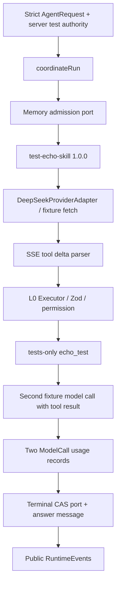

# UPLY Teaching Agent — Build Stage 0B Foundation

## 1. Executive Summary

**CONDITIONAL GO。Core Foundation 在 Stage 0B 的限定范围内 READY；可以进入 Stage 1 的实现准备，不能直接开放学生产品路径。**

本阶段建立了独立的 TypeScript 合同、严格公共请求解析、状态机、预算与取消基础、默认拒绝权限端口、精确版本 Registry、L0 Tool Executor、DeepSeek 原生 fetch Adapter、公共事件投影、内部 Trace/Usage 端口、Supabase 窄 Repository，以及五表和原子 RPC migration 源文件。

离线测试完成一次真实 Adapter 解析手写脱敏 SSE 的合成闭环：admission → 固定 Skill → Provider fixture → echo → Tool Result → 第二次模型 fixture → 最终回答 → 两条 ModelCall usage → terminal。32 项离线测试通过。隔离 PostgreSQL 内实际应用新 migration，8 组数据库场景通过，包含并发 admission、幂等冲突、complete/cancel 竞争、fencing、租户拒绝、append-only 和未知 usage。

**这些是 Foundation 验证，不是生产验收。** 没有新公开 Route、没有学生／教师 UI、没有业务 Tool、没有 Teaching Skill、没有读取真实教学数据、没有改旧 Assistant 或线上 Provider。Migration 只在本次创建并删除的临时数据库执行，未应用到现有开发或生产数据库。

剩余 Student MVP Gate 包括：真实部署 NDJSON、端到端取消、服务端 verified_selection validator、两只真实安全 Read Ports、授权 fixtures、目标 Supabase 集成以及完整 45 秒路径。

## 2. Inputs & Baseline

输入为 [Current-State Audit][AUDIT]、[Architecture v1][ARCH] 和 [Stage 0A Verification][STAGE0A]。架构是设计基线，Stage 0A 的现场证据优先；实现对照 TypeScript Contracts、Data Architecture、权限和 Runtime 边界。本报告不修改三份输入文档。

| 项目 | 基线 |
|---|---|
| Git HEAD | `b1672390ae96357a2143358235cc10edeff8d488` |
| 工作目录 | `/home/yangzhen/projects/my-lms-system` |
| 实施日期 | 2026-09-13 起，当前任务会话内完成 |
| Node / Next | Node v26.5.0 / Next 16.2.10 |
| 宿主依据 | Stage 0A 确认的 Next Node production；Core 不依赖 PM2 |
| Provider 基线 | deepseek-v4-flash；thinking disabled；来自 Stage 0A 合成 live test |
| 依赖 | 现有 Zod、native fetch、Node crypto、Supabase client；没有安装或升级包 |
| 开始既有文件内容基线 | 2661 个普通文件；SHA-256 `a25f2d7ea0051e1344957ed670a5e0ae076e60f82d57cd60fdbdb4b5fe658230` |

开始时已有 6 个业务文件修改：growth-toolbox 三个文件、Learning Agent Script Studio 三个文件，共 80 insertions / 89 deletions；另有未跟踪的其他任务文档、证据和脚本。本任务保留它们，没有顺手修正或格式化。

开工前的全项目 TypeScript 检查已失败，错误来自被 tsconfig 扫入的 `docs/evidence/.../baseline` 和 `candidate` 源码副本。结束检查同样为这一既有问题类别；新增 Foundation 单独编译通过，全项目诊断中没有新增目录错误。

## 3. Files Changed

全部为新增文件；没有修改既有业务文件、旧 migration、package.json、lockfile、.env 或三个输入报告。

| 文件 | 作用 |
|---|---|
| [agent-core/index.ts][PUBLICINDEX] | 唯一默认 barrel，仅公开浏览器合同 |
| [contracts/public.ts][PUBLIC] | 严格 AgentRequest/ScopeLocator schema、公共事件和安全错误码 |
| [contracts/server.ts][SERVER] | RunAuthority、Run/Profile/Budget、Context/Provenance、Prompt/Context ports |
| [contracts/provider.ts][PROVIDERCONTRACT] | ModelRef、消息、Tool Call、Usage、Provider event/adapter 合同 |
| [contracts/tool.ts][TOOLCONTRACT] | ToolDefinition、独立 validator、ToolResult 和 Executor/Registry 接口 |
| [contracts/skill.ts][SKILLCONTRACT] | SkillDefinition、精确版本 Registry 接口 |
| [runtime/errors.ts][ERRORS] | CoreError、允许的公共错误码、安全消息 |
| [runtime/run-state.ts][STATE] | 状态转换纯函数及 terminal 不可重开规则 |
| [runtime/run-budget.ts][BUDGET] | 固定预算验证及不可变计数消费 |
| [runtime/deadline.ts][DEADLINE] | AbortSignal、剩余 deadline、异步等待取消 |
| [runtime/run-coordinator.ts][COORDINATOR] | 依赖端口的最小 bounded Run 编排 |
| [permissions/permission-policy.ts][POLICY] | 默认拒绝及 scope/policy/expiry 复核 |
| [permissions/tool-policy.ts][TOOLPOLICY] | Profile、Skill、Permission 的 Tool 交集 |
| [skills/registry.ts][SKILLREGISTRY] | 精确版本读取、disabled 拒绝、空 production Registry |
| [tools/registry.ts][TOOLREGISTRY] | name+version 注册与查找，生产为空 |
| [tools/executor.ts][EXECUTOR] | L0、输入校验、权限重查、deadline 和输出校验 |
| [providers/deepseek/capabilities.ts][CAPS] | 仅对已验证 provider/model/config 声明能力 |
| [providers/deepseek/adapter.ts][ADAPTER] | 原生 fetch、固定 thinking disabled、协议映射和错误归一化 |
| [providers/deepseek/stream-parser.ts][PARSER] | SSE/UTF-8 分块解析与 Tool arguments 重组 |
| [observability/events.ts][EVENTS] | 单调 seq factory、公共字段投影和 trace→public 限定映射 |
| [observability/trace.ts][TRACE] | metadata-only TraceSink、no-op sink/logger |
| [conversation/scope.ts][SCOPE] | 请求规范化摘要、scope 对照、稳定新 conversation locator |
| [persistence/ports.ts][PORTS] | Run/Conversation/Message/Definition/Event/Usage 窄接口 |
| [persistence/supabase/repositories.ts][REPOSITORIES] | 绑定 actor/tenant/scope 的 Supabase adapter |
| [teaching-agent/server/domain-ports/index.ts][DOMAIN] | 两只未来学生 Read Port 的纯接口及 verified_selection 语义 |
| [202609130001_agent_core_foundation.sql][SQL] | 新五表、nullable usage 扩展、事务 RPC、约束与 grants |
| [agent-core-foundation.test.mjs][UNIT] | 离线基础、Provider fixture、隐私、权限、合成闭环测试 |
| [agent-core-database.test.mjs][DBTEST] | 默认 skip、显式 opt-in 的独立 PostgreSQL 集成测试 |
| [fixtures/agent-core/foundation.mjs][FIXTURE] | 仅测试使用的 Skill、echo、MemoryPersistence 和 SSE 数据 |
| [fixtures/agent-core/contracts.typecheck.ts][TYPEFIXTURE] | 公共 barrel 禁止 server 类型导出的负向编译检查 |
| 本报告 | 实现、验证、偏离及后续 Gate 记录 |

## 4. Core Contracts

[公共合同][PUBLIC] 接受 protocolVersion、agentCode、message、idempotencyKey、conversation locator、scope locator 和有限 client hints。所有对象使用 strict schema；顶层或 clientContext 携带 tenantId、role、permissions、systemPrompt、endpoint 等额外字段都会被拒绝。请求只表达用户意图与待核验定位，不承载可信身份。

[服务端合同][SERVER] 明确 actor、tenant、membershipRole、app、scope、policyVersion、issuedAt、expiresAt。注释明确 interface 不产生权限；合法对象仍必须由已验证服务端 intake 和领域授权产生。当前阶段没有把 `getAuthContext` 接到新产品 Route，也没有提供可供浏览器 mint authority 的 API。

AgentRun 固定 definitionVersion、skillRef、actor/tenant/scope、stateVersion、fencingToken、executionAttempt、lease、deadline 和预算。AgentProfile 固定 Prompt、Context、模型配置、Policy、允许的 Skill/Tool 版本。CoreContext 仅表达通用值及来源，没有韩语课程表字段。

ProviderUsage 为判别联合：unknown 没有 token 字段；reported/estimated 才包含 input/output/total。Tool arguments 保留完整原始字符串交给 Executor parse + schema validate，不能把 Provider 的 JSON 解析成功当成可执行授权。

## 5. Public / Server Boundary

默认 [index.ts][PUBLICINDEX] 仅导出公共请求、事件和安全类型。RunAuthority、ToolExecutionContext、Provider 实现和配置、Repository 不在这个 barrel 中。

除了 index 和 public contract，新增 Core 模块均包含 `import 'server-only'`；Teaching domain port 模块同样标记。按照安装版本的 Next 文档，这个 marker 会在 Client Component 导入服务端实现时产生构建错误，不需要额外安装包。[Next 本地边界文档][NEXTBOUNDARY]

验证包括：公共 barrel 的负向 TypeScript imports、所有服务端文件的 marker 检查、公共文件无传递 server import、Core 无旧教学 Runtime/React 依赖。Node 单元测试只在测试进程将 Next marker 映射为其空 server 实现，复用仓库已有 fixture hook。

**验证限制：** 没有创建 Client Component，也没有执行整站 Next production build。Type-only 深层导入会被 TypeScript 擦除，不应被描述为运行时安全能力；安全边界是实际服务端实现、受控入口、严格解析与权限检查，不能只靠类型隐藏。

## 6. Run State Machine

[run-state.ts][STATE] 实现 `isTerminalRunStatus`、`assertRunTransition` 和不可变 `transitionRun`。

| 当前状态 | 允许后继 |
|---|---|
| created | running、failed、cancelled |
| running | waiting_tool、completed、failed、cancelled |
| waiting_tool | running、failed、cancelled |
| completed / failed / cancelled | 无 |
| waiting_confirmation | 仅保留类型；无可执行转换 |

SQL transition RPC 使用相同可执行状态规则。terminal 已写入、expected status/version 不符、fence 不符都会拒绝，不会把 cancelled 重开成 running。waiting_confirmation 没有落入数据库可执行状态，也不产生 confirmation flow。

## 7. Budget / Abort / Deadline

[RunBudget][BUDGET] 包含模型／工具调用上限、单调用输入输出上限、reservedTokens、used counters、deadline。缺少有效正数预算、已消耗达到上限、reservation 不足都 fail closed。Coordinator 在每次 Provider/Tool 动作前消费对应计数，没有自动 retry。

[deadline helper][DEADLINE] 使用真实 AbortSignal，先拒绝已 abort 或已过期调用，再将调用方取消与剩余 deadline 合成；Provider 的 timeout 不超过剩余时间。Context、Prompt 和工具等待支持 signal race；底层实现仍需合作式取消，JavaScript Promise 不能强制停止任意忽略 signal 的外部工作。

Coordinator 的新 Run deadline 为最多 45 秒且不晚于 authority expiry；模型调用前再次检查。Adapter 对 body 读取的超时、取消和未知 usage 已测试。客户端 emit callback 抛错不会阻止 terminal persistence。

输入 token 限制目前使用序列化请求 UTF-8 bytes + 固定协议余量的保守预检，**不是精确 tokenizer，也不写成 reported usage**。实际计量仍使用 Provider usage；精确 tokenizer、复杂定价和跨用户额度账本不属于本阶段。

**限制：** admission RPC 的网络往返没有被伪装成可回滚的客户端 abort；HTTP 中止不能证明数据库事务没提交。幂等重试返回同一 Run，禁止因此重复模型调用。生产完整 45 秒路径仍需 Stage 1 验收。

## 8. Permission Foundation

[PermissionPolicy][POLICY] 默认 deny。allow 还要匹配 authority scope、policy name/version 及有效期；confirm 在 0B 中不会被当成 allow。

Core 只知道“是否允许这个 Run／固定版本 Tool”，不知道 teacher assignment、chapter unlock、grade 或教学数据库结构。Teaching Policy Adapter 和真实资源授权是后续实现。

[Tool policy][TOOLPOLICY] 实现 Profile allowed refs ∩ Skill allowed refs ∩ Permission allows，再过滤 disabled 和 risk≠0。实际 Executor 再查询 Registry 和重查 Permission，模型不能通过返回未暴露的名字获得执行能力。

Profile A/B、Skill B、Permission B/C 最终只有 B 的测试已通过。相同 Provider Tool name 在一个 Run 中不同时暴露两个版本，避免 name-only 协议无法确定版本。

## 9. Skill Registry Foundation

[Skill Registry][SKILLREGISTRY] 按 name+exact version 查找，没有 latest fallback。重复版本注册拒绝，missing/disabled Skill 不能开始执行。

Run 固定本次 skillRef，profile 固定允许的 Skill versions。`test-echo-skill@1.0.0` 仅存在测试 fixture。productionSkillRegistry 初始化为空。

没有正式 Teaching procedure、学生解释 Skill、教师诊断 Skill 或自动 Skill router。本阶段 Registry 只解决版本查找与执行资格基础，不冒充专业教学工作流已经实现。

## 10. Tool Registry / Executor Foundation

[Tool Registry][TOOLREGISTRY] 按 name+version 绑定编译期 Executor。生产 Registry 为空；唯一有实现的 echo executor 位于 tests。

[Executor][EXECUTOR] 顺序为：检查 abort/deadline → 确认实际暴露且注册的 enabled L0 Tool → JSON.parse → Zod input validation → Permission 重查 → 执行 → deadline/输出 schema/结果大小检查。

unknown Tool、disabled、risk>0、额外／错误参数、deny/confirm、已取消和超时均不可触发测试工具副作用。失败读取只返回统一安全失败语义，不转发任意内部错误正文。

Provider JSON Schema 与可执行 Zod validator 为不同字段；没有动态 eval、MCP 或业务 DB client。未来 executor 只能经受控领域 port 获得数据；本阶段没有注册两只 Student Tool。

[领域合同][DOMAIN] 定义 CurrentLessonReadPort 和 TeachingStateReadPort，输入包含经核验 locator、expected revision、authority、execution signal；结果可以为 ok、partial、stale、not_found_or_not_visible、unavailable。StudentMvpSegmentBinding 只允许 verified_selection；verified_current 仅保留未来类型并标注未通过产品验证。

## 11. Provider Architecture

[DeepSeekProviderAdapter][ADAPTER] 只负责协议映射、fetch、stream、usage、request correlation ID、deadline 和错误。它不读取 Supabase，不选择 Skill，不执行 Tool，不写 Conversation，也不推进 Run 状态。

server-only 配置从服务端读取 `DEEPSEEK_API_KEY`；测试使用注入 fetch 和明确合成占位值，不读真实 key。Endpoint 固定为已验证官方地址，browser request 没有 endpoint 或 thinking 字段。

所有请求显式发送 `thinking: { type: 'disabled' }`。能力声明绑定 [provider/model/configVersion][CAPS]：`deepseek / deepseek-v4-flash / deepseek-tools-disabled-v1`。该组合 streaming/tools 为 supported；structured output、vision、audio 为 unverified。其他型号／配置也保持 unverified，Adapter 不静默放行。

Qwen 未注册，不存在假 parser 或绿色能力测试。没有新 SDK/framework，默认 retry 次数为 0。HTTP 非成功被归一为 PROVIDER_UNAVAILABLE，协议异常为 PROVIDER_PROTOCOL_ERROR；不把上游 response/error body 或 stack 发给客户端。

## 12. DeepSeek Protocol Verification

[SSE parser][PARSER] 支持任意网络 byte 分块、跨块 UTF-8、CRLF、多个 data event、Tool index/id/name/arguments 重组、late usage 和 `[DONE]`。arguments、buffer、整流大小均有限制。

Tool Call 只有在 finish reason、call ID 唯一性、完整 arguments JSON 和 `[DONE]` 满足后才输出 complete。中途断流、冲突 call ID、坏 JSON 不产生可执行 Tool Call；最后的业务 schema 仍由 Executor 验证。

| 受测内容 | 结果 |
|---|---|
| 单片／多片 arguments；每次只读 1 byte | PASS |
| Tool call ID 保留、finish_reason=tool_calls | PASS |
| 第二次 tool result 按相同 call ID 映射 | PASS |
| final text delta、stop、late reported usage | PASS |
| `[DONE]` 缺失、坏 JSON、conflicting ID、多个 choices | PASS：拒绝协议 |
| UTF-8 韩语分块 | PASS |
| 已 abort／已到期不发 fetch | PASS |
| pending body deadline、中途取消 | PASS；无 usage 时 unknown |
| reasoning_content 不进入 normalized event | PASS |
| 原始错误／私密字段不透传，429 无 retry | PASS |

Fixture 使用 Stage 0A 观察到的安全协议形状，ID 为 `test_call_001` 等合成值；没有保存真实 request ID、Provider 完整响应或凭证。本阶段 **live Provider 请求数为 0**，没有再次消耗账号额度。

Fixture 通过证明的是本 Adapter 的映射与解析；真实账号 + endpoint + model 的能力依据仍是 Stage 0A，不能将 mock 成功当新一轮 live 验证。

## 13. Runtime Event Protocol

[RuntimeEvent][PUBLIC] envelope 为 protocolVersion=1、runId、seq、at、type。factory 在一个执行实例内从 seq=1 单调增加；本阶段不提供断线续传／跨实例公共事件 replay 服务。

支持 run.started、run.status、tool.status、answer.delta、answer.final、run.completed、run.failed、run.cancelled。confirmation.required 仅保留类型，不产生业务 confirmation。

[publicPayload/projectTrace][EVENTS] 逐字段构造输出，没有 `{...traceEvent}` 透传。安全错误码也按 allowlist 归一，未知私有 code 被替换为 PERSISTENCE_FAILED，safeMessage 不读取内部异常正文。

公共事件不包含 tenant ID、原始 arguments、permission detail、Provider raw response 或 reasoning。测试将 fake private tenant、tool args、permission detail 和额外字段塞入内部数据，投影后均不出现。

Stage 0B 没有公开 NDJSON Route；事件是 callback/contract，尚未接浏览器 transport。

## 14. Observability & Usage

[TraceEvent/TraceSink][TRACE] 表达 Run、Context、Skill、ModelCall、ToolCall、Permission、Usage、Terminal 的内部事实；默认 sink/logger 是 no-op。事件采用安全 metadata 白名单，Context 记录 snapshot locator，不保存 resolved正文或模型 reasoning。

每次模型调用生成独立 UUID modelCallId，通过 UsageRepository 与 Run 关联；planning 和 final 独立记账。一次 assistant message 不再冒充一次模型调用。数据库 terminal RPC 自行原子追加终态事件。

| 场景 | 当前存储语义 |
|---|---|
| reported usage | model.usage RunEvent + 扩展 ai_token_usage，一次原子 RPC |
| estimated usage | 合同／SQL支持显式 status；没有生产估算算法 |
| unknown usage | 仅 model.usage RunEvent，`{status:'unknown'}`；没有数字字段 |
| 同 modelCallId 重复记录相同内容 | 返回既有事实，不重复写 token 行 |
| 同 modelCallId 内容不一致 | IDEMPOTENCY_CONFLICT |

现有 token 列 NOT NULL 是保留旧写入语义的约束，因此 unknown 不写入一行假零。汇总完整性必须结合 model.usage 事件判断，仅聚合 ai_token_usage 不能声称包含所有取消调用。见第 22 节偏离记录。

没有硬编码价格或新 tracing SaaS；cost、price version、currency、Provider 取消后的远端费用对账均 deferred。

## 15. Persistence Architecture

[Ports][PORTS] 是 Runtime 的唯一持久化依赖：admitRun、getRun、transitionRun、appendRunEvent、persistUsage，另有 Conversation/Message/Definition 读取接口。Coordinator 不创建 Supabase client，也没有泛型 query(table) 能力。

[SupabaseAgentRepositories][REPOSITORIES] 由服务端绑定 client 和已验证 authority，方法内固定 tenant/actor/scope，验证返回的 Run ownership，并对 published manifest 做 strict Zod parsing。原始 DB error 不进入公共消息。

Repository 本身不是教学权限系统：它不判断 enrollment、课程发布可见性或教师 roster。构造前必须完成可信 intake/领域 scope 授权；新产品 Composition Root 尚未接入。

对新 conversation，服务端根据 tenant、actor、agentCode、scopeRef、idempotencyKey 派生稳定 UUID，使没有 conversation locator 的重复请求在跨实例情况下也定位到同一创建事务。规范化 digest 在服务端计算，浏览器不可直接提交可信 digest。

合成 MemoryPersistence 只在 tests 中实现端口，测试合同与 Coordinator；其同步临界区不作为 Postgres 原子性证据。真正数据库结果来自独立的 Docker/Postgres 测试。

## 16. Database Foundation

[Migration][SQL] 新增五个逻辑表：

| 表 | 关键事实 |
|---|---|
| agent_definition_versions | tenant、actor、agent/version、published manifest；包含 Prompt/Context/Skill/Tool/Policy/Model 配置版本；不可 update/delete |
| agent_conversations | tenant、actor、agentCode、app、scopeKind/ref、status |
| agent_messages | conversation、run、user/assistant role、content、state、origin、source refs；没有 tool role |
| agent_runs | input message、definition/skill、scope、status、digest、budget/deadline、lease/version/fence、retry link、context metadata、terminal reason |
| agent_run_events | append-only、单 Run seq、kind、ModelCall/ToolCall/SkillRun 关联、安全 metadata |

复合外键约束 Run/Message/Event 的 tenant+actor 归属；Run 与 Conversation 一致。Run/inputMessage 循环外键以 deferred constraints 支持同一 admission 事务。一个 Run 最多一条 user 和一条 assistant message。

`ai_token_usage` 只增加 nullable run_id、model_call_id、attempt_index、usage_status、duration_ms 及关联唯一索引；没有改旧计数字段必填、没有回填旧行。旧行继续无 Run 关联，不能从时间近似生成假 trace。

新五表开启 RLS，撤销 public/anon/authenticated 的写入；service_role 对 Run/Message/Event 仅有 select，写入必须经过固定 search_path 的 SECURITY DEFINER RPC。Definition 的 insert 是服务端控制面能力，trigger 校验 active creator membership、manifest版本对应和允许字段；published 定义直接不可变。没有创建管理 UI。

usage 的新增关联行对 browser roles 采用 restrictive policy，不能借旧允许策略写内部 Run usage；旧 run_id=null 数据不增加新的业务必填要求。

**执行状态：**

- 现有开发数据库：MIGRATION NOT APPLIED。
- 生产数据库：MIGRATION NOT APPLIED。
- 本任务独立 tmpfs PostgreSQL：实际 apply 和集成测试 PASS；容器已删除。

隔离数据库只 bootstrap 必要的合成 auth/users、profiles、tenant/membership、旧 usage 结构，再执行本 migration；**没有重放仓库全部旧 migrations，没有验证目标 Supabase 的全部现存 trigger/policy 组合**。

## 17. Atomic Run Admission

`admit_agent_run_v1` 在一个事务中执行 active actor/tenant membership guard、conversation scope/ownership 校验、幂等检查、active-run 排他、published definition/budget 检查、conversation（如需）/input message/Run 创建和 reservation metadata 初始化。

使用 conversation transaction advisory lock，覆盖首次 conversation 创建；已有 conversation 同时 FOR UPDATE。partial unique index 进一步保证同一 conversation 最多一个 created/running/waiting_tool Run，不依赖应用进程内 mutex。

同 actor/conversation/key + 相同 normalized digest 返回同一 Run；不同 digest 报 IDEMPOTENCY_CONFLICT。检查发生在重复模型调用之前，Coordinator 看到 replayed 就返回，不继续 Provider。

预算上限来自 immutable published manifest，RPC 要求 admission budget 与其一致、used=0、reservation 足够、deadline 不超过 45 秒。不存在预算定义则拒绝，不是 unlimited fail-open。

本阶段 reservation 是 Run-level metadata，不是租户财务额度账本。单 conversation 并发和各 Run 上限已实现；跨 conversation 的全局费用额度、动态定价和账单清算 deferred。

## 18. Terminal CAS / Cancellation

`transition_agent_run_v1` 锁定绑定 owner 的 Run，校验 expected status、state_version、fencing_token；合法状态转换、预算只增不降及 deadline/lease 条件满足后才写入。

completed/failed/cancelled 只能一个赢。最终／部分 assistant message 与 terminal event 在同一事务写入，不会先公开 completed 再尝试补状态。terminal 后再次转换拒绝。

lease expiry 或 membership 撤销后不能继续 running/completed。为避免截止后永远留在 active，绑定原 actor/tenant/fence/version 的 service-only fail/cancel 和已开始调用的 usage 记录允许停止清理；它们不能启动新模型、读领域数据或修改其他 owner 的 Run。

本阶段没有 takeover/recovery worker，没有 lease renewal 或重新开放 terminal 的路径。旧 fence/version 会被拒绝；未来若增加接管，必须原子更新 execution attempt/fence 并重新验收。当前不把这些字段描述为已实现完整 crash recovery。

公开连接断开不会取消必要的 terminal 落库尝试；如果 CAS 或 persistence 失败，Coordinator 抛 PERSISTENCE_FAILED，不发送虚假的成功终态。跨实例 loser 的公共 replay/UI 行为留给后续 transport。

## 19. Synthetic End-to-End Foundation Test

合成测试的实际关系如下，没有产品 Route或真实教学数据：



测试固定 `test-agent@1.0.0`、`test-echo-skill@1.0.0`，两个模型请求都显式 thinking disabled。首次返回分片 tool arguments，Executor 验证并执行 echo；第二次请求保存原 call ID 的 tool result，最终回答为合成预期。

断言包括一次工具执行、恰好两次模型请求、两个不同 ModelCall ID、usage 分别保存、单调 public seq、final message 和 completed。重复同请求不增加模型请求。另一条测试在客户端断开时仍写 cancelled 与 unknown usage。

没有 Supabase 真实教学表读取；SQL integration 另行测试实际事务，不能把这个 MemoryPersistence 闭环称为“浏览器到生产数据库端到端”。

## 20. Tests

| 检查 | 命令／方法 | 结果 |
|---|---|---|
| 离线 Foundation | `node --experimental-strip-types --test tests/agent-core-foundation.test.mjs tests/agent-core-database.test.mjs` | PASS：32 passed，数据库 opt-in suite 默认 1 skipped |
| 隔离 PostgreSQL | `RUN_AGENT_ISOLATED_DB_TESTS=1 node --test tests/agent-core-database.test.mjs` | PASS：8 组场景；Node runner 含父 test 共 9 passed |
| 新增 TypeScript | 当前 TypeScript CLI，strict、项目同等 ES2017/esnext+dom/bundler、noEmit，覆盖新增 26 个 TS 文件 | PASS；包括负向 public export 类型测试 |
| 目标 lint | `node node_modules/eslint/bin/eslint.js src/features/agent-core src/features/teaching-agent/server/domain-ports tests/agent-core-foundation.test.mjs tests/agent-core-database.test.mjs tests/fixtures/agent-core` | PASS |
| 全项目 TypeScript | `npm run typecheck -- --incremental false` | FAIL：397 条既有 docs/evidence 诊断；Stage 0B 新目录 0 条 |
| Git whitespace | `git diff --check`，并检查所有新增文件 | PASS |
| 非本任务文件摘要 | 与开始的 2661 文件聚合 SHA-256 比较 | 一致；既有业务 diff 保留 |

新增 TypeScript 可复现命令：

```bash
node node_modules/typescript/bin/tsc --noEmit --strict --skipLibCheck \
  --target es2017 --lib esnext,dom --module esnext --moduleResolution bundler \
  --allowImportingTsExtensions \
  src/features/agent-core/runtime/run-coordinator.ts \
  src/features/agent-core/persistence/supabase/repositories.ts \
  src/features/agent-core/providers/deepseek/adapter.ts \
  src/features/teaching-agent/server/domain-ports/index.ts \
  tests/fixtures/agent-core/contracts.typecheck.ts
```

数据库测试自建 `uply-agent-0b-test-<UUID>` 容器，使用机器已有 PostgreSQL 17.6.1.141 镜像、`--pull=never`、`--network none`、readonly rootfs、`/tmp` tmpfs、无 host bind、无 published port。initdb 使用纯合成库，通过容器内 Unix socket psql；finally 只删除自己创建的容器，结束无残留。

数据库场景：同 key 并发只建一个 Run/input；不同 key 同 conversation 只有一个 active；same key different digest 拒绝；complete/cancel 单赢家；旧 version/fence 拒绝；tenant/scope/budget 拒绝；事件和定义不可修改；browser 不能 insert 或执行 RPC；lease 到期／membership 撤销后停止清理；reported usage 幂等，unknown 不写零 token 行。

Not Tested：真实 Supabase HTTP/PostgREST Repository 端到端、全部旧 migrations 组合、production build/部署、真实浏览器/代理、真实业务权限、live Provider、教学质量、负载 p95。本阶段没有把未执行项写成 PASS。

Node strip-types 的 MODULE_TYPELESS_PACKAGE_JSON warning 属于当前仓库 Node 加载方式；没有为消除 warning 改 package.json。

## 21. Security Review

| 边界 | 实现／验证 | 剩余限制 |
|---|---|---|
| Browser authority | strict request；server-only authority；公共 barrel 负向类型测试 | 真正 Next auth Composition Root 是 Stage 1 |
| Tenant / actor | Repository 绑定、DB owner 复合外键、active membership guard | Teaching resource/app/enrollment 策略未实现 |
| Tool exposure | Profile/Skill/Permission 交集，执行前重查 | 真实领域 Tool 尚未注册 |
| Risk | 仅 risk=0；其他等级拒绝 | 写入／confirmation workflow deferred |
| Arguments | JSON parse + 独立 Zod validator | JSON Schema 与 validator 一致性由注册方及测试维护 |
| Secrets | key 仅 server getter；fixtures 全为合成；没有读取线上 Prompt | 后续配置发布仍须保持 manifest 无 secret |
| Event privacy | 字段白名单、safe code/message、reasoning 字段丢弃 | 普通模型答案仍需后续产品输出策略 |
| Database direct writes | revoke/grants + RLS；内部写走 service-only RPC | service_role 不能替代领域权限；DB owner 不在威胁模型内 |
| Atomicity | 锁、unique、CAS、fence、terminal+message 同事务 | takeover、租户全局额度和目标部署验收 deferred |
| Existing classroom | 零现有业务导入／改动；空 production registries | 未重跑整套课堂 E2E；保留文件内容与依赖边界证据 |

没有日志默认记录学生正文、Prompt、Tool result 或完整 Provider error。没有 chain-of-thought persistence。没有 secret 进入新增源码、合成 fixture 或报告；未读取 .env 来做这轮测试。

## 22. Architecture Deviations

### D1 — unknown usage 与旧 token 表兼容

- Original Decision：ai_token_usage EXTEND，支持 per-ModelCall usage status。
- Observed Constraint：旧 input/output/total token 列 NOT NULL 默认 0；任务要求不能把 unknown 变 0，且不能改变旧表写入语义。
- Implemented Decision：reported/estimated 写扩展 token 表及 model.usage event；unknown 只写 append-only model.usage event，无数字字段。
- Reason：保持旧写入兼容，同时不制造计量事实；没有增加第六张 usage 表。
- Impact：完整性查询必须结合 RunEvent；旧 token 表单独汇总不代表所有调用。取消后精确费用仍未知。

### D2 — Foundation 的公共事件精简

- Original Decision：架构示例含 assistantMessageId、profileLabel、带 messageId 的 answer deltas 等展示字段。
- Observed Constraint：0B 无 UI，没有提前创建 pending assistant message；最终 message 在 terminal RPC 原子写入。
- Implemented Decision：v1 基础事件以 runId/seq 关联，started 提供 conversationId，answer 事件提供文本，保留所需全部事件种类。
- Reason：不为了显示字段提前扩大产品状态模型。
- Impact：Stage 1 若需要 messageId/ref 和断线 replay，需明确扩展 transport 合同；不能把当前 callback 当已验收产品协议。

### D3 — 预算与接管简化

- Original Decision：架构长期方向包括聚合 reservation、lease/fence、恢复和跨实例治理。
- Observed Constraint：Stage 0B 明确只要求 Run-level budget metadata 和最小 CAS，禁止扩展复杂账单系统。
- Implemented Decision：原子 reservation metadata、同 conversation 单 active、固定 fence/version、截止后 stop cleanup；不实现自动接管、全局账本或 replay workers。
- Reason：以已测原子操作形成最小基础，不声明不存在的恢复能力。
- Impact：跨 conversation 总额度和 crash recovery 仍需后续工作；过期 active Run 不会被静默重放。

### D4 — Context 与输入预算

- Original Decision：完整 TeachingContext、精细 token window 和领域 resolver。
- Observed Constraint：本阶段禁止真实教学读取；无新增 tokenizer dependency。
- Implemented Decision：CoreContext/Provenance + 两只领域 port 类型；input 使用保守 byte ceiling，不冒充 token usage。
- Reason：保持 Core 通用，推迟业务投影及精确 token 计数。
- Impact：Stage 1 必须补 context/schema/输出策略及真实工作量时限验收。

以上偏离均在本报告记录，原 Architecture v1 未被静默改写。

## 23. Remaining Student MVP Blockers

| Stage 0A 条件 | Stage 0B 后状态 | Stage 1 前／上线前仍需什么 |
|---|---|---|
| Provider Tool parser/adapter | RESOLVED：DeepSeek baseline + 离线协议测试 | Adapter 真实集成 smoke 可按需要执行；Qwen 仍 BLOCKED |
| Core 状态机、权限与 exact Registry | RESOLVED：限定 Foundation | Teaching Policy 与真实安全注册尚缺 |
| Run DB 并发／幂等／terminal CAS | RESOLVED：实际隔离 PostgreSQL | 目标 Supabase 全 schema 与 HTTP Repository 集成未验证；不得直接生产 apply |
| Foundation 中取消传播 | RESOLVED：Provider/Tool signal、deadline、终态测试 | UI→生产代理→Next→Core→Provider/Domain Port 整链未验收 |
| 生产完整 NDJSON | BLOCKED／未执行 | 正式 intake/transport 及安全已认证 fixture |
| verified_selection validator | 未实现 | 选句与 lesson/script/version/node/revision 的服务端核验及 stale 行为 |
| 两只真实 Read Ports | 未实现 | 最小字段、发布可见、enrollment、own session、无副作用实现 |
| 授权 fixtures | 未实现 | Student/Teacher/tenant/app/resource 正反向测试 |
| 45 秒完整路径 | PARTIAL | 真实但合成的 auth/context/read/persistence/stream/cancel 全过程 |
| Run/Call usage 与公共隐私基础 | RESOLVED：Foundation 测试 | 产品汇总、保留期限、取消未知用量和运维查询策略 |

没有新增真实 Student Tool、Teaching Skill 或 AI UI 来伪装这些 Gate 已解决。

## 24. Stage 1 Readiness Matrix

| 项目 | Readiness | 依据 |
|---|---|---|
| Core Contracts / pure state | READY | 独立编译与状态测试通过 |
| Server boundary / default deny / exact registries | READY | marker、export 合同、拒绝路径通过；生产为空 |
| DeepSeek baseline | READY | Stage 0A live 能力 + 本阶段 Adapter fixture；明确 thinking disabled |
| Persistence schema/RPC 源码 | READY | 实际隔离 PostgreSQL 验证通过，未部署 |
| 目标 Supabase 运行 | PARTIAL | 当前 Repository 窄适配已实现；真实 HTTP/全旧 schema 组合未测 |
| Usage/Trace 基础 | READY | 多 ModelCall、unknown 语义、隐私投影通过 |
| Next 可信产品 intake | PARTIAL | 旧 auth 基础存在；新入口未接入 |
| Public NDJSON 与端到端取消 | BLOCKED | 产品 transport 和代理测试未完成 |
| Student verified_selection | BLOCKED | 仅定义合同，没有 validator |
| 真实 Student Read Tools/Policies/Skills | BLOCKED | 明确 deferred，Stage 0B 不实现 |
| Worker / Qwen | BLOCKED | 未验证，非本阶段首版前提 |
| 完整项目 typecheck / production build | PARTIAL | Foundation 通过；既有证据副本错误未处理，未执行部署构建 |

READY 指可以作为下一阶段实施依赖，不表示该模块已进入生产。Student MVP 整体为 **CONDITIONAL**。

## 25. Final Recommendation

可以在以上边界上开始 **Build Stage 1 — Student AI Teacher MVP 的后续实现任务**，但不得跳过真实选句、领域只读与授权、目标数据库集成、生产流／取消和完整预算验收。当前交付是可测试 Foundation，不是学生产品上线许可。

最终范围核对：只新增本报告、Core/领域接口、新 migration 和 tests。非本任务的 2661 个文件聚合摘要与开工基线一致；旧 6 个业务 diff 仍为 80 insertions / 89 deletions。没有修改线上 Provider、没有改变旧 Assistant/Script Runtime、没有新增公开 Agent API、没有应用现有数据库 migration、没有真实 Student Tool 接入。临时数据库容器已清理。

**本任务停在 Stage 0B。**

[AUDIT]: /home/yangzhen/projects/my-lms-system/docs/assistant-current-state-audit.md
[ARCH]: /home/yangzhen/projects/my-lms-system/docs/teaching-agent-architecture-v1.md
[STAGE0A]: /home/yangzhen/projects/my-lms-system/docs/teaching-agent-stage-0a-verification.md
[PUBLICINDEX]: /home/yangzhen/projects/my-lms-system/src/features/agent-core/index.ts
[PUBLIC]: /home/yangzhen/projects/my-lms-system/src/features/agent-core/contracts/public.ts
[SERVER]: /home/yangzhen/projects/my-lms-system/src/features/agent-core/contracts/server.ts
[PROVIDERCONTRACT]: /home/yangzhen/projects/my-lms-system/src/features/agent-core/contracts/provider.ts
[TOOLCONTRACT]: /home/yangzhen/projects/my-lms-system/src/features/agent-core/contracts/tool.ts
[SKILLCONTRACT]: /home/yangzhen/projects/my-lms-system/src/features/agent-core/contracts/skill.ts
[ERRORS]: /home/yangzhen/projects/my-lms-system/src/features/agent-core/runtime/errors.ts
[STATE]: /home/yangzhen/projects/my-lms-system/src/features/agent-core/runtime/run-state.ts
[BUDGET]: /home/yangzhen/projects/my-lms-system/src/features/agent-core/runtime/run-budget.ts
[DEADLINE]: /home/yangzhen/projects/my-lms-system/src/features/agent-core/runtime/deadline.ts
[COORDINATOR]: /home/yangzhen/projects/my-lms-system/src/features/agent-core/runtime/run-coordinator.ts
[POLICY]: /home/yangzhen/projects/my-lms-system/src/features/agent-core/permissions/permission-policy.ts
[TOOLPOLICY]: /home/yangzhen/projects/my-lms-system/src/features/agent-core/permissions/tool-policy.ts
[SKILLREGISTRY]: /home/yangzhen/projects/my-lms-system/src/features/agent-core/skills/registry.ts
[TOOLREGISTRY]: /home/yangzhen/projects/my-lms-system/src/features/agent-core/tools/registry.ts
[EXECUTOR]: /home/yangzhen/projects/my-lms-system/src/features/agent-core/tools/executor.ts
[CAPS]: /home/yangzhen/projects/my-lms-system/src/features/agent-core/providers/deepseek/capabilities.ts
[ADAPTER]: /home/yangzhen/projects/my-lms-system/src/features/agent-core/providers/deepseek/adapter.ts
[PARSER]: /home/yangzhen/projects/my-lms-system/src/features/agent-core/providers/deepseek/stream-parser.ts
[EVENTS]: /home/yangzhen/projects/my-lms-system/src/features/agent-core/observability/events.ts
[TRACE]: /home/yangzhen/projects/my-lms-system/src/features/agent-core/observability/trace.ts
[SCOPE]: /home/yangzhen/projects/my-lms-system/src/features/agent-core/conversation/scope.ts
[PORTS]: /home/yangzhen/projects/my-lms-system/src/features/agent-core/persistence/ports.ts
[REPOSITORIES]: /home/yangzhen/projects/my-lms-system/src/features/agent-core/persistence/supabase/repositories.ts
[DOMAIN]: /home/yangzhen/projects/my-lms-system/src/features/teaching-agent/server/domain-ports/index.ts
[SQL]: /home/yangzhen/projects/my-lms-system/supabase/migrations/202609130001_agent_core_foundation.sql
[UNIT]: /home/yangzhen/projects/my-lms-system/tests/agent-core-foundation.test.mjs
[DBTEST]: /home/yangzhen/projects/my-lms-system/tests/agent-core-database.test.mjs
[FIXTURE]: /home/yangzhen/projects/my-lms-system/tests/fixtures/agent-core/foundation.mjs
[TYPEFIXTURE]: /home/yangzhen/projects/my-lms-system/tests/fixtures/agent-core/contracts.typecheck.ts
[NEXTBOUNDARY]: /home/yangzhen/projects/my-lms-system/node_modules/next/dist/docs/01-app/01-getting-started/05-server-and-client-components.md:555
