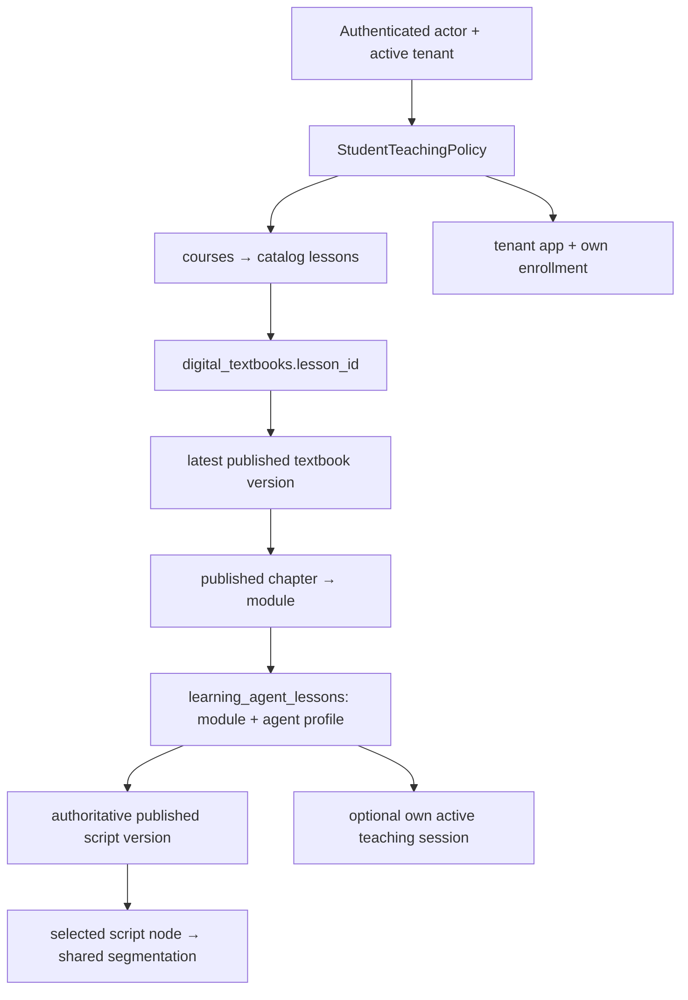

# UPLY Teaching Agent — Build Stage 1A Student Domain

## 1. Executive Summary

Overall: **CONDITIONAL GO**。Stage 1B: **CONDITIONAL**。

本阶段实现了 request-local、server-only 的学生领域组合入口：真实登录身份 → 学生权限和发布关系核验 → verified_selection → 两个纯读 Domain Port → 带来源的 CoreContext。没有 LLM、Tool 注册、Skill、公共 API 或学生 UI。

G-A1～G-A8 在本报告明确的 Student Korean MVP 范围内 PASS；G-A9 为 PARTIAL。真实 Supabase PostgREST/RLS/完整 schema 集成尚未验证，不能据此批准学生产品上线。测试使用真实 Supabase JS SDK、生产 repository、合成权限数据和一次性 PostgreSQL；HTTP 的 PostgREST 执行端由测试读适配器代替，不能称为目标 Supabase 端到端验收。

本阶段的可用课程范围有意收窄：韩语应用、`korean_course` 权限、VIP2/VIP3、有效 enrollment，以及无需读取前置成绩即可证明已解锁的课程/课时/关联章节。`previous_completed`、`prerequisite_completed` 等规则默认拒绝，即使学生实际上已完成前置内容也不会猜测放行。其他应用、试听、其他 profile access feature 尚未接入。

`verified_current = NOT PRODUCT VERIFIED`。保存的课堂游标只投影为 `last_saved_teaching_position`。

## 2. Inputs & Baseline

审阅输入：[Current-State Audit](assistant-current-state-audit.md)、[Architecture v1](teaching-agent-architecture-v1.md)、[Stage 0A](teaching-agent-stage-0a-verification.md)、[Stage 0B](teaching-agent-stage-0b-foundation.md)，并沿源码、SQL、真实调用关系核对。本阶段实施以源码/schema 为先，未把架构目标当作已实现事实。读取了本地 Next 文档的 Node runtime 和 server-only 安全指南。

审计日期：2026-09-14。HEAD：`b1672390ae96357a2143358235cc10edeff8d488`。

开始时已有 6 个 tracked 业务文件变更，合计 **80 insertions / 89 deletions**：growth-toolbox listing、table columns、table index，以及 Script Studio 的 ChapterReleaseCheckPanel、TeachingScriptNodeForm、TeachingScriptStudio。既有 untracked 文件也保留，包括 Stage 0B 文件、报告和其他任务证据。未提交、清理或覆盖这些内容。

开始时逐文件记录了 **2692 个已有普通文件**的 SHA-256。仅两个已有文件在本阶段授权范围内变化：Core provenance 合同和 Domain Port 合同。其他 **2690 个文件**逐文件摘要相同；按路径排序、拼接 `path + NUL + file SHA-256 bytes` 的汇总摘要，before/after 均为：

`9e9c74d06deab87c6520d0db28fb746fbe17144ea1db1f4417edbd6b5f9e0719`

这是工作树内容对比，不依赖 `git diff` 是否显示 untracked 文件。未读取 `.env` 值、真实学生行或生产 Provider；未执行生产/开发 migration。

## 3. Files Changed

下列 Teaching 文件均位于 `src/features/teaching-agent/server/`；本次新增 13 个实现文件、1 个测试文件和本报告，演进 2 个既有合同。

| 文件 | 变化 / 职责 |
|---|---|
| [selection/selection-types.ts](../src/features/teaching-agent/server/selection/selection-types.ts) | strict locator、server scope、verified binding |
| [selection/references.ts](../src/features/teaching-agent/server/selection/references.ts) | shared segmentation、版本和正文派生引用 |
| [selection/verify-student-selection.ts](../src/features/teaching-agent/server/selection/verify-student-selection.ts) | 选句验证、runtime-local binding、每次读取再核验 |
| [policies/access-rules.ts](../src/features/teaching-agent/server/policies/access-rules.ts) | enrollment、tenant visibility、保守解锁和学生 feature 规则 |
| [policies/student-teaching-policy.ts](../src/features/teaching-agent/server/policies/student-teaching-policy.ts) | 服务端身份与内容授权协调 |
| [repositories/contracts.ts](../src/features/teaching-agent/server/repositories/contracts.ts) | 窄领域读接口与内部记录 |
| [repositories/supabase-student-teaching-repository.ts](../src/features/teaching-agent/server/repositories/supabase-student-teaching-repository.ts) | user-scoped、固定列/过滤条件的 SELECT |
| [domain-ports/index.ts](../src/features/teaching-agent/server/domain-ports/index.ts) | 演进 0B 合同，保留原有 exports，新增 binding 与安全 projection |
| [domain-ports/current-lesson-read-port.ts](../src/features/teaching-agent/server/domain-ports/current-lesson-read-port.ts) | 已验证课文的有界投影 |
| [domain-ports/teaching-state-read-port.ts](../src/features/teaching-agent/server/domain-ports/teaching-state-read-port.ts) | 本人已保存课堂位置投影 |
| [context/student-teaching-context-resolver.ts](../src/features/teaching-agent/server/context/student-teaching-context-resolver.ts) | CoreContext 与绑定后的 Core ContextResolver adapter |
| [context/trace.ts](../src/features/teaching-agent/server/context/trace.ts) | metadata-only TeachingTraceSink 合同 |
| [composition/create-student-domain-runtime.ts](../src/features/teaching-agent/server/composition/create-student-domain-runtime.ts) | 纯读组合、deadline/abort，无 Provider |
| [composition/create-authenticated-student-domain.ts](../src/features/teaching-agent/server/composition/create-authenticated-student-domain.ts) | getAuthContext + 用户 SSR client 的生产组合入口 |
| [agent-core/contracts/server.ts](../src/features/agent-core/contracts/server.ts) | Provenance 仅增加 `trusted_server` |
| [tests/teaching-agent-student-domain.test.mjs](../tests/teaching-agent-student-domain.test.mjs) | 合成矩阵、真实 SDK 读路径、隔离 SQL、无副作用/边界测试 |
| 本报告 | 阶段交付记录 |

无新增表/migration、依赖、环境变量、Provider 文件、Tool/Skill 文件、Route 或 UI。

## 4. Student Teaching Scope

身份由 [getAuthContext](../src/lib/auth.ts) 的 `auth.getUser()` 和 active tenant resolution 提供；生产组合只取 `auth.user.id` 与 `auth.tenant.id`。每次领域读取再查询当前 profile、tenant_membership、tenant 与 enrollment，防止早先成功的 binding 继续使用已撤销权限。

`StudentTeachingScope` 包含 actorId、tenantId、appId、courseId、**catalog lessonId**、moduleId、textbookId、textbookVersionId、chapterId、**teachingLessonId**、agentProfileId、authoritative scriptVersionId、nodeId、segmentIndex、locale、可选 teachingSessionId、opaque scopeRef。它只供服务端授权使用，不能整个交给模型。

重要关系不是两个 lesson ID 相等，而是：

浏览器不能指定学生/租户身份、role、membership、permission 或发布状态；strict schema 拒绝这些额外字段。ID、locale、版本/ref 都是 locator，不是授权。binding 由 verifier 创建、冻结，并登记在该 runtime 的 WeakMap 中；JSON 复制或跨 runtime 传递不能直接成为有效能力。

## 5. Student Teaching Policy

`StudentTeachingPolicy.resolve` 调用固定的 `readAuthorizedContent` 和 `readOwnSession`。repository 内的查询同时执行授权过滤与关系核验，Domain Ports 每次重新调用 policy，不只依赖页面 Layout。

| 检查 | 实际规则 |
|---|---|
| 身份 | 真实 authenticated actor；tenant 不为空 |
| Profile | 必须存在且 status 明确为 active；拒绝平台 global_role 和明确的平台 legacy role |
| Tenant | tenant active；同 actor/tenant 的 active membership；角色严格 student |
| 会员能力 | 复用 `student-permissions.ts` 的 VIP2/VIP3 `korean_course` 判定，无 staff/inspector bypass |
| 应用 | course/textbook 必须同属已审计韩语 app；tenant_student_apps enabled + active |
| Enrollment | tenant + actor + app 精确过滤；active，starts_at 已到，ends_at 未到；畸形日期拒绝 |
| 目录可见性 | category 祖先、course、lesson 已发布；平台内容 tenant_id 为 null，租户内容属于 actor tenant |
| 解锁 | 明确未手工锁定；immediate/manual 或已到时间的 scheduled；其他规则拒绝 |
| 教材 | catalog lesson → textbook → 最新 published textbook version → published chapter → module 精确关联 |
| 章节目录 | 有 chapter_test_id 时，额外检查关联 course_chapter 属于 catalog lesson、已发布且可解锁 |
| Profile/脚本 | textbook 的 profile published；teaching lesson 对应 module/profile 且 published；唯一 published script |
| Session | ID + tenant + student + teaching lesson + agent profile + active；版本一致 |
| 选句 | authoritative script 下存在该 node；服务端正文和 pin 一致 |

查询错误/重复匹配不回退高权限 client。失败对外返回统一 safe status，不披露“别人的资源存在”。本路径不接受 platform owner 自动扮演租户学生。

## 6. Verified Selection Design

输入由 `studentSelectionLocatorSchema` 严格解析：catalog lessonId、moduleId、可选 teachingSessionId、scriptVersionId、nodeId、非负整数 segmentIndex、zh-CN/ko-KR、**expectedRevision 与 segmentRef**。selectedText 可选但立即丢弃，不参与授权、digest、context 或 trace。

本阶段选择让 revision/ref **必须提供**，否则只有 index 和当前版本 ID，无法在同一个已发布版本正文被编辑时证明用户选的是旧内容。`selectionPins` 可供未来已授权页面投影产生 pins；测试使用同一 policy 的合成服务端读取生成 pins。本阶段没有为 UI 暴露该机制或新增 endpoint。

`ta1:segment:<SHA-256>` 是新的逻辑引用，不是 DB 主键、签名或授权令牌。摘要包含 authoritative graph revision、script version、node、请求 locale、实际 authored locale、index 与服务端 canonical sentence。revision 同时包含版本链、节点内容/更新时间、标题/目标及 profile 关联。纯 index 不作为跨版本身份。

## 7. Selection Validation Implementation

实际流程：strict parse → server policy → 读取 authoritative published graph → shared segmentation → 校验请求 scriptVersionId、revision、segmentRef → 检查可选 session 版本 → 创建 frozen scope/authority/selection。

`VerifiedTeachingSelection` 输出 binding、lesson/module/script/node/segment refs、segmentIndex、locale/sourceLocale、服务端 originalSentence、contentRevision、sourceRefs 和 resolvedAt。

| 变化 | 结果 |
|---|---|
| v1 被 v2 替换、节点消失、index/正文/ref/locale 不匹配、session 仍绑定旧脚本 | `stale` |
| 发布撤销、enrollment 撤销、session 非本人/非 active、跨 tenant、关系不可见 | `not_found_or_not_visible` |
| 负数/小数 index、无效 locale、缺 pin、额外身份字段 | `not_found_or_not_visible`，不发 DB 请求 |
| DB 错误/无法可靠确认 | `unavailable`，不返回 DB 错误信息 |
| Abort/deadline | Core `RUN_CANCELLED` / `DEADLINE_EXCEEDED` |

未复用旧接口的 node_key 版本迁移；不存在“自动使用 v2 同 index”的路径。

分句直接调用 [teachingScriptSegments](../src/lib/teaching-video.ts)，没有复制 split 规则。repository 仅投影 `configuration.scriptSegments` 与 `teacherVideo.mode` 重建该函数所需配置。测试覆盖两种 locale、video/legacy、显式含段落分隔的编辑行、失配行及 fallback。video 模式随 UI 原规则使用中文 authored narration，并明确输出 sourceLocale，不声称是韩语正文。

## 8. CurrentLessonReadPort

`createCurrentLessonReadPort` 实现 0B 同名端口。输入保留 lessonRef/segmentRef/expectedRevision/segmentBinding，新增 runtime-issued binding；同时必须传同一 binding 的 RunAuthority。伪造 shape、JSON clone、错误 authority/ref 均拒绝。

每次 read 经 verifier.revalidate 重新走用户权限与 published graph；输出 lessonTitle、moduleTitle、originalSentence、objectives、contentVersion、segmentRef、locale/sourceLocale、omitted/truncated metadata，以及外层 sourceRevision/sources。

正文来自 `learning_agent_script_nodes.teacher_script`；目标来自 published `learning_agent_lessons.objectives`；标题来自 catalog lesson/module。当前没有单独确认可公开的 authored explanation 字段，因此不投影相邻节点或任意 configuration 字段。

## 9. TeachingStateReadPort

`createTeachingStateReadPort` 同样需要 issued binding、同一 authority、scope 对应 teachingSessionRef 和 expected content revision，可额外携带 expectedStateRevision。

只读 `learning_agent_sessions`，固定过滤本人、tenant、teaching lesson、agent profile、active。只选择 script_version_id/current_node_id/updated_at，以及 teaching_state 的 scriptSegmentNodeId、scriptSegmentIndex、teachingTurnNodeId、teachingTurnPhase。

输出 semantic=`last_saved_teaching_position`、opaque session/script/node/segment refs、有效 segment index、白名单 phase、stateRevision、active status 和 omissions。node 必须属于同一 published script；cursor node/index 不匹配、缺失或越界时返回 partial/null，phase 未确认则 unknown。不会像旧课堂推进逻辑那样 clamp index 或补成 0。

requiredTask summary 暂不提供，因为本阶段没有另行证明任意 task 配置都可公开。完整 state、grading keys、answer secrets 不进入 projection。completed/abandoned session 在当前 MVP 被拒绝，未实现历史课堂回顾。

## 10. Safe Projection & Secret Redaction

边界为：固定 SQL SELECT → 内部 domain record → allowlist Agent projection。Domain Port 不拿 generic admin client；模型候选 CoreContext 不包含内部 scope/identity DB IDs。

| 字段 | 上限 / 行为 |
|---|---|
| originalSentence | 4000 Unicode code points，超限 partial + truncatedFields |
| lessonTitle/moduleTitle | 各 200 code points |
| objectives | 最多 6 项，每项 400 code points |
| state | 固定字段，opaque refs 和白名单 phase |
| explanation/configuration/state blob/private metadata | 不输出；omittedFields 明示 |

截断作用于有类型的字符串字段，不截断序列化 JSON；下游必须尊重 partial，不能把截断课文声称为完整引文。合成 oversized context 的序列化体积断言小于 40 KB。

fixture 故意包含 correct_option_index、answer key、private remediation、未公开 feedback、完整 state grading sentinel；这些内容均未出现在 lesson/state/context/trace 结果中。该保证针对结构化私有字段，不意味着能自动识别教师错误地写入公开 teacher_script 正文的秘密。

## 11. Context Resolver

`StudentTeachingContextResolver.resolveBinding` 确定性调用两个 Port，返回 CoreContext；可选 session 缺省时明确省略 teachingState。任一所需 read stale/denied/unavailable 时，不把旧 lesson 与不可靠 state 拼成成功 context。

values 仅包含 self/student identity semantic、opaque course/lesson/module refs、verified selection 安全投影、可选 saved teaching state、snapshot/omission metadata。没有 prompt、用户提问正文、全 profile、教师信息、作业、历史成绩、完整 progress 或 Provider。

`forBinding` 是现有 Core `ContextResolver` 合同的 adapter；核对同一 authority、lesson/module/session scope 和可选 locale 后解析。该 Core 接口只能抛 CoreError，因此 stale 在此适配边界统一为安全 FORBIDDEN；领域端口保留更细的 `stale`。未来 Tool 应使用领域结果语义。

## 12. Provenance

| 字段 | provenance | 来源 / revision |
|---|---|---|
| identity semantic、snapshot metadata | `trusted_server` | 登录与 DB policy 通过后的服务端推导；identity source 记录 policy revision |
| course/lesson/module refs | `trusted_database` | 经过校验的发布关系；source refs 指向授权来源与内容版本 |
| selected text + content projection | `verified_selection` | 重新读取的 DB 正文，按 shared segmentation 和 pins 验证 |
| saved teaching state | `trusted_database` | 本人 active session 安全字段；独立 stateRevision |
| selectedText 等客户端 hint | 不进入 context | 丢弃，不升格为可信正文 |

每个关键 ContextValue 都有非空 sourceRefs，且可在 CoreContext.sources 中找到；sources 含 revision、scopeRef、retrievedAt、privacyClass、completeness。身份来源的 completeness 为 partial，表示只投影必要语义。

Core 只新增通用 `trusted_server` provenance 枚举项，避免将 snapshot ID/时间等服务端生成信息误标为数据库行。没有把 Teaching schema 或权限规则放进 Core。snapshot 在内存产生，没有写 agent_runs 或复制教材到持久表。

## 13. Supabase / Repository Integration

生产入口 `createAuthenticatedStudentDomain` 使用 auth.ts 返回的用户 SSR Supabase client，所有查询保留 RLS。没有 `service_role`、admin fallback、HTTP respond 调用或读写 RPC。

主要 schema 依据：

- [教材初始 schema](../supabase/migrations/202607310013_smart_digital_textbook_chapter_one.sql)：教材/version/chapter/module。
- [课程章节目录](../supabase/migrations/202608010002_course_catalog_workspace.sql)：course_chapters 与解锁字段。
- [应用域](../supabase/migrations/202608150005_student_application_domains.sql)、[enrollment](../supabase/migrations/202608150008_admin_application_access.sql)、[应用域硬化](../supabase/migrations/202608160001_application_domain_hardening.sql)。
- [原 teaching lesson/session](../supabase/migrations/202608260001_teaching_agent_phase_one.sql)、[多学科重命名/profile](../supabase/migrations/202608260002_multi_subject_learning_agent_runtime.sql)。
- [script versions/nodes](../supabase/migrations/202608260006_learning_agent_script_studio.sql)、[task events](../supabase/migrations/202608260008_learning_agent_student_task_events.sql)。

隔离集成使用已缓存 `public.ecr.aws/supabase/postgres:17.6.1.141`；每次随机命名、network none、只读 rootfs、tmpfs `/tmp`、无 host mount/端口、finally 删除本次容器。没有连接已有数据库，也未应用 0B migration。

测试 **23 张最小 fixture 表**，真实反映 repository 所选择的关键列类型、UUID、关系 FK、catalog visibility 约束、enrollment 时间约束、单一 published script unique index。未重放完整 migrations；未读取的教学写表仅保留 side-effect sentinel 所需列，省略生产无关列/trigger；不是完整真实 schema。

真实 Supabase SDK 生成 SELECT URL，测试 fetch 将 allowlist PostgREST query plan 映射到隔离 PostgreSQL SELECT。SQL 使用 `student_fixture` SELECT-only 角色、synthetic actor/tenant RLS 和 read-only transaction。该 bridge **不是 PostgREST server**；RLS 是显式最小 fixture policy，不代表目标所有 legacy policy 的叠加效果。

目标 Supabase：local schema compatibility 为已检查；真实 server metadata/HTTP、目标用户 JWT/RLS 整合 **Not tested / BLOCKED（未使用可证明的目标 fixture 身份）**。未读取任何真实学生行。合计 G-A9 **PARTIAL**。

## 14. Authorization Test Matrix

测试构造 tenant A/B、A1/A2/B1、两条独立课程/教材/脚本链、A1/A2/B1 session、v1 published/v2 draft。所有名称和正文均为合成数据。

| 分组 | 覆盖 | 结果 |
|---|---|---|
| 正向 | A1 selection/lesson/state/context；A2/B1 各自本人；合法 platform published content | PASS |
| 跨用户/租户 | A1→A2/B1 session、B course/module、错误 actor 与 tenant 组合 | PASS：统一不可见 |
| 伪造身份 | studentId/userId/tenantId/organizationId/role/membership/permissions/published 请求字段 | PASS：parse 拒绝，0 DB reads |
| 身份状态 | 未登录、tenant null、inactive/null profile、inactive tenant/membership | PASS |
| 角色 | teacher、tenant admin、platform owner、inspector、legacy operator、无 global_role 的 legacy platform owner | PASS：拒绝 |
| 能力 | VIP1、错误 access_feature/app、textbook app 不一致、disabled/hidden tenant app | PASS |
| Enrollment | missing、expired、paused、future start、畸形日期；binding 后撤销 | PASS |
| 发布 | category/course/lesson、textbook/version/chapter、agent profile、teaching lesson、script | PASS：不可见 |
| 关联 | module→chapter、textbook→catalog lesson、catalog lesson→course、session→owner/tenant/lesson/profile | PASS |
| 解锁 | manual lock、future scheduled、前置依赖、catalog chapter lock | PASS：不推断放行 |
| Session | completed 拒绝；cursor 缺失/错配 partial；state revision 改变 stale | PASS |
| 能力对象 | frozen scope、JSON clone、不同 authority、同 runtime 身份切换 | PASS |

内存矩阵故意没有额外 RLS 帮助，检验应用过滤/规则本身；隔离 SQL 另测真实角色、RLS、本人正向、跨人/跨租户拒绝、发布更新 stale 与撤销 enrollment。

## 15. Stale / Revision Tests

已覆盖 v1→v2、same-version 正文修改、节点删除/不存在、draft node/version、index 改变/越界、错误 locale、伪造 digest、session 旧脚本、node updated_at 改变、读取已颁发 binding 后发布新版本。均没有自动 remap。

stateRevision 基于安全 session 字段、已保存 node 和 content revision。只变 saved cursor 也可使 expectedStateRevision 失配；私有完整 state 不参与返回。若授权/发布关系本身不可见，则优先返回不可见而不是披露资源变化细节。

共享 segmentation equality 以同一 DB fixture 的原始 teacher_script/configuration 调用 UI 公用函数，与 repository 的最小配置重建结果逐一比对。

## 16. Side-Effect-Free Verification

静态检查所有新 server 文件：没有教学 insert/update/upsert/delete/rpc，没有 respond Route 或 resolveScriptStep 依赖；crypto.Hash.update 是摘要操作。实际 fixture transport 只接受 GET、无 request body、显式 SELECT 列；隔离读取角色没有写权限，并在 read-only transaction 中运行。

执行 Selection + Lesson Read + State Read + Context，以及跨用户/租户拒绝后，对全部 23 张表比较 row count 与按行排序的 JSON 内容 MD5。before/after 完全相同；整组结果的 SHA-256：

`e1cd192f2a77a96ca425aca82286ce13e897ce2e02d46d9ab688dc643195ecf1`

| 教学领域表 | 行数 | before = after 内容 MD5 |
|---|---:|---|
| learning_agent_sessions | 3 | `bce5c1625bd4625eccb46c6c37699697` |
| learning_agent_messages | 1 | `626785cb06e7a5c84625e5a69e2f7830` |
| learning_agent_node_attempts | 1 | `2b304f0a1c1413178c5464676a80cb86` |
| learning_agent_task_events | 1 | `e56ad7490612f269f281deff934d3e5d` |
| lesson_progress | 1 | `bbc465133fc00740d9dcdefe124f0695` |
| digital_textbook_node_progress | 1 | `6f13fe7e96331a7f430aef0f14f3421a` |

测试 bootstrap 写合成行；hash 测量结束后才修改一次性 fixture 以验证发布/stale/enrollment。被测 Domain Ports 从未写入。测试期间仅 in-memory trace/call list 增长。没有课堂推进、成绩、progress、completion 或 task event 语义变化。

## 17. Security Review

进行了针对新路径的源码复核和负向测试，没有让其他 agent 修改/审计，也没有攻击性测试。授权来自真实 getUser/tenant，request 只能定位；published source 与 own-session 独立检查；每个 Port 重做权限和内容核验；错误不携带 DB cause 或其他用户信息。

明确的剩余边界：

- 多次 Supabase SELECT 不是一个事务快照；在两次查询之间发生撤销/编辑时仍有普通 read-time race。每次调用重新检查、pin 不匹配拒绝，但没有声称实现跨 HTTP 查询的原子授权快照或即时撤销屏障。目标整合验收需包含并发发布/撤销场景。
- 审计的 production factory 必须 request-local 使用。WeakMap binding 不能被持久化/replay；未来请求需要重新解析授权，不能从 JSON 复原“可信”对象。
- 应用层测试通过不证明目标 RLS、旧 trigger 和 PostgREST cache 的实际组合。G-A9 尚未通过。
- 只支持本报告限定的韩语可独立证明解锁范围；更多课程需要补齐真实解锁证据，不能删除 deny 分支以图方便。
- 提供 TeachingTraceSink metadata 合同及合成 sink；未接入永久日志/完整 AI tracing 后端。未记录用户正文、selectedText 或完整 session state。

没有可见的结构化 answer secret 泄露路径；不把这一结论扩大成“所有现有课堂 API 都安全”。

## 18. Performance Smoke

**SMOKE ONLY**，单次本地样本，不是 median/p95、负载或生产网络 benchmark。

隔离 PostgreSQL 的 Selection + 两个 Port + Context 实测约 **5.9 秒**（最终验证样本 5900.4 ms），明显低于 45 秒预算。测试总时长约 15 秒，含容器 bootstrap、hash 与负向断言。记录的 167 次 SDK SELECT 包含 pin 生成和负向检查，不能全部算作单次 context 的查询数。

重复核验会增加串行数据库往返；实际目标延迟 Unknown。组合入口使用 Core deadline signal/withSignal，真实 Supabase query 绑定 AbortSignal；已测试提前取消、过期 deadline 和 in-flight auth 超时。未进行 LLM 完整路径测试。

## 19. Tests

| 检查 | 命令 / 结果 |
|---|---|
| Stage 1A 全测试含 isolated DB | `RUN_TEACHING_AGENT_ISOLATED_DB_TESTS=1 node --test tests/teaching-agent-student-domain.test.mjs`：75 PASS，0 FAIL |
| Core 回归 | `node --test tests/agent-core-foundation.test.mjs`：32 PASS |
| Target strict TS | `tsc --project /tmp/uply-stage1a-tsconfig.json`：PASS；extends 仓库配置、include Teaching server、incremental=false |
| Target ESLint | Teaching server、Core server contract、Stage1A test：PASS |
| 全仓 TS | `npm run typecheck -- --incremental false`：既有 397 条诊断，全部来自 docs/evidence 的 27 个文件；Teaching/Core 0 条 |
| 变更空白 | `git diff --check`，并单独检查本阶段 untracked 文件：PASS |
| 非授权文件保护 | 2690 个既有文件 hash 不变，tracked diff 仍 6 files / 80 insertions / 89 deletions |
| Provider/注册/API | Provider guard 计数 0；production Tool/Skill factories 仍无参数空注册；无 Agent Route |

临时 tsconfig 只用于验证，可复现为继承仓库 tsconfig，include 绝对路径 `src/features/teaching-agent/server/**/*.ts`，关闭 incremental，排除 node_modules/docs/evidence。它不是新增项目配置。Node 测试只在进程内将 server-only marker 映射到 Next 已安装的空 server implementation；生产源码保留所有 server-only imports。

未执行 target Supabase 真实 HTTP、真实用户行、live Provider、浏览器 UI、production build/deploy 或完整 migration replay。0B 数据库 migration 在本阶段仍未应用到开发/生产。

## 20. Gate Matrix

| Gate | 状态 | 证据与范围 |
|---|---|---|
| G-A1 verified_selection | **PASS** | 服务端正文/pins、shared segmentation、stale/篡改/越界测试 |
| G-A2 CurrentLessonReadPort | **PASS** | 真实 repository adapter、有界投影、每次重验；合成 SQL 通过 |
| G-A3 TeachingStateReadPort | **PASS** | 本人 active session、last_saved 语义、revision/partial |
| G-A4 Student Teaching Policy | **PASS** | auth/tenant/student/app/enrollment/published/relations；范围外课程 fail closed |
| G-A5 authorization fixtures | **PASS** | 两租户三学生、正反向矩阵、无真实个人数据 |
| G-A6 side-effect-free | **PASS** | SELECT-only、read-only role/transaction、23 表 hash 不变 |
| G-A7 safe projection | **PASS** | 私有 sentinel、字段白名单、大小限制、原始 ID 不入模型投影 |
| G-A8 provenance | **PASS** | 逐字段来源、引用闭合、content/state revisions、server metadata |
| G-A9 target Supabase compatibility | **PARTIAL** | 本地 schema 与隔离 SQL/SDK 通过；目标 PostgREST/RLS 整合未验证 |

A1～A8 没有 FAIL/BLOCKED；允许继续 Stage 1B 的后续开发，但受 A9 和明确的支持范围约束，阶段结论为 **CONDITIONAL GO**，不是上线授权。

## 21. Architecture Deviations

| 偏离 / 收窄 | 原因与影响 |
|---|---|
| expectedRevision + derived segmentRef 必填 | 防止同版本正文编辑时仅凭 index 无法检测 stale；未来 UI 需接服务端 pins |
| Core provenance 增 `trusted_server` | 正确表达身份语义/snapshot metadata；未改 Coordinator/Provider/Executor/Registry |
| Teaching-specific trace sink | 0B TraceEvent 不含 selection/domain status 元数据；避免把确定性读取伪装成 ToolCall |
| Port 输入增加 issued binding | 0B 只有 locator + authority shape，不能单独证明 verified selection；保留原 exports，无旧生产调用方需要迁移 |
| Korean full-access MVP，前置规则拒绝 | 不查询历史成绩、不猜测课程解锁；更严格可用性，不是完整课程覆盖 |
| Profile status 需显式 active | auth.ts 对 null legacy status 较宽松，新路径 fail closed |
| Session 仅 active；cursor 不 clamp | 不把历史 session 或缺失状态包装成视觉 current |
| 不投影 authoredExplanation/requiredTask | 没有确认独立公开、安全、稳定的字段来源，不扩展读取私有配置 |
| 无持久 context / runtime-local binding | 1A 只需安全纯读，不依赖 0B tables 已部署；后续请求重建授权 |

## 22. Legacy Issues Observed

只记录，没有修复：

- [learning-agent/respond](../src/app/api/learning-agent/respond/route.ts) 使用高权限读取和课堂状态写入，检查逻辑与 StudentAppRouteLayout enrollment/app gate 不完全相同；不能以旧 Route 的成功当新 Read Port 授权证据。
- 旧 respond 对 published script 变化可按 node_key 映射；该行为不满足 immutable verified selection，新路径没有调用它。
- [learning-agent-script-runtime](../src/lib/learning-agent-script-runtime.ts) 可补齐/clamp classroom cursor；该 cursor 本身不能证明当前显示/播放句子。
- catalog lesson 与 learning_agent_lesson 双重命名易混淆，旧接口中仅称 lessonId 容易掩盖资源链差异。
- published node 本身仍有更新时间与可编辑内容，不能只用 version UUID 代表正文不变；新路径增加内容摘要。
- 全仓 typecheck 的 docs/evidence 397 条诊断属于既有基线，本任务未修。

## 23. Remaining Stage 1B Blockers

**G-A1～G-A8 在声明范围内无剩余阻断。** Stage 1B 可以有条件接这些 Domain Ports，不能直接把未验证的 locator 当作 Tool 输入事实。

必须保留的条件与学生产品上线前要求：

1. G-A9：使用明确的非生产 fixture 身份，验证目标 Supabase schema、真实 PostgREST JSON 路径响应、用户 JWT/RLS、已有 policy/trigger 与并发发布/撤销；当前 BLOCKED 子项不能被此报告替代。
2. 未来页面投影需提供 server-generated revision/segment pins；当前没有 selection UI/API，此项按阶段留待后续，不能把客户端 selectedText 当替代。
3. 如果产品需要前置学习解锁课程、试听、其他应用/profile 或 completed session，必须补齐各自领域证据和授权矩阵；当前默认不可用。
4. 0B 继承的真实流 transport、部署取消传播、完整 Provider/Tool/token budget 路径与教学质量验收仍未由 1A 覆盖。

不在本阶段注册 Tool/Skill 或继续实现后续阶段。

## 24. Final Recommendation

**建议：CONDITIONAL GO；Stage 1B CONDITIONAL。** 当前可将已验证的 scope/selection 与两个无教学副作用的最小投影作为后续 Student Tools 的领域基础；目标 Supabase 集成和明确的课程支持限制仍须保留。

最终验收问题回答：

| 问题 | 回答 |
|---|---|
| 1. 谁解析 Student Agent Scope？ | 服务端 getAuthContext + StudentTeachingPolicy + user-scoped repository，沿真实发布关系解析 |
| 2. 浏览器能否指定 tenant/student identity？ | 不能；额外身份字段被 strict schema 拒绝 |
| 3. verified_selection 验证什么？ | 当前学生授权、发布关系、版本/node/locale/index、服务端正文及 pins、可选本人 session |
| 4. segmentRef 怎样绑定内容？ | 对 graph revision、version/node、locale、index、canonical server text 派生 SHA-256 |
| 5. 如何发现 stale？ | 每次读取重验 authoritative source，与固定 revision/ref 比对；不自动映射新版 |
| 6. Lesson Port 从哪里读？ | catalog lesson、published textbook/module/teaching lesson/script node 的窄 SELECT |
| 7. State Port 从哪里读？ | 自己 tenant/student/lesson/profile 下的 active learning_agent_sessions 及对应 published node |
| 8. 是否无教学副作用？ | 是；静态依赖检查、GET-only、SQL read-only 和 before/after hashes 均验证 |
| 9. 是否泄露 interaction answer secrets？ | 结构化私有字段未选入安全投影；sentinel 测试通过，公开正文误写秘密不在自动识别保证内 |
| 10. enrollment/tenant/own-session 是否服务端检查？ | 是，且 Port 每次重验；目标部署整合仍待 G-A9 |
| 11. Provider calls？ | **0** |
| 12. Production Tool Registry？ | **EMPTY** |
| 13. Production Skill Registry？ | **EMPTY** |
| 14. Stage 1B READY？ | **CONDITIONAL**：A1～A8 PASS，A9 PARTIAL；不代表产品已上线可用 |

Stage 1A 到此结束。
