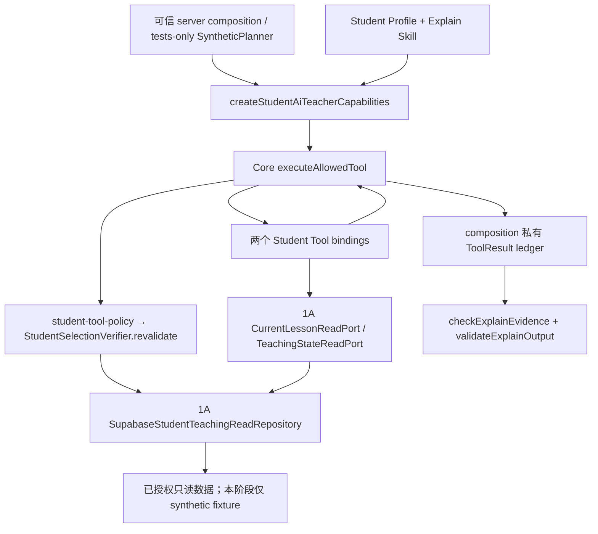

# UPLY Teaching Agent — Build Stage 1B Tools & Skills

## 1. Executive Summary

**Overall: CONDITIONAL GO。Stage 1C: CONDITIONAL。**

Stage 1B 已建立正式代码级 `student-ai-teacher@1.0.0` Profile、两个 L0 只读 Student Teaching Tools，以及 `explain-pinned-korean-segment@1.0.0` Skill。Student 专属 composition 通过现有 Core executor 调用 Stage 1A 的真实 Domain Ports；没有复制数据库查询。Generic Core production registries 仍为空。

Explain 的确定性检查要求本次 composition 私有执行记录中存在成功的 Lesson Tool evidence；缺失、错误 revision、错误 segment、stale、denied、unavailable 均不能通过。最终引用由服务端取自执行结果，模型不能提交 sourceRefs。Kim 只改变展示身份和表达风格。

**本阶段没有 Provider 调用、公开 Agent API、学生 UI 接线、教学领域写入、migration、生产部署或真实 Model→Tool loop。** 163 项测试全部通过，包括隔离 PostgreSQL 中实际生产 Tool→Core→1A repository 读取和 23 表前后哈希校验。

本结论仅表示本阶段的产品能力合同和受控合成执行通过。目标 Supabase 的 G-A9 仍为 PARTIAL；既有 Core Coordinator 尚未接入 Explain evidence/output 终态门禁，且会复制 authority，不能直接与 1A 的身份绑定对象组合。**Student MVP 不属于 Production Ready。**

## 2. Inputs & Baseline

已阅读并按真实源码优先使用：

1. [Current-State Audit][audit]。
2. [Teaching Agent Architecture v1][architecture]。
3. [Stage 0A Verification][stage0a]。
4. [Stage 0B Foundation][stage0b]。
5. [Stage 1A Student Domain][stage1a]。

执行日期：2026-09-14。开始 HEAD：`b1672390ae96357a2143358235cc10edeff8d488`。开始时记录 2707 个 tracked / 非忽略 untracked 普通文件的 SHA-256。已有 6 个 tracked UI 文件变化，合计 80 行新增、89 行删除，另有既有未跟踪报告、Core、1A 和其它工作成果；均不视为本阶段新增。

本阶段唯一改动的既有文件是 1A 测试：提取共享合成 fixture，以便 1B 复用同一 Supabase SDK→PostgREST 查询序列解析→内存/隔离 SQL 读传输；同步调整“禁止 Tool executor”的阶段性静态断言，只允许新增的 1B composition 使用 executor。原有 1A 75 项用例均保留并通过。

排除这一个相关测试文件后，2706 个既有文件开始/结束摘要一致：

`2b01c5a1690936616a1a63a2068c285b68ff76ff28b93f60bd121e2508243af9`

计算方法：按路径排序，将 `path:SHA256` 以换行连接后再求 SHA-256。既有业务源码、Core、1A production modules、旧 Assistant/Edge、Model config、环境文件、依赖和 migration 均未修改。遵循本地 Next 指南的 server-only 边界。

## 3. Files Changed

本阶段新增 17 个文件，修改 1 个相关测试文件。

| 文件 | 变化与用途 |
|---|---|
| [profiles/student-ai-teacher.ts][profile] | NEW：正式 Profile、版本 refs、最小基础 instructions、Model capability requirements |
| [profiles/kim-persona.ts][persona] | NEW：Kim / Generic 两个仅表达层的 Persona |
| [skills/explain-pinned-korean-segment/definition.ts][definition] | NEW：Skill manifest、intent、required context、mandatory/optional evidence |
| [skills/explain-pinned-korean-segment/procedure.ts][procedure] | NEW：专业解释步骤与 Teaching Script 边界 |
| [skills/explain-pinned-korean-segment/evidence.ts][evidence] | NEW：确定性 evidence 检查 |
| [skills/explain-pinned-korean-segment/output.ts][output] | NEW：Runtime 文本 envelope、引用附加和基础输出 guard |
| [server/tools/contracts.ts][schemas] | NEW：严格输入/输出 Zod schema、execution binding |
| [server/tools/get-current-lesson-context.ts][lesson-tool] | NEW：只调用 CurrentLessonReadPort 的 Lesson Tool |
| [server/tools/get-current-teaching-state.ts][state-tool] | NEW：只调用 TeachingStateReadPort 的 State Tool |
| [server/tools/student-tool-registry.ts][tool-registry] | NEW：仅两个 Student Tools 的工厂 |
| [server/skills/student-skill-registry.ts][skill-registry] | NEW：仅一个 Skill，精确版本和 Profile allowlist 选择 |
| [server/skills/trace.ts][trace] | NEW：允许的五类安全 metadata event |
| [server/policies/student-tool-policy.ts][tool-policy] | NEW：逻辑权限到 1A 实际 revalidation 的 adapter |
| [server/composition/create-student-ai-teacher-capabilities.ts][composition] | NEW：请求内注册、曝光、受控执行、私有 evidence ledger、输出检查 |
| [tests/fixtures/teaching-agent/student-domain.mjs][fixtures] | NEW：从 1A 测试移出的共享数据、只读传输和隔离 PostgreSQL fixture |
| [tests/teaching-agent-student-tools-skills.test.mjs][tests] | NEW：56 项 1B 测试，含 tests-only SyntheticPlanner |
| [tests/teaching-agent-student-domain.test.mjs][domain-tests] | MODIFIED：共享 fixture import 与明确的 1B composition 静态例外；保留 75 项 1A 回归 |
| [本报告][report] | NEW：阶段交付和证据 |

## 4. Student AI Teacher Profile

[createStudentAiTeacherProfile][profile] 是版本化、server-only、代码级 definition manifest，不读取旧 `learning_agent_profile_secrets.system_prompt`，不写入 `agent_definition_versions`。

| 字段 | 当前合同 |
|---|---|
| agentCode / agentType | `student-ai-teacher` / `student_teacher` |
| definitionVersion / status | `student-ai-teacher@1.0.0` / `published`，此状态指代码定义可选，不表示已部署 |
| personaRef | 默认 `kim@1.0.0`；测试可选择 `generic-korean-teacher@1.0.0` |
| privateInstructionsRef / promptVersion | `student-ai-teacher-base@1.0.0` |
| allowedSkillRefs | 仅 `explain-pinned-korean-segment@1.0.0` |
| allowedToolRefs | 仅本阶段两个 `@1.0.0` Tool |
| contextPolicyRef / contextVersion | `student-teaching-context@1.0.0`；实际上下文使用 1A resolver/ports |
| permissionPolicyRef / policyVersion | `student-teaching-read@1.0.0`；继续遵守 1A Korean MVP 限制 |
| outputPolicyRef | `student-explanation@1.0.0` |
| default model | 引用已有 `DEEPSEEK_BASELINE`：`deepseek-v4-flash`；配置版本 `deepseek-tools-disabled-v1` |
| capability requirements | Streaming / Tools required；thinking disabled；不要求 structured output |
| budget manifest | 最多 3 ModelCalls、4 Tool executions、每次 input 16000 / output 2000 tokens、reserved 54000 |

保留已有配置版本字符串。其具体 Provider 行为以既有 adapter 与 0A 证据为准，本阶段没有改名或更换 Model。Profile budget 是后续 Runtime 的合同上限，不是本阶段真实 token 用量；capability composition 已限制最多四次 Tool 尝试并阻止并行执行及重复 call ID，不执行模型预算结算。

## 5. Kim Persona Boundary

[studentPersonas][persona] 只包含 name、version、displayName、style。Kim 使用简洁、初级友好、中文辅助与必要韩语例句风格；Generic 是相同领域的中性表达。

Persona 不能提供 permissions、Tool refs、risk、tenant、course visibility、assessment policy 或 Runtime 参数。Profile 工厂只接受已知 Persona key；传对象试图加入权限被拒绝。

测试证明：Kim 与 Generic 的 `modelTools` 完全一致；去掉 personaRef 后 Profile 完全一致。Profile、Skill 和 schema 返回给调用方的是副本，修改副本不会扩充 composition 私有 allowlist。没有修改 Kim UI 或旧 Kim Prompt。

## 6. Student Tool Architecture



图中没有 Provider、公共 HTTP endpoint 或学生 UI。工具参数只能引用本次 selection；真实授权在 [1A verifier][selection] 和 repository 路径完成，不能由 JSON schema 或 permission string 代替。

## 7. get_current_lesson_context

[createCurrentLessonContextTool][lesson-tool] 注册 `get_current_lesson_context@1.0.0`，riskLevel=0，requiredPermissions=`teaching.content.read`，timeout=12000ms，maxResultBytes=48000。

输入为严格 `{ lessonRef, segmentRef }`，二者必须符合对应 `ta1:<kind>:<sha256>` opaque ref 格式。无 section 参数，无 adjacent explanation；没有 actor、tenant、role、UUID 或权限字段。即使模型持有另一个有效形状的 ref，Domain Port 仍逐项比较本 Run binding，不能转向其它资源。

调用：Core executor→permission adapter→Tool execution binding→[CurrentLessonReadPort.read][lesson-port]。expectedRevision 和 `segmentBinding='verified_selection'` 由服务器绑定，模型无权填写。

安全结果字段：lessonTitle、moduleTitle、originalSentence、objectives、contentVersion、segmentRef、locale、sourceLocale、omittedFields、truncatedFields；附 evidenceRefs、revision、asOf、completeness、truncated。顶层保留 Core `sourceRefs`。

标题各最多 200 Unicode code points，原句最多 4000，目标最多六项、每项 400；来自 1A 的截断标记产生 `partial`，不截坏 JSON。新 output schema 的字符串上限兼容这些 code-point 边界。无全教材 JSON、configuration、答案、未发布 feedback、其它 segment、内部 DB ID 或 authored/adjacent explanation。

## 8. get_current_teaching_state

[createCurrentTeachingStateTool][state-tool] 注册 `get_current_teaching_state@1.0.0`，riskLevel=0，requiredPermissions=`teaching.state.self.read`，timeout=12000ms，maxResultBytes=8000。

模型输入是严格空对象 `{}`。服务端从 Run 已绑定 actor/tenant/session 派生 opaque teachingSessionRef，调用 [TeachingStateReadPort][state-port]；不接受任何任意 session ID/ref。

输出为 `semantic='last_saved_teaching_position'`、teachingSessionRef、scriptVersionRef、lastSavedNodeRef、lastSavedSegmentRef、lastSavedSegmentIndex、phase、stateRevision、status、omissions 及 evidence metadata。它描述已保存状态；不是当前播放帧、当前视觉句子或 verified_current。

已保存游标可能与本次选句不同，这是合法的辅助事实。无法对齐时返回 partial/null，不猜 segment。没有绑定会话的 selection 仍可加载 Explain，模型仅看到 Lesson Tool；State Tool 注册定义仍在 Student registry 内，但 permission exposure 不允许它。没有完整 teaching_state、答案、grading state 或其它学生信息。

## 9. Tool Registry

[createStudentAiTeacherToolRegistry][tool-registry] 每次在可信 server composition 中显式注册：

| 名称 | 版本 | Risk | 作用域 |
|---|---|---|---|
| get_current_lesson_context | 1.0.0 | 0 | 本 Run 的 verified_selection |
| get_current_teaching_state | 1.0.0 | 0 | 本 Run 绑定学生的已保存会话 |

使用现有 [Core registry][core-tool-registry] 的 exact version key，不匹配 latest、1.0.1、2.0.0；未知工具不返回定义。不存在 allToolsRegistry，也没有 Guide、Teacher analytics、Admin、publish、grade、数据库通用查询、HTTP、shell 或 file 工具。

**Generic Core production Tool registry=0；Student composition registry=2；单次模型可见 schema=1 或 2。** “Production Student Tool”表示产品定义已实现，不代表线上模型已启用。其它 Agent 不会自动继承。

## 10. Explain Skill

[definition][definition] 与 [procedure][procedure] 定义正式的 `explain-pinned-korean-segment@1.0.0`。显式 intent=`explain_segment`，不进行自然语言自动路由。

方法先检查 authenticated student、有效 StudentTeachingScope、published content、verified_selection、revision 和 locale，再强制读取原句；识别词汇、助词、词尾、语法、语用或句意问题，优先解释学生问的点。原句是教材正文依据；目标用于教学方向，saved state 仅是可选背景；补充语言学说明和例句属于 model_generated。

zh-CN 使用中文辅助韩语，ko-KR 使用简明韩语。可给一个短理解检查问题；不进行正式 assessment，不推进 Script、不提交答案、不改 progress/grade/completion，也不写 task event。证据不足明确停止或保留 partial，不能凭其它课程或聊天记忆补造教材事实。

这是版本化专业步骤、所需 context、允许工具、evidence requirement 与输出合同的组合；不是复制旧 system prompt，也不是 Teaching Script 节点编排。

## 11. Skill Evidence Requirements

[checkExplainEvidence][evidence] 通过 [composition][composition] 的私有 ledger 使用 Core 已验证的实际 ToolResult。公开返回的 ToolResult/evidence 是副本，修改它们不能改 ledger；composition 没有 `submitToolResult` 或接受模型 sourceRefs 的入口。

| 检查 | 实现 |
|---|---|
| mandatory Tool | 必须有本次 `get_current_lesson_context@1.0.0` 结果；State alone 不满足 |
| status | 仅 ok/partial；stale、not_found_or_not_visible、unavailable 全部失败 |
| 来源 | sourceRefs 非空，全部属于 binding.segmentRef；lesson_sentence 必须存在 |
| revision / segment | 与本 Run selection 完全相同；evidenceRef revision 也必须一致 |
| 原句 / 语言 | 原句等于 binding 权威原句按 1A 上限投影的内容；locale/sourceLocale 一致 |
| 目标来源 | 有 objectives 才允许相应目标 evidence；不能冒充 saved state |
| 时点 | asOf 合法，不早于 selection 核验时间、不晚于检查时间 |
| partial | status、completeness、truncated、truncatedFields 必须一致 |
| freshness | 输出前重新调用 1A revalidate；课程变更、enrollment 撤销仍拒绝 |
| 新失败读取 | 新 Lesson 尝试先清掉旧成功证据，不能用旧 success 掩盖随后失败 |

可选 State evidence 只在成功且 session、script、stateRevision、sourceRefs、时间及完整度都匹配时加入。State 不可用不替代 Lesson，也不阻止没有 State 的解释。Saved state 保留自身 asOf 语义，不宣称输出时其游标仍为视觉当前位置。

教材原句与课程目标目前来自 1A 同一个复合 content revision/segment source；用不同 `kind` 区分，**没有虚构独立目标表的 source ID**。原始教材正文不进入 evidence metadata 或 trace。

纯 `checkExplainEvidence` 是 server 内部检查函数，其参数只能来自可信 execution ledger；它不是鉴权入口，也不会自行签发 Run authority。真正受控入口是 composition 的 `validateEvidence/validateOutput`。

**不调用 Lesson Tool＝Skill 不能通过本阶段检查。** 现有通用 Coordinator 的 completed 分支仍需 1C 接线，不能将本检查的局部通过等同于完整产品 Runtime 已完成。

## 12. Skill Output Contract

[explanationTextSchema / validateExplainOutput][output] 是 Runtime 可检查的文本 envelope，不要求 Provider 生成 JSON schema，不改变 DeepSeek structured output 的 unverified 状态。

输入：responseText（1–6000 字符）、locale、complete/partial，可选 limitation（≤500）、checkQuestion（≤300）、最多三个 `{text≤1000, provenance:'model_generated'}` supplements。

输出引用、evidenceRefs、revision、segmentRef、asOf、truncated 由服务端附加。输入带 sourceRefs、伪造 supplement sourceRef、nextNode、completeLesson、markCorrect、unlock、grade 等额外键均拒绝。partial evidence 不能接受 complete 输出，并要求说明 limitation。

基础文本 guard 拒绝测试覆盖的中文、韩文、英文明确状态更新声明。它不是任意自然语言语义/教学质量验证器，也不能证明所有模型补充都真实、所有改写都能识别；这些属于后续真实模型评估。任何返回文本均没有被解释为状态写命令的消费者。

成功返回 `status='accepted'` 是静态合同检查结果，不写 Run completed、不输出产品 SSE final。真实流式答案、Prompt assembly、证据检查前后的文本释放时机属于 1C。

## 13. Skill Registry

[createStudentAiTeacherSkillRegistry][skill-registry] 只注册一个 Explain Skill；复用 Core registry 的复制存储、精确版本和 disabled 拒绝。

`selectStudentExplainSkill` 在 Core 基础上补齐：Student agentCode、Profile published、明确 intent、固定 Skill exact version、Profile allowedSkillRefs 包含该版本。未知 intent、latest、disabled、Guide profile 或空 allowedSkillRefs 均拒绝。

**Generic Core production Skill registry=0；Student composition Skill registry=1。** 未加载 Teacher Skill、诊断 Skill 或其它产品流程。

## 14. Tool / Skill / Permission Intersection

实际顺序：Profile 允许 Skill 精确版本→Skill 必须 published→Core `resolveAllowedToolDefinitions` 取 Profile.allowedToolRefs ∩ Skill.allowedTools→registry exact version/enabled/risk=0→[Student Tool Policy][tool-policy] 复核真实 binding 和当前课程资格。

两个逻辑 permission 仅用于 exposure/audit。allow 还必须来自：同一个 RunAuthority 对象、student membershipRole、相同政策版本及 scopeRef、有效期限、1A mint 的 verified_selection 和当前认证/授权数据。

模型发起调用时，[Core executeAllowedTool][core-executor] 再次核查曝光定义、版本、enabled、risk=0，解析 JSON、运行 Zod，重跑 PermissionPolicy；Tool 再核对 runId、skillRunId、deadline、authority 对象，Domain Port 再做授权与 revision 检查。

测试覆盖：Profile/Skill 删去权限后无相应曝光；错误版本、disabled、risk>0、未知 logical permission 均拒绝；Persona 或返回副本的变更不增加工具。

## 15. Runtime Scope Revalidation

[student-tool-policy][tool-policy] 不缓存 allow；每次 exposure 和 execute 均调用 1A verifier。Domain Port 继续自己 revalidate，保护 permission check 与实际读取之间的时间窗口。

| 情况 | 实际结果 |
|---|---|
| exposure 后修改 node/revision | ToolResult stale，不用起始原句缓存成功返回 |
| Skill selection 后取消 enrollment | Core TOOL_NOT_ALLOWED |
| Core permission check 后、port read 前撤销 enrollment | Domain Port not_found_or_not_visible |
| 切换 actor / tenant / teacher role | deny，不接管其它身份的数据 |
| arbitrary other lessonRef / segmentRef | not_found_or_not_visible |
| 复制 binding / authority | 1A WeakMap 或对象身份检查拒绝 |
| successful Tool 后、output 前撤销权限/修改内容 | evidence invalid，output rejected |
| previous_completed / prerequisite_completed | 沿用 1A fail-closed |

对 1A revalidate 的 stale，adapter 允许一次受限读取尝试，以便 Domain Port 保留 stale 状态。理由是 1A 在返回 stale 前已完成当前身份/资源授权；这不是授权 stale 内容返回，随后 port 仍复核，绝不会用陈旧内容返回 ok。not-visible/unavailable 不放行。

这是重复读取的时间点保证，不是生产数据库的一致性事务快照；目标 RLS/trigger 和更广泛并发条件仍受 G-A9 限制。

## 16. Safe ToolResult Projection

保持 Core 联合类型：ok/partial 包含安全 data 和 sourceRefs；stale / not_found_or_not_visible / unavailable 保留可区分 status，固定安全 code=`READ_UNAVAILABLE`。不把所有失败压成同一 failed，也不通过错误透露资源是否属于别的学生。

不向模型提供 SQL/Supabase 原始错误、表名、policy 名、stack 或 cause。Tool mapping 捕获数据读取/投影异常为 unavailable；cancel/deadline 保留安全 Core error。composition 只重抛 Core code，不携带原始 cause。此处沿用 Core 的 **status + safe code** 失败合同，没有增加不存在的 `safeMessage` 字段。

所有结果逐字段构造后经过 strict output schema；不 spread raw row。refs/revisions/session/script 和来源再次匹配 binding。大小由 Core executor 检查完整 JSON byte length：Lesson 48000 bytes、State 8000 bytes；过大为 TOOL_FAILED，不截断序列化 JSON。安全内容自身的正常截断由 1A port 显式标 partial。

Secret sentinel 测试涵盖正确答案索引、answer key、private remediation、未公开 feedback、完整 state 中 grading secret、tenant/student/node UUID。它们未进入 ToolResult、Skill evidence、Runtime output projection 或 trace。此测试证明当前白名单来源的投影隔离，不声称可识别作者正文中任意语义隐私信息。

## 17. Side-Effect Verification

使用同一组 1A 合成数据和实际 Supabase SDK/repository；没有新增第二套业务查询。内存 read transport 只允许 GET 且 body 不存在。隔离 SQL read transport 使用只读事务和 `student_fixture` SELECT-only 角色。

PostgreSQL fixture 使用本机已缓存镜像 `public.ecr.aws/supabase/postgres:17.6.1.141`，`--pull=never`、无网络、无 host mount/端口映射、只读 rootfs、临时 tmpfs 数据目录。仅在新建的一次性容器中建立合成 schema/rows；未连接目标 Supabase，没有应用仓库 migration。测试结束删除各自创建的容器。

Tool 调用前后 23 张表逐表 count + MD5 相同，汇总 SHA-256：

`e1cd192f2a77a96ca425aca82286ce13e897ce2e02d46d9ab688dc643195ecf1`

| 重点表（真实名称） | before = after：count:MD5 |
|---|---|
| learning_agent_sessions | `3:bce5c1625bd4625eccb46c6c37699697` |
| learning_agent_messages | `1:626785cb06e7a5c84625e5a69e2f7830` |
| learning_agent_node_attempts | `1:2b304f0a1c1413178c5464676a80cb86` |
| learning_agent_task_events | `1:e56ad7490612f269f281deff934d3e5d` |
| lesson_progress | `1:bbc465133fc00740d9dcdefe124f0695` |
| digital_textbook_node_progress | `1:6f13fe7e96331a7f430aef0f14f3421a` |

同一次隔离测试在上述测量完成后，由 fixture 管理连接修改合成 revision/enrollment，以验证下一次 Tool stale/deny；这些是测试布置，不是 Tool 写入，也没有操作现有开发/生产数据。

新 composition 只维护内存计数、call IDs、evidence ledger 和可选 metadata sink；没有教学业务写调用，也没有 Run/Trace 数据库写入。

## 18. Security Review

本次进行了本地代码复核、合成双租户测试、实际 Core executor 测试与隔离 SQL 测试；未进行攻击性测试或访问真实学生数据。

- 模型不能提供 actor/tenant/role/数据库 UUID/session ID；opaque ref 的形状通过 Zod 和导出的 JSON schema 同源校验，extra/missing/type/kind/换行尾缀均被拒绝。
- 真实 scope 不来自参数或 Persona；permission、Run binding、verified_selection 和 port revalidation 均执行。
- Explain 只能使用私有执行 ledger 的教材证据。表面上合法的模型 sourceRefs 不能绕过 mandatory Tool；失败的再次读取不能复用此前的 success。
- 有界 Tool timeout、Run deadline、四次执行上限、重复 call ID 拒绝、并行执行拒绝；没有自动重试或 fallback。
- 未引入 service-role、admin client、Supabase Tool 直连、任意 fetch、shell 或写工具。
- Trace 只包含固定 kind、版本 ref、runId、时间、状态以及经过 hash 的 callRef；未知工具名被归一化，不记录 arguments、回答文本或原始错误。
- 保持韩语 app / korean_course / VIP2、VIP3 / 有效 enrollment 范围；原 1A 授权与解锁规则 production code 完全未改。

剩余限制：G-A9 未验收；标准 Supabase SDK 查询序列与隔离 SQL 已测，但实际 PostgREST/JWT/生产 legacy policy/trigger 未测。文本 guard 仅基础保护。旧 Assistant 的既有边界问题保持原状。没有因此将整个系统安全状态描述为生产验收完成。

## 19. Tests

最终执行：

```bash
RUN_TEACHING_AGENT_ISOLATED_DB_TESTS=1 node --test tests/teaching-agent-student-tools-skills.test.mjs tests/teaching-agent-student-domain.test.mjs tests/agent-core-foundation.test.mjs
node_modules/.bin/tsc -p /tmp/uply-stage1b-tsconfig.json
node_modules/.bin/eslint src/features/teaching-agent tests/teaching-agent-student-tools-skills.test.mjs tests/teaching-agent-student-domain.test.mjs tests/fixtures/teaching-agent/student-domain.mjs
node_modules/.bin/tsc --noEmit --incremental false
git diff --check
```

| 检查 | 结果 |
|---|---|
| Stage 1B tests | **56 PASS**，包括隔离 SQL，0 skip |
| Stage 1A regression | **75 PASS**，包括隔离 SQL，0 skip |
| Agent Core foundation regression | **32 PASS** |
| 最终合并执行 | **163 PASS / 0 FAIL / 0 SKIP**，约 19.5 秒 |
| target strict TypeScript | PASS，0 diagnostics；临时 config extends repo，include teaching-agent/**/*.ts，incremental=false |
| target lint | PASS，0 errors / 0 warnings |
| 全项目 TypeScript | 已知 **397 errors / 27 files**，全部位于 docs/evidence；未修改或修复 |
| Provider/network guard | DeepSeek fetch=0；Qwen/DashScope fetch=0；其它非注入 fetch=0 |
| git diff / 新文件 whitespace | PASS；最终文件摘要与范围核验通过 |

隔离 1B Tool+evidence/output 片段约 7074ms；这是带逐查询 SQL 子进程的合成 smoke，不是实际 PostgREST 延迟、Provider latency 或 p95。1A 完整测试也重跑通过。

覆盖矩阵：schema 同源与非法参数、精确版本、registry 数量、无 session、last_saved/partial、Profile/Skill/permission 交集、risk>0/disabled/unknown、cross-scope、双租户与 actor、stale/revoke 时间窗口、秘密白名单投影、oversize、mandatory/no-tool/forged evidence、输出命令拒绝、Persona 不扩权、重复/并行/deadline、trace sink failure、Provider guard 和业务表 hashes。

JSON schema 的独立校验使用本地已安装 ESLint 依赖链中的 Ajv；未新增依赖。测试仅去掉 draft 标识，校验本输入所用 draft-07 兼容 object/string/required/pattern 子集；生产 schema 仍完整来自 Zod。没有声称已对真实 Provider 做产品 Tool schema 调用验证。

临时命令日志保存于 `/tmp/uply-stage1b-final-tests.log`、`/tmp/uply-stage1b-tsc.log`、`/tmp/uply-stage1b-lint.log` 和 `/tmp/uply-stage1b-full-typecheck.log`，不是新产品持久化设施。

## 20. Gate Matrix

以下 PASS 的范围为 Stage 1B 代码合同与受控合成/隔离测试，不扩大到生产 Runtime。

| Gate | Status | 证据 / 边界 |
|---|---|---|
| G-B1 Student Agent Profile | PASS | 版本化 server-only manifest，完整 refs/capabilities |
| G-B2 Kim Persona Boundary | PASS | Kim/Generic visible Tools 完全一致，无权限字段 |
| G-B3 get_current_lesson_context | PASS | Core→1A真实 port/repository；绑定原句与 evidence |
| G-B4 get_current_teaching_state | PASS | 严格空输入，own-session，last_saved 语义 |
| G-B5 Student Tool Registry | PASS | 显式两个 exact-version L0 tools；Generic Core 空 |
| G-B6 Explain Skill Definition | PASS | 显式 intent、专业 procedure、允许工具、输出要求 |
| G-B7 Skill Evidence Validation | PASS | mandatory Lesson、确定性 revision/ref/status、私有 ledger；无 Tool 不通过 |
| G-B8 Skill / Tool / Permission intersection | PASS | Profile allowlist、Skill exact version、Core intersection、真实 revalidation |
| G-B9 Side-effect-free Tool execution | PASS | 隔离 SQL 23 表前后相同，零业务写 |
| G-B10 Scope revalidation at execution | PASS | exposure→execute 和 permission→port 时间窗口、输出前复核 |
| G-B11 Secret redaction | PASS | 最小输出和 metadata-only trace、safe failures、sentinel tests |
| G-B12 No Provider / API / UI leakage | PASS | fetch guard=0、无新 route/UI、既有文件摘要保护 |
| 继承 G-A9 Target Supabase | PARTIAL | 实际 target JWT/PostgREST/RLS/legacy policy/trigger 未验证 |
| verified_current | BLOCKED / NOT PRODUCT VERIFIED | 有意未实现，不妨碍 verified_selection Explain |
| Student MVP Production Readiness | BLOCKED | 1C Runtime、后续产品链与目标环境 gates 未完成 |

## 21. Architecture Deviations

1. Lesson Tool 删除 section 参数；仅当前 verified_selection，无 with_adjacent_explanation。1A 未确认独立 authored explanation 来源，不能按旧架构补造内容。
2. Teaching State 空输入，由服务端 session binding 派生 ref；字段明确命名 lastSaved，保留既有 Tool 名但不误称 visual current。
3. Stage 1B 使用 server-only code manifests + Student 专属工厂，无 DB definition 写入，无全局业务 registry。
4. 额外 evidence metadata 放在 Core ToolResult.data 内，顶层 sourceRefs/status 保持 Core 合同；错误沿用安全 code，不改 Core 类型或 persistence。
5. 原句和目标共享 1A 的复合 revision/ref，用 evidence kind 区分，不新增未经证实的 source ID。
6. Output 是服务端文本 envelope+确定性检查，没有引入 Provider structured output。
7. 新 composition 不执行 Model loop，不直接调用现有 Coordinator；这避免把尚未接线的证据约束误称为真实 Runtime 保证。
8. 仅调整相关 1A 测试 fixture 组织及阶段性静态边界；1A production 逻辑、Core 和所有数据库查询保持原样。

这些偏差遵循 Stage 1A 事实与 Stage 1B 明确范围，不扩大课程支持面。

## 22. Remaining Stage 1C Blockers

| 项目 | 当前事实与后续接线要求 |
|---|---|
| mandatory evidence terminal gate | [run-coordinator.ts][coordinator] 在无 toolCalls 时直接 completed 并发 sourceRefs=[]；1C 必须让 Student 的最终状态/引用受本阶段 evidence/output checker 约束，不能仅注册 Skill 就宣称生效 |
| authority identity handoff | Coordinator 对 authority structuredClone；1A verifier 使用 WeakMap mint、ports 检查对象身份。本阶段保留此安全边界；1C 必须解决可信 intake→binding→Core→ports 的组合，不能用删除检查来兼容 |
| extended definition persistence | [Core Supabase repository][core-persistence] 的 manifest validator 是严格 Core Profile，未覆盖新增 teaching metadata；本阶段无写入。1C 如使用持久化，须明确投影/版本合同并进行隔离验证 |
| real product Tool loop | 本阶段没有 Prompt assembly→真实 DeepSeek Tool选择→Domain Tool→第二次推理；不能用 SyntheticPlanner 代替该集成验收 |
| stream release and output envelope | Provider structured output unverified；真实文本流如何接入 Runtime envelope、何时可标最终成功、如何附加真实来源，尚未接线 |
| Run / usage / trace persistence | 本阶段只记录内存 capability metadata；新 Student Run admission/结算/取消/终态及模型 usage 关联仍需集成验证，不自动应用 migration |
| target Supabase | G-A9 PARTIAL；需要明确授权的非生产 fixture identity 验证真实 JWT/PostgREST/RLS/legacy policy/trigger，不能用真实学生补测 |
| scope limitations | verified_selection only；韩语 MVP / VIP2、VIP3；前置完成类解锁继续 fail-closed。不是必须在 1C 扩大的范围 |

没有发现本阶段 Tool 越权、可无证据通过或教学副作用的 FAIL。可以在这些明确约束下开始后续 Runtime 集成；本次不执行它。

## 23. Final Recommendation

**推荐结论：CONDITIONAL GO；Stage 1C CONDITIONAL。** B1–B12 在本阶段范围内全部 PASS，G-A9 与真实 Runtime 接线仍未完成。本次停止于 Tool/Skill 能力准备，不上线 Student MVP。

| 必答问题 | 回答 |
|---|---|
| 1. 正式 Student AI Teacher Profile？ | 有，student-ai-teacher@1.0.0，代码 manifest |
| 2. Kim 是否 Persona only？ | 是 |
| 3. 第一个真实产品 Tool？ | get_current_lesson_context@1.0.0 |
| 4. 第二个 Tool？ | get_current_teaching_state@1.0.0 |
| 5. Tool 能改变 Run scope？ | 不能，严格输入及 bound execution/port 校验 |
| 6. Lesson Tool 包含 answer secret？ | 当前投影不包含；sentinel 测试通过 |
| 7. State 是否 last_saved？ | 是，不是 verified_current |
| 8. Explain 是否 mandatory Lesson evidence？ | 是 |
| 9. 模型完全不调用 Tool 能成功？ | 无法通过本阶段 checker；真实 Coordinator 门禁留 1C 接入 |
| 10. Persona 能增加 Tool？ | 不能 |
| 11. Production Student Tool 数量？ | 2，Generic Core 为 0 |
| 12. Production Student Skill 数量？ | 1，Generic Core 为 0 |
| 13. Provider Calls？ | 0 |
| 14. 公共 Agent API？ | NONE |
| 15. 学生 UI 修改？ | UNCHANGED |
| 16. 教学领域写入？ | 0；仅一次性容器的 fixture 初始化/变更用于测试 |
| 17. Stage 1C READY？ | CONDITIONAL，见第 22 节 |

[report]: </home/yangzhen/projects/my-lms-system/docs/teaching-agent-stage-1b-tools-skills.md>
[audit]: </home/yangzhen/projects/my-lms-system/docs/assistant-current-state-audit.md>
[architecture]: </home/yangzhen/projects/my-lms-system/docs/teaching-agent-architecture-v1.md>
[stage0a]: </home/yangzhen/projects/my-lms-system/docs/teaching-agent-stage-0a-verification.md>
[stage0b]: </home/yangzhen/projects/my-lms-system/docs/teaching-agent-stage-0b-foundation.md>
[stage1a]: </home/yangzhen/projects/my-lms-system/docs/teaching-agent-stage-1a-student-domain.md>
[profile]: </home/yangzhen/projects/my-lms-system/src/features/teaching-agent/profiles/student-ai-teacher.ts>
[persona]: </home/yangzhen/projects/my-lms-system/src/features/teaching-agent/profiles/kim-persona.ts>
[definition]: </home/yangzhen/projects/my-lms-system/src/features/teaching-agent/skills/explain-pinned-korean-segment/definition.ts>
[procedure]: </home/yangzhen/projects/my-lms-system/src/features/teaching-agent/skills/explain-pinned-korean-segment/procedure.ts>
[evidence]: </home/yangzhen/projects/my-lms-system/src/features/teaching-agent/skills/explain-pinned-korean-segment/evidence.ts>
[output]: </home/yangzhen/projects/my-lms-system/src/features/teaching-agent/skills/explain-pinned-korean-segment/output.ts>
[schemas]: </home/yangzhen/projects/my-lms-system/src/features/teaching-agent/server/tools/contracts.ts>
[lesson-tool]: </home/yangzhen/projects/my-lms-system/src/features/teaching-agent/server/tools/get-current-lesson-context.ts>
[state-tool]: </home/yangzhen/projects/my-lms-system/src/features/teaching-agent/server/tools/get-current-teaching-state.ts>
[tool-registry]: </home/yangzhen/projects/my-lms-system/src/features/teaching-agent/server/tools/student-tool-registry.ts>
[skill-registry]: </home/yangzhen/projects/my-lms-system/src/features/teaching-agent/server/skills/student-skill-registry.ts>
[trace]: </home/yangzhen/projects/my-lms-system/src/features/teaching-agent/server/skills/trace.ts>
[tool-policy]: </home/yangzhen/projects/my-lms-system/src/features/teaching-agent/server/policies/student-tool-policy.ts>
[composition]: </home/yangzhen/projects/my-lms-system/src/features/teaching-agent/server/composition/create-student-ai-teacher-capabilities.ts>
[fixtures]: </home/yangzhen/projects/my-lms-system/tests/fixtures/teaching-agent/student-domain.mjs>
[tests]: </home/yangzhen/projects/my-lms-system/tests/teaching-agent-student-tools-skills.test.mjs>
[domain-tests]: </home/yangzhen/projects/my-lms-system/tests/teaching-agent-student-domain.test.mjs>
[selection]: </home/yangzhen/projects/my-lms-system/src/features/teaching-agent/server/selection/verify-student-selection.ts>
[lesson-port]: </home/yangzhen/projects/my-lms-system/src/features/teaching-agent/server/domain-ports/current-lesson-read-port.ts>
[state-port]: </home/yangzhen/projects/my-lms-system/src/features/teaching-agent/server/domain-ports/teaching-state-read-port.ts>
[core-tool-registry]: </home/yangzhen/projects/my-lms-system/src/features/agent-core/tools/registry.ts>
[core-executor]: </home/yangzhen/projects/my-lms-system/src/features/agent-core/tools/executor.ts>
[coordinator]: </home/yangzhen/projects/my-lms-system/src/features/agent-core/runtime/run-coordinator.ts:29>
[core-persistence]: </home/yangzhen/projects/my-lms-system/src/features/agent-core/persistence/supabase/repositories.ts:14>
