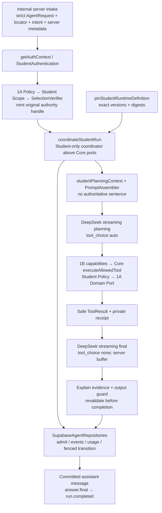

# UPLY Teaching Agent — Build Stage 1C Runtime

## 1. Executive Summary

**Overall: CONDITIONAL GO。Stage 1D: READY（进入 Transport 开发，不表示允许生产部署）。**

已经在同一个一次性 PostgreSQL 环境中，使用真实 Stage 0B Repository/RPC、Stage 1A 教学 Repository/Domain Ports、Stage 1B Product Tools 和真实 DeepSeek Adapter，完成两个合成 Student Agent Run。两个 Run 均由 DeepSeek 在 `tool_choice=auto` 下主动选择 `get_current_lesson_context`，结果回传下一次 DeepSeek 请求；最终 `tool_choice=none`，经过 mandatory evidence/output gate 和数据库完成事务后才发布 `answer.final`。

| 验收事实 | 结果 |
|---|---|
| Live Runs / Provider Requests | 2 / 4；未做额外取消 smoke、重试或负载测试 |
| Provider baseline | DeepSeek `deepseek-v4-flash`；thinking disabled；原 configVersion 保持不变 |
| 有 teaching session | completed；完整 internal Run 15099ms |
| 无 teaching session | completed；完整 internal Run 14003ms |
| Usage | 4 个独立 modelCallId，全部 reported；input 5202 / output 726 / total 5928 tokens |
| Teaching Domain Writes | 0；两次 Run 的 23 张教学合成表逐表哈希一致 |
| Persistence | ISOLATED PASS；conversation/user/assistant/run/events/usage 真实落 SQL |
| Public Agent API / Student UI | NONE / UNCHANGED |
| Target Supabase | PARTIAL；未使用真实学生或目标环境数据补测 |

采用 Student 专属 Coordinator，保留 1A 原始 authority 对象及 WeakMap 绑定。Generic Core Coordinator 未加入教学逻辑。Core 仅增补安全错误码、严格版本化 artifact metadata 和受控 trace/persistence 支持。

完整测试集合跨执行共 205 项通过：最终离线/隔离回归 204 PASS，唯一跳过的是 opt-in live 用例；该 live 用例另行启用并 PASS，内部实际执行两个 Run。目标 strict TypeScript、lint、文件范围/whitespace 检查通过。全仓仍有既知 docs/evidence 的 397 条类型错误，未修复。

## 2. Inputs & Baseline

使用本会话中完整阅读的 [Current-State Audit][audit]、[Architecture v1][architecture]、[Stage 0A][stage0a]、[Stage 0B][stage0b]、[Stage 1A][stage1a] 和 [Stage 1B][stage1b]。当前实现优先于旧架构建议；保留 1A/1B 明确限制。

开始 HEAD 为 `b1672390ae96357a2143358235cc10edeff8d488`。记录 2724 个 tracked/非忽略 untracked 普通文件的 SHA-256。既有 6 个 UI 文件修改仍为 80 行新增、89 行删除；另有大量先前未跟踪的报告、Core、教学模块和测试，不把它们重复计算为本阶段新增。

本阶段修改 9 个相关既有文件；其余 2715 个文件开始/结束摘要相同：

`4d71b9a48c8aedfee557583c81413af6f6e844ee730c5e6c3505857a0f0ec91e`

摘要算法：按路径排序，以换行连接 `path:SHA256`，再求 SHA-256。未修改 growth-toolbox、Script Studio、旧 Guide/Learning Edge、现有学生 UI、旧模型设置、环境文件、依赖或 Stage 0B migration。

仅确认 `DEEPSEEK_API_KEY` 存在并由已有 adapter 使用；未输出值。没有探索或读取真实学生数据。新 migration 只应用到测试自建的一次性容器。

## 3. Files Changed

新增 11 个文件，修改 9 个相关文件。

| 文件 | 变化及职责 |
|---|---|
| [create-student-ai-teacher-runtime.ts][runtime] | NEW：严格 internal intake、45s 总 deadline、新 verifier/authority mint、依赖装配 |
| [create-authenticated-student-ai-teacher-runtime.ts][auth-runtime] | NEW：未来 server transport 可调用的 getAuthContext 包装；不创建 Route |
| [student-run-coordinator.ts][coordinator] | NEW：Student 单回合 planning/corrective/tool/final、Core persistence/usage/events、终态控制 |
| [student-runtime-definition.ts][definition] | NEW：exact code artifact 校验、Core manifest 投影与 digests |
| [student-prompt-assembler.ts][prompt] | NEW：不含权威原句的 planning context、分区 instructions、prompt digest |
| [student-run-completion-guard.ts][guard] | NEW：Student evidence/output 强制完成门禁 |
| [202609140001_agent_runtime_completion_evidence.sql][migration] | NEW：严格 artifact、metadata event v2、数据库完成证据检查；只在隔离环境应用 |
| [student-runtime.mjs][fixture] | NEW：同库 Core+Teaching schema、真实 SDK/RPC repository 的合成读写传输 |
| [teaching-agent-student-runtime.test.mjs][tests] | NEW：32 项 Runtime/隔离数据库测试 |
| [teaching-agent-student-runtime-live.test.mjs][live-tests] | NEW：默认 skip 的真实 DeepSeek 合成测试；累计 Run/请求上限 |
| [本报告][report] | NEW：阶段验收证据 |
| [Core contracts/public.ts][public] | MODIFIED：REQUIRED_EVIDENCE_MISSING / SKILL_OUTPUT_INVALID 安全码 |
| [Core contracts/server.ts][server] | MODIFIED：可选、版本化 artifacts 合同 |
| [Core runtime/errors.ts][errors] | MODIFIED：安全码映射；不透出 Provider/SQL 错误 |
| [Core observability/trace.ts][trace] | MODIFIED：新增生命周期 kind 和 strict metadata details schema |
| [Core Supabase repositories.ts][persistence] | MODIFIED：严格 artifact validator、按事件合同调用 v2 RPC、stop-only failure audit |
| [1B capabilities composition][capabilities] | MODIFIED：使用 pinned Profile/Skill；私有 receipt 关联 Run/SkillRun/ModelCall/ToolCall/version |
| [student-domain.mjs][domain-fixture] | MODIFIED：测试 harness 暴露同一 synthetic authenticate callback |
| [1A regression tests][tests1a] | MODIFIED：仅允许新 Runtime composition 导入 Provider adapter 的静态阶段例外 |
| [1B regression tests][tests1b] | MODIFIED：同上；原 56 项安全/工具用例保留 |

所有新增 production 文件标记 server-only。没有修改通用 [Core run-coordinator.ts][core-coordinator]，没有向 Core import teaching-agent。

## 4. Runtime Composition

[createStudentAiTeacherRuntime][runtime] 接收可信服务器提供的 authenticate、教学只读 repository、由 authority 创建的 AgentPersistence factory，以及 Provider/Trace ports。默认 Provider 是已有 DeepSeek Adapter；测试注入 mock transport 或受限真实 transport。

[authenticated wrapper][auth-runtime] 从 `getAuthContext()` 取得认证身份和用户范围 Supabase client，创建 Stage 1A read repository。Agent infrastructure client 由可信服务端调用方单独提供，只交给 Core Agent repository，不交给 Teaching Tools。认证等待也受服务器接收时间起算的 deadline 限制。



没有新增公开 API、UI、MCP、LangChain、LangGraph、Agent SDK、Qwen 或 Teacher Copilot。Context projection、Prompt assembly、capability execution、completion guard、Provider stream parsing 和 SQL 状态变更分别由模块承担；composition 不直接查询整套教学数据或 parse SSE。

## 5. Trusted Authority Handoff

真实执行顺序：严格解析 request/selection/metadata→认证 callback→StudentTeachingPolicy 的完整当前资格检查→StudentTeachingScope→[1A verifier][selection] mint authority 与 verified selection→admission→将**同一个 authority 对象**交给本 Run 的 Tools/Domain Ports。

可信依据不是 TypeScript shape。每次 internal `.run()` 都创建新的 `StudentSelectionVerifier`，必须重新认证、重新读取政策事实。1A WeakMap、binding identity、Domain Port authority equality 均保留。

原问题出在通用 Core Coordinator 的 structuredClone。此次选择用户允许的“Student Skill Execution Coordinator 位于 Core 之上”方案：Student 路径不调用那个 clone 分支，保留原始 handle；Profile 等 serializable data 则复制/pin。未用删除身份检查来兼容。

Core Supabase repository 内仍复制 authority metadata，目的是固定 actor/tenant/scope 查询和 RPC 参数；此副本只用于 Agent infrastructure persistence，从不传给 Teaching Port。数据库中的 actorId、tenantId、scopeRef、policyVersion 或 authority digest 不具有执行 capability。

测试证明：跨 execution 重新 mint 不同 handle；idempotent replay 不再调用模型；request JSON 中 authority 被 strict schema 拒绝；退出认证后相同请求不能复用旧授权。1A/1B 回归继续证明 clone binding/authority、错误 actor/tenant、错误 run/skill handle 被拒绝。数据库 Run metadata 不能重建 WeakMap 中的授权对象。

## 6. Agent Definition Pinning

[pinStudentRuntimeDefinition][definition] 将输入与本版本代码 artifact 的规范化值精确比较，拒绝额外 executable 字段、未知 Persona、未知 Skill/Tool version 或配置替换。不存在 dynamic latest。

首版 Runtime 固定 `student-ai-teacher@1.0.0`、Kim Persona、Explain Skill v1、两个 Tool v1、既有 DeepSeek configVersion、Prompt/Context/Policy versions。Kim 仍是表达层 Persona，不改变权限。1B Generic Persona 测试仍保留，当前真实 Runtime 首版固定 Kim。

持久化的 Core manifest 保留原 Core Profile 字段，加可选严格 `artifacts`：

| artifact 字段 | 含义 |
|---|---|
| schemaVersion=1 | 可验证的 metadata 合同版本 |
| definitionDigest | Profile + Persona + base instructions + Skill + Tool schemas 的规范化 SHA-256 |
| personaRef / privateInstructionsRef | 精确版本引用 |
| skillDigest / toolsDigest | 专业方法及 Tool schema artifacts 的摘要 |
| completionPolicyRef | 必须执行的版本化完成政策引用 |
| requiredEvidenceToolRef | mandatory Tool 的精确版本；数据库 gate 使用它，不硬编码韩语 Tool 名称 |

不保存函数、JS source、任意可执行 Skill、旧 DB system_prompt。摘要描述版本化定义数据，不宣称是编译后完整程序的二进制摘要。

Run 保存 immutable definition FK/profile version、skillRef；definition.pinned 事件保存 definition/authority digests、model configVersion、prompt/context/policy refs，事件包含 skillRunId。Tool receipt 和 trace 保留精确 Tool version 与 call links。数据库 definition 行不可修改/删除；正在执行时变更活动代码 definition 的 fixture 测试不能改变已 pin 的 Skill procedure。

## 7. Prompt Assembly

[studentPlanningContext][prompt] 只投影 verified_selection 的 lessonRef、segmentRef、revision、locale/sourceLocale 和 binding 语义。没有 originalSentence、教材正文、全 module/textbook、身份 UUID、全部 profile/progress、teaching_state 或历史。

Prompt 逻辑分区：base evidence/safety、Student role、Kim style、Explain procedure、Runtime constraints、verified context DATA、empty history、current user question。Tool schema 通过 Provider `tools` 参数发送，不粘在 Prompt 中。

课程正文和 ToolResult 明确标为数据而非新的系统指令，用户请求不能改变权限或取消 mandatory Tool。Persona 仅提供 style instruction；真实权限在 Runtime/Policy/Port 执行。Prompt 注入测试证明用户要求“不调用工具”不能绕过 gate；教材中的指令不改变工具曝光或权限。

**Planning Prompt 不含 authoritative sentence。** Selection verifier 仍需内部读取正文以核验 pin，但这不是 Model-selected Tool，也没有被记成 ToolCall。正文进入模型的唯一正式路径是模型选择 Lesson Tool 后的安全 ToolResult。

Prompt 默认不持久化全文；事件只保存 promptVersion、digest、分区名称与 byte estimate。真实 Provider 请求仅包含合成内容和本阶段新编写的 instructions，没有迁移旧 Kim 私有 system_prompt。

## 8. Model Planning Phase

首次 DeepSeek 请求：deepseek-v4-flash、thinking disabled、stream=true、include_usage=true、Student visible schemas、tool_choice=auto。

若 planning 直接返回文本或只取得 State evidence，Runtime 不完成、不释放这段文本，也不后台自动调用 Lesson Tool。最多增加一次 corrective ModelCall，明确 required evidence missing，仍由模型自己选择 Tool，仍计入三次 ModelCall 总预算。

第二次仍缺证据则 `failed / REQUIRED_EVIDENCE_MISSING`。若 corrective 调用取得 Lesson evidence，第三次可进入 final。两个 live Run 都在第一次 planning 主动选择了 Lesson Tool，均未使用 corrective。

模型返回多个 ToolCall 时按顺序串行执行。Malformed JSON、重复 call ID 等可能先由现有 Provider parser 返回 PROVIDER_PROTOCOL_ERROR；合法 JSON 但 schema 不合格由 Core executor 返回 TOOL_INVALID_INPUT。

## 9. Real Tool Loop

真实链路是 [Student Coordinator][coordinator]→DeepSeek Adapter/parser→ProviderResponse.toolCalls→[1B capabilities][capabilities]→[Core executeAllowedTool][executor]→Student logical permission adapter→1A revalidation→[CurrentLessonReadPort][lesson-port] / [TeachingStateReadPort][state-port]→既有只读 repository。

每个 Provider ToolCall 都关联 modelCallId、call ID、skillRunId、runId、exact Tool ref。匹配的 assistant tool-call message 与 tool result message 追加到下一次 Provider 请求；不会把内部 trace、authority、raw row 或 SQL 错误交回模型。

首版最多两个成功业务 Tool，全部调用仍受 1B 四次尝试、Core budget、duplicate ID、timeout/deadline 限制。模型一次返回多个 ToolCall 时明确串行，未 Promise.all。unknown/越权/坏参数直接失败；mandatory Lesson 的 stale/unavailable/not-visible 不能继续生成 completed 答案。

两个 live Run 均执行一次 Lesson Tool，再由真实 DeepSeek 消费其结果。模型没有选 State Tool，这是合法行为；有会话时曝光两只，无会话时仅曝光 Lesson。Offline fixture 另验证 Lesson+State 同次返回与按序执行。

## 10. Evidence Completion Gate

[completion guard][guard] 在 completed 之前调用 capability 私有 ledger 的确定性检查，核对成功 Lesson Tool、revision、segmentRef、sourceRefs、原句投影、locale、asOf 和 partial 语义；重新执行 1A 授权/内容 revalidation。

1B ledger 已扩展为 private receipt，绑定 runId、skillRunId、toolCallId、modelCallId、toolVersion 和包含 revision/segment/source/status/asOf 的真实 ToolResult。模型没有提交或修改 receipt 的入口。

没有 Tool、State only、fake refs、stale Lesson、执行前撤销 enrollment 或 Tool 后/最终检查前撤销 enrollment，都不能 completed。失败返回安全错误码，并且没有 assistant final message/answer.final。

数据库也实施第二道保护：[incremental migration][migration] 保留并包装 v1 atomic transition。对于包含 completion artifact 的 Profile，completed 前必须存在当前 stateVersion 的 evidence.checked PASS、匹配 mandatory Tool version 的成功 tool.completed、相同 revision/segment，以及匹配的 output.checked PASS。缺少 Tool 记录，即使单独写入 evidence PASS，也不能通过完成 RPC。

这些事件只能由可信 server infrastructure 路径写入；不是浏览器或模型提交的授权证明。真正课程授权仍由 1A Port 执行，数据库 metadata 不替代 domain policy。

## 11. Output Completion Gate

普通 final 文本完整缓冲后，先通过 [1B validateExplainOutput][output]，再记录 output.checked PASS，最后调用数据库 completed CAS。输出校验失败为 `SKILL_OUTPUT_INVALID`，不会存储为 assistant final，也不会提前释放文本。

Runtime 附加来源、revision、segmentRef、asOf、completeness 和必要 limitation。内部成功结果包含 `answer` envelope；Core 公共事件保持 `answer.final` 的 text/sourceRefs/completeness 合同，后续 Transport 可以基于明确的安全投影扩展，而不能直接暴露内部 Run 对象。

partial evidence 产生 partial metadata 和服务器提供的限制说明。checkQuestion 不做脆弱正则提取，可以留在普通正文中；没有要求 DeepSeek strict JSON/structured output。

沿用 1B 文本长度和显式状态更新声明 guard。它不保证任意自然语言改写的语义安全或韩语教学质量；本阶段证明的是确定性 evidence/output contract 和零状态写能力，不宣称已完成开放式语言评估。

## 12. Final Answer Generation

mandatory Lesson evidence 满足后，下一次 Provider 请求切换 `tool_choice=none`。如果 Provider 在 final 阶段仍返回 ToolCall、缺少正常 stop 或协议异常，Run 失败。

**Provider Streaming: Existing / 实际消费。Client Streaming: 未开放 token deltas。** Runtime 不释放 planning/corrective 文本，也不把 final provider deltas当作已认可答案。仅在 validation 和持久化成功后发布：

`answer.final → run.completed`

没有伪造 answer.delta；取消或校验失败也不存在“用户已看到完整答案但最后失败”的正常路径。消费者 callback 断开不会取消已完成的数据库事实。持久化失败时没有 completed/answer.final 事件。

## 13. Run Persistence

真实集成使用 [SupabaseAgentRepositories][persistence]，不使用 MemoryPersistence 作为 integration 成功证据。它通过真实 SDK 调用 Stage 0B `admit_agent_run_v1`、事件 RPC、`record_agent_usage_v1` 与 fenced `transition_agent_run_v1`。

| 数据 | 真实写入/关系 |
|---|---|
| agent_definition_versions | 隔离 fixture 控制面插入严格 manifest；immutable definition |
| agent_conversations | admission 创建或按 scope/idempotency 复用 |
| agent_messages | admission 写 user；完成事务写最终 assistant；Tool 不存普通 message role |
| agent_runs | created→running→waiting_tool→running→completed；失败/取消有独立终态 |
| agent_run_events | seq、Run、SkillRun、ModelCall、ToolCall、safe metadata 与终态 |
| ai_token_usage | 每个 reported ModelCall 一行，与 runId/modelCallId 关联 |

复用原状态版本、fencing token、预算检查、事务、唯一约束、CAS 和 terminal message atomic write。新的完成 wrapper 在同一事务中保存 final assistant 的 source_refs；revision/segment/completeness 保存在 guard events，可按 Run 追踪。

数据库 metadata 不能变成 trusted authority。每次新 execution，包括重放查询前，仍需当前认证与 policy。idempotent replay 不调用 Provider；本阶段不实现跨回合 memory/history，也不增加公共 replay/status endpoint。

Applied where：测试自己创建、无网络/无 host mount/无端口的一次性 PostgreSQL tmpfs 容器。Applied what：Stage 0B migration + 新 Stage 1C migration。**Production/shared dev/target Supabase：MIGRATION NOT APPLIED。**

## 14. ModelCall / Usage

planning、corrective（如发生）、final 分别分配 UUID modelCallId。每次调用的 finally 分别持久化 usage 与 duration，不将整个 Run 合成一次模型调用。

reported usage 写 ai_token_usage 和 model.usage event；无 usage 的取消/Provider error 保留 `{status:'unknown'}`，不伪造零 token 行。ModelCall 可通过 RunEvent 中的 modelCallId 与 ToolCall 对应。

本次 live：

| Run | Phase | Input tokens | Output tokens | Total | Status |
|---|---|---:|---:|---:|---|
| 有会话 | planning | 1235 | 150 | 1385 | reported |
| 有会话 | final | 1416 | 182 | 1598 | reported |
| 无会话 | planning | 1137 | 148 | 1285 | reported |
| 无会话 | final | 1414 | 246 | 1660 | reported |
| 合计 | 4 ModelCalls | 5202 | 726 | 5928 | reported |

未估算货币成本，没有价格快照或真实账单证据。Provider configVersion 仍为 `deepseek-tools-disabled-v1`；没有修改现有 Model config。

## 15. Trace Lifecycle

持久事件包含 run.started、definition.pinned、permission.checked、context.resolved、skill.selected、prompt.assembled、model.started、model.usage、tool.requested、tool.completed、evidence.checked、output.checked，以及事务生成的 run.completed/failed/cancelled。

事件记录 runId、seq、skillRunId、modelCallId、toolCallId 和精确版本 refs。metadata details 由 [strict schema][trace] 白名单约束，SQL v2 再校验；包含摘要、阶段、来源 refs/revision、完整度或检查状态。失败阶段写 run.failure，安全 failure code 保存在 Run terminal_reason/公共 run.failed。

不记录完整 Prompt、用户问题副本、Tool arguments、课程正文、raw ToolResult、Provider raw response 或 chain-of-thought。用户/assistant 消息只在相应消息表保存，不混入 trace。测试验证 PRIVATE-REASONING sentinel 不进入 persisted/public projection。

继承旧 Core metadata 的无 artifact Agent 可继续使用 v1 event 路径；新 Student metadata 使用 v2。次级 TraceSink 失败不能推翻已经写入的 durable event；sink 等待有界。

## 16. Cancellation / Deadline

服务器 metadata 的 receivedAt 为 45s 起点，包含 auth、policy、selection、admission、context、planning、Tool、final、正常持久化；不是每个模型调用各自重新获得 45s。future authenticated wrapper 的 getAuthContext 等待也包含在此预算内。

| 场景 | 验证结果 |
|---|---|
| Abort during planning | cancelled；无 Tool/后续 final；无 usage 时 unknown |
| Abort during Tool | cancelled；不发后续 ModelCall |
| Abort during final | cancelled；不发布或保存未验证文本 |
| auth/selection 等待超时 | deadline error；未 admission、未调用模型 |
| Provider stream 超时 | failed / DEADLINE_EXCEEDED；unknown usage 收尾 |
| terminal DB deadline/failure | 不发布 answer.final/completed |
| admission 晚于 abort 才返回 | 不安排模型工作；仅对新建非 replay Run 尝试 fenced stop cleanup |

正常异步等待受 Run signal 约束。沿用 0B 的 stop-only cleanup 语义：已开始 ModelCall 的 usage 和 failed/cancelled CAS 可在 deadline/取消后有限收尾，各持久化等待最多 2s；不允许继续 Provider 或教学读取。次级 trace sink 最多 1s。

这意味着 **45s 是正常执行/成功提交预算，不是保证所有失败网络收尾进程在第 45s 精确退出**。底层 RPC 若响应丢失，事务是否已提交仍以数据库为准；Runtime 不伪报成功。后续 Transport/status 必须尊重 CAS winner、lease 与持久终态，不能用客户端断线反推数据库回滚。

本次两个真实完整成功 Run 均低于 45s。没有重复 live cancellation；0A 已有 live cancel 证据，本阶段三阶段取消用 fixture 覆盖。

## 17. Synthetic Live DeepSeek Verification

执行命令：

```bash
RUN_STUDENT_AGENT_LIVE_TESTS=1 node --env-file=.env.local --test tests/teaching-agent-student-runtime-live.test.mjs
```

该测试默认 skip；显式 opt-in 才调用 Provider。累计计数保存在 `/tmp/uply-stage1c-live-results.json`，达到两次 Run 后拒绝重复测试，未重置额度。每 Run ≤3 请求，Stage ≤6；本次实际仅 4 请求。没有 Qwen、额外取消 smoke 或自动重试。

所有教学/学生/租户数据来自合成 fixture；真实认证密钥只用于 DeepSeek transport，不进入 Prompt 或报告。初始请求检查不含 authoritative sentence/学生 UUID，末次请求检查包含匹配 ToolResult。模型未被强制指定 function name；首次 auto、final none。

| 指标 | 有会话 Run | 无会话 Run |
|---|---:|---:|
| Result | completed | completed |
| Model-selected Tool | get_current_lesson_context | get_current_lesson_context |
| Provider requests | 2 | 2 |
| intake + admission（至 run.started event） | 1354ms | 1242ms |
| context + prompt（至 first model.started） | 3703ms | 2330ms |
| planning Provider stream | 1749ms | 2422ms |
| first Tool span | 2272ms | 2064ms |
| final Provider stream | 2136ms | 2355ms |
| output.checked→terminal persistence | 59ms | 68ms |
| 完整 internal Run | **15099ms** | **14003ms** |

**SMOKE ONLY，N=2。** 表中 span 使用事件边界/Provider 计时，部分 persistence、gate revalidation 和事件写入位于其它间隔；不要直接求和当完整耗时分解。逐查询 SQL 子进程传输明显影响时间，不代表目标 PostgREST 性能或生产 p95。

验收时在同一个隔离 DB 中核对 completed Run、user/assistant 两条消息、独立 usage rows、Tool/Skill/ModelCall links、两道 PASS gate 和 final/completed 顺序。未在报告保存 Prompt、原句全文、回答、Tool args、raw response、请求 headers 或任何密钥值。

## 18. Teaching Domain Side-Effect Verification

同一隔离 DB 同时运行 Stage 0B Agent schema 与 Stage 1A 教学 fixture。读取执行使用真实教学 repository；Agent 写入使用真实 infrastructure RPC，避免仅以内存计数声称成功。

每次 live Run 前后，23 张教学表的 count + row-content MD5 完全一致，汇总 SHA-256：

`5d523584c49837d60c6367b2d0f61270c002d1314798920f9d8cceae02e8ca18`

重点保护 learning_agent_sessions、learning_agent_messages、learning_agent_node_attempts、learning_agent_task_events、lesson_progress、digital_textbook_node_progress，及相关课程/脚本表。没有写 teaching_state、推进 node、提交答案、评分、completion、作业、题目或发布。

Agent infrastructure 预期新增 conversation、Run、user/final assistant、events、逐次 usage。业务哈希变化与 infrastructure 变化分开测量。fixture schema/数据初始化和 negative-case 合成数据维护仅发生在一次性容器，不属于 Agent 教学业务写入。

容器 `--pull=never` 使用已缓存 PostgreSQL 镜像，无网络、无主机数据挂载、无端口映射、只读 rootfs、tmpfs 数据目录。结束后删除各测试自己创建的容器。没有访问现有开发/生产数据库或应用 migration 到它们。

## 19. Security Review

- **Intake**：request、selection、intent 和 server metadata 分别严格解析；authority 不来自浏览器 JSON。AuthContext wrapper 和底层 runtime 都在受控 server-only 范围。
- **Authority**：保留 original handle，WeakMap/对象身份和新 request remint 不变。持久化只复制元数据，不赋予 domain capability。
- **Scope**：仍是 verified_selection；韩语 app、korean_course、VIP2/VIP3、有效 enrollment 和独立可证明开放的范围。previous_completed/prerequisite_completed 继续拒绝。
- **Tools**：仅两只 L0；opaque args 不扩大 scope；执行前/port 内/完成前重新授权；State 仅 last_saved。
- **Evidence**：真实 model-selected Lesson receipt 必须存在。没调用 Tool、State only、stale、失效授权不能产生 completed。
- **Output**：先 buffer/validate，再 atomic persistence，再 final event；没有状态命令消费者。文本语义评估仍有限，不粉饰为完备教学质量保证。
- **Definition**：strict code equality + strict Core/SQL artifact schema；没有 arbitrary JSON executable config 或 dynamic latest。运行中活动定义变更不能替换 pinned procedure。
- **Persistence**：service-only RPC + actor/scope metadata + fence/version/CAS；最终写消息、引用与终态原子提交；不因 metadata 自行授予课程权限。
- **Privacy**：Provider 仅收到合成数据；trace/report 为安全 metadata，无 chain-of-thought/secret/raw row。
- **Isolation**：真实目标 JWT/RLS/legacy policy/trigger 仍未验收，不能把 synthetic SDK→SQL bridge 当成完整 Supabase 验证。

新 migration 是共享 Core persistence 的通用 artifact-completion 机制；没有在 Core SQL 或 TS 中硬编码韩语 Skill/Tool 名。SQL negative tests 证明缺 Tool、缺/失败 output gate、非法 raw metadata 被拒绝；无 completion artifact 的通用定义保留原 v1 完成行为。

## 20. Tests

最终离线/隔离回归命令：

```bash
RUN_TEACHING_AGENT_ISOLATED_DB_TESTS=1 RUN_AGENT_ISOLATED_DB_TESTS=1 node --test tests/teaching-agent-student-runtime.test.mjs tests/teaching-agent-student-runtime-live.test.mjs tests/teaching-agent-student-tools-skills.test.mjs tests/teaching-agent-student-domain.test.mjs tests/agent-core-foundation.test.mjs tests/agent-core-database.test.mjs
```

| 检查 | 结果 |
|---|---|
| Stage 1C Runtime | 32 PASS，包括 integrated SQL |
| Stage 1B regression | 56 PASS，包括隔离 SQL |
| Stage 1A regression | 75 PASS，包括隔离 SQL |
| Core foundation | 32 PASS |
| Core isolated DB | 9 PASS（含子测试计数），真实 0B migration/CAS/usage/RLS guards |
| 上述最终合并执行 | **204 PASS / 0 FAIL / 1 SKIP**，约 30.7s；skip 仅 live opt-in |
| 单独 opt-in live test | **1 PASS**；内部 2 live Runs，4 Provider requests |
| target strict TypeScript | PASS；Core + Teaching 全目录，0 diagnostics |
| target ESLint | PASS；Core、Teaching 与相关测试，0 errors/warnings |
| 全仓 typecheck | 既知 397 errors / 27 files，全部 docs/evidence；未修 |
| git diff / 新文件 whitespace / 文件摘要 | PASS；无关 2715 文件一致 |

在返回 internal answer envelope 后补跑 Runtime 离线用例：31 PASS、仅隔离项默认 skip；改动未更改 Provider 请求或增加 live 次数。实际 Provider/Tool/SQL 验证已在前述 live 与完整隔离回归完成。

覆盖失败：无 Lesson、State only、未知 Tool、schema 错误、malformed JSON、重复 call ID、stale、Tool 前及 final gate 前 revoke、planning/final Provider error、输出非法、terminal persistence fail、三阶段 cancel、auth/Provider/persistence deadline、definition mutation、prompt injection、未知 metadata、SQL completion bypass。

关键 invariant 在 Runtime fixture 与真实 SQL/live 路径中均检查：completed 必须有成功 mandatory Tool、matching revision/segment、evidence PASS、output PASS、持久化 final assistant；失败不得发布 final/completed 或保存未认可文本。

临时安全证据：`/tmp/uply-stage1c-final-tests.log`、`/tmp/uply-stage1c-live-results.json`、`/tmp/uply-stage1c-live.log`、target tsc/lint logs。live 文件只保留 model/config、调用次数、工具名、finish reason、usage、duration 和教学表 hashes。

## 21. Gate Matrix

PASS 范围是源码、合成 fixture、隔离 SQL 与受限真实 Provider integration；不延伸为生产部署验收。

| Gate | Status | 证据 |
|---|---|---|
| G-C1 Trusted Authority Handoff | PASS | Student Coordinator 保留原 handle；WeakMap/identity 回归、新 request remint |
| G-C2 Definition Pinning | PASS | 严格 code artifact、immutable DB FK/digests、版本/Persona/可执行字段拒绝 |
| G-C3 Prompt Assembly | PASS | 分区、DATA/instruction 边界；planning 无 authoritative sentence |
| G-C4 Real DeepSeek Planning | PASS | 两 Run 首次 auto 均真实返回 Lesson ToolCall |
| G-C5 Real Product Tool Call | PASS | Core executor→1B Tool→1A Port→真实 repository/SQL |
| G-C6 ToolResult → Provider | PASS | 后续实际 DeepSeek请求含匹配 ToolResult |
| G-C7 Mandatory Evidence Terminal Gate | PASS | 无 Tool/stale/revoke 不完成；SQL completion gate 再核验 |
| G-C8 Output Validation Terminal Gate | PASS | buffered final、校验先于 completed；invalid/persistence failure 不发布 |
| G-C9 Run Persistence | PASS — ISOLATED | admit/transitions/messages/source_refs/events/CAS 真实落 SQL |
| G-C10 ModelCall Usage Persistence | PASS — ISOLATED | 4 live usage 均独立 reported；offline cancel unknown |
| G-C11 Trace Lifecycle | PASS | definition/skill/model/tool/gates/terminal 可按 Run 关联；metadata-only |
| G-C12 Cancellation / Deadline | PASS | 三阶段 cancel、整体成功预算与失败收尾边界测试；live 均<45s |
| G-C13 Teaching Domain Zero Writes | PASS | 每 Run 前后 23 教学表哈希一致 |
| G-C14 Live Synthetic End-to-End | PASS | 有/无 session 两 Run completed；4 requests |
| G-C15 Target Supabase Integration | PARTIAL | 未取得/使用明确授权的非生产真实 JWT fixture，未测目标完整边界 |

C1–C14 已通过，按任务规则可进入 Stage 1D Transport 开发。C15 在任何 Student production deployment 前必须完成。

## 22. Architecture Deviations

1. 采用 Student-specific Coordinator 位于 Core ports 之上；没有扩写通用 Coordinator 的教学条件分支。解决 authority clone 和 mandatory completion 问题，同时维持其它 Agent 的独立政策。
2. serializable Profile 使用严格 artifacts 扩展；教学 procedure 仍在版本化代码中，仅保存 refs/digests。没有把任意 JSON、函数或旧私有 Prompt 存 DB。
3. 新增独立 migration 扩展事件与完成证据；原 0B migration 不改。只在同一 disposable Core+Teaching DB 验证。
4. planning context 只给 opaque refs/locale/revision，连可选标题/目标也暂不加入；正文必须通过模型选择 Lesson Tool 获得。
5. 单回合、history empty；不实现长期 memory。Conversation/Message 仍真实持久化。
6. Provider 实际 stream，Runtime 不发布 delta；final 全量 buffer→gates→持久化→answer.final。普通文本不做 checkQuestion 结构提取。
7. 正常工作使用整体 45s；cancel/deadline 后允许有界 stop-only accounting/CAS cleanup。不是每个 Provider 分别获得 45s，也不是无限后台工作。
8. 同库集成使用真实 SDK/Repositories/SQL，但测试传输是受限 PostgREST 查询/RPC 桥接，未宣称是实际 target PostgREST/JWT。

## 23. Target Supabase Status

**ISOLATED PASS；TARGET SUPABASE PARTIAL；不是 Database Production Ready。**

本阶段没有明确授权、可销毁、带 synthetic auth user/tenant/course 的目标 Supabase fixture，因此没有读取真实学生、真实用户聊天、真实 tenant 私有内容或 progress 来补测。

仍缺真实目标 JWT、PostgREST、RLS、legacy policy/trigger 与部署后的 migration 组合验收。新 migration 未应用到 production 或现有开发库；现有 Agent tables 的实际部署状态未通过本阶段写操作改变。

Core service-only infrastructure client 与教学 user-scoped client 的分离已在 composition 明确，但目标环境的实际角色权限和网关行为必须另行验收，不能由 TypeScript 类型或隔离 SQL 推断。

## 24. Remaining Stage 1D Blockers

**进入 Stage 1D 开发：无未解决的 C1–C14 FAIL。Stage 1D READY。**

仍需在后续阶段完成、但本次不实施：公开 Transport 的 strict intake、请求/取消/status/重放安全投影、NDJSON、认证与客户端断连语义、来源 metadata 的公共合同。内部 `AgentRun` 含 server metadata，不应直接作为 API response。

G-C15/G-A9 仍是生产部署 blocker。真实应用 getAuthContext→JWT/RLS、migration 应用目标、基础设施 client 权限和异常 RPC/replay/lease 状态恢复必须在授权的非生产环境验证。

现有 scope 限制继续有效：verified_selection only、韩语 MVP、VIP2/3、有效 enrollment，前置完成类解锁 fail-closed。不要求本阶段或 Transport 阶段扩大到 verified_current、Teacher Copilot、写工具或其它 Provider。

## 25. Final Recommendation

**CONDITIONAL GO；Stage 1D READY；Production deployment 未授权/未就绪。**

| 必答问题 | 结论 |
|---|---|
| 1. authority 如何从 intake 进入 Runtime？ | server AuthContext/callback→1A policy/scope/selection mint→原始 handle→Student Coordinator/Ports |
| 2. structuredClone 如何解决？ | Student Coordinator 保留 handle；只克隆 serializable Profile/DB metadata；通用 Coordinator 保持通用 |
| 3. DB metadata 能恢复 trusted authority？ | 不能；每个新 execution 重做 Auth/Policy 和 WeakMap mint |
| 4. definition 如何 pin？ | exact code comparison、Profile/Skill snapshots、immutable DB definition FK 和 artifacts digests |
| 5. planning 是否含原句？ | 否 |
| 6. DeepSeek 是否主动选择 Lesson？ | 是；两个 live Run 首次 auto 都选择 |
| 7. 是否经过 Product Tool Executor？ | 是，1B capabilities→Core executeAllowedTool |
| 8. 是否调用真实 1A Port？ | 是，沿实际 repository 读取隔离 SQL |
| 9. ToolResult 是否回 Provider？ | 是，进入后续真实 DeepSeek请求 |
| 10. mandatory evidence 是否 completion gate？ | 是，Runtime 与 SQL 两层 |
| 11. 无 Tool 能 completed？ | 不能 |
| 12. stale 能 completed？ | 不能 |
| 13. output validator 是否先于 completed？ | 是；文本 buffer，不提前发布 |
| 14. 每次 ModelCall 独立计量？ | 是；4 live modelCallId/usage，全部 reported |
| 15. Run 是否真实持久化？ | ISOLATED PASS，真实 Core repository/RPC |
| 16. Teaching writes？ | 0 |
| 17. Live Provider calls？ | 4，分属两个 Run |
| 18. Public Agent API？ | NONE |
| 19. Student UI？ | UNCHANGED |
| 20. Stage 1D？ | READY；C15 仍阻止生产部署 |

本次停止在 Stage 1C。没有自动进入 Transport 或 UI 开发。

[report]: </home/yangzhen/projects/my-lms-system/docs/teaching-agent-stage-1c-runtime.md>
[audit]: </home/yangzhen/projects/my-lms-system/docs/assistant-current-state-audit.md>
[architecture]: </home/yangzhen/projects/my-lms-system/docs/teaching-agent-architecture-v1.md>
[stage0a]: </home/yangzhen/projects/my-lms-system/docs/teaching-agent-stage-0a-verification.md>
[stage0b]: </home/yangzhen/projects/my-lms-system/docs/teaching-agent-stage-0b-foundation.md>
[stage1a]: </home/yangzhen/projects/my-lms-system/docs/teaching-agent-stage-1a-student-domain.md>
[stage1b]: </home/yangzhen/projects/my-lms-system/docs/teaching-agent-stage-1b-tools-skills.md>
[runtime]: </home/yangzhen/projects/my-lms-system/src/features/teaching-agent/server/runtime/create-student-ai-teacher-runtime.ts>
[auth-runtime]: </home/yangzhen/projects/my-lms-system/src/features/teaching-agent/server/runtime/create-authenticated-student-ai-teacher-runtime.ts>
[coordinator]: </home/yangzhen/projects/my-lms-system/src/features/teaching-agent/server/runtime/student-run-coordinator.ts>
[definition]: </home/yangzhen/projects/my-lms-system/src/features/teaching-agent/server/runtime/student-runtime-definition.ts>
[prompt]: </home/yangzhen/projects/my-lms-system/src/features/teaching-agent/server/runtime/student-prompt-assembler.ts>
[guard]: </home/yangzhen/projects/my-lms-system/src/features/teaching-agent/server/runtime/student-run-completion-guard.ts>
[migration]: </home/yangzhen/projects/my-lms-system/supabase/migrations/202609140001_agent_runtime_completion_evidence.sql>
[fixture]: </home/yangzhen/projects/my-lms-system/tests/fixtures/teaching-agent/student-runtime.mjs>
[tests]: </home/yangzhen/projects/my-lms-system/tests/teaching-agent-student-runtime.test.mjs>
[live-tests]: </home/yangzhen/projects/my-lms-system/tests/teaching-agent-student-runtime-live.test.mjs>
[public]: </home/yangzhen/projects/my-lms-system/src/features/agent-core/contracts/public.ts>
[server]: </home/yangzhen/projects/my-lms-system/src/features/agent-core/contracts/server.ts>
[errors]: </home/yangzhen/projects/my-lms-system/src/features/agent-core/runtime/errors.ts>
[trace]: </home/yangzhen/projects/my-lms-system/src/features/agent-core/observability/trace.ts>
[persistence]: </home/yangzhen/projects/my-lms-system/src/features/agent-core/persistence/supabase/repositories.ts>
[capabilities]: </home/yangzhen/projects/my-lms-system/src/features/teaching-agent/server/composition/create-student-ai-teacher-capabilities.ts>
[domain-fixture]: </home/yangzhen/projects/my-lms-system/tests/fixtures/teaching-agent/student-domain.mjs>
[tests1a]: </home/yangzhen/projects/my-lms-system/tests/teaching-agent-student-domain.test.mjs>
[tests1b]: </home/yangzhen/projects/my-lms-system/tests/teaching-agent-student-tools-skills.test.mjs>
[core-coordinator]: </home/yangzhen/projects/my-lms-system/src/features/agent-core/runtime/run-coordinator.ts>
[selection]: </home/yangzhen/projects/my-lms-system/src/features/teaching-agent/server/selection/verify-student-selection.ts>
[executor]: </home/yangzhen/projects/my-lms-system/src/features/agent-core/tools/executor.ts>
[lesson-port]: </home/yangzhen/projects/my-lms-system/src/features/teaching-agent/server/domain-ports/current-lesson-read-port.ts>
[state-port]: </home/yangzhen/projects/my-lms-system/src/features/teaching-agent/server/domain-ports/teaching-state-read-port.ts>
[output]: </home/yangzhen/projects/my-lms-system/src/features/teaching-agent/skills/explain-pinned-korean-segment/output.ts>
