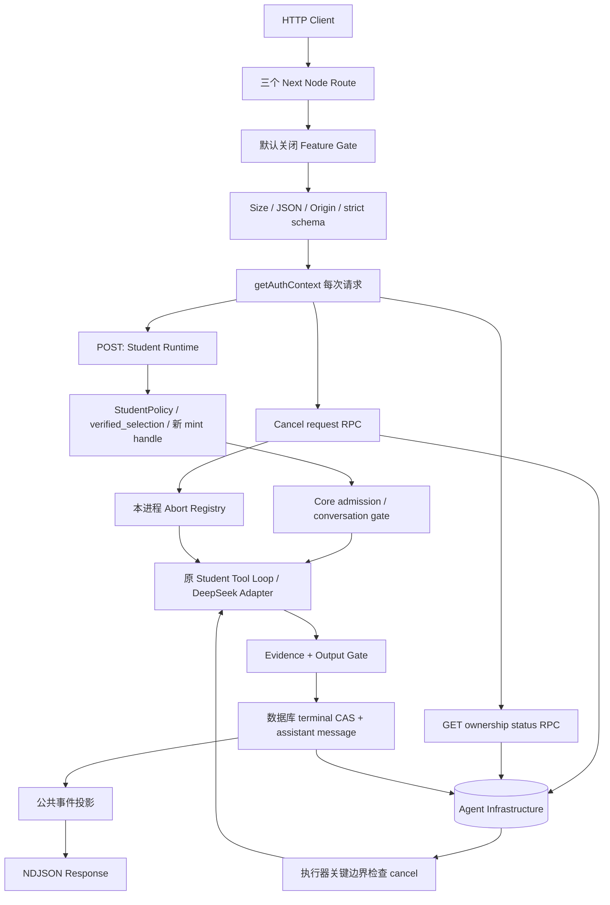

# UPLY Teaching Agent — Build Stage 1D Transport

## 1. Executive Summary

**Overall: CONDITIONAL GO。Stage 1E: READY（仅 UI 开发）。Production Enable: BLOCKED。**

已建立默认关闭的 Student AI Teacher 产品传输边界：POST Run、GET 持久状态、POST 持久取消，以及 NDJSON 公共事件和无 UI 的客户端解析器。真实 Next Node App Router 已验证逐帧响应；隔离 PostgreSQL 已验证真实 Student Runtime、增量 RPC、终态竞争、恢复和教学域零写入。

保留 Stage 1C 的核心不变量：`completed` 必须经过可信权限、固定定义、真实模型选择 Lesson Tool、授权执行、revision/segment 对齐、Mandatory Evidence、Output Gate 和 terminal commit。Provider 仍为 DeepSeek `deepseek-v4-flash`，thinking disabled，planning auto，final none。本阶段真实 Provider 请求 **0**。

生产代理、目标 Supabase JWT/PostgREST/RLS 和生产 migration 尚未验证或应用；不能把本报告的本地通过等同于上线许可。Student UI **UNCHANGED**。

## 2. Inputs & Baseline

沿用并阅读本会话七份阶段输入：

- [Current State Audit](/home/yangzhen/projects/my-lms-system/docs/assistant-current-state-audit.md)
- [Architecture v1](/home/yangzhen/projects/my-lms-system/docs/teaching-agent-architecture-v1.md)
- [Stage 0A](/home/yangzhen/projects/my-lms-system/docs/teaching-agent-stage-0a-verification.md)
- [Stage 0B](/home/yangzhen/projects/my-lms-system/docs/teaching-agent-stage-0b-foundation.md)
- [Stage 1A](/home/yangzhen/projects/my-lms-system/docs/teaching-agent-stage-1a-student-domain.md)
- [Stage 1B](/home/yangzhen/projects/my-lms-system/docs/teaching-agent-stage-1b-tools-skills.md)
- [Stage 1C](/home/yangzhen/projects/my-lms-system/docs/teaching-agent-stage-1c-runtime.md)

实现以真实源码优先，其次为 1C → 1B → 1A → 0B → Architecture v1。读取本地 Next `node_modules/next/dist/docs/01-app/03-api-reference/03-file-conventions/route.md`；实际安装版本 **16.2.10**，动态 params 为 Promise。

审计日期 2026-09-14；HEAD `b1672390ae96357a2143358235cc10edeff8d488`。开始时对 **2735** 个 tracked / non-ignored untracked 文件记录 SHA256。规范化 baseline 清单摘要：`6755b33a618231af89b55c506ac22bffbe1f6b1c99ac17311c1e1024bac4b9c7`。基线含既存六个 tracked UI 修改以及以前阶段的未跟踪文件，未覆盖这些工作。

## 3. Files Changed

新增文件共 **17** 个（含本报告）：

| 文件 | 用途 |
|---|---|
| `src/app/api/teaching-agent/runs/route.ts` | 正式 POST 薄 Route |
| `src/app/api/teaching-agent/runs/[runId]/route.ts` | GET 薄 Route、await params |
| `src/app/api/teaching-agent/runs/[runId]/cancel/route.ts` | Cancel 薄 Route |
| `src/features/agent-core/contracts/transport.ts` | 客户端可用的公共事件及状态校验 |
| `src/features/teaching-agent/client/ndjson-parser.ts` | 字节级有界 NDJSON parser |
| `src/features/teaching-agent/server/transport/production.ts` | 真正 getAuthContext 与受控 server composition |
| `src/features/teaching-agent/server/transport/student-handlers.ts` | Intake、HTTP、投影、stream、replay、status/cancel |
| `src/features/teaching-agent/server/transport/run-store.ts` | 独立 ownership/status/cancel RPC 适配 |
| `src/features/teaching-agent/server/transport/active-run-abort-registry.ts` | 进程内取消加速 |
| `src/features/teaching-agent/server/transport/transport-config.ts` | 默认关闭开关和响应头 |
| `supabase/migrations/202609140002_agent_run_cancel_request.sql` | 持久取消、序号、状态读取、CAS 外层保护 |
| `tests/fixtures/teaching-agent/student-transport.mjs` | 真 Runtime + 内存持久化测试组合 |
| `tests/fixtures/teaching-agent/next-transport-composition.ts` | 仅测试进程使用的 synthetic Runtime |
| `tests/teaching-agent-student-transport.test.mjs` | Transport / parser / disconnect 安全测试 |
| `tests/teaching-agent-student-transport-database.test.mjs` | 隔离 SQL + HTTP + 真实 Runtime |
| `tests/teaching-agent-student-transport-next.test.mjs` | 实际 Next App Router HTTP streaming |
| `docs/teaching-agent-stage-1d-transport.md` | 本报告 |

修改既存文件 **10** 个：

| 文件 | 最小必要变化 |
|---|---|
| `src/features/agent-core/contracts/public.ts` | `run.started.replayed?`、`run.failed.retryable?` |
| `src/features/agent-core/persistence/supabase/repositories.ts` | 识别 SQL `RUN_CANCELLED` |
| `src/features/agent-core/runtime/deadline.ts` | 已 abort 时也消费已创建 Promise 的拒绝，避免未处理异常 |
| `src/features/teaching-agent/server/runtime/create-student-ai-teacher-runtime.ts` | 传递可信 onAdmitted / checkCancellation server hooks |
| `src/features/teaching-agent/server/runtime/student-run-coordinator.ts` | 取消边界、admission 回调、严格 selection digest；保留原 Tool loop/gates |
| `tests/agent-core-foundation.test.mjs` | 明确新增公共合同文件无需 server-only |
| `tests/fixtures/teaching-agent/student-domain.mjs` | 同一 disposable DB 的异步 SQL 会话用于真实并发测试 |
| `tests/fixtures/teaching-agent/student-runtime.mjs` | opt-in 第三个 migration、新 RPC 的 synthetic transport 支持 |
| `tests/teaching-agent-student-domain.test.mjs` | 限定原领域只读静态边界；正式 Route 已获本阶段授权 |
| `tests/teaching-agent-student-tools-skills.test.mjs` | 保留 Tool/Skill 静态约束，排除新 Transport/client 专项模块 |

没有修改 Skill、Tool 语义、Persona、模型配置、旧 Assistant/Edge/Guide/Conversation、学生 UI、Growth Toolbox 或 Script Studio。0B、1C migrations 保持原字节。

## 4. Transport Architecture



Route 不实现新的 Agent。教学数据始终使用 `auth.supabase` 的原领域只读 Repository；高权限 client 只送入 Agent Infrastructure repositories / RPC。GET 和 Cancel 不执行 Domain authority 恢复。

## 5. Feature Gate

[transport-config.ts](/home/yangzhen/projects/my-lms-system/src/features/teaching-agent/server/transport/transport-config.ts)：仅 `TEACHING_AGENT_STUDENT_TRANSPORT_ENABLED=1` 或 `true` 启用；缺失、`TRUE`、`yes`、`0`、`false` 均关闭。没有修改任何环境文件、PM2、launcher 或生产配置。

Disabled 返回 404 `RUN_NOT_FOUND`；handler 在认证、课程读取、admission、conversation、usage、Provider 之前退出。测试确认 auth 调用 0、Provider 调用 0、无 persistence 创建；隔离 SQL 的 `agent_runs` count 不变。Next 对未实现 HTTP method 返回 405。

## 6. POST Run Intake

`POST /api/teaching-agent/runs` 使用顶层 JSON：原 strict AgentRequest 字段，加 `selection` 和 `intent`。`studentPostSchema` 直接 extend 原 `agentRequestSchema`，复用 `studentSelectionLocatorSchema`；限制 `agentCode=student-ai-teacher`、lesson scope、`intent=explain_segment`。

顺序：feature → declared size → Content-Type → Origin → 有界实际 body 读取 → UTF-8 / JSON → strict schema → getAuthContext → Runtime 的真实 StudentPolicy / verified selection → admission。

Body 上限 **32768 bytes**；同时校验声明长度和实际读取字节，不只信任 Content-Length。Body / auth 等待有界。Content-Type 仅 `application/json`（可带参数）。禁止 role、tenantId、actor/user authority、model/provider、systemPrompt、allowedTools、定义覆盖等未知字段，包括 selection 内嵌未知字段。

Transport 生成 UUID requestId 与 receivedAt；响应 `X-Request-Id` 可与同响应的 runId 关联。浏览器 requestId 不参与安全判断。45 秒 Runtime deadline 仍从 receivedAt 起算。没有新增第二套 HTTP Map 限流；继续使用 DB conversation admission 和模型/工具预算。

## 7. Authentication / Same-Origin

[production.ts](/home/yangzhen/projects/my-lms-system/src/features/teaching-agent/server/transport/production.ts) 每个 POST/GET/Cancel 调用真正 `getAuthContext`；要求 active、active tenant、student membership。认证依赖由服务端 composition 固定，没有 query/header 测试后门。

Cookie POST 必须提供精确 Origin，匹配请求协议和实际 Host。Next 会规范化 loopback URL，故优先使用 Host 而非 URL hostname。拒绝 absent/null Origin 和 `Sec-Fetch-Site: cross-site`；不采用 `X-Forwarded-Host` 作为 CSRF 权限来源。Cancel 同样检查；它不接受业务 body。

GET/Cancel 重新认证和查当前权限；不同 actor、tenant、invalid/missing ID 统一不可见。未登录 401；权限不足的状态/取消查询隐藏为 404。AuthContext 内部异常不向浏览器输出原始原因。真实代理下 scheme/Host 传递仍须部署验证，不能通过放宽 Origin 绕过。

## 8. NDJSON Protocol

成功 admission 直接返回一个 `application/x-ndjson; charset=utf-8` POST Response，不要求第二条 stream 请求。

Headers：`Cache-Control: no-store`、`X-Content-Type-Options: nosniff`、`X-Accel-Buffering: no`、server-generated `X-Request-Id`。每帧为 `JSON.stringify(projectedEvent) + "\n"`。服务端队列设 256 KiB 上限；慢/断开的消费者触发取消策略，不能无限积压。

序号在每条连接中严格递增。同 Run 的不同 POST（包括 replay）通过数据库 `public_event_seq` 原子保留 **128** 个序号的独立区间，避免重复 seq。允许空洞；这不是完整历史事件日志。不能把两个并发连接的网络到达顺序当成数据库全局事件时间线。

首帧为 `run.started`，仅含公共 envelope、runId、conversationId，以及重放时 `replayed=true`。Student 不发送 `answer.delta` 或 confirmation。

## 9. Runtime Event Projection

[student-handlers.ts](/home/yangzhen/projects/my-lms-system/src/features/teaching-agent/server/transport/student-handlers.ts) 使用 [公共 schema](/home/yangzhen/projects/my-lms-system/src/features/agent-core/contracts/transport.ts) 显式提取字段，丢弃未列字段。

| 事件 | 公开内容 |
|---|---|
| run.started | conversationId、可选 replayed |
| run.status | 现有四个安全 phase |
| tool.status | 服务器重新映射的 opaque UUID callId、state |
| answer.final | 已校验并持久化 text、opaque sourceRefs、completeness |
| run.completed | reported / estimated / unknown usageStatus |
| run.failed | Core safe code、服务端固定 safeMessage、retryable、partial |
| run.cancelled | partial |

不直接序列化 internalRun、Trace、ToolResult 或 PermissionDecision。Provider tool call ID 不原样公开；当前未增加工具展示标签。无未验证 Provider token、reasoning、SQL、原始 Provider error 或内部 evidence ledger。

## 10. Run Status API

`GET /api/teaching-agent/runs/[runId]` 调用 `get_student_agent_run_status_v1`，只查询持久事实。RPC 检查当前 profile / membership / tenant active、student role、actor/tenant ownership 和 student agentCode；服务端再按公共 schema 投影。

返回 protocolVersion、runId、conversationId、status、createdAt、endedAt；completed 才有 finalAnswer / sourceRefs / completeness，failed 才有 safeFailure。最终文本读取 `agent_messages`，sourceRefs 是 1C completion 已写入的值，completeness 来自已持久化 output.checked；不返回原事件或 metadata。

不依赖 ActiveRunAbortRegistry、不返回 authority、tenant/actor、prompt、工具参数、原始 usage 或模型 transcript。不从 row 恢复执行能力。不存在与他人 Run 均 404。

## 11. Cancellation API

`POST /api/teaching-agent/runs/[runId]/cancel`：feature → same-origin / empty body → 新认证 → UUID → ownership RPC。响应仅 `{"result":"accepted"}` 或 `{"result":"already_terminal"}`；不可见为 404。

`accepted` 表示取消请求已持久化，**不表示 terminal 已 cancelled**。用户应继续 GET 查询权威状态。重复 active cancel 幂等；completed / failed / cancelled 均 no-op。Route 不直接写 terminal，不消耗 worker 的 state_version 或 fencing token。

## 12. Active Abort Registry

[ActiveRunAbortRegistry](/home/yangzhen/projects/my-lms-system/src/features/teaching-agent/server/transport/active-run-abort-registry.ts) 按 tenant + actor + runId 索引当前执行 controller。只在新的 admission 注册；replay 不注册、不拥有原执行器。清理由运行结束负责，晚到的已断线 admission 不注册。

Cancel endpoint 只有在 RPC 返回 accepted 后才尝试 local abort。本进程缺失 registry entry 仍可持久取消，因此它是加速器而非权限来源或数据库替代。测试覆盖同进程快速 abort、独立 registry 模拟另实例、replay 断线不取消原 Run。

## 13. Persistent Cancel Semantics

[新增 migration](/home/yangzhen/projects/my-lms-system/supabase/migrations/202609140002_agent_run_cancel_request.sql) 添加 `cancel_requested_at`，并通过 owner/tenant/student guard 的 `request_agent_run_cancel_v1` 在行锁下幂等置位。

`check_agent_run_cancel_v1` 绑定 actor、tenant、run、当前 fence。原 Runtime 在 admission 后、模型调用前、Provider 结果后、Tool 前后、最终完成前检查。另实例取消不会中断本进程正在等待的远端 Provider socket；最迟下一个安全边界停止，既有 deadline 仍生效。

新的公开 transition wrapper 在同一 row lock 下检查：原 status/version/fence 必须匹配，已请求 cancel 时禁止新的正常 transition / completed，允许失败或取消清理。它继续调用私有化的 **原 1C evidence wrapper**，再调用原 0B atomic CAS；原两个 migration 未修改。RPC 对 public/anon/authenticated 全部 revoke，只有 service_role 可执行。

完成先提交：cancel 得到 already_terminal。取消先提交：completed 抛 RUN_CANCELLED，执行器清理为 cancelled。实际两个 PostgreSQL 会话对合法 final completion 和 cancel RPC 进行了并发竞争；另有两种顺序和陈旧 terminal 的断言。没有声称 Provider 远端会立即停算或停止计费。

## 14. Idempotent Replay

保留原 DB admission 的 actor / scope / idempotency key / digest 一致性。同输入返回同 Run，不执行第二轮 Provider。

为防止相同请求正文换一个合法 selection 却错误复用旧答案，Student digest 现在包含规范化 Core request、**服务端验证后的 segmentRef / contentRevision / locale** 和固定 intent。前端 selectedText 仍不能提供权威内容。

Completed replay：`run.started(replayed=true)` → `answer.final` → `run.completed`，答案来自持久状态；usageStatus 保守为 unknown，不重新合计内部 usage。Failed/cancelled replay 返回对应安全 terminal。Active replay 仅 started + 安全 phase 后关闭，前端应 GET；不 attach 旧实例、不伪造历史 Tool events。不同 input 的同 conversation active 请求仍 409 CONVERSATION_BUSY；同 key / 不同 digest 为 409 IDEMPOTENCY_CONFLICT。

## 15. Disconnect / Recovery Semantics

Request.signal 与 ReadableStream cancel 都连接执行 controller。新执行连接断开后，尝试持久 cancel，同时 abort 本地执行；后续模型/工具/最终释放受 signal 和持久边界约束。若 admission 返回太晚，仍尝试记录取消并做原 fenced stop cleanup，不发起模型调用。

状态恢复用 GET，不能根据前端 AbortError 判断终态。数据库 completed 后 socket 写失败不反向修改成功；测试确认断线后 GET 仍 completed。Active replay 的连接关闭不取消原执行器。

清理延续 1C 的有界 stop-only persistence 策略。进程硬崩溃或数据库不可用时，不能保证取消马上落库或 terminal 马上收敛；可能保留最后 running 状态直至后续恢复机制处理。当前没有后台自动重启执行或跨进程 stream attach；GET 诚实返回持久事实。

## 16. Public Privacy Boundary

浏览器输入不是 authority，runId 不是权限。身份来自真实 AuthContext；POST 继续完整 StudentPolicy 和 runtime-local mint；status/cancel 只取得当前 ownership 权限。

错误仅映射 Core 安全代码和固定文案。没有记录 Cookie、Authorization、用户 message、selection 正文、Prompt、ToolResult 或 Provider raw error；本次没有新增 HTTP payload logger。requestId/runId 通过响应关联，既有持久 trace 仍留在服务端，未新增公开 trace endpoint。

公共 sourceRefs 限定为 opaque `ta1:*:<digest>`；不发送表名或教学资源 UUID。conversationId/runId 是明确授权的公共 locator。

## 17. Client NDJSON Parser

[ndjson-parser.ts](/home/yangzhen/projects/my-lms-system/src/features/teaching-agent/client/ndjson-parser.ts) 只 import Core 公共合同，不 import Runtime/Authority/Repository/Provider/Skill。没有 React Hook 或 UI。

默认单帧 32768 bytes；按 byte newline 分帧，完整一行后 fatal UTF-8 decode，支持多帧 chunk、跨 chunk JSON、韩语字符拆字节、无最后换行。known event 校验 schema、同 runId 和递增 seq；错误 JSON、超长帧、重复 seq、非法 known event 会停止。未知同 major event 可以忽略；未知 major 必须停止。退出时取消并释放 reader。

## 18. Real Next Transport Verification

**PASS：真实 Next 16.2.10 Node App Router + 实际 HTTP 客户端。**

测试在 `/tmp/uply-stage1d-next-*` 创建独立临时应用，链接现有 node_modules，不安装依赖。三个 Route 使用产品文件内容，仅在临时测试副本替换可信 server composition import。认证及 synthetic Runtime 位于测试进程；没有添加 production query/header/env bypass。运行端口独立，结束关闭测试服务。测试配置关闭压缩；实际响应无 Content-Encoding。

最新观测（相对收到 POST Response）：

| 帧 | 到达时间 |
|---|---:|
| run.started | 14 ms |
| run.status | 180 ms |
| tool.status started | 361 ms |
| tool.status succeeded | 542 ms |
| answer.final | 761 ms |
| run.completed | 761 ms |

确认状态/工具帧在 final 前到达，GET 得到相同完成答案，replay 同 Run，HTTP Cancel 后流和 GET 为 cancelled。该次 Next cancel 到 terminal **724 ms**，包括测试 Route 首次编译/调度影响，不是生产延迟承诺。

这项 Next 测试使用 synthetic Runtime，证明真实网络宿主和产品 handler；下面的 SQL/HTTP 测试使用真实 Student Runtime 和真实 migrations。二者不冒充目标 JWT/RLS 端到端证明。生产 Tailscale HTTPS proxy streaming **PARTIAL / 未验证**，未为测试打开线上开关；X-Accel-Buffering 本身不能保证所有代理不缓冲。

## 19. Teaching Domain Side-Effect Verification

真实 Student Runtime、真实 Supabase SDK 仓储和三个 migrations 在隔离 PostgreSQL 中，经 HTTP POST / NDJSON / GET / Cancel 测试。Provider 仅 fake SSE，通过实际 DeepSeek Adapter 解码，不访问公网 Provider。

**23 张教学相关表 before == after**，包括 learning_agent_sessions/messages/node_attempts/task_events、lesson_progress、digital_textbook_node_progress 等。测试只在自建 synthetic fixture 中临时撤销并恢复 membership 来验证权限，最终哈希一致；没有真实用户/课程数据操作。

规范化 before/after 哈希清单 SHA256：`3c5fb4ec78acb92f757937b4679f347a4aec8a64d3a7bf17d57f0f13bfb27718`。Teaching Domain Writes by Transport/Runtime = **0**。允许变化的只有 Agent conversations/messages/runs/events/usage 及 cancel/sequence metadata。另实例取消测试该次 **530 ms**（Provider 人工释放到安全边界，不是跨实例任意远端调用的延迟保证）。

## 20. Database / Migration Status

新增增量：`202609140002_agent_run_cancel_request.sql`。

| 对象 | 职责 |
|---|---|
| agent_runs.cancel_requested_at | durable cancellation fact |
| agent_runs.public_event_seq | 同 Run 各 POST 的无重叠事件序号区间 |
| student_transport_guard（private） | active student owner guard |
| get_student_agent_run_status_v1 | 最小持久状态 projection |
| request_agent_run_cancel_v1 | 行锁、ownership、幂等取消请求 |
| check_agent_run_cancel_v1 | 当前执行 fence 的取消边界读取 |
| reserve_student_agent_event_sequence_v1 | 原子保留 128 序号，不改执行 state_version/fence |
| transition_agent_run_v1 wrapper | 取消与完成的 DB 裁决，保留原 Evidence/CAS |

Isolation：缓存的 PostgreSQL 镜像，自建唯一容器、无网络、无 host bind/公开端口、read-only root + tmpfs，测试后删除该容器。所有 migration 仅应用这个 disposable synthetic 环境。

Production migration **NOT APPLIED**。Shared development migration **NOT APPLIED**。旧两份 migration 未改。上线前必须应用并验证三份 Agent migrations；本阶段没有授予部署许可。

## 21. Target Supabase Status

**G-D16 / G-C15: PARTIAL。**

本轮没有获得已确认非生产、可销毁、synthetic user/tenant 的目标 Supabase 环境，因此没有运行真实 JWT/PostgREST/RLS 集成，也未把生产环境当测试场。隔离 fixture 使用真正 Supabase SDK + SQL-backed PostgREST subset 适配器；它不等同真实 PostgREST 服务或 JWT claims 链路。

可以进入 Stage 1E UI 开发；production deployment 仍被此 gate 和迁移/代理验证阻塞。

## 22. Security Review

| 边界 | 结论及证据 |
|---|---|
| Browser authority forgery | strict schema 拒绝顶层/嵌套越权字段，完整 StudentPolicy 保留 |
| Cookie CSRF | POST/cancel 必须 Origin；不把 CORS 当权限 |
| Multi-tenant ownership | AuthContext + SQL owner/tenant/active student guard；他人/不存在统一 404 |
| Privileged client | 仅传 Agent repositories/store；Domain Repository 用 auth.supabase |
| Cancellation ownership | 持久请求先于 local abort，异实例可见，未直接写 cancelled |
| Terminal integrity | 原 Evidence/Output/terminal commit 顺序保留；新 wrapper 不绕过旧 gate |
| Replay | DB digest + verified selection；无新增 Provider；replay 断线不影响原 worker |
| Private data | 公共 allowlist projection，安全错误重建、callId 重映射，无 trace API |
| Resource bounds | 32 KiB intake/frame、256 KiB stream queue、原 45s/模型/Tool budget |
| Client import boundary | parser 仅依赖 Core 公共合同；无 server imports / UI |
| Test isolation | DI 仅 handler factory / 独立 Next composition，无产品认证后门 |

剩余限制：不能保证进程崩溃后的自动 terminal 收敛；没有分布式 HTTP rate limiting；跨实例取消正在执行的 Provider 只能等返回或 deadline；真实代理 Host/scheme/压缩与目标 RLS 未验。这些没有通过放宽权限或绕过 Stage 1C 处理。

## 23. Tests

最终验证 **247 个 distinct tests PASS**，Stage 1C live test **1 SKIP**（按默认关闭，未调用 Provider）：

- Core + Stage 1A/1B/1C 回归、隔离 DB、首批 Stage 1D：244 tests，243 PASS、1 live SKIP。
- Stage 1D handler/parser 最终集合：41 PASS（其中 39 已计入上项，另补真实初始 context pending abort、late admission cleanup 两项）。
- Stage 1D 隔离 SQL + HTTP +真实 Runtime：1 PASS。
- Stage 1D 实际 Next Node HTTP stream：1 PASS。

覆盖 strict intake、413/415/400/401/403/404/405/409、feature-off 零创建、Origin、未知资源、跨 actor/tenant、当前 membership 撤销、final/failed/status、active/completed replay、duplicate cancel、三个已 terminal no-op、规划/工具/final/context 阶段断线、晚到 admission、完成后断线、异实例边界、实际 PostgreSQL CAS race、RPC grants、NDJSON parser 的 framing/UTF-8/version/unknown event 和隐私静态边界。

复现命令（都不启用 live Provider）：

```sh
RUN_TEACHING_AGENT_ISOLATED_DB_TESTS=1 RUN_AGENT_ISOLATED_DB_TESTS=1 node --experimental-strip-types --test tests/agent-core-foundation.test.mjs tests/agent-core-database.test.mjs tests/teaching-agent-student-domain.test.mjs tests/teaching-agent-student-tools-skills.test.mjs tests/teaching-agent-student-runtime.test.mjs tests/teaching-agent-student-runtime-live.test.mjs tests/teaching-agent-student-transport.test.mjs
RUN_TEACHING_AGENT_ISOLATED_DB_TESTS=1 node --experimental-strip-types --test tests/teaching-agent-student-transport-database.test.mjs
RUN_TEACHING_AGENT_NEXT_TESTS=1 node --experimental-strip-types --test tests/teaching-agent-student-transport-next.test.mjs
```

严格 TypeScript：Core + Teaching + 三个 Routes + Next synthetic composition **0 diagnostics**。Target ESLint **PASS**。`git diff --check` **PASS**。

完整项目 `tsc --noEmit --incremental false`：**397 个 PRE-EXISTING diagnostics，27 个文件，全部 docs/evidence**，与 1C 已记录错误规模和范围一致。本阶段未修复这些快照文件。

本地过程记录位于 `/tmp/uply-stage1d-{all-regression,unit-final,db4,next3,typecheck,lint2,full-typecheck}.log`，SQL/Next 摘要为 `/tmp/uply-stage1d-{db,next}-results.json`；这些是可重新生成的本地测试材料，不是生产观测记录。

## 24. Gate Matrix

| Gate | Status | Evidence / Limit |
|---|---|---|
| G-D1 Feature Gate | PASS | exact enable allowlist、disabled auth/DB/Provider 零继续 |
| G-D2 Strict POST Intake | PASS | 复用 Core / Selection strict schemas、真实 byte cap |
| G-D3 Same-Origin / Auth | PASS | 真实 getAuthContext composition，Origin；目标部署链路见 D16 |
| G-D4 NDJSON Framing | PASS | 每行 JSON、UTF-8、单 POST、parser 边界测试 |
| G-D5 RuntimeEvent Public Projection | PASS | allowlist schema、错误重建、无 raw trace/tool |
| G-D6 Status Ownership | PASS | SQL 当前 active student + actor/tenant；重新认证 |
| G-D7 Persistent Cancel Request | PASS | 新 RPC、行锁、幂等，三个 terminal no-op |
| G-D8 Local Abort Propagation | PASS | 本进程 accepted 后 abort；HTTP Next cancel |
| G-D9 Cross-instance Cancel Semantics | PASS | 独立 registry + SQL fact + Provider/Tool/final 检查 |
| G-D10 Idempotent Replay | PASS | 同 Run、模型增量 0、active 不 attach、selection digest |
| G-D11 Terminal CAS Authority | PASS | 两实际 SQL 会话竞争、新 wrapper、原 gates 保留 |
| G-D12 Disconnect Recovery via Status | PASS | abort 后 cancelled；已提交 completed 不倒退 |
| G-D13 Public Privacy Boundary | PASS | authority/trace/prompt 不输出，client/server import 检查 |
| G-D14 Teaching Domain Zero Writes | PASS | 23 表最终哈希一致 |
| G-D15 Real Next Transport Streaming | PASS | 实际 Next Node 逐帧；production proxy PARTIAL |
| G-D16 Target Supabase Integration | PARTIAL | 无已确认 disposable JWT/PostgREST/RLS 目标 |

D1–D14 PASS，D15 满足真实 Next Node；D16 按任务允许保持 PARTIAL 进入 UI 开发。**不构成生产许可。**

## 25. Architecture Deviations

1. 三个 Route 共用一个紧凑 handler factory，未机械拆成很多仅转发的文件；具体职责见章节 4–17。
2. 新增 status/cancel/sequence Infrastructure RPC，而不是通过 DB row 伪造 RunAuthority。所有调用均为 service-only，并在入口和 SQL 约束 ownership。
3. replay 从公共持久状态生成短序列，使用保守 unknown usage；不回放内部 trace 或重新调用模型。
4. 持久序号预留 128 一组，可有空洞，避免跨 replay 重复 seq；不是完整 event-store/reconnection cursor。
5. Student 请求 digest 纳入已验证 selection pins，防止 locator 改变造成错误重放；不改变 Skill/Tool 内容或权限语义。
6. Runtime 仅增设 server lifecycle/cancel hooks，started 在成功 admission 后释放，然后进入原运行状态和逻辑；Core generic coordinator 未改。
7. Next 测试和真实 Runtime/SQL HTTP 测试分开证明两类边界；生产代理和真实目标 Supabase 仍明确未验。

## 26. Remaining Stage 1E Blockers

**进入 Stage 1E UI 开发无未完成的 D1–D15 阻塞。** 当前未实现 UI，本阶段也未开始实现。

后续生产启用仍要求：目标 Supabase synthetic JWT/PostgREST/RLS 集成 PASS；三份 Agent migrations 应用并验证；真实 Tailscale HTTPS 入口的 streaming、Origin/Host/scheme、压缩/缓冲和断线行为验证；单独 Deployment Gate 批准。不要在 UI 阶段顺手开启生产 feature。

既有限制继续保留：verified_current 未获产品验证、prerequisite_completed / previous_completed 未实现、无后台崩溃恢复 worker、无长期 memory、无写 Tool。这些不是本阶段新增能力或伪装为已完成。

## 27. Final Recommendation

**CONDITIONAL GO；Stage 1E READY，仅 UI integration。** 默认产品行为不变，停在 Stage 1D。

| 必答问题 | 最终答案 |
|---|---|
| 正式 POST endpoint | `/api/teaching-agent/runs` |
| 默认启用？ | 否，DEFAULT OFF |
| 浏览器提交 authority / role / tenant？ | strict intake 拒绝 |
| started 后失败如何表达？ | HTTP 200 中发送 safe run.failed / run.cancelled |
| answer.delta？ | 没有 |
| answer.final 时机？ | Evidence + Output Gate + 最终消息/terminal 持久化之后 |
| run.completed 时机？ | terminal commit 成功之后 |
| GET 重新认证？ | 是，每次独立 getAuthContext |
| 他人 Run 可查询？ | 否，与不存在一样 404 |
| Cancel 持久化？ | 是，cancel_requested_at / RPC |
| Cancel 只依赖内存？ | 否，registry 仅加速 |
| 跨实例取消？ | 持久事实；原 worker 在安全边界检查并停止 |
| 断线恢复？ | GET 状态，completed 不因 socket 失败逆转 |
| Replay 再调模型？ | 否，Provider 增量 0 |
| Internal trace 暴露？ | 否 |
| Teaching Domain Writes | 0 |
| Live Provider Requests | 0 |
| Target Supabase | PARTIAL |
| Real Next streaming | PASS；生产 proxy 未验证 |
| Stage 1E | READY（开发），生产仍 BLOCKED |

最终文件保护：2735 个 baseline 文件中，只有章节 3 列出的 **10** 个授权基础设施/测试文件改变，其余 **2725** 个 SHA256 完全一致；新增 **17** 个文件。既存六个 tracked UI 修改保留，未更改环境/生产配置或旧 migration。`git status` 仍包含开始前已有工作；不能把所有 untracked 文件误算成本阶段新增。本阶段未 commit、未部署、未执行生产 migration、未进入 Stage 1E。
