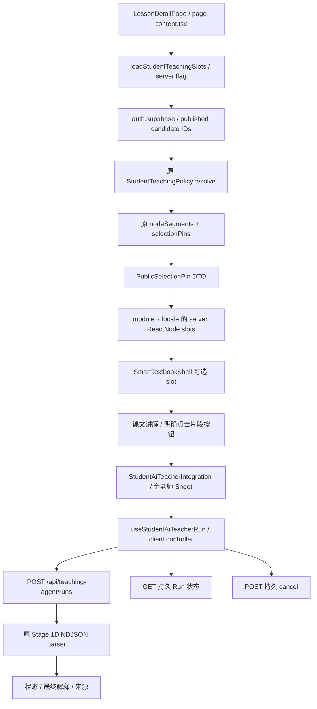

# UPLY Teaching Agent — Build Stage 1E Student UI

## 1. Executive Summary

**Overall: CONDITIONAL GO。Student MVP UI: READY（开发验证）。Production Enable: BLOCKED。**

已将“明确选取已发布韩语片段 → 解释这句话 → 金老师面板 → 最终解释与来源 → 取消/重试/断线恢复”接入韩语一级课堂。没有通用聊天、输入框、自动选择当前句子或旧 Agent fallback。模型、Tool、Skill、Runtime、Transport、数据库 migration 均保持 Stage 1D 的原实现。

实际 Next App Router + Chromium 验证 UI/网络交互；UI controller + 真实 Student Runtime + 隔离 PostgreSQL 验证了 23 张教学表前后哈希一致。Live Provider Requests **0**。生产 Feature Flag 保持 **OFF / 未修改**，目标 Supabase、生产代理仍 **PARTIAL**。

## 2. Inputs & Baseline

沿用本会话已经完整阅读的 Phase 0、Architecture v1、Stage 0A/0B/1A/1B/1C，以及完整的 [Stage 1D 报告](/home/yangzhen/projects/my-lms-system/docs/teaching-agent-stage-1d-transport.md)。本次按真实源码优先重新核对 Runtime、Transport、公开合同、selectionPins、StudentPolicy 和课堂 Server Loader。读取本地 Next 16.2.10 的 Server/Client Components、ReactNode slot 和 Lazy Loading 指南；使用本地 ui-ux-pro-max 技能检查焦点、错误恢复与移动端交互，没有建立新设计系统。

日期：2026-09-14。HEAD：`b1672390ae96357a2143358235cc10edeff8d488`。暂停发生在本阶段实际修改前；恢复时重新确认 workspace，记录 **2752** 个 tracked / non-ignored untracked 文件的 SHA256。规范化 baseline 清单摘要：`12e107540629ed7d05933c175bc9ceb33bd18f5d74dc330d1a9c9d11a0a7321c`。

开始前六个 Growth Toolbox / Script Studio tracked 修改及以前阶段的未跟踪文件全部保留，不算本阶段修改。

## 3. Files Changed

仅修改两个既存业务文件：

| 文件 | 修改 |
|---|---|
| [page-content.tsx](/home/yangzhen/projects/my-lms-system/src/app/dashboard/courses/[categorySlug]/[subcategorySlug]/[courseSlug]/[lessonSlug]/page-content.tsx) | 一个 server loader import；仅学生、非审阅模式的韩语一级课堂传入安全 slot |
| [KoreanLevelOneSmartTextbook.tsx](/home/yangzhen/projects/my-lms-system/src/app/dashboard/courses/[categorySlug]/[subcategorySlug]/[courseSlug]/[lessonSlug]/KoreanLevelOneSmartTextbook.tsx) | 可选 ReactNode slots prop、解构、当前 module/locale 的一次渲染 |

新增九个文件（含报告）：

| 文件 | 职责 |
|---|---|
| [selection-state.ts](/home/yangzhen/projects/my-lms-system/src/features/teaching-agent/client/selection-state.ts) | 专用 PublicSelectionPin DTO、selection identity、严格请求字段投影 |
| [student-ai-teacher-client.ts](/home/yangzhen/projects/my-lms-system/src/features/teaching-agent/client/student-ai-teacher-client.ts) | 单请求 controller、NDJSON、GET 恢复、取消、幂等、安全 UI 状态 |
| [use-student-ai-teacher-run.ts](/home/yangzhen/projects/my-lms-system/src/features/teaching-agent/client/use-student-ai-teacher-run.ts) | React external-store 订阅及卸载清理 |
| [StudentAiTeacherIntegration.tsx](/home/yangzhen/projects/my-lms-system/src/features/teaching-agent/components/StudentAiTeacherIntegration.tsx) | 选句动作、金老师 Sheet、状态、来源、取消/重试 |
| [selection-projection.ts](/home/yangzhen/projects/my-lms-system/src/features/teaching-agent/server/page-projection/selection-projection.ts) | 复用真实 StudentPolicy 和 segmentation/pin helper |
| [lesson-slots.tsx](/home/yangzhen/projects/my-lms-system/src/features/teaching-agent/server/page-projection/lesson-slots.tsx) | server feature gate、发布候选 ID、用户态授权读、ReactNode slots |
| [teaching-agent-student-ui.test.mjs](/home/yangzhen/projects/my-lms-system/tests/teaching-agent-student-ui.test.mjs) | controller / projection / privacy / 隔离数据库测试 |
| [teaching-agent-student-ui-browser.test.mjs](/home/yangzhen/projects/my-lms-system/tests/teaching-agent-student-ui-browser.test.mjs) | 真实 Next + Chromium 页面测试 |
| [本报告](/home/yangzhen/projects/my-lms-system/docs/teaching-agent-stage-1e-student-ui.md) | Stage 1E 证据、边界与结论 |

没有修改前期 tests、Provider / Model Config、Tool / Skill、旧 Assistant、Guide / Conversation / Edge、教学推进、生产配置或 migrations。

## 4. UI Integration Architecture



大型课堂组件只消费 ReactNode；没有 import Agent 客户端模块、添加 fetch、Prompt 或权限判断。原课堂媒体、Director、黑板、导航逻辑没有重写。

## 5. Server Selection Pin Projection

现有课时 Server Component 已拥有 lesson 和当前已发布教材模块列表。原 `loadSmartDigitalTextbook` 的 opening-node 数据只用于开场配置，并非完整且经过 StudentPolicy 的正文授权投影，因此不直接把它当 Agent 事实。

新 page loader 使用 **当前用户的 SSR Supabase client** 读取候选 teaching lesson / published script version / node **ID**，然后对每个候选和 locale 调用原 `StudentTeachingPolicy.resolve`。复用原只读 Repository 检查 tenant、active student、VIP/access feature、app enrollment、课程与祖先发布状态、独立解锁、教材版本、module、teaching lesson 和发布 node。

通过后调用原 `nodeSegments` / `selectionPins(content, locale, index)`，只公开 DTO 的 lessonId、moduleId、scriptVersionId、nodeId、segmentIndex、locale、expectedRevision、segmentRef、displayText。没有 serialize VerifiedStudentBinding、scope、source ledger 或 RunAuthority，也没有复制 SHA-256 算法。

数据库 UUID locator 沿用 Stage 1D POST schema 所必需的字段；用户/tenant ID 不传入客户端。此版本不附 teachingSessionId：讲解依据明确选取的已发布片段，未声称知道当前播放/保存会话位置，State Tool 的可选性继续由原 Runtime 处理。

边界：最多 16 个候选 module/teaching lesson、32 个 script version / node、128 个公开片段，两种 locale，总读取 deadline 12 秒。只提供含韩语、displayText ≤2000 字符的作者分段单元；不自行切割跨 segment 文字。达到上限后其余片段本版不提供动作；读取失败/超时则隐藏本次可选功能，不放宽权限、不阻断课堂。真实大课程的覆盖率/延迟未在生产测量。

## 6. Student Selection UX

当前 module 的教材正文顶部显示独立的“课文讲解”区域，列出服务端授权投影的韩语片段，每个片段有明确“解释这句话”按钮。是已发布教学脚本的作者分段列表，**不是对现有 DOM 任意拖选，也不是对黑板句子做文本匹配**。

学生点击某个片段的动作即明确选取该片段；不会自动选中第一句、视频当前句或推测 verified_current。两句 A/B 的测试确认展示 B 时发送 B 的 server pins，旧答案即时清除。运行中禁止启动 B，直到 A 的终态被确认。

本阶段既有 segment 可以包含不止一个语法句子；UI 使用完整的已发布授权单元，不重新分句生成新 pin。这是窄 vertical slice 的展示边界。

## 7. Explain Action

入口同时需要 server flag enabled、完整授权成功和有效的 server-generated pins。每个动作可键盘 Tab/Enter、鼠标和触屏使用；没有仅 hover 才能发现的移动端隐形按钮。运行中 disabled 同区域动作，controller 同步检查 active/uncertain 状态，防双击不是只靠 React 下一次 render。

固定请求：`agentCode=student-ai-teacher`、`intent=explain_segment`、`message=请解释这句话。`。无自由输入、模式选择、Provider dropdown 或开放 intent。

`explainRequest` 显式投影字段；displayText 即使被 DevTools 修改，也不影响 request 的 pins，且不会作为 selectedText 或模型事实发送。

## 8. Student AI Teacher Panel

复用项目既有 Base UI `Sheet`，桌面右侧、手机全宽，最大宽度 32rem；内容独立滚动。包含金老师身份、所选片段、公开运行状态、最终解释、依据标记、partial 提示、停止、重试/重新解释和关闭。

无聊天历史、composer、调试面板、技术 ID 或 token 显示。没有假打字动画；最终文本作为普通 React 文本一次性渲染，换行保留，不解析模型 HTML。

关闭 active panel 发起 cancel；若仍不能确认 terminal，页面“查看讲解状态”可重新打开查看，其他选句提交继续禁用。没有静默留下可并行的新解释。

## 9. Kim Persona Presentation

Kim 只作为 UI 名称和教学语气：中文“金老师 / AI 韩语老师”，韩文“김 선생님 / AI 한국어 선생님”。状态、动作、错误和来源文案随现有课堂 locale 切换。

没有生成头像、视频、TTS、3D 素材，也未改变服务端 Persona 或其权限。简洁文字身份避免增加课堂媒体负担。

## 10. Client Transport Hook

`useStudentAiTeacherRun` 用 `useSyncExternalStore` 订阅纯 client controller；React 组件不自行解析 fetch stream。hook 为页面生命周期管理资源，处理 StrictMode 的 effect setup/cleanup 重放，真实卸载后取消请求并清理订阅。

controller 保管当前 selection、runId、conversationId、key、AbortController、有限 GET 恢复状态。字段仅是客户端显示/定位状态，不是身份或执行 capability。没有 Supabase 客户端、权限判定或课堂 action 调用。

## 11. NDJSON Event Handling

必须且已经复用 Stage 1D `client/ndjson-parser.ts`。组件没有第二份 newline parser。只消费公共事件：

| Event | Client 行为 |
|---|---|
| run.started | 记录 Run / Conversation locator，进入准备阶段 |
| run.status | 映射 resolving / retrieving / answering |
| tool.status | 读取本课内容的安全反馈，不显示工具名/参数 |
| answer.final | 保存文本、sourceRefs、completeness，暂不宣告 completed |
| run.completed | 要求已有非空依据的答案，才标 completed |
| run.failed | 清理 provisional answer、映射安全错误 |
| run.cancelled | 清理答案、标 cancelled |

没有 answer.delta 或模拟字符播放。已确认 terminal 后，早先 GET 晚返回的 active 快照不能把 UI 降回 running/recovering；有独立竞态测试。

## 12. Run State Mapping

界面状态为 idle、starting、resolving、retrieving、answering、cancelling、recovering、completed、failed、cancelled；不直接展示后端 RunStatus 或 trace stage。

中文示例：“正在准备讲解…”、“正在读取本课内容…”、“金老师正在整理解释…”、“正在停止…”。恢复仍 active 时显示状态尚未确认，可以再次查看。状态区 `role=status`、`aria-live=polite`、atomic 更新，不只是一个 spinner。

错误固定映射：未登录提示重新登录；busy 提示上一条仍在进行；超时、无法取得课文依据、服务不可用分别给可理解文案。浏览器不显示原 Provider / SQL / 权限错误。

## 13. Final Answer Rendering

answer.final 到达后显示已通过服务端 Evidence / Output / Persistence 的文本；收到 run.completed 才把整体任务标成功。若 final 后出现 failure，清除 provisional answer，不能永久显示成功。

completed 没有答案或 sourceRefs 为空视为协议异常，进入 GET 验证/恢复，而非假造“依据当前课文”。文本最大长度等公共合同仍由原 parser/schema 校验。没有 Markdown HTML 注入或危险 innerHTML。

## 14. Sources & Completeness

sourceRefs 只用于内部依据存在性检查，界面显示“依据当前课文”（韩文对应自然语言）。不展示 opaque hash、表名、UUID 或 evidence ledger。

`completeness=partial` 显示“本次讲解基于部分可用课程内容。”；浏览器测试明确检查此分支。sourceRef 不成为新的 selection pin；重新请求继续使用当前 server-projected DTO。

## 15. Cancellation UX

显式“停止讲解”：调用 `POST /api/teaching-agent/runs/{runId}/cancel`，先进入 cancelling。accepted 只表示已请求；随后 abort 本地 stream 并 GET，由 run.cancelled 或持久状态确认终态。already_terminal 同样 GET，不能把已完成倒退为取消。

run.started 前没有 runId 时只能 abort 该 POST，由 Stage 1D late-admission/disconnect cleanup 处理；UI 保持不确定，不直接假称 cancelled。404/失效授权隐藏为安全错误。

关闭 panel、route/module/locale/版本变化后的卸载都请求 cancel（已获得 id 时）并断开本地执行。卸载的取消使用 keepalive，有界 timeout；浏览器硬退出或网络完全不可用时仍不能保证 HTTP cancel 送达，原 Transport 的断线/deadline/DB 事实继续权威。

## 16. Disconnect / Recovery

同一页面生命周期内保存 runId / conversationId / selection identity。意外 EOF 或网络断开且已知 runId：GET 查询，而不是自动新 POST。默认最多三次 GET，等待间隔 0 / 1 / 2 秒，每次 HTTP 等待有界；无无限后台 polling。

GET completed 恢复文本/来源；failed/cancelled 恢复相应终态；仍 active 则显示待确认并提供“重新查看状态”。dispose 清理恢复计时器和 signal；旧页面的响应无法写进新页面。

**刷新后恢复明确延期**：没有 localStorage/sessionStorage，也没有无账号 namespace 的固定 key；刷新不保存答案、权限或完成事实。符合任务允许的“同一次页面生命周期 + 网络断线 GET 恢复”首版范围。

## 17. Idempotency & Retry

每次明确的新解释生成 UUID key；同一请求在 admission 未知时网络重试复用原 key。已知 failed/cancelled/completed 后用户明确重试或重新解释生成新 key。保留 conversationId 供定位，不展示聊天历史，也不主动把旧 conversation 拼入新请求。

双击或 A active 时点击 B，controller 同步拒绝第二次提交。Active/uncertain 时不允许新 key 绕过旧任务。测试真实 Transport 的 completed replay：第二次 POST 同 key，Provider invocation count 增量 **0**。

## 18. Stale Selection Handling

服务端 version/revision 更新后，原 Runtime 在 POST 重新授权并验证 pins，旧 selection 不会按同 index 自动升级。UI 清空 selection/旧答案，禁用旧 Pins，提示重新选择/刷新课文。

**明确协议限制**：现有 Stage 1C 把 stale 和不可见统一为 FORBIDDEN，Stage 1E 没有修改 Runtime/Error Contract 来猜测拒绝原因。因此文案为“当前内容不可用。课程内容可能已经更新，请重新选择这句话。”，不声称已经确认更新，也不泄漏 enrollment 细节。测试用真实发布内容 revision 变化验证拒绝和清理；浏览器另测 403 的安全展示。

## 19. Route / Lesson Lifecycle

Server slots 按 module + locale 提供，服务器每次渲染给随机 page identity key，避免同浏览器切换账号后复用旧 Agent 状态。客户端 integration 再按 pathname、query 与完整 selection identity 定义子树 key。

lesson/module/chapter/locale/version 改变或离开路由：旧 controller 卸载、尝试持久 cancel、abort、清订阅；新的 UI 以 idle 开始。不会出现 B 展示 A 的 pin/答案。测试包括 A 运行时直接 SPA 导航，未等 A 完成。

面板 Escape 被面板自身消费并返回触发按钮，避免向旧课堂全局 Escape listener 冒泡而折叠原助教区域。Agent 自身没有操作视频时间、暂停/播放、Director 或教学 task events。

## 20. Feature Gate

完全复用 `TEACHING_AGENT_STUDENT_TRANSPORT_ENABLED` 的 server-only 精确 `1/true` 语义。没有新增 NEXT_PUBLIC flag，也不向浏览器暴露服务器 env。

`loadStudentTeachingSlots` 在 flag off 时先返回 undefined，候选数据查询/授权 Pins 读取不会运行；大型课堂组件的 optional slot 无输出。浏览器测试 off 页面无解释动作、无 panel、无 Agent 请求、无 controller 挂载副作用。此结论不是“构建产物完全不含 Agent 模块”的声明；Client module 可以存在于构建图，默认不挂载执行。

本阶段没有修改 `.env`、PM2、launcher、生产开关或线上配置，未打开生产 Transport。

## 21. Client / Server Security Boundary

| 边界 | 证据 |
|---|---|
| Server Pins | 原 StudentPolicy + nodeSegments/selectionPins；浏览器不 hash |
| Public DTO | 显式最小字段，无 actor/tenant/authority/source ledger |
| POST authority | 仍由 Stage 1D AuthContext + 原 Domain Policy 重新 mint |
| Client request | 固定 intent/agentCode/message，displayText 不进入请求 |
| Client imports | 仅公共合同/parser/UI；无 policy/verifier/repository/Tool/Skill/Provider |
| Public errors | 固定中韩文案，不渲染 raw error / trace |
| Recovery | 无浏览器持久化权限或答案；GET 重新认证 |
| Test injection | 仅独立测试 Next composition / Playwright interception，无产品 debug page/header |
| Teaching side effects | Agent 新模块没有旧 respond、tutorReply、课堂 action 或教学写入 |

实际 Next Client chunk 扫描未发现 StudentTeachingPolicy、StudentSelectionVerifier、DeepSeekProviderAdapter、Prompt assembler 或 SupabaseAgentRepositories 实现名；同时有静态 import 断言。TS 类型引用不作为序列化 runtime 能力。

## 22. Teaching Domain Side-Effect Verification

`teaching-agent-student-ui.test.mjs` 的隔离集成路径为：真实 server pin projection → 实际 UI controller → 原 Transport handler → 真实 Student Runtime / DeepSeek Adapter（fake SSE）→ 原 Agent repositories / 三份 SQL migrations。

完成、关闭、取消前后 **23 张教学表哈希一致**；包括 sessions、messages、node attempts、task events、lesson/digital textbook progress 等。未执行课堂 ready、answer、grade、progress/completion 或 unlock。Agent 基础设施可以按既有语义记录 Run/usage/message/cancel。

规范化 before/after 清单 SHA256：`3c5fb4ec78acb92f757937b4679f347a4aec8a64d3a7bf17d57f0f13bfb27718`。结果记录 `/tmp/uply-stage1e-db-results.json`。全部 synthetic，独立无网络/host bind 的 disposable PostgreSQL 容器，测试后清理；未操作生产或共享开发数据库。

## 23. Existing Classroom Regression

既存课堂主体仅新增 prop、解构和一处 optional slot；server 页面仅新增 loader import 和学生分支参数。没有改现有 `loadSmartDigitalTextbook`、Script Runtime、黑板、视频、课堂 Director 或课程导航实现。

运行 **56 项课堂相关测试 PASS**：smart-textbook-sidebar、teaching-video、teaching-blackboard、smart-textbook-runtime-presentation。Core→1D 回归 **245 PASS，1 live SKIP**；原 Tool/Skill/domain 静态只读边界仍通过，不需要改旧 tests 的断言。

浏览器 UI 测试为 synthetic Next 课堂容器，不是生产账号/真实大课时端到端回放。E17 的证据由最小 diff、原课堂测试和零副作用集成组成；不把独立 fixture 宣称为生产全课堂验收。

## 24. Accessibility / Mobile

复用 Base UI Sheet 的 modal/focus 能力，提供明确 title、description、关闭按钮可访问名称。Tab 焦点约束在面板（测试等待 Base UI 下一动画帧完成 focus-guard 回送）；Enter 发起解释，Escape 关闭并返回原按钮；状态/错误使用适当 live region。按钮 min-height 44px，不依赖 hover。

375×812 手机全宽面板、812×375 横屏无横向溢出，关闭可见，内容可滚动；safe-area bottom padding。验证 reduced-motion，面板禁用自身 transition；实际 `.dark` 设计 token 模式单独验证。中韩 UI、partial 来源提示均经过 Chromium 断言。

颜色、圆角、字体和 Sheet 沿用现有语义 tokens；没有新设计系统或纯装饰性英文眉题。课文区域“标题+说明”复用 `CardTitleWithHint`。截图仅 synthetic 夹具，用于检查 UI，不包含真实用户/课程。

## 25. Tests

本阶段验证合计 **328 distinct tests PASS，1 live SKIP**：

| 套件 | 结果 |
|---|---:|
| Stage 1E controller/projection/privacy + isolated SQL | 24 PASS |
| Stage 1E real Next + Chromium UI | 1 PASS |
| Core / 1A / 1B / 1C / 1D 回归（含原 isolated DB） | 245 PASS，1 live SKIP |
| Stage 1D actual Next streaming 回归 | 1 PASS |
| Stage 1D isolated SQL + HTTP transport 回归 | 1 PASS |
| 原课堂 sidebar / video / blackboard / presentation | 56 PASS |

复现主要命令：

```sh
RUN_TEACHING_AGENT_ISOLATED_DB_TESTS=1 node --experimental-strip-types --test tests/teaching-agent-student-ui.test.mjs
RUN_TEACHING_AGENT_UI_BROWSER_TESTS=1 node --experimental-strip-types --test tests/teaching-agent-student-ui-browser.test.mjs
RUN_TEACHING_AGENT_ISOLATED_DB_TESTS=1 RUN_AGENT_ISOLATED_DB_TESTS=1 node --experimental-strip-types --test tests/agent-core-foundation.test.mjs tests/agent-core-database.test.mjs tests/teaching-agent-student-domain.test.mjs tests/teaching-agent-student-tools-skills.test.mjs tests/teaching-agent-student-runtime.test.mjs tests/teaching-agent-student-runtime-live.test.mjs tests/teaching-agent-student-transport.test.mjs
RUN_TEACHING_AGENT_NEXT_TESTS=1 node --experimental-strip-types --test tests/teaching-agent-student-transport-next.test.mjs
RUN_TEACHING_AGENT_ISOLATED_DB_TESTS=1 node --experimental-strip-types --test tests/teaching-agent-student-transport-database.test.mjs
node --experimental-strip-types --test tests/smart-textbook-sidebar.test.mjs tests/teaching-video.test.mjs tests/teaching-blackboard.test.mjs tests/smart-textbook-runtime-presentation.test.mjs
```

新增 Client/Components/Server Projection 的 targeted ESLint **0 errors / 0 warnings**；strict TypeScript 覆盖 Core、Teaching TS/TSX、三个 Routes 与实际 lesson page import graph：**0 diagnostics**。完整项目 typecheck 仍为 **397 个既存 docs/evidence diagnostics / 27 文件**，未修复这些历史快照。

`git diff --check` 及新增文件 whitespace 检查 PASS。Browser/DB 结果在 `/tmp/uply-stage1e-{browser,db}-results.json`，完整日志为 `/tmp/uply-stage1e-*`。本地临时材料可通过测试重新生成；真实 Provider 请求 0，没有新框架/依赖安装。

## 26. Gate Matrix

| Gate | Status | Evidence / Boundary |
|---|---|---|
| G-E1 Server Selection Pin Projection | PASS | 原 Policy + segmentation/reference helper；只读 server projection |
| G-E2 Client Selection State | PASS | 专用 DTO、A/B 显示与 POST pin 一致 |
| G-E3 Explain Action | PASS | 明确点击、固定请求、同步防重复 |
| G-E4 Feature Gate UI | PASS | server OFF 无 slot/挂载/request |
| G-E5 Student Agent Panel | PASS | 真实 Chromium 选句/面板/关闭/状态 |
| G-E6 NDJSON Client Integration | PASS | 复用 Stage 1D parser / real handler |
| G-E7 Runtime Status Mapping | PASS | 安全文案，无技术 trace |
| G-E8 Answer Final Rendering | PASS | final 后等待 completed，异常不假成功 |
| G-E9 Source / Completeness Rendering | PASS | 人类文案、partial、空依据协议异常 |
| G-E10 Persistent Cancel UX | PASS | cancel endpoint + GET/terminal，不是仅本地 abort |
| G-E11 Disconnect / GET Recovery | PASS | 页面内恢复、有限 GET；刷新恢复明确延期 |
| G-E12 Idempotency / Double Submit | PASS | 一次 logical request；未知 admission 同 key；replay 零模型增量 |
| G-E13 Stale Selection Handling | PASS | 真 revision 变化拒绝、清 pins；不猜测 FORBIDDEN 原因 |
| G-E14 Route / Lesson Cleanup | PASS | module/locale/path/pin key + dispose/cancel；SPA 导航测试 |
| G-E15 Client / Server Import Boundary | PASS | 静态 import + actual Next client chunks |
| G-E16 Teaching Domain Zero Writes | PASS | 23 表 before=after |
| G-E17 Existing Classroom Regression | PASS | 两文件最小 diff + 原课堂 56 项 + 零副作用 |
| G-E18 Target Supabase | PARTIAL | 未获得确认的 disposable JWT/PostgREST/RLS 目标 |
| G-E19 Production Proxy | PARTIAL | 未开启生产 Tailscale HTTPS Transport 验证 |

E1–E17 满足本阶段开发验证条件；E18/E19 没有被本地模拟结果替代。Production Enable 继续 BLOCKED。

## 27. Architecture Deviations

- 使用独立“课文讲解”片段列表，以 server-issued 已发布 segment 为选择单元；未在现有每种正文活动 renderer 中散布按钮或按 DOM 文字匹配。
- 原课时 loader 不具备完整授权 Pins，故新增 server page-projection helper，复用原 Domain Policy；**没有新增 Selection API**。
- 通过 ReactNode slot 传入 client integration，大课堂只改三处。组件内复用 Sheet，未机械拆成多个只包一行文字的子组件。
- UI 不附可变化的 teachingSessionId；使用已发布内容的 verified_selection，未宣称 verified_current。
- 首版只支持页面内断线恢复；刷新恢复不持久化，以避免错误账号 namespace。
- 原 Runtime 对 stale / unauthorized 共用 FORBIDDEN，UI 用兼容两种情况的安全文案，不修改 Runtime/Contract 或披露底层原因。
- Pins 查询和数量有明确上限；大课时超限/超时隐藏部分或全部动作，后续性能/覆盖率验证应单独处理。

## 28. Production Readiness Blockers

生产仍须独立 Deployment Gate：

1. 在明确 synthetic、non-production、可销毁的目标 Supabase 验证 JWT/PostgREST/RLS。
2. 三份既有 Agent migrations 的生产应用及验证；本阶段 **NOT APPLIED**，没有新增 migration。
3. 实际 Tailscale HTTPS proxy 的 Origin/Host/scheme、压缩/缓冲、流式和断线验证。
4. 真实发布课时的 Pins 覆盖率/延迟与课堂生产验收，不能用 synthetic UI fixture 代替。

没有开启 flag，没有部署，也没有自动进入 Stage 1F。verified_current、复杂解锁、长期 memory、写 Tool、崩溃恢复 worker 等既有限制保持原状态。

## 29. Final Recommendation

**Student MVP UI READY；Overall CONDITIONAL GO；Production Enable BLOCKED。** 停在 Stage 1E。

| 必答项 | 结论 |
|---|---|
| 学生如何选句 | 当前 module 的已发布韩语片段列表，明确点击“解释这句话” |
| Pin 谁生成 | 服务端原 StudentPolicy 授权后调用 selectionPins |
| 浏览器 hash revision/ref | 否 |
| selectedText 当 authority | 否；displayText 不发入请求 |
| 动作出现时机 | server flag ON 且授权 Pins 可用 |
| OFF UI 是否出现 | 无入口、无 panel 挂载、无 Agent fetch |
| UI endpoint | 仅 `/api/teaching-agent/runs` 及其 GET/cancel |
| 通用聊天输入框 | 无 |
| answer.delta | 无；无模拟打字 |
| 答案显示时机 | answer.final；整体成功等待 run.completed |
| 显示技术 sourceRef | 否 |
| Cancel 持久 endpoint | 是；终态仍由 event/GET 确认 |
| 断线恢复 | 页面内有限 GET；刷新恢复延期 |
| 双击两个 Run | 同步 client gate，未知 admission 重试复用 key |
| stale 处理 | 安全不可用/可能更新文案，清 selection，刷新/重新选择 |
| 切课旧 Run | 取消、断开、清订阅，不显示旧答案 |
| 旧 respond fallback | NONE |
| Teaching Domain Writes | 0 |
| 改变教学状态/媒体 | Agent 路径不调用这些操作 |
| Live Provider Requests | 0 |
| Target Supabase / Production Proxy | PARTIAL / PARTIAL |
| Production flag | OFF，未修改 |
| Student MVP UI | READY（开发验证） |
| Production Enable | BLOCKED |

文件保护：2752 个 baseline 文件中只改变章节 3 的 **2** 个授权课堂 integration 文件，其他 **2750** 个 SHA256 一致；新增 **9** 个文件（含本报告）。原六个 tracked UI 工作保留。没有修改环境/Provider/Runtime/Transport/旧 Agent/教学写路径/前期 migration/已有报告，没有 commit 或部署。
