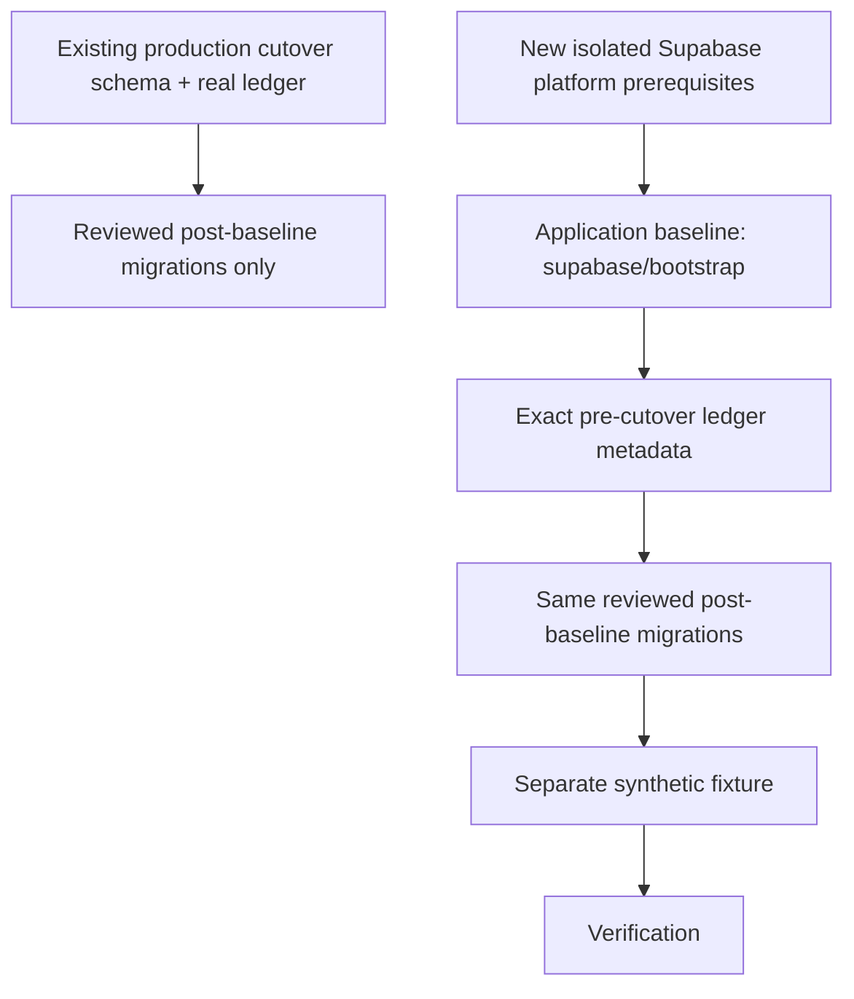

# UPLY Teaching Agent — Stage 1F-R1B Baseline Bootstrap

## 1. Executive Summary

**Overall: GO（仅 R1B 仓库整改 / READY TO PROVISION FULL STAGING）。Stage 1F-R2: READY。Production Ready 仍未成立；未部署、未开 flag、未执行生产 migration。**

本轮建立两个独立路径：现有 production 在真实 cutover schema/ledger 上只执行审阅后的增量；新环境在完整 Supabase 平台前置条件上安装 Application Baseline、精确历史 ledger metadata，再执行相同增量。Baseline 位于 `supabase/bootstrap/`，正常 migration runner 不会误装它。

真实只读复核的 cutover 为 **202609130003 / runtime_authoring_nonretryable_error**；生产 ledger 449 条、Agent 表 0，开始/结束一致。Baseline 从本轮重新导出的 schema-only snapshot 确定性生成；包含四个应用 schema 及必要的平台表应用触发器/策略，不含业务行、Auth 用户或真实教材数据。Secret/data scan PASS。

两份 local-only migration 都有当前产品调用、cutover 对象缺失且无后续替代，因此原字节归档并分别 **REISSUED_POST_BASELINE** 为 `202609140003`、`202609140004`。与三份 Agent migration 组成五步增量序列，两条 disposable 路径均 5/5 PASS。安装前后 normalized app schema 比较均等价。

**Legacy Full-History Replay: KNOWN NON-BOOTSTRAP FAILURE。** 原 `202608190007` 未改，旧链仍因迁移外已发布题库依赖失败；旧 verifier exit 1 与失败证据保留。只有精确对应已知文件、原因、286 个先前成功步骤的失败才由测试 harness 识别为已知限制。没有把历史 replay 改成 PASS。

回归最终结果：**357 PASS / 1 live SKIP / 0 unresolved failures**；完整 production build exit 0。Production Writes=0；Agent 测试 Teaching Domain Writes=0；Live Provider Requests=0；Safe Full Supabase Staging=NOT CREATED。

## 2. Inputs & Baseline

沿用本会话已完整阅读的 Current State Audit、Architecture v1、Stage 0A/0B/1A/1B/1C/1D/1E/1F 与 R1 报告，重新核对本阶段输入、R1 verifier、migration inventory/reconciliation、真实 SQL、fixture loader、业务调用与本轮 target catalog。旧报告和既有证据未回写。事实顺序仍为源码/真实 catalog 优先，R1B 新 bootstrap 合同以本次用户请求为依据。

根 AGENTS.md 已读；本地 Next TypeScript 指南已核对。开始工作区已有课堂、Growth Toolbox、Script Studio 和 Agent 阶段工作，以 **2,620 个 tracked/nonignored 文件 SHA-256** 建立本轮基线（不含 `.next*` 生成目录），不把整个 git status 当作本轮修改。

本轮重新以 READ ONLY / TLS 验证的 schema-only 导出获取 snapshot，并以 `--roles-only --no-role-passwords` 获取 disposable role 前置。只读 catalog 仅 version/name 与 Agent 表元数据；未查询生产学生、progress、题库正文、聊天或成绩行。只读导出和生成器分离，生成器不接受数据库 endpoint。

Snapshot 采集记录时间：`2026-09-14T04:39:15Z`；输入与 artifact digest 见 §7。生成前后及任务结束 ledger 相同；检测到变更会以 `BASELINE_SOURCE_CHANGED` 拒绝，而非继续沿用旧 cutover。

## 3. Files Changed

| 文件 | 本轮改动 |
|---|---|
| [supabase/bootstrap/README.md][readme] | 两条路径、安全边界、离线复现和下一阶段完整 Supabase bootstrap 步骤 |
| [app-schema-baseline.sql][baseline] | 新增确定性生成、schema-only、guarded baseline，不在 migration runner |
| [baseline-manifest.json][manifest] / [migration-ledger-baseline.json][ledger] | cutover、精确 metadata、hash、对象计数、平台依赖、增量清单 |
| [orphan-migration-decisions.json][decisions] | 两份 local-only 的最终 reissue 决策与 archive/hash |
| [build-supabase-app-baseline.py][generator] / [supabase_baseline_lib.py][library] | 本地 snapshot 过滤、确定性输出、顶层 SQL/secret 校验、runner 检查 |
| [verify-supabase-baseline.py][verifier] / [supabase-baseline-catalog.sql][catalog] | 自有离线库 baseline-fresh、target-upgrade、前后等价比较 |
| [verify-teaching-agent-release-migrations.py][legacyverifier] | 保留 full-history/fresh 失败契约；冻结旧 inventory 和 archive hash；clone 使用全部 post-baseline 清单 |
| 两份原 `202609080004/0005` | 从 active runner 移到本轮 archive，原字节不变 |
| [202609140003_teaching_operations_reissue.sql][operations] / [202609140004_completion_policy_management_reissue.sql][completion] | 新 identity、明确 reissue 来源注释；经审阅与验证后保留原业务 SQL body |
| [teaching-operations-db.test.mjs][operationstest] / [completion-policy-management-db.test.mjs][completiontest] | loader 改读新 identity；原权限/行为断言保留 |
| [teaching-agent-release-migrations.test.mjs][inventorytest] | 旧 R1 inventory 在 archive 上继续校验；active 清单按 exact ledger + 增量校验 |
| [test_supabase_baseline.py][baselinetest] | 新增 10 项安全、确定性、race、实际等价及精确已知失败测试 |
| [本报告][report] / 本轮 evidence 目录 | 新增脱敏结果，不覆盖旧阶段档案 |

本轮未改 `src`、tsconfig、Next 配置、Agent Core identity/Runtime/Transport/UI、Rollout、Provider、Tools、Skills、Prompt、StudentTeachingPolicy 或真实课程 unlock。

## 4. Legacy Fresh-History Failure

旧 replay 已再次真实执行：前 286 份成功，第 287 份 `202608190007_seed_korean_chapter_one_pilot_papers.sql` 报错：

```text
韩国语一级第一章正式题库不存在或尚未发布
```

该 SQL 依赖 active platform owner、published `chapter_tests.slug = korean-level-one-01` 和关联 homework plan，而历史 migration 并不自包含创建已发布源稿。在自建无网络临时库补足与 R1 相同的合成 owner 前置后，依赖仍然存在。没有执行 `scripts/seed-korean-level-one-tests.cjs`，没有复制生产教材、跳过此文件或改旧 SQL。

[legacy-full-history-result.json][legacyresult] 记录 verifier **exit 1**、`success=false`、`LEGACY_HISTORY_NOT_SELF_CONTAINED`、失败文件/原因和 287 个步骤。测试 harness 限定完全相同的失败点及原因；提前失败、错误变化或前置 bootstrap 出错均不接受。原 R1 失败证据继续保留。

本阶段起该结果是 **KNOWN FAIL / NOT BOOTSTRAP CONTRACT**；不再是新环境的发布 Gate。历史 migration 本身没有修复。

## 5. Baseline Architecture Decision

旧假设：所有历史 migrations 可从零重放。实际观测：历史 data migrations 依赖人工/脚本先前发布的业务内容。新合同：新环境使用 baseline-based bootstrap；历史 SQL 保留增量演进和审计意义。



Migration history 的“已有库增量演进”和“新环境初始化”是两个不同职责。Baseline 建立新的初始化起点；它不声称新库逐条执行了旧历史，也不改生产 ledger。生产已经处于 cutover 状态，**不需要也不应该应用 baseline**。

## 6. Baseline Cutover

| 观测 | 值 |
|---|---|
| BASELINE_CUTOVER_VERSION | `202609130003` |
| BASELINE_CUTOVER_NAME | `runtime_authoring_nonretryable_error` |
| 开始/结束 production ledger | 449 条，逐条 version/name 完全相同 |
| 开始/结束 Agent 表 | 0 / 0 |
| 原先冲突 Core identity | 继续使用已验证的 `202609140000`，未再改号 |
| cutover 后真实本地清单 | 三份 Agent + 两份经本轮审阅的 reissue，见 §13 |

这些值来自本轮 READ ONLY 观测，不是从 R1 文本硬编码。扫描了全部 active migration 文件，而非只 grep Agent。生成器输入 before/after catalog 必须完全一致，任务最后再次只读校验一致。证据：[production-ledger-safety.json][safety]。

## 7. Application Schema Baseline

来源：本轮真实 production **schema-only custom archive**，排除任何 table data/sequence set/blob data；从 `pg_restore` 对象块确定性筛选，无手工复制几百张表。

| 摘要 | SHA-256 |
|---|---|
| Source schema snapshot | `8f31512aa71bd63aa33f8b5e1acd7f657b27c01981103cecc5d9498178260501` |
| Baseline SQL | `e5de2f48fa40da53ebcae5353aa4907b1738e15998a304a37b3d0fc555c7bac5` |
| 精确 pre-cutover ledger canonical JSON | `cf575d233822934d4f1cd51b69c1eb4c8b358cb6b35c814905fdd4555b4f63bf` |

纳入 `public`、`private`、`recording_private`、`runtime_publish_private`。`public` 由 PostgreSQL 预先提供，其他三个应用 schema 在 baseline 中创建。应用在平台表上的附属对象单独保留：Auth 两个 user/profile 同步触发器、Storage 八条策略、Realtime 两条策略；`ensure_rls` app-facing event trigger 与 `public.live_class_events` 的 publication membership 也保留。

不创建 auth/storage/realtime 平台表、Vault/GraphQL、平台 extensions 或 Supabase ledger 表。Manifest 单独列明平台 extensions/publications；平台应先提供这些依赖，包括 auth.uid/auth.jwt、Storage/Realtime 类型、pgcrypto/uuid-ossp/btree_gist 和 supabase_realtime publication。私有 schema 中 proof_keys 等表只保留结构，**没有 key 行**。

Baseline archive 对象块：188 TABLE、393 FUNCTION、280 TRIGGER、287 POLICY、188 ROW SECURITY、308 独立 INDEX、292 CONSTRAINT、521 FK CONSTRAINT、1 单独 CHECK CONSTRAINT、21 SEQUENCE、8 VIEW、713 ACL、6 DEFAULT ACL、1 EVENT TRIGGER、1 PUBLICATION TABLE、354 COMMENT。这些是 dump 对象块计数；约束建立的索引、内嵌 CHECK、自动 row types 和平台 extension 在 public 中提供的函数另体现在 catalog 计数中，不能混算。

同一 snapshot/ledger/采集时间重复生成，三份产物 SQL/manifest/ledger 字节一致；unittest 再次生成并与版本目录比较。`generatedAt` 固定为采集记录而非每次运行墙钟，随机 pg_dump restrict 标记不进入产物。函数原 body 的字节/换行保留，不格式化历史逻辑。

## 8. Baseline Data / Secret Boundary

**PASS。** 三重证据：输入 TOC 拒绝 TABLE DATA/SEQUENCE SET/BLOB；输出按顶层 SQL token/quote/dollar-body 检查；fresh 安装后实际检查全部 **188 张 app-owned 表计数为 0**。五份增量后再做可回滚合成 Auth→profile trigger 测试，194 张应用表仍全部为空。

顶层业务 INSERT/COPY/DELETE、WITH-DML、setval、任意 DO 数据块均被 data scanner 拒绝；baseline 只允许 schema DDL、session 设置、事务控制与生成器固定的安全 guard。Stored function body 中原有的 INSERT/UPDATE 是函数定义，安装时不执行，不能机械 grep 后当成业务 seed。Schema enum/comment/default 与原函数实现文字可以存在；没有真实课程/学生行或题库内容快照。

Secret 扫描覆盖 baseline、manifest、archive、新脚本/测试/报告和完整 production artifact：常见 private key/API key/JWT/password/connection-string 模式，以及当前本地私密 credential 在内存中的精确值比较。只保存 PASS/数量，不输出值。已成功构建的 323 client chunks 也重新检查 server markers 与 secrets。[扫描结果][scan]

## 9. Migration Ledger Baseline

[migration-ledger-baseline.json][ledger] 只含真实目标 **449 个 version/name**；与本轮开始/结束 catalog 逐条相等。没有 dump/复制 migration `statements`，没有把 `202609080004` 或 `202609080005` 插入 baseline ledger。

新库在 baseline 安装之后写这些 metadata，表示“通过 baseline 达到等效 cutover schema”。随后正常按序执行增量 SQL，只有 SQL 成功后才记录相应增量 version/name。失败会保持非零；不手工 mark 未应用 SQL。

本轮 disposable runner 用 PostgreSQL 顺序执行与 ledger 记录验证该合同；真正 Supabase CLI 与新 full stack 的联动仍属于 R2。目标 schema-only clone 没有历史行，因此在该**临时 clone**恢复 version/name 作为升级测试 fixture；真实 production 有自己的 ledger，不执行这一步。

## 10. Local-only Migration Reconciliation

**两份均 REISSUE_POST_BASELINE；最终状态 REISSUED_POST_BASELINE，无 BLOCKED 项。** 逐对象检查和 hash 见 [orphan-review.json][orphanreview]、[decisions][decisions]。

| 原 migration | 内容及当前引用 | cutover 对象 / supersede | 最终处理 |
|---|---|---|---|
| `202609080004_teaching_operations.sql` | typed curriculum source/publication guards；adopted-template policies；curriculum_plan_assessments；考试派发与学生 roster/cancel guards；执行事实 RPC。`curriculum-plans/api/service.ts:328` 调 get_curriculum_execution，`actions.ts:818` 调 dispatch_curriculum_plan_exam | 表及其 7 个新增函数均不存在；后续 SQL 无替代定义；当前页面仍需要 | 原字节 archive，reissue `202609140003_teaching_operations_reissue.sql` |
| `202609080005_completion_policy_management.sql` | 结课政策 draft/publish、refresh health/retry 四 RPC。`course-completion/policy-actions.ts:22/40/59` 调 save/publish/retry；管理读取路径使用 health | 四个函数均不存在；未发现 superseding migration；当前产品仍需要 | 原字节 archive，reissue `202609140004_completion_policy_management_reissue.sql` |

不是仅换文件名宣布兼容：读取 SQL body、实际调用、目标 catalog/约束、后续迁移；在两条当前 schema 路径实际执行新文件；原有两套 PGlite 权限/行为 tests 也改读新文件并执行通过。

080004 的两项枚举 CHECK 是旧允许值的严格超集，新增 chapter_practice，不排除旧合法值；新增触发器作用于以后写入，不改存量行。考试派发继续检查当前 tenant、app、active enrollment、教师负责范围、未来时间与重复派发；新 roster/cancel guard 不允许静默变更已派发考试。执行事实 RPC 只投影完成度，不输出答案/评分私密内容。

080005 继续要求 authenticated platform owner、Korean/platform course、合法 requirements、advisory lock、不可直接改 published policy、原子替换和有限 retry。涉及的 SECURITY DEFINER 使用空 search_path；public/anon 权限撤销、authenticated 明确 grant 保留。没有扩大 Agent Tool 或 StudentTeachingPolicy 权限。

两个新文件只新增 reissue 来源说明，经过上述审阅后原 body 可保留；archive 对原字节 hash 校验通过。未改旧 SQL 内容；未来生产执行仍需既有生产操作 Gate，schema-only clone 不等于验证所有存量业务状态。

## 11. Active Migration Runner State

当前 active `supabase/migrations/` 为 **454 个唯一版本**：449 个真实 pre-cutover 历史 + 5 个 post-baseline reviewed migrations。没有 pre-cutover orphan。

旧两份 local-only 文件已离开 active runner，保存在本轮 migration-archive 中。R1 Core archive 继续留在旧证据目录；新 active Core 只有一条 CREATE 路径。Baseline 不占用 incremental version，位于独立目录。

静态检查强制：所有 <=cutover 的 active version/name 必须在 exact ledger；所有 >cutover 的文件都必须完整列入 manifest，不能遗漏非 Agent 文件；manifest 校验每份 hash；archive/reissue 必须有闭合映射。旧 R1 frozen inventory 的旧文件逐项在 active/archive 上校验，不改旧报告来迎合新清单。

## 12. Baseline Fresh Bootstrap

**PASS，exit 0。** [baseline-fresh-result.json][freshresult]。

新建自有随机名称容器，cached Supabase PostgreSQL 17.6.1.159 镜像；network none、只读 rootfs、tmpfs 数据、无 host mount/public port。先装 role/schema-only 平台前置，**未恢复 application-owned schema 后冒称 fresh**；再应用带 guard 的 baseline、初始化 exact ledger、五份增量、验证和 synthetic trigger fixture。

该平台前置从受限 snapshot 中抽取 managed schema，仅为 SQL 等价验证提供类型/函数/权限基础；不包含完整 Auth 服务、PostgREST、API gateway 或可供用户登录的 staging。

无 explicit new-environment session opt-in 时拒绝；存在 app objects 时，即使 opt-in 也拒绝 baseline。两条路径均实际做 existing-database negative guard test。没有在生产做 guard/写入测试。

Baseline 安装前后的 manifest/hash 和 ledger 均检查，安装后全部 app 表为空。Synthetic fixture 仅在自有临时库中事务插入 `.invalid` Auth 用户、验证 app profile trigger 后 rollback，不创建真实学生或正式 staging seed。

## 13. Post-Baseline Migration Apply

| 顺序 | Migration | Target upgrade | Baseline fresh |
|---|---|---|---|
| 1 | `202609140000_agent_core_foundation.sql` | PASS | PASS |
| 2 | `202609140001_agent_runtime_completion_evidence.sql` | PASS | PASS |
| 3 | `202609140002_agent_run_cancel_request.sql` | PASS | PASS |
| 4 | `202609140003_teaching_operations_reissue.sql` | PASS | PASS |
| 5 | `202609140004_completion_policy_management_reissue.sql` | PASS | PASS |

Agent 五表、RPC、policies、indexes、triggers 出现，未重复 CREATE。后两份不写 Agent 定义/Run/教学状态，不引入真实课程依赖。新 definition 的 fixture/publication 与真实 Auth 验证仍留 R2。

## 14. Target Clone Comparison

**PASS。** [target-upgrade-result.json][cloneresult]。

A：完整 target schema-only restore + 相同五份增量，**不安装 baseline**。B：仅平台前置 + app baseline + 同样五份增量。两库使用同一受限 snapshot 与无密码 role schema；彼此独立，均清理自有容器。

平台角色适配明确一致：disposable bootstrap postgres 保持 superuser；角色 membership 保留但由 bootstrap postgres 发出，而非 hosted supabase_admin grantor。应用对象 owner、ACL、SECURITY DEFINER、search_path 未因此放宽或忽略比较。

升级路径的 baseline 调用只作为预期拒绝的 guard 测试，事务失败，无安装或 schema 变化。它不属于未来生产升级命令。

## 15. Schema Equivalence

**PASS，cutover 与 post-incremental 两个时点均 0 application differences。** [schema-comparison.json][comparison]；比较 SQL 见 [catalog][catalog]。

| 规范化类别 | Cutover | 五步增量后 |
|---|---:|---:|
| Application schemas | 4 | 4 |
| Relations（含表/view/sequence） | 217 | 223 |
| Tables（含私有 schema） | 188 | 194 |
| Columns | 2,259 | 2,334 |
| Types（含 row/array/extension 类型） | 404 | 416 |
| Constraints / FK | 1,568 | 1,609 |
| Indexes（含约束索引） | 600 | 620 |
| Functions（含 public 中 extension 提供者） | 581 | 601 |
| Non-internal triggers（含 Auth app triggers） | 280 | 287 |
| Policies（含平台表 app policies） | 287 | 292 |
| Default grants | 6 | 6 |
| Views / Sequences | 8 / 21 | 8 / 21 |
| App event triggers / publication memberships | 1 / 1 | 1 / 1 |

比较字段覆盖 tables/columns/type/default/nullability/identity/collation、constraint/FK definitions、indexes、函数完整定义/arguments/results/owner/SECURITY DEFINER/config、trigger definitions/enabled、RLS enabled/force、policy roles/qual/with_check、显式/column/type/schema/default ACL、views、sequence parameters、继承与 publication membership。排序并按名称/签名比较，不含 OID 或随机容器 ID。

Schema-only 比较不能证明真实 JWT、PostgREST schema cache、Auth signup 配置、网络代理或已有生产业务行行为；这些差别明确留给 R2/后续发布 Gate，而不掩盖 schema mismatch。

## 16. Production Upgrade Path

**PASS（只验证 disposable target clone）。** 真实生产不应用 baseline、不初始化 ledger、不改历史已应用 identity。未来只审阅并执行 manifest 的五份 post-cutover 增量，且在执行前再次检查当前目标 ledger/cutover/schema 没有移动。

禁止直接将 bootstrap SQL 放进 migrations，禁止针对生产 `supabase db push` 或 repair/mark。若 release 中出现额外 pending migration、旧本地文件复入 runner、hash 变化，preflight 必须失败重新审阅。

本轮无生产 migration 执行；这份 report 不是生产升级授权。

## 17. Production Ledger Safety

**UNCHANGED。** 开始、snapshot 结束、任务结束三次 READ ONLY 观测均 449 条 version/name，最新仍 `202609130003`，Agent 表仍 0。真实生产 migration/seed/Auth user/definition/Run/teaching state 写入均 0。生产配置保持 OFF，没有 PM2 restart/reload、Tailscale 变更或部署。

生成器只接受本地 snapshot/ledger 文件；verifier 无 URL/外部 target 入参、容器名内部随机生成、所有 DB 命令只针对自有容器。临时 clone 的 ledger metadata 是隔离测试 fixture，不能混称生产 ledger mutation。

## 18. Build Regression

完整 **Next production build PASS**：`next build --webpack`，exit 0，耗时 **98.04 秒**，Build ID `c4MxZUKZDErX3uURPkWy7`。当前源码/配置复制到独立临时目录，复用已安装依赖与私有进程配置；未修改线上 artifact 或任何 `.env`。[build result][build]

三个 Agent Route（POST runs、GET runId、cancel）存在，Student UI client 引用存在。成功 artifact 323 chunks 的 client/server marker/secret scan PASS。`src` 与成功 build 输入一致。

本轮 tsconfig/next.config 无变化：strict=true、ignoreBuildErrors 未启用、active src 1,265 个、docs/evidence Program 文件 0。全项目 tsc exit 0。R1 真实 src 类型错误使完整 build 失败的负向证据仍有效且原样保留；按任务许可未重复该耗时负向 build。

## 19. Rollout Regression

R1 tenant/course/user 服务端 policy 与 UI/POST 共同 gate 没有改动，所有 rollout tests 重跑：global OFF、empty lists、tenant/course/user 拒绝、同 user 不同 active tenant、伪造字段、服务端 lesson→course、实际 page slot projection 和 admission matrix 均 PASS。

OFF 仍禁止新 admission，existing owner-safe GET/cancel 恢复保持；实际独立 SQL/HTTP transport 测试再次验证 cross-instance persistent cancel 和 23 张教学表无变化。actual Next transport、Chromium UI 与课堂 sidebar/video/blackboard/presentation 回归通过。

不声称 process.env 是跨 worker 热更新控制；未修改名单或开启 production flag。

## 20. Security Review

- 数据边界：schema-only input + top-level data scanner + 188/194 app 表空行检查；不复制真实教材/学生记录。
- 目标边界：工具只接受本地 artifact，随机自有 offline DB；拒绝 existing app/ledger 的 baseline guard；没有生产写入工具入口。
- 权限边界：normalized owner/ACL/RLS/function/search_path 比较无差异；两份 reissue 的既有 tenant/teacher/owner 权限 tests PASS。
- Secret/privacy：值比对在内存，报告/evidence 无值；Auth synthetic fixture 为 `.invalid` 且 rollback；artifact 不含真实用户、密码、session 或 migration statements。
- 教学稳定性：本轮无 Agent/Domain/UI/Provider 变更，Agent 集成测试 23 teaching table fingerprints 不变；真实 unlock/课程/Agent definition 未修改。

权限测试是 isolated SQL/PGlite/实际 Next transport 范围，**不是对 full Supabase JWT/PostgREST/RLS 已验证的声明**。

## 21. Tests

| 执行项 | 最终结果 |
|---|---|
| Agent Core DB + Stage1A–1E + rollout/page projection | 285 PASS / 1 live SKIP |
| Active migration inventory（修正本轮测试变量重名后定向重跑） | 1 PASS |
| Original orphan authorization/behavior tests（cached PGlite，无安装） | 2 PASS |
| actual Next transport | 1 PASS |
| actual Next + Chromium browser UI | 1 PASS |
| isolated SQL/HTTP transport + OFF recovery | 1 PASS |
| classroom sidebar/video/blackboard/presentation | 56 PASS |
| Python baseline contracts（含真实 generator、race 拒绝、exact legacy known-fail harness） | 10 PASS |
| **合计最终覆盖** | **357 PASS / 1 SKIP / 0 未解决失败** |
| Baseline-fresh / target-upgrade actual apply | 两路径各 5/5 PASS |
| Cutover/final schema equivalence | 两时点 PASS |
| Full production build / tsc / scoped ESLint / Python syntax | PASS |
| Data/secret/client boundary / git diff check | PASS |

原始首次组合 Node 测试曾因本轮 inventory test 变量 `manifest` 重名而失败；修正该测试后定向重跑通过，其他 285 个已通过测试未反复执行。结果留档保留首次失败与修正说明，不把当次命令写成 exit 0。[test-results.json][tests]

Legacy verifier 自身仍 exit 1；只有精确已知失败的 harness 属于 PASS。新失败不吞掉。DDL/bootstrap 和 reissue 行为测试可在自有隔离库写合成状态；**Agent 测试 Teaching Domain Writes=0、production writes=0**，不是声称所有测试 SQL 都只读。

## 22. Gate Matrix

| Gate | Status | Evidence / scope |
|---|---|---|
| G-R1B-1 Baseline Cutover Identified | PASS | 本轮 target catalog 449 条，cutover version/name |
| G-R1B-2 Baseline Artifact Deterministic | PASS | 重生成 SQL/manifest/ledger 完全相同 |
| G-R1B-3 Baseline Contains No Business Data | PASS | 输入 TOC、顶层 SQL、188 空表 |
| G-R1B-4 Baseline Secret Scan | PASS | 模式 + 实际值内存扫描 |
| G-R1B-5 Pre-Cutover Ledger Manifest Exact | PASS | 449 条逐条匹配，无 local-only 假 applied |
| G-R1B-6 Local-only 080004/080005 Reconciled | PASS | 两份已 reissue，原字节 archive，调用/授权/兼容性证据 |
| G-R1B-7 Active Migration Runner Clean | PASS | 449 exact 历史 + 5 增量，454 unique，无 orphan |
| G-R1B-8 Baseline Fresh Bootstrap PASS | PASS | 新自有 offline DB，baseline+ledger+增量 exit 0 |
| G-R1B-9 Post-Baseline Migration Apply PASS | PASS | 三份 Agent + 两份 reissue，5/5 |
| G-R1B-10 Target Clone vs Baseline Schema Equivalence | PASS | cutover/final 两时点、15 类目录比较无差异 |
| G-R1B-11 Production Upgrade Path PASS | PASS | clone 只装增量，不安装 baseline |
| G-R1B-12 Production Ledger UNCHANGED | PASS | 开始/导出结束/任务结束一致 |
| G-R1B-13 Production Migration NOT APPLIED | PASS | 生产 Agent 表仍0，未执行生产 SQL 写入 |
| G-R1B-14 Production Build Regression PASS | PASS | 完整 build exit0，strict/src 检查保留 |
| G-R1B-15 Rollout Regression PASS | PASS | default deny、UI/POST、tenant/course/user、OFF recovery |
| G-R1B-16 Teaching Domain Zero Writes | PASS | Agent 集成23表fingerprint不变 |
| G-R1B-17 Live Provider Requests Zero | PASS | live测试未开启，无模型请求 |
| G-R1B-18 R2 Bootstrap Package Ready | PASS | artifacts + guards + manifest + offline verifier + README完整staging步骤 |

**18/18 PASS。** Legacy Full-History Replay 单列为 KNOWN FAIL / NOT BOOTSTRAP CONTRACT，不再是 new-environment release Gate；这来自本次明确合同变更，不是忽略未通过的当前 Gate。

## 23. Architecture Deviations

| 旧假设/合同 | R1B 正式变化 | 保留边界 |
|---|---|---|
| 新环境必须从零重放所有历史 SQL | cutover schema baseline + exact ledger + reviewed增量 | 旧SQL/verifier/失败证据保留；不称历史已修复 |
| 两份 pre-cutover local-only 留待发布决定 | 已按当前调用与目标schema审阅，reissue 140003/140004 | 旧版本不记入 production或baseline ledger |
| Agent post-cutover 仅三份 | 经完整目录扫描与业务审阅现为五份增量 | 三份Agent identity/body不改；不新增Agent功能 |
| R1完整fresh FAIL阻止R2 | 新baseline合同的18项Gate全部通过，R2 READY | Production Ready仍需fullstack、课程与运维Gate |

没有静默改变 Runtime、Tool、Skill、Provider、Prompt、Kim persona 权限、memory 或 StudentTeachingPolicy。

## 24. Remaining Blockers

**R1B 仓库级 baseline/bootstrap blocker：无。** 旧历史非自包含依赖仍存在并保留，但不再承担新环境 bootstrap 职责。

Production Ready 仍有后续 Gate：完整安全 Supabase staging 尚未创建；真实 Auth/JWT/PostgREST/RLS 未完成；真实课程现有 policy 覆盖仍 0/1；Tailscale Agent transport、完整 ≤45 秒链路、跨 worker drain/rollback、Provider数据/运营政策仍需独立验证。没有更改真实 prerequisite unlock 或补假脚本使 coverage 变绿。

新 baseline 是 schema-only，**不包含 operational singleton、全局应用目录和授权/definition 配置行**；R2 fixtures 需单独、最小化创建自身所需资源，不得从生产复制业务数据。README 已列明，不把“schema 等价”宣传成“应用开箱即用”。

## 25. Stage 1F-R2 Readiness

**READY — READY TO PROVISION FULL STAGING。** 本阶段 18 项 Gate 全部 PASS，local-only 已闭合、fresh baseline 通过、schema 等价、build/rollout 回归通过。

这意味着下一阶段可以在获得另行明确授权后建立唯一 project name/ports/volumes 的 disposable full Supabase stack。当前只创建过已清理的无网络 PostgreSQL 验证容器；**Safe Full Supabase Staging: NOT CREATED**。没有自动 supabase start、cloud project create、staging seed 或 live Provider test。

可执行交接步骤、artifact检查、平台依赖、CLI迁移次序、synthetic A/B tenant/Auth users/Korean course/immediate lesson/published script、JWT/RLS矩阵及清理要求详见 [README 的 R2 handoff][readme]。禁止复用现有归属不明的 local UPLY stack。

## 26. Final Recommendation

**Overall: GO（R1B 范围），Stage 1F-R2: READY；Production Migration: NOT APPLIED；Production Ledger: UNCHANGED；Feature Flag: OFF。**

新环境采用审阅过的 baseline cutover 和 exact metadata，现有生产只走增量升级。旧 `202608190007` 与其已知失败继续保留，不影响新 bootstrap 路径，不标历史 replay PASS。

最终对照 2,620 文件 SHA-256 基线：仅 6 个既有路径变化（旧 verifier、两个原 SQL 移出 runner、三个测试 loader/inventory）；其余基线文件、历史报告/证据、src 与配置全部不变。git diff --check PASS，所有自有验证容器已清理。

Production Writes=0；Agent 测试 Teaching Domain Writes=0；Live Provider Requests=0。报告交付后停止本阶段，不创建 R2 staging、不部署、不重启、不改生产配置或数据库。

[readme]: </home/yangzhen/projects/my-lms-system/supabase/bootstrap/README.md>
[baseline]: </home/yangzhen/projects/my-lms-system/supabase/bootstrap/app-schema-baseline.sql>
[manifest]: </home/yangzhen/projects/my-lms-system/supabase/bootstrap/baseline-manifest.json>
[ledger]: </home/yangzhen/projects/my-lms-system/supabase/bootstrap/migration-ledger-baseline.json>
[decisions]: </home/yangzhen/projects/my-lms-system/supabase/bootstrap/orphan-migration-decisions.json>
[generator]: </home/yangzhen/projects/my-lms-system/scripts/build-supabase-app-baseline.py>
[library]: </home/yangzhen/projects/my-lms-system/scripts/supabase_baseline_lib.py>
[verifier]: </home/yangzhen/projects/my-lms-system/scripts/verify-supabase-baseline.py>
[catalog]: </home/yangzhen/projects/my-lms-system/scripts/supabase-baseline-catalog.sql>
[legacyverifier]: </home/yangzhen/projects/my-lms-system/scripts/verify-teaching-agent-release-migrations.py>
[operations]: </home/yangzhen/projects/my-lms-system/supabase/migrations/202609140003_teaching_operations_reissue.sql>
[completion]: </home/yangzhen/projects/my-lms-system/supabase/migrations/202609140004_completion_policy_management_reissue.sql>
[operationstest]: </home/yangzhen/projects/my-lms-system/tests/teaching-operations-db.test.mjs>
[completiontest]: </home/yangzhen/projects/my-lms-system/tests/completion-policy-management-db.test.mjs>
[inventorytest]: </home/yangzhen/projects/my-lms-system/tests/teaching-agent-release-migrations.test.mjs>
[baselinetest]: </home/yangzhen/projects/my-lms-system/tests/test_supabase_baseline.py>
[report]: </home/yangzhen/projects/my-lms-system/docs/teaching-agent-stage-1f-r1b-baseline-bootstrap.md>
[legacyresult]: </home/yangzhen/projects/my-lms-system/docs/evidence/teaching-agent-stage-1f-r1b/legacy-full-history-result.json>
[safety]: </home/yangzhen/projects/my-lms-system/docs/evidence/teaching-agent-stage-1f-r1b/production-ledger-safety.json>
[scan]: </home/yangzhen/projects/my-lms-system/docs/evidence/teaching-agent-stage-1f-r1b/secret-scan-result.json>
[orphanreview]: </home/yangzhen/projects/my-lms-system/docs/evidence/teaching-agent-stage-1f-r1b/orphan-review.json>
[freshresult]: </home/yangzhen/projects/my-lms-system/docs/evidence/teaching-agent-stage-1f-r1b/baseline-fresh-result.json>
[cloneresult]: </home/yangzhen/projects/my-lms-system/docs/evidence/teaching-agent-stage-1f-r1b/target-upgrade-result.json>
[comparison]: </home/yangzhen/projects/my-lms-system/docs/evidence/teaching-agent-stage-1f-r1b/schema-comparison.json>
[build]: </home/yangzhen/projects/my-lms-system/docs/evidence/teaching-agent-stage-1f-r1b/production-build-result.json>
[tests]: </home/yangzhen/projects/my-lms-system/docs/evidence/teaching-agent-stage-1f-r1b/test-results.json>
