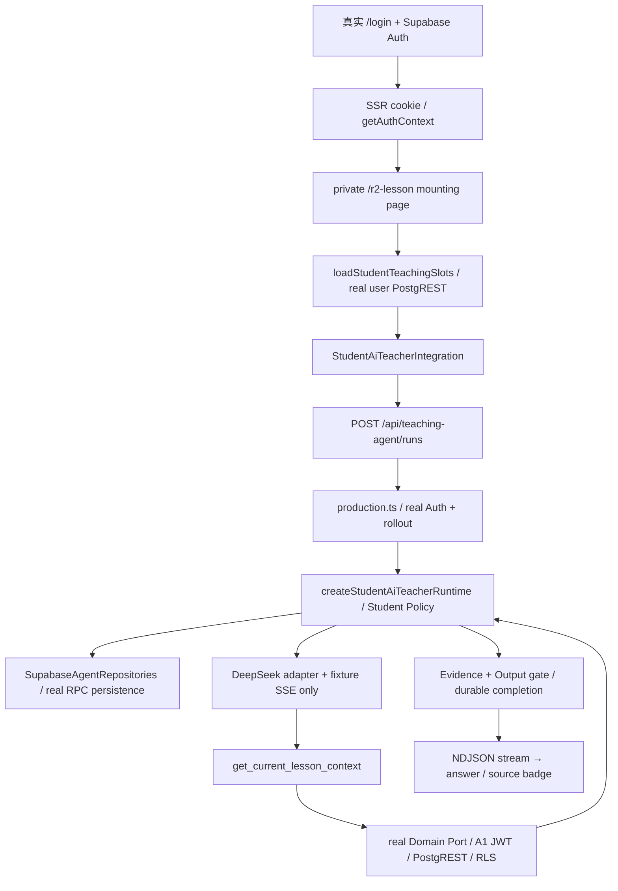

# UPLY Teaching Agent — Stage 1F-R2 Full Supabase Staging

## 1. Executive Summary

**Overall: NO-GO. Stage 1F-R3: NOT READY.**

本轮首次在独立、真实的完整 Supabase 上证明了 synthetic Student Auth → JWT → PostgREST → Student Policy → server pins → Next transport → Student Runtime → Tool/Domain Port → evidence/output gate → persistence 的正向链路。Provider 上游使用受控 SSE fixture；live Provider runs / requests / tokens 均为 **0**。

但 A1 JWT 可直接读取 **Tenant B 的已发布教材 module/script node**，以及节点 configuration 中的 synthetic private metadata / answer-key 标记。依据本阶段第 53 条，这本身构成 NO-GO；应用层拒绝 Explain 不能抵消 REST 直接暴露。另有旧课堂回归失败，不能宣布 production readiness。

4 次完整讲解成功（1 次浏览器点击、3 次 HTTP 样本），1 次持久取消，1 次真实 45 秒 deadline 失败。79 张教学相关表在 Agent 测试窗口前后指纹一致。生产写入 0，生产 migration 未执行、feature flag 未开启；四次只读 metadata 检查均为 ledger 449、Agent tables 0。本次 staging 已全部销毁。

## 2. Inputs & Baseline

输入已阅读：Current State Audit、Architecture v1、Stage 0A、0B、1A、1B、1C、1D、1E、1F、1F-R1、1F-R1B；以及 `supabase/bootstrap/README.md`、manifest、449 条 ledger、orphan decisions 和当前 migrations。上述报告用于理解历史，不替代本轮真实执行证据。

- Cutover：`202609130003_runtime_authoring_nonretryable_error`。
- Baseline SHA-256：`e5de2f48fa40da53ebcae5353aa4907b1738e15998a304a37b3d0fc555c7bac5`。
- Legacy full-history replay 保持 **KNOWN NON-BOOTSTRAP FAILURE**；本轮没有试图修复旧历史。
- 新环境路径：真实 Supabase platform → byte-exact app baseline → 449 metadata → 5 incrementals → synthetic fixture。
- 生产未来路径仍为现有 cutover schema + reviewed incrementals，不能在生产安装 baseline。
- 调查及测试日期：2026-09-14，Asia/Seoul。中断后先检查存活资源再继续清理，没有假设上一次销毁已执行。

## 3. Files Changed

本阶段只新增下列文件/目录；开始前的 2646 个文件摘要逐一复核，**原有文件改动 0、删除 0**。工作区原本已有大量前序阶段改动，未将其计成本轮新增。

| 新增路径 | 用途 |
| --- | --- |
| `scripts/teaching-agent-r2/staging.py` | 唯一 identity、硬 guard、CLI、真实 baseline / ledger / migration bootstrap |
| `scripts/teaching-agent-r2/auth.mjs` | synthetic Auth admin create 与真实 password login |
| `scripts/teaching-agent-r2/seed.py` | schema-native 合成租户、课程、节点、session |
| `scripts/teaching-agent-r2/integration.mjs` | JWT REST visibility、Policy、pins、definition 检查 |
| `scripts/teaching-agent-r2/ports.mjs` | 真实 Domain Ports 与 DB manifest digest mismatch 拒绝 |
| `scripts/teaching-agent-r2/provider-fixture.ts` | 仅替换 Provider HTTP/SSE，不替换 Runtime/Policy/Ports |
| `scripts/teaching-agent-r2/next.py` | 不复制 `.env` 的源码副本、build、private UI mounting、Next 进程 |
| `scripts/teaching-agent-r2/browser.mjs` | Chromium 登录、UI、真实 transport、取消/重放/deadline |
| `scripts/teaching-agent-r2/observe.py` | metadata、79 表指纹、按资源归属 cleanup |
| `scripts/teaching-agent-r2/README.md` | 一次性复现顺序、证据与清理边界 |
| `tests/test_teaching_agent_r2_staging.py` | 4 个纯 guard tests，多种碰撞/非本地输入拒绝 |
| `docs/evidence/teaching-agent-stage-1f-r2/` | allowlist 脱敏证据及 UI screenshot |
| `docs/teaching-agent-stage-1f-r2-full-supabase-staging.md` | 本报告 |

没有修改业务源码、schema、RLS、现有 migration、baseline、tsconfig、依赖、生产配置或已有文档。临时 Next 源码副本的 Provider seam、测试页面和进程 watcher 随 staging 一起删除。

## 4. Staging Isolation

Project / Compose identity：`uply-agent-r2-42daabf66a7a`。Marker：`uply-teaching-agent-r2-disposable-v1`。Cleanup owner：Stage 1F-R2 harness。

API 使用 33389，DB 使用 48467，Next 使用 44975；均与当时已有 UPLY / koflow 端口隔离。Shadow 59511；Studio/SMTP/Analytics 未启用。单独的 network，DB/storage 两个独立 volume；资源均带匹配 project label。

Next 只绑定 `127.0.0.1`。**Supabase CLI 的 API/DB 映射实际绑定 `0.0.0.0` / IPv6 wildcard**，不能将其描述为 loopback-only 服务；请求目标均强制使用 loopback，且 identity/JWT 与其他 stack 分离。本轮未测试外部网络可达性。未来重建宜进一步约束本机暴露面。

未复用、停止、reset 或清理现有 UPLY、koflow、其他项目 stack。证据：[stack-result.json](evidence/teaching-agent-stage-1f-r2/stack-result.json)。

## 5. Production Target Guard

`staging.py:public_production_identity / guard / load / sql` 只抽取生产 public URL/ref 元数据用于比较，要求唯一 marker、project 命名、loopback URL/port/DB host。DB SQL 操作额外核对 Docker project label 和 port binding。

生产 URL / ref / DB host 冲突、错误 marker、错误 port、非本地 URL 均在写入前拒绝。4 个纯单测通过；运行时正向 guard 与负向拒绝通过。Auth/Next/Provider harness 再检查 staging state 与实际 URL 一致。生产密钥未复制给 staging。

生产只读 metadata 检查复用既有 `/tmp/uply-stage1f-readonly.mjs` 封装；其认证细节未导出、未注入 staging。没有生产 SQL 写入、Auth 写入或业务数据查询。

## 6. Full Supabase Stack

工具：Supabase CLI 2.109.1、Docker 29.7.1、Compose 5.3.1；使用已安装工具及缓存镜像，未安装或升级 dependency。

| Service | 实际镜像 | 运行证据 |
| --- | --- | --- |
| storage | storage-api:v1.62.5 | healthy |
| rest | postgrest:v14.14 | running + real REST |
| realtime | realtime:v2.112.6 | healthy |
| auth | gotrue:v2.192.0 | healthy |
| kong | kong:2.8.1 | healthy |
| db | postgres:17.6.1.143 | healthy |

Auth、Storage、Realtime、Kong、DB 的 container health 为 healthy；PostgREST 镜像没有 Docker healthcheck，实际 REST 请求证明可服务。真实 Auth triggers、Storage policies、Realtime schema/publication 均保留。Studio/Meta/SMTP/Analytics/Vector/Edge Runtime/Imgproxy 排除，不影响本轮必需服务。

这不是 SQL bridge：Supabase JS 通过 Kong HTTP 到真实 Auth/PostgREST，PostgREST 验证 JWT 并执行数据库 RLS。

## 7. Baseline Installation

安装前应用表 0；`uply.bootstrap_mode='new-environment'` guard 启用。baseline byte digest 与 manifest 一致。补齐真实 platform 缺少的 `btree_gist` 扩展（public schema），没有删除 baseline object。

实际平台兼容性差异：CLI 镜像中的 `postgres` 默认 **NOSUPERUSER**。第一次 baseline transaction 因 PostgreSQL event-trigger ownership 规则失败并回滚，应用表仍为 0。原因是 superuser event trigger 必须调用 superuser-owned function，而 baseline 保留 function owner `postgres`。

修正仅发生于新环境 bootstrap：临时将 postgres 设为 SUPERUSER，以 postgres 安装原样 DDL，在 `finally` 中恢复原属性。**增量迁移、Auth、学生 JWT/Domain 测试开始前已恢复 NOSUPERUSER**，actual catalog 再确认 false。没有 Student 管理员伪装、disable RLS、Domain service-role fallback。

第二次成功；重复安装被 `BASELINE_REFUSES_EXISTING_APPLICATION` 拒绝。R1B 的 stand-in PostgreSQL 没有覆盖这个完整平台角色差异，报告明确保留。

## 8. Migration Ledger

449 条 version/name 与 `migration-ledger-baseline.json` 精确一致；五份增量按 manifest 顺序加入后 staging ledger **454**，与 expected array 精确相等。

Baseline ledger metadata 不代表重放历史 DDL。生产 ledger 四次检查均为 449 且完全相同。证据：[bootstrap-result.json](evidence/teaching-agent-stage-1f-r2/bootstrap-result.json)、[production-safety.json](evidence/teaching-agent-stage-1f-r2/production-safety.json)。

## 9. Post-Baseline Migrations

| Migration | SHA 与 manifest | Apply |
| --- | --- | --- |
| `202609140000_agent_core_foundation.sql` | exact | exit 0 |
| `202609140001_agent_runtime_completion_evidence.sql` | exact | exit 0 |
| `202609140002_agent_run_cancel_request.sql` | exact | exit 0 |
| `202609140003_teaching_operations_reissue.sql` | exact | exit 0 |
| `202609140004_completion_policy_management_reissue.sql` | exact | exit 0 |

全部通过才开始 Auth/seed。未新增第六份 migration。Agent 五表、RLS/force 属性、indexes、policies、grants、SECURITY DEFINER/search_path、cancel/status RPC 已读取 actual catalog。实际 runtime 又验证了 admission、event、usage、terminal persistence 与 evidence/output gate。

证据：[agent-catalog.json](evidence/teaching-agent-stage-1f-r2/agent-catalog.json)、[agent-postcheck.json](evidence/teaching-agent-stage-1f-r2/agent-postcheck.json)。

## 10. Synthetic Fixture

Tenant A / B active；A1/A2 属 A，B1 属 B；TA teacher、AA tenant admin、PO platform owner；EX enrollment 已过期、IN enrollment paused。A1 enrollment active 且有效，A2 无 enrollment，B1 的有效 enrollment 属 B。

Korean app 使用产品要求的固定 app UUID；tenant app active/enabled。fixture 使用 vip2 与 `korean_course` feature，未放宽 Product Policy。两个租户各有 published category/subcategory → immediate course/lesson → textbook/version/chapter/module → teaching lesson → published script version，另各有 draft script/node。

每租户 8 个 published nodes，正文仅 synthetic `저는 학생입니다.`；使用当前 `teacherVideo.mode=legacy`、localized teacher_script/scriptSegments 形状。configuration 有明确 synthetic private/answer 哨兵用于 visibility 测试；跨租户读取本身已足够确认阻断，不依赖这些字段名的业务解释。

4 个 session：A1 own active、A2、B1、A1 completed。初次 fixture 的 saved phase 为非标准 `explain`，Domain 正确降级 partial；Agent 指纹窗口结束后，仅修正 synthetic setup 为正式 `explanation`，专门重跑两个 Ports 得到 ok。没有将 fixture setup 写入计作 Agent 写入。

所有 Auth email 为 synthetic `.invalid`，无生产行、真实学生账号、真实教材正文。作者数据是 controlled bootstrap fixture，不声称测试了作者发布审批流程。

## 11. Auth Users & Login

8 个用户都由 staging `auth.admin.createUser` 创建，随后真实 `signInWithPassword`，`auth.getUser()` 匹配实际创建的用户。没有仅插 public.profiles 伪造 Auth。

A1 在 Chromium 使用未改动的产品 `/login` 页面输入 synthetic 账号密码，收到真实 Auth token 响应并形成 SSR cookies。其余角色通过实际 Supabase SSR client password login 获得 cookie session 后加载页面/请求 API。

错误密码拒绝；无 session 的 `getUser()` 拒绝；ON 状态 Student POST 无登录返回 401。证据：[auth-result.json](evidence/teaching-agent-stage-1f-r2/auth-result.json)、[browser-result.json](evidence/teaching-agent-stage-1f-r2/browser-result.json)。

## 12. JWT / Claims

正向 JWT 来自真实 Auth：`role=authenticated`、aud authenticated、sub 对应 A1、issuer 为本地 staging、未过期。报告/证据不包含完整 JWT/cookie。

过期 JWT 负向样本以本地私有测试签名生成，仅用于拒绝检查；真实 PostgREST 返回 401。它不是正向登录或学生身份替代。正向 Domain 查询全部携带真正登录取得的 user JWT。

JWT 并不承担客户端 role/tenant 授权：`getAuthContext()` 读取 profiles 与当前 active membership，StudentTeachingPolicy 再逐次确认 tenant、role、enrollment 和 content ancestors。

## 13. Real PostgREST

SDK 请求经本地 Kong `/rest/v1/*` / `/rest/v1/rpc/*`，没有将 REST 转为本机 SQL bridge。migration 后发送 PostgREST schema reload；repository/query/RPC 正向实际通过，无 PGRST schema-cache 缺表错误。

Teaching repository 的 recorded methods 均为 GET。Transport composition 保留两种 client：用户 SSR client 用于 Domain / rollout / pins；service-role client 只用于既有 Agent infrastructure repositories/store。synthetic fixture/bootstrap 写入有单独身份与阶段。

## 14. RLS Positive Matrix

| 主体 / 对象 | REST / Domain 结果 | 解释 |
| --- | --- | --- |
| A1 own profile / active membership / tenant | 可读取 | 真实 JWT，Policy 身份来源 |
| A1 scope 的 published catalog/content | Policy resolve ok | ancestors、app、enrollment、publication 完整读取成功 |
| A1 own active teaching session | REST 1 row、verify ok | student_id 与 tenant 条件生效 |
| CurrentLessonReadPort | ok | 返回受限的原句/目标等 projection |
| TeachingStateReadPort | ok | 返回 last_saved_teaching_position，phase explanation |
| Server selection pins | 16 pins | 8 nodes × 2 locales |

“正向可读”不意味着所有 SELECT `*` 都安全。负向暴露另列，不能合并成总 RLS PASS。

## 15. RLS Negative Matrix

| JWT | 对象 / case | 返回行 | private/answer 哨兵 |
| --- | --- | --- | --- |
| A1 | learning_agent_sessions / ownSession | 1 | 未见 |
| A1 | learning_agent_sessions / a2Session | 0 | 未见 |
| A1 | learning_agent_sessions / bSession | 0 | 未见 |
| A1 | courses / bcourse | 0 | 未见 |
| A1 | lessons / blesson | 0 | 未见 |
| A1 | digital_textbook_modules / bmodule | 1 | 未见 |
| A1 | learning_agent_script_nodes / bPublishedNode | 1 | 可见 |
| A1 | learning_agent_script_nodes / aPublishedNode | 1 | 可见 |
| A1 | learning_agent_script_nodes / adraftNode | 0 | 未见 |
| A1 | learning_agent_script_versions / adraftVersion | 0 | 未见 |
| A2 | learning_agent_script_nodes / aPublishedNode | 1 | 可见 |
| B1 | learning_agent_script_nodes / aPublishedNode | 1 | 可见 |
| EX | learning_agent_script_nodes / aPublishedNode | 1 | 可见 |
| IN | learning_agent_script_nodes / aPublishedNode | 1 | 可见 |
| TA | learning_agent_script_nodes / aPublishedNode | 1 | 可见 |
| AA | learning_agent_script_nodes / aPublishedNode | 1 | 可见 |
| PO | learning_agent_script_nodes / aPublishedNode | 1 | 可见 |

关键结论：A1 → A2 session、A1 → B session、A1 → B course/lesson 都是 0 rows；A1 → B textbook module 和 published script node 却是 1 row。A1/B1/无或无效 enrollment 用户可直接读到 published node configuration 哨兵。A1 对 draft node/version 是 0 rows。

Actual policies 证据：[rls-policies.json](evidence/teaching-agent-stage-1f-r2/rls-policies.json)。源码对应 baseline：

- `supabase/bootstrap/app-schema-baseline.sql:39838`：node policy 仅沿 published script version 判断。
- `...:39846`：script version SELECT policy 仅 `status='published'`。
- `...:39923`：textbook module 检查 publication/app 可读性，未把教材所属 lesson/course tenant 绑定到当前 tenant。
- `...:41666`：session policy 有 `student_id=auth.uid()` 与 tenant membership。

**RLS Negative: FAIL；Cross-Tenant / private configuration direct visibility: release blocker。** 没有通过隐藏前端或限制 Agent SELECT 字段将此标成通过。

## 16. Application Student Policy

真实 `SupabaseStudentTeachingReadRepository.readAuthorizedContent()`（`src/features/teaching-agent/server/repositories/supabase-student-teaching-repository.ts:42`）核对 profile、Student membership、tenant、course/category/lesson、app/enrollment、unlock、textbook publication、chapter/module、profile feature、teaching lesson/script/node。没有 client role/tenant decision。

A1 verify ok；A2/B1/TA/AA/PO/EX/IN 为 `not_found_or_not_visible`。A1 → A2/B/completed session 拒绝。wrong lesson 拒绝；wrong node、draft/stale version、revision/index 伪造为 stale 或拒绝。HTTP 层 adversarial requests 返回 403，额外 Provider calls 0。

Rollout 名单之外的 enrollment 用户 HTTP 403 主要先由 rollout 拦截；**enrollment 独立有效性结论来自真实 JWT-backed Domain Policy 测试**，未将 rollout 拒绝冒充 enrollment 测试。

## 17. Selection Pin Projection

真实 `projectStudentSelectionPins()`（`.../page-projection/selection-projection.ts:11`）先调用完整 Policy，再对当前 node authored segments 计算 revision/segment hash。Next 使用真实 `loadStudentTeachingSlots()`（`.../page-projection/lesson-slots.tsx:12`），candidate IDs 也由 user SSR client 读取。

浏览器提交的 segmentRef 与 server-generated pin 匹配；正文不是客户端授权来源。变更 segmentIndex/revision/node/lesson/version 均无法成功 Explain。页面 timeout 12 秒，fail closed 不展示入口；未降低授权校验以加速。

## 18. Teaching Domain Ports

`ports.mjs` 使用 A1 JWT →真实 repository → real verifier → `CurrentLessonReadPort` / `TeachingStateReadPort`。最终两个 status 均为 ok；state semantic 为 `last_saved_teaching_position`，不是实时播放器位置。

完整讲解中模型 fixture 产生真实 `get_current_lesson_context` tool call，正式 Tool registry/executor 调 real Domain Port，结果参与 completion evidence 验证。lesson/state projection 不包含 private/answer 哨兵。

证据：[ports-result.json](evidence/teaching-agent-stage-1f-r2/ports-result.json)、runtime durable `tool.completed=ok`、`evidence.checked=pass`。

## 19. Agent Definition

Staging bootstrap 调用正式 `pinStudentRuntimeDefinition().profile`，写入 `student-ai-teacher@1.0.0`。数据库 canonical manifest 与代码完全相同，包括 Persona、model、skill/tool refs 与 artifact digests。

首次 harness 将 VersionRef 对象误作为 SQL version 字符串，DB guard 拒绝，未创建 definition；改为 `.definitionVersion.version` 后发布成功。此为 harness 修正，不是产品 bug。

错误 artifact digest 在代码 admission 被拒绝；另由 `ports.mjs` 用真实 `SupabaseAgentRepositories.admitRun()` 读取数据库正确 manifest，再与坏 digest 输入比较，得到 FORBIDDEN。没有浏览器任意 manifest publication，没有额外 Agent run。

## 20. Controlled Rollout

Next 初始 global OFF、三个 allowlist empty：A1 页面无按钮、POST 404、Provider fixture calls 0；此前实际 catalog 显示 Agent runs 0。

然后仅在 staging process 配置 ON，exact Tenant A / synthetic course A / A1 allowlist。配置文件 watcher 位于已销毁的私有 source copy，不能由浏览器控制。A2/B1 页面无入口；TA/AA/PO Student POST 403；无 auth 401。

`createStudentRolloutAdmission()` 用真实 user client 将 lesson 解析到 course，allowlist 命中后仍有完整 Policy/selection 授权。生产 feature flag 未开启。

## 21. UI / Transport / Runtime E2E

浏览器点击“解释这句话”，最终显示“讲解已完成”“依据当前课文”；dialog 不包含 tool name、DB ID、ta1 refs、private 哨兵或 Provider 内部信息。截图：[ui-completed.png](evidence/teaching-agent-stage-1f-r2/ui-completed.png)。真实 product route modules、transport composition、Auth、runtime、repos 没有 mock；只有上游 Provider HTTP/SSE 替换。

**覆盖限制**：完整源码 Next 副本使用临时 `/r2-lesson` 装配实际页面 projection + 产品组件。并未走原有 category/course/lesson slug 的完整 SmartTextbookShell/课堂导航。Synthetic UI→Transport→Runtime PASS；正式课堂入口集成覆盖仍 Partial，不能据此宣布真实课程已覆盖。

## 22. Cancellation / Status / Replay

- A1 completed status GET 200，status completed。
- 同 idempotency key replay 返回 `replayed=true`，额外 Provider fixture calls 0；replay 的 run ID 可 owner GET，非 owner不可读。原 harness 的 `sameRun` 仅检查 ID 非空，未显式与原 UI run.started ID 比较；不能把该字段当作严格 same-ID 断言。最终 harness 已补上比较，但 staging 已销毁，本轮未重新运行此新增断言，因此 G24 保守标 Partial。
- A2/B1 对 A1 run 的 GET、cancel 均 404。
- 慢 fixture run 过程中改 staging OFF：new POST 404；owner GET 200、cancel 200。
- Cancel 约 130ms 收到 terminal `run.cancelled`；再次经真实 status RPC 查到 persisted cancelled。

最终 DB：1 definition、6 conversations、6 runs、10 messages、80 events。4 completed、1 cancelled、1 deadline failed。上述是 staging infrastructure 写入，不是 teaching domain 写入。

## 23. Teaching Domain Side Effects

真实库在完整 Agent 测试窗口前后对 **79 张表**计算 row count + 稳定排序后的 row JSON digest，changedTables=[]。覆盖 learning_agent sessions/events/content、digital textbook、catalog、progress、completion、assignment/quiz/assessment/chapter-test 及身份/tenant/enrollment 相关表。

**Teaching Domain Writes = 0（在已记录测试窗口内）**。Proof：[domain-before.json](evidence/teaching-agent-stage-1f-r2/domain-before.json)、[domain-after.json](evidence/teaching-agent-stage-1f-r2/domain-after.json)、[side-effects-result.json](evidence/teaching-agent-stage-1f-r2/side-effects-result.json)。

MD5 指纹用于变化检测而非抗恶意证明；同时有 repository GET-only 与实际调用链证据。Auth/seed、fixture phase 修正均在 Agent fingerprint window 外，不能误称整个 staging 生命周期零写入。

## 24. Selection Projection Performance

| Sample | Condition | ms | REST queries | Pins |
| --- | --- | --- | --- | --- |
| 1 | cold | 2313 | 304 | 16 |
| 2 | warm | 2234 | 304 | 16 |
| 3 | warm | 2242 | 304 | 16 |
| 4 | warm | 2209 | 304 | 16 |
| 5 | warm | 2221 | 304 | 16 |
| 6 | warm | 2210 | 304 | 16 |
| 7 | warm | 2234 | 304 | 16 |
| 8 | warm | 2269 | 304 | 16 |
| 9 | warm | 2234 | 304 | 16 |
| 10 | warm | 2224 | 304 | 16 |

8 nodes → 16 pins。上述 304 REST 请求包含 **288 repository SELECT + 16 次 harness real-auth membership SELECT**；每次真实 auth.getUser HTTP 不计入 REST count。正式 page 的 authenticate callback 复用当前 request owner，仍有 288 次重复 repository SELECT，加 candidate/rollout/auth 查询，不能直接把 304 全归入 page projector。

cold-ish 指该批首次请求，DB 已完成 seed/负向探测，不声称冷缓存 benchmark。10 次约 2.21–2.31 秒，未逼近 12 秒；local synthetic gate PASS。重复授权读取成本明确存在，未优化或减少检查。不是 p95，也不是生产网络/真实大课程性能结论。

## 25. Runtime Performance / Deadline

| HTTP sample | Total ms | run.started ms | tool started/completed ms | Provider fixture calls |
| --- | --- | --- | --- | --- |
| 1 | 1478 | 247 | 688 / 959 | 2 |
| 2 | 1387 | 202 | 605 / 875 | 2 |
| 3 | 1381 | 212 | 606 / 863 | 2 |

另 1 次真实 UI 点击到 completed 1845ms。每个成功 run 有 2 次 Provider fixture call（planning + final），均真实进入 DeepSeek adapter SSE parser；fixture reported token 数量不是 live usage。

以一个成功 run 的 durable trace 为例（相对 server POST receivedAt，依据 deadlineAt−45s）：admission 178ms；run.started 193ms；context.resolved 447ms；planning start 461ms / usage 569ms；tool requested 587ms / completed 851ms；final start 986ms / usage 1101ms；evidence pass 1226ms；output pass 1355ms；completed 1369ms。

Auth + initial selection verify + admission 为前置组合区间；**本轮没有独立 CPU span 拆出三者各自耗时**。Tool 区间包含真实 PostgREST 读取与正式 executor；trace 可验证阶段顺序，不能把每个差值冒充纯 provider/DB 时间。详见 [runtime-timings.json](evidence/teaching-agent-stage-1f-r2/runtime-timings.json)。

Slow Provider 设为 60 秒，但实际完整 HTTP runtime 在 **45068ms** 返回 `run.failed / DEADLINE_EXCEEDED`。只有 1 次 planning fixture call；终止后观察 2 秒：late Provider calls 0，原计数器报告 lateDomainReads=0。但原过滤条件排除了所有含 `agent` 的路径，遗漏了 `learning_agent_*` 表；该数值不能证明全部教学表零晚读取。Trace 中无超时后的 Tool/final，支持 runtime fence 正向结果；完整 read-tail gate 仍 Partial。最终 harness 已改为仅排除确切 Agent infrastructure 表，新增断言未在销毁后重新执行。45 秒从 POST receivedAt 起，12 秒 pins 是独立页面加载预算；没有 57 秒 SLA。

## 26. Privacy / Secret Review

JWT secret、anon/service keys、synthetic password/session、CLI private logs 只保存在 private staging directory/process；不复制生产 `.env`。Next server fixture 对外 fetch 有非 localhost 拒绝 guard；上游 Provider fetch 完全被 fixture 消费，没有 live call。

证据按 allowlist 保存，未拷贝 status.json、private.json、users.private.json、cookie、Authorization header、raw request/response/provider prompts、完整 Next/CLI log。清理前对证据与 harness 用实际私有 secret 字符串扫描，matches 0；JWT pattern matches 0。截图人工检查没有凭证或内部 IDs。清理后新增报告再次执行 token/header pattern 扫描。

仅把截图里的 Explain 输出作为 synthetic UI 证据；模型 fixture 不是生成质量评估。用户中断造成 staging 留存时间延长，但没有新增生产操作；恢复后按归属核验清理。

## 27. Production Safety Verification

开始、中途、测试结束、恢复清理后四次现有安全 wrapper 只读检查：ledger 449、Agent tables 0、version/name metadata 完全一致。Production ledger digest：`fee71bc1bdc2437ee3ef39902e5c5f560c76a51ce7f6ba2d853bc5c9a72f556c`。

Production writes 0；migration NOT APPLIED；definition/run/Auth/seed 0；未改 `.env`、runtime.json、PM2、Tailscale，未部署、未 git push、未开启生产 flag。只读 catalog 不能单独证明所有外部主体无写入；这里的“0”指本任务未发起任何生产写操作。

Production Proxy = **PARTIAL**：仅完成本地真实 HTTP；没有宣称生产 PM2/Tailscale/Cloudflare 代理链已通过。Real Course Coverage = **BLOCKED，0/1**：未访问或修改真实学生课程/progress，synthetic immediate lesson 不替代原有真实课程 unlock 阻断。

## 28. Staging Cleanup

**PASS**。按 `com.supabase.cli.project` + 唯一名称移除 6 containers、1 network、2 volumes；停止本次 unique cwd 的 Next process；44975 不再监听。私有目录、所有 synthetic Auth/data/keys、build/source副本及 private logs 已删除。

首次 cleanup 在 sandbox PID namespace 内无法看到 Next，hard guard 拒绝继续；没有按端口盲杀或误用另一个 namespace 的 PID。中断后复查仍存活，随后在获准的 host namespace 按唯一 cwd 验证并停止，成功完成。未进行 Docker prune，未停止其他 stack。

证据：[cleanup-result.json](evidence/teaching-agent-stage-1f-r2/cleanup-result.json)。残留 owned Docker resources 0、privateDirectoryRemoved=true、nextPortClosed=true。保留的是脱敏证据与源码 harness。

## 29. Regression Tests

| 检查 | 结果 | 边界 |
| --- | --- | --- |
| Agent Core / 1A–1E / rollout + classroom 广泛套件 | **1112 PASS、5 FAIL、7 SKIP / 1124** | 59 test files；并非全绿 |
| 上述失败相关 3 files 单并发重跑 | **27 PASS、3 FAIL / 30** | publish foundation 的首次失败未重现；两个课堂子项及父项仍失败 |
| 旧 1D actual Next | PASS | 原 fixture 测试；不替代本轮真实 Supabase |
| 旧 1E browser | PASS | 原 fixture UI suite；不替代本轮真实 Auth |
| 本轮 R2 full-stack integration/browser/Ports | 脚本 exit 0，但 raw RLS fail 如实记录 | integration 是调查型 harness，exit 0 不表示 RLS 总 gate PASS |
| R1B baseline unit tests | exit 0 | 当前 artifact / ledger 安全合同 |
| R1B baseline-fresh + target-upgrade + equivalence | PASS | before/after、15 类规范化 app catalog differences=[] |
| 新增 R2 guard unittest | 4 PASS | 无 DB/网络副作用 |
| Full source production build | PASS，112.5s | staging env only，未部署 |
| tsc --noEmit --incremental false | exit 0 | 当前工作区 |
| Agent/Core/transport 相关 lint | exit 0 | scoped，不声称整个仓库 lint 全绿 |
| 新增 harness lint | exit 0 | 初次 1 个 unused warning 已去除，最终重跑 |
| git diff --check / 原有文件摘要 | PASS | 原有文件未修改 |

仍失败：`tests/smart-textbook-runtime-4a14-browser.test.mjs:86` 的 mounted opaque Teacher 断言 actual 1 / expected 0；`tests/smart-textbook-runtime-4a7-rehearsal.test.mjs:157` 的 mounted recording 子测试出现 `LEARNING_BOUNDARY_PORT_UNAVAILABLE`（scene-image），导致父测试失败。没有将“旧测试”自动判成已知无关；本轮未修改产品代码，但根因归属仍需单独确认。

测试汇总：[regression-summary.json](evidence/teaching-agent-stage-1f-r2/regression-summary.json)、[regression-retry-summary.json](evidence/teaching-agent-stage-1f-r2/regression-retry-summary.json)。不相加重复运行的 pass 数制造总通过率，不把 skip 视为通过。

## 30. Gate Matrix

| Gate | Name | Status | Evidence / limitation |
| --- | --- | --- | --- |
| G-R2-1 | Disposable Staging Isolation | PASS | 唯一 project/ports/labels，现有 stack 未复用 |
| G-R2-2 | Production Target Hard Guard | PASS | 正向及 production collision/remote negative guards |
| G-R2-3 | Full Supabase Stack Healthy | PASS | 6 services，真实 Auth/REST/RLS |
| G-R2-4 | Baseline Install | PASS | 原样 baseline，platform role 适配记录 |
| G-R2-5 | Exact Baseline Ledger | PASS | 449 exact → 454 exact |
| G-R2-6 | Five Post-Baseline Migrations | PASS | 5/5 exit 0 |
| G-R2-7 | Synthetic Auth Users | PASS | 8 个 real Auth users |
| G-R2-8 | Real Login / JWT | PASS | 真实 signIn/getUser，expired 401 |
| G-R2-9 | Real PostgREST | PASS | SDK → Kong → PostgREST/RPC |
| G-R2-10 | RLS Positive | PASS | A1 内容/session与两个 Ports 正向通过 |
| G-R2-11 | Cross-User RLS Negative | PASS | A1 → A2/B session 0 rows |
| G-R2-12 | Cross-Tenant RLS Negative | FAIL | A1 可读 B module/script，private configuration 暴露 |
| G-R2-13 | Role Boundary | PASS | TA/AA/PO Student POST 403 |
| G-R2-14 | Enrollment Boundary | PASS | no/expired/paused enrollment Domain 拒绝 |
| G-R2-15 | Published / Draft / Stale Boundary | PASS | draft 0 rows；stale/wrong pins 无成功 Explain |
| G-R2-16 | Student Policy Composition | PASS | 真实 JWT-backed Policy 正向/负向 |
| G-R2-17 | Server Selection Pins | PASS | 8 nodes/2 locales/16 pins，server hash |
| G-R2-18 | Student Tool Domain Ports | PASS | Tool真实执行，Ports ok，非 service-role Domain |
| G-R2-19 | Definition Publication | PASS | exact manifest + DB-backed坏 digest拒绝 |
| G-R2-20 | Controlled Rollout | PASS | OFF隐藏/零调用，exact A/course/A1 pilot |
| G-R2-21 | UI → Transport → Runtime E2E | PASS | synthetic lesson mounting 完整链；正式课堂 route覆盖 Partial |
| G-R2-22 | Persistent Cancel | PASS | cancelled 真实持久化，约130ms |
| G-R2-23 | Status Ownership | PASS | A2/B status/cancel均404 |
| G-R2-24 | Idempotent Replay | PARTIAL | replayed/零额外调用已测；same original ID 未显式比较 |
| G-R2-25 | Teaching Domain Zero Writes | PASS | 79 表前后指纹相同 |
| G-R2-26 | Selection Projection Performance | PASS | 10 samples约2.2s；288 repo SELECT仍高 |
| G-R2-27 | Runtime Deadline / Performance | PARTIAL | 45.068s stop/无late model通过；read-tail过滤遗漏learning_agent表 |
| G-R2-28 | Secret / Privacy Boundary | PASS | private值扫描0，raw logs未归档 |
| G-R2-29 | Staging Cleanup | PASS | 6 containers/1 network/2 volumes/Next/private目录清除 |
| G-R2-30 | Production Ledger Unchanged | PASS | 四次449/Agent tables0，metadata一致 |

Gate 12 是明确 critical FAIL；G21 synthetic slice 通过，但正式课堂 route coverage 另留限制；G24/G27 的测量缺口详见第 22/25 节。即使其余 core gates 通过，也不能给 GO。旧课堂回归失败又构成额外 readiness 未闭环项。

## 31. Architecture Deviations

| 项目 | 实际差异 / 限制 |
| --- | --- |
| Platform bootstrap | btree_gist prerequisite；postgres transient bootstrap SUPERUSER 后恢复；baseline/RLS 保持原样 |
| Provider | 仅上游 HTTP/SSE fixture，真实 adapter/parser/runtime/Tool/evidence/DB，不是 live Provider 评估 |
| UI mounting | private synthetic lesson route 调真实 slots/component；非完整现有课堂 slug/SmartTextbookShell 路由 |
| Rollout config | private server-process watcher，在本地改变 env allowlists；无客户端控制接口 |
| Performance | local synthetic 10 projections / 3 HTTP runs，无 production p95 / SLA；Auth/verify/admission 未分别细分 span |
| Baseline equivalence | 另行保留 R1B stand-in schema regression；不将其冒充 full Auth/PostgREST，本轮两类证据明确分开 |
| RLS remediation | 本轮没有修改 legacy policy 或第六份 incremental；已确认的 direct visibility 保留为 blocker |

## 32. Remaining Production Blockers

1. **Critical：published textbook/script REST visibility 缺失 content tenant 绑定，且完整 configuration 可见。** 影响 Agent 之外的直接 PostgREST surface；源 policy 与实测行数均可追踪。应用层过滤不能替代修复和相关产品回归。
2. **旧课堂回归未全绿**：mounted Teacher / recording boundary 两个子项独立重跑仍失败，未确认根因和影响。
3. **Real course coverage 仍 BLOCKED 0/1**，本轮没有扩大真实 unlock 支持或更改课程来强行通过。
4. **Production proxy 仍 PARTIAL**，未测试真实部署链；synthetic page mounting 不等同现有正式课堂完整入口验证。
5. **验证 harness 缺口**：same original run ID 的显式比较、涵盖 learning_agent 表的完整 deadline read-tail 断言需要在新 disposable staging 重跑；本轮仅修正 harness，不将未执行断言计为 PASS。
6. **重复 Policy 查询成本**：8 nodes 的 repository SELECT 288 次；本地当前未接近 12 秒，但不能直接推导远程/大课程可接受。

未修复、隐藏或粉饰上述阻断；未为通过测试放宽 RLS、使用管理员读 Teaching Domain、信任客户端 role/tenant。

## 33. Stage 1F-R3 Readiness

**NOT READY**。R3 要求 G-R2-1 至 25 全 PASS，且 26/27 无 blocker、28–30 PASS。本轮 Cross-Tenant RLS Negative 未通过，G24/G27 的新增严格断言尚未重新执行；真实课程/生产代理与课堂回归也未关闭。

R2 的成功部分是实际安全模型下的可执行链路证据与明确失败边界，不能据此执行 R3 production migration/deployment/first enable。

## 34. Final Recommendation

保留现有 Student Runtime、server selection verification、真实 Domain Port、fenced persistence/cancel/evidence guard 的已验证能力。**当前停止在 R2 NO-GO**：先处理已证实的跨租户 direct REST 暴露及未闭环回归，再重新验证相应 gates。生产环境未变更，本次 staging 已销毁；本任务不进入 R3。
