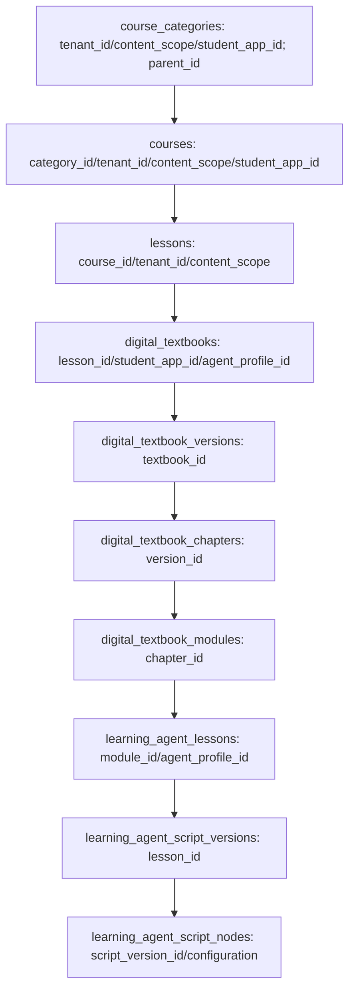
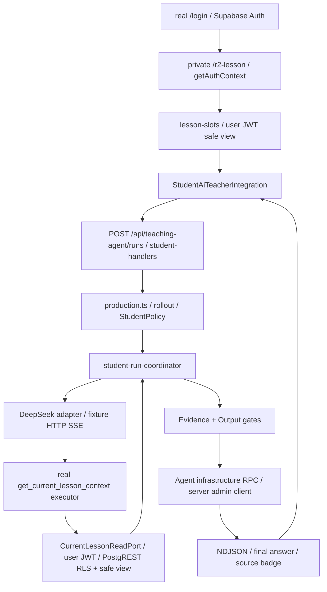

# UPLY Teaching Agent — Stage 1F-R2A RLS & Regression Closure

## 1. Executive Summary

**Overall: GO（限 R2A closure）。Stage 1F-R3: READY。Production 尚未 READY。**

真实完整 Supabase 的 138 项直接 JWT/PostgREST 检查通过：A1 无法读取 Tenant B module/script version/node；普通学生无法直接读取 raw node configuration；合法公开内容通过调用者绑定的字段白名单视图读取。无选课、过期、暂停选课和跨租户读取均被拒绝。已分配 app 的 Teacher/Admin 公开读取、Platform Owner 原始 authoring 读取保留。

Student Domain 继续使用真实用户 JWT。Selection Pins、两个 Domain Ports、UI→Transport→Runtime→Tool→Evidence/Output→Persistence 均通过。严格 replay 比较原 runId/conversationId，新增 Provider/run/conversation/message 均为 0；有效 segment 或 message 改变返回 IDEMPOTENCY_CONFLICT。45 秒 deadline 的真实读取尾部已重新测量通过。

课堂失败归因于图片能力加入后，测试对资源归属/外部媒体端口的 fixture 合同未同步；只修复相应 fixture/assertion，未修改课堂运行行为。4A14、4A7、发布课堂闭环及必需回归均已通过。Baseline fresh、target upgrade、schema equivalence、完整 Next production build 均通过。生产写入 0，生产 ledger 保持 449、Agent tables 0；本次 staging 已销毁。

## 2. Inputs & Baseline

历史输入：Current State Audit、Architecture v1、Stage 0A/0B/1A/1B/1C/1D/1E/1F/R1/R1B/R2；重点核对 R2 §15/22/25/29/30/32。历史报告用于确定合同和失败条件，本报告以当前源码、原始 R2 已归档证据及本轮实测为准。

- 日期：2026-09-14；工作区 `/home/yangzhen/projects/my-lms-system`。
- R2A 开始保存 2683 个已有文件摘要，保留其他工作已有改动。
- Cutover：`202609130003_runtime_authoring_nonretryable_error`；历史 ledger 449。
- Baseline SHA-256：`e5de2f48fa40da53ebcae5353aa4907b1738e15998a304a37b3d0fc555c7bac5`，字节不变。
- 扫描 active migration 后，下一个空闲版本确认为 `202609140005`。
- 新 project：`uply-agent-r2-de6e98a394a3`；API 37905、DB 51349、Next 41185；独立 6 containers/1 network/2 volumes。
- 原始 baseline → 449 ledger metadata → 六个 post-baseline incrementals → synthetic Auth/content；新 ledger **455**。没有重用已销毁的 R2，也没有重用本机其他 stack。

证据：[bootstrap-result](evidence/teaching-agent-stage-1f-r2a/bootstrap-result.json)、[stack-result](evidence/teaching-agent-stage-1f-r2a/stack-result.json)、[baseline-comparison](evidence/teaching-agent-stage-1f-r2a/baseline-comparison.json)。

## 3. Files Changed

仅本阶段必要改动；完整清单及原有文件保护结果见 [workspace-changes](evidence/teaching-agent-stage-1f-r2a/workspace-changes.json)。没有把前序阶段的未提交代码算作本轮开发。

| 文件 / 组 | 变更 |
| --- | --- |
| `supabase/migrations/202609140005_student_teaching_content_isolation.sql` | 新增 tenant/publication ancestry helpers、RLS tightening、安全 node view |
| `supabase/bootstrap/baseline-manifest.json` | 只追加第六个增量的 identity/SHA/list |
| `src/features/teaching-agent/server/repositories/supabase-student-teaching-repository.ts` | node 从 safe view 读取；保留 user client |
| `.../page-projection/lesson-slots.tsx` | candidate node IDs 从 safe view 读取 |
| `tests/fixtures/teaching-agent/student-domain.mjs`、`tests/teaching-agent-page-rollout.test.mjs` | memory/isolated SQL contract adapters 对应新字段；不冒充真实 RLS |
| `tests/fixtures/mounted-recording-4a12.mjs` | 添加真实 scene resolver + synthetic image bytes |
| `tests/smart-textbook-runtime-4a14-browser.test.mjs` | 验证 Teacher 释放与仍挂载的 SceneImage 分别归属；新增 full-unmount 零 URL |
| `tests/fixtures/published-chapter-one.mjs` | 只替换外部图片存储字节，保留发布/授权/resolver |
| `scripts/teaching-agent-r2/{seed.py,next.py,browser.mjs,observe.py,README.md}` | 扩展 fixture/真实请求观测/strict replay/deadline/唯一 cleanup 输出 |
| `scripts/teaching-agent-r2/{security.mjs,observed-fetch.ts}` | 新增只读 JWT security matrix 与私有副本 SDK transport 观测 |
| `tests/teaching-agent-rls-surface.test.mjs` | baseline hash、projection/privilege/adapter 静态回归 |
| 本报告、`docs/evidence/teaching-agent-stage-1f-r2a/` | 可核验证据 |

未修改已有 140000–140004、baseline SQL、cutover/449 ledger、Tools、Skills、Prompt、Provider 产品实现、completion gates、课堂产品 UI、unlock、真实课程、生产配置或环境文件。没有业务行 migration/rewrite。

## 4. R2 Failure Reproduction

使用 R2 已保存的真实 JWT/PostgREST 复现作为 before evidence，不把本轮 after 结果反称为 before 运行：R2 A1→B module=1、A1→B published node=1，private/answer sentinel 可见；A2/B1/EX/IN/TA/AA 也可读 A raw published node。来源：[R2 integration](evidence/teaching-agent-stage-1f-r2/integration-result.json)、[R2 policies](evidence/teaching-agent-stage-1f-r2/rls-policies.json)。

源码原因：原 node policy 只检查 parent version published；version policy 只检查 status；module policy 检查 textbook publication + app access，但没有沿 course/lesson 确认内容租户。该错误不由应用 StudentPolicy 修正。

本轮新 stack 先安装全部六份 migration，再 seed/测试，未临时回退安全 policy。After matrix 138 项 PASS；课堂失败见 §18/19。两轮中间 browser harness 的失败测量不计为 deadline PASS，最终独立重跑结果才作为证据。

## 5. Content / Tenant Relationship Model

Textbook、module、teaching lesson、script version/node 没有直接 tenant_id。租户边界来自完整父关系；每个 catalog ancestor 必须 published，且为 `tenant + 当前 active tenant` 或 `platform + NULL tenant`，book app 必须匹配 course app。Category 父链最多 8 层，缺失/循环 fail closed。

Platform-global fixture 使用平台内容管理触发器要求的合成 owner setup context 创建，然后用 A1/B1/TA/AA 的真实 JWT 验证公共读取。没有复制生产内容；这不等于验证了 owner authoring 登录/审批全流程。

## 6. Existing RLS Consumer Inventory

在第一次 policy 修改前建立：[consumer-matrix](evidence/teaching-agent-stage-1f-r2a/consumer-matrix.md)、[源码/测试调用点](evidence/teaching-agent-stage-1f-r2a/consumer-inventory.txt)。另补充 [SQL/RPC/migration 调用点](evidence/teaching-agent-stage-1f-r2a/sql-consumer-inventory.txt)。

| 分类 | 真实主要消费者 | 身份 / 当前合同 |
| --- | --- | --- |
| Student direct read | Teaching repository、lesson-slots | SSR user JWT + StudentPolicy；需要 safe projection |
| Teacher/Admin public read | app-assigned 内容读取 | 当前 active membership + app assignment；没有 raw Script Studio authoring 权限 |
| Teacher/Admin management | digital-textbook/api/service、growth-toolbox/api/service | requireActiveUser + requireTenantAppCapability(manageContent)，随后 server admin client |
| Owner authoring | Script Studio service/teacher-video-actions、admin teaching-scripts/actions | requirePlatformOwner + admin/RPC；raw config 必需 |
| Server privileged classroom | smart-digital-textbook、legacy respond/events/speech、production-teacher-agent、recording gateway | 保留各自 Auth/session/resource checks；不依赖 Student raw-table policy |
| Publishing/source capture | smart-textbook-publishing/capture、legacy-adapter/reader | 授权 server capture/frozen source；raw schema 仍存在 |
| Tests | domain adapters、课堂 mounted fixtures | 跟随 DTO/端口合同；真实 security 以本轮 Auth/PostgREST 为准 |

没有找到必须让普通 Teacher/Admin 直接读 raw script configuration 的合法 Studio 合同；现有 Studio 明确要求 platform owner。保留原 standard-question-bank management policy，未将其扩展成 raw script authoring 权限。

## 7. RLS Remediation Design

选择 **调用者绑定的安全 view + raw node owner-only RLS**。单纯收紧行策略仍会暴露整列 configuration；只限制 Repository SELECT 也无法关闭直接 REST；JSON 黑名单不能覆盖未来字段，因此都不足够。

`private.can_read_published_textbook(uuid)` 与 `private.can_read_published_teaching_module(uuid)` 为固定资源 boolean predicates，使用 auth.uid/current_tenant_id，确认 active profile、membership、tenant、角色、app/read资格、出版状态及全部父关系。不是任意 user/tenant 查询 API。两者 SECURITY DEFINER、owner postgres、search_path=''、显式 schema、PUBLIC/anon EXECUTE 被撤销，仅 authenticated 获得调用资格。

`public.student_learning_agent_script_nodes` 为 postgres-owned security_barrier view；有意不使用 security_invoker，否则无法在 raw node 关闭后提供白名单。它通过显式调用者 predicates 逐行过滤、只投影必要字段；无 caller-supplied user/tenant。view 自身无 RLS，安全性来自明确的 WHERE 和 field projection，不能将 view ownership 描述成自动继承 raw RLS。

新对象/策略对比：[rls-grants-diff](evidence/teaching-agent-stage-1f-r2a/rls-grants-diff.json)。相对原五个增量后的 catalog，仅增加 1 relation/view、3 functions，变更/删除 7 policies；没有已有 table/function grant 扩权。实际 full-stack ACL：[real-rls-catalog](evidence/teaching-agent-stage-1f-r2a/real-rls-catalog.json)。

## 8. Module Visibility

`authenticated read textbook modules` 改为已有 manager 能力 OR `private.can_read_published_teaching_module(id)`。同时约束 textbook catalog/version/chapter，避免其直接 REST surface 仍脱离父 catalog 租户。digital textbook nodes/activities 的已有关联查询继续受到父 module RLS 约束。

A1 A module=1、B module=0；B1 A module=0、B module=1；A2/EX/IN A/B均0。TA/AA 已有 app assignment，可读 A module，B=0。owner 原管理访问保留。平台共享 module 对合法 A/B app 用户可见。

## 9. Script Version Visibility

版本必须 published，关联 teaching lesson published，lesson.module 通过完整 scope predicate。Teaching lesson 同样收紧，避免独立 objectives/public rows 跨租户可见。

A1 A version=1、B version=0、draft version=0；B1 相反。无或无效 enrollment=0。TA/AA 本租户公开 version=1、B=0。owner 通过原有 ALL policy 可读 draft，未删除 authoring policy。

## 10. Script Node Visibility

删除且仅删除过宽的 `authenticated read published learning agent script nodes` SELECT policy；保留 `platform owner manages learning agent script nodes` ALL policy。

Student/TA/AA 对 raw node 表的 SELECT * 与 SELECT id,configuration 均返回 0 rows，包括自己 published、另一 tenant published 和 draft。Student 公共节点读取改走 view，自己的 public node=1、跨租户/draft/无选课=0。raw table 没有被删除，也没有 disable RLS。

## 11. Configuration / Column Boundary

普通学生现在可从 safe view SELECT：`id, script_version_id, updated_at, sort_order, teacher_script, segments, video_mode`。这些 locator 只用于服务器解析/校验，不是授权凭证。

raw table 的 authenticated relation-level SELECT grant 仍存在，因为同一个 SQL role 下的 platform owner 需要原有 authoring row access；普通 Student 有 grant 但没有可通过的 RLS policy，所以 0 rows。不能称为列 grant 被撤销，也不能称为所有 authenticated 都被禁用。

view 不存在 configuration 列，直接请求该列失败。原始 `configuration` 只留给 owner/server-authorized authoring/legacy runtime；Student 仅得到经 DB allowlist 生成的 segments/video_mode。configuration 没有被删除/篡改，原 synthetic private/answer 哨兵仍在 raw row，admin-only observer 已确认。

## 12. Student Safe Projection

白名单根据 `src/lib/teaching-video.ts:teachingScriptSegments` 和 Teaching `selection/references.ts:nodeSegments` 的实际解析需要建立：

- teacher_script 只允许 zh-CN/ko-KR 且值为 string；其他键不返回。
- segments 只允许这两个 locale 的 string arrays，长度≤50，双换行拼接后必须匹配对应公共 narration（含现有 zh fallback）。未知 locale、对象元素、未匹配正文的嵌入哨兵不返回。
- video_mode 仅 video/legacy；没有 objectKey、private authoring control、answer payload。
- 非法 segments 丢弃后，现有 parser 从已授权公开正文按段落解析；不增加新的教学内容。

真实 SQL edge cases：[segment-allowlist](evidence/teaching-agent-stage-1f-r2a/segment-allowlist.json)。REST `SELECT *` 对 view 精确字段断言通过；平台 global row 同时含额外 private teacher_script key 和 futureUnknown configuration，view/正文无泄露。没有使用 JSON key 黑名单。

## 13. Teacher / Admin Compatibility

TA/AA 的 synthetic active staff_app_assignments 使它们按既有合同读取 A public module/version/safe node，B=0；它们不能进入 Student Agent endpoint，也不能读取 raw config。R2 没有 assignment 的 Teacher raw read 属于过宽 published policy 带来的暴露，并非应保留的 authoring 权限。

Platform Owner JWT 对 raw published/draft nodes、draft version、module 正向读取通过。实际 Script Studio/teacher-video/admin actions 的 `requirePlatformOwner()` + admin client 路径未改。普通 Teacher/Admin management service 仍先验证 manageContent 能力后使用 admin client。现有 Script Studio/视频/课堂静态及隔离回归保持通过；本轮没有声称在 staging 浏览器完整操作了所有 Studio authoring 页面。

## 14. Direct PostgREST Security Matrix

138 项逐条记录：[security-result](evidence/teaching-agent-stage-1f-r2a/security-result.json)。全部使用真实 Auth password-login JWT，经 Supabase JS→Kong→PostgREST；不使用 SQL bridge 作为正向身份来源。

| 身份 | A module/version/safe node | B module/version/safe node | A/B raw node/config | A draft | global public |
| --- | --- | --- | --- | --- | --- |
| A1 | 1/1/1 | 0/0/0 | 0 | 0 | 1 |
| A2 no enrollment | 0/0/0 | 0/0/0 | 0 | 0 | 0 |
| B1 | 0/0/0 | 1/1/1 | 0 | 0 | 1 |
| EX expired / IN paused | 0/0/0 | 0/0/0 | 0 | 0 | 0 |
| TA / AA assigned staff | 1/1/1 | 0/0/0 | 0 | 0 | 1 |
| PO | 原 manager 路径 | 不作为 Student 路径 | raw published=1 | raw draft=1 | 非 Student Agent 资格 |
| anon | 未授权 | 未授权 | 0 | 无授权 | safe view 拒绝 |

A1→A2/B session=0；own session=1；A1→B course/lesson=0；expired JWT REST 401。安全矩阵除 fixture 建立外全为只读；用于确认 raw 哨兵保留的 service-role observer 仅在 harness，未用于 Student Domain。

## 15. Student Policy Regression

RLS 提供最低数据库隔离；`StudentTeachingPolicy` 继续验证 Student role、app/enrollment、feature、unlock、course/chapter 状态、session ownership、selection、revision。没有将所有细规则搬到 RLS，也没有让 Policy 代替数据库隔离。

真实 JWT domain：A1/own active session ok；A2/B1/TA/AA/PO/EX/IN 拒绝；另一个用户/租户/session completed 拒绝；wrong lesson/node/version/revision/index 为 stale 或不可见。HTTP 无 auth=401、其他角色/名单外=403、wrong pins=403 且 Provider 增量0。Enrollment 独立有效性来自 JWT domain/REST matrix，不将 rollout 的早期403冒充 enrollment 检查。

## 16. Selection / Domain Ports

`SupabaseStudentTeachingReadRepository.readPublishedNode` 改为 safe view；`loadStudentTeachingSlots` 的候选节点也来自该 view。随后仍逐项 full Policy，server hash 构造 pins；浏览器发来的 IDs/refs 不提供授权。

8 nodes × 2 locales=16 pins，10 次均成功。CurrentLessonReadPort status=ok、原句 `저는 학생입니다.`；TeachingStateReadPort status=ok、phase explanation、semantic last_saved_teaching_position。两个 Domain Ports 仍使用 A1真实 JWT，`domainUsesServiceRole=false`。错误 definition digest 由真实 DB manifest comparison 拒绝。

证据：[integration-result](evidence/teaching-agent-stage-1f-r2a/integration-result.json)、[ports-result](evidence/teaching-agent-stage-1f-r2a/ports-result.json)。

## 17. Agent E2E

最终验证轮：UI completed/source badge/privacy PASS；3 HTTP正常样本、1 active replay 原执行、1 persistent cancel、1 deadline。正常成功每次2次 fixture Provider调用（planning→Tool→final），原 Tool/Skill/Prompt/Evidence/Output 合同未改。

UI 显示“依据当前课文”，dialog 内部 ID/tool/provider/private sentinel 检查无泄露。证据：[browser-result](evidence/teaching-agent-stage-1f-r2a/browser-result.json)、[截图](evidence/teaching-agent-stage-1f-r2a/ui-completed.png)、[durable runtime timings](evidence/teaching-agent-stage-1f-r2a/runtime-timings.json)。

正式 synthetic catalog slug route 本轮保持 **PARTIAL**：复用 private mounting page，未扩大为完整现有 SmartTextbookShell/正式课程 route 验证。该非critical覆盖不冒充真实课程 0/1 coverage；后者仍为 R3 工作。

## 18. Classroom Regression Root Cause

| 测试 | 实际根因与归属 |
| --- | --- |
| 4A14 line86 | 原断言 `window.blobs.size===0` 统计所有 Blob URL；停止 Teacher 时，当前 learning SceneImage 仍挂载并合法持有1个图片URL。这不是“仍有1个Teacher组件”，也不是可以直接把 expected改1的理由。 |
| 4A7 mounted recording | `mounted-recording-4a12.mjs` 未提供 sceneImage；实际客户端 learning transport 已 dispatch `scene-image`，boundary 的 required(port) 正确抛 PORT_UNAVAILABLE。 |
| 扩大回归的 publication closure | published fixture 未替换新增外部 scene-image-storage；真实 production boundary 走到 R2 storage 读取，缺 R2_ACCOUNT_ID。隔离测试不应要求生产媒体凭证。 |

代码证据：`components/scene-image.tsx` effect 持有/清理自身 URL；`teacher-timeline.ts:stop()` 只释放 Teacher character/audio；`learning-boundary.server.ts` scene-image case；`production-learning-boundary.server.ts` 调真实 sceneImageBytes/readSceneImage。Git `b167239` 同时包含这组累积 runtime/test 文件，无法从该单一导入提交判断更细的作者时间顺序；源码依赖与实测足以确认 fixture 合同不一致。全部早于本轮 RLS 产品适配，不将它们说成 RLS 引起的生产 bug。

## 19. Classroom Regression Fix

4A14 保留所有暂停/继续、Step切换、late HTTP/Audio/TTS、Grant、question、ownership 检查。停止/切换后要求：所有剩余 URLs 必须**精确等于当前仍挂载的 SceneImage src 集合**，额外 audio/Teacher character URL 仍失败；停止 Teacher 后当前场景图片应保留；整页 unmount 后全部URL必须0。不是跳过 cleanup，也没有简单放宽数量。

4A7 fixture 接真实 `sceneImageBytes(manifest,bindings,source,...)`，只注入本地 synthetic PNG transport。仅对已过 generation 的 cancelled scene-image read，应用和其他读取相同的窄取消例外；PORT_UNAVAILABLE 不在忽略名单。

published fixture 仅替换 `scene-image-storage.server` 字节提供函数；真实 snapshot/authorization/boundary/resolver继续执行。无 production fallback、无真实 R2 env、无服务端图片业务逻辑修改。

定向结果：4A14 **7/7**；4A7 **18/18**；publication closure **12/12**；blackboard/视频/sidebar/runtime presentation/其余课堂广泛回归通过。1E真实Next/Chromium也在启用的 opt-in suite 中通过。

## 20. Idempotent Replay Strict Verification

最终真实 HTTP + DB observer 断言：

| 场景 | 结果 |
| --- | --- |
| 相同 owner/scope/selection/message/key | 原始 UI runId与replay严格相等；conversationId严格相等；replayed=true |
| terminal replay | Provider增量0；agent_runs/conversations/messages行增量均0 |
| active replay | 同run/conversation、replayed=true；不创建第二worker/Provider/历史行；原stream最终完成 |
| 同key、message改变 | HTTP409 / IDEMPOTENCY_CONFLICT；Provider及三表行增量0 |
| 同key、另一个有效node/segment pin | HTTP409 / IDEMPOTENCY_CONFLICT；Provider及三表行增量0 |
| stale revision / forged pin | 按现有验证合同HTTP403；不进入Provider |
| A2/B1 status/cancel | 均404 |

observer 只读取实际 Agent infrastructure row counts，不注入 Runtime。active-replay 正向 stream 由原执行继续完成，重放端仅观察。R2 G-R2-24 现为 **PASS**。

## 21. Deadline Read-Tail Verification

| 指标 | 最终实测 |
| --- | --- |
| actual POST receivedAt | 2026-09-14T11:48:09.149Z |
| 从receivedAt至HTTP terminal | 45069ms（client总耗时45080ms） |
| terminal | run.failed / DEADLINE_EXCEEDED |
| 最后Provider调用开始 | receivedAt + 403ms；仅planning一次，无final |
| 最后Teaching Domain请求开始 | receivedAt + 367ms |
| 本次slow run Tool activity | 无Tool调用；前序正常run有真实tool.requested/completed作为观测正向控制 |
| terminal DB persistence | failed / ended_at=2026-09-14T11:48:54.212948+00:00 |
| terminal后观察 | 2213ms |
| late Provider / Tool / Teaching reads / writes | 0 / 0 / 0 / 0 |

Provider最后一次“调用开始”和精确abort内部回调时间区分：前者实测；后者未单独instrument。durable usage/failure/terminal时序可核验，未将调用开始冒称底层socket关闭时间。

计时起点来自私有副本在真实 `student-handlers.post` 创建的 `metadata.receivedAt`；不缩短预算、不用伪时钟。Provider fixture延迟60000ms，真实Runtime在45秒预算处中止。SDK级 observed-fetch 在请求发出前记录 metadata，包括 abort/failed request，避免只看完成请求遗漏尾部。

明确 infrastructure allowlist：`agent_definition_versions, agent_conversations, agent_messages, agent_runs, agent_run_events, ai_token_usage`。RPC allowlist：`admit_agent_run_v1, transition_agent_run_v1, append_agent_run_event_v1/v2, record_agent_usage_v1, reserve_student_agent_event_sequence_v1, get_student_agent_run_status_v1, request_agent_run_cancel_v1, check_agent_run_cancel_v1`。其余 REST resource，包括所有 learning_agent_* 与新 safe view，均计入 Teaching Domain；未知 RPC 保守同时计为 read/write。绝不使用 contains('agent') 排除。

开始计数前要求日志中真实 safe-view reads 与先前真实 Tool starts 已出现，防止空日志得到 vacuous PASS。Student coordinator Tool start 真实事件为 tool.requested，兼容 Core的tool.started。终止后只允许usage/failure/terminal等已列明的Agent cleanup。

两次中间测量失败如实记录：第一次 global fetch 被Next fetch替换，且observer误查不存在的updated_at；第二次SDK记录已正确，但Tool事件名误用Core的tool.started。未将中间零计数计入PASS；最终修正后完整UI/replay/deadline再跑，断言全部执行且exit0。R2 G-R2-27 现为 **PASS**。以上是本机 smoke，不是生产 SLA。

## 22. Teaching Domain Side Effects

79张教学/身份/catalog/progress/assignment/quiz/assessment等表，Agent最终窗口 before/after row count + 排序rowJSON摘要一致，changedTables=[]；实际 observed REST teaching method均GET，没有教学写入。正常、replay、cancel、deadline均覆盖。

[domain-before](evidence/teaching-agent-stage-1f-r2a/domain-before.json)、[domain-after](evidence/teaching-agent-stage-1f-r2a/domain-after.json)、[side-effects](evidence/teaching-agent-stage-1f-r2a/side-effects-result.json)。MD5为变化检测；不是恶意碰撞证明，也不把bootstrap/seed称为零写入。

三轮完整browser测试（含两轮观测失败）的累计 DB 为21 runs/21 conversations/36 messages；15completed、3cancelled、3failed。那些是Agent infrastructure写入，不是Teaching Domain。Agent messages与event metadata扫描private/answer/future/draft sentinel均false。最终验证轮独立7runs、12fixtureProvider calls；全阶段三轮累计36fixtureProvider calls。Live Provider requests/tokens=0。

## 23. Migration / Baseline Regression

新增版本 `202609140005_student_teaching_content_isolation`，manifest追加filename/name/version/SHA及version list。原140000–140004、449 metadata、cutover、baseline SQL均未变。Migration仅DDL/policy/grant/view/function，无业务数据更新，无production application。

完整真实Supabase安装455条ledger精确匹配manifest。另重跑R1B stand-in schema-only baseline-fresh、target-upgrade（升级路径不安装baseline）、15类catalog equivalence，全部PASS、differences=[]。两种证据区分：schema stand-in证明DDL等价；Auth/JWT/REST安全由本轮真实完整stack证明。

baseline unit 10项中7PASS/3既有opt-in SKIP，guard unit4PASS；迁移inventory+RLS静态4/4PASS。实际schema/catalog/安装路径已经单独跑通，不用unit skip冒充实际执行。

## 24. Performance Regression

| Pin sample | ms | REST | pins |
| --- | --- | --- | --- |
| 1 | 1955 | 304 | 16 |
| 2 | 1908 | 304 | 16 |
| 3 | 1926 | 304 | 16 |
| 4 | 1909 | 304 | 16 |
| 5 | 1903 | 304 | 16 |
| 6 | 1977 | 304 | 16 |
| 7 | 1959 | 304 | 16 |
| 8 | 1980 | 304 | 16 |
| 9 | 2059 | 304 | 16 |
| 10 | 2063 | 304 | 16 |

每次304 REST包含288 repository SELECT +16 harness-auth membership SELECT；正式page复用Auth identity callback，不重复后16次。8nodes×2locales，未进行repository优化或减少检查。相对R2约2.21–2.31秒，本轮约1.90–2.06秒，没有明显恶化，远低于12秒。并非生产p95。

| Normal HTTP sample | ms | Provider calls |
| --- | --- | --- |
| 1 | 1364 | 2 |
| 2 | 1326 | 2 |
| 3 | 1340 | 2 |

正常路径远低于45秒；UI completed 1859ms。保留288次重复授权查询作为未来优化项，不在本阶段大规模重构。

## 25. Production Build / Secret Boundary

完整应用源码私有副本，staging env only，Next build --webpack **PASS，96.67秒**；在Provider/观测/private page插入前运行；未复制.env、未部署。`.next/static`的production chunks保留，dev chunks位于`.next/dev/static`。

325个production client JS chunks检查server markers、service credential、JWT secret、synthetic access/refresh tokens/password等无命中。Public anon key是浏览器SDK必需值，按公开配置允许存在，报告不输出其值。初次扫描把anon key也算作secret，已按明确公开/私密分类复核；没有忽略service-role或JWT secret。

[client-boundary](evidence/teaching-agent-stage-1f-r2a/client-boundary.json)、[privacy-scan](evidence/teaching-agent-stage-1f-r2a/privacy-scan.json)。证据不归档status/private/users/cookies、完整HTTP payload、provider prompt或私有Next日志。工作区tsc与相关lint通过；不声称全仓库lint无历史问题。

## 26. Production Safety

[production-safety](evidence/teaching-agent-stage-1f-r2a/production-safety.json)：开始/结束只读metadata完全相等；**ledger449，Agent tables0**。只读工具为既有`/tmp/uply-stage1f-readonly.mjs`封装，未把生产凭证带入staging。

Production writes=0、migration NOT APPLIED、flag NOT ENABLED、liveProvider0；未修改PM2、Tailscale、.env、生产课程/unlock、真实学生/Auth数据。没有部署/git push。本结论指本任务动作，不宣称观察到了所有其他操作者的生产写入。

Supabase CLI实际container API/DB ports仍使用其默认wildcard映射，不能称为网络层loopback-only；所有harness目标严格限定loopback，私有凭证独立，最终清理完毕。没有测试外部网络可达性。

## 27. Staging Cleanup

**PASS**：[cleanup-result](evidence/teaching-agent-stage-1f-r2a/cleanup-result.json)。按本轮project label和exact name移除6containers、1network、2volumes；Next41185关闭；私有目录、Auth/data、credentials/env、source/build/logs全部删除。

宿主进程namespace按唯一cwd核验停止Next，未按端口盲杀或信任其他namespace PID。另清理本轮1D/1E测试结果记录的两个临时fixture目录及专属进程。未Docker prune、未stop/reset其他Supabase、未触碰生产服务。保留的是脱敏证据和可复用harness源码。

## 28. Tests

| 检查 | 实测结果 / 限制 |
| --- | --- |
| Full Supabase real security matrix | 138检查PASS；所有直接Student/table/view断言执行 |
| Selection/Policy/Ports/definition | 10投影样本、角色/selection负向、两Ports PASS |
| 最终Full Supabase browser/transport | UI、replay/conflicts、active replay、cancel/status、deadline全部PASS |
| 广泛61files首轮 | 1143 tests：1130PASS、2FAIL、11SKIP；失败为publication closure子项及父项 |
| 该唯一失败文件修复后重跑 | 12/12PASS；其余已通过文件未被再次改动，不隐去首轮失败 |
| 4A14 / 4A7 定向 | 7/7、18/18；也在广泛套件中通过 |
| opt-in Core/1A–1E DB/Next/UI | 显式启用4个test flags，199/199PASS、0SKIP，包含1E browser |
| Blackboard | PASS；视频/sidebar/runtime presentation包含广泛套件 |
| publication dependency复核 | 64/64PASS |
| 新RLS static + migration inventory | 4/4PASS |
| baseline schema fresh/upgrade/compare | PASS |
| baseline unit / guard unit | 7PASS+3SKIP / 4PASS |
| 完整Next build / tsc / scopedlint | PASS |
| git diff --check / scope digest | PASS；前序工作保留，无本轮删除 |

不将重复运行的PASS数字累加造总通过率，不把skip称为PASS。LiveProvider opt-in保持关闭。初轮11SKIP中必需DB/Next/UI场景通过专门启用的199项套件覆盖；其余不作为live质量证明。当前必需classroom/Agent regression已无未解决失败。

证据：[tests-result](evidence/teaching-agent-stage-1f-r2a/tests-result.json)、[regression-files](evidence/teaching-agent-stage-1f-r2a/regression-files.json)、[1E browser](evidence/teaching-agent-stage-1f-r2a/stage1e-browser-result.json)、[1D Next](evidence/teaching-agent-stage-1f-r2a/stage1d-next-result.json)。

## 29. Gate Matrix

| Gate | Name | Status | Evidence |
| --- | --- | --- | --- |
| G-R2A-1 | RLS Consumer Inventory | PASS | consumer-matrix + source/SQL inventory |
| G-R2A-2 | Tenant-bound Module Visibility | PASS | security matrix A/B module |
| G-R2A-3 | Tenant-bound Script Version Visibility | PASS | security matrix A/B/draft version |
| G-R2A-4 | Tenant-bound Script Node Visibility | PASS | raw and safe node matrix |
| G-R2A-5 | Student Raw Configuration Protection | PASS | raw SELECT 0; view no configuration |
| G-R2A-6 | Student Safe Projection | PASS | 7-column + nested allowlist tests |
| G-R2A-7 | Teacher/Admin Legitimate Access Regression | PASS | staff app public read; owner raw/draft; source contracts |
| G-R2A-8 | Cross-User REST Negative | PASS | A2/B sessions 0; status/cancel404 |
| G-R2A-9 | Cross-Tenant REST Negative | PASS | A1→B public tenant rows0 |
| G-R2A-10 | Enrollment REST Boundary | PASS | A2/EX/IN deny; assigned staff allowed |
| G-R2A-11 | Private Sentinel Isolation | PASS | rawsentinelsremain;safe/Tool/UI/trace noleak |
| G-R2A-12 | Agent StudentPolicy Regression | PASS | realJWTdomainmatrix + optin |
| G-R2A-13 | Selection Pins Regression | PASS | 10×16pins;wrong/stale deny |
| G-R2A-14 | Domain Ports Regression | PASS | lesson/state ok;userJWT |
| G-R2A-15 | Agent E2E Regression | PASS | realAuthUI+Runtime+Tool+gates |
| G-R2A-16 | Classroom 4A14 Regression | PASS | 7/7 plusbroad |
| G-R2A-17 | Classroom 4A7 Regression | PASS | 18/18 plusbroad |
| G-R2A-18 | Full Classroom Regression | PASS | requiredclassroomfailuresclosed;publication12/12 |
| G-R2A-19 | Strict Same-Run Idempotent Replay | PASS | sameIDs;Provider/rows0;active replay |
| G-R2A-20 | Idempotency Conflict | PASS | message/validsegment409 |
| G-R2A-21 | Full Deadline Read-Tail | PASS | 45sactualreceivedAt;2.213snonvacuous tail |
| G-R2A-22 | Teaching Domain Zero Writes | PASS | 79tablefingerprints+GET-only |
| G-R2A-23 | Baseline Fresh + New Migration | PASS | freshPASS |
| G-R2A-24 | Target Upgrade + New Migration | PASS | upgradePASS;baseline not installed |
| G-R2A-25 | Schema Equivalence | PASS | 15catalogcategories no differences |
| G-R2A-26 | Production Build | PASS | fullNext96.67s |
| G-R2A-27 | Client/Secret Boundary | PASS | 325chunks;private/servermatches0 |
| G-R2A-28 | Production Ledger Unchanged | PASS | start=end449;Agenttables0 |
| G-R2A-29 | Production Writes Zero | PASS | no production mutations |
| G-R2A-30 | Staging Cleanup | PASS | 6containers+network+2volumes+Next+privatefixtures removed |

G-R2A-1至30全部PASS；正式synthetic课堂slug route为单独非critical PARTIAL。原R2 G-R2-24/G-R2-27严格复核后PASS。GO仅表示本阶段阻断闭环与允许评估下一阶段，不是生产上线批准。

## 30. Architecture Deviations

| 项目 | 明确差异 / 限制 |
| --- | --- |
| Node read contract | raw node换为caller-bound safe view，只有Student adapters改动；Tool/Skill/Prompt合同不变 |
| Ancestor tightening | 除三张核心表外收紧textbook/version/chapter/teaching lesson公开读，防止同一父链旁路；管理能力保留 |
| View privilege model | owner-executed security_barrier + explicit auth predicates；不声称view自动拥有RLS |
| Provider | 上游HTTP/SSE fixture；真实adapter/parser/Runtime/Tool/gates，未测live模型质量/数据政策 |
| Staging instrumentation | 私有copy记录receivedAt、SDK请求开始与Tool metadata；产品仓库未加trace业务逻辑 |
| Classroom corrections | 只修三个相应fixture/contracts；未改生产媒体fallback/运行状态 |
| Formal classroom | 私有synthetic route slice；正式slug/真实pilot coverage保留R3 |
| Performance | 本地smoke，无productionp95，288repository查询未优化 |

## 31. Remaining Production Blockers

本次R2A critical blockers已关闭。生产仍需R3独立处理：真实pilot content及0/1coverage、真实Tailscale/production-like chain、production migration rehearsal、kill/drain、rollback exercise、operator monitoring、Provider data policy、最终受控first-enable gate。

本次安全证明范围是所列direct REST surfaces及Student Agent链；旧的server-admin legacy AI endpoints仍有各自应用权限边界，不能因为新增RLS就推导所有高权限legacy入口都已完成全系统安全审计。生产中当前尚未应用本迁移，因此其原有漏洞不能被描述为已经在线修复。

重复Policy查询成本仍应后续评估。正式classroom synthetic route覆盖PARTIAL；Production Proxy PARTIAL；Real Course Coverage BLOCKED 0/1。以上没有通过修改真实课程/放宽unlock来消除。

## 32. Stage 1F-R3 Readiness

**READY（进入下一阶段评估的前置条件满足）。** R2A30gates全部PASS；R2原strict replay/read-tail测量缺口关闭，所有required课堂回归已通过。唯一明确非critical缺口为正式synthetic课堂route覆盖。

Production仍NOT READY；本任务没有开展R3、没有production migration/deploy/first-enable授权执行。R3须自行完成其剩余Gate。

## 33. Final Recommendation

保留现有user-JWT Domain、StudentPolicy、Tool/Evidence/Output与fenced persistence；采用本次经过真实Auth/JWT/PostgREST验证的增量RLS与白名单投影作为后续基础。

**结束于R2A GO / Stage1F-R3 READY；不进入R3。** 报告、迁移、adapter、测试与脱敏证据已落盘；生产未修改，本次staging已清理。
