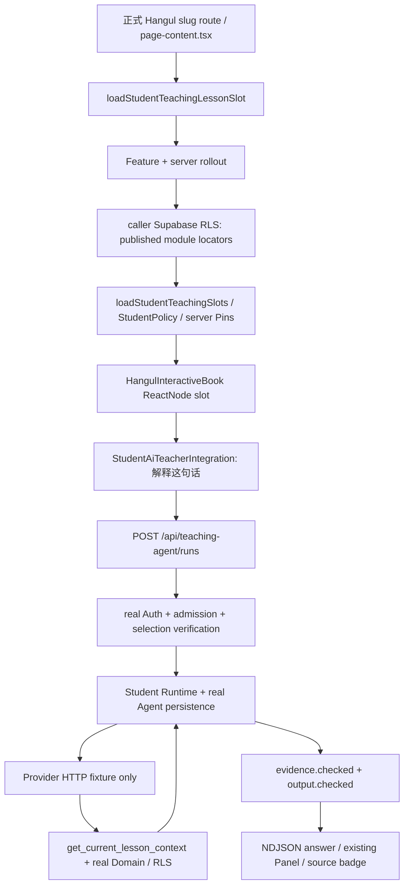

# UPLY Teaching Agent — Stage 1F-R3C Pilot Content & Approval Closure

## 1. Executive Summary

**Overall: CONDITIONAL。Stage 1G: NOT READY。**

Hangul 正式课堂已通过最小 slot 接入 Student AI Teacher。新建唯一 disposable Full Supabase，使用真实 synthetic A1 Auth/JWT/PostgREST/RLS/StudentPolicy/server Pins/Transport/Runtime 完成“解释这句话”→Tool→evidence/output→答案/来源；只有 Provider HTTP/SSE 使用 fixture。生产没有部署、迁移、课程/unlock写入、开关启用或Tailscale变更，Live Provider0。

当前**from-zero authoring = MISSING PRODUCT WORKFLOW**：产品支持已有对象的脚本编辑与发布，但教材/version/chapter/teaching lesson 从零创建的完整入口缺失。因此正式内容包状态 **ENGINEERING BLOCKER REMAINS**。本阶段只调查该工作流，并未把 SQL fixture 当成正式创建流程，也未新增 authoring CRUD。

Synthetic course 的真实 Policy+发布内容结果恰好1 eligible lesson，**PROVEN BY CURRENT CONTENT STATE（仅此disposable内容状态）**。本阶段不增加lessonallowlist；production Candidate仍0，production Pins/最终范围证明和外部批准尚未完成。

## 2. Scope & Current Evidence

遵循R3C附件，承接R3B准备包、R3/R3A验证证据；先确认源码路径，再实施课堂接入，随后建立全新stack。没有修改Provider、Prompt、Tools、Skills、StudentTeachingPolicy、RLS或reconciliation。Next本地server/client composition指南确认ReactNode跨Server/Client边界模式；UI复用现有组件、CardTitleWithHint及已有交互，未安装依赖。

任务开始保存3024个现有文件hash，保留已有dirty工作区。生产READ ONLY核对开始/结束ledger；结束inventory与R3B课程元数据一致。报告证据只含允许的元数据、合成结果与截图，未导出真实学生或生产教材正文。

## 3. From-Zero Authoring Workflow

| 环节 | 结论 | 证据/边界 |
|---|---|---|
| Textbook/version/chapter | 未找到完整从空lesson新建首教材、首版本、首章的产品入口 | [service.ts](/home/yangzhen/projects/my-lms-system/src/features/learning-agent-script-studio/service.ts:135)读取已有对象；无教材时modules=[] |
| Module | Partial：已有chapter内grammar专用创建可用 | [actions.ts](/home/yangzhen/projects/my-lms-system/src/app/dashboard/admin/digital-textbook/actions.ts:376)，不创建父骨架/teaching lesson |
| Teaching lesson/profile关联 | 缺正式创建/关联入口；已有profile可审核复用 | Studio查询existing `learning_agent_lessons`；历史migration初始化不是产品流程 |
| Script/node | Existing，依赖已有teaching lesson/script | createTeachingScriptDraftAction、add/saveTeachingScriptNodeAction |
| Validation/publish | Existing，保留权限/并发/媒体与分段校验 | [actions.ts](/home/yangzhen/projects/my-lms-system/src/app/dashboard/admin/teaching-scripts/actions.ts:899)、publishTextbookChapterAction |

具体逐对象来源、正式发布者权限及创建checklist见 [teaching-agent-hangul-content-owner-checklist.md](/home/yangzhen/projects/my-lms-system/docs/teaching-agent-hangul-content-owner-checklist.md)。结论 **MISSING PRODUCT WORKFLOW**，不能表述“教学负责人现在按几个按钮即可从零完成”。既有编辑能力可复用，缺失入口需单独工程任务处理。

## 4. Minimal Classroom Integration

原 `hangul-introduction` 分支直接返回客户端 HangulInteractiveBook，不具备 SmartTextbook 模块模型，也没有调用 `loadStudentTeachingSlots`。本轮仅3个产品文件改变：

| 文件 | 变化 |
|---|---|
| [page-content.tsx](/home/yangzhen/projects/my-lms-system/src/app/dashboard/courses/[categorySlug]/[subcategorySlug]/[courseSlug]/[lessonSlug]/page-content.tsx:735) | 已授权student/tenant且非audit时请求lesson-level slot，交给HangulInteractiveBook |
| [lesson-slots.tsx](/home/yangzhen/projects/my-lms-system/src/features/teaching-agent/server/page-projection/lesson-slots.tsx) | 原loader兼容显式moduleIds；缺moduleIds时，在Feature/rollout后通过caller RLS client发现published教材最新version/chapter/modules，再走原Policy projector；新增lesson-level ReactNode封装 |
| [HangulInteractiveBook.tsx](/home/yangzhen/projects/my-lms-system/src/app/dashboard/courses/[categorySlug]/[subcategorySlug]/[courseSlug]/[lessonSlug]/HangulInteractiveBook.tsx:174) | optional `teachingAgentSlot?: ReactNode`；有slot时在书本上方独立滚动区呈现，仍用原StudentAiTeacherIntegration/Sheet |

Feature OFF：server直接返回undefined，无module discovery/Pin查询；client无新增wrapper，原main class保持相同，正式route按钮0、POST404、Provider0。已存在SmartTextbook调用方式保持不变，未复制KoreanLevelOneSmartTextbook，未新增Agent/API/客户端授权计算。

这是**本课已发布片段**的解释入口，不声称掌握Hangul静态电子书当前页/当前句；没有将现有静态内容自动变成数据库脚本。教学负责人未来需审核数据库片段与该lesson的一致性。客户端接收ReactNode/PublicSelectionPin，不能通过displayText改变权威原句。

Discovery有界：单一published textbook、最新published version、最多16 chapters/16 modules；原loader最多32 nodes、projector最多128 Pins、12s预算。任何查错/缺失/Policy拒绝都fail closed，不以管理员client扩大范围。该限制不是完整教材浏览器，也不能用于证明大型课程所有节点都已枚举。

## 5. Disposable Full Supabase Fixture

全新项目 `uply-agent-r2-6dc433a5b662`，唯一随机端口/目录，R2 ownership guard拒绝远程/production/非本项目；6个实际服务容器，Auth、PostgREST、数据库等为真实Supabase服务。

路径：byte-exact baseline → 原449 ledger → 全部7份post-baseline migrations（000..006）→ final456 ledger → synthetic Auth8角色 → synthetic内容。postgres临时bootstrap权限按原harness恢复后才运行Student请求；重复baseline guard通过。

[hangul-fixture.py](/home/yangzhen/projects/my-lms-system/scripts/teaching-agent-r3c/hangul-fixture.py) 只在owned disposable DB中建形：Tenant A/A1、Korean app、korean-beginner/hangul-introduction immediate、published textbook/version/chapter/module/teachinglesson/script、8published nodes、objectives及synthetic韩文句段。另2个同course兄弟lesson为prerequisite_passed，其中basic-pronunciation有完整published链1node，daily-greetings无链。

fixture使用合成SQL setup，**不代表正式authoring/publish流程被验证，也不代表完整教学媒体发布验收**；未复制生产教材。正常现有Hangul静态reader UI仍来自项目代码，Agent读取的数据库文本全部synthetic。出处 [bootstrap-result.json](/home/yangzhen/projects/my-lms-system/docs/evidence/teaching-agent-stage-1f-r3c/bootstrap-result.json)、[hangul-fixture-result.json](/home/yangzhen/projects/my-lms-system/docs/evidence/teaching-agent-stage-1f-r3c/hangul-fixture-result.json)。

## 6. Formal Route & Request Chain

实际route：`/r2-a/apps/korean/courses/korean/korean-basic/korean-beginner/hangul-introduction`，不是私有mount page。A1通过原login UI得到真实Auth session；服务端逐层检查tenant、rollout、资源与Policy。

UI讲解1346ms完成，来源标记1；数据库真实事件确认Tool completed/ok、evidence pass、output pass且sourceCount1。UI发送的idempotency key对应实际completed Run；owner GET一致。另3个实际HTTP样本1104–1118ms，run.started约164–173ms到达、answer.final/terminal在末尾；这是loopback fixture性能，不能代替actual Tailscale或真实Provider性能。

重放同Run/conversation、不增Agent rows或Provider；消息/另一有效segment冲突409；取消66ms收敛cancelled；OFF新POST404、owner GET200；45秒预算实测receivedAt→terminal45064ms，之后2219ms观察lateProvider/Tool/Domain reads/writes全0。

[formal-browser.mjs](/home/yangzhen/projects/my-lms-system/scripts/teaching-agent-r3c/formal-browser.mjs)、[browser-result.json](/home/yangzhen/projects/my-lms-system/docs/evidence/teaching-agent-stage-1f-r3c/browser-result.json)。首次脚本读取Playwright已失效响应body失败；改为捕获实际UI请求key后查真实Run，不改产品。另scope脚本修正ESM preload、移动端测试等待Sheet关闭；这些是验证脚本修正，最终通过，未隐藏产品失败。

## 7. Real Selection Pin Contract

实际server projector给目标8nodes×2locales生成16 Pins，Hangul中文入口使用zh-CN。browser只持有服务端`expectedRevision`/`segmentRef`，POST不含displayText；测试比对UI发出的segmentRef与独立server projector结果一致，未在浏览器计算hash或身份资格。

| 负向 | 真实POST结果 | 新Provider fixture请求 |
|---|---|---:|
| 错误segmentRef | 403 | 0 |
| 错误expectedRevision | 403 | 0 |
| 其他node / 其他lesson | 403 | 0 |
| 越界segmentIndex / draft script | 403 | 0 |

A2/B1/Teacher/Admin/PlatformOwner/过期/停用用户POST403；A2/B1课堂无入口；未登录401；非owner查Run/cancel404。显示文本不作为authority的既有client/Domain测试本轮重跑。

## 8. Single-Lesson Scope & Allowlist Decision

[scope.mjs](/home/yangzhen/projects/my-lms-system/scripts/teaching-agent-r3c/scope.mjs) 用A1真实JWT枚举同course3个真实合成lesson、published链，再执行当前StudentPolicy/projector。

| Lesson | unlock | Published node candidates | Pins | Eligible |
|---|---|---:|---:|---|
| hangul-introduction | immediate | 8 | 16 | Yes |
| basic-pronunciation | prerequisite_passed | 1 | 0 | No |
| daily-greetings | prerequisite_passed | 0 | 0 | No |

**Single-Lesson Scope = PROVEN BY CURRENT CONTENT STATE（仅disposable）**。NOT REQUIRED for this frozen state；未实现lessonallowlist，未改StudentPolicy。锁定兄弟有内容仍被拒绝，证明不是空内容导致的偶然单例。

任何新增eligible lesson、解锁/关联/发布变更或不能冻结未来Pilot course都会使证明失效。production发布前必须重新枚举/验证；如不再恰好1，才另行决定server-only stablelessonUUID/defaultdeny/global∩tenant∩course∩user∩lesson∩StudentPolicy，且UI/POST共享。当前没有production单lesson证明。[scope-result.json](/home/yangzhen/projects/my-lms-system/docs/evidence/teaching-agent-stage-1f-r3c/scope-result.json)。

## 9. Teaching Domain Writes & Observability Boundary

**Teaching Domain Writes by Agent = 0。** 正式browser测试所测窗口79张教学/课程/身份相关表fingerprint无变化；浏览器关闭后另跑一个真实completed HTTP Run，79表同样无变化。原Hangul有10秒进度heartbeat；本阶段不关闭/修改它，不能一般性声称课堂永不写学习进度。

私有copy用AsyncLocalStorage标记实际Agent POST，并由现有Supabase SDK observer记录仅path/method/kind/at；在1657项归属请求中观察到71次安全node读取、7次Tool启动，教学写入0。这是非空路径证据，不以没启动Agent的空窗口冒充零写。所有Auth/Policy/Runtime/RLS不变，观察器不记录body/凭证。两种表指纹与请求归属一起界定结论。

合成setup、Auth创建和Agent基础设施持久化有写入；这些不算教学Runtime业务写入，更不算production写入。实时API Provider请求0。最终stack active Runs=0，具体终态数量见 [final-staging-runs.json](/home/yangzhen/projects/my-lms-system/docs/evidence/teaching-agent-stage-1f-r3c/final-staging-runs.json)。

## 10. Regression & Build

| 检查 | 结果 |
|---|---|
| Full Supabase baseline / migrations | PASS：449+7=456 exact；重复baseline拒绝 |
| Real JWT critical RLS | 138 PASS、0 errors；raw私有配置/答案仍被隔离 |
| Domain / Pins / Ports | 实际A1读取、拒绝边界、错误definition digest DB拒绝PASS；Domain不用service role |
| Agent/Policy/Tools/UI/rollout/migration static | 207 tests：203 PASS、4 optional SKIP、0 FAIL |
| 既有classroom/sidebar/readiness/course-return | 90 PASS |
| Stage1E actual Next browser | 1 PASS；keyboard/cancel/retry/mobile/dark/partial等既有用例 |
| 新Hangul formal + mobile/landscape | PASS；375px无水平溢出、Enter/Escape焦点恢复、来源标记、reduced motion |
| R3A reconciliation targeted | 18 DB assertions PASS（network-none独立fixture） |
| R3A real JWT RPC grants | 27拒绝检查PASS |
| Baseline Python | 10 tests：7 PASS、3 optional SKIP；数据库fresh实际执行另列，不把SKIP说成PASS |
| tsc | --noEmit --incremental false，exit0 |
| scoped lint | 3个产品文件、page-rollout test及R3C MJS，exit0，无warning |
| 原始production-mode build | 94.04s，1376files，exit0，public生产配置一致，未启动/部署 |
| Full Supabase instrumented build | 77.19s，exit0；与原始候选不同，不混淆字节级artifact |
| git diff/check / scope | PASS，具体新增/修改清单见scope evidence |

R3A Drain保持PASS；本轮没有重做两例SIGKILL或数据库双会话竞态，沿用不变SQL/runtime的R3A证明，加本轮18项定向DB、27真实JWT及HTTP取消/超时验证。没有更改reconciler合同。

[validation-result.json](/home/yangzhen/projects/my-lms-system/docs/evidence/teaching-agent-stage-1f-r3c/validation-result.json)、[targeted-reconcile-result.json](/home/yangzhen/projects/my-lms-system/docs/evidence/teaching-agent-stage-1f-r3c/targeted-reconcile-result.json)。新原始build `ZBmA1Ivlh5dcbVGaUyNqS`，archive SHA `5e3ded3a12a956be835d02d21d2d4fb7c95c9af3c081e51c22bcf7606c4ae30d`，私有保存于 `/tmp/uply-r3c-release-candidate/candidate-build.tar.gz`；manifest锁定1303输入与7迁移。R3A候选留作历史，不能覆盖新增Hangul集成；未来发布须使用匹配源码/批准范围的新候选，不以新build自动获得上线资格。

## 11. Production Content Package

[teaching-agent-hangul-content-owner-checklist.md](/home/yangzhen/projects/my-lms-system/docs/teaching-agent-hangul-content-owner-checklist.md) 已固化owner、textbook/version、chapter/module、teachinglesson/profile、script/nodes/objectives/Koreansegments、validation/publish、Pins/classroom及scope复核。

状态 **ENGINEERING BLOCKER REMAINS**，而非READY FOR CONTENT OWNER：正式from-zero产品入口尚缺。待入口补齐后，内容负责人及具备权限的发布者仍需人工完成并审阅；本轮fixture不能导入production，不能用直接SQL/强制发布代替。

## 12. External Approval Status

| 项目 | 状态 | 原因 |
|---|---|---|
| Tailscale | APPROVAL REQUIRED；actual四项仍BLOCKED | 只有既有独立测试绑定申请，未批准/未变更/未实测 |
| Provider Policy | APPROVAL REQUIRED | 组织处理范围/保留/训练/跨境/DPA/告知未批准，批准人未指定 |
| Operator Personnel | NOT ASSIGNED | Release/Pilot/Incident及backup尚未填写 |
| Production content/Pins | BLOCKED | Candidate0；没有真实发布内容或授权Pins验收 |
| Final production allowlist scope | 未证明 | Synthetic结果不是实际内容冻结/人员批准 |

既有审批包完整不等于批准，未发送代审批消息。Provider仍DeepSeek/deepseek-v4-flash，只用fixture验证；本阶段不调用live Provider。

## 13. Production Safety & Cleanup

开始/结束READ ONLY ledger449 exact，Agent tables0；生产课程metadata与R3B完全相同，Candidate仍0；生产flagOFF、三名单EMPTY、runtime配置hash/PM2 PID/Tailscale配置未变。无production课程/unlock/migration/deploy/enable写入，无真实学生使用，无production Tailscale修改。

[production-safety.json](/home/yangzhen/projects/my-lms-system/docs/evidence/teaching-agent-stage-1f-r3c/production-safety.json) 的零写是本任务操作边界，不声称全站其他用户零活动。私有fixture正文是合成，不从production教材导出。精确凭证值扫描匹配0；未归档status/private/users/cookies/rawlogs。[privacy-scan.json](/home/yangzhen/projects/my-lms-system/docs/evidence/teaching-agent-stage-1f-r3c/privacy-scan.json)。

测试后关闭owned Next，移除本项目containers/network/volumes及私有目录；未清理其他stack。原始candidate单独保留私有归档，既有R3/R3A/R3B报告和证据原样保留。[cleanup-result.json](/home/yangzhen/projects/my-lms-system/docs/evidence/teaching-agent-stage-1f-r3c/cleanup-result.json)。

## 14. Files Changed

产品仅上文3个文件；更新 [teaching-agent-page-rollout.test.mjs](/home/yangzhen/projects/my-lms-system/tests/teaching-agent-page-rollout.test.mjs) 验证无module模型时发现published内容、版本draft拒绝、OFF零查询。新增本报告、content-owner checklist、`scripts/teaching-agent-r3c/`（fixture、scope、private instrumentation、formal/mobile browser及runbook）和本轮evidence。

无迁移/依赖/配置/Provider/Prompt/Tool/Skills/Policy/reconciler改动。与3024项阶段开始hash比较，只有明确4个已有文件（3产品+1测试）变化，其余已有文件保持不变；保留任务开始的dirty文件。[workspace-scope.json](/home/yangzhen/projects/my-lms-system/docs/evidence/teaching-agent-stage-1f-r3c/workspace-scope.json)。

## 15. Gate Matrix

13 PASS / 1 PARTIAL / 1 BLOCKED。PASS范围是工程实现和disposable验证，不是production批准。

| Gate | 名称 | 状态 | 证据/限制 |
|---|---|---|---|
| G-R3C-1 | From-Zero Authoring Workflow | BLOCKED | MISSING PRODUCT WORKFLOW；缺教材/版本/首章/teaching lesson完整创建入口 |
| G-R3C-2 | Hangul Classroom Integration | PASS | 最小ReactNode slot；Feature OFF无节点/无discovery请求 |
| G-R3C-3 | Server Selection Pins | PASS | 合成目标16 Pins；revision/segment/node负向403，无Provider |
| G-R3C-4 | Formal Route E2E | PASS | 正式Hangul slug、A1真实Auth、PostgREST/RLS/Policy/Runtime、Provider fixture |
| G-R3C-5 | Teaching Domain Zero Writes | PASS | 79表前后相同；Agent请求归属写入0；独立HTTP窗口同样0 |
| G-R3C-6 | Student Policy / RLS Regression | PASS | 138真实JWT矩阵；Domain/Ports与本地回归通过 |
| G-R3C-7 | Single-Lesson Scope Proven | PASS | 仅disposable当前内容：1 eligible；不能替代production证明 |
| G-R3C-8 | Lesson Allowlist Decision | PASS | 该冻结内容状态NOT REQUIRED；变化/无法冻结则重新决定 |
| G-R3C-9 | Production Content Checklist | PARTIAL | checklist完成；ENGINEERING BLOCKER REMAINS，尚不能从零执行 |
| G-R3C-10 | R3A Drain Regression | PASS | 18 DB assertions+27真实JWT拒绝+HTTP取消/45s超时；reconciler未改 |
| G-R3C-11 | Production Build | PASS | 94.04s原始完整构建；另77.19s fixture构建，无部署 |
| G-R3C-12 | Production Ledger Unchanged | PASS | READ ONLY 449→449 exact，Agent tables0 |
| G-R3C-13 | Production Writes Zero | PASS | 本任务0；合成fixture setup写入单列 |
| G-R3C-14 | Feature Flag OFF | PASS | 生产OFF/三名单EMPTY；runtime/PM2/Tailscale未变 |
| G-R3C-15 | Live Provider Zero | PASS | 0真实请求，只有隔离Provider HTTP/SSE fixture |

## 16. Stage 1G Decision & Final Assessment

**Stage 1G NOT READY。** 仍需：完整正式from-zero authoring入口；至少1个真实production Candidate经教学审核发布；production Pins/正式课堂验证；actual Tailscale四项PASS；Provider Policy APPROVED；operator/backup指定；最终生产allowlist范围证明。

R3C关闭了Hangul课堂接入、synthetic完整链与真实调用路径、条件性singlelesson工程证明；并未关闭生产内容与外部批准。保留CONDITIONAL，停止在R3C，不进入Stage1G、不部署、不改生产内容/Tailscale、不调用真实Provider。
