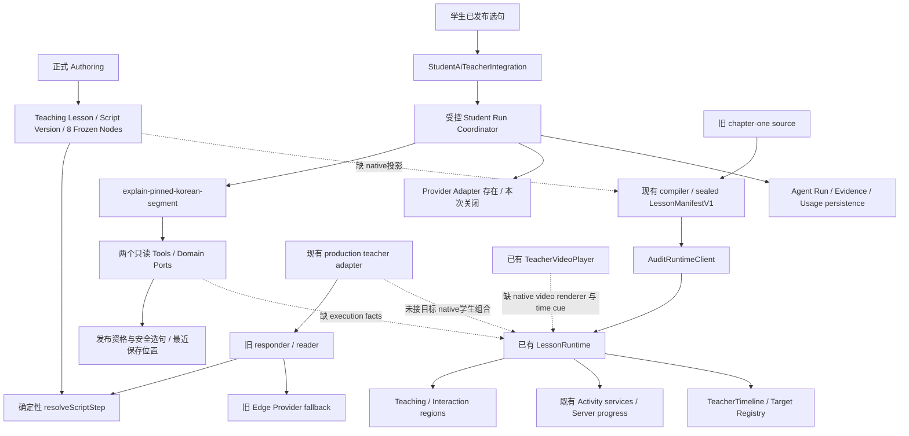
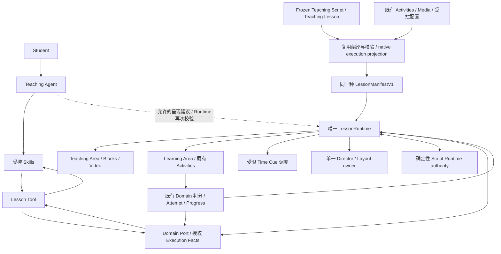

# Stage 1F-R7A — Teaching Agent Lesson Execution Foundation

## 1 Executive Summary

**Overall GO — 架构审计与执行合同设计完成，R7B可进入单独授权的MVP实施阶段。** 主线是UPLY Teaching Agent / AI韩语教师助手。R6F冻结内容当前独立只读复核VERIFIED：hangul-introduction、唯一version1 DRAFT、8节点及四目标全部不变。

已有的是受控选句解释Agent、确定性Script Runtime、LessonManifestV1、LessonRuntime组件、Activity/Progress域；缺的是把这些组件接成目标课程的唯一native执行链路。**不应再建Manifest、第二套Runtime、视频题库或视频进度系统。** Video的原生renderer尚未实现；活动完成到视频恢复的可靠合同尚未接通。

本报告的GO表示审计/设计完成，不表示Agent已能上课。Feature OFF，allowlists EMPTY，Provider/Agent本任务0，Stage1G NOT READY。

## 2 Teaching Agent Mainline

Student → Teaching Agent → Skill → Lesson Tool/Domain Port → Lesson execution facts → Runtime呈现 → 学生正式互动 → authoritative state → Agent下一次决策。

Skill定义如何完成教学任务，Teaching Script定义教什么和顺序。Tool是有输入/输出/权限/evidence合同的Agent能力，不等于HTTP API；Domain Port是域读取边界，不等于Tool。Agent可以解释或提出允许的呈现建议；不能任意写progression、correctness、progress、publish。Provider不是状态authority。未来互动视频只是在现有Lesson Runtime内增加按时间触发的呈现能力。

《V2》已在审计期间按用户提供路径完整读取，作为architecture reference，当前代码/schema/Agent不变量优先。逐项差异见[v2-reconciliation.json](evidence/teaching-agent-stage-1f-r7a/v2-reconciliation.json)。R6F历史中下一阶段旧名称保留，当前R7A及R7B名称按本次主线确定，不改写历史。

## 3 R6F Frozen Content Input

目标：韩文字母入门 / 第0章 / 课前导航，alias `hangul-introduction`。R6F baseline payload摘要、8节点完整行hash/updated_at、teacher-script与ko-KR字段hash、objectives及version行逐项与新READ ONLY结果核对。结果VERIFIED；不是只读历史PASS标签。

当前1 textbook、1 textbook version、1 chapter、1 module、1 teaching lesson、1 script version、8 script nodes；**digital_textbook_nodes=0、Activities=0、旧learning_agent_steps=0**。因此脚本冻结不等于存在可执行Activity或媒体链路。冻结为工程内容基线，数据库仍Draft，未Publish，不放宽StudentPolicy。

来源：[R6F报告](teaching-agent-stage-1f-r6f-final-teaching-script-review-content-freeze.md)、[freeze verification](evidence/teaching-agent-stage-1f-r7a/r6f-freeze-verification.json)、[只读关联审计](evidence/teaching-agent-stage-1f-r7a/database-reference-audit.json)。

## 4 Development-First Canonical Policy

NEW CONTENT / NEW VERSION / NEW RUNTIME PATH IS CANONICAL。为新目标复用成熟的domain/validator，不为旧开发数据增加dual execution、fallback或永久兼容路由。

KEEP / REPLACE / RETIRE / DELETE候选必须区分代码路径和数据对象。删除前要审计真实FK、publication pointer、session、runtime request、fence、history、assignment/progress/media及外部语义引用。本阶段只分类；没有删除或退役操作。无真实学生这一项目阶段事实，不等于所有已有引用都可忽略。

## 5 Current Teaching Agent Foundation

| Component | Status | Current evidence |
| --- | --- | --- |
| Agent Definition | FOUND | Code profile, frozen artifact digests, version refs and DB definition storage; agent_definition_versions currently 0. Code published label is not a published production definition. |
| Agent Runtime / Agent Run | FOUND | Student run coordinator: fenced admission, idempotency, bounded model/tool steps, checkpoints and terminal persistence |
| Skill Registry | FOUND | One selected-segment Korean explanation skill; versioned procedure, evidence and output contracts |
| Tool Registry | FOUND | Exactly two allowlisted read-only tools for student composition |
| Lesson Tool | PARTIAL | Published selected sentence/objectives plus optional last-saved teaching position |
| Provider Adapter | FOUND | DeepSeek server adapter with stream parsing, usage, abort/deadline, capability gate; live capability not tested here |
| Run persistence / state | FOUND | agent_* tables; admit/transition/event/usage RPCs; fence plus stateVersion; terminal states completed/failed/cancelled |
| Cancellation | FOUND | Transport persistent cancel RPC/checkpoint and active abort registry |
| Reconciliation | FOUND | 006 deadline-terminal-v1 bounded tenant/fence reconciliation RPCs and operator scripts |
| Feature flag / Allowlists | FOUND | Transport admission and page projection guarded; feature OFF and all three lists empty |
| Student policy | FOUND | Authenticated own student, tenant/app/enrollment/published chain/selection revision gates; no owner impersonation |
| Evidence persistence | FOUND | Versioned lesson/state evidence, trace events, mandatory lesson evidence and output guard |
| answer.final / finalization | FOUND | Validated answer only after terminal completion persistence; raw model deltas not trusted final answer |
| Script Runtime integration | PARTIAL | Student Agent reads safe published selection/state; deterministic resolveScriptStep exists separately |
| Lesson progression integration | PARTIAL | Script state machine and existing activity/node progress own state; AI explanation does not advance class |
| Old Learning Agent fallback | LEGACY | Respond API can call old learning-agent-runtime Edge function; existing caller references remain |

关键源码：[agent-run](../src/features/teaching-agent/server/runtime/student-run-coordinator.ts#L134)、[agent-profile](../src/features/teaching-agent/profiles/student-ai-teacher.ts#L1)、[skill](../src/features/teaching-agent/skills/explain-pinned-korean-segment/definition.ts#L6)、[persistence](../src/features/agent-core/persistence/supabase/repositories.ts#L49)、[cancel](../src/features/teaching-agent/server/transport/run-store.ts#L39)、[reconciler](../supabase/migrations/202609140006_agent_run_reconciliation.sql#L21)。FOUND指组件合同存在，不是生产调用验收。Agent definition代码中的published与DB definition发布是不同层；目前Agent五表均空。Provider adapter配置/能力声明也不代表真实模型调用已验证。

## 6 Agent Execution Gap

当前0 Run主要是明确的关闭策略：Feature OFF、三项allowlists EMPTY；此外该课version1 Draft没有published selection资格，也未准备目标定义/pins、Activity、native execution projection或真实Provider授权。

执行缺口有顺序：先补native投影、视频与Activity可靠闭环、progress恢复和受控runtime事实；再设计/绑定相应Skill与Tool版本；最后单独安排Provider policy、真实调用、单课授权及Agent E2E。不能通过绕过发布/学生策略或调用旧Agent API消除这些缺口。

完整Component / Current / Required / Gap / Stage矩阵见[agent-execution-gap.json](evidence/teaching-agent-stage-1f-r7a/agent-execution-gap.json)与第21节。

## 7 Lesson Tool

当前两个Tool不是整课控制器：

- `get_current_lesson_context`：已验证选句、lesson/module标题、objectives、contentVersion、locale与revision/evidence；不返回答案、raw config或相邻解释。
- `get_current_teaching_state`：明确语义为`last_saved_teaching_position`，返回本人active session最近保存的node/segment/phase，不是浏览器正在显示的位置；不返回activity、requiredTask或visualPlaybackPosition。

来源：[tool-contract](../src/features/teaching-agent/server/tools/contracts.ts#L20)、[lesson-port](../src/features/teaching-agent/server/domain-ports/current-lesson-read-port.ts#L7)、[state-port](../src/features/teaching-agent/server/domain-ports/teaching-state-read-port.ts#L8)、[policy-repository](../src/features/teaching-agent/server/repositories/supabase-student-teaching-repository.ts#L25)。

推荐在现有Domain Port边界定义versioned runtime-facts投影：opaque session、snapshot digest、script/node binding、authoritative state revision、当前Activity公开事实、完成摘要、允许的呈现请求、freshness/availability。视频位置若提供只能标为client observation。所有读取重核actor/tenant/lesson/snapshot；不携带答案或任意学生画像，不把Agent输入的ID当授权。

例：“这个字怎么组成？”→未来`explain_current_lesson` Skill（提案，当前不存在）→Tool读取Node2/6及正式状态→Agent生成解释/视觉提示建议→Runtime校验当前target和generation后呈现。自动判分、推进课程、发布均不由此Tool执行。

## 8 Teaching Script / Node Role

| Node | Formal Type | Frozen title | Future execution proposal |
| --- | --- | --- | --- |
| 1 | opening | 今天认识韩文字母 | teacher explanation; optional future video |
| 2 | explanation | 韩文字母怎么组成？ | text/visual letter assembly block for 가 |
| 3 | explanation | 先认识基础元音 | teacher explanation plus six-vowel visual |
| 4 | explanation | 再认识基础辅音 | teacher explanation plus eight-consonant visual |
| 5 | example | 把辅音和元音放在一起 | examples/optional future video; no audio correctness claim |
| 6 | explanation | 一个音节里面有什么？ | role/position visual for 가, 고, 한 |
| 7 | instruction | 一起试一试 | two future existing single_choice Activities; text stays frozen |
| 8 | summary | 今天学了什么？ | teacher summary text or future media |

Teaching Nodes继续是PEDAGOGICAL AUTHORING LAYER。一个Node可以对应多个执行Block/Activity/Cue；当前runtime Step通常对应module，不得把Node/Step/Block的ID或职责机械合并。尤其Activity真实FK指向digital_textbook_nodes，不指向learning_agent_script_nodes；目标还没有前者，未来要通过正式authoring提供最小合法绑定，不能伪造FK或直接把八节点迁成八个新表对象。

## 9 Current Lesson Runtime

已有[runtime](../src/features/smart-textbook-runtime/components/runtime-root.tsx#L20)导出`LessonRuntime`，严格验证manifest/context/capabilities；StepController持有active step、generation、abort/dispose，completion来自server，UI不能自授完成。[layout](../src/features/smart-textbook-runtime/components/template-renderer.tsx#L7)已有teaching/interaction区域。

原生renderer目前仅`text`与`multiple_choice`；兼容renderer另有`compat.learning.v1`、`compat.teacher.v1`。video/image/audio/pronunciation等即使schema声明存在，registry仍是unsupported。来源：[renderer-registry](../src/features/smart-textbook-runtime/core/block-registry.ts#L10)。

确定性[script-domain](../src/lib/learning-agent-script-runtime.ts#L336)处理explanation/task/task_feedback/question和正确答案/任务事件。它应作为域authority复用，不与LessonRuntime竞争。新Agent目前只是从这类状态读取证据。

本次路由追踪发现LessonRuntime具体调用者是AuditRuntimeClient及admin runtime-v1-preview；production services存在代码但注释/调用图未表明target-native学生路径已接入。[audit-route](../src/app/[space]/dashboard/admin/apps/[appSlug]/teaching-scripts/runtime-v1-preview/page.tsx#L5)、[learning-backend](../src/features/smart-textbook-runtime/server/production-learning.server.ts#L24)。本任务未打开这些运行页面，避免session/运行副作用。Lesson Runtime评价PARTIAL指目标接线，不是否认组件已存在。

## 10 Activity System

| Activity | Status | Current implementation / limit |
| --- | --- | --- |
| single choice | FOUND | Native MultipleChoiceBlock; existing ActivityExecutor；Server private index answer |
| fill blank | FOUND | Existing ActivityExecutor fill-group/compat learning；Server text/text_array normalization |
| sentence order | FOUND | Existing ActivityExecutor ordering；Server complete permutation check |
| listening | FOUND | Existing learning tools/media + activity forms；Server objective grading; ready audio required |
| speaking | FOUND | Existing recording workflow and ActivityExecutor；Open activity requirements + own recording evidence; not automatic pronunciation mastery |
| pronunciation | PARTIAL | Manifest schema/rubric and speaking evidence support; native pronunciation renderer unsupported；No verified independent automatic pronunciation evaluator in canonical path |
| AI dialogue | PARTIAL | Separate existing conversation/roleplay paths; manifest role_play declared unsupported；Not a canonical native no-provider Activity completion implementation |

单选数据库类型是`single_choice`，原生Block类型是`multiple_choice`，两者不可混淆。提交链：已有renderer → runtime Activity service →受权domain →私有answer key判定→`record_smart_textbook_attempt`/speaking记录→progress投影。[activity-domain](../src/app/dashboard/courses/[categorySlug]/[subcategorySlug]/[courseSlug]/[lessonSlug]/smart-textbook-submission.ts#L530)、[activity-renderer](../src/features/smart-textbook-runtime/components/activity-executor.tsx#L20)、[native-choice](../src/features/smart-textbook-runtime/components/choice-block.tsx#L9)。

`ActivityResult`已有ok、correct、attemptNumber、preview、nodeCompleted、completionPercent。ActivityForm有可选onResult，原生choice会refresh；**缺少与Cue/session/snapshot/generation相关联的可靠complete通知**。ok不是completed，correct也不等于整个step/lesson已完成。R7B核心要补completion receipt/readback，错误或不确定结果保持暂停。

现有提交函数仍有PGRST202 objective-attempt fallback。当前catalog确有原子RPC overload；新canonical路径应要求该RPC，缺失时fail closed，不复制旧兼容写路径。

## 11 Progress System

真实表是`digital_textbook_attempts`、`digital_textbook_node_progress`、`digital_textbook_activity_page_progress`、`digital_textbook_guided_repeat_progress`、`digital_textbook_speaking_evidence`；既有lesson/course进度另有aggregate职责。Script session/task events记录教学编排位置，不是视频专用进度库。[progress](../src/features/smart-textbook-runtime/server/progress-projection.server.ts#L18)验证actor/tenant/version并屏蔽private answer，StepController只接受服务端completedStepIds。

Runtime snapshot session可持久化并绑定内容；当前session issuer仍写死chapter-one scope。video sessionStorage位置与UI active step只是恢复提示，不是progress authority。后续扩展既有进度域/会话状态，禁止新增video_question_attempts、video_lesson_progress、video_activity_progress。

R7B不能只用前端Set证明durable完成，也不能把“学生看到哪里”当作已学习/掌握。对每次Activity submission需要明确请求关联、重复提交和UNKNOWN读取结果合同。

当前[learning-history](../src/features/smart-textbook-runtime/server/learning-history.server.ts#L48)会从同一Activity的persisted正确答案或meets_completion_requirements构造server.activityProgress。第一题可以完成而父node尚未完成，恢复视频不能等待整个父nodeCompleted。另一个实际缺口是server.revision目前赋值sourceRevision，表示内容修订，不是学生进度版本。R7B必须区分content revision、student-state evidence/revision与client generation；不能拿内容hash当progress CAS或新鲜度证明。

## 12 Video Capability

[video](../src/components/learning-agent/TeacherVideoPlayer.tsx#L6)已有HTML5 video、受控media route、play/pause、currentTime、duration、timeupdate、ended、native controls/位置恢复、loading/error；[video-binding](../src/lib/teaching-video.ts#L2)有媒体与transcript修订绑定。poster仅在manifest合同声明，当前player未接；原生video renderer和时间Cue闭环缺失。

重要风险：旧player“阅读文字后继续”也会发出ended状态。新canonical媒体adapter必须区分真实媒体ended、用户跳过和文字确认，不能把它们作为相同完成证据。只借用安全媒体/播放行为，不复制旧Agent fallback。

R7B用20–60秒本地开发视频验证执行；不生成金老师正式视频、不TTS、不Provider，不宣称音频教学质量已验证。

## 13 Director Runtime

[director](../src/lib/learning-agent-classroom-director.ts#L1)存在teacher_closeup、teacher_blackboard、learning_closeup、interaction、feedback；Script layout为split/learning/teaching，template另有split/stacked。V2所说teacher_focus等不是可以原样调用的当前enum。

MVP提案映射：teacher_focus→teaching/teacher_closeup；split→split/teacher_blackboard；learning_focus→learning/learning_closeup。scenario_focus后置。只有一个presentation owner决定布局，不把布局、播放和教学正确性混成大状态枚举。

[presentation-timeline](../src/features/smart-textbook-runtime/core/teacher-timeline.ts#L5)已有TeacherTimeline，负责server turn、speech/buffer、task/answer等待、pause/resume和generation；它不是通用currentTime Cue调度器。未来时间驱动能力接入同一LessonRuntime和target registry，不额外运行第二套进度调度器。

## 14 Lesson Manifest Assessment

**EXISTING — 复用LessonManifestV1，新增native projection能力而非第二个Manifest。** 当前合同包含snapshot/digest、step/block、media/activity/teaching/progress refs、layout、required capabilities及server completion authority。[manifest](../src/lib/smart-textbook-runtime-v1/contracts.ts#L1)、[manifest-validation](../src/lib/smart-textbook-runtime-v1/validator.ts#L6)。

当前[manifest-artifact](../src/lib/smart-textbook-publishing/artifact.server.ts#L22)输入`LegacyChapterOneSource`，loader与session issuer固定chapter-one，progress/services大量使用compat bindings；这是必须替换的目标接线缺口。不要把已有数据形状原封不动变成新永久兼容层。

推荐：Frozen Script+Teaching Lesson+已授权Block/Activity/media绑定+bounded Cue/layout metadata →现有compiler/projection/validator→同一种sealed Manifest→同一个LessonRuntime。public projection不含私有答案；private binding可由domain验证。Authoring DB仍是事实源，Manifest不允许编辑器、独立内容状态或另一套Publish。已有runtime publication pointer只是受控投影选择，不能自行绕开内容发布资格。

旧responder、StudentPolicy repository确有多张authoring表的server-side查询；应留在域授权/编译/投影边界，Agent与client不直接任意查询。

## 15 Timeline Cue Contract

| Field | Proposed contract |
| --- | --- |
| id | stable cue alias within sealed snapshot |
| sourceBlockId | existing bound video block ref |
| triggerType | time  /  ended |
| triggerTime | finite nonnegative seconds required only for time, within verified media duration |
| action | show_activity  /  show_block  /  change_layout |
| targetBlockId | bound current step activity/block; for layout use existing teaching/interaction region target |
| pauseSource | boolean; mandatory Activity cue true |
| resumePolicy | manual  /  after_authoritative_activity_completion |
| sortOrder | deterministic integer tie breaker |
| config | strict bounded layout enum only where action=change_layout; otherwise empty |

合同只包含WHEN / SOURCE / ACTION / TARGET / POLICY。第一版action严格show_activity、show_block、change_layout；不包含question正文、correct answer、prompt、student profile、adaptive decision或Provider config。引用在同一snapshot/step内校验并限制action能力；不接受任意DOM selector或跨课target。

MVP仅mock cues；本次不创建lesson_events/block_cues，不决定未来表名。V2的TeacherRuntimeCue/Timeline Event类比不能覆盖当前已有server turn Cue合同。

防重：key包含session/snapshot/step/media revision/cue；time crossing先原子标pending再pause/mount。forward seek检查所有跨过的必需未完成cue并停在最早一个；backward/replay不重复强制已完成cue。刷新恢复同一合法session、服务端completion和waiting cue，位置只是hint；expired scope fail closed。细节见[cue-dedupe-strategy.json](evidence/teaching-agent-stage-1f-r7a/cue-dedupe-strategy.json)。

## 16 Interactive Video as Agent Runtime Capability

一条执行链：video观察时间 → LessonRuntime保留cue/generation → pause →现有Learning Area显示Activity →官方domain提交/判定/进度→关联completion receipt →Runtime恢复同一media owner →Lesson Tool可读取新的正式事实→Agent后续解释/建议。

Runtime state proposal：ready → playing → cue_pending → awaiting_activity → checking_completion → resume_ready → playing。错误/不完整答案不离开等待；用户主动pause、autoplay失败保留暂停。媒体ended本身不完成Lesson；Lesson完成仍由domain政策判定。已取消/旧generation回调必须拒绝，避免React effect与video事件两个owner相互play/pause。

V2对照（完整四列事实矩阵）：

| Topic | Current Reality | V2 Proposal | Gap | Recommended Target |
| --- | --- | --- | --- | --- |
| 主线 / V2 §21 P9、§23–24 | Teaching Agent已有受控Skill/Tool/Run；整课执行尚未接通 | AI Teacher在视频执行阶段之后加入 | 不能把既有Agent降为独立播放器的最后插件 | 主线始终Teaching Agent；先补Lesson execution确定性合同，Provider调用后置，不重做Agent Foundation |
| Manifest / V2 §23 | LessonManifestV1、digest/validator/private binding/publication bundle已存在 | Manifest → Lesson Runtime | 缺的是native frozen-script编译和target binding，不是Manifest这个抽象 | 复用既有合同与publication seal；不另建Manifest编辑器/数据库/发布状态 |
| Layer / V2 §3–5、§10 | Teaching Script Node与digital_textbook_node是不同实体；当前Step通常对应module | Chapter/Lesson → Step/Module → Blocks/Activities | V2略过Teaching Lesson/Script Version/Node来源；不能把每个Node当成DBBlock | 补Frozen pedagogy来源和明确多对多执行映射；已有Activity FK仍须满足 |
| Runtime / V2 §16、§22 | 已有features/smart-textbook-runtime/RuntimeRoot、StepController、target registry | 新components/lesson-runtime目录和TimelineEngine示意 | 照目录重新搭建会制造第二套Runtime | 保留现有目录和唯一运行组合；在现有runtime owner下补time-cue能力 |
| Video / V2 §4、§21 P1 | TeacherVideoPlayer可play/pause/timeupdate；manifest video type已声明但native renderer unsupported | video block用src，播放器统一 | 示例src不是正式媒体授权合同；native接线缺失 | 沿用mediaRef/版本绑定/私有媒体授权；补原registry中的video实现，旧player只借用行为，不带旧Agent fallback |
| Activity / V2 §3、§20 | single_choice等已有domain/renderer；pronunciation、role_play原生renderer不支持 | 图上列出七类活动 | 类型列出不代表均可执行或接入统一完成 | R7B只用已有single_choice；其它分别FOUND/PARTIAL，未来同体系扩展 |
| Completion / V2 §7 | ActivityResult/onResult和server progress存在，但不直接通知时间Cue | activity_complete → play | 回调成功不等于正式完成，缺session/revision/重复响应处理 | 服务端completion确认+关联receipt；保持用户暂停；未完成或UNKNOWN不resume |
| Director / V2 §9 | shot modes及split/learning/teaching存在，template有split/stack | 可直接复用teacher_focus/split/learning_focus/scenario_focus | 命名不是当前真实enum；未验证统一动态状态 | 显式映射前三种，scenario后置；只有一个layout owner |
| Cue persistence / V2 §10–11、§21 P4 | 未发现独立通用时间Cue表/合同；已有TeacherRuntimeCue是另一概念 | 新增lesson_events或block_cues | 不能因为设计示意就新建表/再造事件库 | R7B用内存mock投影；后续需持久化时另行评估现有编排metadata与版本封存合同，本次不选择DDL |
| Cue actions / V2 §12–13 | 现有target commands需能力/step/generation校验 | 示例含hide、AI dialogue、scenario等扩展 | 第一版动作过多会混入业务/AI决策 | 仅show_activity/show_block/change_layout；不把答案、prompt、Provider/adaptation放入Cue |
| Progress / V2 §14、§21 P5 | digital_textbook_attempts/node_progress/page_progress等真实存在；script session存编排位置 | 通称student_attempts/lesson_progress/activity_progress | 不能据通称新建第二套表；完成authority不能等P5才定义 | 复用真实表/RPC；R7B就定义正式completion读取，video位置只作观察 |
| Dedupe / V2 §18 | generation lease与abort已存在，video位置sessionStorage | triggeredCueIds Set；初版刷新仅恢复lesson/step/time | Set丢失或forward seek可能跳过未完成活动 | scope化Cue identity；重建completion/waiting并验证snapshot；只恢复video time不足以签完整MVP |
| Lesson Studio / V2 §19–22 | 正式Authoring与冻结内容存在 | 未来timeline authoring UI | 不得另建题目编辑器或把冻结Node自动改成视频脚本 | Runtime稳定后复用官方Activity authoring与绑定；R7A/R7B不做完整后台 |
| AI access / V2 §14、§24 | Lesson Tool只提供已发布选句和最近保存位置 | AI读取学生看到哪里、答错题、口语等并作决策 | 不能直接扩成Agent任意表/学生画像读取 | 受控Domain Port/Tool只返回当次授权最小事实、来源和允许呈现动作；grading/progression仍属domain |

## 17 Node7 Activity Migration

**READY（仅迁移方案）。** 两题均映射现有single_choice：

| Activity alias | Public prompt/options | Private answer |
| --- | --- | --- |
| hangul-introduction-vowel-recognition | 哪个是元音？ㄱ / ㅏ / ㄴ | B.ㅏ，index1 |
| hangul-introduction-ga-combination | ㄱ+ㅏ组成什么？가 / 나 / 다 | A.가，index0 |

不创建Activity，不修改instruction类型或冻结正文。未来通过官方authoring建立现有Activity及其合法parent，与Node7显式关联。题面/选项进入公开投影，答案保留既有secret/服务端grade，feedback遵守提交后披露。

**冻结Node7主台词包含答案，不能直接整段投影给学生或Agent。** Frozen source不变；执行投影需明确选择公开字段，不把私有答案复制进Cue/Manifest/Tool。若未来要改原文则另开revision。R7B只验证一题的隔离fixture，第二题以后沿用相同系统；不是本阶段自动完成题目结构化。

## 18 Legacy / Old Content Assessment

| Object / Path | Role / Referenced by | Canonical | Decision | Dependency check |
| --- | --- | --- | --- | --- |
| R6F target canonical branch | CANONICAL; R6F freeze baseline, current Script Studio | True | KEEP | Verified unchanged full-row hashes |
| existing LessonManifestV1 / LessonRuntime / target registry | CURRENT SUPPORTING; audit route, runtime services | recommended execution foundation | KEEP / EXTEND NATIVE | Remove old adapter dependency from new composition, keep reusable authority/validation |
| existing Activity / Progress domain tables and RPCs | CURRENT SUPPORTING; current textbook pages, runtime services | True | KEEP | Native binding and atomic request contract |
| old learning-agent/respond -> learning-agent-runtime Edge function | LEGACY; old reader, production teacher adapter | False | REPLACE CANDIDATE | Caller/import/route inventory, active sessions and allowed deployed route removal scope; preserve deterministic resolveScriptStep separately |
| chapter-one legacy adapter / fixed loader / compatibility capsules | LEGACY; current compiler/publication bundles, audit runtime and production service adapters | False | REPLACE CANDIDATE | Native projection parity for authorized new content only; snapshot pointer/session/fence/history references before retiring old bundle |
| PGRST202 objective-attempt fallback | LEGACY; submitActivityInDomain | False | REPLACE CANDIDATE | Existing atomic RPC overload validated; canonical runtime must fail closed instead of compatibility writes |
| unretired old snapshot | CURRENT SUPPORTING; publication pointer, history, bindings, dependency fence, expired session rows | False | KEEP pending targeted retirement plan | Pointer currently 1, all session rows13 though active0; cannot assume unused |
| R6A retired old dependency snapshot | LEGACY; history2, binding1, fence1, retirement marker | False | DELETE CANDIDATE — conditional only | Pointer0/activeSession0/allSession0/runtimeRequest0, but history/bindings/fence references remain. Retention and full FK/semantic dependency disposition required before any approval. Preserve original under existing R6A scope now. |
| other old textbooks/chapters/versions/scripts/activity/demo content | UNCLASSIFIED CONTENT; legacy candidates require per-branch audit; 46 enumerated relevant FK definitions, possible publication/session/progress/assignment and media references | not inferred from name or age | KEEP pending exact dependency inventory | Do not select first textbook, read business rows, or call all old data disposable; no current target conflict/fence |

当前只读查询到两个旧snapshot：未退役那份pointer1、历史1、session总13/active0；已退役那份pointer0、session0、历史2、binding1、fence1；同教材未完成runtime request0。没有读取业务正文。相关FK定义46条已枚举。

**Legacy Delete Candidates=1（有条件的已退役snapshot候选）；Deletion-ready=0。** 它不是整本教材，也不是批准删除history/binding/fence。仍需保留策略与完整语义引用处置，再请求精确批准。当前有效pointer/snapshot保留；不因没有active session就删除。其它旧教材/版本/脚本/Activity/demo未逐branch证明可删，不能虚构删除数量；当前target active inconsistent fence0，无需为推进R7B先清理它们。

旧Learning Agent API和legacy chapter-one adapter是REPLACE CANDIDATE，当前仍有引用，因此不冒充UNUSED或删除就绪。

## 19 Current Architecture

以下为当前源码关系，不是目标设计；虚线表示尚未接通或仅preview/adaptor能力。

来源：[agent-ui](../src/features/teaching-agent/components/StudentAiTeacherIntegration.tsx#L12)、[agent-run](../src/features/teaching-agent/server/runtime/student-run-coordinator.ts#L134)、[old-agent-route](../src/app/api/learning-agent/respond/route.ts#L588)、[manifest-artifact](../src/lib/smart-textbook-publishing/artifact.server.ts#L22)、[runtime](../src/features/smart-textbook-runtime/components/runtime-root.tsx#L20)、[old-backend-adapter](../src/features/smart-textbook-runtime/server/production-teacher-agent.server.ts#L11)。图中旧fallback是风险事实，不是推荐链路。Feature OFF只证明Teaching Agent transport关闭，不构成全站旧AI接口的总开关；本任务这些接口均未调用。

## 20 Target Architecture

这是composition目标，不能把图的箭头理解为Agent经Tool直接操纵数据库/播放或改变grade。Manifest提供静态执行事实，Domain提供正式状态，客户端播放观察单独标注；Tool只取得授权最小投影。Script Runtime为LessonRuntime内使用的域状态机，不是第二个学生执行入口。旧AI responder/旧runtime fallback不进入这条链。

保持ONE Agent execution path、ONE Lesson Runtime、ONE Activity system、ONE Progress authority、ONE canonical content path；复用代码不等于保留旧数据兼容需求。

## 21 Gap Matrix

| Component | Current | Required | Gap | Stage |
| --- | --- | --- | --- | --- |
| Agent Definition | FOUND — Code profile, frozen artifact digests, version refs and DB definition storage; agent_definition_versions currently 0. Code published label is not a published production definition. | Approved lesson-specific definition/pins only in later authorized stage | No admitted target definition/pins | After execution MVP |
| Agent Runtime / Agent Run | FOUND — Student run coordinator: fenced admission, idempotency, bounded model/tool steps, checkpoints and terminal persistence | Consume authoritative whole-lesson facts without becoming progression authority | Only explain_segment intent today | R7B facts seam; later Agent E2E |
| Skill Registry | FOUND — One selected-segment Korean explanation skill; versioned procedure, evidence and output contracts | Lesson-scoped explanation/adaptive presentation skills | No execute-a-lesson skill; script is not a skill | After R7B |
| Tool Registry | FOUND — Exactly two allowlisted read-only tools for student composition | Versioned lesson execution facts tool(s) | Activity/runtime allowed-action facts not exposed | R7B read-port contract; later tool version |
| Lesson Tool | PARTIAL — Published selected sentence/objectives plus optional last-saved teaching position | Current bound node/activity/progress/runtime generation/allowed presentation requests | No live execution projection or authoritative activity completion context | R7B |
| Provider Adapter | FOUND — DeepSeek server adapter with stream parsing, usage, abort/deadline, capability gate; live capability not tested here | Separately approved provider policy and live test after execution works | Existence is not live readiness | After R7B |
| Script Runtime | FOUND — resolveScriptStep explanation/task/task_feedback/question with task and answer gates | Retain deterministic domain authority | Old API transport coupling | R7B |
| Teaching Script / Nodes | FOUND — Target one draft version, eight immutable pedagogy nodes; not runtime blocks | Frozen source plus explicit node-to-execution bindings | No generated execution target yet | R7B |
| Lesson Manifest | FOUND — LessonManifestV1 strict schema plus validator, digest, publication bundle and private bindings | Reuse this contract with native frozen-script projection | Compiler/loader and service bindings coupled to legacy chapter-one source | R7B |
| Lesson Runtime | PARTIAL — RuntimeRoot exported as LessonRuntime; steps, services, target registry and fail-closed capability validation exist | One canonical native execution composition for target | Concrete current UI caller is audit preview, target-native production composition not wired | R7B |
| Teaching Area | FOUND — Template teaching region plus text and compat.teacher renderers | Native text/video presentation | Native video renderer missing | R7B |
| Learning Area | FOUND — Interaction region, native MultipleChoiceBlock and ActivityExecutor | Use same region/activity services | Need cue reveal and correlated completion notification | R7B |
| Video | PARTIAL — HTML5 TeacherVideoPlayer plus media bindings; manifest video contract only | Native video block registered in existing runtime | Native renderer unsupported; no timed cue coordinator hookup | R7B |
| Timeline Cue | MISSING — TeacherTimeline exists for server teaching turns and speech/task phases | Bound media-time cue with 3 presentation actions | Existing TeacherRuntimeCue is not temporal cue; no generic time-trigger contract | R7B |
| Director | PARTIAL — Existing split/learning/teaching and classroom shot modes; split/stack template | Map three MVP focus states to existing layout authority | No unified bounded layout command in canonical video flow | R7B |
| Cue dedupe / Seek | MISSING — Generation/abort target registry exists, no completed time-cue ledger | Session/snapshot cue identity plus authoritative completion reconciliation | Replay/seek/refresh semantics not linked | R7B |
| Refresh restore | PARTIAL — Opaque persisted snapshot session, server progress projection, UI step/sessionStorage video position | Restore same snapshot and waiting/completed activity phase | No cue-aware restore; service bindings still chapter-one | R7B |
| Activity Completion | PARTIAL — Server result/progress and some callbacks exist | Correlation/idempotency and verified complete->resume | No unified completion receipt in native renderer | R7B |
| Progress | FOUND — One existing activity progress family and script orchestration state | Native bindings and formal completion policy | Compat history projection not target-native | R7B |
| Feature enable | FOUND — OFF and lists empty | Separate production approval after prerequisites | Intentionally not authorized | After execution and provider/policy verification |

补充Gap：`Runtime state evidence revision`当前PARTIAL。现有内容sourceRevision不能证明学生状态变化；R7B需在既有state projection/receipt里给出明确的正式状态证据语义，来源learning-history.server.ts与core/services.ts，不另建progress系统。

## 22 Risk Register

| ID | Risk | Severity | Required mitigation |
| --- | --- | --- | --- |
| R1 | Agent arbitrary authoring DB access | HIGH | Tool contracts provide narrow published evidence; reject raw queries/new universal tool |
| R2 | Node confused with Block/Activity parent | HIGH | Explicit projection mapping; frozen pedagogy unchanged; satisfy existing activity FK with authorized authoring |
| R3 | Dual Runtime | HIGH | Reuse LessonRuntime and deterministic Script Runtime domain under one orchestration; no parallel player-owned progress |
| R4 | Second Activity system | HIGH | Reuse existing single_choice and server grader; no video questions table |
| R5 | Second Progress system | HIGH | Existing authoritative attempts/node progress; video time only observation |
| R6 | Old Agent fallback | HIGH | New composition must not invoke productionTeacherAgentAdapter -> old responder -> Edge Provider |
| R7 | Cue duplicates and stale callbacks | HIGH | Scoped identity, pending-before-async, generation lease, once-only completion handling |
| R8 | Seek skipping required Activity | HIGH | Crossing scan and earliest unsatisfied mandatory cue |
| R9 | Refresh loses waiting Activity | HIGH | Same snapshot session restore and server progress reconstruction; no silent re-admission |
| R10 | Activity result does not prove completion | HIGH | Server completion receipt/readback; wrong/incomplete/unknown stays paused |
| R11 | Video/React competing state owners | MEDIUM | One media owner; React reflects actual events, runtime issues serialized commands |
| R12 | Director state explosion | MEDIUM | Three layout modes only; scenario deferred; separate playback state from layout |
| R13 | AI logic or answers in Cue | HIGH | Strict WHEN/SOURCE/ACTION/TARGET/POLICY; no prompt/correct answer or adaptive policy |
| R14 | Manifest becomes second authoring authority | HIGH | Reuse immutable projection + existing publish binding, no editor/independent publish state |
| R15 | Legacy data forces permanent compatibility | MEDIUM | Native new scope canonical; conditional retire/delete after complete dependency audit |
| R16 | Frozen Node7 answer leakage | HIGH | Public Activity prompt projection separate from private answer; Agent tool does not receive authoring answer text |
| R17 | Draft executed as published student content | HIGH | Isolated nontracking fixture R7B; production published-only StudentPolicy unchanged |
| R18 | RPC-missing fallback and uncertain submit duplicates | HIGH | Require atomic RPC; define request idempotency/readback before retry; no automatic retry |
| R19 | Renderer declared but not implemented | HIGH | Keep capability validation fail-closed; add native video only after tests in future stage |

以上均为发现/设计约束，R7A未实施修复。活动完成、refresh恢复、answer leakage、旧fallback、RPC缺失兼容写路径应列为R7B验收用例，不能仅靠演示happy path消除。

## 23 R7B MVP

**R7B — Teaching Agent Lesson Execution MVP：READY FOR SEPARATELY AUTHORIZED IMPLEMENTATION。**

只做以下有界组合：

1. Define one native frozen-node execution projection into existing manifest; bind Node5 explanation and one Node7 Activity fixture without editing frozen content
2. Provide one 20–60 second local development video and minimal native video renderer in existing registry; no formal teacher video or Provider generation
3. Bind one existing-type single_choice Activity fixture with private grader; no new Activity/Progress schema
4. Add one mock timed cue through same runtime owner: pause, reveal Activity, server result/readback, resume
5. Expose runtime fact read-port projection for future Lesson Tool integration; no real Agent Run or new model skill execution
6. Validate dedupe/seek/reload/abort and same-session state restoration; document isolated fixture limitations

验收必须包括：play→time cue→pause→Activity→domain completion确认→resume；重复timeupdate不重触发，错误答案/UNKNOWN不resume，seek forward不越过必需题，backward不重做完成题，refresh保留同snapshot waiting/completed事实，旧generation callback无效，用户pause/autoplay失败不被强制覆盖，Tool事实读口不能暴露答案。

使用本地/完全隔离fixture及既有domain/RPC隔离测试；若仅mock服务端结果，必须标fixture，不能声称生产durable progress已验证。Runtime facts seam可以无Provider验证，R7B不需要真的运行Teaching Agent或新增整课Skill。没有正式Publish、目标生产Activity写入、真实Student admission或旧内容清理的隐含授权。

排除完整金老师视频、AI dialogue、scenario模式、完整Timeline编辑器、新进度库、真实Provider、Agent enable。R7A未开始R7B。

## 24 Stage1G Readiness Gap

Stage1G仍NOT READY。后续至少需：

1. 同一canonical LessonRuntime完成native投影、Activity判定、时间交互、progress恢复与异常处理验证。
2. Lesson Tool能取得有来源/版本的正式runtime事实；新Skill/Tool/Profile组合审查通过，无任意域写入。
3. 内容/Activity/media经正式Review、Validation与单独Publish授权；当前冻结Draft不能被当成已发布。
4. 单课学生资格、本人session/tenant/course边界、definition与selection pins及allowlist策略另行授权；不冒用Owner。
5. Provider policy与真实调用在明确范围内另行验证，再做Agent教学E2E；不能用旧Learning Agent路径冒充新Agent成功。
6. Feature enable、operations/取消/对账流程与Pilot明确审批。R7A不会自动触发以上步骤。

## 25 Production End-State

独立READ ONLY开始/结束核验见[production-end-state.json](evidence/teaching-agent-stage-1f-r7a/production-end-state.json)：PG17.6、ledger457/latest202609140007、Build 6IhDHN8Dm1nCewiCEZnV5、PM2 online；canonical链1、version1 draft、nodes8/order1–8、active inconsistent fences0、Agent五表0。Feature OFF，allowlists EMPTY。

冻结节点/目标/版本行与R6F及本阶段开始完全相同；canonical全行指纹、无关内容metadata/count和Foundation schema指纹不变。Runtime/launcher/Tailscale SHA和PM2元数据保持不变。

Product Code Writes0；DB Writes0；Migration0；Deploy0；Runtime/PM2/Launcher/Tailscale/Auth Mutation0；Agent Run0；Provider Requests0；Publish0；Pins创建0。Provider/Agent/Pins操作计数限定本任务，未伪造全站历史活动审计。只新增R7A报告/evidence；V2是用户在审计期间提供的文件，作为外部输入记录，不是本任务产品修改。

## 26 Gate Matrix

| Gate | Check | Status |
| --- | --- | --- |
| G-R7A-1 | R6F Freeze Verified | PASS |
| G-R7A-2 | Teaching Agent Mainline Locked | PASS |
| G-R7A-3 | Development-First Policy Applied | PASS |
| G-R7A-4 | Agent Foundation Audited | PASS |
| G-R7A-5 | Agent Execution Gap Defined | PASS |
| G-R7A-6 | Lesson Tool Audited | PASS |
| G-R7A-7 | Teaching Node Role Defined | PASS |
| G-R7A-8 | Lesson Runtime Audited | PASS |
| G-R7A-9 | Activity System Audited | PASS |
| G-R7A-10 | Progress System Audited | PASS |
| G-R7A-11 | Video Capability Audited | PASS |
| G-R7A-12 | Director Runtime Audited | PASS |
| G-R7A-13 | Manifest Assessed | PASS |
| G-R7A-14 | Cue Contract Proposed | PASS |
| G-R7A-15 | Node7 Migration Assessed | PASS |
| G-R7A-16 | No Second Activity System | PASS |
| G-R7A-17 | No Second Progress System | PASS |
| G-R7A-18 | No Dual Runtime | PASS |
| G-R7A-19 | No Old Agent Fallback | PASS |
| G-R7A-20 | Legacy Candidates Classified | PASS |
| G-R7A-21 | R7B Agent MVP Defined | PASS |
| G-R7A-22 | Stage1G Gap Defined | PASS |
| G-R7A-23 | Product Source Read Only | PASS |
| G-R7A-24 | DB Read Only | PASS |
| G-R7A-25 | No Migration | PASS |
| G-R7A-26 | No Deploy | PASS |
| G-R7A-27 | No Agent Run | PASS |
| G-R7A-28 | No Provider | PASS |
| G-R7A-29 | Feature OFF | PASS |
| G-R7A-30 | Content Freeze Unchanged | PASS |
| G-R7A-31 | Evidence Boundary | PASS |

G18/G19签署单执行链路目标合同，并不声称历史旧路由已删除；其当前存在及替换风险已明确记录。Gate评估的是本次审计/设计闭环，不把PARTIAL运行能力虚报为已实现。文件范围、JSON parse、helper syntax、secret/raw-ID scan与git diff --check结果保存在workspace-scope.json。

## 27 Final Recommendation

保持Teaching Agent为主线，批准下一阶段时以“复用现有LessonManifestV1 / LessonRuntime / Activity / Progress，补native projection与可靠complete→resume合同”为范围。V2的单系统方向采纳，理想组件名称/新增表/AI后置顺序按真实Agent架构调整；不新造独立互动视频子系统。

Frozen Teaching Script保持不变。R7B设计包READY，Stage1G NOT READY。本阶段到此停止，不创建VideoBlock、Cue、Activity或Manifest，不运行Agent、Provider、Publish或Feature enable。
