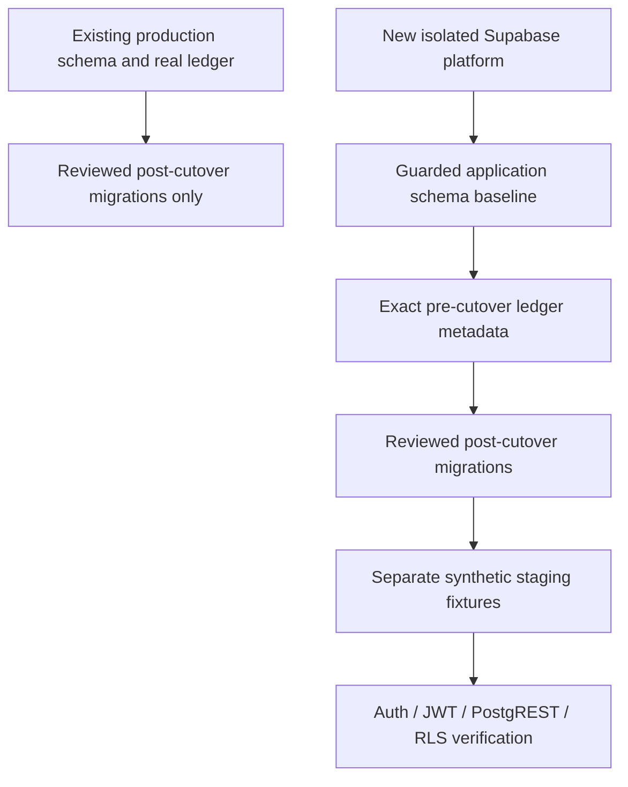

# UPLY application baseline bootstrap

**NEVER APPLY TO EXISTING PRODUCTION DATABASE.** This directory is outside the
Supabase incremental migration runner. It is the schema-only starting point for
new environments, not a migration to install on an existing deployment.

The authoritative cutover version/name, source snapshot digest, exact ledger and
reviewed incrementals are in `baseline-manifest.json`. The current cutover is
`202609130003 / runtime_authoring_nonretryable_error`. Historical SQL remains
audit history; its known external published-content dependency is not repaired.

## Two execution paths



Production must receive neither baseline SQL nor baseline ledger metadata. No
tool in this package accepts a remote database URL, connection string, target
container, port or credentials. Verifiers create and remove only their own
network-none, tmpfs PostgreSQL containers with no host data mount or public port.

## Artifacts and ownership

- `app-schema-baseline.sql`: generated schema only for `public`, `private`,
  `recording_private`, `runtime_publish_private`; includes application functions,
  tables, types, views, indexes, constraints, sequences, RLS, policies, grants,
  triggers and the `ensure_rls` event trigger.
- App attachments on platform tables: two Auth user triggers, eight Storage
  policies, two Realtime policies. Their table definitions remain platform-owned.
- `migration-ledger-baseline.json`: exact production **version/name** metadata,
  not business data, not a claim that new environments executed those old scripts.
- `baseline-manifest.json`: hashes, cutover, counts, ownership exceptions,
  platform prerequisites and the complete reviewed incremental sequence.
- `orphan-migration-decisions.json`: two local-only changes reissued after the
  cutover; original bytes remain at the referenced archive paths. They are not
  inserted into the pre-cutover ledger.

Full Supabase must first provide managed Auth, Storage, Realtime, extension and
role infrastructure compatible with the snapshot. The manifest also lists the
snapshot's platform extensions and publications; app membership of
`supabase_realtime` must be retained. The four application schemas
must be empty. Baseline SQL requires session setting
`uply.bootstrap_mode = 'new-environment'` and refuses existing application
relations or a populated migration ledger. It runs in a transaction. This guard
is defense in depth; it is not authorization to run the SQL against production.

There are no business rows, Auth users, credentials, control singleton rows,
Agent definitions, enrollments, question banks or course content in this baseline.
Stored function bodies retain their existing SQL implementation; DML inside a
function definition is not executed during schema installation. Operational
singleton/seed data must be independently reviewed if a future fixture needs it.

## Reproduce offline

Use a private local schema-only `schema.dump` and a `--no-role-passwords`
`roles.sql`. Take read-only version/name catalogs before and after acquisition;
never provide a production URL to the generator. `generatedAt` is the recorded
UTC snapshot acquisition timestamp, reused during regeneration.

```bash
python3 scripts/build-supabase-app-baseline.py \
  --snapshot /tmp/PRIVATE_SNAPSHOT/schema.dump \
  --ledger-before /tmp/PRIVATE_SNAPSHOT/before.json \
  --ledger-after /tmp/PRIVATE_SNAPSHOT/after.json \
  --generated-at SNAPSHOT_UTC_TIMESTAMP \
  --output /tmp/NEW_BASELINE_OUTPUT

python3 scripts/verify-supabase-baseline.py \
  --mode compare --snapshot-dir /tmp/PRIVATE_SNAPSHOT \
  --artifact-dir supabase/bootstrap --output /tmp/NEW_COMPARISON_OUTPUT
```

`compare` restores two independent disposable databases. The target-upgrade path
restores the complete current schema and installs only incrementals. Its baseline
attempt is a **negative guard test** that must reject without changing schema.
The baseline-fresh path restores only platform schema prerequisites from the
schema-only snapshot, then baseline + exact ledger + incrementals. Platform
restoration here is a PostgreSQL stand-in, **not a full Supabase stack**.

Normalized comparison covers both cutover and final state, excluding OIDs. It
checks columns/types/defaults, constraints/FKs, indexes, function definitions and
arguments, SECURITY DEFINER/search_path, triggers, policies/RLS, owners/ACLs,
default grants, views, sequences, inheritance and app event triggers. Both paths
verify empty application tables, five Agent tables, guarded RPC properties and
a local synthetic Auth insert/profile-trigger check that is rolled back.

The disposable clone is schema-only, so the verifier restores exact ledger
metadata as a **test fixture**. Real production already has its own ledger and
does not execute this metadata step.

Post-baseline migration execution uses normal ordered SQL execution followed by
successful version/name ledger recording in the disposable runner. It does not
mark unapplied incrementals as applied. Actual Supabase CLI/PostgREST integration
is part of R2, not proven by this runner.

```bash
python3 scripts/verify-teaching-agent-release-migrations.py \
  --mode full-history --snapshot-dir /tmp/PRIVATE_SNAPSHOT \
  --output /tmp/NEW_LEGACY_PROOF
```

The historical verifier retains the frozen R1 inventory and archive hashes.
It exits **1**, with `LEGACY_HISTORY_NOT_SELF_CONTAINED`, only for the exact
known migration/reason and preceding 286 successful steps. Any different failure
is `UNEXPECTED_HISTORY_FAILURE`. The unittest harness accepts only that exact
known result; the legacy verifier itself never returns success for a failed chain.

## R2 handoff — plan only, not executed

R2 requires separate authorization to provision a uniquely named disposable full
Supabase stack with unused ports and independent volumes. Do not reuse the local
UPLY stack, target production, start a permanent service or create a cloud project
as a side effect of this package.

1. Record the baseline/ledger/incremental digests. Confirm production cutover has
   not moved using read-only catalog verification. If it changed, stop and
   regenerate/review; do not relabel an older baseline.
2. Provision Auth, PostgREST, API gateway and PostgreSQL in a **new isolated
   working directory**. Initially keep its application migrations empty so the
   CLI does not automatically replay the old data-dependent history. Verify its
   project identity, ports, empty app schemas and independent storage. Keep
   production credentials unavailable to that environment.
3. Validate platform roles, extensions and dependencies against the manifest.
   Apply guarded app baseline to that new environment only. Initialize exact
   version/name ledger metadata from the baseline JSON; leave historical
   statements empty. Do not invent versions or mark the two old local-only
   versions applied.
4. Bring in the reviewed migration files. Reconcile the actual CLI ledger so
   every retained pre-cutover file matches version/name and only the five listed
   incrementals are pending. Apply those normally, in order. Refuse extra pending
   files, missing history, hash changes or a different cutover. Verify schema
   fingerprints and owner/ACL adaptations before creating fixture data.
5. In a **separate fixture**, create tenants A/B; A1/A2/B1 students; a teacher and
   tenant admin/owner roles for negative cases. Create identities through that
   stack's real Auth service; use real locally issued JWTs through PostgREST,
   not fabricated claims, a SQL bridge or production students.
6. Create the minimum canonical catalog ancestors, Korean student app, active
   tenant/app memberships and enrollments, and a new synthetic course with an
   **immediate-unlock** lesson. Create an independently published textbook,
   version/chapter/module, learning agent profile, teaching lesson, script
   version/node and segment using `저는 학생입니다.`. Keep fixtures separate
   from baseline and real course material. See Stage1F-R1 §20 and
   `tests/fixtures/teaching-agent/student-runtime.mjs` for domain dependencies.
7. If state Tool coverage needs a teaching session, create only the synthetic
   student's correctly linked session; pin a tenant-scoped Agent definition
   manifest compatible with current Core. Do not change StudentTeachingPolicy,
   support prerequisite-based lessons or activate old Agent fallbacks.
8. Verify JWT/RLS isolation for anon, expired JWT, A1→A2, A→B, wrong active
   tenant, teacher/admin, inactive enrollment, unpublished/mismatched content.
   Test approved selection pins, admission, GET/cancel recovery while OFF,
   zero teaching-domain changes and sensitive-output exclusions. The baseline
   package does not grant authority to enable the production flag or call a live
   Provider. Provider choice/test authorization is a separate R2 decision.
9. Validate actual API proxy transport and end-to-end deadlines, then stop and
   delete only the newly owned stack/volumes/fixtures. Record safe evidence. No
   production deployment follows automatically from R2 readiness.

The R1B report records the precise observed test results and remaining production
gates. Schema equivalence is not proof of real Auth/JWT/PostgREST/RLS behavior,
existing production data compatibility, runtime readiness or release permission.
